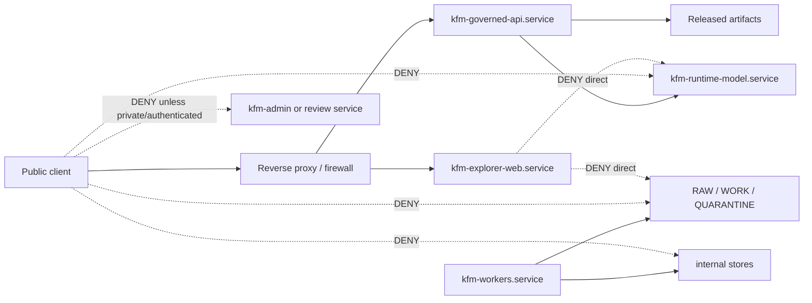

<!-- [KFM_META_BLOCK_V2]
doc_id: kfm://doc/infra-systemd-readme
title: infra/systemd/ — systemd Service Units, Local Runtime Boundaries, and Host-Service Hardening
type: per-directory-readme
version: v1
status: draft
owners:
  - <infra-steward>
  - <security-owner>
  - <ops-steward>
created: 2026-07-03
updated: 2026-07-03
policy_label: public
related:
  - infra/README.md
  - infra/hardening/README.md
  - infra/hardening/CHECKLIST.md
  - infra/reverse_proxy/
  - infra/firewall/
  - infra/vpn/
  - infra/docker/
  - infra/compose/
  - infra/kubernetes/
  - infra/terraform/
  - configs/
  - runtime/
  - apps/governed-api/
  - apps/explorer-web/
  - apps/workers/
  - docs/doctrine/directory-rules.md
  - docs/security/README.md
  - docs/security/EXPOSURE_PLAN.md
  - docs/security/INCIDENT_RESPONSE.md
  - docs/security/KEY_ROTATION.md
  - docs/architecture/deployment-topology.md
  - docs/runbooks/
  - policy/
  - release/
  - data/published/
tags:
  - kfm
  - infra
  - systemd
  - service-hardening
  - local-runtime
  - deny-by-default
  - least-privilege
  - auditability
  - rollback
notes:
  - "systemd files are host-service deployment mechanics. They must not become policy authority, secret storage, runtime code, release authority, or a bypass around governed APIs."
  - "Services must preserve KFM boundaries: public clients do not reach RAW, WORK, QUARANTINE, internal stores, direct model endpoints, source credentials, or steward/admin paths."
[/KFM_META_BLOCK_V2] -->

<a id="top"></a>

# `infra/systemd/` — systemd Service Units, Local Runtime Boundaries, and Host-Service Hardening

> **One-line purpose.** Define how KFM systemd services are named, bounded, hardened, reviewed, logged, restarted, and rolled back without bypassing KFM evidence, policy, release, or public-exposure controls.


---

## Quick jump

[Purpose](#purpose) · [Status & authority](#status--authority) · [Repo fit](#repo-fit) · [What belongs here](#what-belongs-here) · [What does not belong here](#what-does-not-belong-here) · [Service boundary model](#service-boundary-model) · [Unit expectations](#unit-expectations) · [Proposed structure](#proposed-structure) · [Validation](#validation) · [Review burden](#review-burden) · [Open verification](#open-verification)

---

## Purpose

`infra/systemd/` is the host-service lane for KFM deployments that use systemd. It may hold service unit templates, timer units, socket units, environment-file templates, service hardening notes, restart policy notes, log/journal guidance, local runtime boundaries, validation notes, and rollback guidance.

This folder exists because KFM service processes must preserve the same trust membrane as the API, UI, pipelines, and release system:

```text
RAW -> WORK / QUARANTINE -> PROCESSED -> CATALOG / TRIPLET -> PUBLISHED
```

A systemd unit must not turn a local machine into an ungoverned shortcut. Services must run with least privilege, read only what they need, write only where they are allowed, expose only reviewed ports, and keep model runtimes, raw data, source credentials, admin surfaces, and internal stores away from the public path.

[Back to top](#top)

---

## Status & authority

| Field | Value |
|---|---|
| **Document type** | Per-directory README |
| **Owning responsibility root** | `infra/` |
| **Subpath role** | `systemd/` — systemd service units, timers, sockets, local process boundaries, restart behavior, journal/log posture, and service-hardening guidance |
| **Authority level** | Draft deployment guidance. KFM doctrine, accepted ADRs, `policy/`, release gates, and service implementation contracts outrank this README. |
| **Lifecycle phase** | n/a — host-service deployment mechanics, not lifecycle data |
| **Default posture** | Least privilege, deny-by-default exposure, no raw/public path, no direct model/public path, audited operations |
| **Owners** | `<infra-steward>`, `<security-owner>`, `<ops-steward>` — fill from CODEOWNERS when assigned |
| **Reviewers required** | Infra steward + security owner for any unit, timer, socket, environment, port, secret, model-runtime, raw-data, admin, or public-exposure change |
| **Directory Rules basis** | `infra/` owns deployment, host, network, and exposure posture; `systemd/` is a named lane under the expected `infra/` tree. |

[Back to top](#top)

---

## Repo fit

```text
Kansas-Frontier-Matrix/
└── infra/
    ├── README.md
    ├── docker/
    ├── compose/
    ├── reverse_proxy/
    ├── vpn/
    ├── firewall/
    ├── systemd/          ◀── you are here
    │   └── README.md
    ├── kubernetes/
    ├── terraform/
    └── hardening/
```

### Responsibility split

| Location | Owns | Does not own |
|---|---|---|
| `infra/systemd/` | Service unit templates, timer/socket units, host-service hardening notes, restart behavior, journal/log posture, local runtime service boundaries | Application implementation, policy semantics, real secrets, release decisions, schemas |
| `infra/hardening/` | Cross-infra hardening checklist and review discipline | Concrete unit templates unless delegated here |
| `infra/reverse_proxy/` | Public-edge routing and HTTP/TLS/CORS behavior | Host service lifecycle |
| `infra/firewall/` | Host/network firewall rules | Service-unit semantics |
| `infra/vpn/` | Steward-only private access path | Public service exposure |
| `runtime/` | Runtime/model adapters and local runtime implementation | systemd unit ownership |
| `apps/governed-api/` | Trust membrane application behavior | systemd service configuration |
| `apps/workers/` | Worker application code | host-service hardening |
| `configs/` | Non-secret templates and examples | Real secrets or production env files |
| `policy/` | Enforceable allow / deny / restrict / abstain decisions | service unit mechanics |
| `release/` | Release decisions, manifests, rollback cards, corrections | systemd unit files |

[Back to top](#top)

---

## What belongs here

Use `infra/systemd/` for systemd-specific deployment materials such as:

- `*.service.example`, `*.timer.example`, and `*.socket.example` templates.
- Service hardening guidance for `apps/governed-api/`, `apps/explorer-web/`, `apps/workers/`, local runtime adapters, validation jobs, and background maintenance tasks.
- Local-only model-runtime service boundary notes.
- Environment-file templates that contain variable names only, not live values.
- Restart, watchdog, dependency, and ordering notes.
- Journal/logging expectations and redaction guidance.
- Least-privilege user/group guidance.
- File-system access notes: read-only mounts, writable directories, denied lifecycle paths.
- Port/listener notes and local binding expectations.
- Timer-unit guidance for scheduled validation, watcher, or maintenance runs that emit receipts or reports without publishing.
- Service validation notes and sanitized `systemctl` / `journalctl` examples.
- Rollback notes for unit changes.

Accepted file types are Markdown, sanitized systemd templates, non-secret environment templates, validation notes, and rollback notes. Live unit files may be committed only when they are portable and contain no host-specific secrets or private paths.

[Back to top](#top)

---

## What does not belong here

Do **not** use `infra/systemd/` as a hidden control plane.

The following must not live here:

- Real secrets, API keys, private keys, certificates, tokens, passwords, `.env` files, production environment files, source credentials, or private kubeconfigs.
- Raw source data, WORK data, QUARANTINE data, published artifacts, catalog records, triplets, proofs, receipts, or release manifests.
- Policy bundles or Rego rules that belong in `policy/`.
- JSON Schemas or machine contracts that belong under `schemas/contracts/v1/...`.
- Application source code for `apps/`, library code for `packages/`, or runtime implementation code for `runtime/`.
- Release decisions, rollback cards, correction notices, publication approvals, or promotion receipts.
- Public model-runtime service exposure.
- Public raw-data or internal-store exposure.
- Broad root-running unit files without justification.
- Unredacted incident data, exploit payloads, private hostnames, internal IP inventories, or unfixed vulnerability working notes.

If secret or sensitive operational material is committed here, treat it as a security incident: rotate, audit, remove, and record the response through the incident/runbook process.

[Back to top](#top)

---

## Service boundary model

systemd units must preserve the KFM trust membrane at the process level.



### Required service-level guarantees

A systemd deployment is not acceptable until it can show these negative states:

1. Public traffic does not reach direct model-runtime services.
2. Public traffic does not reach RAW / WORK / QUARANTINE paths.
3. Public traffic does not reach internal/canonical stores.
4. Public traffic does not reach admin/review services unless private, authenticated, and audited.
5. Browser-facing services do not directly read model runtimes, source credentials, raw stores, or internal stores.
6. Worker services do not publish by themselves; they emit receipts, candidates, reports, or artifacts for governed review.
7. Timer services do not silently mutate release state without promotion gates.
8. Missing evidence, policy, or release closure results in DENY or ABSTAIN at the governed API, not an infra bypass.

[Back to top](#top)

---

## Unit expectations

### Naming

Use clear unit names that show responsibility and exposure intent:

```text
kfm-governed-api.service
kfm-explorer-web.service
kfm-worker-<lane>.service
kfm-runtime-model-private.service
kfm-validator.timer
kfm-validator.service
```

Avoid names that hide public exposure or service purpose.

### User and permissions

- Prefer dedicated service users over `root`.
- Use least privilege for file-system access.
- Use separate users for public API, workers, model runtime, and admin/review services when practical.
- Avoid broad group membership that grants accidental data access.
- Document any root requirement with reason and rollback path.

### File-system access

- Public-facing services should not read `data/raw/`, `data/work/`, `data/quarantine/`, unpublished candidates, source credentials, or internal stores directly.
- Released artifact access should be read-only where practical.
- Worker services should read/write only the lifecycle paths they are responsible for.
- Runtime/model services should not read raw stores or source credentials directly.
- Writable paths should be explicit and narrow.

### Network binding

- Public-facing services should bind only where intended and normally sit behind firewall/reverse proxy controls.
- Model-runtime services should bind to loopback or private interfaces only.
- Admin/review services should be private, VPN-only, local-only, or otherwise steward-restricted.
- Debug listeners must be disabled or local-only.

### Restart and failure behavior

- Use restart policies that recover normal services without hiding repeated failure loops.
- Do not restart unsafe publication jobs endlessly.
- Use timers for scheduled validation or maintenance only when the action is idempotent or has a clear receipt trail.
- Failure should be observable through logs and health checks.

### Logging

- Logs should support audit and troubleshooting.
- Logs must not include secrets, raw payloads, restricted geometry, living-person data, prompt text, source credentials, private tokens, or full sensitive EvidenceBundle bodies.
- Use redaction where possible.
- Retention and access control are **NEEDS VERIFICATION** until deployment is known.

### Environment files

- Environment files referenced by units may be named, but real files with live secrets do not belong in the repository.
- Use `.example` or `.template` files with fake values only.
- Production secret paths must refer to an environment-specific secret store or host-managed secure path.

[Back to top](#top)

---

## Proposed structure

The exact service set is **PROPOSED** until deployment topology is verified. Create only what is needed for a concrete, reviewable deployment slice.

```text
infra/systemd/
├── README.md
├── units/
│   ├── kfm-governed-api.service.example
│   ├── kfm-explorer-web.service.example
│   ├── kfm-worker.service.example
│   ├── kfm-runtime-model-private.service.example
│   └── kfm-validator.service.example
├── timers/
│   ├── kfm-validator.timer.example
│   └── kfm-maintenance.timer.example
├── sockets/
│   └── README.md
├── env/
│   ├── README.md
│   └── kfm.example.env
├── hardening/
│   ├── README.md
│   └── service-hardening-notes.md
├── validation/
│   ├── README.md
│   └── systemd-checks.md
└── rollback/
    └── README.md
```

[Back to top](#top)

---

## Validation

systemd changes require both positive and negative evidence.

| Check | Expected result | Evidence |
|---|---|---|
| Unit syntax | Unit templates parse and load in a safe test context | `systemd-analyze verify` or equivalent |
| Secret scan | No real secrets or production env files committed | Secret scan result |
| User/group review | Services run with least privilege | Unit and host-user note |
| File access review | Public services do not mount/read non-public lifecycle stores | Unit path review |
| Network binding | Public/private/local bindings are explicit | Unit args, socket, firewall/proxy note |
| Model isolation | Model runtime is local/private and behind governed API | Binding and route-denial note |
| Raw-data denial | No public service reads RAW/WORK/QUARANTINE directly | Negative review |
| Admin isolation | Admin/review services are private/authenticated/audited | Unit and access note |
| Restart behavior | Restart policy is safe and observable | Unit review |
| Journal hygiene | Logs do not leak secrets or restricted data | Redacted journal sample |
| Timer safety | Timer job is idempotent or receipt-producing; no silent publication | Timer/service review |
| Rollback | Prior unit can be restored or forward-fixed safely | Rollback note |

### Suggested checks

Use the appropriate commands for the target host. Examples:

```bash
# Examples only. Do not paste secrets, live hostnames, private paths, or unredacted sensitive output.
systemd-analyze verify infra/systemd/units/<unit>.service.example
systemctl cat <service-name>
systemctl show <service-name> --property=User,Group,ExecStart,Restart,WorkingDirectory
journalctl -u <service-name> --since "1 hour ago" --no-pager
```

Required deny checks should confirm no public-facing service exposes equivalent access to:

```text
data/raw/
data/work/
data/quarantine/
release/candidates/
internal stores
model runtime direct endpoint
admin/review route without steward auth
source credentials
.env or secret files
```

[Back to top](#top)

---

## Review burden

| Change type | Required review |
|---|---|
| README-only wording with no posture change | Infra steward or docs steward |
| New or changed public-facing service unit | Infra steward + security owner + governed API owner |
| Model-runtime service unit or binding | Runtime owner + security owner |
| Worker, watcher, or timer unit | Pipeline/workers owner + infra steward |
| RAW / WORK / QUARANTINE / internal-store access | Data steward + security owner |
| Environment-file template or secret reference | Security owner + infra steward |
| Admin/review-console unit | Ops steward + security owner |
| Logging/journal retention or redaction change | Ops steward + security owner |
| Restart/rollback behavior for release-impacting service | Release steward + infra steward |
| Exception to least privilege or deny-by-default | ADR or documented risk acceptance with rollback path |

[Back to top](#top)

---

## Open verification

- [ ] Confirm whether systemd is used for local dev, homelab, staging, production, or all of the above.
- [ ] Confirm actual service names and naming convention.
- [ ] Confirm service user/group strategy.
- [ ] Confirm host file paths for released artifacts, runtime state, logs, and non-public lifecycle stores.
- [ ] Confirm whether model runtime is managed by systemd and how it binds to the network.
- [ ] Confirm whether workers/watchers/timers are systemd-managed and how they emit receipts or reports.
- [ ] Confirm reverse-proxy and firewall handoff for public-facing services.
- [ ] Confirm environment-file and secret-store pattern.
- [ ] Confirm log redaction, retention, and access-control posture.
- [ ] Confirm executable validation commands for CI or host preflight.
- [ ] Confirm rollback procedure for unit changes.
- [ ] Confirm CODEOWNERS for `infra/systemd/`.

[Back to top](#top)

---

## Last reviewed

| Field | Value |
|---|---|
| Last reviewed | 2026-07-03 |
| Review status | Draft README replacing greenfield stub |
| Next review trigger | First concrete unit, timer, socket, environment template, model-runtime service, worker service, public-facing service, or host deployment PR |
