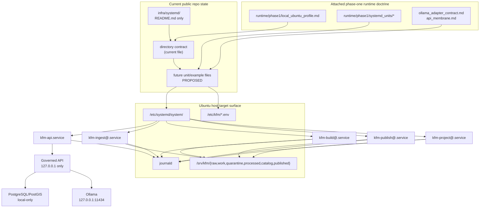

<!-- [KFM_META_BLOCK_V2]
doc_id: kfm://doc/TODO-VERIFY-UUID
title: infra/systemd
type: standard
version: v1
status: draft
owners: @bartytime4life
created: TODO-VERIFY-YYYY-MM-DD
updated: TODO-VERIFY-YYYY-MM-DD
policy_label: public
related: [README.md, infra/README.md, infra/systemd-or-compose/README.md, infra/compose/README.md, infra/local/README.md]
tags: [kfm, infra, systemd, linux, ubuntu, operations]
notes: [Current public main confirms infra/systemd/ exists and is README-only; current public CODEOWNERS coverage for /infra/ points to @bartytime4life; doc_id and created/updated dates still need verification.]
[/KFM_META_BLOCK_V2] -->

# infra/systemd

Native Ubuntu/systemd lane for KFM’s single-host, loopback-bounded runtime profile.

> **Status:** experimental  
> **Owners:** `@bartytime4life` *(current public `/infra/` `CODEOWNERS` coverage)*  
>      
> **Repo fit:** `infra/systemd/README.md` → upstream [../README.md](../README.md) and [../../README.md](../../README.md) · adjacent [../systemd-or-compose/README.md](../systemd-or-compose/README.md), [../compose/README.md](../compose/README.md), [../local/README.md](../local/README.md)  
> **Quick jump:** [Scope](#scope) · [Repo fit](#repo-fit) · [Accepted inputs](#accepted-inputs) · [Exclusions](#exclusions) · [Directory tree](#directory-tree) · [Quickstart](#quickstart) · [Usage](#usage) · [Diagram](#diagram) · [Operating tables](#operating-tables) · [Task list](#task-list) · [FAQ](#faq) · [Appendix](#appendix)

> [!IMPORTANT]
> Current public `main` confirms that `infra/systemd/` is a real repo surface, but the directory is presently **README-only**. This file should therefore behave as a directory contract and evidence boundary, not as proof that checked-in unit files, override snippets, or host examples already exist here.

> [!NOTE]
> The March–April 2026 KFM corpus still governs the runtime doctrine behind this lane: the thinnest credible phase-one profile is **systemd-first**, **Ubuntu-first**, **local-first**, and **loopback-bounded**, with the governed API in front of canonical stores and any local model runtime.

## Scope

`infra/systemd/` is the repository surface for native `systemd` host wiring when KFM runs as a single-machine or otherwise systemd-managed stack.

In KFM, that makes this directory more than a place to drop unit files. Host wiring either preserves the trust membrane or quietly dissolves it. A service that binds too broadly, a worker that writes outside its stage, or a model runtime exposed for convenience can collapse the same governed boundaries the rest of the architecture is trying to protect.

### Current evidence snapshot

| Item | Status | Meaning here |
| --- | --- | --- |
| `infra/systemd/` path on public `main` | **CONFIRMED** | The lane exists in the live public repo. |
| Current checked-in contents | **CONFIRMED** | Public `main` shows `README.md` only. |
| `runtime/phase1/*` starter artifact family in attached doctrine | **CONFIRMED** doctrine | The manuals still use that artifact family as the strongest phase-one runtime placeholder set. |
| Checked-in unit files, env examples, or overrides under this path | **PROPOSED** | They are described here as the natural next contents, but not yet proven in the live public tree. |
| Active host usage, deployment manifests, systemd state, secrets handling, and runtime proof objects | **UNKNOWN / NEEDS VERIFICATION** | Those require a working checkout, host evidence, or non-public platform inspection. |

[Back to top](#infrasystemd)

## Repo fit

Path: `infra/systemd/README.md`  
Role: directory README for native systemd runtime wiring under `infra/`.

This file should do four jobs cleanly:

1. mark what is **currently true** about the public tree,
2. preserve the stronger **runtime doctrine** from the attached corpus,
3. separate **checked-in reality** from **proposed expansion**, and
4. route maintainers to sibling infra lanes without letting them drift into contradictory runtime stories.

### Upstream, adjacent, and downstream anchors

| Relation | Surface | Why it matters |
| --- | --- | --- |
| Upstream | [../../README.md](../../README.md) | Root identity, trust posture, and verification-first navigation. |
| Upstream | [../README.md](../README.md) | Parent infra doctrine for runtime, rollback, restore, exposure, and observability. |
| Adjacent | [../systemd-or-compose/README.md](../systemd-or-compose/README.md) | Shared choice surface for when KFM stays native `systemd` and when bounded Compose is acceptable. |
| Adjacent | [../compose/README.md](../compose/README.md), [../local/README.md](../local/README.md) | Sibling local-first runtime lanes that must stay consistent with this directory. |
| Downstream | host-managed `/etc/systemd/system/`, `/etc/kfm/*.env`, journald, and bounded runtime state | These are the actual operational targets this directory is expected to describe and eventually version. |
| Shared boundaries | `../../contracts/`, `../../policy/`, `../../schemas/`, `../../tests/` | This lane should consume those trust-bearing surfaces, not redefine them. |

### Current public deltas

| Delta | Why it matters now | Status |
| --- | --- | --- |
| The path is real, not hypothetical | This README no longer needs to speak as though `infra/systemd/` might not exist. | **CONFIRMED** |
| The directory is still README-only | Any unit names, host paths, or install commands remain starter guidance rather than checked-in runtime fact. | **CONFIRMED** |
| `infra/systemd-or-compose/` is already the shared lane-choice document | Cross-lane rules should live there instead of being silently duplicated here. | **CONFIRMED** |
| The attached doctrine still points to `runtime/phase1/*` starter artifacts | Keep those paths visible as doctrinal input; the current public root snapshot does not expose that starter family as checked-in top-level inventory. | **CONFIRMED doctrine / not current-tree fact** |

## Accepted inputs

Use this lane for files and notes that exist because native `systemd` is the chosen runtime surface.

| Belongs here | Typical contents | Status in current public tree | Why it belongs |
| --- | --- | --- | --- |
| Unit files | `kfm-api.service`, `kfm-ingest@.service`, `kfm-build@.service`, `kfm-publish@.service`, `kfm-project@.service` | **PROPOSED** | These are the most natural native-service families implied by the phase-one runtime doctrine. |
| Override snippets | `ollama.service.d/override.conf`, service drop-ins, bind rules | **PROPOSED** | Local-only overrides are exactly the kind of host wiring this lane should own. |
| Non-secret env examples | `env/kfm-api.env.example`, `env/kfm-worker.env.example`, `env/kfm-publish.env.example`, `env/ollama.override.env.example` | **PROPOSED** | Repo-tracked examples help operators wire a host without committing live values. |
| Lane-local operator notes | install, reload, journal, verification, and rollback steps that are specific to native units | **PARTIALLY CONFIRMED** (`README.md` only) | Runtime-affecting instructions should travel with the lane they describe. |
| Host-hardening notes | sandboxing flags, service users, `ReadWritePaths=`, restart posture | **INFERRED / PROPOSED** | Least-privilege service wiring is a trust-bearing concern in KFM, not optional polish. |

## Exclusions

What this lane should **not** become is just as important as what it should contain.

| Keep out of `infra/systemd/` | Put it here instead | Why |
| --- | --- | --- |
| App code, worker business logic, model adapters, or domain transforms | `../../apps/` or `../../packages/` | Native-service wiring must not become a hiding place for actual system behavior. |
| Policy law, Rego bundles, reason grammar, or exception semantics | `../../policy/` | Policy needs independent review and test surfaces. |
| Contracts, schemas, OpenAPI, or shared fixtures | `../../contracts/` and `../../schemas/` | Unit files should consume those boundaries, not redefine them. |
| Published evidence, release proof, catalog truth, or EvidenceBundles themselves | the project’s governed data, release, and catalog surfaces | Runtime is downstream of release-bearing truth. |
| Real secrets, live credentials, or committed host tokens | secret-management paths or local untracked files | Never turn repo plaintext into secret storage. |
| Cross-lane orchestration doctrine | [../systemd-or-compose/README.md](../systemd-or-compose/README.md) | Shared rules belong in the shared decision surface. |
| Public-edge or hosted exposure policy | sibling hosted / Kubernetes / Terraform / edge docs | Phase-one native systemd guidance is not a substitute for hosted exposure design. |

## Directory tree

### Current public tree (**CONFIRMED** on public `main`)

```text
infra/systemd/
└── README.md
```

### Proposed expansion sketch (**illustrative only**)

```text
infra/systemd/
├── README.md
├── kfm-api.service
├── kfm-ingest@.service
├── kfm-build@.service
├── kfm-publish@.service
├── kfm-project@.service
├── env/
│   ├── kfm-api.env.example
│   ├── kfm-worker.env.example
│   ├── kfm-publish.env.example
│   └── ollama.override.env.example
└── ollama.service.d/
    └── override.conf
```

Use the expansion sketch only after re-reading the active checkout and deciding whether KFM will keep native-host wiring here, redirect it to another existing lane, or pull shared rules upward into `infra/systemd-or-compose/`.

## Quickstart

Start with inventory, not installation.

### 1) Verify the checkout and the neighboring infra lanes

```bash
# REPO ROOT + LANE INVENTORY
git rev-parse --show-toplevel
find infra -maxdepth 2 -type d | sort
find infra/systemd -maxdepth 3 -type f | sort

# READ THE PARENT AND SHARED-CHOICE DOCS FIRST
sed -n '1,220p' infra/README.md
sed -n '1,240p' infra/systemd-or-compose/README.md
sed -n '1,240p' infra/systemd/README.md
```

### 2) Check whether doctrine-only starter paths already exist somewhere else in the working checkout

```bash
# ATTACHED DOCTRINE MENTIONS runtime/phase1/* AS A STARTER ARTIFACT FAMILY
find runtime -maxdepth 3 -type f 2>/dev/null | sort || true
```

If a working branch already carries native-host runtime assets outside `infra/systemd/`, reconcile those paths explicitly instead of cloning doctrine into two places.

### 3) Validate unit syntax only after actual unit files exist

```bash
# ILLUSTRATIVE EXAMPLE ONLY — THIS FAILS CLEANLY IF NO UNITS EXIST YET
if find infra/systemd -maxdepth 1 -name '*.service' | grep -q .; then
  systemd-analyze verify infra/systemd/*.service
else
  echo 'No checked-in systemd unit files under infra/systemd/ yet.'
fi
```

### 4) Install illustrative files on a host only after the lane carries real files

```bash
# EXAMPLE ONLY — ADJUST PATHS, USERS, GROUPS, AND EXECSTART VALUES BEFORE USE
sudo install -m 0644 infra/systemd/*.service /etc/systemd/system/

sudo install -d -m 0750 /etc/kfm
sudo install -m 0640 infra/systemd/env/kfm-api.env.example /etc/kfm/kfm-api.env
sudo install -m 0640 infra/systemd/env/kfm-worker.env.example /etc/kfm/kfm-worker.env
sudo install -m 0640 infra/systemd/env/kfm-publish.env.example /etc/kfm/kfm-publish.env
sudo install -m 0640 infra/systemd/env/ollama.override.env.example /etc/kfm/ollama.override.env

sudo install -d -m 0755 /etc/systemd/system/ollama.service.d
sudo install -m 0644 infra/systemd/ollama.service.d/override.conf \
  /etc/systemd/system/ollama.service.d/override.conf

sudo systemctl daemon-reload
sudo systemctl enable --now kfm-api.service
```

### 5) Inspect live status, logs, and bind scope

```bash
systemctl status kfm-api.service
systemctl status ollama.service

journalctl -u kfm-api.service -b --no-pager
journalctl -u ollama.service -b --no-pager

ss -lntp | grep -E '127\.0\.0\.1:(8080|11434)'
```

## Usage

### Use this lane when

- KFM is running natively on Ubuntu and `systemd` is the authoritative service manager.
- You need loopback-bounded host profiles that keep the governed API, PostgreSQL/PostGIS, and local model runtime behind explicit service rules.
- You want service identity, restart behavior, filesystem write scope, and journald continuity to be reviewable in Git.
- You are proving the thinnest credible single-host slice before moving into broader hosted or reconciled environments.

### Do not use this lane to

- redefine policy, schema, release truth, or public-surface behavior;
- bypass the governed API with direct client paths to canonical stores or model runtimes;
- hide long-lived business rules inside unit files or shell glue; or
- duplicate lane-choice doctrine that already belongs in `infra/systemd-or-compose/`.

### Proposed service family strategy

Use long-running units for stable runtime surfaces and bounded units for explicit jobs.

- **Long-running:** the governed API and any always-on helper surface that must survive operator login/logout.
- **One-shot or bounded batch:** ingest, build, publish, and projection work where the run should either complete or fail closed with diagnosable evidence.

### Host boundary rules

The phase-one KFM posture is explicitly **not** “just expose the service.”

- Bind the governed API to loopback in the thinnest native profile.
- Keep PostgreSQL/PostGIS on Unix socket or localhost only.
- Keep Ollama on loopback only.
- Keep RAW / WORK / QUARANTINE and direct artifact-root access off the public network.
- Introduce remote operator access through VPN or overlay before any public edge exists.

### Environment and secret boundary

The repo may store examples. Live service environment should resolve from host-owned files such as:

- `/etc/kfm/kfm-api.env`
- `/etc/kfm/kfm-worker.env`
- `/etc/kfm/kfm-publish.env`
- `/etc/kfm/ollama.override.env`

Treat them as root-owned, tightly permissioned, and outside casual operator read by default.

### Hardening profile

Recommended defaults for many units:

- `NoNewPrivileges=yes`
- `PrivateTmp=yes`
- `ProtectSystem=strict`
- `ProtectHome=read-only`
- `ReadWritePaths=` limited to required locations only
- `RuntimeDirectory=`, `StateDirectory=`, and `LogsDirectory=` where appropriate
- `RestrictSUIDSGID=yes`
- `ProtectKernelLogs=yes` where compatible
- distinct service users with one clear function each

> [!CAUTION]
> `PrivateNetwork=` is not a safe blanket default. Some KFM services still need host loopback communication to reach local-only API, database, or model-adapter boundaries.

### Logging and audit-join discipline

Host wiring should preserve the IDs that make KFM reconstructable, not merely “up.”

Recommended join fields to preserve end to end include:

- `request_id`
- `audit_ref`
- `release_id`
- `dataset_version_id`
- `decision_id`
- `bundle_id`

Where local audit continuity matters, persist journald rather than relying only on volatile runtime logs.

### Host validation loop

A host is not trustworthy merely because the processes are running. A reasonable local validation loop includes:

```bash
# SERVICE HEALTH
systemctl is-active kfm-api.service
systemctl is-active ollama.service

# BIND SCOPE
ss -lntp | grep 127.0.0.1:8080
ss -lntp | grep 127.0.0.1:11434

# POLICY / PUBLISHED SCOPE / EVIDENCE ROUTE
test -r /etc/kfm/kfm-api.env
test -d /srv/kfm/published
test -d /srv/kfm/catalog

# JOURNAL CONTINUITY
journalctl -u kfm-api.service -b --no-pager | tail -n 50
```

### Restart and rollback mindset

- Long-running services should generally prefer `Restart=on-failure`.
- One-shot jobs should not enter blind restart loops.
- Runtime rollback and public correction are distinct actions in KFM: a failed deploy may require a host rollback, while a release-bearing semantic problem may require correction or withdrawal artifacts.

## Diagram



## Operating tables

### Current public lane inventory

| Surface | Current public state | Why it matters |
| --- | --- | --- |
| `infra/systemd/README.md` | **CONFIRMED** | The lane already has a checked-in directory guide. |
| Checked-in unit files | **Not present on public `main`** | Runtime examples and service names remain starter guidance, not current-tree fact. |
| Checked-in env examples or override snippets | **Not present on public `main`** | Secret boundaries and host examples should remain explicit once the lane grows. |
| Sibling decision surface | [../systemd-or-compose/README.md](../systemd-or-compose/README.md) | Lane-choice rules already have a dedicated home. |

### Proposed unit family matrix

| Unit family | Service shape | Purpose | Expected write scope | Posture |
| --- | --- | --- | --- | --- |
| `kfm-api.service` | long-running | governed API | runtime state, logs, limited catalog/published reads, explicit small writes only | unit name **PROPOSED**, role **INFERRED** |
| `kfm-ingest@.service` | templated one-shot | intake and landing | `raw/` and `work/` writes only | **PROPOSED** |
| `kfm-build@.service` | templated one-shot | build / transform / projection work | `processed/` and related derived writes as required | **PROPOSED** |
| `kfm-publish@.service` | bounded batch | catalog closure and publication movement | `catalog/` and `published/` only | **PROPOSED** |
| `kfm-project@.service` | templated one-shot | derived-layer rebuilds | derived outputs only | **PROPOSED** |

### Service dependency law

| Order | Why it matters |
| --- | --- |
| Database before governed API | The API should not advertise readiness against a missing canonical store. |
| Artifact mounts before workers | Intake/build/publish/projection jobs need known paths before they start. |
| Policy/config readability before API readiness | KFM does not treat policy as decorative. |
| Local model runtime before AI-enabled answer path | AI support is subordinate, but if enabled it must still sit behind the governed adapter. |
| Projection rebuilds only after a published release exists | Derived layers trail release-bearing truth; they do not race ahead of it. |

### Host-managed surfaces

| Surface | Example | Notes |
| --- | --- | --- |
| Environment file | `/etc/kfm/kfm-api.env` | host-owned, not committed with live values |
| Runtime directory | `RuntimeDirectory=kfm-api` | transient runtime files and sockets |
| State directory | `StateDirectory=kfm-api` | durable service-owned state when needed |
| Logs directory | `LogsDirectory=kfm-api` | pair with journald-driven inspection |
| Explicit writes | `ReadWritePaths=/run/kfm /var/lib/kfm-api /srv/kfm/catalog /srv/kfm/published` | narrow write scope is preferred over broad ownership |
| Lifecycle roots | `/srv/kfm/raw`, `/srv/kfm/work`, `/srv/kfm/quarantine`, `/srv/kfm/processed`, `/srv/kfm/catalog`, `/srv/kfm/published` | example host pattern from the attached doctrine; exact live host paths still need verification |

### Host validation signals

| Check | Healthy signal | Why it matters |
| --- | --- | --- |
| `systemctl is-active` | `active` for long-running units | Running process is necessary, not sufficient. |
| Bind scope | API and Ollama listen on `127.0.0.1` only | Prevents trust-boundary collapse. |
| Published scope | mounted and readable | UI/runtime surfaces should not read unpublished scope. |
| Policy/config | readable at boot | readiness should fail closed without them. |
| Journald continuity | persistent logs available after reboot | keeps runtime evidence reconstructable. |
| Worker behavior | bounded success or fail-closed logs | prevents silent retry loops and hidden data drift. |

## Task list

| Gate | Done when | Evidence to capture |
| --- | --- | --- |
| Public-tree accuracy | The README reflects that the lane exists and is currently README-only on public `main`. | tree snapshot or PR diff |
| Ownership | Owners and any narrower path coverage are aligned to current `CODEOWNERS`. | README update + codeowner diff if needed |
| First checked-in runtime artifact | The directory contains at least one real unit or host example, not just descriptive prose. | added file(s) + review notes |
| Unit realism | `ExecStart`, `WorkingDirectory`, user, group, and write scope map to real binaries and host paths. | reviewed unit files + `systemd-analyze verify` |
| Secret boundary | Live values are outside Git and repo copies are example-only. | sanitized examples + host permission notes |
| Loopback discipline | API, DB, and Ollama exposure match the approved host boundary. | bind config + firewall / VPN review |
| Least privilege | Service users and `ReadWritePaths=` reflect stage-specific rights. | unit review + filesystem permissions |
| Logging | Operators can inspect health and failure via journald without guesswork. | `systemctl`, `journalctl`, joined IDs visible |
| Runtime/phase1 reconciliation | Any relationship between this lane and the attached `runtime/phase1/*` starter paths is resolved explicitly. | cross-link, ADR, or path decision note |

### Definition of done

- [ ] The file no longer implies that `infra/systemd/` is an unverified path.
- [ ] Current public tree state and proposed expansion are separated clearly.
- [ ] Owners, dates, and related links reflect verified repo evidence or explicit placeholders.
- [ ] At least one real checked-in unit, env example, or override snippet exists before this lane claims more than README-only maturity.
- [ ] Host-only env files and service users are documented with verified permissions when they become real.
- [ ] One long-running unit and one bounded job unit are verified end to end before the lane claims operational completeness.
- [ ] Any conflict between `infra/systemd/` and attached `runtime/phase1/*` starter paths is resolved explicitly, not silently.

## FAQ

### Is `infra/systemd/` a real repo path now?

Yes. Current public `main` confirms the path exists. What remains unverified is lane maturity: the checked-in public tree is still README-only, and active host/runtime evidence is not exposed here.

### Why keep `runtime/phase1/*` in view if this repo already has `infra/systemd/`?

Because the attached doctrine still uses that artifact family as the strongest phase-one runtime placeholder set. This README should preserve that design pressure without pretending the current public repo already exposes those files.

### Why systemd here instead of a container-first README?

Because the current KFM runtime doctrine treats **systemd-first packaging** as the thinnest credible phase-one start on Ubuntu. It keeps loopback and Unix-socket boundaries simple while the governed path is still being proven.

### Why keep real secrets out of this directory?

Because this repo surface is for reviewable host wiring. Live credentials belong on the host, not in Git. This directory should carry sanitized examples and clear installation rules, not operational leakage.

### Why are PostgreSQL/PostGIS and Ollama treated so cautiously?

Because KFM’s trust membrane depends on keeping canonical stores and model runtime behind the governed API. Direct client access would collapse the boundary the rest of the architecture is trying to preserve.

### Why no public reverse proxy in phase one?

Because the corpus’s phase-one posture is local-first: prove the governed path, keep services on loopback, and add VPN or split-edge exposure only when real operational burden justifies it.

## Appendix

<details>
<summary><strong>Illustrative skeleton unit — <code>kfm-api.service</code></strong></summary>

```ini
[Unit]
Description=KFM Governed API
After=network-online.target postgresql.service
Wants=network-online.target
Requires=postgresql.service

[Service]
User=kfm-api
Group=kfm-api
WorkingDirectory=/opt/kfm/api
EnvironmentFile=/etc/kfm/kfm-api.env
ExecStart=/path/to/actual-kfm-api-binary --bind 127.0.0.1:8080
Restart=on-failure
RestartSec=5

RuntimeDirectory=kfm-api
StateDirectory=kfm-api
LogsDirectory=kfm-api

NoNewPrivileges=yes
PrivateTmp=yes
ProtectSystem=strict
ProtectHome=read-only
ReadWritePaths=/run/kfm /var/lib/kfm-api /srv/kfm/catalog /srv/kfm/published
RestrictSUIDSGID=yes
ProtectKernelLogs=yes
UMask=0027

[Install]
WantedBy=multi-user.target
```

</details>

<details>
<summary><strong>Illustrative Ollama override — local-only bind</strong></summary>

```ini
[Service]
Environment="OLLAMA_HOST=127.0.0.1:11434"
Environment="OLLAMA_MODELS=/var/lib/ollama/models"
```

</details>

<details>
<summary><strong>Illustrative operator verification commands</strong></summary>

```bash
# SERVICE ACTIVITY
systemctl is-active kfm-api.service
systemctl is-active ollama.service

# BIND SCOPE
ss -lntp | grep 127.0.0.1:8080
ss -lntp | grep 127.0.0.1:11434

# UNIT INSPECTION
systemctl cat kfm-api.service
systemd-analyze verify /etc/systemd/system/kfm-api.service

# LOGS
journalctl -u kfm-api.service -b --no-pager | tail -n 100
journalctl -u ollama.service -b --no-pager | tail -n 100
```

</details>

[Back to top](#infrasystemd)
