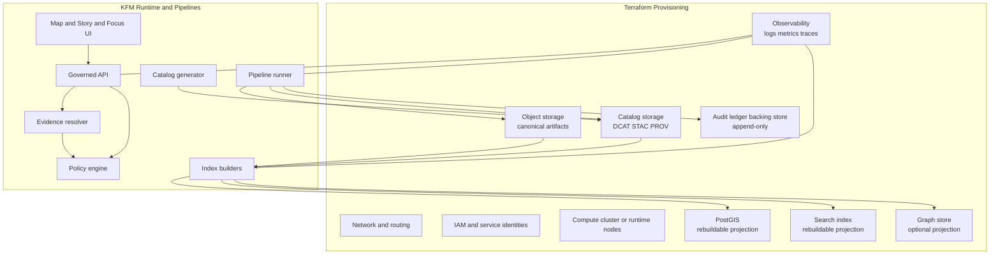

# Terraform infrastructure
Provision Kansas Frontier Matrix (KFM) infrastructure with Terraform, while preserving KFM’s governance invariants (trust membrane, canonical truth path, rebuildable projections).

**Status:** Draft (scaffolding + conventions; provider modules may still be missing)  
**Owners:** Platform / Infra maintainers (TBD)


**Quick nav:** [Scope](#scope) • [Non-negotiable invariants](#non-negotiable-invariants) • [Architecture](#architecture) • [What Terraform manages](#what-terraform-manages) • [Layout](#layout) • [Workflow](#workflow) • [Environments](#environments) • [State and secrets](#state-and-secrets) • [CI gates](#ci-gates) • [Rollback and recovery](#rollback-and-recovery) • [Definition of Done](#definition-of-done)

---

## Scope

This folder is the Terraform entrypoint for provisioning and governing **infrastructure resources** needed to run KFM:

- Core platform primitives (networking, IAM, DNS/TLS, etc.)
- **Canonical stores** (object storage + catalogs/provenance + audit ledger backing services)
- **Rebuildable projections** (PostGIS, search, graph, tile caches) and the compute they run on
- Observability primitives (logs/metrics/traces) and access controls

What this folder does **not** do:

- It does **not** “publish” data to runtime. Data publication is governed by KFM’s **Promotion Contract** and happens via pipelines/catalogs, not by Terraform.
- It does **not** bypass policy or expose storage directly to end users. All external access must go through the governed API boundary.

> NOTE  
> This README intentionally stays **provider-agnostic**. When a cloud/provider choice is made, capture it as an ADR and implement provider-specific modules behind stable module interfaces.

[Back to top](#terraform-infrastructure)

---

## Non-negotiable invariants

These are *deployment-shaping* rules. If a Terraform change would violate them, it must be rejected (or require explicit governance review + ADR).

### Trust membrane (must hold)
- The frontend and external clients **must not** access databases or object storage directly.
- All access must flow through governed APIs that apply policy decisions, redactions, and logging.

### Canonical truth path (must remain navigable)
KFM’s canonical source of truth is:
- object storage (raw/work/processed artifacts)
- catalogs (DCAT/STAC/PROV)
- audit ledger (append-only)

Databases and indexes are projections that must be rebuildable from promoted artifacts and catalogs.

### Runtime-serving rule
Only **processed** and **catalog** artifacts are eligible to be served to runtime. Keep manifests/receipts close to artifacts so the “truth path” is navigable even without a database.

[Back to top](#terraform-infrastructure)

---

## Architecture



Key idea: Terraform provisions the substrate; **promotion + serving** is governed by catalogs/policy/evidence resolution, not direct storage exposure.

[Back to top](#terraform-infrastructure)

---

## What Terraform manages

| Area | Type | Why it exists in KFM |
|---|---|---|
| Object storage | Canonical | Holds raw/work/processed artifacts and should support immutable, digest-addressed artifacts and navigable manifests/receipts. |
| Catalog storage (DCAT/STAC/PROV) | Canonical | Catalogs are part of the evidence surface and must be available to the governed API + evidence resolver. |
| Audit ledger backing store | Canonical | Append-only audit log; treated as governed data with access controls and redaction where needed. |
| PostGIS | Rebuildable projection | Spatial query engine derived from processed GeoParquet. Treat as rebuildable from promoted artifacts. |
| Search | Rebuildable projection | Derived from processed texts/metadata; search results must map back to EvidenceRefs that resolve. |
| Graph | Rebuildable projection (optional early) | Useful for relationship traversal; can be introduced later when needed. |
| Compute runtime | Platform | Runs API/evidence/policy/pipelines/indexers; separated from storage by the trust membrane. |
| IAM, networking, observability | Platform | Required to enforce least privilege, auditability, and reliable operations. |

> WARNING  
> Never make object storage or databases publicly reachable “because it’s convenient”. That breaks the trust membrane and makes policy enforcement non-credible.

[Back to top](#terraform-infrastructure)

---

## Layout

This repo’s exact Terraform structure may evolve, but **prefer a layout that makes environment boundaries explicit** and keeps modules reusable.

```text
infra/terraform/
  README.md

  # PROPOSED (not confirmed): root module and shared conventions
  versions.tf
  providers.tf
  locals.tf

  # PROPOSED: reusable building blocks
  modules/
    object_storage/
    catalog_storage/
    audit_ledger/
    postgis/
    search/
    runtime_compute/
    observability/

  # PROPOSED: environment roots (separate state per env)
  envs/
    dev/
    stage/
    prod/
```

If you choose a different structure (e.g., workspaces-only), document the rationale and include an ADR.

[Back to top](#terraform-infrastructure)

---

## Workflow

Terraform changes are governance-sensitive because they can change:

- data exposure surface area
- auditability and logging
- policy enforcement capability
- reproducibility guarantees

**Default workflow: PR-based + CI planned + controlled apply.**

1. **Open PR**
   - Include `terraform fmt` changes.
   - Include a plan artifact (or CI plan link) for each environment affected.

2. **Review**
   - Infra maintainer review required.
   - If the change touches *core invariants* (trust membrane, canonical stores, policy boundary), include an ADR link.

3. **Apply**
   - Apply is executed in a controlled environment (CI runner or approved operator workflow).
   - No ad-hoc production applies from laptops.

[Back to top](#terraform-infrastructure)

---

## Environments

KFM should treat environments as separate governance domains:

- **dev:** experimentation + fast iteration
- **stage:** promotion rehearsal + integration testing
- **prod:** only controlled applies, audit trails required

Recommended baseline:
- **Separate state per environment**
- Separate credentials per environment
- Separate data buckets/accounts/projects when feasible

<details>
<summary>Environment strategies (pick one and standardize)</summary>

- **Separate root modules per env (recommended for safety):** `envs/dev`, `envs/stage`, `envs/prod`
- **Workspaces:** can work, but often increases accidental cross-env coupling
- **Separate repos:** strongest isolation, but can fragment governance artifacts

</details>

[Back to top](#terraform-infrastructure)

---

## State and secrets

Terraform state is sensitive: it can contain resource identifiers, policy attachments, and sometimes secrets depending on provider behavior.

Minimum posture:
- Remote backend with locking
- Encryption at rest
- Strict access controls (least privilege)
- Audit logging for state access (where supported)

Secrets posture:
- Do **not** commit secrets into repo.
- Prefer secret managers / workload identity mechanisms.
- Treat any state backend credentials as privileged.

[Back to top](#terraform-infrastructure)

---

## CI gates

Every Terraform PR should be blocked unless these are green:

- `terraform fmt -check`
- `terraform validate`
- `terraform plan` (for affected envs)
- Static checks (recommended): `tflint`, policy-as-code checks, and security scanning
- Drift detection (recommended): scheduled plan comparisons in stage/prod

> NOTE  
> KFM’s broader governance posture expects **fixtures-driven policy tests** that block merges when policies are violated. Keep infra checks aligned with that philosophy.

[Back to top](#terraform-infrastructure)

---

## Rollback and recovery

Terraform rollback is not always “git revert + apply” (especially for destructive changes), so KFM infrastructure must be designed for recoverability:

- Canonical truth is in object storage + catalogs + audit ledger
- Projections (PostGIS/search/graph/tiles) must be **rebuildable** from promoted artifacts

Operational expectation:
- Rebuild pipelines exist for projections
- Recovery procedures are documented and tested (at least in stage)

[Back to top](#terraform-infrastructure)

---

## Definition of Done

A Terraform PR is DONE when:

- [ ] Plan output is attached/linked for each affected environment
- [ ] No trust membrane violations introduced (no direct public access to DB/object storage)
- [ ] Canonical stores are protected (access controls, encryption, retention/immutability strategy as applicable)
- [ ] Observability signals exist for new runtime components
- [ ] Least privilege is maintained (service identities scoped; no wildcard admin policies)
- [ ] If core invariants changed: ADR linked and reviewed

[Back to top](#terraform-infrastructure)

---

## References (internal)

- Kansas Frontier Matrix (KFM) — Definitive Design & Governance Guide (vNext)
- Threat model checklist (trust membrane and policy)
- Promotion manifest template and Promotion Contract overview

