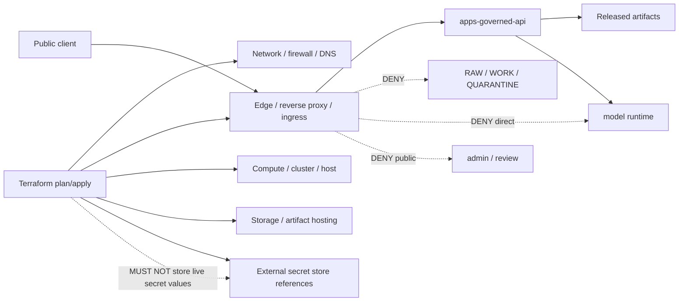

<!-- [KFM_META_BLOCK_V2]
doc_id: kfm://doc/infra-terraform-readme
title: infra/terraform/ — Terraform Infrastructure-as-Code, Provisioning Boundaries, and State Safety
type: per-directory-readme
version: v1
status: draft
owners:
  - <infra-steward>
  - <security-owner>
  - <ops-steward>
created: 2026-07-03
updated: 2026-07-03
policy_label: public
related:
  - infra/README.md
  - infra/hardening/README.md
  - infra/hardening/CHECKLIST.md
  - infra/reverse_proxy/
  - infra/firewall/
  - infra/vpn/
  - infra/systemd/
  - infra/docker/
  - infra/compose/
  - infra/kubernetes/
  - configs/
  - runtime/
  - apps/governed-api/
  - apps/explorer-web/
  - apps/workers/
  - docs/doctrine/directory-rules.md
  - docs/security/README.md
  - docs/security/EXPOSURE_PLAN.md
  - docs/security/INCIDENT_RESPONSE.md
  - docs/security/KEY_ROTATION.md
  - docs/architecture/deployment-topology.md
  - docs/runbooks/
  - policy/
  - release/
  - data/published/
tags:
  - kfm
  - infra
  - terraform
  - infrastructure-as-code
  - provisioning
  - state
  - deny-by-default
  - least-privilege
  - trust-membrane
  - rollback
notes:
  - "Terraform files are provisioning mechanics. They must not become KFM policy authority, schema authority, release authority, runtime implementation, or a secret store."
  - "Terraform-managed resources must preserve KFM exposure boundaries: governed API and released artifacts are public; RAW, WORK, QUARANTINE, internal stores, model runtimes, source credentials, and steward/admin paths are denied by default."
[/KFM_META_BLOCK_V2] -->

<a id="top"></a>

# `infra/terraform/` — Terraform Infrastructure-as-Code, Provisioning Boundaries, and State Safety

> **One-line purpose.** Hold Terraform infrastructure-as-code for KFM while preserving deny-by-default exposure, least privilege, state safety, secret hygiene, governed API routing, auditability, and rollback.


---

## Quick jump

[Purpose](#purpose) · [Status & authority](#status--authority) · [Repo fit](#repo-fit) · [What belongs here](#what-belongs-here) · [What does not belong here](#what-does-not-belong-here) · [Provisioning boundary model](#provisioning-boundary-model) · [Terraform expectations](#terraform-expectations) · [State and secrets](#state-and-secrets) · [Proposed structure](#proposed-structure) · [Validation](#validation) · [Review burden](#review-burden) · [Open verification](#open-verification)

---

## Purpose

`infra/terraform/` is the Terraform infrastructure-as-code lane for Kansas Frontier Matrix. It may hold Terraform modules, environment stacks, backend templates, provider configuration templates, variable definitions, policy-adjacent validation notes, provisioning diagrams, and rollback notes.

This folder exists to provision infrastructure without weakening KFM's trust membrane:

```text
RAW -> WORK / QUARANTINE -> PROCESSED -> CATALOG / TRIPLET -> PUBLISHED
```

Terraform may create or manage infrastructure that hosts KFM, but it must not decide what KFM publishes, certify evidence, store secrets, bypass governed APIs, or expose non-public lifecycle data.

Public infrastructure should expose only reviewed public surfaces:

```text
public client -> edge / ingress -> apps/governed-api/ or released static artifacts
```

Infrastructure must deny direct access to RAW, WORK, QUARANTINE, unpublished candidates, internal/canonical stores, source credentials, direct model endpoints, admin/review surfaces, and debug endpoints unless a steward-only private path is explicitly reviewed and audited.

[Back to top](#top)

---

## Status & authority

| Field | Value |
|---|---|
| **Document type** | Per-directory README |
| **Owning responsibility root** | `infra/` |
| **Subpath role** | `terraform/` — Terraform modules, stacks, backend templates, provisioning guidance, state-safety notes, and IaC validation records |
| **Authority level** | Draft deployment guidance. KFM doctrine, accepted ADRs, `policy/`, release gates, and security runbooks outrank this README. |
| **Lifecycle phase** | n/a — provisioning mechanics, not lifecycle data |
| **Default posture** | Deny-by-default exposure, least privilege, no secret commits, protected state, auditable plan/apply, rollback path |
| **Owners** | `<infra-steward>`, `<security-owner>`, `<ops-steward>` — fill from CODEOWNERS when assigned |
| **Reviewers required** | Infra steward + security owner for providers, state backend, identity/RBAC, network, firewall, ingress, storage, secrets, model-runtime, public exposure, or production changes |
| **Directory Rules basis** | `infra/` owns deployment, host, network, and exposure posture; `terraform/` is a named lane under the expected `infra/` tree. |

[Back to top](#top)

---

## Repo fit

```text
Kansas-Frontier-Matrix/
└── infra/
    ├── README.md
    ├── docker/
    ├── compose/
    ├── reverse_proxy/
    ├── vpn/
    ├── firewall/
    ├── systemd/
    ├── kubernetes/
    ├── terraform/        ◀── you are here
    │   └── README.md
    └── hardening/
```

### Responsibility split

| Location | Owns | Does not own |
|---|---|---|
| `infra/terraform/` | Terraform modules, stacks, backend templates, providers, provisioning docs, plan/apply validation notes, rollback notes | KFM policy semantics, app code, runtime code, real secrets, release decisions, schemas |
| `infra/hardening/` | Cross-infra hardening baseline and checklist | Terraform module implementation unless delegated here |
| `infra/reverse_proxy/` | Reverse-proxy route config and edge behavior | Cloud edge resource provisioning unless Terraform manages it here |
| `infra/firewall/` | Firewall policy/config where not Terraform-managed | Terraform state or backend management |
| `infra/kubernetes/` | Kubernetes manifests and cluster deployment mechanics | Terraform cloud/resource provisioning unless using Terraform to create cluster resources |
| `configs/` | Non-secret application/deployment templates | Terraform state, secrets, live credentials |
| `policy/` | Enforceable allow / deny / restrict / abstain decisions | Terraform syntax or provisioning mechanics |
| `apps/governed-api/` | Trust membrane application behavior | Infrastructure provisioning |
| `runtime/` | Runtime/model adapters and local runtime implementation | Terraform resource definitions |
| `release/` | Release decisions, manifests, rollback cards, corrections | Terraform plans, state, or modules |

[Back to top](#top)

---

## What belongs here

Use `infra/terraform/` for Terraform-specific materials such as:

- Terraform modules for networking, compute, storage, DNS, TLS references, logging, artifact hosting, and deployment support resources.
- Environment stacks for local, staging, production, or lab deployments when Terraform is the chosen provisioning layer.
- Backend configuration templates with no live secrets.
- Provider configuration templates with version constraints and no live credentials.
- Variables and outputs that are safe to publish.
- IAM/RBAC/service-account provisioning that follows least privilege.
- Network, firewall, route, ingress, object-storage, and artifact-hosting provisioning.
- Secret-manager references that point to external secret stores without storing secret values.
- Terraform plan review notes and sanitized outputs.
- Policy-as-code validation notes for Terraform security posture, if those checks are tooling around Terraform rather than KFM domain policy.
- Rollback and drift-handling notes for infrastructure changes.

Accepted file types are Markdown, `.tf`, `.tfvars.example`, `.tfbackend.example`, `.terraform.lock.hcl` when intentionally pinned, sanitized plan summaries, and validation notes. Live `.tfstate`, real `.tfvars`, credentials, private keys, and provider tokens are never accepted.

[Back to top](#top)

---

## What does not belong here

Do **not** use `infra/terraform/` as a secret store, release authority, or policy bypass.

The following must not live here:

- `terraform.tfstate`, `*.tfstate`, `*.tfstate.backup`, crash logs containing secrets, or unredacted plan files containing sensitive values.
- Real `.tfvars` files with credentials, private hostnames, private IP inventories, source credentials, database passwords, API keys, tokens, certificate material, or private keys.
- Provider credentials, cloud keys, SSH keys, kubeconfigs, service-account JSON, OAuth credentials, or production secrets.
- Raw source data, WORK data, QUARANTINE data, catalog records, triplets, proofs, receipts, release manifests, or published data artifacts.
- KFM policy bundles, Rego rules, release decisions, promotion receipts, correction notices, or rollback cards.
- Application source code, runtime adapters, model code, or schema definitions.
- Terraform resources that intentionally expose direct public access to model runtimes, source credentials, RAW / WORK / QUARANTINE stores, internal stores, admin panels, review consoles, or debug endpoints.
- Unreviewed broad IAM roles, wildcard security groups, public buckets, default-open databases, or open ingress rules.
- Unredacted incident data, exploit payloads, private hostnames, or vulnerability working notes for unfixed issues.

If state, secrets, or sensitive deployment details are committed here, treat it as a security incident: rotate, audit, remove, and record the response through the incident/runbook process.

[Back to top](#top)

---

## Provisioning boundary model

Terraform can provision the delivery environment, but it cannot become KFM truth or publication authority.


```mermaid
flowchart LR
    TF[Terraform plan/apply]
    Net[Network / firewall / DNS]
    Edge[Edge / reverse proxy / ingress]
    Compute[Compute / cluster / host]
    Storage[Storage / artifact hosting]
    Secrets[External secret store references]
    GovAPI[apps-governed-api]
    Public[Public client]
    Published[Released artifacts]
    Raw[RAW / WORK / QUARANTINE]
    Model[model runtime]
    Admin[admin / review]

    TF --> Net
    TF --> Edge
    TF --> Compute
    TF --> Storage
    TF --> Secrets
    Public --> Edge --> GovAPI
    GovAPI --> Published
    GovAPI --> Model

    Edge -. DENY .-> Raw
    Edge -. DENY direct .-> Model
    Edge -. DENY public .-> Admin
    TF -. MUST NOT store live secret values .-> Secrets
```

### Required provisioning guarantees

A Terraform-managed environment is not acceptable until it can show these negative states:

1. No direct public access to model runtime.
2. No direct public access to RAW / WORK / QUARANTINE.
3. No direct public access to internal/canonical stores.
4. No public buckets or static hosts for unpublished candidates.
5. No broad public ingress to databases, object stores, admin consoles, review surfaces, debug endpoints, or source credentials.
6. No live secrets in repo, plan artifacts, logs, or state committed to Git.
7. Service identities follow least privilege.
8. Terraform changes are plan-reviewed before apply.
9. State backend is protected and access-controlled.
10. Rollback or forward-fix path is recorded before production apply.

[Back to top](#top)

---

## Terraform expectations

### Providers and versions

- Pin provider versions intentionally.
- Keep `.terraform.lock.hcl` only when it is intentionally part of the reproducibility strategy.
- Document provider purpose and permission needs.
- Avoid provider sprawl; each provider expands the trust surface.

### Modules and stacks

- Prefer small modules with narrow responsibility.
- Keep environment stacks thin and reviewable.
- Do not hide public exposure in deeply nested defaults.
- Use explicit variable names for exposure posture, public/private status, and sensitivity-adjacent resources.
- Do not provision public ingress by default.

### Variables and outputs

- Variables may describe secret names, secret-store paths, or credential references, but must not contain live values.
- Outputs must not print secrets, tokens, private keys, passwords, raw data paths, or sensitive internal endpoints.
- Public outputs should be reviewed as an exposure surface.

### IAM / RBAC / identities

- Use least privilege.
- Prefer separate identities for public API, workers, runtime/model services, admin/review surfaces, and release operations.
- Avoid wildcard permissions.
- Document any broad role with reason, expiration/review trigger, and rollback path.

### Networking

- Start with private-by-default networks and explicit public ingress.
- Public ingress must route to governed API, public UI, or released artifact hosting only.
- Databases, model runtimes, source stores, raw data stores, admin surfaces, and internal stores should not be publicly reachable.
- Keep firewall/security-group rules narrow and named.

### Storage and artifacts

- Public object storage must serve released artifacts only.
- Unpublished candidates, proofs, receipts, raw data, work data, quarantine data, and internal stores must be private.
- Storage policies should separate public artifacts from private lifecycle stores.
- Avoid accidental public access through default ACLs or broad bucket policies.

### Logging and audit

- Provision audit logs for infrastructure changes and security-relevant access where practical.
- Logs must not leak secrets or restricted KFM data.
- Retention and access controls are **NEEDS VERIFICATION** until deployment is known.

[Back to top](#top)

---

## State and secrets

Terraform state is sensitive by default because it may contain provider outputs, generated IDs, endpoints, and sometimes secret-adjacent values.

### State rules

- Do not commit state files.
- Do not commit unredacted plan files if they contain sensitive values.
- Use a protected backend for shared environments.
- Restrict state backend access.
- Record backend type and owner without exposing credentials.
- Treat accidental state commit as a security incident.

### Secret rules

- Do not commit provider credentials.
- Do not commit live `.tfvars` secrets.
- Do not commit cloud keys, service-account JSON, SSH keys, kubeconfigs, private TLS keys, or source credentials.
- Reference secret stores by name only.
- Mark sensitive variables and outputs appropriately.
- Redact plan/apply logs before sharing.

[Back to top](#top)

---

## Proposed structure

The exact provider and deployment topology are **NEEDS VERIFICATION**. Keep the structure small until Terraform adoption is confirmed.

```text
infra/terraform/
├── README.md
├── modules/
│   ├── network/
│   ├── compute/
│   ├── object-storage/
│   ├── dns/
│   ├── logging/
│   ├── secrets-reference/
│   └── artifact-hosting/
├── environments/
│   ├── local/
│   ├── staging/
│   └── production/
├── backend/
│   ├── README.md
│   └── backend.example.tfbackend
├── providers/
│   ├── README.md
│   └── versions.tf
├── validation/
│   ├── README.md
│   ├── plan-review-checklist.md
│   └── exposure-deny-checks.md
└── rollback/
    └── README.md
```

### Naming conventions

- Use lowercase kebab-case for module directories.
- Use environment names that reflect deployment role, not secret names.
- Use `.example` suffix for templates that maintainers must copy locally.
- Never commit live environment values.

[Back to top](#top)

---

## Validation

Terraform changes require both plan evidence and negative exposure checks.

| Check | Expected result | Evidence |
|---|---|---|
| Format | Terraform files are formatted | `terraform fmt -check` |
| Init | Providers/modules initialize in a safe validation context | `terraform init -backend=false` or safe equivalent |
| Validate | Terraform configuration validates | `terraform validate` |
| Lock review | Provider lock file is intentional | PR note |
| Secret scan | No real secrets, state, or sensitive plan output committed | Secret scan result |
| State safety | Backend is protected or local-only status is documented | Backend note |
| Plan review | Plan is reviewed before apply | Redacted plan summary |
| IAM/RBAC review | No unnecessary wildcard or broad admin privileges | Role summary |
| Network review | No public ingress to denied surfaces | Rule summary |
| Storage review | Public buckets/static hosting serve released artifacts only | Storage policy summary |
| Model denial | Direct model runtime public access is denied | Route/security-group proof |
| Raw-data denial | RAW/WORK/QUARANTINE public access is denied | Rule proof |
| Admin isolation | Admin/review surfaces are private and audited | Access proof |
| Rollback | Rollback or forward-fix path exists | Runbook / rollback note |

### Suggested checks

Use the project's chosen Terraform version once verified. Examples:

```bash
# Examples only. Do not paste secrets, state, private endpoints, or unredacted sensitive plan output.
terraform fmt -check -recursive infra/terraform
terraform init -backend=false
terraform validate
terraform plan -out=tfplan
terraform show -no-color tfplan > plan.redacted.txt
```

Do not commit `tfplan`, `terraform.tfstate`, `.terraform/`, real `.tfvars`, or unredacted `plan.redacted.txt` if it contains sensitive material.

[Back to top](#top)

---

## Review burden

| Change type | Required review |
|---|---|
| README-only wording with no posture change | Infra steward or docs steward |
| Provider, backend, state, identity, or credential-reference change | Infra steward + security owner |
| Network, firewall, DNS, edge, ingress, or public route provisioning | Infra steward + security owner + governed API owner |
| Public artifact hosting or object-storage policy | Infra steward + release steward + security owner |
| Storage for RAW / WORK / QUARANTINE / internal stores | Data steward + infra steward + security owner |
| Model-runtime compute/network provisioning | Runtime owner + security owner |
| Admin/review-console infrastructure | Ops steward + security owner |
| Production environment stack | Infra steward + security owner + release steward |
| Broad IAM/RBAC or exception to least privilege | ADR or documented risk acceptance with rollback path |
| Exception to deny-by-default exposure | ADR or documented risk acceptance with rollback path |

[Back to top](#top)

---

## Open verification

- [ ] Confirm whether Terraform is adopted for local, staging, production, cloud, homelab, or mixed deployment.
- [ ] Confirm Terraform version and provider version constraints.
- [ ] Confirm state backend and access-control model.
- [ ] Confirm secret-store integration and credential-reference pattern.
- [ ] Confirm provider set and owner for each provider.
- [ ] Confirm environment naming convention.
- [ ] Confirm whether Kubernetes, reverse proxy, firewall, DNS, artifact hosting, and model-runtime resources are Terraform-managed.
- [ ] Confirm plan-review and apply approval process.
- [ ] Confirm CI validation commands.
- [ ] Confirm policy-as-code scanner for Terraform, if adopted.
- [ ] Confirm rollback or forward-fix procedure for Terraform-managed resources.
- [ ] Confirm CODEOWNERS for `infra/terraform/`.

[Back to top](#top)

---

## Last reviewed

| Field | Value |
|---|---|
| Last reviewed | 2026-07-03 |
| Review status | Draft README replacing greenfield stub |
| Next review trigger | First concrete Terraform module, environment stack, provider, backend, network, storage, IAM/RBAC, artifact-hosting, model-runtime, or production apply PR |
