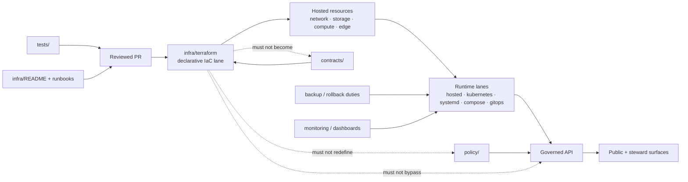

<!-- [KFM_META_BLOCK_V2]
doc_id: kfm://doc/NEEDS-VERIFICATION
title: terraform
type: standard
version: v1
status: draft
owners: @bartytime4life
created: YYYY-MM-DD
updated: YYYY-MM-DD
policy_label: public
related: [../README.md, ../../README.md, ../../.github/CODEOWNERS, ../../contracts/README.md, ../../policy/README.md, ../../schemas/README.md, ../../tests/README.md, ../../apps/api/README.md]
tags: [kfm, infra, terraform, iac]
notes: [Current public main shows infra/terraform contains README.md only; doc_id and dates need verification before publish.]
[/KFM_META_BLOCK_V2] -->

# terraform

Declarative Infrastructure-as-Code lane for reviewable KFM provisioning, hosted environment wiring, and non-secret runtime state.

> **Status:** experimental  
> **Owners:** [`@bartytime4life`](../../.github/CODEOWNERS)  
>      
> **Repo fit:** `infra/terraform/README.md` is the directory guide for the Terraform lane under [`../`](../), alongside [`backup/`](../backup/), [`compose/`](../compose/), [`dashboards/`](../dashboards/), [`gitops/`](../gitops/), [`hosted/`](../hosted/), [`kubernetes/`](../kubernetes/), [`local/`](../local/), [`monitoring/`](../monitoring/), [`systemd-or-compose/`](../systemd-or-compose/), and [`systemd/`](../systemd/).  
> **Quick jump:** [Scope](#scope) · [Repo fit](#repo-fit) · [Accepted inputs](#accepted-inputs) · [Exclusions](#exclusions) · [Directory tree](#directory-tree) · [Quickstart](#quickstart) · [Usage](#usage) · [Diagram](#diagram) · [Operating tables](#operating-tables) · [Task list](#task-list--definition-of-done) · [FAQ](#faq) · [Appendix](#appendix)

> [!IMPORTANT]
> The current public `main` snapshot confirms that `infra/terraform/` exists, but it does **not** currently prove an active Terraform module inventory. At the time of writing, the visible subtree is `infra/terraform/README.md` only. Treat providers, backends, modules, workspaces, `tfvars`, and apply workflows as **NEEDS VERIFICATION** until live Terraform files are present and reviewed.

> [!NOTE]
> Terraform is a **lane**, not the whole infrastructure story. KFM doctrine keeps deployment lanes legible and distinct: local/systemd-first operation, compose, hosted overlays, Kubernetes, GitOps, monitoring, backup, dashboards, rollback, and governed API boundaries should not be collapsed into one generic “infra” bucket.

## Evidence labels used in this README

| Label | Meaning here |
|---|---|
| **CONFIRMED** | Directly visible in the current public repo surface or strongly repeated in current KFM doctrine. |
| **INFERRED** | Strongly suggested by adjacent repo structure and doctrine, but not directly proven in `infra/terraform/`. |
| **PROPOSED** | Recommended starter shape or workflow that fits KFM doctrine and neighboring repo docs. |
| **NEEDS VERIFICATION** | A reviewable gap that should be checked before implementation, promotion, or refactor. |

## Scope

`infra/terraform/` is the place for **reviewed, declarative infrastructure state** that helps KFM run safely in hosted or multi-service environments.

That includes infrastructure definitions for network, storage, compute, load balancing, DNS, IAM-adjacent references, observability prerequisites, and other environment wiring that should be versioned, diffable, and reversible.

This directory is **not** where KFM’s policy law, dataset truth, public claim semantics, or application business rules should quietly migrate.

### Scope in one sentence

Terraform may provision the environment around KFM, but it must not become the hidden owner of KFM meaning.

[Back to top](#terraform)

## Repo fit

**Path:** `infra/terraform/README.md`

The parent [`infra/README.md`](../README.md) defines infrastructure as the surface for bring-up, deployment, runtime control, exposure management, observability wiring, restore, and rollback. Inside that frame, Terraform belongs on the side of **reviewable hosted/IaC state**, while governed publication, evidence resolution, policy meaning, and user-facing truth remain elsewhere.

| Direction | Link | Why it matters |
|---|---|---|
| Upstream | [`../README.md`](../README.md) | Parent infrastructure doctrine, sibling-lane framing, and the broader infra exclusions Terraform must respect. |
| Upstream | [`../../README.md`](../../README.md) | Root KFM identity, truth posture, and repo-wide governance reading frame. |
| Ownership | [`../../.github/CODEOWNERS`](../../.github/CODEOWNERS) | Current public repo ownership mapping for `/infra/`. |
| Adjacent | [`../hosted/`](../hosted/) | Environment-specific hosted deployment overlays and operational notes. |
| Adjacent | [`../kubernetes/`](../kubernetes/) | Cluster/runtime substrate once resource wiring hands off to orchestrated workloads. |
| Adjacent | [`../gitops/`](../gitops/) | Desired-state reconciliation after build/test and environment preparation. |
| Adjacent | [`../monitoring/`](../monitoring/) · [`../dashboards/`](../dashboards/) | Monitoring, dashboards, and operator feedback that infra changes often affect directly. |
| Adjacent | [`../local/`](../local/) · [`../systemd/`](../systemd/) · [`../systemd-or-compose/`](../systemd-or-compose/) · [`../compose/`](../compose/) | Lower-complexity runtime lanes that may coexist with, precede, or remain preferable to Terraform for some deployments. |
| Adjacent | [`../backup/`](../backup/) | Restore, backup, and rollback obligations that infrastructure changes must not ignore. |
| Boundary | [`../../contracts/README.md`](../../contracts/README.md) | Contract families and machine-checkable objects Terraform should consume, not redefine. |
| Boundary | [`../../policy/README.md`](../../policy/README.md) | Policy meaning, deny-by-default logic, and reviewable decision grammar stay here, not inline in IaC glue. |
| Boundary | [`../../schemas/README.md`](../../schemas/README.md) | Schema authority/boundary guidance for machine-readable structures. |
| Boundary | [`../../tests/README.md`](../../tests/README.md) | Verification surfaces for negative paths, fixtures, release/correction drills, and later infra checks. |
| Boundary | [`../../apps/api/README.md`](../../apps/api/README.md) | Governed API boundary that public/steward surfaces should reach through, rather than bypass via infra shortcuts. |

### Upstream / downstream reading order

**Read first**
1. [`../../README.md`](../../README.md)
2. [`../README.md`](../README.md)

**Then read across**
1. [`../../contracts/README.md`](../../contracts/README.md)
2. [`../../policy/README.md`](../../policy/README.md)
3. [`../../tests/README.md`](../../tests/README.md)
4. runtime-adjacent lanes under [`../`](../)

[Back to top](#terraform)

## Accepted inputs

The following belong here when this lane becomes active and review-backed.

| Input class | Examples | Status |
|---|---|---|
| Declarative infrastructure definitions | root stacks, reusable modules, `providers.tf`, `versions.tf`, backend definitions, import/move metadata | **PROPOSED** |
| Environment descriptors | reviewed non-secret variables, workspace overlays, hosted/shared environment parameters | **PROPOSED** |
| Hosted resource wiring | network segments, storage, buckets, compute primitives, DNS, load balancers, certificate references | **PROPOSED** |
| Runtime handoff outputs | values consumed by hosted, Kubernetes, GitOps, monitoring, dashboards, or API deployment lanes | **PROPOSED** |
| Infra migration material | state-move notes, import manifests, cutover checklists, rollback notes | **PROPOSED** |
| Secret references only | secret-manager paths, KMS key identifiers, external secret references, vault paths | **PROPOSED** |
| Observability prerequisites | alert plumbing, sink wiring, metrics/log destinations, backup targets, restore dependencies | **PROPOSED** |

### Accepted inputs rule

Keep this lane **declarative**, **reviewable**, and **non-secret**.

## Exclusions

The following do **not** belong here.

| Does not belong here | Why | Put it here instead |
|---|---|---|
| Business logic or domain rules | Infra files should not become a hidden home for application law. | [`../../apps/`](../../apps/) · [`../../packages/`](../../packages/) |
| Canonical API semantics | Request/response meaning needs a stronger review surface than infra descriptors. | [`../../contracts/README.md`](../../contracts/README.md) |
| Policy meaning as ad hoc IaC logic | Policy must remain explicit, testable, and reviewable outside infra glue. | [`../../policy/README.md`](../../policy/README.md) |
| Dataset truth or publication state | Terraform may provision storage or edge delivery, but not redefine truth state. | data/catalog/release surfaces governed elsewhere in the repo |
| Plaintext secrets | KFM should not normalize secrets-in-repo convenience. | external secret system / environment-specific secure store |
| Silent promotion logic | Deployment success is not equivalent to governed publication. | release, review, and policy surfaces |
| Long-form doctrine or ADR rationale | README should guide the lane, not absorb every architecture essay. | [`../../docs/`](../../docs/) |
| Unreviewed helper scripts as sovereign infra truth | Helpers may assist, but authoritative desired state belongs in the declarative lane. | authoritative state here; helper tooling under [`../../scripts/`](../../scripts/) when justified |

[Back to top](#terraform)

## Directory tree

### Current confirmed public-main snapshot

```text
infra/
├── README.md
├── backup/
├── compose/
├── dashboards/
├── gitops/
├── hosted/
├── kubernetes/
├── local/
├── monitoring/
├── systemd/
├── systemd-or-compose/
└── terraform/
```

### Observed current subtree

```text
infra/terraform/
└── README.md
```

### Proposed starter expansion shape

<details>
<summary>Open a reviewable starter layout</summary>

```text
infra/terraform/
├── README.md
├── modules/                    # PROPOSED
│   ├── network/                # PROPOSED
│   ├── storage/                # PROPOSED
│   ├── compute/                # PROPOSED
│   ├── edge/                   # PROPOSED
│   ├── observability/          # PROPOSED
│   └── backup/                 # PROPOSED
├── envs/                       # PROPOSED
│   ├── shared/                 # PROPOSED
│   ├── hosted/                 # PROPOSED
│   └── recovery/               # PROPOSED
├── versions.tf                 # PROPOSED
├── providers.tf                # PROPOSED
├── backend.tf                  # PROPOSED
├── variables.tf                # PROPOSED
├── outputs.tf                  # PROPOSED
└── examples/                   # PROPOSED
```

</details>

### Tree interpretation rule

Use the observed tree as current repo truth.

Use the proposed tree only as a **reviewable direction** if and when this lane stops being README-only.

[Back to top](#terraform)

## Quickstart

Start by verifying what the live tree actually contains before assuming a module layout.

```bash
# 1) Inspect the current infrastructure surface
git rev-parse --show-toplevel
find infra -maxdepth 2 -print | sort

# 2) Inspect this lane specifically
find infra/terraform -maxdepth 3 -print | sort

# 3) Confirm whether real Terraform files exist yet
find infra/terraform -type f \
  \( -name '*.tf' -o -name '*.tfvars' -o -name '.terraform.lock.hcl' \) \
  | sort

# 4) Re-read adjacent doctrine before choosing this lane
sed -n '1,220p' infra/README.md
sed -n '1,220p' contracts/README.md
sed -n '1,220p' policy/README.md
sed -n '1,220p' tests/README.md
sed -n '1,220p' apps/api/README.md
```

If real Terraform files exist in the working branch, switch to a review-first validation loop.

```bash
# Illustrative only: run these after *.tf files actually exist
cd infra/terraform

terraform fmt -check -recursive
terraform validate

# Prefer saved plans for reviewable diffs
terraform plan -out=tfplan
terraform show -no-color tfplan
```

### Quickstart rules

1. **Inventory first.** Confirm what is real in the branch you are editing.
2. **Choose the right lane.** Do not force every infra concern into Terraform if a sibling lane owns it more clearly.
3. **Keep the change small.** One material infrastructure change class per PR where practical.
4. **Pair the diff with rollback language.** Reversibility is part of readiness.
5. **Update adjacent docs.** Infra changes that alter runtime behavior, monitoring, restore, or exposure assumptions should not land silently.

[Back to top](#terraform)

## Usage

### What this directory is for

Use `infra/terraform/` to version infrastructure that benefits from:

- declarative desired state
- reviewable diffs
- reproducible provisioning
- environment-scoped configuration
- explicit handoff to sibling runtime lanes
- rollback-aware change discipline

### What good usage looks like

1. Infrastructure intent is visible in reviewed files.
2. Secret values stay outside the repo.
3. Blast radius is obvious from the diff.
4. Outputs are treated as downstream contracts, not casual convenience strings.
5. Hosted resource changes are paired with documentation and rollback notes.

### What bad usage looks like

- Hiding business rules inside tags, locals, or variable conventions
- Smuggling policy meaning into infra-only logic without policy-side review
- Treating “apply succeeded” as equivalent to “promotion is governed”
- Letting provider-specific shortcuts bypass the governed API or trust membrane
- Using this lane as a dumping ground for unrelated shell scripts or undocumented ops folklore

### Practical lane boundary

Terraform should wire **environment**.  
It should not redefine **meaning**.

### PR posture for Terraform changes

A good Terraform PR should answer four questions in plain language:

1. **What changed?**
2. **Which environment or runtime lane is affected?**
3. **How will operators verify the change worked?**
4. **What is the rollback path if it was wrong?**

[Back to top](#terraform)

## Diagram


```mermaid
flowchart LR
    PR[Reviewed PR] --> TF[infra/terraform<br/>declarative IaC lane]
    TF --> HOSTED[Hosted resources<br/>network · storage · compute · edge]
    HOSTED --> RUNTIME[Runtime lanes<br/>hosted · kubernetes · systemd · compose · gitops]
    RUNTIME --> API[Governed API]
    API --> SURFACES[Public + steward surfaces]

    CONTRACTS[contracts/] --> TF
    POLICY[policy/] --> API
    TESTS[tests/] --> PR
    DOCS[infra/README + runbooks] --> PR
    BACKUP[backup / rollback duties] --> RUNTIME
    OBS[monitoring / dashboards] --> RUNTIME

    TF -. must not bypass .-> API
    TF -. must not redefine .-> POLICY
    TF -. must not become .-> CONTRACTS
```

**Reading rule:** Terraform provisions or wires the environment. It must **not** become the hidden owner of publication law, runtime trust decisions, or shared object meaning.

[Back to top](#terraform)

## Operating tables

### Current lane snapshot

| Question | Current public-main answer | Status |
|---|---|---|
| Does `infra/terraform/` exist? | Yes. | **CONFIRMED** |
| Is there a dedicated README here? | Yes. | **CONFIRMED** |
| Are visible `*.tf` files confirmed in this lane? | Not in the current public snapshot used for this guide. | **NEEDS VERIFICATION** |
| Are providers/backend/modules/workspaces documented by code here? | Not yet visible. | **NEEDS VERIFICATION** |
| Is this lane already integrated with sibling infra docs? | This README can and should align with parent `infra/README.md` and adjacent lane docs. | **INFERRED** |
| Is Terraform the first KFM thin slice? | No. KFM doctrine prefers hydrology as the first smallest real thing. | **CONFIRMED** |

### Responsibility boundary matrix

| Area | Terraform involvement | Must not cross |
|---|---|---|
| Network / ingress / egress | Usually strong | Must not expose direct client paths that bypass governed APIs |
| Storage / buckets / object lifecycle | Usually strong | Must not redefine catalog closure or dataset semantics |
| Compute substrate / base services | Usually strong | Must not hide application business rules in infra-only wiring |
| Secret references | Sometimes strong | Must not store plaintext secret values |
| Monitoring sinks and alert plumbing | Often adjacent | Must not replace runbooks, SLOs, or operator judgment |
| DNS / TLS / edge routing | Often strong | Must not silently alter access-control assumptions |
| API route semantics | Weak / indirect | Route and payload meaning belong outside raw infra descriptors |
| Policy meaning | Weak / indirect | Terraform may wire policy runtimes, not become policy law |
| Promotion / publication state | No | Deploying infrastructure is not the same as promoting truth |

### Change classes and required companions

| Change class | Typical companions | Merge posture |
|---|---|---|
| Network boundary change | access-path note, blast-radius note, rollback step, monitoring check | Do not merge without explicit exposure reasoning |
| Storage change | retention note, backup/restore note, migration note | Do not merge without state and recovery consequences |
| Runtime substrate change | downstream lane check, health-check note, monitoring update | Do not merge if observability falls behind the change |
| Secret reference change | external-secret path note, rotation note, environment impact note | Do not merge with plaintext values |
| Shared module change | consumer impact list, compatibility note, regression coverage | Do not merge without downstream review |
| Backend/state change | migration plan, lock/ownership note, recovery drill | Treat as high-risk even when the diff looks small |

### Minimal review bundle

| Item | Expectation |
|---|---|
| IaC diff | Small, scoped, and reviewable |
| Rollback path | Explicit and credible |
| Docs | Updated or explicitly unchanged for a reason |
| Ownership | Reviewer path is obvious |
| Secret posture | No plaintext leakage |
| Boundary integrity | No bypass of the governed API or policy surfaces |
| Runtime impact note | Names which sibling lanes or operators are affected |

[Back to top](#terraform)

## Task list / definition of done

A healthy `infra/terraform/` lane should eventually satisfy the following.

- [ ] Current Terraform inventory is verified against the live tree.
- [ ] Provider and version conventions are documented.
- [ ] Backend and state-locking decisions are explicit.
- [ ] Secret-reference strategy is documented and plaintext secrets are excluded.
- [ ] Shared module boundaries are named and reviewable.
- [ ] Downstream consumers of outputs are documented.
- [ ] Validation commands are documented and runnable.
- [ ] Rollback notes exist for stateful or blast-radius-heavy changes.
- [ ] Monitoring and backup consequences are paired with infrastructure changes.
- [ ] This README is revised again once the lane stops being README-only.

### Definition of done for a material Terraform PR

- the change is small enough to understand in one sitting
- the target environment is explicit
- the rollback path is credible
- the downstream effect is named
- the adjacent docs are updated when behavior changed
- no hidden bypass of KFM trust seams is introduced

[Back to top](#terraform)

## FAQ

### Is Terraform the only valid infrastructure lane for KFM?

No. The parent infrastructure surface already keeps multiple lanes visible. Terraform is the declarative IaC lane, not a mandate to collapse hosted, local, systemd-first, compose, Kubernetes, GitOps, monitoring, backup, and dashboard concerns into one tool choice.

### Can Terraform publish datasets or promote releases?

No. Terraform may provision infrastructure that supports those flows, but promotion changes trust state and belongs to governed release, review, policy, and evidence surfaces.

### Can plaintext secrets live here?

No. Keep secret values out of repository truth. Use reviewed references to an external secret mechanism instead.

### Why are so many items marked NEEDS VERIFICATION?

Because the current public `main` snapshot proves the directory, but not a real Terraform file inventory inside it. This guide is meant to be useful now without pretending missing evidence is present.

### When should a change move out of Terraform?

When it starts carrying business meaning, policy logic, dataset semantics, release law, or application behavior that deserves a more explicit review surface than raw infrastructure state.

[Back to top](#terraform)

## Appendix

<details>
<summary>Observed state, review questions, and next verification steps</summary>

### Observed current public-main state

- `infra/terraform/` exists.
- The visible subtree currently confirms `README.md` only.
- The parent `infra/` surface confirms sibling lanes for backup, compose, dashboards, GitOps, hosted, Kubernetes, local, monitoring, systemd, and systemd-or-compose.
- The current public lane therefore behaves more like a **boundary guide** than an active Terraform code inventory.

### Why this README is still worth keeping now

Even before live Terraform files land, the repo benefits from a clear answer to three questions:

1. What belongs in this lane?
2. What does **not** belong in this lane?
3. How should this lane relate to the rest of `infra/` and the governed KFM trust model?

### Review questions before this lane becomes active

1. Is Terraform currently an active delivery lane or still a reserved placeholder?
2. What environments, if any, will be managed here first?
3. What is the state backend and locking model?
4. How will secrets be referenced?
5. Which outputs are expected by `hosted/`, `kubernetes/`, `gitops/`, or `monitoring/`?
6. Which changes require restore drills or state-migration rehearsal?

### Suggested neighboring link updates once real `.tf` files exist

- add links from [`../README.md`](../README.md) into the first real Terraform modules or env roots
- add validation snippets to [`../../tests/README.md`](../../tests/README.md) if Terraform checks become part of CI
- add policy links from [`../../policy/README.md`](../../policy/README.md) if policy-driven infra gates become executable
- add runbooks under `docs/` or `infra/` when real backend/state operations exist

</details>

[Back to top](#terraform)
