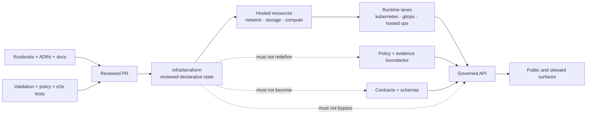

# terraform

Declarative Infrastructure-as-Code lane for reviewable KFM provisioning, hosted environment wiring, and non-secret runtime state.

> **Status:** experimental  
> **Owners:** NEEDS VERIFICATION  
>      
> **Repo fit:** `infra/terraform/README.md` is the directory guide for the Terraform lane under [`../`](../), alongside hosted, Kubernetes, GitOps, monitoring, dashboard, and local/runtime infrastructure surfaces.  
> **Quick jump:** [Scope](#scope) · [Repo fit](#repo-fit) · [Accepted inputs](#accepted-inputs) · [Exclusions](#exclusions) · [Directory tree](#directory-tree) · [Quickstart](#quickstart) · [Usage](#usage) · [Diagram](#diagram) · [Operating tables](#operating-tables) · [Task list](#task-list--definition-of-done) · [FAQ](#faq) · [Appendix](#appendix)

> [!IMPORTANT]
> This README is intentionally evidence-bounded. The directory is real, but the live branch-visible subtree does **not** currently prove an active Terraform module inventory beyond this README. Treat provider choices, backends, module names, variable files, and apply workflows as **NEEDS VERIFICATION** until the live checkout is inspected.

> [!NOTE]
> KFM infrastructure doctrine keeps multiple deployment lanes compatible. Terraform is the **declarative hosted/IaC lane**, not the only legitimate lane. Thin local/systemd-first operation, hosted overlays, Kubernetes, GitOps, monitoring, and rollback discipline are adjacent concerns that must stay legible rather than being collapsed into one undifferentiated “infra” bucket.

## Evidence labels used in this README

| Label | Meaning here |
|---|---|
| **CONFIRMED** | Directly visible in the current repo surface or strongly repeated in current KFM doctrine. |
| **INFERRED** | Strongly suggested by adjacent repo structure and doctrine, but not directly proven inside this subtree. |
| **PROPOSED** | Recommended starter shape or workflow that fits KFM doctrine and neighboring docs. |
| **UNKNOWN** | Not verified strongly enough to present as current repo truth. |
| **NEEDS VERIFICATION** | A reviewable gap that should be checked before implementation or refactor. |

## Scope

`infra/terraform/` is the place for **reviewed, declarative infrastructure state** that helps KFM run safely in hosted or managed environments.

That includes environment wiring such as network, storage, compute, observability-adjacent resource definitions, and other Infrastructure-as-Code assets that should be versioned, reviewed, diffable, and reversible.

This directory is **not** where KFM’s business law, policy meaning, dataset truth, publication state, or public-surface semantics should quietly migrate.

[Back to top](#terraform)

## Repo fit

**Path:** `infra/terraform/README.md`

This directory sits under [`infra/`](../), which already frames infrastructure as the surface for bring-up, deployment, runtime control, observability wiring, restore, and rollback. In KFM terms, Terraform belongs on the side of **environment wiring and delivery mechanics**, while governed publication, policy meaning, evidence resolution, and user-facing truth remain elsewhere.

| Direction | Link | Why it matters |
|---|---|---|
| Upstream | [`../README.md`](../README.md) | Parent infrastructure doctrine, exclusions, and sibling-lane framing. |
| Upstream | [`../../README.md`](../../README.md) | Root project identity, trust posture, and repo-wide reading rules. |
| Adjacent | [`../hosted/`](../hosted/) | Hosted deployment overlays and environment-specific operations. |
| Adjacent | [`../kubernetes/`](../kubernetes/) | Cluster/runtime substrate once Terraform-managed resources hand off to orchestrated workloads. |
| Adjacent | [`../gitops/`](../gitops/) | Reviewed desired-state reconciliation after build/test and environment wiring. |
| Adjacent | [`../monitoring/`](../monitoring/) · [`../dashboards/`](../dashboards/) | Observability and operator-facing runtime feedback that infra changes often affect. |
| Adjacent | [`../local/`](../local/) · [`../systemd/`](../systemd/) · [`../systemd-or-compose/`](../systemd-or-compose/) | Lower-complexity runtime lanes that may coexist with, or precede, a Terraform-managed hosted lane. |
| Boundary | [`../../contracts/`](../../contracts/) · [`../../schemas/`](../../schemas/) | Terraform may consume infra-facing contracts, but must not redefine shared object semantics. |
| Boundary | [`../../policy/`](../../policy/) | Terraform can wire policy runtimes and references, but policy meaning must stay reviewable in policy surfaces. |
| Boundary | [`../../apps/`](../../apps/) · [`../../packages/`](../../packages/) | Application and reusable business law stay out of raw infrastructure descriptors. |
| Boundary | [`../../docs/`](../../docs/) · [`../../tests/`](../../tests/) | Infra changes should be explained and tested, not left implicit in code alone. |

### Upstream / downstream reading

**Upstream reading first**
1. [`../../README.md`](../../README.md)
2. [`../README.md`](../README.md)

**Downstream reading next**
1. hosted and runtime lanes under [`../`](../)
2. contract and policy boundaries under [`../../contracts/`](../../contracts/) and [`../../policy/`](../../policy/)
3. validation and rollback surfaces under [`../../tests/`](../../tests/) and [`../../docs/`](../../docs/)

[Back to top](#terraform)

## Accepted inputs

The following belong here when this lane is active and review-backed.

| Input class | Examples | Status |
|---|---|---|
| Declarative infrastructure definitions | Terraform modules, root stacks, provider configuration, backend declarations, import/move metadata | **PROPOSED** |
| Environment descriptors | `tfvars`, overlay inputs, shared vs hosted environment parameters | **PROPOSED** |
| Hosted resource wiring | Network segments, storage/buckets, compute primitives, IAM-adjacent references, DNS/load-balancer wiring | **PROPOSED** |
| Runtime handoff outputs | Values or outputs consumed by Kubernetes, GitOps, monitoring, or app deployment lanes | **PROPOSED** |
| Reviewable migration material | Import plans, state-move notes, cutover checklists, rollback notes | **PROPOSED** |
| Non-secret references | Secret manager paths, key identifiers, external secret references, policy bundle locations | **PROPOSED** |
| Observability-related infrastructure | Logging/metrics sinks, alert wiring, dashboard prerequisites, backup targets | **PROPOSED** |

## Exclusions

The following do **not** belong here.

| Does not belong here | Why | Put it here instead |
|---|---|---|
| Business logic or domain rules | Infra descriptors must not become a hidden home for application law. | [`../../packages/`](../../packages/) · [`../../apps/`](../../apps/) |
| Canonical API semantics | OpenAPI and schema meaning need their own review surface. | [`../../contracts/`](../../contracts/) · [`../../schemas/`](../../schemas/) |
| Policy meaning as ad hoc inline logic | Policy must stay explicit, testable, and reviewable outside infra glue. | [`../../policy/`](../../policy/) |
| Dataset truth or catalog closure | Terraform may provision storage, but not redefine the truth path. | [`../../data/`](../../data/) |
| Plaintext secrets | KFM should not normalize secrets-in-repo convenience. | External secret system / environment-specific secure store |
| Silent publication logic | Deployment and promotion are not the same event in KFM. | Release / promotion / policy surfaces |
| One-off shell scripts as the source of infra truth | Reviewable declarative state should not dissolve into operator folklore. | Keep small helper scripts under [`../../scripts/`](../../scripts/) and authoritative state here |
| Detached design rationale | Infra changes need nearby docs and ADR support. | [`../../docs/`](../../docs/) |

[Back to top](#terraform)

## Directory tree

### Observed current state

```text
infra/terraform/
└── README.md
```

### Proposed expansion shape

<details>
<summary>Open proposed starter layout</summary>

```text
infra/terraform/
├── README.md
├── modules/                    # PROPOSED
│   ├── network/                # PROPOSED
│   ├── storage/                # PROPOSED
│   ├── compute/                # PROPOSED
│   ├── iam-references/         # PROPOSED
│   ├── observability/          # PROPOSED
│   └── backup/                 # PROPOSED
├── envs/                       # PROPOSED
│   ├── shared/                 # PROPOSED
│   ├── hosted/                 # PROPOSED
│   └── recovery/               # PROPOSED
├── versions.tf                 # PROPOSED
├── providers.tf                # PROPOSED
├── backend.tf                  # PROPOSED
├── outputs.tf                  # PROPOSED
├── variables.tf                # PROPOSED
└── examples/                   # PROPOSED
```

</details>

### Tree interpretation rule

Use the observed tree as current repo truth.

Use the proposed tree only as a **reviewable direction** if the live checkout confirms Terraform is an active lane and not just a reserved directory.

[Back to top](#terraform)

## Quickstart

Start by verifying the live subtree before assuming any module layout.

```bash
# 1) Inspect what is actually present today
tree infra/terraform
git log --stat -- infra/terraform

# 2) Inspect neighboring infrastructure lanes before choosing where a change belongs
tree -L 2 infra

# 3) Search for Terraform references across the repo
grep -R "terraform" -n .github docs infra configs scripts || true
```

If real Terraform files exist in the working branch, use a review-first flow.

```bash
# Illustrative only: run these after *.tf files actually exist
cd infra/terraform

terraform fmt -check -recursive
terraform validate

# Prefer a saved plan for reviewable diffs
terraform plan -out=tfplan
terraform show -no-color tfplan
```

### Quickstart rules

1. **Inventory first.** Confirm what is real in the live checkout.
2. **Choose the right lane.** Do not force every infra concern into Terraform if a sibling lane owns it more clearly.
3. **Keep the change small.** One material infra change class per PR where possible.
4. **Pair the diff with a rollback note.** Reversibility is part of readiness.
5. **Update adjacent docs.** Infra changes that alter runtime behavior, monitoring, or operator expectations should not land silently.

[Back to top](#terraform)

## Usage

### What this directory is for

Use `infra/terraform/` to version the parts of KFM infrastructure that benefit from:

- declarative desired state
- reviewable diffs
- environment-specific descriptors
- reproducible provisioning
- auditable rollback posture

### What good usage looks like

1. Describe the change in reviewed files.
2. Keep secrets out of the directory.
3. Make ownership and blast radius obvious.
4. Keep handoff boundaries explicit:
   - Terraform wires the environment.
   - Runtime controllers keep workload state true.
   - Governed APIs and policy keep publication and access lawful.
5. Treat outputs as contracts with downstream lanes, not as casual convenience values.

### What bad usage looks like

- Hiding business rules inside resource definitions
- Smuggling policy meaning into variables or tags with no policy-side review
- Using long-lived environment branches as the real source of truth
- Treating “apply succeeded” as equivalent to “promotion is governed”
- Shipping unreviewed production-only behavior that exists nowhere in repository truth

### PR posture for Terraform changes

A good Terraform PR should answer four things clearly:

1. **What changed?**
2. **What runtime or operator risk changed with it?**
3. **How will we know the change worked?**
4. **How do we back out cleanly if it was wrong?**

[Back to top](#terraform)

## Diagram


```mermaid
flowchart LR
    PR[Reviewed PR] --> TF[infra/terraform<br/>reviewed declarative state]
    TF --> HOSTED[Hosted resources<br/>network · storage · compute]
    HOSTED --> RUNTIME[Runtime lanes<br/>kubernetes · gitops · hosted ops]
    RUNTIME --> API[Governed API]
    API --> SURFACES[Public and steward surfaces]

    POLICY[Policy + evidence boundaries] --> API
    CONTRACTS[Contracts + schemas] --> API
    DOCS[Runbooks + ADRs + docs] --> PR
    TESTS[Validation + policy + e2e tests] --> PR

    TF -. must not bypass .-> API
    TF -. must not redefine .-> POLICY
    TF -. must not become .-> CONTRACTS
```

**Reading rule:** Terraform provisions or wires the environment; it must **not** become the hidden owner of publication state, policy meaning, or application truth.

[Back to top](#terraform)

## Operating tables

### Responsibility boundary matrix

| Area | Terraform involvement | Must not cross |
|---|---|---|
| Network / ingress / egress | Usually strong | Must not expose direct client paths that bypass governed APIs |
| Storage / buckets / object lifecycle | Usually strong | Must not redefine catalog closure or dataset semantics |
| Compute substrate / base services | Usually strong | Must not hide app-specific business rules in infra-only wiring |
| Secret references | Sometimes strong | Must not store plaintext secret values |
| Monitoring sinks and alert plumbing | Often adjacent | Must not replace operational runbooks or SLO decisions |
| DNS / TLS / edge routing | Often strong | Must not silently alter access-control assumptions |
| API route semantics | Weak / indirect | Routes and payload meaning belong outside raw infra descriptors |
| Policy meaning | Weak / indirect | Infra may wire policy runtimes, not become policy law |
| Promotion / publication state | No | Deploying infrastructure is not the same as promoting truth |

### Change classes and required companions

| Change class | Typical companions | Merge posture |
|---|---|---|
| Network boundary change | Security review note, blast-radius note, rollback step, monitoring check | Do not merge without explicit access-path reasoning |
| Storage change | Retention note, backup/restore note, migration note, cost note | Do not merge without state and recovery consequences |
| Compute/runtime substrate change | Runtime handoff note, downstream lane check, health/alert update | Do not merge if observability falls behind the change |
| Secret reference change | External secret path note, rotation note, environment impact note | Do not merge with plaintext values |
| Shared module change | Consumer impact list, versioning note, regression coverage | Do not merge without downstream compatibility review |
| Environment descriptor change | Exact target environment note, diff summary, rollback path | Prefer small, environment-scoped PRs |
| Bootstrap / backend change | State migration plan, lock/ownership note, recovery drill | Treat as high-risk even when code diff looks small |

### Minimal review bundle

| Item | Expectation |
|---|---|
| IaC diff | Small, reviewable, and scoped |
| Rollback path | Explicit and tested where practical |
| Monitoring updates | Included when runtime behavior changes |
| Docs | Updated or explicitly unchanged for a reason |
| Ownership | Reviewer path is obvious |
| Secret posture | No plaintext secret leakage |
| Boundary integrity | No direct bypass of governed API or policy surfaces |

[Back to top](#terraform)

## Task list / definition of done

A healthy `infra/terraform/` lane should eventually satisfy the following.

- [ ] Owners for this subtree are verified and documented.
- [ ] The live Terraform inventory is exported and reconciled against this README.
- [ ] Provider, backend, and state-locking conventions are documented.
- [ ] Secret-reference strategy is explicit and plaintext secrets are excluded.
- [ ] Shared module boundaries are named and reviewable.
- [ ] Relationship to sibling lanes (`gitops`, `kubernetes`, `hosted`, `monitoring`) is documented.
- [ ] Required validation commands are documented and runnable.
- [ ] Rollback notes exist for stateful or blast-radius-heavy changes.
- [ ] Observability consequences are paired with infra changes.
- [ ] This README is updated when the subtree stops being placeholder-only.

**Definition of done for a material Terraform PR**

- the change is small enough to understand in one sitting
- the environment target is explicit
- the rollback path is credible
- the downstream effect is named
- any affected docs are updated
- no hidden bypass of KFM trust seams is introduced

[Back to top](#terraform)

## FAQ

### Is Terraform the only valid infrastructure lane for KFM?

No. KFM infrastructure doctrine keeps multiple lanes compatible. Terraform is the declarative hosted/IaC lane; local, systemd-first, hosted, Kubernetes, GitOps, monitoring, and restore/rollback lanes may all exist beside it.

### Can Terraform publish datasets or promote releases?

No. Terraform may provision infrastructure that supports those flows, but **promotion changes trust state** and belongs to governed release, policy, evidence, and runtime surfaces.

### Can plaintext secrets live here?

No. Keep secret values out of repository truth. Use reviewed references to an external secret mechanism instead.

### Why are so many items marked NEEDS VERIFICATION?

Because the current branch-visible subtree confirms the directory, but does not yet prove a real module inventory inside it. This README is meant to be useful now without pretending missing evidence is present.

### When should a change move out of Terraform?

When it starts carrying business meaning, policy logic, dataset semantics, or application behavior that should be reviewed somewhere more explicit than infra state.

[Back to top](#terraform)

## Appendix

<details>
<summary>Observed current state vs proposed next shape</summary>

### Observed current state
- `infra/terraform/` exists.
- The current visible file surface confirms this README path.
- Sibling infrastructure lanes exist under `infra/`.

### Proposed next shape
- add a module inventory only after live checkout inspection
- document provider/backend/state decisions only after confirming real code
- map downstream consumers before introducing shared outputs
- keep migration notes and rollback posture beside the lane, not in operator memory

### Review questions to answer before this directory becomes “active”
1. Is Terraform currently an active lane or still a reserved placeholder?
2. Who owns hosted-state changes for this subtree?
3. What is the state backend and locking model?
4. How are secrets referenced?
5. What is the handoff boundary to `gitops/` and `kubernetes/`?
6. Which changes require restore drills or state-migration rehearsal?

</details>
