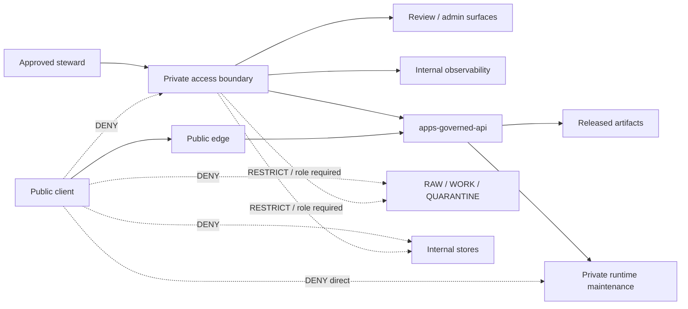

<!-- [KFM_META_BLOCK_V2]
doc_id: kfm://doc/infra-vpn-readme
title: infra/vpn/ — Private Access, Steward-Only Boundaries, and VPN Governance
type: per-directory-readme
version: v1
status: draft
owners:
  - <infra-steward>
  - <security-owner>
  - <ops-steward>
created: 2026-07-03
updated: 2026-07-03
policy_label: public
related:
  - infra/README.md
  - infra/hardening/README.md
  - infra/hardening/CHECKLIST.md
  - infra/reverse_proxy/
  - infra/firewall/
  - infra/systemd/
  - infra/docker/
  - infra/compose/
  - infra/kubernetes/
  - infra/terraform/
  - configs/
  - runtime/
  - apps/governed-api/
  - apps/explorer-web/
  - apps/review-console/
  - docs/doctrine/directory-rules.md
  - docs/security/README.md
  - docs/security/EXPOSURE_PLAN.md
  - docs/security/INCIDENT_RESPONSE.md
  - docs/security/KEY_ROTATION.md
  - docs/architecture/deployment-topology.md
  - docs/runbooks/
  - policy/
  - release/
  - data/published/
tags:
  - kfm
  - infra
  - vpn
  - private-access
  - steward-access
  - deny-by-default
  - least-privilege
  - auditability
  - key-rotation
  - trust-membrane
notes:
  - "VPN documentation in this repository is governance and review guidance only. Do not commit live VPN configs, private keys, peer inventories, credentials, tokens, certificates, or production access material."
  - "VPN/private access may protect steward-only operations, but it does not authorize publication, raw-data exposure, direct model access, or bypasses around governed APIs, policy checks, evidence checks, review state, or release gates."
[/KFM_META_BLOCK_V2] -->

<a id="top"></a>

# `infra/vpn/` — Private Access, Steward-Only Boundaries, and VPN Governance

> **One-line purpose.** Keep KFM private-access documentation inspectable and reviewable while ensuring VPN access remains deny-by-default, least-privilege, auditable, reversible, and subordinate to governed APIs and release controls.


---

## Quick jump

[Purpose](#purpose) · [Status & authority](#status--authority) · [Repo fit](#repo-fit) · [What belongs here](#what-belongs-here) · [What does not belong here](#what-does-not-belong-here) · [Private access boundary](#private-access-boundary) · [Access classes](#access-classes) · [Governance expectations](#governance-expectations) · [Proposed structure](#proposed-structure) · [Validation](#validation) · [Review burden](#review-burden) · [Open verification](#open-verification)

---

## Purpose

`infra/vpn/` is the KFM lane for private-access governance. It may document how steward-only access is requested, reviewed, granted, rotated, revoked, audited, and rolled back. It may also document non-sensitive route intent, access classes, denial requirements, and review checklists.

This folder is **not** a place for runnable VPN setup material or live access credentials. It exists to keep the governance boundary clear:

```text
RAW -> WORK / QUARANTINE -> PROCESSED -> CATALOG / TRIPLET -> PUBLISHED
```

VPN/private access can protect internal review, steward, maintenance, or emergency workflows. It does not replace KFM policy checks, evidence checks, release gates, correction paths, rollback paths, or governed API behavior.

Public users still use governed public routes:

```text
public client -> public edge -> apps/governed-api/ or released public artifacts
```

Private access must not create a quiet shortcut to RAW stores, WORK stores, QUARANTINE stores, unpublished candidates, direct model endpoints, source credentials, internal/canonical stores, admin actions, or release authority.

[Back to top](#top)

---

## Status & authority

| Field | Value |
|---|---|
| **Document type** | Per-directory README |
| **Owning responsibility root** | `infra/` |
| **Subpath role** | `vpn/` — private-access governance, steward-only access boundaries, peer/access lifecycle notes, route-intent notes, validation expectations, and rollback guidance |
| **Authority level** | Draft governance guidance. KFM doctrine, accepted ADRs, `policy/`, security runbooks, and release gates outrank this README. |
| **Lifecycle phase** | n/a — private-access infrastructure governance, not lifecycle data |
| **Default posture** | Deny-by-default access; least privilege by role, route intent, owner, purpose, and review state |
| **Owners** | `<infra-steward>`, `<security-owner>`, `<ops-steward>` — fill from CODEOWNERS when assigned |
| **Reviewers required** | Infra steward + security owner for access model, route intent, admin/review access, model-runtime maintenance access, raw/internal-store access, key-rotation references, or production private-access changes |
| **Directory Rules basis** | `infra/` owns deployment, host, network, and exposure posture; `vpn/` is a named lane under the expected `infra/` tree. |

[Back to top](#top)

---

## Repo fit

```text
Kansas-Frontier-Matrix/
└── infra/
    ├── README.md
    ├── docker/
    ├── compose/
    ├── reverse_proxy/
    ├── vpn/              ◀── you are here
    │   └── README.md
    ├── firewall/
    ├── systemd/
    ├── kubernetes/
    ├── terraform/
    └── hardening/
```

### Responsibility split

| Location | Owns | Does not own |
|---|---|---|
| `infra/vpn/` | Private-access governance, steward-only route intent, access lifecycle checklists, rotation/revocation notes, validation expectations | Live VPN configs, private keys, policy semantics, app code, release decisions, schemas, raw data |
| `infra/firewall/` | Network firewall boundaries and deny rules around public/private access | Peer identity lifecycle unless delegated by docs |
| `infra/reverse_proxy/` | HTTP/TLS/CORS route behavior and public edge | Private tunnel governance |
| `infra/hardening/` | Cross-infra hardening checklist and review burden | VPN-specific access model details unless delegated here |
| `infra/systemd/` | Host service units if private-access services are systemd-managed | Private-access policy semantics |
| `infra/terraform/` | Provisioned private-network resources when Terraform-managed | Live credentials, private keys, peer inventories |
| `configs/` | Non-secret examples and templates | Live private-access configs or credentials |
| `policy/` | Enforceable allow / deny / restrict / abstain rules | Network tunnel mechanics |
| `apps/review-console/` | Review/admin application behavior | Private transport control |
| `release/` | Release decisions, manifests, rollback cards, corrections | Access grants or private routes |

[Back to top](#top)

---

## What belongs here

Use `infra/vpn/` for non-sensitive private-access governance material such as:

- Access model documentation for steward-only, admin-only, review-only, maintenance-only, and emergency-only paths.
- Access request, approval, review, expiration, rotation, revocation, and offboarding checklists.
- Route-intent documentation that labels routes by class without exposing private host inventories.
- Private-access validation checklists.
- Key-rotation references that point to security runbooks without storing key material.
- Sanitized diagrams showing trust boundaries and denied public paths.
- Audit expectations for access grants, access removals, route changes, and emergency exceptions.
- Rollback/revocation guidance for bad access grants or incorrect route exposure.

Accepted file types are Markdown checklists, sanitized diagrams, governance notes, redacted validation summaries, and non-sensitive templates. Keep this folder useful for reviewers without making it useful to someone trying to access private systems.

[Back to top](#top)

---

## What does not belong here

Do **not** use `infra/vpn/` as a secret store, live access inventory, or hidden admin authority.

The following must not live here:

- Private keys, shared secrets, live peer configs, production access bundles, tokens, certificates, QR codes, passwords, kubeconfigs, SSH keys, cloud credentials, or source credentials.
- Real peer inventories containing personal device details, private address assignments, private hostnames, home networks, internal service maps, or sensitive access metadata.
- Raw source data, WORK data, QUARANTINE data, catalog records, triplets, proofs, receipts, release manifests, or published data artifacts.
- KFM policy bundles, release decisions, promotion receipts, correction notices, or rollback cards.
- App source code, runtime adapters, model code, or schema definitions.
- Public routes to model runtimes, RAW / WORK / QUARANTINE, internal/canonical stores, source credentials, admin panels, review consoles, or debug endpoints.
- Broad private-network access notes that lack role, owner, purpose, expiration/review trigger, and rollback/revocation path.
- Unredacted incident data or sensitive vulnerability working notes.

If private access material is accidentally committed here, treat it as a security incident: revoke or rotate affected access, audit repository exposure, remove the material, and record the response through the incident/runbook process.

[Back to top](#top)

---

## Private access boundary

VPN/private access is a controlled steward path, not a public path and not a publication shortcut.



### Required private-access guarantees

A private-access design is not acceptable until it can show these negative states:

1. Public traffic cannot enter private-access paths.
2. Public traffic cannot reach steward-only routes.
3. Public traffic cannot reach direct model-runtime endpoints.
4. Public traffic cannot reach RAW / WORK / QUARANTINE.
5. Public traffic cannot reach internal/canonical stores.
6. Private access does not grant publication authority.
7. Private access does not automatically grant raw-data access.
8. Private access does not bypass KFM policy, evidence, review, correction, or release gates.
9. Access can be revoked quickly.
10. Route-intent changes are auditable and rollback-safe.

[Back to top](#top)

---

## Access classes

| Access class | Default | Notes |
|---|---:|---|
| Public user traffic | DENY to private access | Public clients use the public edge and governed API only. |
| Steward review access | RESTRICT | For review console, admin tools, private dashboards, and evidence review workflows. |
| Admin maintenance access | RESTRICT | Requires owner, reason, audit trail, and rollback path. |
| Model-runtime maintenance access | RESTRICT | Direct access is maintenance-only; normal use should flow through governed API adapters. |
| RAW / WORK / QUARANTINE access | RESTRICT | Only for approved pipeline/source/data stewardship tasks; never public. |
| Internal/canonical store access | RESTRICT | Least privilege and logged where practical. |
| Released artifact access | ALLOW when released | Public release path should not require private access unless intentionally staged. |
| Debug endpoints | DENY by default | Temporary exception requires owner, expiration, and rollback. |
| Emergency access | RESTRICT | Time-bounded, audited, documented, and revoked after use. |

[Back to top](#top)

---

## Governance expectations

### Access lifecycle

- Every access grant should have an owner, purpose, approval, creation date, and review trigger.
- Temporary access requires an expiration date.
- Offboarding must revoke access and rotate affected shared material when needed.
- Shared identities are discouraged because they weaken auditability.
- Emergency access should be time-bounded and reviewed after use.

### Secrets and credentials

- Do not commit private access credentials or live access bundles.
- Do not commit production route files that reveal sensitive private topology.
- Document secret names or secret-store references only when needed for governance.
- Key rotation and credential handling should link to the security runbook rather than duplicating sensitive procedures here.

### Route intent

- Route intent should be explicit, narrow, and reviewable.
- Private access should not grant broad internal access without documented reason.
- Route documents should label access class without exposing sensitive host inventories.
- Admin/review routes must still require application-level authentication and audit where practical.

### Audit and logging

- Access grants, access removals, route-intent changes, and emergency exceptions should produce audit evidence.
- Logs and review notes must not leak credentials, private topology, restricted data, or sensitive source material.
- Retention and access control are **NEEDS VERIFICATION** until deployment topology is known.

[Back to top](#top)

---

## Proposed structure

The exact private-access implementation is **NEEDS VERIFICATION**. Keep the structure governance-focused until the deployment choice is known.

```text
infra/vpn/
├── README.md
├── ACCESS_MODEL.md              # roles, route classes, approvals, expiration, revocation
├── ROUTE_INTENT.md              # non-sensitive route classes; no private inventory
├── ACCESS_LIFECYCLE.md          # request, approve, review, rotate, revoke, offboard
├── EMERGENCY_ACCESS.md          # time-bounded exception governance
├── validation/
│   ├── README.md
│   └── private-access-checklist.md
└── rollback/
    └── README.md
```

Do not create live configuration examples in this folder until the security owner approves a safe redaction convention.

[Back to top](#top)

---

## Validation

Private-access changes require positive authorization evidence and negative public-exposure evidence.

| Check | Expected result | Evidence |
|---|---|---|
| Path placement | Material belongs under `infra/vpn/` and is governance/access-boundary documentation | PR review |
| Secret scan | No credentials, private keys, live configs, tokens, certificates, or sensitive access inventories committed | Secret scan result |
| Access owner | Each access class has an owner or steward role | Access model note |
| Purpose | Each access class has a documented operational purpose | Access model note |
| Expiration/review | Temporary or elevated access has expiration or review trigger | Lifecycle note |
| Public denial | Public users cannot enter private-access paths | Redacted negative test summary |
| Model denial | Public users cannot reach model runtime directly | Redacted negative test summary |
| Raw-data denial | Public users cannot reach RAW/WORK/QUARANTINE | Redacted negative test summary |
| Admin auth | Private admin/review paths still require authentication/audit where practical | Review note |
| Revocation | Access can be removed quickly | Revocation note |
| Logging | Access changes are auditable without leaking secrets | Redacted audit note |
| Rollback | Bad access or route changes can be reverted or disabled | Rollback note |

Do not paste private topology, credentials, live peer details, private hostnames, internal address inventories, or sensitive logs into public PR discussion.

[Back to top](#top)

---

## Review burden

| Change type | Required review |
|---|---|
| README-only wording with no posture change | Infra steward or docs steward |
| Private-access stack adoption or replacement | Infra steward + security owner + ADR or architecture note |
| Access model, access lifecycle, or revocation process | Security owner + ops steward |
| Route-intent change touching admin/review surfaces | Ops steward + security owner |
| Route-intent change touching RAW / WORK / QUARANTINE / internal stores | Data steward + security owner |
| Model-runtime maintenance access | Runtime owner + security owner |
| Key-rotation or credential-reference language | Security owner + infra steward |
| Production private-access boundary | Infra steward + security owner |
| Emergency access exception | Security owner + ops steward + rollback/revocation note |
| Exception to least privilege or deny-by-default | ADR or documented risk acceptance with rollback path |

[Back to top](#top)

---

## Open verification

- [ ] Confirm chosen private-access approach and whether detailed config belongs here, in host-local secure storage, or in another protected system.
- [ ] Confirm whether private access is used for local-only, homelab, staging, production, or emergency workflows.
- [ ] Confirm access approval, expiration, revocation, and review process.
- [ ] Confirm key rotation process and where real credentials are stored.
- [ ] Confirm route-intent documentation convention that avoids sensitive private topology.
- [ ] Confirm whether admin/review surfaces require private access plus application authentication.
- [ ] Confirm model-runtime maintenance access pattern.
- [ ] Confirm RAW / WORK / QUARANTINE access boundaries for steward tasks.
- [ ] Confirm logging, retention, and redaction posture.
- [ ] Confirm validation evidence format for private-access changes.
- [ ] Confirm rollback/revocation procedure for incorrect access grants.
- [ ] Confirm CODEOWNERS for `infra/vpn/`.

[Back to top](#top)

---

## Last reviewed

| Field | Value |
|---|---|
| Last reviewed | 2026-07-03 |
| Review status | Draft README replacing greenfield stub |
| Next review trigger | First concrete private-access design, access lifecycle, route-intent, key-rotation reference, admin/review access, model-runtime maintenance access, or production private-access PR |
