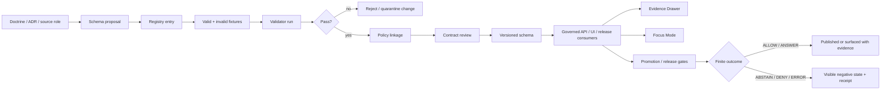

<!-- [KFM_META_BLOCK_V2]
doc_id: kfm://doc/<TODO-VERIFY-UUID>
title: jsonschema
type: standard
version: v1
status: draft
owners: <TODO-VERIFY-OWNER>
created: <TODO-VERIFY-CREATED-DATE>
updated: 2026-04-29
policy_label: <TODO-VERIFY-POLICY-LABEL>
related: [../contracts/README.md, ../schemas/README.md, ../docs/adr/ADR-schema-home.md, ../policy/README.md, ../tests/README.md, ../data/registry/README.md]
tags: [kfm, jsonschema, schemas, contracts, validation, governance]
notes: [Target path requested by current documentation task; repository checkout and schema-home authority still need verification.]
[/KFM_META_BLOCK_V2] -->

<a id="top"></a>

# `jsonschema`

Machine-readable schema surface for KFM governed object contracts, validation fixtures, and evidence-bearing release gates.


> [!IMPORTANT]
> **Status:** experimental  
> **Owners:** `<TODO-VERIFY-OWNER>`  
> **Path:** `jsonschema/README.md`  
> **Current authority posture:** **NEEDS VERIFICATION** — this README is written for the requested `jsonschema/` path, but active schema-home authority must be confirmed before new schemas are added here.  
> **Quick jumps:** [Scope](#scope) · [Repo fit](#repo-fit) · [Inputs](#accepted-inputs) · [Exclusions](#exclusions) · [Directory tree](#directory-tree) · [Schema rules](#schema-authoring-rules) · [Validation](#validation) · [Gates](#review-gates) · [FAQ](#faq) · [Appendix](#appendix-illustrative-schema-template)

---

## Scope

`jsonschema/` is the proposed home or status surface for JSON Schema definitions that make KFM governed objects testable, versionable, and reviewable.

This directory may be used for schemas only after maintainers confirm whether it is the active canonical schema home, a compatibility mirror, a generated export location, or a legacy/transition path.

KFM schemas should support the project’s core trust posture:

- **evidence-first:** visible claims resolve to evidence-bearing objects, not prose alone;
- **map-first and time-aware:** spatial, temporal, source, and review scope stay explicit;
- **policy-aware:** schemas validate shape, while policy and review decide release eligibility;
- **auditable:** validators, fixtures, receipts, and release objects must reconstruct what happened;
- **reversible:** breaking schema changes require versioning, compatibility notes, and rollback planning.

> [!NOTE]
> **CONFIRMED doctrine:** KFM uses governed object families such as `EvidenceBundle`, `DecisionEnvelope`, `ReleaseManifest`, `CatalogMatrix`, receipts, policy decisions, and promotion decisions.  
> **NEEDS VERIFICATION:** whether those schemas currently live under `jsonschema/`, `schemas/`, `schemas/contracts/v1/`, `contracts/`, or another repo-native path.

[Back to top](#top)

---

## Repo fit

| Relationship | Path | Status | Role |
|---|---:|---|---|
| This README | `jsonschema/README.md` | **TARGET** | Directory landing page for schema scope, accepted inputs, exclusions, validation posture, and review gates. |
| Schema-home ADR | `../docs/adr/ADR-schema-home.md` | **PROPOSED / NEEDS VERIFICATION** | Must decide whether `jsonschema/`, `schemas/`, `schemas/contracts/v1/`, or `contracts/` is authoritative. |
| Contract boundary | `../contracts/README.md` | **NEEDS VERIFICATION** | Narrative and interface-contract authority if the repo uses `contracts/` as canonical. |
| Schema boundary | `../schemas/README.md` | **NEEDS VERIFICATION** | Schema status page if the repo uses `schemas/` or `schemas/contracts/v1/`. |
| Policy rules | `../policy/README.md` | **NEEDS VERIFICATION** | Policy-as-code and rule/test layout; schemas must not replace policy decisions. |
| Fixture tests | `../tests/README.md` | **NEEDS VERIFICATION** | Valid/invalid examples and contract validation tests. |
| Source registry | `../data/registry/README.md` | **NEEDS VERIFICATION** | SourceDescriptor instances, source-role records, authority labels, and rights/sensitivity defaults. |

### Upstream expectations

Schemas in this directory are downstream of:

1. KFM doctrine and ADRs.
2. Source authority and schema-home decisions.
3. Contract narratives and object-family definitions.
4. Shared vocabulary and finite outcome decisions.
5. Policy and sensitivity posture.

### Downstream consumers

Schemas here may be consumed by:

- validators in `tools/validators/`;
- contract tests in `tests/contracts/`;
- policy fixtures and promotion gates;
- governed API request/response validation;
- Evidence Drawer, Focus Mode, and review/export payload checks;
- release manifests, proof packs, catalog closure checks, and audit reports.

> [!WARNING]
> Do not create duplicate schema authority. If a matching schema already exists elsewhere, update the schema-home ADR and parent READMEs before adding or copying files into `jsonschema/`.

[Back to top](#top)

---

## Accepted inputs

The following belong in `jsonschema/` only if this directory is confirmed as canonical or explicitly documented as a mirror/export location.

| Input type | Pattern | Belongs here when… | Minimum expectation |
|---|---|---|---|
| JSON Schema files | `*.schema.json` | They define machine-readable shape for KFM governed objects. | `$schema`, stable `$id`, `title`, `description`, required fields, version marker, and no unexplained broad objects. |
| Schema registry files | `_registry.schema.json`, `_registry.json` | The repo uses a machine-readable schema inventory. | Records family, path, version, status, owner, validator, examples, and downstream consumers. |
| Valid fixtures | `fixtures/valid/**/*.json` | Used to prove accepted shape. | One minimal valid fixture per schema. |
| Invalid fixtures | `fixtures/invalid/**/*.json` | Used to prove rejection behavior. | At least one minimal invalid fixture per schema and one reason-coded failure expectation. |
| Object-card READMEs | `*/README.md` | A schema family needs human navigation. | Scope, accepted inputs, exclusions, object map, examples, validation command, and change rules. |
| Shared vocabulary schemas | `vocab/*.schema.json` | Tokens are reused across object families. | Token registry remains subordinate to contracts and policy. |
| Compatibility maps | `compat/**/*.json` | A breaking change is being bridged. | Old/new field mapping, deprecation note, migration owner, rollback note. |

[Back to top](#top)

---

## Exclusions

These do **not** belong in `jsonschema/` unless a future ADR explicitly changes the boundary.

| Excluded material | Where it should go instead | Reason |
|---|---|---|
| RAW, WORK, QUARANTINE, PROCESSED, CATALOG, TRIPLET, or PUBLISHED data | `../data/` lifecycle directories | Schemas define shape; they are not lifecycle data stores. |
| Source registry instances and live source metadata | `../data/registry/` | Source admission is governed separately from schema shape. |
| Policy rules and Rego bundles | `../policy/` | JSON Schema validates structure; policy decides permissions, sensitivity, rights, and release posture. |
| API route handlers or UI components | `../apps/`, `../packages/`, or repo-native app paths | Schemas are contracts, not implementation surfaces. |
| Generated proof packs, receipts, release bundles, and runtime logs | `../data/proofs/`, `../data/receipts/`, `../data/releases/`, or repo-native release paths | Runtime memory and release evidence must remain separate from schema definitions. |
| Free-form model output or chain-of-thought | Governed runtime envelopes and audit records only | AI is interpretive and subordinate to EvidenceBundle, policy, and review state. |
| Unreviewed examples containing sensitive locations, living-person data, DNA data, archaeology site detail, rare species locations, or critical infrastructure detail | Restricted fixtures or quarantine paths | Public schema examples must not leak protected or sensitive content. |
| Duplicated canonical schemas from another active home | The confirmed canonical home | Duplicate authority causes drift. |

[Back to top](#top)

---

## Directory tree

> [!NOTE]
> This tree is **PROPOSED**. Keep it small until schema-home authority is verified.

```text
jsonschema/
├── README.md
├── _registry.schema.json              # PROPOSED: schema registry shape
├── _registry.json                     # PROPOSED: schema registry instance
├── vocab/
│   ├── README.md
│   ├── governed_object_vocabulary.schema.json
│   └── governed_object_vocabulary.json
├── objects/
│   ├── evidence/
│   │   ├── evidence_ref.schema.json
│   │   └── evidence_bundle.schema.json
│   ├── runtime/
│   │   ├── decision_envelope.schema.json
│   │   └── runtime_response_envelope.schema.json
│   ├── policy/
│   │   └── policy_decision.schema.json
│   ├── promotion/
│   │   ├── promotion_decision.schema.json
│   │   ├── release_manifest.schema.json
│   │   └── proof_pack.schema.json
│   ├── catalog/
│   │   └── catalog_matrix.schema.json
│   └── ui/
│       ├── evidence_drawer_payload.schema.json
│       └── focus_query_response.schema.json
├── domains/
│   └── <domain>/
│       └── <domain_object>.schema.json
├── fixtures/
│   ├── valid/
│   └── invalid/
└── compat/
    └── <schema_family>/
```

If the active repo already uses `schemas/contracts/v1/`, `contracts/objects/`, or another path, this tree should become either a redirect/status README or a generated mirror with clear non-canonical labeling.

[Back to top](#top)

---

## Operating model



The important boundary is that schemas do not publish claims. They make claims, payloads, receipts, and decisions inspectable enough for validators, policy gates, review, and downstream interfaces.

[Back to top](#top)

---

## Core schema families

| Family | Example objects | Why it matters | Status |
|---|---|---|---|
| Evidence | `EvidenceRef`, `EvidenceBundle`, `SourceDescriptor` | Supports cite-or-abstain and prevents claims from resolving only to generated prose. | **PROPOSED / NEEDS VERIFICATION** |
| Claims and decisions | `ClaimEnvelope`, `DecisionEnvelope`, `RuntimeResponseEnvelope` | Keeps outcomes finite, machine-readable, and reviewable. | **PROPOSED / NEEDS VERIFICATION** |
| Policy | `PolicyDecision`, `TrustState`, reason-code objects | Records why an action was allowed, denied, abstained, or failed. | **PROPOSED / NEEDS VERIFICATION** |
| Receipts | `RunReceipt`, `AIReceipt`, `ValidationReport`, `RollbackReceipt` | Preserves operational memory: what ran, what changed, what was denied, and why. | **PROPOSED / NEEDS VERIFICATION** |
| Promotion and release | `PromotionDecision`, `ReleaseManifest`, `ProofPack` | Connects validation to release state and rollback targets. | **PROPOSED / NEEDS VERIFICATION** |
| Catalog closure | `CatalogMatrix`, STAC/DCAT/PROV-facing closure objects | Keeps released artifacts traceable to catalog and provenance records. | **PROPOSED / NEEDS VERIFICATION** |
| UI trust payloads | `EvidenceDrawerPayload`, `FocusQueryResponse`, `NegativeStatePayload` | Makes evidence, policy, review, freshness, sensitivity, and correction visible. | **PROPOSED / NEEDS VERIFICATION** |
| Domain lanes | Hydrology, atmosphere, habitat, fauna, flora, people/DNA/land, archaeology, hazards, etc. | Encodes domain-specific object shapes without weakening shared governance rules. | **PROPOSED / NEEDS VERIFICATION** |
| Shared vocabulary | finite outcomes, reason codes, object roles, linkage keys | Prevents enum drift across schemas, policy, validators, and UI. | **PROPOSED / NEEDS VERIFICATION** |

[Back to top](#top)

---

## Schema authoring rules

### 1. Choose one canonical schema home

Before adding schema files, confirm the active rule:

- `jsonschema/` is canonical;
- `jsonschema/` is a generated export;
- `jsonschema/` is a legacy mirror;
- or `jsonschema/` should redirect maintainers to another canonical path.

If more than one schema home exists, record the decision in `../docs/adr/ADR-schema-home.md` and update all parent READMEs.

### 2. Use stable identifiers

Every schema should include a stable `$id`. Do not rewrite `$id` only because a file moves.

Recommended shape, pending repo convention:

```json
{
  "$schema": "https://json-schema.org/draft/2020-12/schema",
  "$id": "kfm://schemas/contracts/v1/<family>/<object>.schema.json",
  "title": "KFM <Object>",
  "description": "Machine-readable shape for <object role>.",
  "type": "object"
}
```

> [!NOTE]
> The draft URI above reflects the strongest available project examples, but the active repo may pin a different draft or validator. Treat the validator target as **NEEDS VERIFICATION** until confirmed.

### 3. Keep schema and policy separate

Schemas may require fields such as `policy_decision_ref`, `sensitivity`, `rights_class`, or `release_ref`, but they must not become the policy engine.

Use schemas to answer:

- “Is this object structurally valid?”
- “Are required references present?”
- “Are finite values drawn from the approved vocabulary?”

Use policy and review to answer:

- “May this be published?”
- “Is exact geometry allowed?”
- “Are rights and source terms sufficient?”
- “Does this claim need steward review?”

### 4. Require fixtures with every schema

Each schema should ship with:

- one minimal valid fixture;
- one minimal invalid fixture;
- one validator command or runbook entry;
- one expected failure reason for invalid fixtures.

### 5. Preserve finite outcomes

Trust-critical outcomes should be finite and shared through vocabulary or enum schemas.

Preferred outcome families include:

- `ANSWER`
- `ABSTAIN`
- `DENY`
- `ERROR`
- `ALLOW`
- `BLOCK`
- `PASS`
- `FAIL`

Do not invent new outcome words in one schema without updating the shared vocabulary and downstream consumers.

### 6. Version breaking changes

Breaking changes require:

1. a version marker;
2. compatibility notes;
3. old/new fixture parity tests;
4. downstream consumer review;
5. rollback path;
6. changelog entry.

### 7. Make sensitivity explicit

Where objects may touch rights, sovereignty, cultural sensitivity, exact locations, rare species, archaeology, critical infrastructure, living persons, DNA, private land, or uncertain source terms, the schema should carry enough fields for policy to fail closed.

[Back to top](#top)

---

## Validation

Use the repo-native validator first. The examples below are illustrative until the actual package manager and validator are confirmed.

### Python example

```bash
# NEEDS VERIFICATION: use only if the repo uses Python + jsonschema.
python -m jsonschema \
  --instance jsonschema/fixtures/valid/evidence_bundle.minimal.json \
  jsonschema/objects/evidence/evidence_bundle.schema.json
```

### Node example

```bash
# NEEDS VERIFICATION: use only if the repo uses Node + AJV.
npx ajv validate \
  -s jsonschema/objects/evidence/evidence_bundle.schema.json \
  -d jsonschema/fixtures/valid/evidence_bundle.minimal.json
```

### Expected validator behavior

| Case | Expected outcome |
|---|---|
| Valid minimal fixture | `PASS` |
| Missing required EvidenceBundle reference | `FAIL` with reason code |
| Unknown finite outcome | `FAIL` with enum or vocabulary reason |
| Sensitive fixture without policy linkage | `FAIL` or `NEEDS_REVIEW`, depending on repo policy |
| Schema added without registry entry | `FAIL` in CI or review gate |
| Breaking schema change without compatibility note | `FAIL` in review gate |

[Back to top](#top)

---

## Review gates

A schema change is ready for review only when these gates are satisfied.

- [ ] Schema-home authority is confirmed or the change explicitly waits on `ADR-schema-home`.
- [ ] Owner is assigned in this README, registry entry, or CODEOWNERS.
- [ ] Schema has stable `$id`, title, description, version marker, required fields, and finite enums where applicable.
- [ ] Valid and invalid fixtures exist.
- [ ] Validator command or runbook entry exists.
- [ ] Policy linkage is documented when sensitivity, rights, release, or review state matters.
- [ ] Downstream consumers are listed: API, UI, validator, policy, catalog, release, or domain lane.
- [ ] Breaking change includes compatibility map and rollback note.
- [ ] Parent README or registry is updated.
- [ ] No duplicate schema authority is introduced.
- [ ] Public examples do not expose protected or sensitive data.
- [ ] EvidenceRef-like fields resolve to EvidenceBundle-like objects rather than free prose.
- [ ] Runtime and promotion outcomes use finite shared vocabulary.

[Back to top](#top)

---

## Change discipline

Prefer the smallest reversible schema change that makes a governed object more inspectable.

| Change type | Required discipline |
|---|---|
| New schema | Add registry entry, object-card note, valid fixture, invalid fixture, validator path, and downstream consumer list. |
| Add optional field | Document why it is needed and whether downstream consumers should ignore it safely. |
| Add required field | Treat as breaking unless all current fixtures and consumers already provide it. |
| Rename field | Use compatibility map and preserve old fixture until migration is complete. |
| Remove field | Treat as breaking; explain consumer impact and rollback. |
| Change enum | Update shared vocabulary, policy, validators, and UI labels together. |
| Move schema | Preserve `$id` unless an ADR explicitly changes identity rules. |

[Back to top](#top)

---

## FAQ

### Is `jsonschema/` the canonical schema home?

**UNKNOWN.** The target path was requested for this documentation task, but active repository evidence is not available here. Confirm whether `jsonschema/` is canonical, generated, mirrored, or legacy before adding files.

### Can a schema decide whether something is publishable?

No. A schema can require fields that policy needs, but publication is a governed state transition involving evidence, rights, sensitivity, review, proof, release, and rollback state.

### Should examples include real Kansas source records?

Only when rights, sensitivity, and release posture are verified. Prefer tiny synthetic fixtures for first-wave contract tests.

### Should `EvidenceBundle` be domain-specific?

Shared evidence shape should remain reusable where possible. Domain lanes may extend or constrain shared objects, but should not fork the meaning of evidence resolution.

### What happens when two schema homes already exist?

Choose one canonical source of truth, map the other as mirror/export/legacy, publish the decision in an ADR, and refuse new additions that bypass it.

[Back to top](#top)

---

## Appendix: illustrative schema template

<details>
<summary>Open a minimal KFM-style schema template</summary>

```json
{
  "$schema": "https://json-schema.org/draft/2020-12/schema",
  "$id": "kfm://schemas/contracts/v1/<family>/<object>.schema.json",
  "title": "KFM <Object>",
  "description": "Illustrative schema template. Replace placeholders and verify draft, validator, owner, and canonical path before use.",
  "type": "object",
  "additionalProperties": false,
  "required": [
    "schema_version",
    "object_id",
    "created_at"
  ],
  "properties": {
    "schema_version": {
      "type": "string",
      "const": "v1"
    },
    "object_id": {
      "type": "string",
      "minLength": 1
    },
    "created_at": {
      "type": "string",
      "format": "date-time"
    },
    "evidence_bundle_ref": {
      "type": ["string", "null"],
      "description": "Use when this object supports or emits a consequential claim."
    },
    "policy_decision_ref": {
      "type": ["string", "null"],
      "description": "Use when release, rights, sensitivity, or access posture matters."
    }
  }
}
```

</details>

<details>
<summary>Open a minimal fixture pair pattern</summary>

```text
jsonschema/
└── fixtures/
    ├── valid/
    │   └── <object>.minimal.valid.json
    └── invalid/
        └── <object>.missing-required.invalid.json
```

```json
{
  "schema_version": "v1",
  "object_id": "kfm://example/object/demo",
  "created_at": "2026-04-29T00:00:00Z",
  "evidence_bundle_ref": null,
  "policy_decision_ref": null
}
```

```json
{
  "schema_version": "v1"
}
```

</details>

[Back to top](#top)