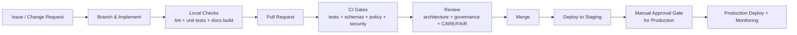

# Master Coder Protocol — MCP

> 🧭 **KFM’s governed contribution contract**: *no shortcuts*, *evidence-first*, and *CI-enforced* quality across **code + data + docs + policy**.

---

## At a glance

| “Badge” | What it means in practice |
|---|---|
| 🛡️ **Governed** | Changes must pass the governance membrane: standards, validation, approvals, and auditability. |
| 🧾 **Provenance-first** | Every substantive claim and every published artifact must be traceable to sources + processing lineage. |
| 🧪 **Test-required** | “Green tests” is a merge gate; tests are part of the deliverable, not a nice-to-have. |
| 📚 **Docs-required** | If you ship it, you document it (including Story Nodes, templates, and API contracts). |
| 🔒 **Policy-as-code** | Policy rules (OPA) protect the trust membrane and enforce compliance at runtime + CI. |
| 🌱 **FAIR + CARE aware** | Sensitive/culturally restricted information is handled with extra care, labeling, and review. |

---

## Non-negotiables

> [!IMPORTANT]
> **Trust membrane rules**
> - The **frontend (React/MapLibre)** and external clients **never** bypass the official API to query data stores.  
> - Core backend logic **never** bypasses repository interfaces to talk directly to databases.  
> These are not “style preferences” — they are governance and security boundaries.

> [!IMPORTANT]
> **Evidence-first**
> - If you cannot ground a statement in a repo artifact (dataset ID, doc reference, commit hash, etc.), you must mark it: **“(not confirmed in repo)”** and include the *minimal verification step*.

---

## Scope of MCP

MCP applies to **everything that can affect system behavior or public narrative**, including:

- ✅ Backend logic (domain, services/use-cases, interface ports/contracts, infra adapters)
- ✅ Frontend UI + API clients
- ✅ ETL and data pipelines (raw → work → processed)
- ✅ Metadata & catalogs (STAC, DCAT, PROV)
- ✅ Story Nodes and governed documentation (templates, standards, runbooks)
- ✅ Policy rules (Open Policy Agent / Rego)
- ✅ CI/CD workflow configuration and security checks

---

## Architecture rules

### Clean layers and boundaries

MCP assumes a **clean / ports-and-adapters** style split that keeps business rules stable while allowing infrastructure to evolve.

| Layer | Purpose | May depend on | Must not depend on |
|---|---|---|---|
| Domain | Pure entities + domain rules | nothing external | DB, web frameworks, UI, filesystem, vendor SDKs |
| Use Case / Service | Workflows + business rules | Domain + abstract ports | DB drivers, HTTP frameworks, UI |
| Integration & Interface | Ports/contracts + adapters boundaries | Domain + Services | direct storage calls from core logic |
| Infrastructure | Real implementations | anything it must implement | (no restriction, but *keep it outside the core*) |

### Trust membrane

- **UI → API only** (no DB calls, no “sneaky connections”).
- **API → services → repositories** (no service-level direct DB queries).
- **OPA policy** is a first-class enforcement mechanism for authorization + compliance.

---

## Contribution workflow



---

## Definition of Done

### PR-level Definition of Done

- [ ] **Change intent** is clear (issue linked, user impact stated)
- [ ] **Architecture boundaries** respected (no trust membrane violations)
- [ ] **Tests added/updated** (and meaningful)
- [ ] **Docs added/updated** (user-facing and/or developer-facing)
- [ ] **No secrets** or credentials committed; configuration uses env vars / secret manager
- [ ] **Metadata & provenance updated** (if data changed)
- [ ] **CI passes** locally (as much as feasible) and in PR
- [ ] **CARE/FAIR** handling applied where relevant
- [ ] **Review-ready**: small, understandable, reversible when possible

---

## Change types and required artifacts

### Backend code changes

**Minimum artifacts**
- Tests for new logic (unit tests for domain/service; integration tests at boundaries)
- Updated docs if behavior changes (API, services, data contracts)
- Updated policy if authorization/sensitivity is affected

**Hard no**
- Business logic in route handlers
- Direct DB access from service layer
- Bypassing repository ports

---

### Frontend changes

**Minimum artifacts**
- UI change description + screenshots (if relevant)
- Tests for key components or user flows (where feasible)
- Confirm API contract compatibility

**Hard no**
- Any direct database access
- Any bypass of the governed API gateway

---

### New dataset or data update

**Minimum artifacts**
- Raw source and/or source reference + manifest
- Processing pipeline code (script/notebook/config)
- Processed outputs in standardized formats
- **STAC Collection + Items**
- **DCAT dataset entry**
- **PROV lineage bundle** (raw → work → processed, including run/config identifiers)
- Validation outputs as required (schema checks, link checks, etc.)

> [!NOTE]
> Metadata must be aligned and cross-linked: STAC ↔ DCAT ↔ PROV, and the graph should reference catalog IDs (not duplicate bulky assets).

---

### Story Nodes and narrative docs

**Minimum artifacts**
- Follow **Story Node Template v3**
- Required sections like **Overview**
- Step directives (map state) per story conventions
- **Citations for factual claims** (footnotes or reference links)
- CI validation passes (template conformance, link checks, dataset ID checks, etc.)

> [!IMPORTANT]
> Story Nodes are governed narrative artifacts and require governance review before publication.

---

### Policy changes OPA

**Minimum artifacts**
- Rego policy change + policy tests
- Clear description of impact (what becomes allowed/denied)
- Evidence that policy changes do not weaken required compliance (e.g., citation requirements)

---

### CI/CD and infrastructure changes

**Minimum artifacts**
- Updated pipeline config + documentation
- Threat-aware review (secrets, dependency scanning, least privilege)
- Proof that the stack is reproducible (Docker/Compose/K8s specs remain valid)

---

## CI gates and typical checks

> [!NOTE]
> Exact tooling can vary by repo config, but MCP expects CI to enforce **code + data + docs** compliance, not code alone.

| Gate | Examples of what it enforces |
|---|---|
| Lint / formatting | Python + JS formatting and style checks |
| Unit tests | Domain + service logic verification |
| Integration tests | API + DB boundary correctness; containerized stack tests |
| Schema validation | JSON schema checks for metadata (DCAT/STAC/PROV, doc front-matter) |
| Docs validation | Markdown lint rules, template conformance, link checks |
| Policy checks | OPA rules tested against scenarios (auth, sensitivity, citations) |
| Security checks | SAST + dependency scanning; secret scanning |

---

## Local “pre-flight” commands

> [!TIP]
> Run these before pushing to avoid CI churn. Adapt to the repo’s actual scripts.

```bash
# Backend
pytest
# or (if containerized)
docker-compose exec backend pytest

# Frontend
npm run lint
npm test

# Docs (if applicable)
mkdocs serve
```

---

## Provenance and metadata requirements

### STAC, DCAT, PROV alignment

- **STAC** describes geospatial assets with spatial/temporal metadata.
- **DCAT** provides discoverability and distributions linking to STAC or data resources.
- **PROV** records end-to-end lineage and configuration so outputs are reproducible.

### Versioning expectations

- Dataset versioning links revisions (e.g., prov:wasRevisionOf) through metadata.
- Graph schema changes must remain compatible unless migrated deliberately.
- API breaking changes require versioning strategy and contract updates.

---

## Story Nodes and Focus Mode

A Story Node is a curated narrative tied to map views and evidence, authored in Markdown with structured directives.

MCP expectations:
- Story content is **structured**, **cited**, and **machine-validated**
- Focus Mode output must preserve evidence, citations, and governance rules

---

## Security and ethics

> [!WARNING]
> If content includes **sensitive locations** or culturally restricted information:
> - generalize/redact,
> - label clearly,
> - route for governance review,
> - do not “fill in gaps” with speculation.

Also:
- Never commit secrets (keys, tokens, credentials)
- Prefer env vars + secret manager integrations
- Use policy enforcement at the API layer to keep a single controlled entry point

---

## Directory layout

> [!NOTE]
> This README defines MCP. Additional MCP artifacts may be added over time.

```text
mcp/
  README.md                         # You are here: protocol overview + rules
  checklists/                       # Optional: PR + change-type checklists
    PR_DOD.md
    DATASET_DOD.md
    STORYNODE_DOD.md
    POLICY_DOD.md
  templates/                        # Optional: reusable templates for governed work
    EXPERIMENT_PROTOCOL.md
    CHANGELOG_ENTRY.md
  examples/                         # Optional: example PRs / story nodes / dataset bundles
    dataset_bundle_minimal/
    story_node_minimal/
```

---

## Canonical references inside the repo

These are the “do not contradict” sources for governed work (paths may vary by repo version):

- `docs/MASTER_GUIDE_v13.md`
- `docs/templates/TEMPLATE__KFM_UNIVERSAL_DOC.md`
- `docs/templates/TEMPLATE__STORY_NODE_V3.md`
- `docs/templates/TEMPLATE__API_CONTRACT_EXTENSION.md`
- `docs/standards/KFM_MARKDOWN_WORK_PROTOCOL.md`
- `docs/standards/KFM_CHATGPT_WORK_PROTOCOL.md`
- `docs/governance/ROOT_GOVERNANCE.md`
- `ETHICS.md`
- `SOVEREIGNTY.md`

---

## Appendix

<details>
<summary><strong>PR checklist mini-template</strong></summary>

- [ ] I did **not** bypass the trust membrane (UI→API only; service→repo only).
- [ ] I added/updated **tests** appropriate to the change.
- [ ] I updated **docs** (and Story Nodes/templates if relevant).
- [ ] I updated **metadata + provenance** (STAC/DCAT/PROV) if data changed.
- [ ] I considered **CARE/FAIR** and flagged sensitive content appropriately.
- [ ] CI should pass with minimal reviewer guesswork.

</details>

<details>
<summary><strong>Experiment protocol skeleton</strong></summary>

```text
Objective:
Background:
Hypothesis:
Methods / Procedure:
Variables:
Data collection plan:
Analysis plan:
Expected outcome:
Deviations log:
Results:
Conclusion:
Next steps:
```

</details>