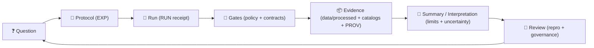
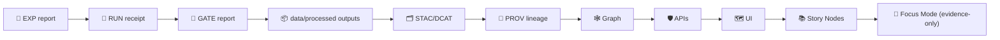

# 🧪 MCP — Master Coder Protocol  
### *Methods, Controls & Processes* 🧾⚙️


> **TL;DR:** `mcp/` is KFM’s **methods + receipts** layer 📓🧠  
> It holds **protocols**, **run receipts**, **SOPs**, **model cards**, **gate reports**, and **review artifacts**—so every result can be **re-run, reviewed, and trusted** ✅  
>
> **v13+ alignment:** KFM is **evidence‑first**, **catalog‑driven**, **API‑centric**, and **policy‑gated**.  
> MCP is the paper trail that keeps those promises honest. 🧾🛡️

> [!IMPORTANT]
> In this repo, **MCP = Master Coder Protocol** ✅  
> **MCP ≠ Model Context Protocol** 🚫 *(not what we mean here)*  
> Keep this distinction consistent in docs, PRs, issues, and commit messages.

---

## 🔗 Quick links
- 🧭 Repo overview: **[`../README.md`](../README.md)**
- 📚 Docs boundary: **[`../docs/README.md`](../docs/README.md)** *(if present)*
- 🧾 Standards & profiles (STAC/DCAT/PROV, ontology, schemas): **[`../docs/standards/`](../docs/standards/)** *(if present)*
- 🧩 Templates (governed formats for docs, Story Nodes, API changes): **[`../docs/templates/`](../docs/templates/)** *(if present)*
- 🏛 Governance (FAIR/CARE/Sovereignty, review gates): **[`../docs/governance/`](../docs/governance/)** *(if present)*
- 🧬 Pipelines boundary (contract portal): **[`../pipelines/`](../pipelines/)** *(if present)*
- 🧰 Scripts boundary (automation): **[`../scripts/`](../scripts/)** *(if present)*
- 🧩 Executable source boundary: **[`../src/`](../src/)** *(if present)*
- 📦 Data + metadata boundary: **[`../data/README.md`](../data/README.md)** *(if present)*
- 🧪 Notebooks boundary (lab bench): **[`../notebooks/`](../notebooks/)** *(if present)*
- 🧰 Validators & tooling: **[`../tools/`](../tools/)** *(if present)*
- ✅ Tests & CI gates: **[`../tests/`](../tests/)** *(if present)*
- 🤝 CI/CD & policies: **[`../.github/`](../.github/)** *(workflows, security policy, automation)*

---

## ⚡ Quick Nav
- [🧾 Doc metadata](#-doc-metadata)
- [🧭 What MCP is](#-what-mcp-is)
- [🧷 Repo invariants](#-repo-invariants)
- [🧱 MCP artifacts](#-mcp-artifacts-types-ids-and-immutability)
- [🚦 Non‑negotiables](#-non-negotiables)
- [🏁 Golden paths](#-golden-paths)
- [🗂️ Directory layout](#-directory-layout)
- [🔁 The MCP workflow loop](#-the-mcp-workflow-loop)
- [🚥 Detect → Validate → Promote](#-detect--validate--promote)
- [🔐 Policy packs & gate reports](#-policy-packs--gate-reports)
- [🤖 Watcher → Planner → Executor receipts](#-watcher--planner--executor-receipts)
- [🧬 DevOps provenance & supply chain](#-devops-provenance--supply-chain)
- [🧾 Front matter + schemas](#-front-matter--schemas-machine-readable-mcp)
- [✅ Definition of done](#-definition-of-done)
- [📦 Required artifacts](#-required-artifacts)
- [🧪 Experiment reports](#-experiment-reports)
- [🏃 Run receipts](#-run-receipts)
- [📈 Performance & scalability experiments](#-performance--scalability-experiments)
- [🧰 SOPs](#-sops)
- [🧠 Model cards](#-model-cards)
- [📓 Notebooks](#-notebooks)
- [🧭 Traceability matrix](#-traceability-matrix)
- [🧯 Bad evidence protocol](#-bad-evidence-protocol)
- [🔗 MCP ↔ KFM evidence pipeline](#-mcp--kfm-evidence-pipeline)
- [🧩 Domain checklists](#-domain-checklists)
- [🔐 Safety, privacy, licensing](#-safety-privacy-licensing)
- [🛡️ Threat model & hostile inputs](#-threat-model--hostile-inputs)
- [✅ QA, audits, and CI hooks](#-qa-audits-and-ci-hooks)
- [🤝 PR / review checklist](#-pr--review-checklist)
- [📚 Project reference library influence map](#-project-reference-library-influence-map)
- [🧾 Reference library index](#-reference-library-index)
- [🕰️ Version history](#-version-history)

---

## 🧾 Doc metadata

| Field | Value |
|---|---|
| Doc | `mcp/README.md` |
| Status | Active ✅ |
| Last updated | **2026-01-26** |
| Audience | Contributors authoring experiments, running jobs, shipping evidence, publishing Story Nodes, training/using models |
| Prime directive | If it changes “spatial truth,” it must be **traceable + reproducible + reviewable** |
| KFM canon (v13+) | **ETL/Streaming → Catalogs (STAC/DCAT/PROV) → Graph → API → UI → Story Nodes → Focus Mode** |
| Special doctrine | **Policy packs gate publishing** + **atomic promotion** + **AI is advisory-only and must cite** |
| API boundary rule | UI never queries Neo4j (or other stores) directly—**only through governed APIs** |

---

## 🧭 What MCP is

### ✅ MCP is…
A **governed method layer** that turns “we tried something” into **auditable science** 🧾✅

- 🧪 **Protocols** (what we intended to do + why)
- 🏃 **Receipts** (what actually ran + how to reproduce)
- 🧰 **SOPs** (repeatable procedures for risky/repeated work)
- 🧠 **Model cards** (responsible AI/ML use + limits)
- 🔐 **Gate reports** (policy/contract checks proving it was safe to publish)
- 👀 **Review artifacts** (what was checked, by whom, what failed)
- 🧭 **Traceability** (decision ↔ evidence ↔ catalogs ↔ provenance ↔ PRs)

### 🚫 MCP is not…
- ❌ A data lake (that’s `data/`)
- ❌ A code dump (that’s `src/`, `pipelines/`, `web/`)
- ❌ A place for large binaries (store in `data/processed/**` + catalogs)
- ❌ A place for “unsourced narrative” (Story Nodes must cite evidence artifacts)
- ❌ A runtime governance ledger (that lives in system telemetry / governance ledger), but MCP **references** ledger IDs when relevant

> [!TIP]
> MCP exists to make “results” **explainable and replayable**—not merely impressive. 🧾🧠

---

## 🧷 Repo invariants

These are the “you can build anything, but not *like that*” constraints.  
They align MCP with KFM’s v13+ blueprint: **catalog-driven**, **API-centric**, **policy-enforced**, and **transparent**.

### 🧱 Invariant 1 — Pipeline ordering is absolute
**ETL/Streaming → Catalogs (STAC/DCAT/PROV) → Graph → API → UI → Story Nodes → Focus Mode**  
No skipping steps. No “temporary UI demo” without catalogs + lineage.

### 🧬 Invariant 2 — Provenance-first publishing (including streaming)
Anything “published” (referenced by graph, APIs, UI, Story Nodes, dashboards, or Focus Mode) must have:
- a **catalog record** (STAC/DCAT) 🗂️  
- a **PROV lineage record** 🧬  
…**before** it is used downstream.

> Streaming isn’t exempt: snapshots/aggregations must be traceable (windowing + cadence + lineage).

### 🧾 Invariant 3 — Contracts are first-class
Schemas/profiles/contracts are interfaces—treat them like APIs.  
If it can’t validate, it can’t ship. 🧱✅

### 🧷 Invariant 4 — API boundary is non-negotiable
The UI must never query Neo4j/PostGIS/search indexes directly.  
All access goes through the governed API layer so access control, redaction, and schema consistency are enforced centrally. 🛡️

### 🔁 Invariant 5 — ETL must be deterministic + idempotent
Given the same inputs + config:
- same IDs, same hashes, same catalogs
- safe to rerun without double-writing or corrupting state
- automation uses **idempotency keys** + has a **kill switch** 🧯

### 📦 Invariant 6 — Work vs processed areas are distinct
- `data/work/**` = scratch/intermediate (safe to delete, not “evidence”) 🧪
- `data/processed/**` = final evidence artifacts (versioned, cataloged, lineage-linked) 📦🗂️🧬

### 🚀 Invariant 7 — Promotion is atomic
**Promote =** `data/processed` outputs + **STAC/DCAT** + **PROV** + *(optional)* graph ingest bundle  
as one consistent publish step.  
If any gate fails → publish remains staged. No half-publishes. 🧾✅

### 🔐 Invariant 8 — Policy packs gate publishing
Publishing must pass automated policy checks (OPA/Conftest style), including:
- contracts/schema validation
- STAC/DCAT/PROV validity + link integrity
- no sensitivity downgrade
- license/attribution propagation
- Story/Focus citation coverage checks (when narrative/AI exists)
- supply-chain + secrets scanning (when relevant)

### 🧊 Invariant 9 — Dual-format evidence stays one truth
When a domain needs both **analysis format** and **UI format**:
- produce both (e.g., **GeoParquet** for analytics + **PMTiles** for map rendering) 🧊
- catalog both under the same dataset identity/metadata
- keep provenance common and explicit (same inputs, same pipeline run)

### 🤖 Invariant 10 — Focus Mode is advisory-only and evidence-bound
Focus Mode can **suggest** and **summarize**. It cannot “declare truth” unless it:
- cites evidence artifacts (catalog IDs / graph entities)  
- passes governance checks (content + sensitivity rules)  
- shows uncertainty/refuses when evidence is insufficient

### 🧾 Invariant 11 — Everything decision-worthy gets a receipt
Every decision-worthy run captures:
- input/output hashes (or stable IDs) 🔢
- config + environment snapshot 🧱
- commit hash + entrypoint 🧩
- gate report(s) 🔐
- catalog IDs + PROV pointers 🗂️🧬
- governance ledger references when available 🏛

---

## 🧱 MCP artifacts (types, IDs, and immutability)

MCP stays reliable because artifacts are **typed**, **named**, and **handled correctly**.

| Artifact | Prefix / ID pattern | Where | Immutable? | Purpose |
|---|---|---|---:|---|
| 🧪 Experiment protocol | `EXP-YYYY-MM-DD-<slug>.md` | `mcp/experiments/` | ⚠️ Mutable while `draft` | Pre-register intent, assumptions, validation plan |
| 🏃 Run receipt | `RUN-YYYY-MM-DD-<slug>/` | `mcp/runs/` | ✅ Yes | What executed + how to reproduce |
| 🔐 Gate report | `GATE-YYYY-MM-DD-<slug>.md` *(or `.json`)* | `mcp/gates/` *(recommended)* | ✅ Yes | Proof of policy/contract checks (OPA/Conftest + schema + link integrity) |
| 🚀 Promotion receipt | `PROMOTE-YYYY-MM-DD-<slug>/` *(optional)* | `mcp/promotions/` *(optional)* | ✅ Yes | Atomic publish record: what changed in evidence + catalogs |
| 🧬 DevOps provenance bundle | `DEVPROV-YYYY-MM-DD-<slug>.jsonld` *(optional)* | `mcp/dev_prov/` *(or `data/prov/dev/`)* | ✅ Yes | PR/build provenance (who/what built this, linked to datasets/runs) |
| 🧰 SOP | `SOP-<topic>-v<semver>.md` | `mcp/sops/` | ✅ Versioned | Repeatable procedures (risky/frequent tasks) |
| 🧠 Model card | `MODEL-<name>-v<semver>.md` | `mcp/model_cards/` | ✅ Versioned | Intended use, limits, datasets, governance for ML/AI |
| 📄 Dataset datasheet *(recommended)* | `DATASET-<name>-v<semver>.md` | `mcp/datasheets/` *(optional)* | ✅ Versioned | Ethical/quality notes for curated datasets |
| 📚 Glossary / concept notes *(recommended)* | `GLOSSARY.md` *(or `TERM-*.md`)* | `mcp/glossary/` *(optional)* | ✅ Append-only mindset | Shared vocabulary across domains |
| 👀 Review note | `REV-YYYY-MM-DD-<slug>.md` | `mcp/reviews/` *(recommended)* | ✅ Yes | Independent reproduction + governance sign-off |
| 🧭 Traceability | `TRACEABILITY.md` *(or `TRACE-*.md`)* | `mcp/traceability/` | ✅ Append-only mindset | Decision/feature → EXP/RUN → evidence + catalogs + PRs |
| 🧯 Incident / anomaly | `INC-YYYY-MM-DD-<slug>.md` *(optional)* | `mcp/incidents/` | ✅ Yes | Post-mortems and regression gates |

> [!IMPORTANT]
> **Run receipts and gate reports are immutable.**  
> If anything changes (inputs, params, code, env, policy pack) → create a **new** artifact and link it. ✅

---

## 🚦 Non‑negotiables

These rules keep KFM **scientific**, **auditable**, and **governed**:

1) **Evidence lives in `data/` — not in `mcp/`.** 📦  
   - `mcp/` = methods, decisions, receipts, checklists  
   - `data/processed/...` = outputs (**must be cataloged + lineage-linked**)

2) **Contract-first by default.** 🧾🧱  
   If you publish an artifact, you must also publish the contract it conforms to (schema/profile/version).

3) **Provenance-first publishing (always).** 🧬  
   If it’s referenced by graph/API/UI/Story/Focus, it must have STAC/DCAT + PROV before use.

4) **API boundary is enforced.** 🛡️  
   UI/clients must not bypass governance by reading databases directly.

5) **Policy packs gate shipping.** 🔐  
   If a policy pack says “no,” it doesn’t ship—no “temporary” bypass.

6) **Protocol before run (when it matters).** 🧾➡️🏃  
   If results influence product decisions, public narratives, pipelines, or models: write an **EXP** first.

7) **No “magic results.”** 🪄🚫  
   If you can’t reproduce it using commit hash + env + config + evidence pointers (+ hashes), it’s not done.

8) **Immutable receipts.** 🧾  
   Don’t edit a receipt to “fix history.” Create a new receipt and link it.

9) **No privacy / sensitivity downgrade.** 🔒  
   Outputs cannot be less restricted than inputs without an explicit, reviewed redaction step.

10) **Licensing isn’t optional.** ⚖️  
   License + attribution must propagate through catalogs, narratives, exports, and AI answers.

11) **Stable IDs are correctness features.** 🏷️  
   IDs should be stable across reruns when inputs haven’t changed—treat IDs like API contracts.

> [!TIP]
> Motto: **“If I can’t reproduce it in 30 minutes, it’s not complete.”** ⏱️✅

---

## 🏁 Golden paths

### 🌿 Path A — “I’m adding a dataset / layer”
1. 🧲 Intake source → record checksum(s) + license + care label  
2. ⚙️ Run deterministic ETL → write intermediates to `data/work/`  
3. 📦 Write final artifacts to `data/processed/` *(versioned)*  
4. 🗂️ Publish **STAC + DCAT** metadata  
5. 🧬 Publish **PROV** (inputs + activity + outputs)  
6. 🔐 Run gates (contracts + catalogs + policy packs) → write `GATE-...`  
7. 🏃 Record `RUN-...` receipt + update `TRACEABILITY.md`  
8. 🚀 Promote atomically (optional `PROMOTE-...`) → then ingest to Graph/API

### 📚 Path B — “I’m shipping a Story Node”
1. ✍️ Author story Markdown + storyboard JSON (declarative map/timeline state)  
2. 🔗 Ensure every claim cites cataloged evidence (no orphan links)  
3. 🔐 Run Story gates (link integrity + citation coverage + sensitivity propagation)  
4. 🏃 Record receipt + review note if story is public-facing

### 🤖 Path C — “I’m updating Focus Mode / AI behavior”
1. 🧠 Update model/prompt/retrieval rules + record exact version hashes  
2. 🔐 Ensure policies enforce: citations required + refusal under uncertainty  
3. 🧪 Run evaluation harness (citation coverage, refusal tests, bias checks)  
4. 🧾 Publish model card update + gate report + traceability entry

---

## 🗂️ Directory layout

```text
📁 mcp/
├── 📄 README.md                 # you are here 👋
├── 📁 experiments/              # experiment protocols 🧪🧾
├── 📁 runs/                     # immutable run receipts 🏃🧾
├── 📁 gates/                    # immutable gate reports 🔐✅ (recommended)
├── 📁 promotions/               # atomic publish receipts 🚀 (optional)
├── 📁 dev_prov/                 # PR/build provenance bundles 🧬 (optional)
├── 📁 sops/                     # Standard Operating Procedures 🧰
├── 📁 model_cards/              # model cards for ML/AI used or trained 🧠
├── 📁 datasheets/               # dataset datasheets (optional but valuable) 📄
├── 📁 glossary/                 # shared vocabulary across domains (optional) 📚
├── 📁 notebooks/                # tidy, reproducible notebooks 📓
├── 📁 traceability/             # decision ↔ evidence mapping 🧭 (recommended)
├── 📁 reviews/                  # repro notes / governance sign-offs 👀 (recommended)
├── 📁 incidents/                # post-mortems / anomaly reports 🧯 (optional)
└── 📁 templates/                # local templates 🧩 (or use docs/templates/)
```

> [!NOTE]
> Repo implementations vary. If `gates/`, `traceability/`, or `reviews/` don’t exist yet, add them—  
> policy packs + traceability + reproduction notes are core v13+ promises.

---

## 🔁 The MCP workflow loop

KFM work is: **question → protocol → run → gates → evidence → publish → review → iterate** 🔁



---

## 🚥 Detect → Validate → Promote

KFM risk comes from “half-published” artifacts. MCP enforces a controlled rhythm:

1) **Detect** 🕵️  
   Identify new inputs/changes (sources updated, schema drift, new tiles, new docs).

2) **Validate** ✅  
   Run fast gates:
   - contract/schema checks (domain + metadata)
   - STAC/DCAT validation
   - PROV presence + link integrity
   - governance propagation (no downgrade)
   - security scans (secrets, unsafe deps, unsafe parsing)
   - **policy packs** (OPA/Conftest) 🔐

3) **Promote** 🚀  
   Only after validation:
   - write evidence to `data/processed/**`
   - write STAC/DCAT/PROV (provenance-first)
   - optionally export graph ingest bundles
   - record `RUN` + `GATE` + traceability update

> [!TIP]
> Treat “promotion” like a release: **atomic publish or nothing.** 🧾✅

---

## 🔐 Policy packs & gate reports

Policy is a **first-class publish gate** (not a reviewer “nice-to-have”).  
We expect:
- policy logic in versioned **OPA/Rego** packs
- execution via **Conftest** (or equivalent) in CI/local
- a **gate report** proving what ran and what passed

### 🧰 Gate taxonomy (recommended)
| Gate type | What it protects | Typical tooling |
|---|---|---|
| 🧾 Contract validation | Schema compatibility and drift control | JSON Schema / Pydantic / Great Expectations |
| 🗂️ Catalog validity | STAC/DCAT structure + required fields | stac-validator, JSON Schema, custom checks |
| 🧬 PROV integrity | Lineage completeness + link integrity | JSON-LD validation, link checkers |
| 🛡️ API boundary | Prevent bypass of governance | integration tests, lint rules |
| 🔐 Governance propagation | No sensitivity downgrade, license propagation | OPA/Conftest policies |
| 🤖 AI behavior | Citation coverage + refusal + hedging rules | evaluation harness + OPA |
| 🧷 Supply chain | SBOM + signed attestations + pinned deps | SLSA, Sigstore, SBOM tooling |
| 🧨 Security | Secrets, unsafe deps, hostile inputs | secret scanners, SAST, sandbox rules |

### ✅ What belongs in a gate report
- policy pack version (and commit hash)
- checks executed (schemas, link integrity, downgrade prevention, license propagation)
- inputs evaluated (catalog IDs / files)
- results (pass/fail + reasons)
- runner (human, CI, W‑P‑E Executor)
- pointers to logs (redacted if needed)

### 📄 Minimal `GATE-...` template (copy/paste)

```md
---
gate_id: GATE-YYYY-MM-DD-<slug>
date: YYYY-MM-DD
owner: "@github-handle"
scope: ["data", "catalogs", "prov", "graph", "api", "ui", "story", "ai"]
policy_pack:
  name: "kfm-policy-pack"
  version: "vX.Y.Z"
  commit: "<sha>"
runner:
  type: local | ci | wpe_executor
  run_id: "RUN-YYYY-MM-DD-<slug>"   # optional
inputs:
  - "data/stac/..."
  - "data/catalog/dcat/..."
  - "data/prov/..."
results:
  status: pass | fail
  checks:
    - name: "stac_validate"
      status: pass
    - name: "prov_present"
      status: pass
    - name: "no_sensitivity_downgrade"
      status: pass
    - name: "license_propagation"
      status: pass
    - name: "ai_citation_coverage"
      status: pass
notes: ""
---

# Summary 🔐✅
- What was evaluated and what changed?

# Findings 🧾
- Failures/warnings (if any) + remediation links

# Evidence 🔗
- Pointers to relevant RUN + PROMOTE receipts
```

> [!IMPORTANT]
> If the gate fails, the publish is invalid. Fix → rerun → new gate report. ✅

---

## 🤖 Watcher → Planner → Executor receipts

KFM’s roadmap uses a **Watcher–Planner–Executor (W‑P‑E)** pattern for safe automation 🤝🤖

- **Watcher** observes and emits immutable events
- **Planner** proposes deterministic plans (often PR-ready diffs)
- **Executor** opens PRs / triggers pipeline execution **under the same gates as humans**
- **Kill switch** must exist to halt all agent actions immediately 🧯
- **Idempotency keys** prevent duplicate PRs/loops 🔁🚫
- Agents are policy-constrained (OPA rules apply to bots, too) 🔐

### ✅ How MCP records W‑P‑E activity
W‑P‑E is “just another run,” so it gets receipts:
- Watch events → `mcp/runs/.../events/`
- Planner output → `mcp/runs/.../plans/` (diffs, patches)
- Executor action → `mcp/runs/.../` (logs + PR link) + **gate report**
- Traceability links: event → plan → PR → merge → artifacts

> [!TIP]
> Treat W‑P‑E like a “robot teammate”: reproducible, reviewable, policy-gated. 🤝🤖✅

---

## 🧬 DevOps provenance & supply chain

KFM extends provenance to development and deployment: **DevOps → PROV** 🧬  
So you can answer:
- Which code version produced this dataset?
- Who reviewed and approved the change?
- Which policy pack version gated publishing?

### ✅ Where to store DevOps PROV
Preferred:
- `data/prov/dev/DEVPROV-...jsonld`

Acceptable:
- `mcp/dev_prov/DEVPROV-...jsonld`

### 🔐 Supply-chain expectations (recommended)
- SBOM attached to PRs/releases
- checksums for generated outputs
- signed build attestations
- pinned dependencies + vulnerability checks

> [!NOTE]
> This is compatible with high-assurance supply chain ideas (SLSA levels, Sigstore attestations) without forcing any single tool choice.

---

## 🧾 Front matter + schemas (machine-readable MCP)

MCP artifacts are human-first, but should be machine-readable for dashboards, validation, and CI.

### ✅ Front matter conventions (recommended)
All MCP artifacts should start with YAML front matter including:
- stable ID (`EXP-...`, `RUN-...`, `GATE-...`, `SOP-...`, `MODEL-...`)
- date, owner, status
- care label / classification
- AI involvement (if applicable)
- links to evidence (catalog IDs or paths)
- contracts + lineage pointers (STAC/DCAT/PROV)
- policy pack version + gate report IDs
- dev provenance pointers (optional)

### ⭐ “Governed doc” extras (recommended)
- `doc_uuid` (stable UUID)
- `commit_sha` (when tied to a release)
- `doc_integrity_checksum` (optional)
- `policy_pack_version`
- `governance_ledger_ref` *(pointer only)*

### 🔎 Minimal example
```yaml
---
id: EXP-2026-01-26-example
doc_uuid: "b0b6d0a5-4f4e-4e5b-9f25-1a2b1b9b0a7e"
title: "Example MCP artifact"
date: 2026-01-26
owner: "@github-handle"
status: draft
repro_level: L1
risk_level: medium
care_label: public
ai_used: false

policy_pack_version: "vX.Y.Z"
gate_reports: ["GATE-2026-01-26-example"]

contracts:
  - "schemas/mcp/exp.schema.json"
catalog_pointers:
  stac: ["stac://collection-id", "stac://item-id"]
  dcat: ["data/catalog/dcat/dataset.jsonld"]
  prov: ["data/prov/PROV-2026-01-26-example.jsonld"]
dev_prov: ["data/prov/dev/DEVPROV-2026-01-26-pr-123.jsonld"]
---
```

---

## ✅ Definition of done

### ✅ MCP “done” means: reproducible + governed
For any EXP/RUN affecting production pipelines, APIs, UI layers, Story Nodes, dashboards, or Focus Mode:

- [ ] Front matter complete + consistent (IDs, dates, owner, status)
- [ ] Claims link to evidence inputs/outputs (**catalog pointers**)
- [ ] Contracts + lineage pointers present (STAC/DCAT/PROV)
- [ ] Policy pack gates executed and recorded (**gate report present**)
- [ ] Validation steps listed and repeatable
- [ ] Governance + FAIR/CARE + sovereignty considerations stated (when applicable)
- [ ] Another contributor can reproduce without tribal knowledge
- [ ] If AI was involved, human sign-off recorded

### 🧱 Reproducibility levels (recommended)
- **L0** 🟡: exploratory note (not decision-worthy)
- **L1** 🟠: reproducible by author (config + env captured)
- **L2** 🟢: reproducible by reviewer (independent re-run)
- **L3** 🏆: CI-backed rerun (pipeline job + validators + policy packs)

---

## 📦 Required artifacts

### ✅ “Real work” minimum bar
If an experiment influences decisions, pipelines, published results, Story Nodes, or Focus Mode:

- 🧪 Experiment report → `mcp/experiments/...`
- 🏃 Run receipt → `mcp/runs/...` (with `MANIFEST.md`)
- 🔐 Gate report → `mcp/gates/...` *(or in run folder)*
- 🔗 Code pointer → commit hash + entrypoint
- 🧱 Environment snapshot → Docker digest **or** lockfile/requirements
- 🎲 Seeds/determinism flags (when applicable)
- 🔢 Input/output hashes (recommended)
- 📦 Outputs in `data/processed/...`
- 🗂️ Catalog records → STAC/DCAT
- 🧬 Lineage → PROV pointers
- 👀 Review notes → for L2/L3 (recommended)
- 🧭 Traceability entry → decision/feature ↔ EXP/RUN/GATE ↔ evidence

---

## 🧪 Experiment reports

### 📛 Naming convention
- `EXP-YYYY-MM-DD-<short-slug>.md`  
  Example: `EXP-2026-01-02-ocr-ner-baseline.md`

### 🏷️ Status values
- `draft` 📝 — in progress
- `complete` ✅ — reproducible; linked receipts + evidence + gate report
- `superseded` 🧯 — replaced by a newer experiment

### 🧾 Experiment template (copy/paste)

```md
---
id: EXP-YYYY-MM-DD-<slug>
title: "<short, explicit title>"
date: YYYY-MM-DD
owner: "@github-handle"
status: draft | complete | superseded
repro_level: L0 | L1 | L2 | L3
risk_level: low | medium | high
ai_used: true | false
care_label: public | restricted | confidential
tags: [gis, ocr, nlp, stac, dcat, prov, graph, sim, stats, web, security]

policy_pack_version: "vX.Y.Z"
gate_reports: []

contracts:
  - "schemas/mcp/exp.schema.json"
---

# Objective / Question ❓
- What are we trying to learn or improve?

# Background / Prior Art 📚
- Links to prior experiments, issues, Story Nodes, or system docs.

# Hypothesis ✅/❌
- What do we expect and why?

# Variables & Controls 🎛️
- Variables changed
- Baselines/controls
- What stays fixed

# Inputs (Evidence In) 🗃️
- Dataset IDs + STAC/DCAT pointers
- Sampling rules, time range, bbox
- Licensing + sensitivity notes

# Method / Protocol 🧾
- Step-by-step procedure
- Parameters + configs (link to run config)
- Tools + versions (OS/GPU/driver notes if relevant)

# Validation Plan ✅
- What fails fast?
- What warns?
- What sanity checks must pass?
- What policy checks must pass?

# Run Receipt 🏃
- Code commit: `abcdef1`
- Entrypoint: `src/...` or notebook path
- Run folder: `mcp/runs/RUN-YYYY-MM-DD-.../`
- Gate report: `mcp/gates/GATE-YYYY-MM-DD-...`
- Seeds: `...`

# Outputs (Evidence Out) 📦
- Output paths under `data/processed/...`
- Catalog pointers:
  - STAC: `...`
  - DCAT: `...`
  - PROV: `...`

# Results 📈
- Metrics/charts + 1–3 small sanity examples

# Uncertainty, Bias, and Validation 🔍
- What could be wrong?
- Checks performed (spot checks, leakage checks, error bounds)
- Bias risks / perspective gaps (esp. historical corpora)

# Interpretation 🧠
- What do results mean for KFM decisions?

# Decision / Next Steps 🧭
- Adopt / iterate / abandon (and why)

# Reproducibility Checklist ✅
- [ ] Parameters & configs documented
- [ ] Code committed + hash recorded
- [ ] Environment captured (Docker/lockfile)
- [ ] Inputs/outputs linked via STAC/DCAT/PROV
- [ ] Gate report recorded
- [ ] Reviewer can reproduce (for L2/L3)
```

---

## 🏃 Run receipts

Runs are the receipt for an experiment: what ran, how, where outputs went, and what changed.

### 📛 Naming convention
- `RUN-YYYY-MM-DD-<slug>/`

### 📦 Suggested run folder contents
- `config/` 🧾 — YAML/JSON config used
- `env/` 🧱 — lockfiles, Docker digest, OS info
- `logs/` 🪵 — structured logs (redacted if needed)
- `metrics/` 📈 — eval metrics (CSV/JSON)
- `artifacts/` 🧩 — small artifacts (thumbnails, samples)
- `gates/` 🔐 — raw gate outputs (recommended)
- `events/` 👀 — watcher events (if W‑P‑E)
- `plans/` 🗺️ — planner diffs/patches (if W‑P‑E)
- `hashes/` 🔢 — input/output checksums (recommended)
- `MANIFEST.md` 🧾 — reproduction instructions + evidence links

### 🧾 Minimal `MANIFEST.md` template (copy/paste)

```md
---
run_id: RUN-YYYY-MM-DD-<slug>
run_type: standard | benchmark | streaming | backfill | hotfix
related_experiment: EXP-YYYY-MM-DD-<slug>
date: YYYY-MM-DD
owner: "@github-handle"
env: dev | staging | prod
care_label: public | restricted | confidential

code:
  commit: abcdef1
  entrypoint: "src/pipelines/..."
  args: ["--config", "config/run.yml"]
  dirty_worktree: false

policy:
  policy_pack_version: "vX.Y.Z"
  gate_report: "mcp/gates/GATE-YYYY-MM-DD-<slug>.md"

environment:
  docker_image: "ghcr.io/org/project:tag@sha256:..."     # preferred
  # or:
  requirements: "env/requirements.lock.txt"
  os: "..."
  cpu: "..."
  gpu: "..."  # optional

randomness:
  seeds: [123, 456]
  deterministic_flags: ["..."]

contracts:
  - "schemas/<domain>/...schema.json"
  - "schemas/mcp/run.schema.json"

inputs:
  - catalog_ref: "stac://<collection_or_item_id>"
    sha256: "..."
  - dcat: "data/catalog/dcat/<dataset>.jsonld"
  - prov: "data/prov/<prior-run>.jsonld"

outputs:
  - path: "data/processed/<domain>/<dataset>/..."
    sha256: "..."
    stac_item: "data/stac/items/..."
    dcat: "data/catalog/dcat/..."
    prov: "data/prov/<run-id>.jsonld"

governance:
  ledger_ref: ""   # pointer only (optional)

validation:
  - "contract validation: pass/fail"
  - "schema validation (STAC/DCAT/PROV): pass/fail"
  - "link checks: pass/fail"
  - "classification propagation: pass/fail"
  - "spot checks: ..."

notes: ""
---

# Summary 🧾
- What did this run do?

# Evidence outputs 📦
- Where outputs are stored (`data/processed/...`) + catalog IDs

# How to reproduce 🔁
1. Checkout commit: `abcdef1`
2. Restore environment: ...
3. Run: ...
4. Validate (contracts + catalogs + lineage + policy): ...
```

> [!TIP]
> New params, new inputs, new env, or new policy pack version → new run folder ✅

---

## 📈 Performance & scalability experiments

Performance claims can influence architecture decisions, so they still need receipts + gates.

### ✅ When to treat a run as a benchmark
- COG/PMTiles generation tuning (compression, overviews, tile size) 🧊
- PostGIS indexing/migrations affecting query latency 🐘
- Graph ingest optimizations / analytics jobs 🕸️
- Focus Mode latency or citation coverage regressions 🤖
- Offline pack generation (bundle size, time-to-build, cache correctness) 📦

### 🧾 Benchmark add-ons (recommended in `MANIFEST.md`)
```yaml
performance:
  workload:
    description: "API tile requests @ zoom 6–12 for 3 AOIs"
    concurrency: 25
    warm_cache: true
    duration_s: 600
  dataset:
    size_bytes: 123456789
    feature_count: 987654
  system:
    cpu_cores: 16
    ram_gb: 64
    storage: "nvme"
  results:
    p50_ms: 120
    p95_ms: 410
    p99_ms: 900
    throughput_rps: 85
  artifacts:
    - "metrics/latency_histogram.csv"
    - "logs/explain_analyze.txt"
```

---

## 🧰 SOPs

SOPs turn “tribal knowledge” into repeatable procedures.  
Write an SOP whenever a task is repeated or risky: data intake, catalog publishing, redaction, OCR, tile generation, policy packs, W‑P‑E operations, offline packs, AR alignment, etc.

### SOP template (copy/paste)

```md
---
id: SOP-<topic>-v1.0.0
title: "<clear title>"
owner: "@github-handle"
last_updated: YYYY-MM-DD
risk_level: low | medium | high
care_label: public | restricted | confidential
---

# Purpose 🎯
What this SOP accomplishes and when to use it.

# Scope ✅
What’s included / excluded.

# Prerequisites 🧱
Accounts, tools, access, permissions.

# Tools & Versions 🧰
Software + versions.

# Procedure 🧭
1. Step...
2. Step...
3. Step...

# Verification ✅
How to confirm it worked (checks + expected outputs).

# Troubleshooting 🧯
Common failure modes + fixes.

# Audit Trail 🧾
Example PRs / runs / experiments that used this SOP.
```

### ⭐ High-value SOPs to add (starter set)
- `sops/data_intake_connectors.md` 🧲 (source manifests, checksums, quarantine, streaming snapshots)
- `sops/publish_stac_dcat_prov.md` 🗂️🧬 (profiles, validation, link checks)
- `sops/policy_packs_and_gate_reports.md` 🔐 (OPA/Conftest usage, failure triage)
- `sops/wpe_agents.md` 🤖 (idempotency keys, kill switch, human approvals)
- `sops/offline_data_packs.md` 📦 (bundle creation, size budgets, validation)
- `sops/ar_overlay_alignment.md` 🕶️ (coordinate alignment, uncertainty, safety constraints)
- `sops/devops_prov_supply_chain.md` 🧬 (SBOM, attestations, linking to runs/datasets)
- `sops/redaction_and_sensitive_locations.md` 🔒 (coarsening, approvals, redaction provenance)

---

## 🧠 Model cards

Any ML/AI model used in KFM needs a model card:
- what it is / where it came from
- intended use ✅ / prohibited use 🚫
- training data pointers (STAC/DCAT)
- evaluation + known failure modes
- governance labels + sensitivity constraints
- **citation coverage expectations** (Focus Mode must cite)
- drift/bias monitoring plan

### Model card template (copy/paste)

```md
---
model_id: MODEL-<name>-v<semver>
owner: "@github-handle"
date: YYYY-MM-DD
ai_used: true
source:
  type: trained | third_party
  license: "..."
  reference: "paper/link/registry id"
datasets:
  - "stac://<collection_or_item_id>"
  - "dcat://<dataset_id>"
governance:
  care_label: public | restricted | confidential
  human_in_the_loop: required | recommended | optional
  redaction_required: yes | no
evaluation:
  citation_coverage_required: true
  refusal_policy: "refuse-if-no-evidence"
monitoring:
  drift_checks: "monthly"
  bias_checks: "release-gated"
---

# Model overview 🧠
- What problem does it solve?

# Intended use ✅
- Supported use-cases.

# Out-of-scope / prohibited use 🚫
- What it must not be used for.

# Training data 🗃️
- Datasets (STAC/DCAT), sampling, labeling notes.
- Known gaps / perspective bias notes.

# Evaluation 📈
- Metrics, test sets, qualitative examples.
- Citation coverage checks + refusal tests.

# Limitations & biases ⚠️
- Known failure modes, bias risks, uncertainty notes.

# Governance & safety 🔐
- Redaction rules or sensitivity constraints.
- How outputs are labeled in UI / Focus Mode.

# Reproducibility 🧪
- Training code commit hash
- Environment / hardware notes
- Hyperparameters / config
- Seeds
- Artifact pointers stored under `data/processed/...` with catalogs + lineage
```

---

## 📓 Notebooks

Notebooks are welcome—**but must be readable and reproducible**:
- start with purpose + inputs + outputs
- keep outputs small (no huge embedded blobs)
- prefer parameterized notebooks or export to scripts when it becomes “real”
- if a notebook produces evidence:
  - store outputs in `data/processed/...`
  - link from EXP + RUN
  - policy-gate before publishing

---

## 🧭 Traceability matrix

Traceability connects “work” to “why it matters”:
- requirement/question
- EXP
- RUN
- GATE
- evidence outputs (+ STAC/DCAT/PROV)
- graph IDs (if applicable)
- API endpoints (if applicable)
- Story Node(s) / Focus Mode behavior (if applicable)
- DevOps PROV (optional)

### ✅ Recommended traceability table (copy/paste)

```md
| Decision / Feature | EXP | RUN | GATE | Evidence outputs (data/processed) | Catalog pointers (STAC/DCAT/PROV) | PR/Build PROV | Reviewer repro | Notes |
|---|---|---|---|---|---|---|---|---|
| "Offline pack for County X (1930s)" | EXP-... | RUN-... | GATE-... | data/processed/packs/county-x/1930s/... | STAC: ... / DCAT: ... / PROV: ... | DEVPROV: ... | @reviewer ✅ | size budget |
```

---

## 🧯 Bad evidence protocol

KFM must be resilient to “bad evidence” (messy scans, biased corpora, incomplete sensors, uncertain geocoding).  
When evidence is questionable, MCP requires restraint:

1) **Quarantine lane** 🚧  
   Keep known-bad/uncertain inputs staged until validated.

2) **Inferential restraint** 🧠⬇️  
   Reduce scope/strength of conclusions; report uncertainty.

3) **Executional restraint** 🛑  
   Don’t ship to UI/Story/Focus until reviewed, or ship only aggregated/redacted views.

4) **Community verification (optional)** 🤝  
   If used, it must have its own receipts, gates, and bias checks.

### ✅ Minimum documentation
- what’s wrong + how we know
- what we changed (or refused to change)
- what remains uncertain
- who reviewed the restraint decision
- whether gates/policies were updated

---

## 🔗 MCP ↔ KFM evidence pipeline

KFM uses a strict evidence pipeline:

**ETL/Streaming → Catalogs (STAC/DCAT/PROV) → Graph → API → UI → Story Nodes → Focus Mode**

So for MCP work:
- ✅ Protocols: `mcp/experiments/...`
- ✅ Receipts: `mcp/runs/...`
- ✅ Gate proofs: `mcp/gates/...`
- ✅ Evidence artifacts: `data/processed/...` (plus catalogs + PROV)



---

## 🧩 Domain checklists

Use the checklist that matches your work:

### 🗺️ GIS / Remote Sensing
- [ ] CRS documented (EPSG + axis order)
- [ ] Georeferencing method + control points documented
- [ ] Fit error/RMS recorded (if applicable)
- [ ] Raster outputs are COGs / tiled (params documented)
- [ ] Vector outputs validate (geometry validity)
- [ ] Derived indices treated as evidence artifacts (params documented)
- [ ] Symbology/aggregation choices documented if they change interpretation 🎨
- [ ] Catalog pointers included (STAC/DCAT) + lineage (PROV) 🗂️🧬
- [ ] Gate report recorded 🔐✅

### 🔎 OCR / NLP
- [ ] Input corpus + sampling documented
- [ ] Labeling rules / rubric included
- [ ] Precision/recall (or spot-check protocol) documented
- [ ] Failure classes logged (scan quality, fonts, ambiguity)
- [ ] Geoparsing uncertainty documented (ambiguous place names, gazetteer limits)
- [ ] AI outputs include citations to source docs/entities (or refuse)

### 🕸️ Graph analytics
- [ ] Graph schema/ontology version noted
- [ ] Metrics treated as signals, not facts (avoid over-interpretation)
- [ ] Provenance links from derived relations to source evidence
- [ ] No orphan IDs; referential integrity checks pass ✅
- [ ] Derived relations are explainable (store “why” pointers)

### 📡 Streaming / Live data & dashboards
- [ ] Snapshot/aggregation cadence documented (windowing + retention)
- [ ] Each snapshot/aggregate has PROV activity + inputs
- [ ] “Now” vs “historical” semantics explicit
- [ ] Quarantine behavior defined for anomalies/outliers
- [ ] Publish remains policy-gated (no exemptions)

### 📚 Story Nodes & narratives
- [ ] Every claim cites evidence artifacts (STAC/DCAT/PROV pointers)
- [ ] Story config references valid layer IDs and time ranges
- [ ] Moderation workflow recorded (review note or PR approvals)
- [ ] Export includes citations/attribution automatically
- [ ] Link integrity checks pass (no dead dataset/story refs)

### 🤖 Focus Mode / AI assistance
- [ ] Answers are evidence-bound (citations required)
- [ ] Refusal/uncertainty behavior tested
- [ ] Governance checks applied (sensitivity + policy rules)
- [ ] Drift/bias monitoring plan exists for deployed models
- [ ] Ledger references recorded when relevant (pointer only)

### 🕶️ AR / Immersive / 4D experiments
- [ ] Coordinate alignment assumptions explicit (units, axis order, altitude datum)
- [ ] Uncertainty bounds disclosed (no “precise” overlays without error bars)
- [ ] Sensitive locations protected (coarsen/offset/omit)
- [ ] Offline pack constraints documented if used in field mode
- [ ] Overlays remain evidence-cited (no “magic AR facts”)

---

## 🔐 Safety, privacy, licensing

- 🚫 Don’t store secrets/tokens/keys/PII in `mcp/`
- 🧽 Redact logs before committing if they contain identifiers/endpoints/sensitive paths
- 🧊 Prefer immutable receipts: new run folder > editing old run folder
- 🧭 If superseded, mark `superseded` and link replacement
- 🗺️ Sensitive locations / culturally sensitive knowledge:
  - coarsen/offset/omit coordinates as required
  - require explicit permission & review before publishing
  - propagate sovereignty tags through catalogs, APIs, and UI
- ⚖️ Licensing must travel with evidence (derived artifacts must honor upstream constraints)

> [!TIP]
> Privacy is not only about raw data—**outputs can leak too**.  
> For high-risk domains, prefer aggregation, query auditing, and inference control gates.

---

## 🛡️ Threat model & hostile inputs

KFM handles hostile-by-default artifacts: PDFs, images, archives, scraped web content.  
Treat every input as potentially malicious—even if it “looks like a map.” 🧨

### ✅ Minimum defensive posture
- 🧷 Deny-by-default parsing (allow only expected MIME types/structures)
- 🧪 Sandbox risky parsers (no network, least privilege)
- 🧊 Decompression bomb limits (ZIP expansion, image decode caps, PDF object limits)
- 🔎 Metadata stripping (avoid EXIF/path leaks)
- 🧾 Log redaction (no secrets, no tokens)
- ✅ Dependency hygiene (SBOMs, pinned versions, scanning)
- 🤖 Prompt injection awareness (prompts are hostile input)
- 🧱 AI isolation: treat AI services as untrusted code (least privilege, protected creds, rate limits)

---

## ✅ QA, audits, and CI hooks

### CI intent (minimum bar)
- 🧹 lint + formatting (docs + code)
- ✅ unit tests (where applicable)
- 🧾 contract validation (schemas/profiles)
- 🗂️ STAC/DCAT/PROV validation
- 🔗 link checks (assets exist; IDs resolve)
- 🔐 policy pack eval (OPA/Conftest)
- 🧷 governance checks (classification propagation; redaction regressions)
- 🤖 AI checks (citation coverage + refusal policy) when AI outputs exist
- 🧬 supply chain checks (SBOM, attestations) where required

### Weekly / regular audits (recommended)
- 🕸️ Graph audit: dangling refs, required props, uniqueness constraints
- 🗂️ Metadata audit: DCAT required fields, PROV structure validity
- 📚 Story audit: Story Node references still valid (no references to deleted items)
- ⏳ Temporal audit: no timestamps outside stated coverage
- 🔐 Permission audit: sensitive datasets not exposed in public UI
- 🤖 AI audit sampling: Focus Mode logs for citation compliance + refusals
- 📈 Telemetry review: performance anomalies, misuse spikes

> [!TIP]
> Every incident should produce a new regression gate. 🧯✅

---

## 🤝 PR / review checklist

When your PR includes experiments, runs, stories, or evidence:

- [ ] EXP report added/updated (if decision-relevant)
- [ ] RUN receipt folder added with `MANIFEST.md`
- [ ] Gate report recorded (or raw gate outputs in run folder)
- [ ] Evidence outputs stored under `data/processed/...` (or linked object storage)
- [ ] STAC/DCAT/PROV pointers included
- [ ] Policy packs pass
- [ ] AI involvement labeled (if applicable)
- [ ] Reproduction steps included (copy/paste runnable)
- [ ] No secrets / no sensitive leaks in logs or outputs
- [ ] Reviewer can reproduce (required for L2/L3)
- [ ] Story Nodes cite evidence artifacts and pass moderation checks

> [!TIP]
> A great review comment is: **“I reproduced this and got the same outputs.”** ✅

---

## 📚 Project reference library influence map

> These project files inform how we design and review MCP artifacts: reproducibility, governance, policy enforcement, AI transparency, UI/story discipline, streaming receipts, and roadmap alignment.

<details>
<summary><strong>📦 Expand: Reference library → what it influences in <code>mcp/</code></strong></summary>

| Project file | Primary lens | How it upgrades MCP |
|---|---|---|
| `MARKDOWN_GUIDE_v13.md.gdoc` | 🧭 v13 invariants | Canon pipeline ordering, API boundary rule, provenance-first, deterministic ETL, evidence-first narrative |
| `📚 Kansas Frontier Matrix (KFM) – Expanded Technical & Design Guide.pdf` | 🧱 System onboarding | Provenance-first philosophy, evidence-first triplet (STAC+DCAT+PROV), clean layered architecture, Focus Mode advisory-only |
| `Kansas Frontier Matrix (KFM) – Comprehensive Technical Documentation.pdf` | ⚙️ Implementation detail | Hybrid DB strategy (PostGIS + graph + search), dual-format outputs (GeoParquet + PMTiles), supply-chain provenance patterns |
| `Kansas Frontier Matrix (KFM) – Comprehensive Architecture, Features, and Design.pdf` | 🧭 Architecture & governance | Governance ledger concept, immutable audit logs, privacy classification patterns, model/simulation governance |
| `Kansas Frontier Matrix (KFM) – AI System Overview 🧭🤖.pdf` | 🤖 Evidence-bound AI | Retrieval-first QA, citations enforced, governance check layer via policy engine, W‑P‑E safeguards (idempotency + kill switch + policy constraints) |
| `Kansas Frontier Matrix (KFM) – Comprehensive UI System Overview (Technical Architecture Guide).pdf` | 🗺️ UI + Story Nodes | Story Node format (Markdown + JSON), declarative storyboard playback, moderation via PR workflow, citation UX patterns |
| `Kansas Frontier Matrix (KFM) – Comprehensive Platform Overview and Roadmap.pdf` | 🗺️ Roadmap & audits | Weekly integrity audits, SHACL/JSON Schema checks, policy pack expansion, telemetry review practices |
| `Kansas-Frontier-Matrix Design Audit – Gaps and Enhancement Opportunities.pdf` | 🧯 Design gaps | Highlights modularity/API boundaries, extension patterns, and where MCP receipts/gates close gaps |
| `Kansas-Frontier-Matrix_ Open-Source Geospatial Historical Mapping Hub Design.pdf` | 🧾 Repo practices | Model cards + datasheets, glossary discipline, issue/PR templates, versioning and traceability culture |
| `AI Concepts & more.pdf` | 🧠 AI shelf | Reliability & safety practices for AI/LLMs; supports stronger evaluation + prompt security posture |
| `Data Managment-Theories-Architures-Data Science-Baysian Methods-Some Programming Ideas.pdf` | ⚙️ Systems/methods shelf | Data architecture patterns, statistical rigor, uncertainty reporting; supports deterministic ETL + auditability |
| `Maps-GoogleMaps-VirtualWorlds-Archaeological-Computer Graphics-Geospatial-webgl.pdf` | 🌐 3D/WebGL shelf | WebGL/virtual worlds concepts; supports AR/3D checklists + performance receipts |
| `Mapping-Modeling-Python-Git-HTTP-CSS-Docker-GraphQL-Data Compression-Linux-Security.pdf` | 🧰 Engineering shelf | Reproducible builds, Docker hygiene, API discipline, compression/performance notes |
| `Geographic Information-Security-Git-R coding-SciPy-MATLAB-ArcGIS-Apache Spark-Type Script-Web Applications.pdf` | 🧰 Applied stack shelf | GIS + security + scientific tooling references; informs SOPs and run receipts across toolchains |
| `Various programming langurages & resources 1.pdf` | 🧰 Polyglot shelf | Practical references (Git, shell, languages) supporting reproducible run discipline |
| `Data Mining Concepts & applictions.pdf` | 🔐 Privacy methods | Reinforces privacy gates: aggregation, query auditing, inference control, differential privacy where needed |

</details>

---

## 🧾 Reference library index

This is the local reference library shaping MCP.  
Use it as scaffolding—**not** as a substitute for evidence artifacts. 📚🧾

<details>
<summary><strong>📚 Expand: Full index of consulted project files</strong></summary>

### 🧭 Core KFM canon + blueprint (v13+)
- `MARKDOWN_GUIDE_v13.md.gdoc`
- `📚 Kansas Frontier Matrix (KFM) – Expanded Technical & Design Guide.pdf`
- `Kansas Frontier Matrix (KFM) – Comprehensive Technical Documentation.pdf`
- `Kansas Frontier Matrix (KFM) – Comprehensive Architecture, Features, and Design.pdf`
- `Kansas Frontier Matrix (KFM) – AI System Overview 🧭🤖.pdf`
- `Kansas Frontier Matrix (KFM) – Comprehensive UI System Overview (Technical Architecture Guide).pdf`
- `Kansas Frontier Matrix (KFM) – Comprehensive Platform Overview and Roadmap.pdf`

### 🧯 Audits & historical design docs
- `Kansas-Frontier-Matrix Design Audit – Gaps and Enhancement Opportunities.pdf`
- `Kansas-Frontier-Matrix_ Open-Source Geospatial Historical Mapping Hub Design.pdf`

### 📦 Reference shelves (background, not canon)
- `AI Concepts & more.pdf`
- `Data Managment-Theories-Architures-Data Science-Baysian Methods-Some Programming Ideas.pdf`
- `Maps-GoogleMaps-VirtualWorlds-Archaeological-Computer Graphics-Geospatial-webgl.pdf`
- `Mapping-Modeling-Python-Git-HTTP-CSS-Docker-GraphQL-Data Compression-Linux-Security.pdf`
- `Geographic Information-Security-Git-R coding-SciPy-MATLAB-ArcGIS-Apache Spark-Type Script-Web Applications.pdf`
- `Various programming langurages & resources 1.pdf`
- `Data Mining Concepts & applictions.pdf`

</details>

---

## 🕰️ Version history

| Version | Date | Summary | Author |
|---:|---|---|---|
| v1.6.0 | 2026-01-26 | Upgraded alignment to v13+ invariants: clarified **API boundary rule**, added **work vs processed** guidance, formalized **dual-format evidence** (analytics + UI tiles), expanded **W‑P‑E safeguards** (idempotency + kill switch + policy constraints), added **supply-chain provenance** expectations (SBOM/attestations), refreshed reference index to match current project files. | KFM Engineering |
| v1.5.0 | 2026-01-19 | Aligned MCP with KFM v13+ architecture: added **policy packs + gate reports**, clarified **atomic promotion** and **streaming provenance**, added **Watcher–Planner–Executor receipts** and optional **DevOps→PROV** bundles, expanded Story/Focus/Offline/AR guidance, and updated reference influence map. | KFM Engineering |
| v1.4.0 | 2026-01-13 | Brought MCP in line with contract-first + provenance-first doctrine: added repo invariants, strengthened front matter (doc UUID + care_label), expanded run receipts to include hashes + contract validation, added benchmark/performance receipt guidance, and added threat-model/hostile-input section. | KFM Engineering |
| v1.3.0 | 2026-01-11 | Tightened MCP into a typed, machine-readable “methods + receipts” layer: added artifact/ID table, Detect→Validate→Promote guidance, front matter + schema notes, expanded run manifest to include policy checks/attestation hooks, added incident/review artifact guidance. | KFM Engineering |
| v1.2.0 | 2026-01-09 | Upgraded MCP to align with evidence-first/contract-first doctrine: added definition-of-done, reproducibility levels, traceability matrix, bad-evidence restraint protocol, expanded governance/licensing/sensitive-location guidance. | KFM Engineering |
| v1.1.0 | 2026-01-06 | Clarified non‑negotiables + pipeline linkage; added run receipt template, PR checklist, and workflow diagram. | KFM Engineering |
| v1.0.0 | 2025-12-31 | Initial MCP README: experiments, runs, SOPs, model cards, notebooks, safety rules. | KFM Engineering |

---

🧭 **Goal:** Make every output auditable and every method teachable.  
🧾 **Promise:** If it’s in production, it has a paper trail. ✅