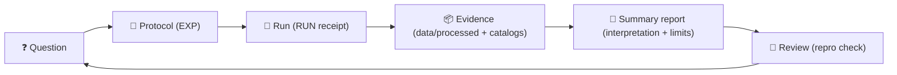
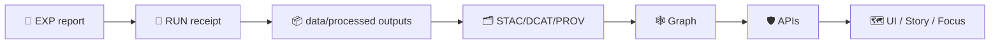

# 🧪 MCP — Master Coder Protocol  
### *Methods & Computational Experiments* 🧾⚙️


> **TL;DR:** `mcp/` is KFM’s **lab notebook + playbook** 📓🧠  
> It holds experiment reports, run receipts, SOPs, notebooks, and model cards—so every result can be **re-run, reviewed, and trusted** ✅

> [!IMPORTANT]
> In this repo, **MCP = Master Coder Protocol** (✅ correct)  
> **MCP ≠ Model Context Protocol** (🚫 not what we mean here)  
> Keep this distinction consistent in docs, PRs, and issues.

---

## ⚡ Quick Nav
- [🚦 Non‑negotiables](#-non-negotiables)
- [🏁 Quick Start](#-quick-start)
- [🗂️ Directory layout](#️-directory-layout)
- [🔁 The MCP workflow loop](#-the-mcp-workflow-loop)
- [📦 Required artifacts](#-required-artifacts)
- [🧪 Experiment reports](#-experiment-reports)
- [🏃 Run receipts](#-run-receipts)
- [🧰 SOPs](#-sops)
- [🧠 Model cards](#-model-cards)
- [📓 Notebooks](#-notebooks)
- [🔗 MCP ↔ KFM evidence pipeline](#-mcp--kfm-evidence-pipeline)
- [🧩 Domain checklists](#-domain-checklists)
- [🔐 Safety & hygiene](#-safety--hygiene)
- [🤝 PR / review checklist](#-pr--review-checklist)
- [🕰️ Version history](#️-version-history)

---

## 🚦 Non‑negotiables

These rules keep KFM **scientific**, **auditable**, and **governed**:

1. **Evidence lives in `data/` — not in `mcp/`.** 📦  
   - `mcp/` = methods, decisions, receipts  
   - `data/processed/...` = outputs (and they must be cataloged)

2. **No “magic results.”** 🪄🚫  
   If you can’t reproduce it using:
   - a commit hash
   - an environment snapshot
   - a config
   - and linked inputs/outputs  
   …then it’s not “done.”

3. **Immutable receipts.** 🧾  
   Don’t edit a run receipt to “fix history.”  
   Make a new run folder if anything changes.

4. **Label AI involvement.** 🤖  
   Any AI-assisted outputs must be labeled and provenance-linked.

5. **KFM pipeline order is sacred.** 🧱  
   **ETL → Catalogs (STAC/DCAT/PROV) → Graph → APIs → UI → Story Nodes → Focus Mode**

> [!TIP]
> Motto: **“If I can’t reproduce it in 30 minutes, it’s not complete.”** ⏱️✅

---

## 🏁 Quick Start

### 1) Create an experiment report 🧪
Add:
- `mcp/experiments/EXP-YYYY-MM-DD-<slug>.md`

### 2) Create a run receipt 🏃
Add:
- `mcp/runs/RUN-YYYY-MM-DD-<slug>/`
  - with config, env snapshot, logs, metrics, and a `MANIFEST.md`

### 3) Store evidence outputs in the governed data layer 📦
Put artifacts in:
- `data/processed/...` ✅  
Then catalog them:
- **STAC/DCAT/PROV** 🧾🧬

> [!IMPORTANT]
> `mcp/` should stay **lightweight** and human-readable.  
> Large artifacts go to `data/processed/` (or object storage) and get catalog records.

---

## 🗂️ Directory layout

```text
📁 mcp/
├── 📄 README.md                 # you are here 👋
├── 📁 experiments/              # human-readable experiment reports 🧪🧾
├── 📁 runs/                     # run receipts (configs, env, logs, metrics) 🏃🧾
├── 📁 sops/                     # Standard Operating Procedures (repeatable tasks) 🧰
├── 📁 model_cards/              # model cards for any ML/AI used or trained 🧠
├── 📁 notebooks/                # tidy, reproducible notebooks 📓
└── 📁 templates/                # optional: local templates 🧩 (or use docs/templates/)
```

### 🧭 Where to look next
- 📘 Repo principles + structure: `../README.md`
- 🧱 Source architecture: `../src/README.md`
- 📦 Data governance & metadata: `../data/README.md`
- 🧩 Contribution workflow: `../.github/README.md` *(if present)*

---

## 🔁 The MCP workflow loop

KFM work is **question → protocol → run → evidence → report → review**:



---

## 📦 Required artifacts

### ✅ “Real work” minimum bar
If an experiment influences decisions, pipelines, or published results, it must include:

- 🧪 **Experiment report** → `mcp/experiments/...`
- 🏃 **Run receipt** → `mcp/runs/...`
- 🔗 **Code pointer** → commit hash + entrypoint
- 🧱 **Environment snapshot** → Docker image digest **or** lockfile/requirements
- 🎲 **Seeds / determinism flags** (where applicable)
- 📦 **Outputs stored as evidence** → `data/processed/...`
- 🧬 **Provenance links** → STAC/DCAT/PROV IDs (inputs + outputs)

> [!WARNING]
> Avoid committing large binaries to `mcp/`.  
> If it’s an “output,” it probably belongs in `data/processed/` with catalogs + lineage.

---

## 🧪 Experiment reports

### 📛 Naming convention
Use one pattern consistently:

- `EXP-YYYY-MM-DD-<short-slug>.md`  
  Example: `EXP-2026-01-02-ocr-ner-baseline.md`

*(Optional alternative: `EXP-001-<slug>.md` — only if you maintain an index.)*

### 🏷️ Status values
- `draft` 📝 — in progress
- `complete` ✅ — reproducible; linked receipts + evidence
- `superseded` 🧯 — replaced by a newer experiment

### 🧾 Experiment template (copy/paste)

```md
---
id: EXP-YYYY-MM-DD-<slug>
title: "<short, explicit title>"
date: YYYY-MM-DD
owner: "@github-handle"
status: draft | complete | superseded
supersedes: []          # optional: [EXP-...]
superseded_by: []       # optional: [EXP-...]
tags: [gis, ocr, nlp, stac, dcat, prov, web, graph, sim, stats]
---

# Objective / Question ❓
- What are we trying to learn or improve?

# Background / Prior Art 📚
- Links to prior experiments, issues, papers, or notes.

# Hypothesis ✅/❌
- What do we expect and why?

# Inputs (Evidence In) 🗃️
- Dataset IDs + STAC/DCAT references (paths/IDs).
- Sampling rules, inclusion/exclusion, time range, bbox.

# Method / Protocol 🧾
- Step-by-step procedure.
- Parameters and configs (link to run receipt config).
- Tools + versions (OS/GPU/driver notes if relevant).

# Run Receipt 🏃
- Code commit: `abcdef1`
- Entrypoint: `src/...` or notebook path
- Run folder: `mcp/runs/RUN-YYYY-MM-DD-.../`
- Seeds: `...`
- Duration: `...`

# Outputs (Evidence Out) 📦
- Where outputs live (paths under `data/processed/...`)
- Catalog pointers:
  - STAC item(s): `...`
  - DCAT dataset: `...`
  - PROV bundle: `...`

# Results 📈
- Metrics, charts, qualitative examples (keep small).
- Add 1–3 “sanity check” examples.

# Uncertainty & Validation 🔍
- What could be wrong?
- Checks performed (spot checks, CV, error bounds, leakage checks).

# Interpretation 🧠
- What do results mean for KFM decisions?

# Decision / Next Steps 🧭
- Adopt / iterate / abandon (and why).

# Reproducibility Checklist ✅
- [ ] Parameters & configs documented
- [ ] Code committed + hash recorded
- [ ] Environment captured (Docker/lockfile)
- [ ] Seeds recorded (if applicable)
- [ ] Inputs/outputs linked via STAC/DCAT/PROV
- [ ] Another person can re-run using this doc
```

---

## 🏃 Run receipts

Runs are the **receipt** for an experiment: what you ran, how you ran it, and where outputs went.

### 📛 Naming convention
- `RUN-YYYY-MM-DD-<slug>/`

### 📦 Suggested run folder contents
- `config/` 🧾 — YAML/JSON config used for the run
- `env/` 🧱 — `pip freeze`, `conda env export`, Docker digest, OS info
- `logs/` 🪵 — structured logs (redacted if needed)
- `metrics/` 📈 — CSV/JSON metrics, evaluations
- `artifacts/` 🧩 — *small* artifacts (thumbnails, sample outputs)
- `MANIFEST.md` 🧾 — summary + reproduction instructions + links to evidence outputs

### 🧾 Minimal `MANIFEST.md` template (copy/paste)

```md
---
run_id: RUN-YYYY-MM-DD-<slug>
related_experiment: EXP-YYYY-MM-DD-<slug>
date: YYYY-MM-DD
owner: "@github-handle"

code:
  commit: abcdef1
  entrypoint: "src/pipelines/..."
  args: ["--config", "config/run.yml"]

environment:
  docker_image: "ghcr.io/org/project:tag@sha256:..."
  # or:
  requirements: "env/requirements.lock.txt"

randomness:
  seeds: [123, 456]
  deterministic_flags: ["torch.use_deterministic_algorithms=True"]

inputs:
  - stac: "data/stac/items/..."
  - dcat: "data/catalog/dcat/..."
  - prov: "data/prov/..."

outputs:
  - path: "data/processed/<domain>/<dataset>/..."
    stac_item: "data/stac/items/..."
    prov: "data/prov/<run-id>.jsonld"

notes: ""
---

# Summary 🧾
- What did this run do?

# Evidence outputs 📦
- Where outputs are stored (`data/processed/...`) + catalog IDs

# How to reproduce 🔁
1. Checkout commit: `abcdef1`
2. Restore environment: ...
3. Run: ...
4. Validate: ...
```

> [!TIP]
> Treat run folders as **immutable receipts**.  
> New parameters → new run folder ✅

---

## 🧰 SOPs

SOPs turn “tribal knowledge” into a repeatable, reviewable procedure.  
Write an SOP whenever a task is repeated or risky (georeferencing, publishing catalogs, redaction, etc.).

### SOP template (copy/paste)

```md
---
id: SOP-<topic>-v1
title: "<clear title>"
owner: "@github-handle"
last_updated: YYYY-MM-DD
---

# Purpose 🎯
What this SOP accomplishes and when to use it.

# Scope ✅
What’s included / excluded.

# Prerequisites 🧱
Accounts, tools, access, permissions.

# Tools & Versions 🧰
Software + versions.

# Procedure 🧭
1. Step...
2. Step...
3. Step...

# Verification ✅
How to confirm it worked (checks + expected outputs).

# Troubleshooting 🧯
Common failure modes + fixes.

# Audit Trail 🧾
Example PRs / runs / experiments that used this SOP.
```

### ⭐ High-value SOPs to add (starter set)
- `sops/georeference_map.md` 🗺️
- `sops/build_cog_tiles.md` 🧊
- `sops/ocr_pipeline.md` 🔎
- `sops/publish_stac_dcat_prov.md` 🧾🧬
- `sops/train_or_update_model.md` 🧠

---

## 🧠 Model cards

Any ML/AI model used in KFM (trained or adopted) needs a model card:
- what it is
- what it was trained on / sourced from
- what it should be used for ✅
- what it must **not** be used for 🚫
- known limitations, bias risks, failure modes ⚠️

### Model card template (copy/paste)

```md
---
model_id: MODEL-<name>-v<semver>
owner: "@github-handle"
date: YYYY-MM-DD
source:
  type: trained | third_party
  license: "..."
  reference: "paper/link/registry id"
---

# Model overview 🧠
- What problem does it solve?

# Intended use ✅
- Supported use-cases.

# Out-of-scope / prohibited use 🚫
- What it must not be used for.

# Training data 🗃️
- Datasets used (STAC/DCAT refs), sampling, labeling notes.

# Evaluation 📈
- Metrics, test sets, qualitative examples.

# Limitations & biases ⚠️
- Known failure modes, bias risks, uncertainty notes.

# Reproducibility 🧪
- Training code commit hash
- Environment / hardware notes
- Hyperparameters / config
- Seeds
```

---

## 📓 Notebooks

Notebooks are welcome—**but must be readable and reproducible**:

- Start with a markdown cell: **purpose + inputs + outputs**
- Keep outputs small *(no huge embedded blobs)*
- Prefer parameterized notebooks or export to scripts when it becomes “real”
- If a notebook produces evidence artifacts:
  - store outputs in `data/processed/...`
  - link them from an experiment report + run receipt

> [!CAUTION]
> Notebooks that silently write files without catalogs + provenance are **not shippable**.

---

## 🔗 MCP ↔ KFM evidence pipeline

KFM uses a strict evidence pipeline:

**ETL → Catalogs (STAC/DCAT/PROV) → Graph → APIs → UI → Story Nodes → Focus Mode**

So for MCP work:

- ✅ Experiment reports live here: `mcp/experiments/...`
- ✅ Run receipts live here: `mcp/runs/...`
- ✅ Evidence artifacts live here: `data/processed/...`
- ✅ Evidence artifacts must be:
  - cataloged (STAC/DCAT) 🧾
  - lineage-linked (PROV) 🧬
  - integrated through governed contracts (API boundary) 🔒



---

## 🧩 Domain checklists

Use the checklist that matches your work:

### 🗺️ GIS / Remote Sensing
- [ ] CRS documented (EPSG + axis order)
- [ ] Georeferencing method + control points documented
- [ ] Fit error/RMS recorded (if applicable)
- [ ] Raster outputs are COGs / tiled (with parameters)
- [ ] Vector outputs validate (geometry validity, topology as needed)

### 🔎 OCR / NLP
- [ ] Input corpus + sampling documented
- [ ] Labeling rules / evaluation rubric included
- [ ] Precision/recall (or spot-check protocol) documented
- [ ] Failure classes logged (scan quality, fonts, ambiguity)

### 📊 Statistics / Inference
- [ ] Outcomes + units defined
- [ ] Assumptions checked (independence, distribution, etc.)
- [ ] Effect sizes reported (not just p-values)
- [ ] Multiple comparisons handled (or explicitly scoped)

### 🛰️ Modeling & Simulation
- [ ] Assumptions enumerated explicitly
- [ ] Validation approach documented (comparisons, backtests)
- [ ] Uncertainty quantified or bounded
- [ ] Results reported with uncertainty context

---

## 🔐 Safety & hygiene

- 🚫 Don’t store secrets, tokens, keys, or sensitive PII in `mcp/`
- 🧽 Redact logs before committing if they contain identifiers, endpoints, or sensitive paths
- 🧊 Prefer immutable receipts: new run folder > editing old run folder
- 🧭 If superseded, mark as `superseded` and link the replacement

---

## 🤝 PR / review checklist

When your PR includes experiments, runs, or evidence:

- [ ] EXP report added/updated (`mcp/experiments/...`)
- [ ] RUN receipt folder added (`mcp/runs/...`) with `MANIFEST.md`
- [ ] Evidence outputs stored under `data/processed/...`
- [ ] STAC/DCAT/PROV pointers added (IDs or paths)
- [ ] AI involvement labeled (if applicable)
- [ ] Reproduction steps included (1–4 steps; copy/paste runnable)
- [ ] No secrets / no sensitive leaks in logs or outputs
- [ ] Reviewer can reproduce within ~30 minutes

> [!TIP]
> A good review comment is: **“I reproduced this and got the same outputs.”** ✅

---

## 🕰️ Version history

| Version | Date | Summary | Author |
|---:|---|---|---|
| v1.1.0 | 2026-01-06 | Clarified non‑negotiables + pipeline linkage; added run receipt template, PR checklist, and workflow diagram. | KFM Engineering |
| v1.0.0 | 2025-12-31 | Initial MCP README: experiments, runs, SOPs, model cards, notebooks, safety rules. | KFM Engineering |

---

🧭 **Goal:** Make every output auditable and every method teachable.  
🧾 **Promise:** If it’s in production, it has a paper trail. ✅
