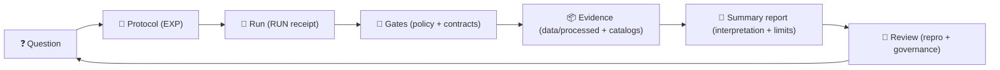
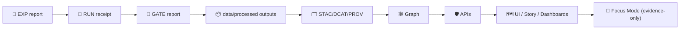

# 🧪 MCP — Master Coder Protocol  
### *Methods, Controls & Processes* 🧾⚙️


> **TL;DR:** `mcp/` is KFM’s **methods + receipts** layer 📓🧠  
> It holds **protocols**, **run receipts**, **SOPs**, **model cards**, **gate reports**, and **review artifacts**—so every result can be **re-run, reviewed, and trusted** ✅  
>
> **Design alignment (v13+):** KFM is **API‑centric**, **catalog‑driven**, and **governance‑enforced**. MCP is the paper trail that keeps those promises honest. 🧾🛡️

> [!IMPORTANT]
> In this repo, **MCP = Master Coder Protocol** ✅  
> **MCP ≠ Model Context Protocol** 🚫 *(not what we mean here)*  
> Keep this distinction consistent in docs, PRs, issues, and commit messages.

---

## 🔗 Quick links
- 🧭 Repo overview: **[`../README.md`](../README.md)**
- 📚 Docs boundary: **[`../docs/README.md`](../docs/README.md)** *(if present)*
- 🧬 Pipelines boundary (contract portal): **[`../pipelines/README.md`](../pipelines/README.md)** *(if present)*
- 🧰 Scripts boundary (automation): **[`../scripts/README.md`](../scripts/README.md)** *(if present)*
- 🧩 Executable source boundary: **[`../src/README.md`](../src/README.md)**
- 📦 Data + metadata boundary: **[`../data/README.md`](../data/README.md)**
- 🧪 Notebooks boundary (lab bench): **[`../notebooks/README.md`](../notebooks/README.md)** *(if present)*
- 🧰 Validators & tooling: **[`../tools/README.md`](../tools/README.md)** *(if present)*
- ✅ Tests & CI gates: **[`../tests/README.md`](../tests/README.md)** *(if present)*
- 🤝 CI/CD & policies: **[`../.github/`](../.github/)** *(workflows, security policy, automation)*

---

## ⚡ Quick Nav
- [🧾 Doc metadata](#-doc-metadata)
- [🧭 What MCP is](#-what-mcp-is)
- [🧷 Repo invariants](#-repo-invariants)
- [🧱 MCP artifacts](#-mcp-artifacts-types-ids-and-immutability)
- [🚦 Non‑negotiables](#-non-negotiables)
- [🏁 Quick Start](#-quick-start)
- [🗂️ Directory layout](#-directory-layout)
- [🔁 The MCP workflow loop](#-the-mcp-workflow-loop)
- [🚥 Detect → Validate → Promote](#-detect--validate--promote)
- [🔐 Policy packs & gate reports](#-policy-packs--gate-reports)
- [🤖 Watcher → Planner → Executor receipts](#-watcher--planner--executor-receipts)
- [🧬 DevOps provenance](#-devops-provenance)
- [🧾 Front matter + schemas](#-front-matter--schemas-machine-readable-mcp)
- [✅ Definition of done](#-definition-of-done)
- [📦 Required artifacts](#-required-artifacts)
- [🧪 Experiment reports](#-experiment-reports)
- [🏃 Run receipts](#-run-receipts)
- [📈 Performance & scalability experiments](#-performance--scalability-experiments)
- [🧰 SOPs](#-sops)
- [🧠 Model cards](#-model-cards)
- [📓 Notebooks](#-notebooks)
- [🧭 Traceability matrix](#-traceability-matrix)
- [🧯 Bad evidence protocol](#-bad-evidence-protocol)
- [🔗 MCP ↔ KFM evidence pipeline](#-mcp--kfm-evidence-pipeline)
- [🧩 Domain checklists](#-domain-checklists)
- [🔐 Safety, privacy, licensing](#-safety-privacy-licensing)
- [🛡️ Threat model & hostile inputs](#-threat-model--hostile-inputs)
- [✅ QA, audits, and CI hooks](#-qa-audits-and-ci-hooks)
- [🤝 PR / review checklist](#-pr--review-checklist)
- [📚 Project reference library influence map](#-project-reference-library-influence-map)
- [🧾 Reference library index](#-reference-library-index)
- [🕰️ Version history](#-version-history)

---

## 🧾 Doc metadata

| Field | Value |
|---|---|
| Doc | `mcp/README.md` |
| Status | Active ✅ |
| Last updated | **2026-01-19** |
| Audience | Contributors writing experiments, running jobs, training models, shipping evidence artifacts, authoring Story Nodes |
| Prime directive | If it changes “spatial truth,” it must be **traceable + reproducible + reviewable** |
| KFM canon | **ETL/Streaming → Catalogs (STAC/DCAT/PROV) → Graph → APIs → UI/Story → Focus Mode** |
| Special doctrine | **Policy packs gate publishing** + **atomic promotion** + **Focus Mode must cite** |

---

## 🧭 What MCP is

### ✅ MCP is…
A **governed method layer** that turns “we tried something” into **auditable science**:

- 🧪 **Protocols** (what we intended to do + why)
- 🏃 **Receipts** (what we actually ran + how)
- 🧰 **SOPs** (repeatable procedures for risky/repeated work)
- 🧠 **Model cards** (responsible AI/ML usage)
- 🧾 **Gate reports** (policy/contract checks that prove something was safe to publish)
- 👀 **Review artifacts** (what was checked, by whom, and what failed)
- 🧭 **Traceability** (decision ↔ evidence ↔ catalogs ↔ provenance ↔ PRs)

### 🚫 MCP is not…
- ❌ A data lake (that’s `data/`)
- ❌ A code dump (that’s `src/` and `web/`)
- ❌ A place for large outputs (store in `data/processed/**` + catalogs)
- ❌ A place for “unsourced narrative” (Story Nodes must cite evidence artifacts)
- ❌ A runtime governance ledger (that belongs to system telemetry), but MCP **references** ledger IDs when relevant

> [!TIP]
> MCP exists to make “results” **explainable and replayable**—not merely impressive. 🧾✅

---

## 🧷 Repo invariants

These are the “you can build anything, but not *like that*” constraints.  
They align MCP with KFM’s v13+ architecture: catalog‑driven, API‑centric, governance‑enforced, and transparent AI.

### 🧱 Invariant 1 — Pipeline ordering is absolute
**ETL/Streaming → Catalogs (STAC/DCAT/PROV) → Graph → APIs → UI/Story → Focus Mode**  
No skipping steps. No “temporary UI demo” without catalogs + lineage.

### 🧬 Invariant 2 — Provenance-first publishing (including streaming)
Anything “published” (referenced by graph, APIs, UI, Story Nodes, dashboards, or Focus Mode) must have:
- a **catalog record** (STAC/DCAT) 🗂️  
- a **PROV lineage record** 🧬  
…**before** it is used downstream.  
Streaming data isn’t an exception—each snapshot/aggregation must still be traceable.

### 🧾 Invariant 3 — Contracts are first-class
Schemas, profiles, and data contracts are not “nice-to-have.” They are the interface.  
If it can’t validate, it can’t ship.

### 🔁 Invariant 4 — ETL (and automation) must be deterministic + idempotent
If inputs + config are unchanged, reruns must be stable:
- same IDs, same hashes, same catalogs
- safe to rerun without double-writing or corrupting state
- automation must use **idempotency keys** (and a kill switch)

### 🚀 Invariant 5 — Promotion is atomic (transaction mindset)
**Promote = data/processed + STAC/DCAT + PROV + (optional) graph ingest** as one consistent publish step.  
If any gate fails, the publish must roll back or remain staged—no half‑published artifacts.

### 🔐 Invariant 6 — Policy packs gate publishing
Publishing must pass automated policy checks (OPA/Conftest style), including:
- contract/schema validation
- provenance completeness
- no sensitivity downgrade
- license/attribution propagation
- “Focus Mode citations required” checks for AI outputs and narratives

### 🤖 Invariant 7 — Focus Mode is advisory-only and evidence-bound
Focus Mode can **suggest** and **summarize**. It cannot “declare truth” unless it:
- cites evidence artifacts (catalog IDs / graph entities)  
- passes governance checks (content + sensitivity rules)  
- shows uncertainty/refuses when evidence is insufficient

### 🧾 Invariant 8 — Everything decision-worthy gets a receipt
Every decision-worthy run captures:
- input/output hashes
- config + environment snapshot
- commit hash and entrypoint
- policy/gate report(s)
- references to catalog IDs and (when applicable) governance ledger IDs

---

## 🧱 MCP artifacts (types, IDs, and immutability)

MCP stays reliable because artifacts are **typed**, **named**, and **treated correctly**.

| Artifact | Prefix / ID pattern | Where | Immutable? | Purpose |
|---|---|---|---:|---|
| 🧪 Experiment protocol | `EXP-YYYY-MM-DD-<slug>.md` | `mcp/experiments/` | ⚠️ *Mutable while `draft`* | Pre-register intent, assumptions, validation plan |
| 🏃 Run receipt | `RUN-YYYY-MM-DD-<slug>/` | `mcp/runs/` | ✅ **Yes** | What executed + how to reproduce |
| 🔐 Gate report | `GATE-YYYY-MM-DD-<slug>.md` *(or `.json`)* | `mcp/gates/` *(recommended)* | ✅ **Yes** | Proof of policy/contract checks (OPA/Conftest + schema + link integrity) |
| 🚀 Promotion receipt | `PROMOTE-YYYY-MM-DD-<slug>/` *(optional)* | `mcp/promotions/` *(optional)* | ✅ **Yes** | Atomic publish record: what was promoted, what changed in catalogs |
| 🧬 DevOps provenance bundle | `DEVPROV-YYYY-MM-DD-<slug>.jsonld` *(optional)* | `mcp/dev_prov/` *(optional)* | ✅ **Yes** | PROV for PRs/builds (who changed what, linked to datasets/runs) |
| 🧰 SOP | `SOP-<topic>-v<semver>.md` | `mcp/sops/` | ✅ *Versioned* | Repeatable procedures (risky or frequent tasks) |
| 🧠 Model card | `MODEL-<name>-v<semver>.md` | `mcp/model_cards/` | ✅ *Versioned* | Intended use, limits, datasets, governance for ML/AI |
| 👀 Review note | `REV-YYYY-MM-DD-<slug>.md` | `mcp/reviews/` *(recommended)* | ✅ **Yes** | Independent reproduction and governance sign-off |
| 🧭 Traceability | `TRACEABILITY.md` *(or `TRACE-*.md`)* | `mcp/traceability/` | ✅ *Append-only mindset* | Decision/feature → EXP/RUN → evidence + catalogs + PRs |
| 🧯 Incident / anomaly | `INC-YYYY-MM-DD-<slug>.md` *(optional)* | `mcp/incidents/` *(optional)* | ✅ **Yes** | When something shipped wrong: what happened + fix + new gates |

> [!IMPORTANT]
> **Run receipts and gate reports are immutable.**  
> If anything changes (inputs, params, code, environment, or policy pack), create a **new** artifact and link it. ✅

---

## 🚦 Non‑negotiables

These rules keep KFM **scientific**, **auditable**, and **governed**:

1) **Evidence lives in `data/` — not in `mcp/`.** 📦  
   - `mcp/` = methods, decisions, receipts, checklists  
   - `data/processed/...` = outputs (**and they must be cataloged**)

2) **Contract-first by default.** 🧾🧱  
   If you publish an artifact, you must also publish the contract it conforms to (schema/profile/version).

3) **Provenance-first publishing (always).** 🧬  
   If it’s referenced by graph/APIs/UI/Story/Focus, it must have STAC/DCAT + PROV before use.

4) **Policy packs gate shipping.** 🔐  
   If a policy pack says “no,” the artifact does not ship—no exceptions, no “temporary” bypass.

5) **Protocol before run (when it matters).** 🧾➡️🏃  
   If results could influence product decisions, public narratives, pipelines, or models: write an **EXP** first.

6) **No “magic results.”** 🪄🚫  
   If you can’t reproduce it using:
   - a commit hash
   - an environment snapshot
   - a config
   - linked inputs/outputs (**catalog IDs**)
   - input/output hashes  
   …then it’s not “done.”

7) **Immutable receipts.** 🧾  
   Don’t edit a run receipt to “fix history.”  
   Make a **new** run folder and link it.

8) **Label AI involvement + bind to evidence.** 🤖  
   AI-assisted outputs must be labeled and evidence-linked.  
   Focus Mode remains **advisory-only** and must be evidence-backed.

9) **No privacy / sensitivity downgrade.** 🔒  
   Outputs cannot be less restricted than inputs without an explicit, reviewed redaction step.

10) **Licensing isn’t optional.** 🧾⚖️  
   Every dataset / artifact must carry license + attribution requirements through catalogs, narratives, and exports.

11) **Stable IDs are a correctness feature.** 🏷️  
   IDs should be invariant across reruns when inputs haven’t changed—treat IDs like API contracts.

> [!TIP]
> Motto: **“If I can’t reproduce it in 30 minutes, it’s not complete.”** ⏱️✅

---

## 🏁 Quick Start

### 1) Create an experiment report 🧪
Add:
- `mcp/experiments/EXP-YYYY-MM-DD-<slug>.md`

### 2) Create a run receipt 🏃
Add:
- `mcp/runs/RUN-YYYY-MM-DD-<slug>/`
  - config, env snapshot, logs, metrics, and `MANIFEST.md`

### 3) Run policy + contract gates 🔐✅
Add (recommended):
- `mcp/gates/GATE-YYYY-MM-DD-<slug>.md` *(or write into `mcp/runs/.../gates/`)*

### 4) Store evidence outputs in the governed data layer 📦
Put evidence artifacts in:
- `data/processed/...` ✅  
Then publish metadata + lineage:
- `data/stac/**` + `data/catalog/dcat/**` + `data/prov/**` 🗂️🧬

### 5) Link it to decisions 🧭
Update traceability (recommended):
- `mcp/traceability/TRACEABILITY.md`

> [!IMPORTANT]
> `mcp/` should stay **lightweight** and human-readable.  
> Large artifacts go to `data/processed/` (or object storage) and get catalog records + lineage.

---

## 🗂️ Directory layout

```text
📁 mcp/
├── 📄 README.md                 # you are here 👋
├── 📁 experiments/              # human-readable experiment protocols 🧪🧾
├── 📁 runs/                     # immutable run receipts (configs, env, logs, metrics) 🏃🧾
├── 📁 gates/                    # immutable gate reports (policy packs, schema checks) 🔐✅ (recommended)
├── 📁 promotions/               # atomic publish receipts 🚀 (optional)
├── 📁 dev_prov/                 # PR/build provenance bundles (PROV JSON-LD) 🧬 (optional)
├── 📁 sops/                     # Standard Operating Procedures (repeatable tasks) 🧰
├── 📁 model_cards/              # model cards for any ML/AI used or trained 🧠
├── 📁 notebooks/                # tidy, reproducible notebooks 📓
├── 📁 traceability/             # decision ↔ evidence mapping 🧭 (recommended)
├── 📁 reviews/                  # peer reproduction notes / governance sign-offs 👀 (recommended)
├── 📁 incidents/                # post-mortems / anomaly reports 🧯 (optional)
└── 📁 templates/                # local templates 🧩 (or use docs/templates/)
```

> [!NOTE]
> Repo implementations vary. If `gates/`, `traceability/`, or `reviews/` don’t exist yet, consider adding them—  
> policy packs + traceability + reproduction notes are core promises in KFM’s v13+ redesign.

---

## 🔁 The MCP workflow loop

KFM work is **question → protocol → run → evidence → gates → publish → review → iterate**:



---

## 🚥 Detect → Validate → Promote

KFM risk comes from “half-published” artifacts. MCP encourages a controlled rhythm:

1) **Detect** 🕵️  
   Identify new inputs / changes (sources updated, schema drift, new tiles, new sensors, new docs).

2) **Validate** ✅  
   Run fast gates:
   - schema & bounds checks (**contracts**)
   - catalog validity (STAC/DCAT)
   - PROV lineage presence & link integrity
   - governance propagation (no downgrade)
   - security scans (secrets / sensitive patterns)
   - **policy packs** (OPA/Conftest) 🔐

3) **Promote** 🚀  
   Only after validation:
   - write evidence to `data/processed/**`
   - write STAC/DCAT/PROV (provenance-first)
   - (optionally) export graph ingest bundles
   - add MCP RUN receipt + gate report + traceability update

> [!TIP]
> Treat “promotion” like a release: **atomic publish or nothing.** 🧾✅

---

## 🔐 Policy packs & gate reports

KFM’s architecture explicitly treats policy checks as a **first-class publish gate** (not a reviewer “nice‑to‑have”).  
In practice, we expect:
- policy logic in versioned **OPA/Rego** policy packs
- execution via **Conftest** (or equivalent) in CI/local
- a **gate report** artifact that proves what ran and what passed

### ✅ What belongs in a gate report
- policy pack version (and commit hash)
- checks executed (schemas, link integrity, sensitivity downgrade, license propagation)
- inputs evaluated (catalog IDs / files)
- results (pass/fail + reasons)
- who ran it (human, CI, W‑P‑E Executor)
- pointers to logs (redacted if needed)

### 📄 Minimal `GATE-...` template (copy/paste)

```md
---
gate_id: GATE-YYYY-MM-DD-<slug>
date: YYYY-MM-DD
owner: "@github-handle"
scope: ["data", "catalogs", "prov", "api", "ui", "ai"]
policy_pack:
  name: "kfm-policy-pack"
  version: "vX.Y.Z"
  commit: "<sha>"
runner:
  type: local | ci | wpe_executor
  run_id: "RUN-YYYY-MM-DD-<slug>"   # optional link
inputs:
  - "data/stac/..."
  - "data/catalog/dcat/..."
  - "data/prov/..."
results:
  status: pass | fail
  checks:
    - name: "stac_validate"
      status: pass
    - name: "prov_present"
      status: pass
    - name: "no_sensitivity_downgrade"
      status: pass
    - name: "license_propagation"
      status: pass
notes: ""
---

# Summary 🔐✅
- What was evaluated and what changed?

# Findings 🧾
- Failures/warnings (if any) + remediation links

# Evidence 🔗
- Pointers to the relevant run receipt and promotion receipt
```

> [!IMPORTANT]
> If the gate report fails, **the publish is invalid**.  
> Fix → re-run → new gate report. ✅

---

## 🤖 Watcher → Planner → Executor receipts

KFM’s v13+ roadmap introduces a **Watcher–Planner–Executor (W‑P‑E)** automation pattern for safe, auditable maintenance:
- Watcher observes and emits immutable events
- Planner proposes deterministic plans (often as PR-ready diffs)
- Executor opens PRs / triggers pipeline execution **under the same governance gates as humans**
- A **kill switch** must be available to disable agent actions

### ✅ How MCP records W‑P‑E activity
W‑P‑E is “just another run,” so it gets receipts:
- Watch events → `mcp/runs/.../events/` *(or `mcp/incidents/` for anomalies)*
- Planner output → `mcp/runs/.../plans/` *(diffs, patch proposals)*
- Executor action → `mcp/runs/.../` (logs + PR link) + **gate report**
- Traceability entry links the event → plan → PR → merge → resulting artifacts

> [!TIP]
> Treat W‑P‑E like a “robot teammate”: everything it does must be reproducible, reviewable, and policy-gated. 🤝🤖

---

## 🧬 DevOps provenance

KFM’s future-proof traceability includes **DevOps → PROV**: mapping PR/build events to PROV JSON‑LD so you can answer:
- *Which code version produced this dataset?*
- *Who reviewed and approved the change?*
- *Which policy pack version gated the publish?*

### ✅ Where to store DevOps PROV
Preferred (if your repo supports it):
- `data/prov/dev/DEVPROV-...jsonld`

Acceptable (MCP-layer pointer):
- `mcp/dev_prov/DEVPROV-...jsonld`

### Suggested fields
- PR number / URL
- commit SHA(s)
- CI run ID
- artifacts produced (RUN IDs, dataset IDs)
- approvals (reviewers)
- policy gates executed (GATE IDs)

---

## 🧾 Front matter + schemas (machine-readable MCP)

MCP documents are **human-first**, but they should also be **machine-readable** for dashboards, validation, and CI gates.

### ✅ Front matter conventions (recommended)
All MCP artifacts should start with YAML front matter, including:

- stable ID (`EXP-...`, `RUN-...`, `GATE-...`, `SOP-...`, `MODEL-...`)
- date
- owner
- status
- tags
- AI involvement (if applicable)
- links to evidence (catalog IDs or paths)
- contracts + lineage pointers (STAC/DCAT/PROV)
- policy pack version (for shippable work)
- dev provenance pointer (optional)

### ⭐ Recommended “governed doc” fields
Additive fields that improve audits and automation:
- `doc_uuid` (stable UUID)
- `commit_sha` (when doc corresponds to a release)
- `doc_integrity_checksum` (hash of doc body, optional)
- `care_label` / `classification`
- `policy_pack_version`
- `governance_ledger_ref` *(pointer only; ledger lives outside MCP)*

### 🔎 Minimal example (recommended baseline)
```yaml
---
id: EXP-2026-01-19-example
doc_uuid: "b0b6d0a5-4f4e-4e5b-9f25-1a2b1b9b0a7e"
title: "Example MCP artifact"
date: 2026-01-19
owner: "@github-handle"
status: draft
repro_level: L1
risk_level: medium
care_label: public
ai_used: false

policy_pack_version: "vX.Y.Z"
gate_reports: ["GATE-2026-01-19-example"]

contracts:
  - "schemas/mcp/exp.schema.json"
catalog_pointers:
  stac: ["stac://collection-id", "stac://item-id"]
  dcat: ["data/catalog/dcat/dataset.jsonld"]
  prov: ["data/prov/PROV-2026-01-19-example.jsonld"]
dev_prov: ["data/prov/dev/DEVPROV-2026-01-19-pr-123.jsonld"]
---
```

---

## ✅ Definition of done

### ✅ MCP “done” means: reproducible + governed
For any EXP/RUN that influences production pipelines, APIs, UI layers, Story Nodes, dashboards, or Focus Mode:

- [ ] Front-matter complete + consistent (IDs, dates, owner, status)
- [ ] Claims link to evidence inputs/outputs (**catalog pointers**)
- [ ] Contracts + lineage pointers present (STAC/DCAT/PROV)
- [ ] Policy pack gates executed and recorded (**gate report present**)
- [ ] Validation steps are listed and repeatable
- [ ] Governance + FAIR/CARE + sovereignty considerations stated (when applicable)
- [ ] Another contributor can reproduce results without tribal knowledge
- [ ] If AI was involved, human sign-off is recorded

### 🧱 Reproducibility levels (recommended)
- **L0** 🟡: exploratory note (not decision-worthy)
- **L1** 🟠: reproducible by author (config + env captured)
- **L2** 🟢: reproducible by reviewer (independent re-run)
- **L3** 🏆: CI-backed / automated rerun (pipeline job + validators + policy packs)

---

## 📦 Required artifacts

### ✅ “Real work” minimum bar
If an experiment influences decisions, pipelines, published results, Story Nodes, or Focus Mode, it must include:

- 🧪 **Experiment report** → `mcp/experiments/...`
- 🏃 **Run receipt** → `mcp/runs/...`
- 🔐 **Gate report** → `mcp/gates/...` *(or inside the run folder)*
- 🔗 **Code pointer** → commit hash + entrypoint
- 🧱 **Environment snapshot** → Docker digest **or** lockfile/requirements
- 🎲 **Seeds / determinism flags** (where applicable)
- 🔢 **Input/output hashes** (recommended for decision-relevant work)
- 📦 **Outputs stored as evidence** → `data/processed/...`
- 🗂️ **Catalog records** → STAC/DCAT
- 🧬 **Lineage** → PROV pointers (inputs + outputs)
- 👀 **Review notes** → reproduction sign-off for L2/L3 work (recommended)
- 🧭 **Traceability entry** → decision/feature ↔ EXP/RUN/GATE ↔ evidence
- 🧬 **(Optional) DevOps PROV** → PR/build provenance bundle

> [!WARNING]
> Avoid committing large binaries to `mcp/`.  
> If it’s an “output,” it belongs in `data/processed/` with catalogs + lineage.

---

## 🧪 Experiment reports

### 📛 Naming convention
- `EXP-YYYY-MM-DD-<short-slug>.md`  
  Example: `EXP-2026-01-02-ocr-ner-baseline.md`

### 🏷️ Status values
- `draft` 📝 — in progress
- `complete` ✅ — reproducible; linked receipts + evidence + gate report
- `superseded` 🧯 — replaced by a newer experiment

### 🧾 Experiment template (copy/paste)

```md
---
id: EXP-YYYY-MM-DD-<slug>
title: "<short, explicit title>"
date: YYYY-MM-DD
owner: "@github-handle"
status: draft | complete | superseded
repro_level: L0 | L1 | L2 | L3
risk_level: low | medium | high
ai_used: true | false
care_label: public | restricted | confidential
tags: [gis, ocr, nlp, stac, dcat, prov, graph, sim, stats, web, security]

policy_pack_version: "vX.Y.Z"        # recommended
gate_reports: []                    # e.g. ["GATE-YYYY-MM-DD-..."]

contracts:
  - "schemas/mcp/exp.schema.json"
---

# Objective / Question ❓
- What are we trying to learn or improve?

# Background / Prior Art 📚
- Links to prior experiments, issues, story claims, or system docs.

# Hypothesis ✅/❌
- What do we expect and why?

# Variables & Controls 🎛️
- Key variables you’re changing.
- Controls / baselines.
- What stays fixed.

# Inputs (Evidence In) 🗃️
- Dataset IDs + STAC/DCAT pointers.
- Sampling rules, inclusion/exclusion, time range, bbox.
- Licensing + sensitivity notes (if applicable).

# Method / Protocol 🧾
- Step-by-step procedure.
- Parameters + configs (link to run receipt config).
- Tools + versions (OS/GPU/driver notes if relevant).

# Validation Plan ✅
- What fails fast?
- What warns?
- What “sanity checks” must pass?
- What policy checks must pass?

# Run Receipt 🏃
- Code commit: `abcdef1`
- Entrypoint: `src/...` or notebook path
- Run folder: `mcp/runs/RUN-YYYY-MM-DD-.../`
- Gate report: `mcp/gates/GATE-YYYY-MM-DD-...`
- Seeds: `...`

# Outputs (Evidence Out) 📦
- Where outputs live (paths under `data/processed/...`)
- Catalog pointers:
  - STAC item(s): `...`
  - DCAT dataset: `...`
  - PROV bundle: `...`

# Results 📈
- Metrics, charts, qualitative examples (keep small).
- Add 1–3 “sanity check” examples.

# Uncertainty, Bias, and Validation 🔍
- What could be wrong?
- Checks performed (spot checks, CV, error bounds, leakage checks).
- Bias risks / perspective gaps (especially for historical corpora).

# Interpretation 🧠
- What do results mean for KFM decisions?

# Decision / Next Steps 🧭
- Adopt / iterate / abandon (and why).

# Reproducibility Checklist ✅
- [ ] Parameters & configs documented
- [ ] Code committed + hash recorded
- [ ] Environment captured (Docker/lockfile)
- [ ] Inputs/outputs linked via STAC/DCAT/PROV
- [ ] Gate report recorded (policy packs + contracts)
- [ ] Reviewer can reproduce (for L2/L3)
```

---

## 🏃 Run receipts

Runs are the **receipt** for an experiment: what you ran, how you ran it, where outputs went, and what changed.

### 📛 Naming convention
- `RUN-YYYY-MM-DD-<slug>/`

### 📦 Suggested run folder contents
- `config/` 🧾 — YAML/JSON config used for the run
- `env/` 🧱 — `pip freeze`, lockfiles, Docker digest, OS info
- `logs/` 🪵 — structured logs (**redacted if needed**)
- `metrics/` 📈 — CSV/JSON metrics, evaluations
- `artifacts/` 🧩 — *small* artifacts (thumbnails, sample outputs)
- `gates/` 🔐 — policy pack outputs / schema validation logs (recommended)
- `events/` 👀 — watcher events (if W‑P‑E)
- `plans/` 🗺️ — planner diffs/patches (if W‑P‑E)
- `MANIFEST.md` 🧾 — reproduction instructions + evidence links + checks performed
- `hashes/` 🔢 *(recommended)* — input/output checksums for audit-grade reruns

### 🧾 Minimal `MANIFEST.md` template (copy/paste)

```md
---
run_id: RUN-YYYY-MM-DD-<slug>
run_type: standard | benchmark | streaming | backfill | hotfix
related_experiment: EXP-YYYY-MM-DD-<slug>
date: YYYY-MM-DD
owner: "@github-handle"
env: dev | staging | prod
care_label: public | restricted | confidential

code:
  commit: abcdef1
  entrypoint: "src/pipelines/..."
  args: ["--config", "config/run.yml"]
  dirty_worktree: false

policy:
  policy_pack_version: "vX.Y.Z"
  gate_report: "mcp/gates/GATE-YYYY-MM-DD-<slug>.md"

environment:
  docker_image: "ghcr.io/org/project:tag@sha256:..."     # preferred
  # or:
  requirements: "env/requirements.lock.txt"
  os: "..."
  cpu: "..."
  gpu: "..."  # optional

randomness:
  seeds: [123, 456]
  deterministic_flags: ["..."]

contracts:
  - "schemas/<domain>/...schema.json"
  - "schemas/mcp/run.schema.json"

inputs:
  - catalog_ref: "stac://<collection_or_item_id>"
    sha256: "..."          # recommended
  - dcat: "data/catalog/dcat/<dataset>.jsonld"
  - prov: "data/prov/<prior-run>.jsonld"

outputs:
  - path: "data/processed/<domain>/<dataset>/..."
    sha256: "..."          # recommended
    stac_item: "data/stac/items/..."
    dcat: "data/catalog/dcat/..."
    prov: "data/prov/<run-id>.jsonld"

governance:
  ledger_ref: ""           # pointer only (optional)

validation:
  - "contract validation: pass/fail"
  - "schema validation (STAC/DCAT/PROV): pass/fail"
  - "link checks: pass/fail"
  - "classification propagation: pass/fail"
  - "spot checks: ..."

policy_checks:
  - "opa/conftest: pass/fail"
  - "prompt/ai citation coverage: pass/fail"  # when AI outputs exist

notes: ""
---

# Summary 🧾
- What did this run do?

# Evidence outputs 📦
- Where outputs are stored (`data/processed/...`) + catalog IDs

# How to reproduce 🔁
1. Checkout commit: `abcdef1`
2. Restore environment: ...
3. Run: ...
4. Validate (contracts + catalogs + lineage + policy packs): ...
```

> [!TIP]
> Treat run folders as **immutable receipts**.  
> New parameters → new run folder ✅

---

## 📈 Performance & scalability experiments

Performance claims can change architecture decisions, so they still need receipts + gates.

### ✅ When to treat a run as a benchmark
- tile generation tuning (COG params, overviews, compression) 🧊
- PostGIS index/migration affecting query latency 🐘
- graph ingest optimizations / new analytics jobs 🕸️
- Focus Mode latency or citation coverage regression 🤖
- offline pack generation (bundle size, time-to-download, cache correctness) 📦

### 🧾 Benchmark add-ons (recommended in `MANIFEST.md`)
Add a `performance:` section:

```yaml
performance:
  workload:
    description: "API tile requests @ zoom 6–12 for 3 AOIs"
    concurrency: 25
    warm_cache: true
    duration_s: 600
  dataset:
    size_bytes: 123456789
    feature_count: 987654
  system:
    cpu_cores: 16
    ram_gb: 64
    storage: "nvme"
  results:
    p50_ms: 120
    p95_ms: 410
    p99_ms: 900
    throughput_rps: 85
  artifacts:
    - "metrics/latency_histogram.csv"
    - "logs/explain_analyze.txt"
```

---

## 🧰 SOPs

SOPs turn “tribal knowledge” into a repeatable, reviewable procedure.  
Write an SOP whenever a task is repeated or risky: data intake, catalog publishing, redaction, OCR, tile generation, secure parsing, policy packs, W‑P‑E operations, offline packs, AR alignment, etc.

### SOP template (copy/paste)

```md
---
id: SOP-<topic>-v1.0.0
title: "<clear title>"
owner: "@github-handle"
last_updated: YYYY-MM-DD
risk_level: low | medium | high
care_label: public | restricted | confidential
---

# Purpose 🎯
What this SOP accomplishes and when to use it.

# Scope ✅
What’s included / excluded.

# Prerequisites 🧱
Accounts, tools, access, permissions.

# Tools & Versions 🧰
Software + versions.

# Procedure 🧭
1. Step...
2. Step...
3. Step...

# Verification ✅
How to confirm it worked (checks + expected outputs).

# Troubleshooting 🧯
Common failure modes + fixes.

# Audit Trail 🧾
Example PRs / runs / experiments that used this SOP.
```

### ⭐ High-value SOPs to add (starter set)
- `sops/data_intake_connectors.md` 🧲 (source manifests, checksums, quarantine, streaming snapshots)
- `sops/publish_stac_dcat_prov.md` 🗂️🧬 (profiles, validation, link checks)
- `sops/policy_packs_and_gate_reports.md` 🔐 (OPA/Conftest usage, failure triage)
- `sops/wpe_agents.md` 🤖 (Watcher/Planner/Executor rules, idempotency keys, kill switch)
- `sops/offline_data_packs.md` 📦 (bundle creation, size budgets, validation)
- `sops/ar_overlay_alignment.md` 🕶️ (coordinate alignment, uncertainty, safety constraints)
- `sops/devops_prov_capture.md` 🧬 (PR/build → PROV JSON‑LD, linking to datasets)
- `sops/redaction_and_sensitive_locations.md` 🔐 (coordinate coarsening, approvals, provenance of redaction)

---

## 🧠 Model cards

Any ML/AI model used in KFM (trained or adopted) needs a model card:

- what it is
- what it was trained on / sourced from
- what it should be used for ✅
- what it must **not** be used for 🚫
- known limitations, bias risks, failure modes ⚠️
- provenance + licensing + governance labels 🧾🔒
- **citation coverage expectations** (Focus Mode must cite)
- drift/bias monitoring plan

### Model card template (copy/paste)

```md
---
model_id: MODEL-<name>-v<semver>
owner: "@github-handle"
date: YYYY-MM-DD
ai_used: true
source:
  type: trained | third_party
  license: "..."
  reference: "paper/link/registry id"
datasets:
  - "stac://<collection_or_item_id>"
  - "dcat://<dataset_id>"
governance:
  care_label: public | restricted | confidential
  human_in_the_loop: required | recommended | optional
  redaction_required: yes | no
evaluation:
  citation_coverage_required: true
  refusal_policy: "refuse-if-no-evidence"
monitoring:
  drift_checks: "monthly"
  bias_checks: "release-gated"
---

# Model overview 🧠
- What problem does it solve?

# Intended use ✅
- Supported use-cases.

# Out-of-scope / prohibited use 🚫
- What it must not be used for.

# Training data 🗃️
- Datasets used (STAC/DCAT pointers), sampling, labeling notes.
- Known gaps / perspective bias notes.

# Evaluation 📈
- Metrics, test sets, qualitative examples.
- Citation coverage checks and refusal behavior checks.

# Limitations & biases ⚠️
- Known failure modes, bias risks, uncertainty notes.

# Governance & safety 🔐
- Any redaction rules or sensitivity constraints.
- How outputs are labeled in UI / Focus Mode.

# Reproducibility 🧪
- Training code commit hash
- Environment / hardware notes
- Hyperparameters / config
- Seeds
- Artifact pointers stored under `data/processed/...` with catalogs + lineage
```

---

## 📓 Notebooks

Notebooks are welcome—**but must be readable and reproducible**:

- Start with a markdown cell: **purpose + inputs + outputs**
- Keep outputs small *(no huge embedded blobs)*
- Prefer parameterized notebooks or export to scripts when it becomes “real”
- If a notebook produces evidence artifacts:
  - store outputs in `data/processed/...`
  - link them from an experiment report + run receipt
  - gate them with policy packs before publication

> [!NOTE]
> KFM’s roadmap includes one‑click notebooks (JupyterHub/Binder style) for reproducible research.  
> If you support that workflow, your run receipts should include a “launch recipe” (environment + dataset pointers + seeds).

---

## 🧭 Traceability matrix

Traceability is how MCP connects “work” to “why it matters”:

- ❓ Question / requirement  
- 🧪 EXP protocol  
- 🏃 RUN receipt  
- 🔐 Gate report  
- 📦 Evidence artifacts (+ STAC/DCAT/PROV)  
- 🕸️ Graph IDs (if applicable)  
- 🛡️ API endpoints (if applicable)  
- 📚 Story Node(s) / Focus Mode behavior (if applicable)  
- 🧬 PR/build provenance (optional but recommended)

### ✅ Recommended traceability table (copy/paste)

```md
| Decision / Feature | EXP | RUN | GATE | Evidence outputs (data/processed) | Catalog pointers (STAC/DCAT/PROV) | PR/Build PROV | Reviewer repro | Notes |
|---|---|---|---|---|---|---|---|---|
| "Offline pack for County X (1930s)" | EXP-... | RUN-... | GATE-... | data/processed/packs/county-x/1930s/... | STAC: ... / DCAT: ... / PROV: ... | DEVPROV: ... | @reviewer ✅ | bundle size budget |
```

---

## 🧯 Bad evidence protocol

KFM must be resilient to “bad evidence” (messy scans, biased corpora, incomplete sensors, uncertain geocoding).

When evidence is questionable, MCP requires **restraint**:

1) **Quarantine lane** 🚧  
   Keep known-bad or uncertain inputs in a quarantined/staged area until validated.

2) **Inferential restraint** 🧠⬇️  
   Reduce strength/scope of conclusions; report uncertainty explicitly.

3) **Executional restraint** 🛑  
   Limit downstream actions: don’t ship to UI/Story/Focus until reviewed, or serve only aggregated/redacted views.

4) **Community verification (optional)** 🤝  
   For some historical claims, consider structured, moderated community verification (microtasks + consensus) — but treat it as evidence with its own receipts.

### ✅ Minimum “bad evidence” documentation
- What’s wrong?
- How do we know?
- What we changed (or refused to change)
- What remains uncertain
- Who reviewed the restraint decision
- Whether quarantine/policy gates were updated

---

## 🔗 MCP ↔ KFM evidence pipeline

KFM uses a strict evidence pipeline:

**ETL/Streaming → Catalogs (STAC/DCAT/PROV) → Graph → APIs → UI/Story → Focus Mode**

So for MCP work:

- ✅ Protocols live here: `mcp/experiments/...`
- ✅ Receipts live here: `mcp/runs/...`
- ✅ Gate proofs live here: `mcp/gates/...`
- ✅ Evidence artifacts live here: `data/processed/...`
- ✅ Evidence artifacts must be:
  - cataloged (STAC/DCAT) 🗂️
  - lineage-linked (PROV) 🧬
  - integrated through governed contracts (API boundary) 🔒



---

## 🧩 Domain checklists

Use the checklist that matches your work:

### 🗺️ GIS / Remote Sensing
- [ ] CRS documented (EPSG + axis order)
- [ ] Georeferencing method + control points documented
- [ ] Fit error/RMS recorded (if applicable)
- [ ] Raster outputs are COGs / tiled (with parameters)
- [ ] Vector outputs validate (geometry validity, topology as needed)
- [ ] Derived indices treated as evidence artifacts (parameters documented)
- [ ] Symbology/aggregation choices documented if they change interpretation 🎨
- [ ] Catalog pointers included (STAC/DCAT) + lineage (PROV) 🗂️🧬
- [ ] Gate report recorded (policy packs) 🔐✅

### 🔎 OCR / NLP
- [ ] Input corpus + sampling documented
- [ ] Labeling rules / evaluation rubric included
- [ ] Precision/recall (or spot-check protocol) documented
- [ ] Failure classes logged (scan quality, fonts, ambiguity)
- [ ] Geoparsing uncertainty documented (ambiguous place names, gazetteer limits)
- [ ] AI outputs (if any) include citations to source docs/entities

### 🕸️ Graph analytics
- [ ] Graph schema/ontology version noted
- [ ] Metrics treated as **signals**, not facts (avoid over-interpretation)
- [ ] Provenance links from derived relations to source evidence
- [ ] No orphan IDs / referential integrity checks pass ✅
- [ ] Derived relations are explainable (store “why” edges or provenance pointers)

### 📡 Streaming / Live data & dashboards
- [ ] Snapshot/aggregation cadence documented (windowing + retention)
- [ ] Each snapshot/aggregate has provenance (PROV activity + inputs)
- [ ] “Now” vs “historical” semantics explicit (avoid mixing without labeling)
- [ ] Quarantine behavior defined for anomalies/outliers
- [ ] Publish is still policy-gated (no special exemptions)

### 📚 Story Nodes & narratives
- [ ] Every claim cites evidence artifacts (STAC/DCAT/PROV pointers)
- [ ] Story config references valid layer IDs and time ranges
- [ ] Accessibility checks (alt text, contrast, keyboard nav expectations)
- [ ] Moderation workflow recorded (review note or PR approvals)
- [ ] Export includes citations/attribution automatically

### 🤖 Focus Mode / AI assistance
- [ ] Answers are evidence-bound (citations required)
- [ ] Refusal/uncertainty behavior tested
- [ ] Governance checks applied (sensitivity, policy rules)
- [ ] Drift/bias monitoring plan exists for deployed models
- [ ] Ledger references recorded when relevant (pointer only)

### 🕶️ AR / Immersive / 4D “digital twin” experiments
- [ ] Coordinate alignment assumptions explicit (units, axis order, altitude datum)
- [ ] Uncertainty bounds disclosed (no “precise” overlays without error bars)
- [ ] Sensitive locations protected (coarsening/offset/omit)
- [ ] Offline pack constraints documented if used in field mode
- [ ] Narrative overlays remain evidence-cited (no “magic AR facts”)

---

## 🔐 Safety, privacy, licensing

- 🚫 Don’t store secrets, tokens, keys, or sensitive PII in `mcp/`
- 🧽 Redact logs before committing if they contain identifiers, endpoints, or sensitive paths
- 🧊 Prefer immutable receipts: new run folder > editing old run folder
- 🧭 If superseded, mark as `superseded` and link the replacement
- 🗺️ Sensitive locations / culturally sensitive knowledge:
  - coarsen/offset/omit coordinates as required
  - require explicit permission & review before publishing
  - propagate sensitivity and sovereignty tags through catalogs, APIs, and UI
  - consider “traditional knowledge labels” or community-defined access constraints
- ⚖️ Licensing must travel with evidence (and derived artifacts must honor upstream constraints)

> [!IMPORTANT]
> Licensing and sovereignty constraints must travel with evidence. If you combine layers, the resulting artifact must still honor attribution, access expectations, and community protocols. ⚖️🧾

---

## 🛡️ Threat model & hostile inputs

KFM handles *hostile-by-default* artifacts: PDFs, images, archives, and scraped web content.  
Treat every input as potentially malicious—even when it “looks like a map.” 🧨

### ✅ Minimum defensive posture
- 🧷 **Deny-by-default parsing:** allow only expected MIME types and structures
- 🧪 **Sandbox execution:** risky parsers in constrained env (no network, least privilege)
- 🧊 **Decompression bomb awareness:** limits for image decode, ZIP expansion, PDF object counts
- 🔎 **Metadata stripping:** prevent thumbnails/exports from leaking EXIF/paths
- 🧾 **Log redaction:** never commit secrets/URLs/tokens in logs
- ✅ **Dependency hygiene:** SBOMs, pinned versions, security scanning
- 🔐 **Prompt injection awareness:** treat prompts as hostile input; governance checks for AI outputs

---

## ✅ QA, audits, and CI hooks

### CI intent (minimum bar)
- 🧹 lint + formatting (docs + code)
- ✅ unit tests (where applicable)
- 🧾 contract validation (schemas/profiles)
- 🗂️ schema validation (STAC/DCAT/PROV)
- 🔗 link checks (assets exist; IDs resolve)
- 🔐 policy pack evaluation (OPA/Conftest)
- 🧷 governance checks (classification propagation; redaction regressions)
- 🤖 AI checks (citation coverage + refusal policy) when AI outputs exist

### Periodic audits (recommended)
- Quarterly: sample 3 completed EXP/RUN pairs → verify re-run works end-to-end
- Before release: audit high-impact artifacts (models, major datasets, story bundles)
- After incidents: add an SOP + regression checks

> [!TIP]
> A good system becomes safer over time: every incident should produce a new gate. 🧯✅

---

## 🤝 PR / review checklist

When your PR includes experiments, runs, or evidence:

- [ ] EXP report added/updated (`mcp/experiments/...`) *(if decision-relevant)*
- [ ] RUN receipt folder added (`mcp/runs/...`) with `MANIFEST.md`
- [ ] Gate report recorded (`mcp/gates/...` or run-local gate outputs)
- [ ] Evidence outputs stored under `data/processed/...` (or linked object storage)
- [ ] STAC/DCAT/PROV pointers added (IDs or paths)
- [ ] Policy packs pass (OPA/Conftest or equivalent)
- [ ] AI involvement labeled (if applicable)
- [ ] Reproduction steps included (copy/paste runnable)
- [ ] No secrets / no sensitive leaks in logs or outputs
- [ ] Reviewer can reproduce (required for L2/L3 work)
- [ ] Story Nodes (if included) cite evidence artifacts and pass moderation checks

> [!TIP]
> A great review comment is: **“I reproduced this and got the same outputs.”** ✅

---

## 📚 Project reference library influence map

> These project files inform *how we design and review* MCP artifacts: reproducibility, governance, policy enforcement, AI transparency, UI/story discipline, streaming data receipts, and long-term roadmap alignment.

<details>
<summary><strong>📦 Expand: Reference library → what it influences in <code>mcp/</code></strong></summary>

| Project file | Primary lens | How it upgrades MCP |
|---|---|---|
| `📚 Kansas Frontier Matrix (KFM) Data Intake – Technical & Design Guide.pdf` | 🧲 Intake discipline | Defines intake stages, streaming semantics, standards integration (STAC/DCAT/PROV), quarantine/rollback expectations; motivates “promotion is atomic” and “streaming still needs provenance.” |
| `Kansas Frontier Matrix (KFM) – Comprehensive Architecture, Features, and Design.pdf` | 🧭 Blueprint | Establishes API-centric, containerizable architecture; governance & observability layer; formalizes W‑P‑E agents as auditable automation under policy gates; supports adding gate reports + promotion receipts. |
| `Kansas Frontier Matrix (KFM) – AI System Overview 🧭🤖.pdf` | 🤖 Evidence-bound AI | Requires citations on every answer, refusal under uncertainty, governance checks, audit panel/XAI, drift/bias monitoring; motivates model cards with citation coverage + refusal policy and AI receipts. |
| `Kansas Frontier Matrix – Comprehensive UI System Overview.pdf` | 🗺️ UI + Story discipline | Clarifies Story Nodes, offline packs, AR integration, contributor workflows/moderation; pushes MCP to include story evidence bundles, moderation receipts, and offline pack benchmark receipts. |
| `Kansas Frontier Matrix (KFM) – Comprehensive Technical Documentation.pdf` | 🧱 System doctrine | Expands end-to-end vision: data domains, UI/3D demos, reproducible research (notebooks/DOIs), and education workflows; strengthens MCP guidance on notebooks + release artifacts. |
| `🌟 Kansas Frontier Matrix – Latest Ideas & Future Proposals.docx.pdf` | 🧪 Roadmap & QA | Adds forward-looking QA: PROV-first CI agents, idempotency keys, kill switch; proposes DevOps→PROV mapping for PR traceability; motivates `dev_prov/` receipts and stronger CI hooks. |
| `Innovative Concepts to Evolve the Kansas Frontier Matrix (KFM).pdf` | 🚀 Future UX & community | Introduces 4D digital twin, immersive/AR storytelling, natural language query, GeoXAI, crowdsourced verification; motivates new MCP checklists for AR/simulation/community evidence and cultural protocols. |
| `AI Concepts & more.pdf` *(PDF portfolio)* | 🧠 AI reference shelf | Provides deeper background on AI architecture, reliability, and safety; supports stronger model-card discipline, prompt security posture, and evaluation harness design. |
| `Data Managment-Theories-Architures-Data Science-Baysian Methods-Some Programming Ideas.pdf` *(PDF portfolio)* | ⚙️ Systems & methods shelf | Background on data architectures, microservices, Bayesian methods, and data-intensive design; supports MCP’s deterministic ETL + performance receipts + uncertainty reporting. |
| `Maps-GoogleMaps-VirtualWorlds-Archaeological-Computer Graphics-Geospatial-webgl.pdf` *(PDF portfolio)* | 🌐 Mapping & 3D shelf | Background on WebGL, virtual worlds, and 3D GIS; supports MCP guidance for 3D/AR coordinate conventions, performance budgets, and visual interpretation warnings. |
| `Various programming langurages & resources 1.pdf` *(PDF portfolio)* | 🧰 Engineering shelf | Polyglot engineering references (shell, Git, APIs, languages); supports reproducible build/run discipline and safe automation patterns in run receipts. |

</details>

---

## 🧾 Reference library index

This is the **local** reference library currently shaping MCP.  
Use it as “how we think” scaffolding—**not** as a substitute for evidence artifacts.

<details>
<summary><strong>📚 Expand: Full index of consulted project files</strong></summary>

### 🧭 Core KFM system docs (v13+)
- `📚 Kansas Frontier Matrix (KFM) Data Intake – Technical & Design Guide.pdf`
- `Kansas Frontier Matrix (KFM) – Comprehensive Architecture, Features, and Design.pdf`
- `Kansas Frontier Matrix (KFM) – Comprehensive Technical Documentation.pdf`
- `Kansas Frontier Matrix – Comprehensive UI System Overview.pdf`
- `Kansas Frontier Matrix (KFM) – AI System Overview 🧭🤖.pdf`
- `🌟 Kansas Frontier Matrix – Latest Ideas & Future Proposals.docx.pdf`
- `Innovative Concepts to Evolve the Kansas Frontier Matrix (KFM).pdf`

### 📦 PDF portfolio “reference shelves” (treat as background, not canon)
These are **PDF portfolios** (containers of many embedded references). They are useful for deep dives, but they are **not** a substitute for repo contracts, catalogs, or receipts.

- `AI Concepts & more.pdf` *(portfolio; example embedded refs include: AI architecture guides, AI safety/reliability, enterprise AI, AI + cybersecurity, etc.)*
- `Data Managment-Theories-Architures-Data Science-Baysian Methods-Some Programming Ideas.pdf` *(portfolio; example embedded refs include: database surveys, architecture patterns, Bayesian methods, data-intensive design, microservices, etc.)*
- `Maps-GoogleMaps-VirtualWorlds-Archaeological-Computer Graphics-Geospatial-webgl.pdf` *(portfolio; example embedded refs include: 3D GIS/archaeology, WebGL, virtual worlds, geospatial visualization, etc.)*
- `Various programming langurages & resources 1.pdf` *(portfolio; polyglot engineering references and notes)*

</details>

---

## 🕰️ Version history

| Version | Date | Summary | Author |
|---:|---|---|---|
| v1.5.0 | 2026-01-19 | Aligned MCP with KFM v13+ architecture: added **policy packs + gate reports**, clarified **atomic promotion** and **streaming provenance**, added **Watcher–Planner–Executor receipts** and optional **DevOps→PROV** bundles, expanded Story/Focus/Offline/AR guidance, and updated reference influence map to include all current KFM project docs + portfolio shelves. | KFM Engineering |
| v1.4.0 | 2026-01-13 | Brought MCP in line with contract-first + provenance-first doctrine: added repo invariants, strengthened front matter (doc UUID + care_label), expanded run receipts to include hashes + contract validation, added benchmark/performance receipt guidance, and added threat-model/hostile-input section. | KFM Engineering |
| v1.3.0 | 2026-01-11 | Tightened MCP into a typed, machine-readable “methods + receipts” layer: added artifact/ID table, Detect→Validate→Promote guidance, front matter + schema notes, expanded run manifest to include policy checks/attestation hooks, added incident/review artifact guidance. | KFM Engineering |
| v1.2.0 | 2026-01-09 | Upgraded MCP to align with evidence-first/contract-first doctrine: added definition-of-done, reproducibility levels, traceability matrix, bad-evidence restraint protocol, expanded governance/licensing/sensitive-location guidance. | KFM Engineering |
| v1.1.0 | 2026-01-06 | Clarified non‑negotiables + pipeline linkage; added run receipt template, PR checklist, and workflow diagram. | KFM Engineering |
| v1.0.0 | 2025-12-31 | Initial MCP README: experiments, runs, SOPs, model cards, notebooks, safety rules. | KFM Engineering |

---

🧭 **Goal:** Make every output auditable and every method teachable.  
🧾 **Promise:** If it’s in production, it has a paper trail. ✅