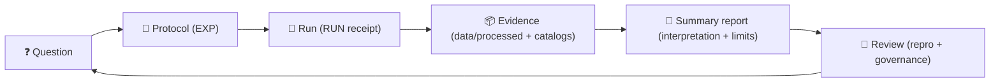
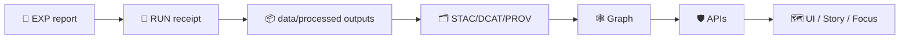

<!--
📌 MCP is KFM’s canonical “methods + receipts” boundary (not a data store, not runtime code).
🗓️ Last updated: 2026-01-11
-->

# 🧪 MCP — Master Coder Protocol  
### *Methods, Controls & Processes* 🧾⚙️


> **TL;DR:** `mcp/` is KFM’s **methods + receipts** layer 📓🧠  
> It holds **protocols**, **run receipts**, **SOPs**, **model cards**, and **review artifacts**—so every result can be **re-run, reviewed, and trusted** ✅  
>
> **Naming note:** Some internal docs expand MCP as **Methods, Controls & Processes**.  
> In *this repo*, we keep the canonical expansion **Master Coder Protocol** ✅ (same intent, same discipline).

> [!IMPORTANT]
> In this repo, **MCP = Master Coder Protocol** ✅  
> **MCP ≠ Model Context Protocol** 🚫 *(not what we mean here)*  
> Keep this distinction consistent in docs, PRs, issues, and commit messages.

---

## 🔗 Quick links
- 🧭 Repo overview: **[`../README.md`](../README.md)**
- 🧬 Pipelines boundary (contract portal): **[`../pipelines/README.md`](../pipelines/README.md)** *(if present)*
- 🧰 Scripts boundary (automation): **[`../scripts/README.md`](../scripts/README.md)** *(if present)*
- 🧩 Executable source boundary: **[`../src/README.md`](../src/README.md)**
- 📦 Data + metadata boundary: **[`../data/README.md`](../data/README.md)**
- 🧪 Notebooks boundary (lab bench): **[`../notebooks/README.md`](../notebooks/README.md)** *(if present)*
- 🧰 Validators & tooling: **[`../tools/README.md`](../tools/README.md)** *(if present)*
- ✅ Tests & CI gates: **[`../tests/README.md`](../tests/README.md)** *(if present)*
- 🤝 CI/CD & policies: **[`../.github/`](../.github/)** *(workflows, security policy, automation)*

---

## ⚡ Quick Nav
- [🧾 Doc metadata](#-doc-metadata)
- [🧭 What MCP is](#-what-mcp-is)
- [🧱 MCP artifacts (types, IDs, and immutability)](#-mcp-artifacts-types-ids-and-immutability)
- [🚦 Non‑negotiables](#-non-negotiables)
- [🏁 Quick Start](#-quick-start)
- [🗂️ Directory layout](#️-directory-layout)
- [🔁 The MCP workflow loop](#-the-mcp-workflow-loop)
- [🚥 Detect → Validate → Promote](#-detect--validate--promote)
- [🧾 Front matter + schemas (machine-readable MCP)](#-front-matter--schemas-machine-readable-mcp)
- [✅ Definition of done](#-definition-of-done)
- [📦 Required artifacts](#-required-artifacts)
- [🧪 Experiment reports](#-experiment-reports)
- [🏃 Run receipts](#-run-receipts)
- [🧰 SOPs](#-sops)
- [🧠 Model cards](#-model-cards)
- [📓 Notebooks](#-notebooks)
- [🧭 Traceability matrix](#-traceability-matrix)
- [🧯 Bad evidence protocol](#-bad-evidence-protocol)
- [🔗 MCP ↔ KFM evidence pipeline](#-mcp--kfm-evidence-pipeline)
- [🧩 Domain checklists](#-domain-checklists)
- [🔐 Safety, privacy, licensing](#-safety-privacy-licensing)
- [✅ QA, audits, and CI hooks](#-qa-audits-and-ci-hooks)
- [🤝 PR / review checklist](#-pr--review-checklist)
- [📚 Project reference library influence map](#-project-reference-library-influence-map)
- [🕰️ Version history](#️-version-history)

---

## 🧾 Doc metadata

| Field | Value |
|---|---|
| Doc | `mcp/README.md` |
| Status | Active ✅ |
| Last updated | **2026-01-11** |
| Audience | Contributors writing experiments, running jobs, training models, shipping evidence artifacts |
| Prime directive | If it changes “spatial truth,” it must be **traceable + reproducible + reviewable** |
| KFM canon | **ETL → STAC/DCAT/PROV → Graph → APIs → UI → Story Nodes → Focus Mode** |

---

## 🧭 What MCP is

### ✅ MCP is…
A **governed method layer** that turns “we tried something” into **auditable science**:

- 🧪 **Protocols** (what we intended to do + why)
- 🏃 **Receipts** (what we actually ran + how)
- 🧰 **SOPs** (repeatable procedures for risky/repeated work)
- 🧠 **Model cards** (responsible AI/ML usage)
- 👀 **Review artifacts** (what was checked, by whom, and what failed)
- 🧭 **Traceability** (decision ↔ evidence ↔ catalogs ↔ provenance)

### 🚫 MCP is not…
- ❌ A data lake (that’s `data/`)
- ❌ A code dump (that’s `src/` and `web/`)
- ❌ A place for large outputs (store in `data/processed/**` + catalogs)
- ❌ A place for “unsourced narrative” (that belongs in Story Nodes with explicit evidence links)

> [!TIP]
> MCP exists to make “results” **explainable and replayable**—not merely impressive. 🧾✅

---

## 🧱 MCP artifacts (types, IDs, and immutability)

MCP stays reliable because artifacts are **typed**, **named**, and **treated correctly**.

| Artifact | Prefix / ID pattern | Where | Immutable? | Purpose |
|---|---|---|---:|---|
| 🧪 Experiment protocol | `EXP-YYYY-MM-DD-<slug>` | `mcp/experiments/` | ⚠️ *Mutable while `draft`* | Pre-register intent, assumptions, and validation plan |
| 🏃 Run receipt | `RUN-YYYY-MM-DD-<slug>/` | `mcp/runs/` | ✅ **Yes** | What was actually executed + how to reproduce |
| 🧰 SOP | `SOP-<topic>-v<semver>` | `mcp/sops/` | ✅ *Versioned* | Repeatable procedures (risky or frequent tasks) |
| 🧠 Model card | `MODEL-<name>-v<semver>` | `mcp/model_cards/` | ✅ *Versioned* | Intended use, limits, datasets, governance for ML/AI |
| 👀 Review note | `REV-YYYY-MM-DD-<slug>.md` | `mcp/reviews/` *(recommended)* | ✅ **Yes** | Independent reproduction and governance sign-off |
| 🧭 Traceability | `TRACEABILITY.md` *(or `TRACE-*.md`)* | `mcp/traceability/` | ✅ *Append-only mindset* | Decision/feature → EXP/RUN → evidence + catalogs |
| 🧯 Incident / anomaly | `INC-YYYY-MM-DD-<slug>.md` *(optional)* | `mcp/incidents/` *(optional)* | ✅ **Yes** | When something shipped wrong: what happened + fix + new gates |

> [!IMPORTANT]
> **Run receipts are immutable.**  
> If anything changes (inputs, params, code, environment), create a **new** run folder. ✅

---

## 🚦 Non‑negotiables

These rules keep KFM **scientific**, **auditable**, and **governed**:

1) **Evidence lives in `data/` — not in `mcp/`.** 📦  
   - `mcp/` = methods, decisions, receipts, checklists  
   - `data/processed/...` = outputs (**and they must be cataloged**)

2) **Protocol before run (when it matters).** 🧾➡️🏃  
   If results could influence product decisions, public narratives, pipelines, or models: write an **EXP** first.

3) **No “magic results.”** 🪄🚫  
   If you can’t reproduce it using:
   - a commit hash
   - an environment snapshot
   - a config
   - linked inputs/outputs (**catalog IDs**)
   …then it’s not “done.”

4) **Immutable receipts.** 🧾  
   Don’t edit a run receipt to “fix history.”  
   Make a **new** run folder and link it.

5) **Label AI involvement.** 🤖  
   Any AI-assisted outputs must be labeled and provenance-linked.  
   Focus Mode remains **advisory-only** and must be evidence-backed.

6) **KFM pipeline order is sacred.** 🧱  
   **ETL → Catalogs (STAC/DCAT/PROV) → Graph → APIs → UI → Story Nodes → Focus Mode**

7) **No privacy / sensitivity downgrade.** 🔒  
   Outputs cannot be less restricted than inputs without an explicit, reviewed redaction step.

8) **Licensing isn’t optional.** 🧾⚖️  
   Every dataset / artifact must carry license + attribution requirements through catalogs and narratives.

9) **Stable IDs are a correctness feature.** 🏷️  
   IDs should be *invariant* across reruns when inputs haven’t changed—treat IDs like API contracts.

> [!TIP]
> Motto: **“If I can’t reproduce it in 30 minutes, it’s not complete.”** ⏱️✅

---

## 🏁 Quick Start

### 1) Create an experiment report 🧪
Add:
- `mcp/experiments/EXP-YYYY-MM-DD-<slug>.md`

### 2) Create a run receipt 🏃
Add:
- `mcp/runs/RUN-YYYY-MM-DD-<slug>/`
  - config, env snapshot, logs, metrics, and `MANIFEST.md`

### 3) Store evidence outputs in the governed data layer 📦
Put evidence artifacts in:
- `data/processed/...` ✅  
Then publish metadata + lineage:
- `data/stac/**` + `data/catalog/dcat/**` + `data/prov/**` 🗂️🧬

### 4) Link it to decisions 🧭
Update traceability (recommended):
- `mcp/traceability/TRACEABILITY.md`

> [!IMPORTANT]
> `mcp/` should stay **lightweight** and human-readable.  
> Large artifacts go to `data/processed/` (or object storage) and get catalog records.

---

## 🗂️ Directory layout

```text
📁 mcp/
├── 📄 README.md                 # you are here 👋
├── 📁 experiments/              # human-readable experiment protocols 🧪🧾
├── 📁 runs/                     # immutable run receipts (configs, env, logs, metrics) 🏃🧾
├── 📁 sops/                     # Standard Operating Procedures (repeatable tasks) 🧰
├── 📁 model_cards/              # model cards for any ML/AI used or trained 🧠
├── 📁 notebooks/                # tidy, reproducible notebooks 📓
├── 📁 traceability/             # decision ↔ evidence mapping 🧭 (recommended)
├── 📁 reviews/                  # peer reproduction notes / governance sign-offs 👀 (recommended)
├── 📁 incidents/                # post-mortems / anomaly reports 🧯 (optional)
└── 📁 templates/                # local templates 🧩 (or use docs/templates/)
```

> [!NOTE]
> Repo implementations vary. If `traceability/` or `reviews/` doesn’t exist yet, consider adding them—  
> design docs call out traceability + modular documentation as a core MCP promise. ✅

---

## 🔁 The MCP workflow loop

KFM work is **question → protocol → run → evidence → report → review → iterate**:



### 🔬 Scientific method alignment (what we document)
MCP is a practical “scientific method adapter” for software + data work:

- **Observation / question** → Why are we doing this?
- **Hypothesis** → What do we expect to see?
- **Method** → Exact procedure + configuration
- **Experiment** → The run receipt (what happened)
- **Analysis** → Metrics, plots, error checks
- **Conclusion** → What we learned (with limits)
- **Iteration** → Next experiment / pipeline change

---

## 🚥 Detect → Validate → Promote

A lot of KFM risk comes from “half-published” artifacts. MCP encourages a controlled publishing rhythm:

1) **Detect** 🕵️  
   Identify new inputs / changes (sources updated, new scans, schema drift, new tiles).

2) **Validate** ✅  
   Run fast gates:
   - schema & bounds checks
   - catalog validity
   - link integrity
   - governance propagation (no downgrade)
   - security scans (secrets / sensitive patterns)

3) **Promote** 🚀  
   Only after validation:
   - write evidence to `data/processed/**`
   - write STAC/DCAT/PROV
   - (optionally) export graph ingest bundles
   - add MCP RUN receipt + traceability update

> [!TIP]
> Treat “promotion” like a release: **atomic publish or nothing.** 🧾✅

---

## 🧾 Front matter + schemas (machine-readable MCP)

MCP documents are **human-first**, but they should also be **machine-readable** for dashboards, validation, and CI gates.

### ✅ Front matter conventions (recommended)
All MCP artifacts should start with YAML front matter (or equivalent), including:

- stable ID (`EXP-...`, `RUN-...`, `SOP-...`, `MODEL-...`)
- date
- owner
- status
- tags
- AI involvement (if applicable)
- links to evidence (catalog IDs or paths)

> [!NOTE]
> If your repo includes MCP schemas under `schemas/mcp/`, keep MCP front matter compliant and validate in CI. ✅

---

## ✅ Definition of done

### ✅ MCP “done” means: reproducible + governed
For any EXP/RUN that influences production pipelines, APIs, UI layers, Story Nodes, or Focus Mode:

- [ ] Front-matter complete + consistent (IDs, dates, owner, status)
- [ ] Claims link to evidence inputs/outputs (**catalog pointers**)
- [ ] Validation steps are listed and repeatable
- [ ] Governance + FAIR/CARE + sovereignty considerations stated (when applicable)
- [ ] Another contributor can reproduce results without tribal knowledge

### 🧱 Reproducibility levels (recommended)
- **L0** 🟡: exploratory note (not decision-worthy)
- **L1** 🟠: reproducible by author (config + env captured)
- **L2** 🟢: reproducible by reviewer (independent re-run)
- **L3** 🏆: CI-backed / automated rerun (pipeline job + validators)

---

## 📦 Required artifacts

### ✅ “Real work” minimum bar
If an experiment influences decisions, pipelines, or published results, it must include:

- 🧪 **Experiment report** → `mcp/experiments/...`
- 🏃 **Run receipt** → `mcp/runs/...`
- 🔗 **Code pointer** → commit hash + entrypoint
- 🧱 **Environment snapshot** → Docker image digest **or** lockfile/requirements
- 🎲 **Seeds / determinism flags** (where applicable)
- 📦 **Outputs stored as evidence** → `data/processed/...`
- 🗂️ **Catalog records** → STAC/DCAT
- 🧬 **Lineage** → PROV pointers (inputs + outputs)
- 👀 **Review notes** → reproduction sign-off for L2/L3 work (recommended)
- 🔐 **Policy checks evidence** → list which gates ran (recommended)
- 🧾 **(Optional) CI attestation** → if your repo signs artifacts / builds

> [!WARNING]
> Avoid committing large binaries to `mcp/`.  
> If it’s an “output,” it probably belongs in `data/processed/` with catalogs + lineage.

---

## 🧪 Experiment reports

### 📛 Naming convention
Use one pattern consistently:

- `EXP-YYYY-MM-DD-<short-slug>.md`  
  Example: `EXP-2026-01-02-ocr-ner-baseline.md`

### 🏷️ Status values
- `draft` 📝 — in progress
- `complete` ✅ — reproducible; linked receipts + evidence
- `superseded` 🧯 — replaced by a newer experiment

### 🧾 Experiment template (copy/paste)

```md
---
id: EXP-YYYY-MM-DD-<slug>
title: "<short, explicit title>"
date: YYYY-MM-DD
owner: "@github-handle"
status: draft | complete | superseded
repro_level: L0 | L1 | L2 | L3
risk_level: low | medium | high
ai_used: true | false
supersedes: []          # optional: [EXP-...]
superseded_by: []       # optional: [EXP-...]
tags: [gis, ocr, nlp, stac, dcat, prov, graph, sim, stats, web, security]
---

# Objective / Question ❓
- What are we trying to learn or improve?

# Background / Prior Art 📚
- Links to prior experiments, issues, papers, notes, or domain docs.

# Hypothesis ✅/❌
- What do we expect and why?

# Variables & Controls 🎛️
- Key variables you’re changing.
- Controls / baselines.
- What stays fixed.

# Inputs (Evidence In) 🗃️
- Dataset IDs + STAC/DCAT pointers.
- Sampling rules, inclusion/exclusion, time range, bbox.
- Licensing + sensitivity notes (if applicable).

# Method / Protocol 🧾
- Step-by-step procedure.
- Parameters + configs (link to run receipt config).
- Tools + versions (OS/GPU/driver notes if relevant).

# Validation Plan ✅
- What fails fast?
- What warns?
- What “sanity checks” must pass?

# Run Receipt 🏃
- Code commit: `abcdef1`
- Entrypoint: `src/...` or notebook path
- Run folder: `mcp/runs/RUN-YYYY-MM-DD-.../`
- Seeds: `...`
- Determinism flags: `...`

# Outputs (Evidence Out) 📦
- Where outputs live (paths under `data/processed/...`)
- Catalog pointers:
  - STAC item(s): `...`
  - DCAT dataset: `...`
  - PROV bundle: `...`

# Results 📈
- Metrics, charts, qualitative examples (keep small).
- Add 1–3 “sanity check” examples.

# Uncertainty, Bias, and Validation 🔍
- What could be wrong?
- Checks performed (spot checks, CV, error bounds, leakage checks).
- Bias risks / perspective gaps (especially for historical corpora).

# Interpretation 🧠
- What do results mean for KFM decisions?

# Decision / Next Steps 🧭
- Adopt / iterate / abandon (and why).

# Reproducibility Checklist ✅
- [ ] Parameters & configs documented
- [ ] Code committed + hash recorded
- [ ] Environment captured (Docker/lockfile)
- [ ] Seeds recorded (if applicable)
- [ ] Inputs/outputs linked via STAC/DCAT/PROV
- [ ] Reviewer can reproduce (for L2/L3)
```

> [!TIP]
> If you can’t write the “Uncertainty, Bias, and Validation” section honestly, the experiment isn’t finished. 🔍✅

---

## 🏃 Run receipts

Runs are the **receipt** for an experiment: what you ran, how you ran it, where outputs went, and what changed.

### 📛 Naming convention
- `RUN-YYYY-MM-DD-<slug>/`

### 📦 Suggested run folder contents
- `config/` 🧾 — YAML/JSON config used for the run
- `env/` 🧱 — `pip freeze`, lockfiles, Docker digest, OS info
- `logs/` 🪵 — structured logs (**redacted if needed**)
- `metrics/` 📈 — CSV/JSON metrics, evaluations
- `artifacts/` 🧩 — *small* artifacts (thumbnails, sample outputs)
- `MANIFEST.md` 🧾 — reproduction instructions + evidence links + checks performed

### 🧾 Minimal `MANIFEST.md` template (copy/paste)

```md
---
run_id: RUN-YYYY-MM-DD-<slug>
related_experiment: EXP-YYYY-MM-DD-<slug>
date: YYYY-MM-DD
owner: "@github-handle"
env: dev | staging | prod

code:
  commit: abcdef1
  entrypoint: "src/pipelines/..."
  args: ["--config", "config/run.yml"]
  dirty_worktree: false  # recommended

environment:
  docker_image: "ghcr.io/org/project:tag@sha256:..."     # preferred
  # or:
  requirements: "env/requirements.lock.txt"
  os: "..."
  cpu: "..."
  gpu: "..."  # optional

randomness:
  seeds: [123, 456]
  deterministic_flags: ["..."]

inputs:
  - catalog_ref: "stac://<collection_or_item_id>"
  - dcat: "data/catalog/dcat/<dataset>.jsonld"
  - prov: "data/prov/<prior-run>.jsonld"

outputs:
  - path: "data/processed/<domain>/<dataset>/..."
    stac_item: "data/stac/items/..."
    dcat: "data/catalog/dcat/..."
    prov: "data/prov/<run-id>.jsonld"

validation:
  - "schema validation: pass/fail"
  - "link checks: pass/fail"
  - "classification propagation: pass/fail"
  - "spot checks: ..."

policy_checks:               # optional, recommended
  - "secrets scan: pass/fail"
  - "sensitive patterns scan: pass/fail"
  - "sbom generated: yes/no"
  - "attestation present: yes/no"

notes: ""
---

# Summary 🧾
- What did this run do?

# Evidence outputs 📦
- Where outputs are stored (`data/processed/...`) + catalog IDs

# How to reproduce 🔁
1. Checkout commit: `abcdef1`
2. Restore environment: ...
3. Run: ...
4. Validate: ...
```

> [!TIP]
> Treat run folders as **immutable receipts**.  
> New parameters → new run folder ✅

---

## 🧰 SOPs

SOPs turn “tribal knowledge” into a repeatable, reviewable procedure.  
Write an SOP whenever a task is repeated or risky: georeferencing, catalog publishing, redaction, OCR, tile generation, etc. 🧯

### SOP template (copy/paste)

```md
---
id: SOP-<topic>-v1.0.0
title: "<clear title>"
owner: "@github-handle"
last_updated: YYYY-MM-DD
risk_level: low | medium | high
---

# Purpose 🎯
What this SOP accomplishes and when to use it.

# Scope ✅
What’s included / excluded.

# Prerequisites 🧱
Accounts, tools, access, permissions.

# Tools & Versions 🧰
Software + versions.

# Procedure 🧭
1. Step...
2. Step...
3. Step...

# Verification ✅
How to confirm it worked (checks + expected outputs).

# Troubleshooting 🧯
Common failure modes + fixes.

# Audit Trail 🧾
Example PRs / runs / experiments that used this SOP.
```

### ⭐ High-value SOPs to add (starter set)
- `sops/georeference_map.md` 🗺️ (control points, RMS error, CRS discipline)
- `sops/build_cog_and_tiles.md` 🧊 (COG params, overviews, tile scheme)
- `sops/ocr_pipeline.md` 🔎 (scan QA, language assumptions, error classes)
- `sops/publish_stac_dcat_prov.md` 🗂️🧬 (profiles, validation, link checks)
- `sops/catalog_qa_gate.md` ✅ (how to run CI-like catalog QA locally)
- `sops/postgis_import_index.md` 🐘 (schemas, indexes, vacuum/analyze)
- `sops/redaction_and_sensitive_locations.md` 🔐 (coarsen/offset rules, approvals)
- `sops/detect_validate_promote.md` 🚥 (release discipline for evidence publishing)
- `sops/rollback_and_prov_repair.md` 🧯 (how to revert + repair provenance safely)
- `sops/ci_attestation_and_signing.md` 🔏 (if your repo signs builds / generates SBOMs)
- `sops/story_node_evidence_bundle.md` 📚 (evidence pack for narratives + Focus Mode)

---

## 🧠 Model cards

Any ML/AI model used in KFM (trained or adopted) needs a model card:

- what it is
- what it was trained on / sourced from
- what it should be used for ✅
- what it must **not** be used for 🚫
- known limitations, bias risks, failure modes ⚠️
- provenance + licensing + governance labels 🧾🔒

### Model card template (copy/paste)

```md
---
model_id: MODEL-<name>-v<semver>
owner: "@github-handle"
date: YYYY-MM-DD
ai_used: true
source:
  type: trained | third_party
  license: "..."
  reference: "paper/link/registry id"
datasets:
  - "stac://<collection_or_item_id>"
  - "dcat://<dataset_id>"
governance:
  sensitivity: public | restricted | confidential
  human_in_the_loop: required | recommended | optional
  redaction_required: yes | no
---

# Model overview 🧠
- What problem does it solve?

# Intended use ✅
- Supported use-cases.

# Out-of-scope / prohibited use 🚫
- What it must not be used for.

# Training data 🗃️
- Datasets used (STAC/DCAT pointers), sampling, labeling notes.
- Known gaps / perspective bias notes.

# Evaluation 📈
- Metrics, test sets, qualitative examples.
- Calibration / uncertainty notes when applicable.

# Limitations & biases ⚠️
- Known failure modes, bias risks, uncertainty notes.

# Governance & safety 🔐
- Any redaction rules or sensitivity constraints.
- How outputs are labeled in UI / Focus Mode.

# Reproducibility 🧪
- Training code commit hash
- Environment / hardware notes
- Hyperparameters / config
- Seeds
- Artifact pointers (weights, charts) stored under `data/processed/...` with catalogs
```

---

## 📓 Notebooks

Notebooks are welcome—**but must be readable and reproducible**:

- Start with a markdown cell: **purpose + inputs + outputs**
- Keep outputs small *(no huge embedded blobs)*
- Prefer parameterized notebooks or export to scripts when it becomes “real”
- If a notebook produces evidence artifacts:
  - store outputs in `data/processed/...`
  - link them from an experiment report + run receipt

> [!CAUTION]
> Notebooks that silently write files without catalogs + provenance are **not shippable**.

---

## 🧭 Traceability matrix

Traceability is how MCP connects “work” to “why it matters”:

- ❓ Question / requirement  
- 🧪 EXP protocol  
- 🏃 RUN receipt  
- 📦 Evidence artifacts (+ STAC/DCAT/PROV)  
- 🕸️ Graph IDs (if applicable)  
- 🛡️ API endpoints (if applicable)  
- 📚 Story Node(s) / Focus Mode (if applicable)

### ✅ Recommended traceability table (copy/paste)

```md
| Decision / Feature | EXP | RUN | Evidence outputs (data/processed) | Catalog pointers (STAC/DCAT/PROV) | Reviewer repro | Notes |
|---|---|---|---|---|---|---|
| "OCR treaties baseline for Land Treaties domain" | EXP-2026-01-02-... | RUN-2026-01-02-... | data/processed/historical/land-treaties/ocr/... | STAC: ... / DCAT: ... / PROV: ... | @reviewer ✅ | error classes logged |
```

> [!TIP]
> If a Story Node makes a claim, traceability must point to the evidence artifacts that support it. 📚🧾

---

## 🧯 Bad evidence protocol

KFM must be resilient to “bad evidence” (messy scans, biased corpora, incomplete sensor data, uncertain geocoding).

When evidence is questionable, MCP requires **restraint**:

1) **Data pruning** ✂️  
   Exclude known-bad inputs (or flag them as “quarantined” until fixed).

2) **Inferential restraint** 🧠⬇️  
   Reduce the strength/scope of conclusions; report uncertainty explicitly.

3) **Executional restraint** 🛑  
   Limit downstream actions: don’t ship to UI/Story/Focus until reviewed, or serve only aggregated/redacted views.

### ✅ Minimum “bad evidence” documentation
- What’s wrong?
- How do we know?
- What we changed (or refused to change)
- What remains uncertain
- Who reviewed the restraint decision

---

## 🔗 MCP ↔ KFM evidence pipeline

KFM uses a strict evidence pipeline:

**ETL → Catalogs (STAC/DCAT/PROV) → Graph → APIs → UI → Story Nodes → Focus Mode**

So for MCP work:

- ✅ Protocols live here: `mcp/experiments/...`
- ✅ Receipts live here: `mcp/runs/...`
- ✅ Evidence artifacts live here: `data/processed/...`
- ✅ Evidence artifacts must be:
  - cataloged (STAC/DCAT) 🗂️
  - lineage-linked (PROV) 🧬
  - integrated through governed contracts (API boundary) 🔒



---

## 🧩 Domain checklists

Use the checklist that matches your work:

### 🗺️ GIS / Remote Sensing
- [ ] CRS documented (EPSG + axis order)
- [ ] Georeferencing method + control points documented
- [ ] Fit error/RMS recorded (if applicable)
- [ ] Raster outputs are COGs / tiled (with parameters)
- [ ] Vector outputs validate (geometry validity, topology as needed)
- [ ] Symbology/aggregation choices documented if they change interpretation 🎨
- [ ] Catalog pointers included (STAC/DCAT) + lineage (PROV) 🗂️🧬

### 🔎 OCR / NLP
- [ ] Input corpus + sampling documented
- [ ] Labeling rules / evaluation rubric included
- [ ] Precision/recall (or spot-check protocol) documented
- [ ] Failure classes logged (scan quality, fonts, ambiguity)
- [ ] Geoparsing uncertainty documented (ambiguous place names, gazetteer limits)

### 🕸️ Graph analytics
- [ ] Graph schema/ontology version noted
- [ ] Metrics treated as **signals**, not facts (avoid over-interpretation)
- [ ] Provenance links from derived relations to source evidence
- [ ] No orphan IDs / referential integrity checks pass ✅

### 📊 Statistics / Inference
- [ ] Outcomes + units defined
- [ ] Assumptions checked (independence, distribution, etc.)
- [ ] Effect sizes reported (not just p-values)
- [ ] Multiple comparisons handled (or explicitly scoped)
- [ ] Guardrails against optional stopping / publication bias documented 🧯

### 🛰️ Modeling & Simulation
- [ ] Assumptions enumerated explicitly
- [ ] Verification & validation approach documented (V&V mindset)
- [ ] Sensitivity analysis for key parameters
- [ ] Uncertainty quantified or bounded
- [ ] Results reported with uncertainty context (not single “truth” numbers)

### 🌐 Web UI / Visualization (when experiments affect front-end behavior)
- [ ] Payload budgets considered (tiles, vector sizes, images)
- [ ] Offline/low-bandwidth considerations documented (if relevant) 📱
- [ ] Accessibility and audit logging expectations noted ♿️🧾
- [ ] Focus/Story evidence bundle is explicit (no unsourced claims) 📚🧾

---

## 🔐 Safety, privacy, licensing

- 🚫 Don’t store secrets, tokens, keys, or sensitive PII in `mcp/`
- 🧽 Redact logs before committing if they contain identifiers, endpoints, or sensitive paths
- 🧊 Prefer immutable receipts: new run folder > editing old run folder
- 🧭 If superseded, mark as `superseded` and link the replacement
- 🗺️ Sensitive locations: if a dataset could expose culturally sensitive or personal location data:
  - coarsen/offset/omit coordinates
  - require explicit permission & review before publishing
  - propagate sensitivity tags through catalogs and UI

> [!IMPORTANT]
> Licensing must travel with evidence. If you combine layers, the resulting artifact must still honor attribution and license constraints. ⚖️🧾

---

## ✅ QA, audits, and CI hooks

### CI intent (minimum bar)
- 🧹 lint + formatting
- ✅ unit tests (where applicable)
- 🧾 schema validation (STAC/DCAT/PROV)
- 🔗 link checks (assets exist; IDs resolve)
- 🔐 security scans (secrets; sensitive patterns; dependency risk)
- 🧷 governance checks (classification propagation; redaction regressions)

### Periodic audits (recommended)
- Quarterly: sample 3 completed EXP/RUN pairs → verify re-run works end-to-end
- Before release: audit “high-impact” artifacts (models, major new datasets, story bundles)
- After incidents: add an SOP + regression checks

> [!TIP]
> A good system becomes safer over time: every incident should produce a new gate. 🧯✅

---

## 🤝 PR / review checklist

When your PR includes experiments, runs, or evidence:

- [ ] EXP report added/updated (`mcp/experiments/...`) *(if decision-relevant)*
- [ ] RUN receipt folder added (`mcp/runs/...`) with `MANIFEST.md`
- [ ] Evidence outputs stored under `data/processed/...` (or linked object storage)
- [ ] STAC/DCAT/PROV pointers added (IDs or paths)
- [ ] AI involvement labeled (if applicable)
- [ ] Reproduction steps included (1–4 steps; copy/paste runnable)
- [ ] No secrets / no sensitive leaks in logs or outputs
- [ ] Reviewer can reproduce (required for L2/L3 work)

> [!TIP]
> A great review comment is: **“I reproduced this and got the same outputs.”** ✅

---

## 📚 Project reference library influence map

> These project files inform *how we design and review* MCP artifacts: reproducibility, governance, security, modeling rigor, statistical discipline, scaling, and visualization constraints.

<details>
<summary><strong>📦 Expand: Reference library → what it influences in <code>mcp/</code></strong></summary>

| Project file | Primary lens | How it upgrades MCP |
|---|---|---|
| `Scientific Method _ Research _ Master Coder Protocol Documentation.pdf` | 🔬 Scientific method + documentation system | Reinforces protocol-first workflow, documentation standards, transparency, peer review, and modular domain protocols. |
| `Kansas Frontier Matrix (KFM) – Comprehensive Technical Documentation.docx` | 🧭 System blueprint | Aligns MCP with KFM’s governed pipeline order, onboarding resources (glossary/templates), and evidence-backed Focus discipline. |
| `🌟 Kansas Frontier Matrix – Latest Ideas & Future Proposals.docx` | 🚀 Forward-looking operations | Encourages Detect→Validate→Promote, policy-as-code gates, provenance everywhere (PROV JSON-LD), and safer automation patterns (idempotency + kill switch). |
| `Kansas-Frontier-Matrix_ Open-Source Geospatial Historical Mapping Hub Design.pdf` | 🏗️ Platform design | Clarifies end-to-end architecture (ingest → catalogs → analysis → UI) and why experiment tracking/model cards are first-class. |
| `Kansas-Frontier-Matrix Design Audit – Gaps and Enhancement Opportunities.pdf` | 🧯 Reality check | Highlights where MCP must be operational (actual SOPs, glossary, checklists, review notes)—not just “paper MCP.” |
| `MARKDOWN_GUIDE_v13.md.gdoc` | 📘 Repo-level invariants | Defines evidence-first + contract-first doctrine, Story Node/Focus constraints, and definition-of-done patterns for governed docs. |
| `Scientific Modeling and Simulation_ A Comprehensive NASA-Grade Guide.pdf` | 🧪 V&V discipline | Shapes simulation experiment logging, V&V framing, uncertainty, and sensitivity analysis discipline. |
| `Understanding Statistics & Experimental Design.pdf` | 📊 Rigor + bias | Encourages guarding against optional stopping/publication bias and documenting assumptions + effect sizes. |
| `regression-analysis-with-python.pdf` + `Regression analysis using Python - slides-linear-regression.pdf` | 📈 Baselines + diagnostics | Improves reproducible modeling baselines and diagnostic reporting in EXP/RUN artifacts. |
| `think-bayes-bayesian-statistics-in-python.pdf` | 🎲 Uncertainty | Encourages explicit priors, posterior uncertainty reporting, and calibrated decisions under uncertainty. |
| `graphical-data-analysis-with-r.pdf` | 📉 EDA instincts | Reinforces visual sanity checks and anomaly detection before publishing evidence. |
| `Cloud-Based Remote Sensing with Google Earth Engine-Fundamentals and Applications.pdf` | 🛰️ EO workflows | Informs remote sensing SOPs (export patterns, time-series handling) and treating derived indices as evidence artifacts. |
| `python-geospatial-analysis-cookbook.pdf` | 🗺️ GIS engineering | Guides CRS hygiene, vector/raster IO, PostGIS integration, and safe geoprocessing SOPs. |
| `making-maps-a-visual-guide-to-map-design-for-gis.pdf` | 🎨 Cartography ethics | Reminds that visualization choices shape meaning; demands documentation of map design decisions. |
| `Mobile Mapping_ Space, Cartography and the Digital - 9789048535217.pdf` | 📱 Mobile/offline constraints | Encourages tiling, caching, and offline-aware documentation for downstream UX and performance. |
| `responsive-web-design-with-html5-and-css3.pdf` | 🌐 Real-device constraints | Pushes MCP to capture payload/latency constraints and test on realistic device assumptions. |
| `webgl-programming-guide-interactive-3d-graphics-programming-with-webgl.pdf` | 🧊 GPU/3D | Motivates explicit coordinate conventions, LOD/tiling decisions, and 3D evidence display constraints. |
| `compressed-image-file-formats-jpeg-png-gif-xbm-bmp.pdf` | 🖼️ Image pipelines | Shapes SOPs for thumbnails, compression, and safe handling of complex formats. |
| `PostgreSQL Notes for Professionals - PostgreSQLNotesForProfessionals.pdf` | 🐘 Data store discipline | Informs SOPs around schemas, indexing, migrations, and reproducible data loading. |
| `Scalable Data Management for Future Hardware.pdf` | ⚙️ Performance + concurrency | Encourages documenting performance experiments, resource assumptions, and concurrency constraints in run receipts. |
| `Data Spaces.pdf` | 🔗 Interop & federation | Supports catalog-as-interface thinking and future federated evidence workflows. |
| `Spectral Geometry of Graphs.pdf` | 🕸️ Graph theory | Encourages careful interpretation of graph metrics and provenance for derived relations. |
| `Generalized Topology Optimization for Structural Design.pdf` | 🧮 Optimization workflows | Suggests structuring optimization experiments as reproducible jobs with clear objectives/constraints. |
| `Principles of Biological Autonomy - book_9780262381833.pdf` | 🧠 Systems thinking | Promotes feedback-loop awareness and stability thinking when documenting pipelines and governance. |
| `Introduction to Digital Humanism.pdf` | ❤️ Human-centered ethics | Reinforces transparency, accountability, and dignity in governance + AI documentation. |
| Security & concurrency references (e.g., `ethical-hacking-and-countermeasures...pdf`, `Gray Hat Python...pdf`, `concurrent-real-time-and-distributed-programming-in-java...pdf`) | 🛡️ Adversarial mindset | Guides hostile-input posture, threat modeling, and defensive review of parsers/pipelines/services. |
| Programming bundles (`A...pdf`, `B-C...pdf`, `D-E...pdf`, `F-H...pdf`, `I-L...pdf`, `M-N...pdf`, `O-R...pdf`, `S-T...pdf`, `U-X...pdf`) | 🧰 Polyglot reference | Supports language/tooling best practices while keeping KFM’s boundary invariants intact. |

</details>

---

## 🕰️ Version history

| Version | Date | Summary | Author |
|---:|---|---|---|
| v1.3.0 | 2026-01-11 | Tightened MCP into a typed, machine-readable “methods + receipts” layer: added artifact/ID table, Detect→Validate→Promote guidance, front matter + schema notes, expanded run manifest to include policy checks/attestation hooks, added incident/review artifact guidance, and aligned reference map with current project docs. | KFM Engineering |
| v1.2.0 | 2026-01-09 | Upgraded MCP to align with v13 evidence-first/contract-first doctrine: added definition-of-done, reproducibility levels, traceability matrix, bad-evidence restraint protocol, expanded governance/licensing/sensitive-location guidance, and an updated reference-library influence map. | KFM Engineering |
| v1.1.0 | 2026-01-06 | Clarified non‑negotiables + pipeline linkage; added run receipt template, PR checklist, and workflow diagram. | KFM Engineering |
| v1.0.0 | 2025-12-31 | Initial MCP README: experiments, runs, SOPs, model cards, notebooks, safety rules. | KFM Engineering |

---

🧭 **Goal:** Make every output auditable and every method teachable.  
🧾 **Promise:** If it’s in production, it has a paper trail. ✅

<!--
Evidence anchors (project docs consulted for this update):
- Evidence-first + artifact definitions + Focus/Story constraints:   
- MCP scientific-method posture + documentation standards + modular protocols:   
- Onboarding resources (glossary/templates) and MCP terminology in KFM doc:  
- Detect→Validate→Promote + policy-as-code + provenance/attestation ideas: :contentReference[oaicite:8]{index=8} :contentReference[oaicite:9]{index=9} 
- Design audit “make MCP real” (SOPs/glossary/checklists): 
- Open-source hub design: experiment tracking + model cards are first-class: :contentReference[oaicite:12]{index=12} :contentReference[oaicite:13]{index=13}
-->
