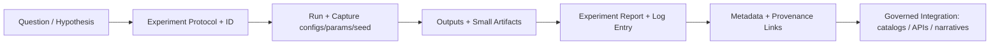

# 🧩 MCP — Master Coder Protocol (KFM)

<kbd>GOVERNED</kbd> <kbd>PROVENANCE-FIRST</kbd> <kbd>FAIR+CARE</kbd> <kbd>CI-VALIDATED</kbd>

> [!IMPORTANT]
> **MCP (“Master Coder Protocol”) is KFM’s reproducibility + documentation contract** for experiments, SOPs, model cards, and shared vocabulary.
> If it’s not documented with provenance, it’s not “real” in the KFM knowledge system.

---

## 📘 Overview

### Purpose
This directory defines how we:
- record experiments in a way others can reproduce (inputs → method → outputs → interpretation),
- standardize repeatable procedures (SOPs),
- document models (model cards) and data assumptions,
- maintain a shared glossary so collaboration stays precise.

### Scope

| In Scope ✅ | Out of Scope ❌ |
|---|---|
| Experiment logs + experiment report templates | Raw data storage (see `data/`) |
| SOPs for repeatable tasks | Production incident runbooks (unless explicitly designated) |
| Model cards for trained models / heuristics | “Uncited narrative” or undocumented findings |
| Glossary / terminology registry | Bypassing governance or provenance gates |

### Audience
- **Primary:** KFM contributors (data/pipeline, backend, frontend, research, historians)
- **Secondary:** reviewers, governance stewards, external collaborators (when permitted)

### Definitions (local quick reference)

| Term | Meaning in this repo |
|---|---|
| **Experiment Log** | An indexed “lab notebook” entry: what was tested, why, how, and what happened |
| **Experiment Report** | A detailed write-up (often 1:1 with an experiment ID) enabling reproduction |
| **SOP** | Standard Operating Procedure: repeatable steps + verification criteria |
| **Model Card** | A short document describing a model’s purpose, training data context, performance, and limits |
| **Provenance** | Dataset IDs / record IDs / commit hashes / lineage artifacts that substantiate claims |

---

## 🗂️ Directory Layout

> [!NOTE]
> Treat this as the **expected** MCP structure. Create folders/files as needed (and keep links stable).

### Tree

```text
mcp/
  README.md                         # (this file) MCP overview + contributor contract
  experiments/
    EXPERIMENT_LOG.md               # Master index of experiments (by ID) (recommended)
    experiment_template.md          # Template for experiment reports
    <exp_id>__<slug>/               # Optional: per-experiment folder
      README.md                     # Detailed experiment report (or link to it)
      artifacts/                    # Optional: plots, outputs, hashes, configs (no large raw data)
  sops/
    SOP_INDEX.md                    # Optional: index of SOPs
    sop_template.md                 # SOP template
    SOP__<slug>.md                  # SOPs (repeatable procedures)
  glossary.md                       # Shared vocabulary (or use glossary/ folder)
  model_cards/
    MODEL__<slug>.md                # Model cards (human-readable + governance notes)
```

### What belongs where

| Path | What goes here | Typical reviewers |
|---|---|---|
| `mcp/experiments/` | Experiment index + reports + small artifacts (plots/configs/hashes) | domain reviewers + maintainers |
| `mcp/sops/` | SOPs for repeatable tasks; verification + troubleshooting required | maintainers + ops/pipeline reviewers |
| `mcp/model_cards/` | Model cards (intended use, limits, evaluation context) | maintainers + governance reviewers |
| `mcp/glossary.md` | Canonical definitions/acronyms used across docs and UI | everyone (esp. narrative/UI) |

---

## 🧭 Context

KFM is “evidence-first”: story nodes, UI panels, and AI answers are intended to remain auditable and traceable to sources. MCP is the **human-side protocol** that keeps experimentation, repeatable work, and model usage from turning into “tribal knowledge.”

### MCP operating principles
- **Reproducibility over vibes:** document enough detail that a skilled contributor can replicate.
- **Version everything:** code versions and data versions/hashes must be traceable.
- **No orphan artifacts:** outputs without an experiment ID and write-up are treated as scratch.
- **Governance-aware:** sensitive information is generalized/redacted and flagged for review.

---

## 🧩 Diagrams

### How MCP artifacts flow into KFM



---

## 📦 Data & Metadata

### Minimum required fields

> [!TIP]
> If you can’t fill a field, write `TBD` and explain why. Don’t delete fields—missing provenance is a review blocker.

#### Experiment Log Entry (index row)
- **Date**
- **Experiment ID** (unique + stable)
- **Author(s)**
- **Purpose / Question**
- **Method summary**
- **References** (links to protocol/report, code commit, dataset IDs)
- **Results summary**
- **Conclusion / Next steps**

#### Experiment Report (per experiment)
Use `mcp/experiments/experiment_template.md` and include:
- **Objective**
- **Inputs & data references** (dataset IDs / hashes / versions; never “mystery data”)
- **Method** (params, environment notes, assumptions)
- **Results** (metrics, plots, outputs)
- **Interpretation**
- **Reproduction steps** (commands, scripts, or pipeline invocation)
- **Known limitations / failure modes**

#### SOP (repeatable procedure)
Use `mcp/sops/sop_template.md` and include:
- **Purpose**
- **Tools needed**
- **Steps**
- **Verification**
- **Troubleshooting**

#### Model Card
In `mcp/model_cards/` include:
- **Intended use / non-use**
- **Training data context** (what kinds of data; how it was sourced)
- **Evaluation context** (what “good” means; what was measured)
- **Limitations & risks** (bias, uncertainty, failure cases)
- **Operational notes** (how it is invoked; dependencies; compatibility)

### Data docs live elsewhere (but MCP must link to them)
Raw/processed datasets and their catalogs/lineage should live under the repo’s data/pipeline conventions (e.g., dataset catalogs and provenance artifacts). MCP artifacts should **link out** to those dataset records rather than duplicating them.

---

## 🏗️ Architecture Alignment

> [!WARNING]
> MCP docs must **not** recommend architecture “shortcuts” that bypass KFM’s governance and trust boundaries.

### Invariants MCP docs must respect
- **Trust membrane:** UI and external clients access governed backends via APIs—not databases directly.
- **Clean boundaries:** core workflows should use repository/service interfaces; avoid “quick hacks” that skip governance gates.
- **Pipeline order:** document changes so lineage remains consistent (raw → processed → catalog/prov → DB → API → UI).

### Quick Do/Don’t

| ✅ Do | ❌ Don’t |
|---|---|
| Link experiments to dataset IDs + code commits | “I ran something locally; trust me” |
| Use SOPs for repeatable processes | Write one-off tribal steps in chat only |
| Record parameters, seeds, versions | Omit run conditions and expect reproducibility |
| Flag sensitive info and redact precise locations | Publish precise vulnerable/sacred locations in public docs |

---

## 🧭 Story Nodes & Focus Mode Integration

Even when MCP artifacts are “internal,” they often support:
- story node claims (what evidence supports a narrative step),
- model-driven layers or analyses (what a model is allowed to do),
- auditability in Focus Mode (what provenance is displayed).

If an MCP experiment motivates a story node update, ensure the story node cites:
- the experiment report (by ID),
- the underlying dataset records (IDs/hashes),
- any relevant governance or sensitivity notes.

---

## 🧪 Validation & CI/CD

MCP artifacts are treated like governed documentation. Expect checks such as:
- Markdown linting
- Template/structure validation
- Link + image validation (avoid hot-linked external images)
- Provenance/sensitivity scan
- Accessibility checks (headings, alt text, table headers)

### Local workflow tips
```bash
# Example (if configured in the repo):
pre-commit run --all-files
```

Before opening a PR:
1. Preview the Markdown rendered (GitHub/VSCode).
2. Verify all internal links resolve.
3. Confirm provenance links exist (dataset IDs, commit hashes, etc.).
4. Update **Version History** for non-trivial changes.

---

## ⚖️ FAIR+CARE & Governance

KFM adheres to FAIR+CARE practices:
- **Findable:** consistent naming, stable IDs, clear paths
- **Accessible:** readable Markdown, descriptive links, alt text
- **Interoperable:** standards terminology (e.g., STAC/DCAT/PROV) used consistently
- **Reusable:** explicit assumptions + version history

CARE reminders:
- **Authority to Control / Ethics:** protect culturally sensitive information; redact precise locations of sacred/vulnerable sites; flag docs requiring special review.
- If you suspect content requires restricted handling, **generalize + flag** rather than publish details.

---

## 🕰️ Version History

| Version | Date (YYYY-MM-DD) | Summary | Author |
|---|---:|---|---|
| v0.1.0 | 2026-02-10 | Initial MCP README establishing structure, governance, and contributor contract | KFM maintainers |

---

## ✅ Definition of Done (for MCP contributions)

- [ ] New/updated MCP doc follows the intended structure and headings
- [ ] All substantive claims include provenance links (dataset IDs / commits / sources)
- [ ] Experiment entries include parameters/configs and reproduction steps
- [ ] SOPs include verification + troubleshooting
- [ ] No sensitive locations/details leaked; governance flags included if needed
- [ ] Links and images validated (no broken links; no hot-linked images)
- [ ] Ran local checks where possible (e.g., `pre-commit`)
- [ ] Version History updated for non-trivial edits