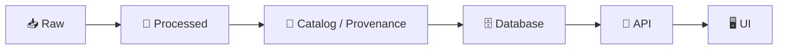

# ✅ MCP Checklists


> 🧭 **Purpose:** This folder is the “quality & traceability control panel” for the repo.  
> Checklists here help ensure **end-to-end provenance**, **reproducible pipelines**, and **auditable results**—especially for geospatial + data + AI workflows.

---

## 📌 Quick Start (Use in PRs)

1) **Pick the checklist(s)** that match your change (data, pipeline, model, UI, infra, release).  
2) **Copy** the checklist into your PR description (don’t just link it).  
3) **Check items** and add **evidence links** (files, commands, logs, screenshots, commit hashes).  
4) If something is truly not applicable: mark **N/A** and explain **why**.

> ✅ **Rule of thumb:** If it changes data, behavior, results, or public output → add a checklist.

---

## 🧱 The Golden Path (How This Repo Wants Work Done)

This project follows a “pipeline → catalog/provenance → database → API → UI” flow.  
Checklists are intentionally organized to match that lifecycle.



> 🚫 **No shortcuts:** If a change bypasses the flow (ex: “inject data straight into UI”) it should be treated as a red flag and justified explicitly.

---

## 🗂️ What Lives Here

```text
📁 mcp/
└─ 📁 checklists/                           ✅ standardized checklists (repeatable “done means done”)
   ├─ 📄 README.md                            👈 you are here ✅
   ├─ 📁 templates/                           🧩 “copy-me” checklist shells (starter blanks)
   ├─ 📁 pr/                                  🔍 PR review + documentation checklists
   ├─ 📁 data/                                🧾 sources, licensing, provenance, QA gates
   ├─ 📁 pipelines/                           ⚙️ reproducible processing + validation gates
   ├─ 📁 ai/                                  🤖 model cards, evals, safety checks
   ├─ 📁 web/                                 🗺️ UI + map/timeline + accessibility checks
   ├─ 📁 security/                            🔐 secrets, auth, privacy, abuse-case checks
   └─ 📁 release/                             🚀 shipping readiness + rollback checklist
```

> 🧠 **Tip:** Keep checklists short, atomic, and evidence-driven. If a checklist grows past ~25 items, split it.

---

## 🧾 Checklist Index

> If a file is missing, treat this index as the **canonical TODO list** for what we should create next.

### ✅ PR & Review
- `pr/code-review.md` — code quality, tests, deterministic behavior
- `pr/docs-review.md` — docs-first compliance, examples, run instructions
- `pr/risk-assessment.md` — what can break, blast radius, rollback plan

### 🧺 Data & Provenance
- `data/dataset-addition.md` — new dataset intake (raw retention, metadata, licensing)
- `data/provenance-metadata.md` — lineage, STAC-like catalog entries, checksums
- `data/geospatial-quality.md` — CRS/projection, bounds, topology, georeferencing QA
- `data/sensitive-sites.md` — ethical handling, redaction, access constraints (when applicable)

### ⚙️ Pipelines
- `pipelines/ingest-validate-publish.md` — repeatable runs, validations, artifacts
- `pipelines/reproducibility.md` — rerunability, pinned deps, deterministic outputs
- `pipelines/performance.md` — perf baselines, caching impacts, cost notes

### 🤖 AI / Analysis
- `ai/experiment-report.md` — hypothesis → method → results → limitations
- `ai/model-card.md` — training data, intended use, risks, evaluation, caveats
- `ai/evaluation.md` — metrics, bias checks, regression tracking
- `ai/ai-in-the-loop-metadata.md` — “AI drafted it, human approved it” governance

### 🖥️ Web / UX / Cartography
- `web/map-ui.md` — layers, time slider behavior, interaction sanity checks
- `web/accessibility.md` — keyboard nav, contrast, alt text, reduced motion
- `web/cartographic-design.md` — symbology, legends, scale, projection disclosure

### 🔐 Security & Privacy
- `security/secrets-and-keys.md` — no secrets in git, rotation, least privilege
- `security/threat-model-lite.md` — abuse cases + mitigations
- `security/data-privacy.md` — PII scanning, retention, consent, access logs

### 🚀 Release
- `release/release-readiness.md` — changelog, migrations, rollback, monitoring
- `release/data-versioning.md` — dataset version bump rules, compatibility notes

---

## 🧩 How To Use a Checklist (Recommended Pattern)

### ✅ PR Description Snippet (copy/paste)

```markdown
## MCP Checklist(s)

### 📦 Data: Dataset Addition
- [ ] Source link(s) recorded + snapshot stored in `data/raw/` (or equivalent)
- [ ] License verified + documented
- [ ] Metadata created (bbox, CRS, temporal coverage, processing notes)
- [ ] Checksums recorded for raw + processed artifacts
- [ ] Validation run + results attached (link logs / CI run)

**Evidence:**
- Raw: `data/raw/...`
- Metadata: `data/catalog/...`
- CI run: (link)
- Notes: (anything surprising)
```

### ✅ What Counts as “Evidence”?
- A **path** to a file committed in the repo
- A **CI link** (logs + artifacts)
- A **command** you ran + output (sanitized)
- A **commit hash** or tag
- A **screenshot** (UI changes)

> 🧯 Avoid: “trust me” statements. If we can’t trace it, it doesn’t exist.

---

## 🧑‍⚖️ Reviewer Mode (Fast Review Heuristics)

When reviewing a PR with checklists:

- 🔍 **Spot-check evidence**: open at least 2 linked artifacts (raw + processed, or code + CI run)
- 🧪 **Re-run critical path**: if it affects pipelines, confirm CI executes the pipeline stage
- 🧷 **Traceability**: ensure anything user-facing can be traced back to sources
- 🧯 **Risk**: confirm rollback/migration notes if behavior or schema changes
- 🧠 **AI changes**: require a model card / experiment report if model behavior shifts

---

## 🛡️ Ethics Note (Important)

Checklists help, but they **do not solve ethics** by themselves.  
Treat ethical items as prompts for **ongoing deliberation**, not a box-ticking exercise.

> ✅ Use the ethics-related checklists to force conversations early—and keep revisiting them as context changes.

---

## 🧰 Creating a New Checklist

1) Copy: `templates/checklist_template.md`  
2) Name it: `area/topic.md` (keep names boring and searchable 😄)  
3) Add it to the **Checklist Index** above  
4) Keep items:
   - ✅ atomic (one thing per checkbox)
   - ✅ verifiable (needs evidence)
   - ✅ minimal (prefer 10–20 items)

### 🧱 Suggested Checklist Header (Standard)

```markdown
---
id: CHK-AREA-TOPIC
owner: "@team-or-handle"
applies_to:
  - "paths/*"
risk: low|medium|high
---
```

---

## 🤖 Automation Hooks (Optional but Recommended)

If/when we wire CI enforcement:

- ✅ **Fail-closed**: PRs touching `data/` or `pipelines/` must include relevant checklist sections
- ✅ CI can verify presence of:
  - dataset metadata files
  - checksums
  - reproducible run commands
  - model cards / experiment logs (for AI changes)

> 🧱 Philosophy: automation should enforce **minimum standards**, not become busywork.

---

## ❓ FAQ

**Do I have to use a checklist for tiny PRs?**  
If it changes docs only → usually `pr/docs-review.md` is enough.  
If it changes behavior/data/results → yes, pick the smallest relevant checklist.

**Can I mark items N/A?**  
Yes—**with a reason**. “N/A” without explanation is not accepted.

**Where do experiments go?**  
Use `/mcp/experiments/` (or equivalent) and link them from the PR via the AI/experiment checklist.

---

## 🧾 Maintainer Notes (Living System)

- This folder is meant to evolve.
- If you notice repeated review comments, turn them into a checklist item.
- If a checklist item never catches real issues, simplify or remove it.

✨ **Goal:** Make “doing it right” the default and “doing it fast” still possible.

