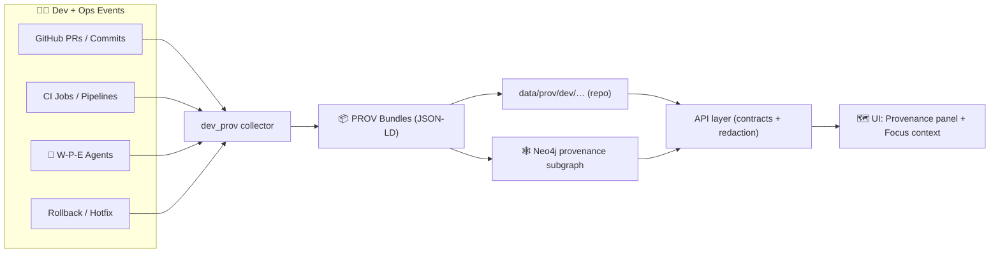

# dev_prov — Developer Provenance (MCP) 🧬🧾


> **One idea:** treat *development* like *data*. Every PR, pipeline run, automated agent action, and rollback becomes **structured provenance** you can query, audit, and surface in the UI—right next to STAC/DCAT/PROV dataset lineage.  
> This aligns with KFM’s “contract-first” and “deterministic pipeline” invariants. :contentReference[oaicite:0]{index=0}

---

## 📌 What this module is

`mcp/dev_prov/` is the **Developer Provenance** module inside the **Master Coder Protocol (MCP)** layer.

It standardizes how Kansas Frontier Matrix (KFM) captures and publishes **development operations lineage**, so we can answer questions like:

- “Which PR changed this dataset’s schema and when?”
- “What validation gates ran for the last deployment?”
- “Which automated agent opened this PR, and what watcher event triggered it?”
- “If we rolled back, what changed and what did we repair?”

This module is explicitly aligned with:
- **Policy gates** (fail-closed) and citation requirements:contentReference[oaicite:1]{index=1}
- **Watcher–Planner–Executor (W-P-E)** automation with immutable event records:contentReference[oaicite:2]{index=2}
- **PR → PROV graph integration** and CI lineage/audit trail patterns:contentReference[oaicite:3]{index=3}
- **Provenance-first ingestion** (immutability + deterministic ETL):contentReference[oaicite:4]{index=4}

---

## 🧠 Why dev_prov exists (the “KFM invariant” version)

KFM’s v13 pipeline treats **STAC + DCAT + PROV** as required “boundary artifacts” before anything is considered published. :contentReference[oaicite:5]{index=5}

`dev_prov` extends that mindset to the codebase and ops lifecycle:

- **Git history is necessary but not sufficient.**  
  We need **semantic, queryable lineage** that links code + data + validation + deployment.
- **Automation must be transparent.**  
  W-P-E agents can propose and execute changes, but every step must be attributable and auditable.:contentReference[oaicite:6]{index=6}
- **Every deployment needs an audit trail.**  
  “Detect → Validate → Promote” is designed to reduce regressions and preserve evidence of what checks ran. :contentReference[oaicite:7]{index=7}

---

## 🧱 Architecture at a glance



> **Key connection:** the core KFM pipeline already ends with PROV bundles feeding graph → API → UI. dev_prov simply adds **developer/ops provenance** into the same mental model. :contentReference[oaicite:8]{index=8}

---

## 🧾 Provenance model (PROV-O mapping)

KFM already uses **W3C PROV-O** for data lineage. dev_prov uses the same ontology to represent *development*:

| Concept | PROV-O type | Examples |
|---|---|---|
| Pull Request | `prov:Activity` | opened, reviewed, merged |
| Commit / diff | `prov:Entity` | SHA, patchset, tree hash |
| CI workflow run | `prov:Activity` | job graph, run UUID |
| Build artifacts | `prov:Entity` | container image digest, SBOM, schema bundle |
| Release / deploy | `prov:Activity` | environment, deployment window |
| Human contributor | `prov:Agent` | GitHub user, maintainer |
| Automation agent | `prov:SoftwareAgent` | Watcher/Planner/Executor |

**Canonical edges to use:**
- `prov:used` (activity used entity)
- `prov:wasGeneratedBy` (entity generated by activity)
- `prov:wasAssociatedWith` (activity associated with agent)
- `prov:wasDerivedFrom` (entity derived from entity)

> This directly supports the “GitHub PR → PROV Graph Integration” direction. :contentReference[oaicite:9]{index=9}

---

## 📁 Suggested directory layout (v13-friendly) 🗂️

```text
📦 mcp/
  └─ 🧬 dev_prov/
     ├─ README.md
     ├─ 📁 schemas/              # JSON Schema for dev_prov bundles (PROV profile extensions)
     ├─ 📁 templates/            # PR templates + experiment protocol templates (MCP style)
     ├─ 📁 policies/             # Conftest/OPA rules specific to dev provenance
     ├─ 📁 examples/             # Sample bundles (PR, CI run, rollback)
     └─ 📁 scripts/              # Capture/export helpers (webhook, CI emitter, graph loader)
```

> Directory consistency matters because KFM’s “boundary artifacts” must land in canonical locations (including PROV lineage). :contentReference[oaicite:10]{index=10}

---

## 🔁 Core workflows

### 1) PR → PROV bundle ✅

**Goal:** every merged PR produces a dev provenance bundle that can be ingested into Neo4j and traced to changes in `data/…` and `docs/…`.

**Minimum fields (recommended):**
- PR number, repo, base/head, labels
- merge commit SHA
- reviewers + approvals
- linked issues
- affected paths (high level)
- policy gate summary (pass/fail + versions)

> The v13 proposal explicitly connects PR mapping + audit trail + deployment evidence. :contentReference[oaicite:11]{index=11}

---

### 2) CI run lineage (OpenLineage ↔ PROV) 🧪

In the “Detect → Validate → Promote” workflow concept:
- CI detects changes, validates via policy + lane validators, then opens a promotion PR.
- CI emits **OpenLineage events** with a stable run UUID so each execution is queryable/auditable. :contentReference[oaicite:12]{index=12}

**dev_prov stance:**
- We store a PROV bundle that references:
  - the OpenLineage run UUID
  - the exact gate versions (schemas, policies)
  - outputs produced (SBOM, schema checks, provenance checks, artifacts)

---

### 3) Rollback & provenance repair 🧯

When rollback occurs, dev_prov records:
- the triggering incident / watcher event
- the rollback activity (what was reverted, to which known-good version)
- validation evidence (what ran post-rollback)
- any “provenance repair” steps (e.g., re-linking broken references)

> Rollback/repair is explicitly called out as part of the hardening mindset (avoid regressions; keep audit trail). 

---

### 4) W-P-E agent actions are first-class provenance 🤖

KFM’s W-P-E design requires:
- Watcher creates an immutable, signed event record
- Planner produces a proposed solution (often a PR)
- Executor opens PR and ensures policy gates apply equally to agents and humans:contentReference[oaicite:14]{index=14}

dev_prov provides:
- a consistent PROV representation for watcher events + planner proposals + executor actions
- stable linking between the triggering event and downstream PR(s)

---

## ✅ Policy gates & CI integration (Conftest / OPA)

KFM uses automated policy gates that check:
- schema validation
- STAC/DCAT/PROV completeness
- license presence
- sensitivity classification handling
- provenance completeness
- **Focus Mode must cite sources** (refuse without sources):contentReference[oaicite:15]{index=15}

`dev_prov` adds (recommended) gates like:

- **No merge without a dev_prov bundle**
- **Any PR touching `data/processed/` must also update STAC/DCAT/PROV artifacts**
- **Any agent-authored PR must link watcher event + include execution evidence**
- **Policy changes require governance review** (root governance + ethics + sovereignty)

Example (illustrative) Rego idea:

```rego
package kfm.dev_prov

deny[msg] {
  input.github.pull_request.merged == true
  not input.dev_prov.bundle.present
  msg := "Merged PR is missing dev_prov provenance bundle (data/prov/dev/...)"
}

deny[msg] {
  some p
  p := input.changed_paths[_]
  startswith(p, "data/processed/")
  not input.datasets.prov_updated
  msg := "PR modifies data/processed/ but does not update dataset PROV artifacts"
}
```

---

## 🧭 UI + Focus Mode integration

KFM’s UI and AI layers are built around **traceability**:

- UI emphasizes linking visual layers to sources and context
- Focus Mode is designed to answer with **citations** and provenance-linked context (and refuse if it can’t cite):contentReference[oaicite:17]{index=17}

dev_prov contributes by enabling UI features like:
- “What code version generated this layer?” (commit/PR link)
- “Show validation history” (CI gates, run UUIDs)
- “Show agent involvement” (watcher event → planner → executor trail)

---

## 🧪 MCP discipline: scientific method + experiment traceability

MCP expects investigation and engineering to follow the scientific method:
- define question, background research, hypothesis
- design protocol, collect data, analyze, log results
- keep everything traceable via experiment IDs/timestamps:contentReference[oaicite:18]{index=18}

**dev_prov recommendation:** every meaningful PR should carry a lightweight “experiment protocol” footprint:
- **Hypothesis:** what should improve?
- **Method:** what changed + how validated?
- **Results:** links to benchmarks, graphs, or test artifacts
- **Conclusion:** outcome vs hypothesis

This keeps engineering aligned with reproducibility and electronic-lab-notebook style rigor. :contentReference[oaicite:19]{index=19}

---

## ✅ Definition of Done (dev_prov contributions) 🧷

When you add or change anything in `mcp/dev_prov/`, you should be able to check:

- [ ] Front-matter / metadata (if used) is complete and valid
- [ ] Claims are linked to datasets / schemas / references (where applicable)
- [ ] Validation steps are listed and repeatable
- [ ] Governance / FAIR+CARE / sovereignty considerations are stated (as applicable):contentReference[oaicite:20]{index=20}
- [ ] Examples exist for any new schema fields (happy-path + failure cases)
- [ ] CI policies updated (and “fail closed” behavior preserved):contentReference[oaicite:21]{index=21}

---

## 🧩 SOP format (MCP-friendly) 📋

When you add a new dev_prov SOP, follow the MCP-style structure:

- **Purpose**
- **Prerequisites**
- **Procedure**
- **Expected Outcome**
- **Troubleshooting / Notes**:contentReference[oaicite:22]{index=22}

This keeps contributor workflows consistent (especially for complex tasks like “deploy”, “add a map layer”, “repair provenance”). :contentReference[oaicite:23]{index=23}

---

## 📚 Project source documents used (design inputs)

> KFM is documentation-driven; these are the current “inputs” for dev_prov.

### Core KFM architecture + governance
- **Kansas Frontier Matrix (KFM) – Comprehensive Architecture, Features, and Design** :contentReference[oaicite:24]{index=24}  
- **Kansas Frontier Matrix (KFM) – Comprehensive Technical Documentation** :contentReference[oaicite:25]{index=25}  
- **Kansas Frontier Matrix Design Audit – Gaps and Enhancement Opportunities** :contentReference[oaicite:26]{index=26}  
- **Kansas-Frontier-Matrix: Open-Source Geospatial Historical Mapping Hub Design** :contentReference[oaicite:27]{index=27}  

### AI + UI layers (citations + provenance surfacing)
- **Kansas Frontier Matrix (KFM) – AI System Overview 🧭🤖** :contentReference[oaicite:28]{index=28}  
- **Kansas Frontier Matrix – Comprehensive UI System Overview** :contentReference[oaicite:29]{index=29}  

### Intake + provenance enforcement (pipeline invariants)
- **📚 Kansas Frontier Matrix (KFM) Data Intake – Technical & Design Guide** :contentReference[oaicite:30]{index=30}  

### Roadmap + devops provenance direction
- **🌟 Kansas Frontier Matrix – Latest Ideas & Future Proposals** :contentReference[oaicite:31]{index=31}  

### MCP process discipline
- **Scientific Method _ Research _ Master Coder Protocol Documentation** :contentReference[oaicite:32]{index=32}  

### Future concept expansion (where dev_prov must scale)
- **Innovative Concepts to Evolve the Kansas Frontier Matrix (KFM)** :contentReference[oaicite:33]{index=33}  

### Repository doc standards
- **MARKDOWN_GUIDE_v13 / Master Guide v13 references** :contentReference[oaicite:34]{index=34}  

---

## 📦 PDF “portfolio” libraries (how to use them) 🧰

Several project PDFs are **PDF Portfolios** (containers of embedded docs) and won’t render as normal text in some parsers.

To list/extract embedded docs locally:

```bash
# list embedded files
pdfdetach -list "Various programming langurages & resources 1.pdf"

# extract everything into a folder
mkdir -p docs/_refs/extracted
pdfdetach -saveall -o docs/_refs/extracted "Various programming langurages & resources 1.pdf"
```

Portfolios included in the project bundle:
- `AI Concepts & more.pdf`
- `Data Managment-Theories-Architures-Data Science-Baysian Methods-Some Programming Ideas.pdf`
- `Maps-GoogleMaps-VirtualWorlds-Archaeological-Computer Graphics-Geospatial-webgl.pdf`
- `Various programming langurages & resources 1.pdf`

---

## 🗣️ Glossary (mini)

- **Boundary artifacts:** required artifacts that allow safe stage-to-stage transitions (e.g., STAC/DCAT/PROV).:contentReference[oaicite:35]{index=35}
- **Fail closed:** if policy/validation fails, the change is blocked from publication.:contentReference[oaicite:36]{index=36}
- **W-P-E:** Watcher observes + records → Planner proposes → Executor acts via PR with evidence.:contentReference[oaicite:37]{index=37}
- **dev_prov:** PROV representation of development & operations actions (PRs, CI, deployments, rollbacks).

---

## 🧭 Next implementation targets (recommended)

1) **Schema**: define a KFM Dev PROV profile extension (fields for PR/CI, agent identity, attestations).  
2) **Collector**: GitHub webhook or CI step that writes PROV bundles to `data/prov/dev/…`.  
3) **Graph loader**: ingest dev provenance into Neo4j alongside dataset provenance.  
4) **Policy pack**: add Conftest rules that require dev_prov bundles and enforce cross-links.  
5) **UI panel**: “Development Provenance” tab beside dataset provenance + story provenance.

---

> 🧩 Reminder: KFM’s north star is **traceability from raw evidence → processed outputs → graph → UI narrative**. dev_prov makes sure *code and ops* are held to the same standard. :contentReference[oaicite:38]{index=38}
