<!-- Minimal Triplet Contract README (KFM/MCP dev_prov quickstart) -->

---
title: "00 Quickstart — Minimal Triplet Input Contract (STAC + DCAT + PROV)"
path: "mcp/dev_prov/examples/00_quickstart_minimal_triplet/input/contract/README.md"
status: "active"
contract_version: "0.1.0"
last_updated: "2026-01-21"
owner: "Kansas Frontier Matrix (KFM)"
tags:
  - mcp
  - dev_prov
  - contract
  - provenance
  - stac
  - dcat
  - prov
---

# 🧾 Minimal Triplet Input Contract (STAC ✚ DCAT ✚ PROV)


This folder defines the **minimum “evidence triplet”** required to feed the `dev_prov` pipeline in the `00_quickstart_minimal_triplet` example:
- 🛰️ **STAC Item** → spatial/temporal indexing + asset pointers  
- 🗂️ **DCAT Dataset** → catalog + governance metadata  
- 🧬 **PROV Bundle** → lineage (who/what/when/how)

> [!IMPORTANT]
> In KFM, anything that appears in the **UI**, **APIs**, or **Focus Mode** must be **traceable to cataloged sources** and **provable processing**. This contract is the smallest “do-not-break” surface area that keeps that promise.

---

## 🎯 Contract Goals

✅ **Minimal** (quickstart friendly)  
✅ **Machine-checkable** (schema + policy gates)  
✅ **Provenance-first** (lineage is not optional)  
✅ **UI/AI-ready** (timeline + map + citations work immediately)

---

## 🧩 What “Minimal Triplet” Means

A compliant input package provides **three metadata artifacts** that agree on identity and references:

1) **STAC Item** (`.json`)  
2) **DCAT Dataset** (`.jsonld`)  
3) **PROV Bundle** (`.jsonld`)

These are **not three different descriptions of random things**—they are three synchronized views of the *same dataset artifact* and its production.

---

## 🗺️ Suggested Folder Layout

This README lives in `input/contract/` because it is the **normative specification**.  
A typical quickstart package places the triplet next to it:

```text
mcp/dev_prov/examples/00_quickstart_minimal_triplet/
└─ input/
   ├─ contract/                  🧾 (you are here)
   │  └─ README.md
   └─ triplet/                   📦 (example input artifacts)
      ├─ stac.item.json
      ├─ dcat.dataset.jsonld
      └─ prov.bundle.jsonld
```

> [!NOTE]
> Your repo may choose a different concrete path; the important part is that these three artifacts exist and cross-link consistently.

---

## 🔗 Identity & Cross-Linking Rules

To keep the triplet coherent, define a stable dataset identifier and use it everywhere.

### ✅ Required identifiers

Pick one strategy and stick to it:

- **URN style**: `urn:kfm:dataset:<domain>:<name>:<version>`
- **URL style**: `https://<host>/datasets/<id>`

### ✅ Contract invariants (MUST)

- The **STAC Item** MUST include a dataset identifier (recommended: `properties["kfm:dataset_id"]`)
- The **DCAT Dataset** MUST include the same identifier (recommended: `dct:identifier`)
- The **PROV Bundle** MUST include an entity for that dataset identifier and link it to an activity

### ✅ Contract invariants (SHOULD)

- Each artifact SHOULD reference the other two (directly or via shared IDs)
- Assets referenced by STAC SHOULD be resolvable (local paths or fetchable URLs/OCI refs)

---

## 🧭 Relationship Diagram

```mermaid
flowchart LR
  A[🛰️ STAC Item] <-- shared dataset_id --> B[🗂️ DCAT Dataset]
  B -->|prov:wasGeneratedBy| C[🧬 PROV Activity]
  C -->|prov:generated| A
  C -->|prov:generated| B
```



---

## 📄 Required Artifacts

### 1) 🛰️ STAC Item (`stac.item.json`)

**Why it exists:** powers spatial search, map layer plumbing, and time sliders.

**Minimum expectations (MUST):**
- `type: "Feature"`
- `stac_version`
- `id`
- `geometry` + `bbox`
- `properties.datetime` (or start/end time fields)
- `assets` (can be empty but strongly recommended to include at least one asset)

**KFM extensions (recommended):**
- `properties["kfm:dataset_id"]`
- `properties["kfm:classification"]` (e.g., `public|sensitive|restricted`)
- `properties["kfm:prov_ref"]` (points to PROV activity/entity id)

<details>
<summary>🧪 Minimal STAC Item example</summary>

```json
{
  "type": "Feature",
  "stac_version": "1.0.0",
  "id": "kfm-minimal-triplet-item-001",
  "bbox": [-97.0, 38.0, -96.0, 39.0],
  "geometry": {
    "type": "Polygon",
    "coordinates": [[
      [-97.0, 38.0], [-96.0, 38.0], [-96.0, 39.0], [-97.0, 39.0], [-97.0, 38.0]
    ]]
  },
  "properties": {
    "datetime": "2026-01-21T00:00:00Z",
    "kfm:dataset_id": "urn:kfm:dataset:demo:minimal_triplet:v1",
    "kfm:classification": "public",
    "kfm:prov_ref": "urn:kfm:prov:activity:demo:minimal_triplet:v1:run-0001"
  },
  "assets": {
    "data": {
      "href": "data/demo/minimal_triplet_v1.geojson",
      "type": "application/geo+json",
      "roles": ["data"]
    }
  }
}
```
</details>

---

### 2) 🗂️ DCAT Dataset (`dcat.dataset.jsonld`)

**Why it exists:** catalog + governance + distribution. This is how you answer:
- What is this dataset?
- Who publishes it?
- What is the license?
- How do I obtain it?

**Minimum expectations (MUST):**
- JSON-LD with `@context`
- `@id` (stable dataset ID)
- `@type` includes `dcat:Dataset`
- `dct:title`
- `dct:description`
- `dct:license` (SPDX string or URL)
- at least one `dcat:distribution`

**KFM extensions (recommended):**
- `kfm:classification`
- `prov:wasGeneratedBy` (link to PROV activity)
- Distribution can include `https://`, `s3://`, or `oci://` references (if using artifact registries)

<details>
<summary>🧪 Minimal DCAT Dataset example</summary>

```json
{
  "@context": {
    "dcat": "http://www.w3.org/ns/dcat#",
    "dct": "http://purl.org/dc/terms/",
    "prov": "http://www.w3.org/ns/prov#",
    "kfm": "urn:kfm:terms:"
  },
  "@id": "urn:kfm:dataset:demo:minimal_triplet:v1",
  "@type": "dcat:Dataset",
  "dct:title": "Demo — Minimal Triplet Dataset (v1)",
  "dct:description": "A tiny dataset used to demonstrate the STAC+DCAT+PROV contract.",
  "dct:license": "CC-BY-4.0",
  "kfm:classification": "public",
  "prov:wasGeneratedBy": { "@id": "urn:kfm:prov:activity:demo:minimal_triplet:v1:run-0001" },
  "dcat:distribution": [
    {
      "@type": "dcat:Distribution",
      "dct:format": "GeoJSON",
      "dcat:downloadURL": "data/demo/minimal_triplet_v1.geojson"
    }
  ]
}
```
</details>

---

### 3) 🧬 PROV Bundle (`prov.bundle.jsonld`)

**Why it exists:** makes the dataset *defensible*. This is how you answer:
- What inputs were used?
- What pipeline produced this output?
- Which code version/config?
- When did it run?

**Minimum expectations (MUST):**
- JSON-LD with PROV context
- `prov:Activity` with:
  - start/end timestamps (or at least a time)
  - an association to an agent (human, CI, service)
  - `prov:used` inputs (even if “source was remote”)
  - `prov:generated` the dataset artifact (and optionally STAC/DCAT as derived records)

**KFM extensions (recommended):**
- `kfm:run_id`, `kfm:code_ref` (git SHA/tag), `kfm:policy_pack_version`
- digests/checksums for outputs (sha256), especially if artifacts are stored content-addressably

<details>
<summary>🧪 Minimal PROV bundle example</summary>

```json
{
  "@context": {
    "prov": "http://www.w3.org/ns/prov#",
    "xsd": "http://www.w3.org/2001/XMLSchema#",
    "kfm": "urn:kfm:terms:"
  },
  "@id": "urn:kfm:prov:bundle:demo:minimal_triplet:v1:run-0001",
  "@type": "prov:Bundle",
  "prov:activity": {
    "urn:kfm:prov:activity:demo:minimal_triplet:v1:run-0001": {
      "@type": "prov:Activity",
      "prov:startedAtTime": "2026-01-21T00:00:00Z",
      "prov:endedAtTime": "2026-01-21T00:00:01Z",
      "kfm:run_id": "run-0001",
      "kfm:code_ref": "git:HEAD",
      "prov:wasAssociatedWith": { "@id": "urn:kfm:prov:agent:ci" },
      "prov:used": [
        { "@id": "urn:kfm:input:demo:seed" }
      ],
      "prov:generated": [
        { "@id": "urn:kfm:dataset:demo:minimal_triplet:v1" }
      ]
    }
  },
  "prov:agent": {
    "urn:kfm:prov:agent:ci": {
      "@type": "prov:SoftwareAgent",
      "prov:label": "CI Runner"
    }
  },
  "prov:entity": {
    "urn:kfm:dataset:demo:minimal_triplet:v1": {
      "@type": "prov:Entity",
      "prov:label": "Demo — Minimal Triplet Dataset (v1)",
      "kfm:classification": "public"
    },
    "urn:kfm:input:demo:seed": {
      "@type": "prov:Entity",
      "prov:label": "Seed input (quickstart)",
      "prov:type": "kfm:Input"
    }
  }
}
```
</details>

---

## 🛡️ Policy Gates & Validation

> [!TIP]
> Treat metadata like code: validate early, validate often.

### ✅ Minimum checks (recommended)

- **Schema validation**: STAC/DCAT/PROV JSON structure is valid
- **Triplet completeness**: all three artifacts exist
- **Cross-link consistency**: dataset_id aligns across the three
- **License present**: DCAT includes license (and optionally STAC too)
- **Sensitivity/classification**: required when policy pack mandates it
- **Provenance completeness**: PROV has inputs + activity + agent

### 🔒 Fail-closed mindset

If a check can’t be evaluated (missing file / missing required field), assume **failure** (gate closed). This keeps the quickstart aligned with KFM’s governance posture.

---

## 🧠 Why this matters for UI + Focus Mode

- The **map UI** relies on STAC geometry/time for spatial and temporal exploration.
- The **catalog UI** relies on DCAT for discoverability + licensing.
- **Focus Mode** relies on all of the above to generate answers with citations and to refuse when provenance is missing.

---

## 🧰 Extension Points (Optional, but KFM-aligned)

If you want to go beyond quickstart while staying contract-compatible:

### 📦 OCI / content-addressable artifacts (optional)
- Add an OCI distribution entry under DCAT and/or a STAC asset `href` using `oci://…`
- Include digests + signatures in metadata to support integrity checks

### 🧾 Evidence manifests (optional)
For narrative outputs (Story Nodes, Pulse Threads), generate a small “evidence manifest” that enumerates every referenced dataset/query/asset, and tie it into PROV.

### 🛰️ Real-time feeds (optional)
Watcher pipelines can emit STAC items per measurement/event (e.g., stream updates). The same triplet pattern still applies: **catalog + provenance + governance**.

---

## ✅ Definition of Done (DoD) Checklist

- [ ] `stac.item.json` exists and validates
- [ ] `dcat.dataset.jsonld` exists and validates
- [ ] `prov.bundle.jsonld` exists and validates
- [ ] All three agree on `dataset_id`
- [ ] DCAT includes license
- [ ] PROV includes (Activity + Agent + used inputs + generated outputs)
- [ ] Sensitivity/classification included if required
- [ ] No secrets in metadata (tokens/keys/etc.)

---

## 📚 Project Docs That Informed This Contract (Snapshot)

<details>
<summary>Click to expand 📖</summary>

### Core KFM design & operations
- 📘 **KFM Data Intake — Technical & Design Guide** (evidence triplet, pipeline order, provenance-first intake)
- 🧭 **KFM AI System Overview** (Focus Mode citation + refusal behavior, policy gates for AI outputs)
- 🧩 **KFM Comprehensive UI System Overview** (UI governance boundaries, map + time experience)
- 🏗️ **KFM Comprehensive Architecture, Features, and Design** (FAIR/CARE, policy packs, STAC/DCAT/PROV as platform backbone)
- 🛠️ **KFM Comprehensive Technical Documentation** (contract-first, no “mystery layers”, clean boundaries)

### Innovation & roadmap
- 💡 **Innovative Concepts to Evolve KFM** (ethical governance, sensitivity filters, future-facing experiences)
- 🌟 **Latest Ideas & Future Proposals** (real-time watchers/feeds + continuous cataloging ideas)
- 🧪 **Additional Project Ideas** (evidence manifests, OCI artifact distribution, policy-as-code gates, Pulse Threads)

### Reference bundles (PDF portfolios)
> [!NOTE]
> These are PDF portfolios. To access embedded references, open them in Acrobat/Reader.

- 🤖 **AI Concepts & more** (AI/ML reference library)
- 🌍 **Maps / Google Maps / Virtual Worlds / Archaeological CG / Geospatial WebGL** (visualization + geo compute reference library)
- 🧑‍💻 **Various programming languages & resources** (engineering references)
- 🗃️ **Data Management — theories/architectures/data science/Bayesian methods** (data/metadata lineage references)

</details>

---

## 🧭 Next Steps

- Implement JSON Schemas for each artifact (optional but recommended)
- Add policy tests (OPA/Conftest) that enforce this contract in CI
- Expand from “minimal” to “domain profile” (KFM-specific STAC/DCAT extensions)


