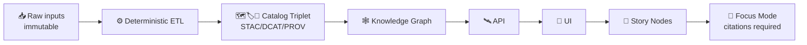

# 📦 Manifest Output — Minimal Triplet (STAC + DCAT + PROV)


-d9480f)


> [!IMPORTANT]
> This folder is **generated output** from the minimal triplet quickstart. Treat it as **read-only**.  
> If something looks wrong, fix the **inputs** or the **generator**, then regenerate.

---

## 🧭 What this folder is

This directory contains a **manifest** that ties together the KFM “minimal triplet”:

- 🗺️ **STAC** → spatiotemporal assets (what/where/when + asset links)
- 🏷️ **DCAT** → dataset catalog metadata (discovery/portals/metadata harvesting)
- 🧬 **PROV** → lineage & reproducibility (how it was produced, from what)

The **manifest** is the glue that makes the triplet:
- easy to consume programmatically,
- easy to validate in CI,
- easy to surface in the UI (“map behind the map”),
- and safe to trust (hashes + policy gates + optional signing).

---

## ✅ Start here

1. Open the **manifest file** in this folder (typically `manifest.json` or `manifest.yaml`).
2. Follow its pointers to:
   - the STAC Item/Collection,
   - the DCAT Dataset record,
   - and the PROV bundle.
3. Verify integrity (checksums / signatures), then ingest into graph/API/UI.

> [!TIP]
> If filenames differ from the examples below, **trust the manifest** as the source of truth.  
> The manifest should be the *only* thing you need to locate the rest.

---

## 📁 Typical generated layout

> The exact tree can vary by generator version, but the pattern stays consistent.

```text
📁 out/
  📁 manifest/               👈 you are here
    🧾 manifest.json         (index + hashes + pointers)
    🔐 checksums.sha256      (optional but recommended)
    📘 README.md             (this file)
  📁 stac/
    🗺️ collection.json
    📍 item.json
  📁 dcat/
    🏷️ dataset.jsonld        (or .ttl / .rdf)
  📁 prov/
    🧬 run.prov.jsonld       (or similar)
  📁 artifacts/
    📦 … data products …     (pmtiles / geoparquet / cog / csv / etc.)
```

---

## 🧾 What the manifest should contain

At minimum, the manifest should answer these questions:

### 1) Identity
- **What is this run/output?**
- **When was it created?**
- **What version of the generator produced it?**

### 2) Inputs & outputs
- **Which raw inputs were used?** (URLs, file IDs, digests)
- **Which outputs were produced?** (files, digests, media types)

### 3) Triplet pointers
- Where are the **STAC/DCAT/PROV** artifacts for this output?

### 4) Integrity & governance hooks
- **SHA-256** (or multihash) for every important artifact
- optional **signing/verifications** for supply-chain integrity
- metadata for **license** and **classification/sensitivity** gates

---

## 🧩 Example manifest shape (informative)

> This is a *shape guide* to communicate intent — treat the project’s generator/schema as canonical.

```json
{
  "manifest_version": "0.1",
  "kind": "kfm.triplet_manifest",
  "run_id": "RUN-2026-01-21T00:00:00Z-EXAMPLE",
  "created_at": "2026-01-21T00:00:00Z",

  "triplet": {
    "stac": { "href": "../stac/item.json", "media_type": "application/json", "sha256": "…" },
    "dcat": { "href": "../dcat/dataset.jsonld", "media_type": "application/ld+json", "sha256": "…" },
    "prov": { "href": "../prov/run.prov.jsonld", "media_type": "application/ld+json", "sha256": "…" }
  },

  "inputs": [
    { "uri": "…", "media_type": "…", "sha256": "…", "license": "…" }
  ],

  "outputs": [
    { "href": "../artifacts/output.pmtiles", "media_type": "application/vnd.pmtiles", "sha256": "…" }
  ],

  "governance": {
    "classification": "public",
    "policy_pack": "…",
    "notes": "…"
  },

  "integrity": {
    "canonical_digest": "sha256:…",
    "checksums_file": "checksums.sha256",
    "signatures": [
      { "type": "sigstore/cosign", "ref": "…", "verified": false }
    ]
  }
}
```

---

## 🔍 Validation checklist

### Integrity (fast, local)
- ✅ Every referenced file exists
- ✅ Every referenced file has a **sha256** (or equivalent)
- ✅ `checksums.sha256` (if present) matches the bytes on disk

### Schema / metadata
- ✅ STAC validates against STAC JSON schema (Item/Collection)
- ✅ DCAT record is well-formed (JSON-LD/Turtle/etc.)
- ✅ PROV bundle is well-formed (JSON-LD PROV-O or equivalent)

### Governance / “fail closed”
- ✅ license present + allowed
- ✅ classification/sensitivity is consistent (inputs → outputs)
- ✅ no bypass: anything exposed to UI/API must be cataloged + traceable
- ✅ any human-facing narrative/AI output must carry citations (policy-gated)

---

## 🔐 Optional: OCI artifact distribution + signing

For large artifacts (PMTiles, GeoParquet, COGs), KFM can store outputs in an **OCI registry** and reference them by **immutable digest**.

### Why this matters
- 🔁 **Reproducible fetch** by digest (bit-for-bit repeatability)
- 🧾 **Auditability** (what was produced is pinned)
- 🛡️ **Supply-chain security** when paired with signatures & attestations

### Typical flow (placeholders)
```bash
# Pull by digest for perfect reproducibility
oras pull ghcr.io/<org>/<repo>@sha256:<digest> --output ./out/artifacts

# Verify signatures (example)
cosign verify ghcr.io/<org>/<repo>@sha256:<digest>
```

---

## 🧠 How KFM consumes this (end-to-end)



- The **graph** uses the triplet + manifest to build traceable nodes/edges.
- The **API/UI** can only surface layers/datasets that have metadata + provenance.
- **Focus Mode** uses catalog + provenance to cite sources (or refuse when it can’t).

---

## 🧰 Extending beyond the “minimal triplet”

Once the minimal triplet works, the same manifest pattern scales to:

- 🧊 Dual-format “analytics + visualization” packs (e.g., **GeoParquet + PMTiles**)
- ⏱️ Streaming/real-time pipelines (still need stub provenance + catalog entries)
- 🧪 Simulation outputs & scenario runs (run manifests + PROV + audits)
- 📦 Offline data packs (field use / classroom kits)
- 🧾 Evidence manifests attached to Story Nodes (machine-readable citations)

---

## 🧾 Glossary

- **Triplet**: the 3 canonical metadata artifacts (STAC, DCAT, PROV)
- **Run manifest**: structured record of an automated pipeline run (inputs/outputs/env)
- **Evidence manifest**: compact machine-readable source list for narratives/stories
- **Canonical digest**: stable hash of canonicalized JSON (supports idempotency)
- **Fail closed**: if required metadata/provenance is missing → pipeline/CI rejects it

---

## 📚 Project docs that shaped this manifest

> Collapsed so this README stays focused, but the design is grounded in the project’s full documentation set.

<details>
<summary><strong>📖 Core KFM docs</strong></summary>

- Kansas Frontier Matrix (KFM) – Comprehensive Technical Documentation
- Kansas Frontier Matrix (KFM) – Comprehensive Architecture, Features, and Design
- Kansas Frontier Matrix (KFM) – AI System Overview 🧭🤖
- Kansas Frontier Matrix – Comprehensive UI System Overview
- 📚 Kansas Frontier Matrix (KFM) Data Intake – Technical & Design Guide
- 🌟 Kansas Frontier Matrix – Latest Ideas & Future Proposals
- Innovative Concepts to Evolve the Kansas Frontier Matrix (KFM)
- Additional Project Ideas

</details>

<details>
<summary><strong>🧠🗺️ Reference packs (PDF portfolios)</strong></summary>

These are large “library packs” that support implementation choices (ETL, geospatial rendering, data science, architecture, etc.):

- AI Concepts & more
- Maps / Google Maps / Virtual Worlds / Archaeology / Computer Graphics / Geospatial WebGL
- Various programming languages & resources
- Data Management / Architectures / Data Science / Bayesian Methods / Programming Ideas

</details>

---

## 🧾 Notes for contributors

- ✅ If you add an artifact, **add it to the manifest** (and checksum it).
- ✅ If you add a dataset/story, **ensure citations are present**.
- ✅ If you change data bytes, **regenerate provenance** (no manual edits).
- ✅ If you’re unsure, start with **minimal triplet** and expand step-by-step.

🧭 Back to example root: `mcp/dev_prov/examples/00_quickstart_minimal_triplet/`
