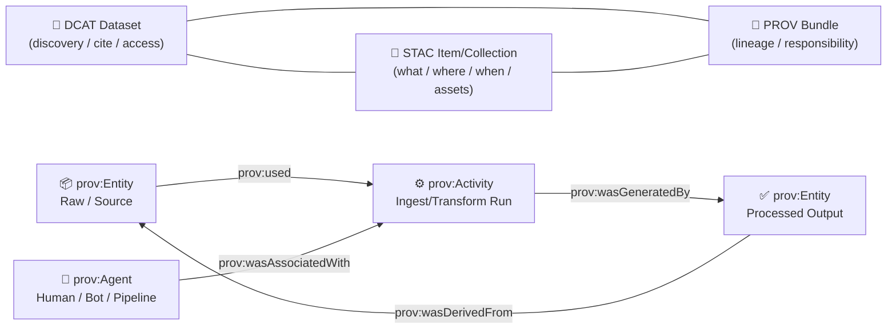

# 🧾 PROV Output — Minimal Triplet Quickstart (✅ Evidence Lineage)


> [!IMPORTANT]
> This folder is the **PROV leg** of the **minimal triplet** output: **STAC + DCAT + PROV**.  
> If STAC answers **“what/where/when?”** and DCAT answers **“who/how to cite/access?”**, PROV answers **“how did we get here?”** 🧭

---

## 📦 What’s in this folder?

This directory contains the provenance artifact(s) produced by:

- `mcp/dev_prov/examples/00_quickstart_minimal_triplet/…`
- Output location: `out/prov/` (👈 you are here)

You should see one or more files such as:

- `*.jsonld` (PROV-O / JSON-LD), and/or
- `*.json` (PROV-JSON), and optionally
- `*.md` or `*.svg` (human-readable visualization / notes)

> [!TIP]
> If you’re browsing this in GitHub, open the PROV file and search for:
> - `prov:Entity`
> - `prov:Activity`
> - `prov:Agent`
> - `prov:used` / `prov:wasGeneratedBy` / `prov:wasDerivedFrom`

---

## 🧩 Why PROV exists in the “triplet” 🧠

KFM’s intake + publishing approach treats metadata as **contract artifacts**:

- **STAC** 📍 spatiotemporal + asset pointers (items/collections)
- **DCAT** 🪪 discovery + access + licensing + publisher + citation
- **PROV** 🔗 lineage (inputs → processing → outputs) + responsibility

Together, they form an **evidence-first publishing** boundary: data isn’t considered “fully publishable” until all three exist.

---

## 🧠 Provenance model (in 60 seconds)

### 🧱 Core objects

| PROV concept | What it represents | Typical examples in KFM |
|---|---|---|
| **Entity** (`prov:Entity`) | “A thing” (data, file, dataset, output) | raw source file, processed parquet, generated tileset |
| **Activity** (`prov:Activity`) | “A process” that used entities and produced entities | ingest run, ETL step, model run, export job |
| **Agent** (`prov:Agent`) | “Who/what” performed or was responsible | a human curator, CI bot, pipeline container, org/team |

### 🔗 Core relationships (the “why we trust it” links)

- `prov:used` → activity consumed input entities
- `prov:wasGeneratedBy` → output entity was produced by an activity
- `prov:wasDerivedFrom` → output entity derived from inputs
- `prov:wasAssociatedWith` → activity linked to an agent (human/bot/software)

---

## 🗺️ How PROV connects to STAC + DCAT (the “triplet wiring”)

In KFM-style metadata, cross-links are intentional:

- **DCAT** often links to:
  - dataset distributions (files/services)
  - the corresponding **STAC Collection**
  - the corresponding **PROV** lineage
- **STAC** items/collections often link to:
  - DCAT record (for discovery/citation)
  - PROV record (for lineage/auditing)

### 🔍 Visual map of the minimal triplet



---

## 🧪 Quick sanity-checks you can do (no special tooling)

> [!NOTE]
> This example is intentionally minimal — but it should still be *structurally honest*.

### ✅ Checklist

- [ ] There is at least **one output entity** (the thing you “published”).
- [ ] There is at least **one input entity** (the thing(s) you started from).
- [ ] There is at least **one activity** connecting inputs → outputs.
- [ ] There is at least **one agent** accountable for the activity.
- [ ] The output entity is `prov:wasDerivedFrom` the input entity/entities.
- [ ] The activity `prov:used` the input entity/entities.
- [ ] The output entity `prov:wasGeneratedBy` the activity.

---

## 🧷 Minimal patterns you’ll likely see

### Pattern A: PROV-JSON style (keys like `entity/activity/agent`)

```json
{
  "prefix": { "prov": "http://www.w3.org/ns/prov#" },
  "entity": {
    "kfm:raw/source.csv": { "prov:label": "Raw source" },
    "kfm:processed/output.parquet": { "prov:label": "Processed output" }
  },
  "activity": {
    "kfm:run/2026-01-21T00:00:00Z": { "prov:label": "Minimal ingest" }
  },
  "agent": {
    "kfm:agent/ci": { "prov:type": "prov:SoftwareAgent" }
  },
  "used": {
    "_:u1": {
      "prov:activity": "kfm:run/2026-01-21T00:00:00Z",
      "prov:entity": "kfm:raw/source.csv"
    }
  },
  "wasGeneratedBy": {
    "_:g1": {
      "prov:entity": "kfm:processed/output.parquet",
      "prov:activity": "kfm:run/2026-01-21T00:00:00Z"
    }
  }
}
```

### Pattern B: JSON-LD / PROV-O style (`@context`, `@id`, `@type`)

```json
{
  "@context": {
    "prov": "http://www.w3.org/ns/prov#",
    "kfm": "https://example.org/kfm#"
  },
  "@graph": [
    {
      "@id": "kfm:raw/source.csv",
      "@type": "prov:Entity",
      "prov:label": "Raw source"
    },
    {
      "@id": "kfm:run/minimal",
      "@type": "prov:Activity",
      "prov:label": "Minimal ingest"
    },
    {
      "@id": "kfm:processed/output.parquet",
      "@type": "prov:Entity",
      "prov:label": "Processed output",
      "prov:wasGeneratedBy": { "@id": "kfm:run/minimal" },
      "prov:wasDerivedFrom": [{ "@id": "kfm:raw/source.csv" }]
    }
  ]
}
```

> [!TIP]
> In production KFM, you typically extend this with:
> - checksums / content digests
> - script or container identifiers (git SHA, image digest)
> - run parameters
> - timestamps (`prov:startedAtTime`, `prov:endedAtTime`)
> - validation receipts / QA reports (as entities)

---

## 🔐 Evidence-first & “metadata as code” guardrails

In the broader KFM ecosystem, provenance isn’t “nice to have” — it’s a **gate**:

- PROV should make it possible to audit what happened.
- Pipelines aim for deterministic, replayable outputs.
- CI/policy checks can fail builds if metadata contracts are broken.

> [!CAUTION]
> Avoid hand-editing PROV output in real pipelines.
> If something changes in the processed artifacts, the provenance should change via the pipeline run, not via “manual patching”.

---

## 🧠 How the rest of the stack uses this PROV (why it matters)

Even a minimal PROV file enables richer downstream behavior:

- 🕸 **Graph ingestion:** create/attach lineage edges in Neo4j so datasets are traceable.
- 🧭 **Focus Mode & AI answers:** answers can cite the exact datasets/queries used (and should log provenance for dynamic queries).
- 🗺️ **UI trust signals:** users can drill down from a layer → to DCAT → to PROV → to raw sources.

---

## 🧱 Recommended next upgrades (when moving beyond “minimal”)

<details>
<summary>✨ Upgrade path: Minimal → Production-grade PROV</summary>

### 1) Add “immutable identity” for entities
- file digests (SHA256)
- stable dataset IDs
- URIs that don’t change between runs

### 2) Make Activities reproducible
- record pipeline version (git SHA)
- record container digest / environment
- record parameters (config snapshot)

### 3) Sign + store artifacts with verifiable provenance
- push artifacts to OCI registries (ORAS)
- sign them (Cosign)
- attach PROV as a referrer / attestation

### 4) Add health checks to prevent provenance drift
- periodic graph integrity checks
- detect orphan nodes / broken links
- track deltas and anomalies over time

</details>

---

## 🔗 Jump to the other two legs of the triplet

- 📍 STAC output: `../stac/`
- 🪪 DCAT output: `../dcat/`
- 🧪 Example root: `../../`

---

## 🧾 Glossary

- **Triplet**: STAC + DCAT + PROV published together as a single evidence bundle.
- **Lineage**: the “paper trail” from raw inputs to processed outputs.
- **Agent**: the accountable identity (human or software) behind an activity.
- **Evidence-first**: a policy stance that nothing is “real” in the platform until it is traceable.

---

### ✅ You’re done 🎉
If this PROV file is present and correctly links the entities/activities/agents, the minimal triplet example has successfully produced an auditable lineage record.

