# 🛰️ STAC Items (00_quickstart_minimal_triplet) 📦

[](#stac-items)
[](#triplet-wiring-stac--dcat--prov)
[](#triplet-wiring-stac--dcat--prov)
[](#why-this-folder-exists)
[](#governance--safety-notes)

> 📍 **You are here:** `mcp/dev_prov/examples/00_quickstart_minimal_triplet/out/stac/items/`

This folder contains **generated STAC Item JSON** records (one-per-asset or one-per-slice) that act as *machine-readable, geospatial “receipts”* for what got produced. In the KFM worldview, STAC Items are one of the **required “boundary artifacts”** that must exist before anything is considered publishable downstream (graph/API/UI).:contentReference[oaicite:0]{index=0}

---

## 🧭 What’s in this folder?

✅ **STAC Items**:
- Describe *what the asset is* (spatial footprint + time range)
- Point to *where the bits live* (assets like GeoParquet/COG/PMTiles/etc.)
- Link to *the dataset’s* **DCAT** record and **PROV** lineage (directly or indirectly)

> [!NOTE]
> In the **full KFM repo**, canonical catalog locations are typically under:
> - `data/stac/items/` (items) and `data/stac/collections/` (collections)  
> This quickstart mirrors that “shape” but writes into `out/…` for demo output.:contentReference[oaicite:2]{index=2}

---

## 🧠 Why this folder exists

KFM’s intake philosophy is **provenance-first**: *no dataset or layer is a black box*. Outputs should be traceable, reproducible, and auditable from the moment they exist.:contentReference[oaicite:3]{index=3}

And the UI/AI layers are designed to *surface* that traceability:
- UI: “every visualization is linked to its source data and metadata” and provenance is continuously surfaced:contentReference[oaicite:4]{index=4}:contentReference[oaicite:5]{index=5}
- Focus Mode: AI answers **always cite sources**, refuse/flag uncertainty, and can expose explainability/audit signals:contentReference[oaicite:6]{index=6}

STAC Items are the *granular glue* that makes this possible. 🧩

---

## 🔗 Triplet wiring (STAC + DCAT + PROV)

KFM’s data layer uses open standards:
- **STAC** → asset-level spatiotemporal metadata
- **DCAT** → dataset-level catalog metadata
- **PROV** → lineage (inputs → processing → outputs)  
…and “nothing enters KFM without these metadata artifacts.”

```mermaid
flowchart LR
  A["🛰️ STAC Item<br/>out/stac/items/<item>.json"] -->|links/assets| B["📦 Assets<br/>GeoParquet · COG · PMTiles · ..."]
  A -->|describedby| C["🏷️ DCAT Dataset<br/>out/dcat/..."]
  A -->|provenance| D["🧬 PROV Bundle<br/>out/prov/..."]
  C -->|distribution → STAC| A
  D -->|prov:generated| A
```



### 🧾 Where the cross-links typically live
KFM explicitly cross-references STAC ↔ DCAT ↔ PROV using:
- `links[]` (recommended)
- **and/or** `assets.provenance` (common KFM pattern)

---

## 📁 Expected output layout (quickstart)

Your local quickstart output usually resembles:

```text
📦 out/
├─ 🛰️ stac/
│  ├─ catalog.json
│  ├─ 📁 collections/
│  │  └─ <collection-id>.json
│  └─ 📁 items/
│     ├─ README.md   👈 you are here
│     └─ <item-id>.json
├─ 🏷️ dcat/
│  └─ 📁 datasets/
│     └─ <dataset-id>.jsonld
└─ 🧬 prov/
   └─ <run-or-dataset-id>.jsonld
```

> [!TIP]
> Treat everything under `out/` as **generated artifacts**. If you need to change metadata, change the generator/pipeline templates — don’t hand-edit outputs.

---

## ✅ Minimal STAC Item checklist (KFM-friendly)

KFM uses STAC in a standards-aligned way:
- **Properties**: include title/description and KFM-specific identifiers (dataset ID, version, classification, quality hints)
- **Assets**: downloadable/linkable files + MIME types (GeoTIFF/Parquet/PMTiles/etc.)
- **Links**: collection + cross-links to DCAT/PROV

### ⭐ Recommended KFM fields (pragmatic extensions)
Use normal STAC fields + a small KFM namespace:
- `properties["kfm:dataset_id"]`
- `properties["kfm:version"]`
- `properties["kfm:classification"]` (e.g., `public`, `restricted`)
- `assets["data"].extra_fields["checksum:sha256"]` (or similar)
- `assets["provenance"]` linking to PROV JSON-LD

> KFM’s pipelines commonly emit **file size, checksums, thumbnails**, plus a provenance record that captures processing steps and responsible tool/agent.:contentReference[oaicite:12]{index=12}

---

## 🧩 Example: “minimal triplet” STAC Item skeleton

> This is a *shape guide*, not a literal file from your run.

```json
{
  "type": "Feature",
  "stac_version": "1.0.0",
  "id": "<item-id>",
  "collection": "<collection-id>",
  "bbox": [-102.05, 36.99, -94.59, 40.00],
  "geometry": {
    "type": "Polygon",
    "coordinates": [[[...]]]
  },
  "properties": {
    "datetime": "2020-01-01T00:00:00Z",
    "start_datetime": "1990-01-01T00:00:00Z",
    "end_datetime": "2020-12-31T23:59:59Z",

    "kfm:dataset_id": "<dataset-id>",
    "kfm:version": "v1",
    "kfm:classification": "public"
  },
  "links": [
    { "rel": "self", "href": "./<item-id>.json", "type": "application/json" },
    { "rel": "collection", "href": "../collections/<collection-id>.json", "type": "application/json" },

    { "rel": "describedby", "href": "../../dcat/datasets/<dataset-id>.jsonld", "type": "application/ld+json", "title": "DCAT Dataset" },
    { "rel": "provenance", "href": "../../prov/<prov-id>.jsonld", "type": "application/ld+json", "title": "PROV lineage" }
  ],
  "assets": {
    "data": {
      "href": "../../artifacts/<dataset>/<asset>.parquet",
      "type": "application/x-parquet",
      "roles": ["data"]
    },
    "thumbnail": {
      "href": "../../artifacts/<dataset>/<thumb>.png",
      "type": "image/png",
      "roles": ["thumbnail"]
    },
    "provenance": {
      "href": "../../prov/<prov-id>.jsonld",
      "type": "application/ld+json",
      "roles": ["metadata"]
    }
  }
}
```

### Why this wiring matters
- STAC answers: *“What is this dataset, where/when does it apply, and where are its files?”*
- KFM ensures Items include **pointers to provenance** and can drive graph import (e.g., Place nodes)

---

## 🧪 QA & validation expectations

KFM treats “metadata as code,” validated by CI:
- JSON schema checks (required metadata fields present)
- Spatial validation (no invalid geometries, correct CRS)
- License checks (approved licenses, consistent metadata):contentReference[oaicite:15]{index=15}
- Schema/SHACL validation on STAC/DCAT/PROV outputs is explicitly part of the intake approach

### Geometry sanity checks (practical)
Community-sourced geodata can contain invalid geometry, so validating is a first-class habit. One common PostGIS approach is `ST_IsValid()` / `ST_IsValidReason()` / `ST_IsValidDetail()` for debugging and cleanup.:contentReference[oaicite:17]{index=17}

---

## 🗺️ How STAC Items get used downstream (KFM mental model)

A simple rule-of-thumb in KFM:
> **“PostGIS stores geo truth (vectors/rasters), Catalogs describe the assets, Graph links the context.”**:contentReference[oaicite:18]{index=18}

That feeds:
- 🧠 **Graph import** (Neo4j): STAC item metadata can seed place/time relationships
- 🧰 **API layer**: validation + business rules; supports map tiles / filtering by extent & time:contentReference[oaicite:20]{index=20}
- 🖥️ **UI**: React app with MapLibre (2D) + Cesium (3D), timeline slider, story nodes:contentReference[oaicite:21]{index=21}

And the UI is designed to show provenance/layer info so users can “trace the map behind the map.”:contentReference[oaicite:22]{index=22}

---

## ⏱ Streaming & micro-batch items (yes, even for “live” data)

KFM treats streaming as “many small datasets over time” and still requires provenance before UI use.:contentReference[oaicite:23]{index=23}

Example pattern:
- A watcher polls a feed (e.g., transit/river gauges)
- Inserts into PostGIS
- Emits a STAC Item representing the measurement batch
- Logs PROV for that reading and its timestamp

Focus Mode also logs PROV when answering from dynamic queries (timestamped readings are inputs).:contentReference[oaicite:25]{index=25}

---

## 📦 Deterministic packaging + dual formats (GeoParquet + PMTiles)

A concrete packaging pattern in KFM proposals:
- Generate **analysis-friendly GeoParquet**
- Generate **visualization-friendly PMTiles**
- Register both via **STAC + DCAT**, with traceable hashes:contentReference[oaicite:26]{index=26}

This ties directly into timeline-driven mapping: date fields in STAC + database filtering support “time travel” on the map.:contentReference[oaicite:27]{index=27}

---

## 🧬 Evidence-first storytelling (how Items support Story Nodes)

Story Nodes can reference evidence manifests and PROV edges so claims are auditable:
- A manifest enumerates cited datasets/docs (IDs/checksums)
- PROV connects Story Nodes to the evidence entities (`prov:used`, `prov:wasAssociatedWith`):contentReference[oaicite:28]{index=28}

This makes STAC Items not just map assets — but **evidence assets**. 🧾

---

## 🔐 Governance & safety notes

KFM governance explicitly aims for FAIR + CARE (findable/reusable *and* ethically controlled).

Practical implications for Items:
- Include a **classification** signal so API/UI can redact sensitive layers
- If outputs can leak private info, apply query-auditing / inference controls
  - Query auditing can deny requests that would disclose confidential data, and can be online or offline:contentReference[oaicite:30]{index=30}
- Prefer credit & provenance display (contributors/communities) to reinforce legitimacy and trust:contentReference[oaicite:31]{index=31}

---

## 🧊 Optional: OCI artifact storage + signing (for big binaries)

When assets are huge, KFM proposals include storing them as **OCI artifacts** (like container images):
- Transfers via **oras**
- Signing via **cosign**
- Attach PROV (and possibly SBOM) as OCI referrers/attestations

This supports interoperability/reuse (FAIR) and can leverage registry permission controls for restricted data (CARE).

---

## 🌌 Roadmap vibes (why STAC Items stay future-proof)

Innovative concepts highlight:
- “4D digital twins” and time-aware exploration
- AR + hybrid 2D/3D storytelling tours  
KFM can adopt these *without changing the contract* if Items remain solid and provenance-linked.:contentReference[oaicite:34]{index=34}

---

## 📚 Project files used (as design sources)

Core KFM docs 📘
- :contentReference[oaicite:35]{index=35} 📥 Data intake + STAC/DCAT/PROV patterns
- :contentReference[oaicite:37]{index=37} 🧱 Technical documentation (checksums/QA/provenance):contentReference[oaicite:38]{index=38}
- :contentReference[oaicite:39]{index=39} 🏗️ Architecture (FAIR/CARE, data layer, UI stack)
- :contentReference[oaicite:41]{index=41} 🧭🤖 AI system overview (citations, governance checks, RAG flow):contentReference[oaicite:42]{index=42}
- :contentReference[oaicite:43]{index=43} 🖥️ UI system overview (provenance surfaced to users):contentReference[oaicite:44]{index=44}
- :contentReference[oaicite:45]{index=45} 💡 Innovative concepts (4D, AR, provenance/credit):contentReference[oaicite:46]{index=46}
- :contentReference[oaicite:47]{index=47} 🌟 Latest proposals (timeline + deterministic packaging):contentReference[oaicite:48]{index=48}
- :contentReference[oaicite:49]{index=49} 🧾 Additional ideas (evidence manifests, OCI artifacts, signatures)

Supporting references 🧰
- :contentReference[oaicite:51]{index=51} 🗺️ Markdown guide (boundary artifacts + canonical paths):contentReference[oaicite:52]{index=52}
- :contentReference[oaicite:53]{index=53} 🔐 Data mining privacy (query auditing / inference control):contentReference[oaicite:54]{index=54}
- :contentReference[oaicite:55]{index=55} 🧪 PostGIS geometry QA examples:contentReference[oaicite:56]{index=56}

📚 “Resource packs” (PDF portfolios) — open in Acrobat/Reader to access embedded docs:
- :contentReference[oaicite:57]{index=57} AI Concepts & more (PDF portfolio)
- :contentReference[oaicite:59]{index=59} Various programming languages & resources (PDF portfolio)
- :contentReference[oaicite:61]{index=61} Maps / GoogleMaps / Virtual Worlds / WebGL pack (PDF portfolio)
- :contentReference[oaicite:63]{index=63} Data management / architectures / Bayesian methods pack (PDF portfolio)

---

## 🧯 Common pitfalls (quick sanity list)

- ❌ Missing `collection` link → harder to browse/validate
- ❌ Assets missing `type` → downstream tooling guesses wrong
- ❌ Temporal fields inconsistent (`datetime` vs `start/end`) → timeline filtering breaks:contentReference[oaicite:65]{index=65}
- ❌ No provenance link → violates provenance-first publishing expectations
- ❌ Invalid geometry → causes spatial queries/tiles to fail:contentReference[oaicite:67]{index=67}

---

### ✅ If you only remember one thing…
**STAC Items here are not “nice-to-have metadata.” They’re the auditable interface between raw data, processed assets, provenance, and everything users see in map/UI/AI.**:contentReference[oaicite:68]{index=68}

