# 01 — Dataset Evidence Triplet (STAC ✚ DCAT ✚ PROV) 🧾🛰️🧬


> **Goal:** Demonstrate the **minimum “boundary artifacts”** required for KFM‑style *provenance‑first publishing* — so nothing can slip into the graph, APIs, UI, Story Nodes, or Focus Mode without evidence.

---

<details>
  <summary><strong>📌 Table of contents</strong></summary>

- [🧭 Why this exists](#-why-this-exists)
- [🧾 The Evidence Triplet](#-the-evidence-triplet)
- [🗂️ Folder layout](#️-folder-layout)
- [✅ Definition of done](#-definition-of-done)
- [📜 Triplet contract](#-triplet-contract)
- [🧪 Walkthrough: build the triplet](#-walkthrough-build-the-triplet)
  - [0) Choose a canonical dataset id](#0-choose-a-canonical-dataset-id)
  - [1) STAC Collection + Item(s)](#1-stac-collection--items)
  - [2) DCAT Dataset JSON-LD](#2-dcat-dataset-json-ld)
  - [3) PROV JSON-LD](#3-prov-json-ld)
  - [4) Manifest + hashes](#4-manifest--hashes)
  - [5) Cross-link checklist](#5-cross-link-checklist)
- [🧪 Validation & policy gates](#-validation--policy-gates)
- [🔌 MCP/dev_prov usage](#-mcpdev_prov-usage)
- [🕸️ Runtime integration](#️-runtime-integration)
- [⏱️ Streaming / sensor variant](#️-streaming--sensor-variant)
- [🔒 Advanced: packaging + signing](#-advanced-packaging--signing)
- [🧵 Beyond datasets: stories + pulses](#-beyond-datasets-stories--pulses)
- [📚 Project docs & reference packs](#-project-docs--reference-packs)

</details>

---

## 🧭 Why this exists

KFM is **catalog‑driven** and **evidence‑first**:

- The platform treats “metadata as code” ✅ (versioned, validated in CI, required fields enforced).
- The UI and AI features must be **auditable** — every layer, claim, or answer must trace back to cataloged evidence.
- Pipeline ordering is non‑negotiable: **ETL → Catalogs → Graph → API → UI → Story Nodes → Focus Mode**.

This example packages that philosophy into one repeatable pattern: **the Evidence Triplet**.

---

## 🧾 The Evidence Triplet

A dataset (or “evidence artifact” like an AI‑generated layer) is considered *publishable* only when it ships with:

1) **STAC** 🛰️ — spatial/temporal indexing + asset URLs  
2) **DCAT** 🗂️ — discovery metadata (title, description, license, keywords, distributions)  
3) **PROV** 🧬 — lineage (inputs → activities → outputs, plus agents + parameters + timestamps)

### Visual model

```mermaid
flowchart TB
  RAW[data/raw 🧊 - sources] --> ETL[ETL / pipelines ⚙️]
  ETL --> PROCESSED[data/processed ✅ - outputs]
  PROCESSED --> STAC[STAC Collection + Items 🛰️]
  PROCESSED --> DCAT[DCAT Dataset JSON-LD 🗂️]
  ETL --> PROV[PROV JSON-LD 🧬]
  DCAT --> STAC
  DCAT --> PROV
  STAC --> PROV
  STAC --> GRAPH[Neo4j graph 🕸️]
  DCAT --> GRAPH
  PROV --> GRAPH
  GRAPH --> API[Governed APIs 🔐]
  API --> UI[Map + Narrative UI 🗺️📖]
  UI --> STORY[Story Nodes 🧵]
  STORY --> FOCUS[Focus Mode 🤖🔎]
```



---

## 🗂️ Folder layout

mcp/dev_prov/examples/01_dataset_evidence_triplet/
├─ 📄 README.md                          # 📘 How this example demonstrates the “dataset evidence triplet”
└─ 📎 evidence/
   ├─ 🛰️ stac/                           # STAC evidence: collection + items that point to the dataset assets
   │  ├─ 🧾 collection.json               # STAC Collection (dataset-level metadata + links + license/extent)
   │  └─ 📁 items/
   │     ├─ 🧾 2000.json                  # STAC Item snapshot (time-stamped asset pointers for year 2000)
   │     └─ 🧾 2020.json                  # STAC Item snapshot (time-stamped asset pointers for year 2020)
   ├─ 🗂️ dcat/                           # DCAT evidence: discovery/registry record for the dataset
   │  └─ 🧾 dataset.jsonld                # DCAT Dataset/Distribution metadata (license, publisher, access, links)
   ├─ 🧬 prov/                           # PROV evidence: lineage linking sources → transforms → published artifacts
   │  └─ 🧾 provenance.jsonld             # PROV bundle (entities/activities/agents + derivation relations)
   └─ 🔐 manifest/                       # Integrity evidence: checksums for referenced files/artifacts
      └─ 🔐🧾 sha256sums.txt              # sha256 sums for the evidence payloads (reproducibility + tamper detection)
```

> **Mapping to canonical KFM repo layout (conceptual):**
>
> - `data/raw/<domain>/` 🧊 → immutable source inputs  
> - `data/work/<domain>/` 🧪 → intermediates  
> - `data/processed/<domain>/` ✅ → pipeline outputs  
> - `data/stac/`, `data/catalog/dcat/`, `data/prov/` 🧾 → **boundary artifacts**  

---

## ✅ Definition of done

- [ ] Chosen a stable dataset id (example: `kfm.ks.landcover.2000_2020.v1`)
- [ ] STAC validates (Collection + Item(s))
- [ ] DCAT validates (Dataset JSON‑LD)
- [ ] PROV validates (PROV‑O JSON‑LD)
- [ ] Cross‑links are consistent (DCAT ↔ STAC ↔ PROV)
- [ ] License + classification present and consistent across artifacts
- [ ] Hash manifest exists for referenced local assets
- [ ] Triplet is ready for graph ingestion + governed API serving

---

## 📜 Triplet contract

| Artifact | Primary job | Minimum contents | Must link to |
|---|---|---|---|
| **STAC** 🛰️ | Describe + index geospatial assets | `id`, `extent`, time, `assets`, `links` | Data assets + DCAT + PROV |
| **DCAT** 🗂️ | Make datasets discoverable | title, description, license, keywords, distributions | STAC + PROV |
| **PROV** 🧬 | Capture lineage + reproducibility | inputs, activities, agents, params, timestamps, run_id | outputs + raw inputs + (ideally) STAC/DCAT ids |

---

## 🧪 Walkthrough: build the triplet

This walkthrough uses a time‑series landcover example:

- **Dataset id:** `kfm.ks.landcover.2000_2020.v1`
- **Items:** one per year (2000, 2020 shown here)
- **Assets:** could be COGs, PMTiles, GeoParquet, etc.

### 0) Choose a canonical dataset id

A good KFM‑style id is stable, descriptive, and versioned:

- `kfm.<region>.<theme>.<name>.<timespan>.v<major>`
- Example: `kfm.ks.landcover.2000_2020.v1`

Recommended conventions:
- ✅ lower_case_with_underscores for segments if needed
- ✅ bump version when output meaning changes
- ✅ never “silently rewrite” a published dataset id

Also decide:
- `kfm:classification` (e.g., `public | internal | restricted`)
- Governance tags (sovereignty/sensitivity), if applicable
- License (`CC-BY-4.0`, public domain, etc.)

---

### 1) STAC Collection + Item(s)

<details>
  <summary><strong>📄 STAC Collection — <code>evidence/stac/collection.json</code></strong></summary>

```json
{
  "type": "Collection",
  "stac_version": "1.0.0",
  "id": "kfm.ks.landcover.2000_2020.v1",
  "title": "Kansas Landcover 2000–2020",
  "description": "Landcover classification rasters covering Kansas for selected years (2000–2020).",
  "license": "CC-BY-4.0",
  "extent": {
    "spatial": { "bbox": [[-102.051, 36.993, -94.588, 40.003]] },
    "temporal": { "interval": [["2000-01-01T00:00:00Z", "2020-12-31T23:59:59Z"]] }
  },
  "keywords": ["kansas", "landcover", "environment"],
  "providers": [
    {
      "name": "Kansas GIS Dept (example)",
      "roles": ["producer"],
      "url": "https://example.invalid/publisher"
    }
  ],
  "links": [
    { "rel": "self", "href": "stac/collection.json", "type": "application/json" },
    { "rel": "items", "href": "stac/items/", "type": "application/json" },
    { "rel": "describedby", "href": "../dcat/dataset.jsonld", "type": "application/ld+json" },
    { "rel": "derived_from", "href": "../prov/provenance.jsonld", "type": "application/ld+json" }
  ],
  "summaries": {
    "kfm:dataset_id": ["kfm.ks.landcover.2000_2020.v1"],
    "kfm:classification": ["public"],
    "proj:epsg": [4326]
  }
}
```

</details>

<details>
  <summary><strong>🧩 STAC Item (year = 2000) — <code>evidence/stac/items/2000.json</code></strong></summary>

```json
{
  "type": "Feature",
  "stac_version": "1.0.0",
  "id": "kfm.ks.landcover.2000_2020.v1__2000",
  "collection": "kfm.ks.landcover.2000_2020.v1",
  "bbox": [-102.051, 36.993, -94.588, 40.003],
  "geometry": {
    "type": "Polygon",
    "coordinates": [[
      [-102.051, 36.993],
      [-94.588, 36.993],
      [-94.588, 40.003],
      [-102.051, 40.003],
      [-102.051, 36.993]
    ]]
  },
  "properties": {
    "datetime": "2000-01-01T00:00:00Z",
    "kfm:dataset_id": "kfm.ks.landcover.2000_2020.v1",
    "kfm:classification": "public",
    "kfm:prov_activity_id": "kfm:activity:merge_nlcd:run-2025-01-02-0001",
    "proj:epsg": 4326
  },
  "links": [
    { "rel": "describedby", "href": "../../dcat/dataset.jsonld", "type": "application/ld+json" },
    { "rel": "derived_from", "href": "../../prov/provenance.jsonld", "type": "application/ld+json" }
  ],
  "assets": {
    "cog": {
      "href": "data/processed/landcover/landcover_2000.tif",
      "type": "image/tiff; application=geotiff; profile=cloud-optimized",
      "roles": ["data"]
    },
    "legend": {
      "href": "data/processed/landcover/legend.json",
      "type": "application/json",
      "roles": ["metadata"]
    }
  }
}
```

</details>

> 💡 **CRS note:** KFM can normalize assets to WGS84 for web delivery, while keeping the original CRS in metadata/provenance. Include `proj:epsg` (and/or original CRS fields) where relevant.

---

### 2) DCAT Dataset JSON‑LD

<details>
  <summary><strong>🗂️ DCAT Dataset — <code>evidence/dcat/dataset.jsonld</code></strong></summary>

```json
{
  "@context": {
    "dcat": "http://www.w3.org/ns/dcat#",
    "dct": "http://purl.org/dc/terms/",
    "foaf": "http://xmlns.com/foaf/0.1/",
    "xsd": "http://www.w3.org/2001/XMLSchema#"
  },
  "@id": "urn:kfm:dataset:kfm.ks.landcover.2000_2020.v1",
  "@type": "dcat:Dataset",
  "dct:title": "Kansas Landcover 2000–2020",
  "dct:description": "Landcover classification rasters covering Kansas for selected years (2000–2020).",
  "dct:publisher": {
    "@type": "foaf:Organization",
    "foaf:name": "Kansas GIS Dept (example)"
  },
  "dct:license": "CC-BY-4.0",
  "dcat:keyword": ["kansas", "landcover", "environment"],
  "dct:spatial": "urn:iso:std:iso:3166:-2:US-KS",
  "dct:temporal": {
    "@type": "dct:PeriodOfTime",
    "dct:startDate": { "@value": "2000-01-01", "@type": "xsd:date" },
    "dct:endDate": { "@value": "2020-12-31", "@type": "xsd:date" }
  },
  "dcat:distribution": [
    {
      "@type": "dcat:Distribution",
      "dct:title": "STAC Collection",
      "dcat:mediaType": "application/json",
      "dcat:accessURL": "stac/collection.json"
    },
    {
      "@type": "dcat:Distribution",
      "dct:title": "PROV lineage bundle",
      "dcat:mediaType": "application/ld+json",
      "dcat:accessURL": "prov/provenance.jsonld"
    }
  ],
  "kfm:classification": "public"
}
```

</details>

---

### 3) PROV JSON‑LD

<details>
  <summary><strong>🧬 PROV lineage — <code>evidence/prov/provenance.jsonld</code></strong></summary>

```json
{
  "@context": "https://www.w3.org/ns/prov.jsonld",
  "entity": {
    "kfm:raw:nlcd_2001": {
      "prov:label": "USGS NLCD 2001 (source)",
      "prov:type": "prov:Entity",
      "kfm:source_url": "https://example.invalid/usgs/nlcd/2001",
      "kfm:sha256": "REPLACE_WITH_HASH",
      "kfm:classification": "public"
    },
    "kfm:dataset:kfm.ks.landcover.2000_2020.v1": {
      "prov:label": "Kansas Landcover 2000–2020 (processed dataset)",
      "prov:type": "prov:Entity",
      "kfm:dataset_id": "kfm.ks.landcover.2000_2020.v1",
      "kfm:stac_collection": "stac/collection.json",
      "kfm:dcat_record": "dcat/dataset.jsonld",
      "kfm:classification": "public"
    }
  },
  "activity": {
    "kfm:activity:merge_nlcd:run-2025-01-02-0001": {
      "prov:label": "merge_nlcd (ETL)",
      "prov:type": "prov:Activity",
      "prov:startTime": "2025-01-02T00:00:00Z",
      "prov:endTime": "2025-01-02T00:05:00Z",
      "kfm:run_id": "run-2025-01-02-0001",
      "kfm:code_ref": "git:REPLACE_WITH_COMMIT_SHA",
      "kfm:params": {
        "target_epsg": 4326,
        "method": "reclassify+merge"
      }
    }
  },
  "agent": {
    "kfm:agent:user:jdoe": {
      "prov:label": "@jdoe",
      "prov:type": "prov:Agent",
      "prov:hadRole": "curator"
    },
    "kfm:agent:system:pipeline": {
      "prov:label": "kfm-etl-pipeline",
      "prov:type": "prov:Agent",
      "prov:hadRole": "software"
    }
  },
  "used": {
    "_:use1": {
      "prov:activity": "kfm:activity:merge_nlcd:run-2025-01-02-0001",
      "prov:entity": "kfm:raw:nlcd_2001",
      "prov:role": "input dataset"
    }
  },
  "wasGeneratedBy": {
    "_:gen1": {
      "prov:entity": "kfm:dataset:kfm.ks.landcover.2000_2020.v1",
      "prov:activity": "kfm:activity:merge_nlcd:run-2025-01-02-0001"
    }
  },
  "wasAssociatedWith": {
    "_:assoc1": {
      "prov:activity": "kfm:activity:merge_nlcd:run-2025-01-02-0001",
      "prov:agent": "kfm:agent:user:jdoe"
    },
    "_:assoc2": {
      "prov:activity": "kfm:activity:merge_nlcd:run-2025-01-02-0001",
      "prov:agent": "kfm:agent:system:pipeline"
    }
  }
}
```

</details>

> ✅ **Tip:** Include run identifiers, code refs, and parameter blocks so a later audit can answer:  
> “Which code + config produced this exact output?”

---

### 4) Manifest + hashes

A lightweight “bonus contract” is a manifest of hashes that makes integrity checks trivial.

<details>
  <summary><strong>🔐 SHA256 manifest — <code>evidence/manifest/sha256sums.txt</code></strong></summary>

```text
REPLACE_WITH_SHA256  data/processed/landcover/landcover_2000.tif
REPLACE_WITH_SHA256  data/processed/landcover/legend.json
```

</details>

---

### 5) Cross‑link checklist

**IDs**
- [ ] `dataset_id` is identical across STAC Collection, DCAT Dataset, and PROV output entity
- [ ] Item ids are stable and unambiguous (`<dataset_id>__<slice>`)

**STAC**
- [ ] `links[]` includes pointers to DCAT + PROV
- [ ] Items’ `assets` point to real files/endpoints (or stable storage paths)

**DCAT**
- [ ] `dcat:distribution` includes STAC + PROV
- [ ] License/keywords/publisher present

**PROV**
- [ ] Raw inputs are explicit entities
- [ ] At least one activity + agent exists
- [ ] Activity links inputs → output

**Governance**
- [ ] Classification never “downgrades” compared to inputs
- [ ] Redaction/generalization is documented if required

---

## 🧪 Validation & policy gates

In KFM, validation is both **schema** and **policy**:

- **Schema validation:** STAC/DCAT/PROV must conform to governed profiles (often versioned).  
- **Cross‑reference integrity:** catalogs must reference each other coherently.
- **Policy-as-code gates:** deny rules can block publication if provenance is missing, classification is inconsistent, or pipeline ordering is violated.

Suggested checks for this example:
- STAC schema validation for Collection + Items
- JSON‑LD validation for DCAT + PROV
- `dev_prov` cross‑link validator (dataset_id consistency, required fields, manifest hashes)

**Minimal validator pseudocode 🧩**
```ts
/**
 * validateTriplet(root)
 *  - Fail closed. If uncertain, deny.
 */
1. load stac/collection.json + stac/items/**
2. load dcat/dataset.jsonld
3. load prov/provenance.jsonld
4. assert dataset_id consistent everywhere
5. assert DCAT distributions include STAC + PROV
6. assert STAC links include DCAT + PROV
7. assert PROV includes (inputs -> activity -> output) and (agent association)
8. assert license/classification present + consistent
9. (optional) assert sha256 manifest matches all referenced local assets
```

---

## 🔌 MCP/dev_prov usage

This example lives under `mcp/` on purpose: **MCP experiments must obey the same evidence boundaries** as the main pipeline.

Recommended pattern:
- If an MCP run produces *any derived output* (analysis, AI prediction layer, simulation output), treat it as a **first‑class dataset**:
  - store as processed output
  - produce STAC/DCAT/PROV
  - only then ingest into graph / show in UI / cite in stories

**Suggested tool contract** (shape only; adapt to your implementation):
```json
{
  "dataset_id": "kfm.ks.landcover.2000_2020.v1",
  "triplet": {
    "stac_collection_path": "evidence/stac/collection.json",
    "dcat_dataset_path": "evidence/dcat/dataset.jsonld",
    "prov_path": "evidence/prov/provenance.jsonld",
    "manifest_path": "evidence/manifest/sha256sums.txt"
  },
  "profile_versions": {
    "kfm_stac": "v11.0.0",
    "kfm_dcat": "v11.0.0",
    "kfm_prov": "v11.0.0"
  }
}
```

---

## 🕸️ Runtime integration

Once the triplet exists, the runtime flow is straightforward:

1) **Graph ingestion (Neo4j)** 🕸️  
   - Dataset nodes from DCAT  
   - Asset nodes from STAC  
   - Run/Activity/Agent nodes from PROV  
   - Relationships: `DERIVED_FROM`, `GENERATED_BY`, `USED`, `COVERS`, etc.

2) **Spatial serving (PostGIS / tiles)** 🗺️  
   - Serve vector/raster/time‑series efficiently
   - Keep heavy geospatial ops in PostGIS

3) **Governed API boundary** 🔐 
   - UI and Focus Mode consume through API only  
   - classification + redaction enforced here (not in client)

4) **UI** 🧭  
   - Layer Info panels can show source/license/summary  
   - Provenance panels can surface lineage and confidence tags  
   - Exports include attributions

5) **Focus Mode** 🤖🔎 
   - Answers must include citations  
   - Triplet provides structured evidence so the assistant can cite datasets, assets, and lineage

---

## ⏱️ Streaming / sensor variant

Streaming data is **many small datasets over time**:

- Keep append‑only behavior (no retroactive edits)
- Emit STAC Items per observation or per time window
- Maintain a DCAT record for the feed
- Produce at least a stub PROV activity before anything is shown in UI

If the UI renders “current values,” the provenance trail should still be able to answer:
- which reading was used,
- at what timestamp,
- fetched by which agent.

---

## 🔒 Advanced: packaging + signing

Optional but powerful for reproducibility + trust:

- Package dataset outputs + evidence triplet as an **OCI artifact**
- Sign with **cosign**
- Attach **SBOM** and/or provenance attestations
- Store PROV JSON‑LD as a referrer/attachment

This enables:
- “pull dataset” with commodity tooling
- verify integrity and provenance end‑to‑end
- clean federation across regions/registries

---

## 🧵 Beyond datasets: stories + pulses

The Evidence Triplet is the foundation for higher‑level KFM features:

- **Story Nodes** 🧵  
  - No unsourced narrative  
  - Claims reference cataloged evidence (datasets, docs, assets)

- **Pulse Threads** 💓  
  - Geo‑tagged, time‑stamped updates with evidence manifests
  - Each pulse can link to STAC Items + PROV activities

- **Graph health checks** 🩺  
  - detect orphan nodes, missing provenance, stale or lagging streams
  - enforce “no mystery layers”

---

## 📚 Project docs & reference packs

Use these to deepen or extend this example (all are part of the project’s knowledge base):

### Core KFM design + implementation docs 🧭
- **Kansas Frontier Matrix (KFM) – Comprehensive Architecture, Features, and Design**
- **📚 Kansas Frontier Matrix (KFM) Data Intake – Technical & Design Guide**
- **Kansas Frontier Matrix (KFM) – AI System Overview 🧭🤖**
- **Kansas Frontier Matrix – Comprehensive UI System Overview**
- **Kansas Frontier Matrix (KFM) – Comprehensive Technical Documentation**
- **Innovative Concepts to Evolve the Kansas Frontier Matrix (KFM)**
- **🌟 Kansas Frontier Matrix – Latest Ideas & Future Proposals**
- **Additional Project Ideas**
- **MARKDOWN_GUIDE_v13** (Master Guide; pipeline ordering + invariants)

### Reference libraries (PDF portfolios) 📦
> These bundles contain multiple embedded docs/resources. Open them in a PDF viewer that supports portfolios (e.g., Adobe Reader) to browse contents.

- **AI Concepts & more** 🤖📚  
- **Maps / Google Maps / Virtual Worlds / Geospatial WebGL** 🗺️🧱  
- **Data Management / Architectures / Data Science / Bayesian Methods** 🧠📊  
- **Various programming languages & resources** 🧰💻  

---

**Next idea:** add a `02_story_node_evidence/` example that consumes a triplet and demonstrates “evidence‑first narrative” formatting. ✅
