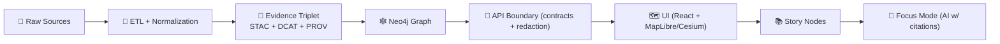

# 🧾 Evidence Bundle — Dataset Evidence Triplet (STAC + DCAT + PROV)


> **Folder:** `mcp/dev_prov/examples/01_dataset_evidence_triplet/evidence/` 📦  
> **Purpose:** a *minimal, auditable* “evidence bundle” that demonstrates how KFM publishes **datasets** only after the **Evidence Triplet** exists: **STAC + DCAT + PROV** ⛓️

---

## 🧭 Quick Navigation

- [What this folder is](#-what-this-folder-is)
- [The Evidence Triplet in 60 seconds](#-the-evidence-triplet-in-60-seconds)
- [Folder contents](#-folder-contents)
- [Cross-linking rules](#-cross-linking-rules)
- [How KFM uses this](#-how-kfm-uses-this)
- [How `dev_prov` uses this](#-how-dev_prov-uses-this)
- [Definition of Done](#-definition-of-done)
- [Project docs referenced](#-project-docs-referenced)

---

## ✅ What this folder is

This directory is a **self-contained evidence bundle** for a single dataset publication event.

KFM’s pipeline is intentionally “no shortcuts”:



**This example** is the smallest version of that “🧾 Evidence Triplet” stage — used for testing, demos, and MCP-style developer workflows.

---

## 🧠 The Evidence Triplet in 60 seconds

| Artifact 🧩 | Standard 📜 | Answers… | Why KFM cares 💡 |
|---|---|---|---|
| **STAC** 🗺️ | SpatioTemporal Asset Catalog | “What is it, **where/when** is it, and where are the files?” | Great for geospatial indexing, footprints, time ranges, and assets (tiles, rasters, vectors). |
| **DCAT** 🏷️ | Data Catalog Vocabulary | “Who published it, what’s the **license**, and how do I access it?” | Makes datasets discoverable like a data portal (title, keywords, license, distributions). |
| **PROV** ⛓️ | W3C PROV / PROV-O | “How was it produced? From which sources, by whom/what, and when?” | Reproducibility + auditability. No “mystery layers” or unverifiable outputs. |

✨ Together, they form the **Evidence Triplet** that unlocks downstream ingestion into the **graph**, exposure via **APIs**, use in the **UI**, and citation-backed answers in **Focus Mode**.

---

## 🗂️ Folder contents

> Filenames may vary slightly between implementations — the contract is **the 3 artifacts** + consistent linking.

A typical evidence bundle looks like:

```text
📁 evidence/
├── 📄 README.md                         ← you are here
├── 🗺️ stac.collection.json              ← STAC Collection (dataset-level spatial/temporal envelope)
├── 🧩 stac.items/                        ← STAC Items (asset-level entries)
│   ├── 🧩 stac.item.001.json
│   └── 🧩 stac.item.002.json
├── 🏷️ dcat.dataset.jsonld               ← DCAT Dataset entry (discovery + access + license)
└── ⛓️ prov.bundle.jsonld                ← PROV lineage bundle (entities/activities/agents)
```

### 🔎 “What should I look for?” (at a glance)

- **STAC**: WGS84 geometry ✅, time properties ✅, asset links ✅, and **a pointer to provenance** ✅
- **DCAT**: title/description ✅, publisher ✅, license ✅, distributions ✅ (download/API/STAC link)
- **PROV**: *inputs → activity → outputs* ✅, agents ✅, timestamps ✅, parameters/config ✅

---

## 🔗 Cross-linking rules

KFM doesn’t just want *three separate files* — it wants **three files that agree**.

### Required link expectations ✅

- **STAC → PROV**
  - Each STAC Collection/Item should include a **provenance pointer** (custom field or link) to the PROV bundle.
- **DCAT → STAC**
  - DCAT distributions should include a link to the dataset’s STAC catalog (or an API endpoint that serves it).
- **DCAT → PROV**
  - DCAT should provide a direct link to provenance (lineage), not just “about” text.
- **PROV → inputs + outputs**
  - PROV must reference:
    - at least one **source entity** (raw or upstream dataset)
    - at least one **processing activity**
    - at least one **generated output entity** (this dataset / assets)

### Stable IDs matter 🧷

Use a consistent dataset ID convention (example style):

- `kfm.ks.landcover.2000_2020.v1` (region + domain + range + version)

When IDs drift, **graph lineage breaks**, UI provenance panels become confusing, and Focus Mode citations can’t resolve reliably.

---

## 🧰 How KFM uses this

### 🕸 Graph ingestion (Catalogs → Neo4j)

- KFM reads **STAC/DCAT/PROV** to create nodes + relationships in the knowledge graph:
  - dataset nodes (from DCAT)
  - assets/observations/coverage nodes (from STAC)
  - lineage activity chains (from PROV)
- The graph stays “clean” by design: **no nodes without evidence**.

### 🧰 API boundary (Graph → API)

- KFM’s governed APIs sit between UI and data stores.
- Policies (authorization, redaction, sensitivity) are enforced here — not in the UI.

### 🗺️ UI provenance UX (“the map behind the map”)

- UI layers can surface:
  - source attributions (from DCAT)
  - processing summaries + lineage (from PROV)
  - time/space coverage + asset detail (from STAC)

### 🤖 Focus Mode + citations

- Focus Mode answers are required to be **grounded** and **citation-backed**.
- If it can’t cite, it should refuse or express uncertainty.
- Outputs (answers) can themselves be treated as evidence artifacts with PROV logs.

---

## 🧪 How `dev_prov` uses this

This example is designed for **developer provenance** and reproducible workflows:

- load the evidence bundle 📦
- validate the triplet contract ✅
- emit a single, structured “DatasetEvidenceTriplet” object that downstream tools can use

### Suggested envelope shape 🧱 (conceptual)

```json
{
  "kind": "DatasetEvidenceTriplet",
  "dataset_id": "kfm.ks.example.dataset.v1",
  "stac": {
    "collection": "stac.collection.json",
    "items_glob": "stac.items/*.json"
  },
  "dcat": "dcat.dataset.jsonld",
  "prov": "prov.bundle.jsonld",
  "links": {
    "ui_catalog": "…",
    "api_dataset": "…"
  }
}
```

> 🧩 Why this matters for MCP/dev workflows:  
> it makes provenance a **first-class interface**, not an afterthought — allowing test harnesses, CI gates, and tools to reason over the same evidence the UI/AI will rely on.

---

## ✅ Definition of Done

Use this as the “merge gate” checklist for *any* evidence bundle:

### 1) Completeness 📦
- [ ] STAC Collection present
- [ ] STAC Items present (or explicitly documented as “collection-only dataset”)
- [ ] DCAT dataset entry present
- [ ] PROV lineage bundle present

### 2) Validity 🧪
- [ ] JSON / JSON-LD parses cleanly
- [ ] Conforms to KFM profiles (STAC/DCAT/PROV)
- [ ] Spatial + temporal extents are consistent across STAC/DCAT

### 3) Link integrity 🔗
- [ ] DCAT → STAC distribution link exists
- [ ] STAC → PROV pointer exists
- [ ] DCAT → PROV pointer exists
- [ ] PROV references inputs + outputs + agents

### 4) Governance ⚖️
- [ ] License is explicit (DCAT)
- [ ] Publisher/creator is explicit (DCAT)
- [ ] Sensitivity/classification is present where required (KFM profile)
- [ ] No “mystery layers”: every asset is attributable + reproducible

---

## 📚 Project docs referenced

These documents inform the structure and intent of this example (📎 and intentionally *cross-domain*):

### Core KFM system docs 🧭
- **📥 Data intake & publishing:** `📚 Kansas Frontier Matrix (KFM) Data Intake – Technical & Design Guide.pdf`
- **🏗️ Architecture & data layer:** `Kansas Frontier Matrix (KFM) – Comprehensive Architecture, Features, and Design.pdf`
- **🧾 Contract-first metadata:** `Kansas Frontier Matrix (KFM) – Comprehensive Technical Documentation.pdf`
- **🤖 AI + citations + governance:** `Kansas Frontier Matrix (KFM) – AI System Overview 🧭🤖.pdf`
- **🗺️ UI provenance + MapLibre/Cesium:** `Kansas Frontier Matrix – Comprehensive UI System Overview.pdf`

### Growth + governance + developer provenance 🌱
- **🧪 MCP / gaps / modularity:** `Kansas-Frontier-Matrix Design Audit – Gaps and Enhancement Opportunities.pdf`
- **✨ Future proposals (CI → PROV, policy pack):** `🌟 Kansas Frontier Matrix – Latest Ideas & Future Proposals.docx.pdf`
- **🧰 Artifact packaging + signing ideas:** `Additional Project Ideas.pdf`
- **🚀 Advanced evolution concepts:** `Innovative Concepts to Evolve the Kansas Frontier Matrix (KFM).pdf`

### Supporting libraries (portfolio PDFs) 🧠🗺️🧰
- **🧠 AI references:** `AI Concepts & more.pdf`
- **🗺️ Geospatial + WebGL references:** `Maps-GoogleMaps-VirtualWorlds-Archaeological-Computer Graphics-Geospatial-webgl.pdf`
- **🧰 Programming resources:** `Various programming langurages & resources 1.pdf`
- **🗄️ Data management + Bayesian + CI/CD:** `Data Managment-Theories-Architures-Data Science-Baysian Methods-Some Programming Ideas.pdf`

---

## 🧩 Notes for contributors

- Treat **raw data as immutable evidence** 🧱 (no silent edits).
- Make ETL deterministic and config/code-driven 🔁.
- If you change the dataset, you must update **all three**: STAC, DCAT, PROV (and keep them consistent) ✅.

> 🧠 North Star: “Every map is backed by evidence, every insight is traceable.” ⛓️

