# 🛰️ STAC Evidence (SpatioTemporal Asset Catalog)

   

> 📍 **Path:** `mcp/dev_prov/examples/01_dataset_evidence_triplet/evidence/stac/`  
> 🧠 **Goal:** Store the **STAC** part of KFM’s **Dataset Evidence Triplet** remembering that KFM is *catalog-driven* + *evidence-first* (no “mystery layers” allowed).:contentReference[oaicite:0]{index=0}:contentReference[oaicite:1]{index=1}

---

## 🧩 How this folder fits the Dataset Evidence Triplet

KFM links **STAC + DCAT + PROV** together so you can go from:  
**UI layer → dataset description → file assets → processing lineage** (and back).:contentReference[oaicite:2]{index=2}:contentReference[oaicite:3]{index=3}

```mermaid
flowchart LR
  DCAT["📚 DCAT Dataset<br/>Discovery + Publishing"] -->|"dcat:distribution → STAC"| STAC["🛰️ STAC Collection + Items<br/>Where/When + Assets"]
  STAC -->|"links / properties → PROV"| PROV["🔗 PROV-O Bundle<br/>Lineage + Runs + Agents"]
  PROV -->|"prov:wasGeneratedBy / prov:used"| STAC
```



**Key idea:** STAC answers: **“What is this dataset, where and when does it pertain to, and where are its files?”**:contentReference[oaicite:4]{index=4}

---

## 📁 What lives here

A practical layout (adjust if the example repo already pins specific filenames):

```text
evidence/stac/
├─ README.md                 👈 you are here
├─ catalog.json              (optional) STAC Catalog root for this evidence bundle
├─ collection.json           ✅ STAC Collection = dataset-level spatiotemporal container
└─ items/
   ├─ item-0001.json         ✅ STAC Item = one spatial/temporal slice / tile / observation
   ├─ item-0002.json
   └─ ...
```

> [!NOTE]
> **Do not** put large binaries here unless this example is intentionally tiny.  
> Prefer linking assets via stable URLs or OCI artifacts (below) so evidence stays reviewable, reproducible, and portable.:contentReference[oaicite:5]{index=5}:contentReference[oaicite:6]{index=6}

---

## ✅ Minimum contract (KFM-STAC profile expectations)

KFM **extends** STAC via a KFM profile. At minimum, STAC Items are expected to carry:
- `kfm:dataset_id` (canonical dataset identifier)
- `kfm:classification` (e.g., public/internal/restricted)
- often also a version marker (e.g., `kfm:version`):contentReference[oaicite:7]{index=7}:contentReference[oaicite:8]{index=8}

### 📌 Required-ish fields for this example

| Area | Field(s) | Why it matters |
|---|---|---|
| Identity | `id`, stable naming | Deterministic + diffable evidence (reruns shouldn’t “randomize” IDs).:contentReference[oaicite:9]{index=9}:contentReference[oaicite:10]{index=10} |
| Space | `geometry`, `bbox` (WGS84) | Standard spatial indexing + consistent ingestion conventions.:contentReference[oaicite:11]{index=11} |
| Time | `properties.datetime` **or** start/end fields | Timeline, filtering, replay, “what happened in the 1930s?” type queries.:contentReference[oaicite:12]{index=12} |
| Governance | `properties.kfm:classification` | Drives access control + safe publishing.:contentReference[oaicite:13]{index=13} |
| Linkage | `links` to Collection + DCAT + PROV | Enables traversal from UI → dataset → lineage and graph import.:contentReference[oaicite:14]{index=14} |
| Assets | `assets.*.href`, `assets.*.type`, roles | “Where are the files?” + which file is “data” vs “thumbnail” etc.:contentReference[oaicite:15]{index=15} |

---

## 🔗 Cross-link rules (STAC ↔ DCAT ↔ PROV)

KFM’s documentation is explicit that **STAC, DCAT, and PROV are not used in isolation**. They are cross-referenced so the metadata becomes an *evidence graph* mirrored in Neo4j (Dataset / Asset / Activity/Run nodes).:contentReference[oaicite:16]{index=16}

### ✅ This folder’s responsibilities

**In each STAC Item:**
- Link to its parent collection (`links[].rel = "collection"`).
- Include a pointer to provenance (either `links[].rel = "provenance"` and/or `assets.provenance`).:contentReference[oaicite:17]{index=17}
- Include `properties.kfm:dataset_id` and `properties.kfm:classification`.:contentReference[oaicite:18]{index=18}

**In the Collection:**
- Include links to:
  - the DCAT dataset record (recommended via `rel: "describedby"`)
  - the PROV bundle (recommended via `rel: "provenance"`):contentReference[oaicite:19]{index=19}

> [!TIP]
> If your STAC Item includes a PROV activity identifier (or a dataset version that can be looked up in PROV), it becomes much easier to answer “how was this made?” without guesswork.:contentReference[oaicite:20]{index=20}

---

## 📦 Assets & storage patterns (pick one)

### Option A — Plain HTTPS (object storage / web server)
Best for: simple demos, public open data.

✅ In `assets`:
- `href`: stable URL
- `type`: MIME type
- `roles`: `["data"]`, `["thumbnail"]`, `["metadata"]`, etc.

### Option B — OCI Artifacts (ORAS + Cosign) 🧱🔏
Best for: reproducibility + supply-chain integrity.

KFM proposes (and in places describes) storing artifacts like **PMTiles** + **GeoParquet** (and similar) in an **OCI registry** using ORAS, with **Cosign signatures** for verification.:contentReference[oaicite:21]{index=21}:contentReference[oaicite:22]{index=22}

**Why it’s powerful:**
- content-addressable digests (pin exact bytes)
- tags for convenience
- signatures + referrers for provenance attachments (PROV JSON-LD, SBOMs, attestations):contentReference[oaicite:23]{index=23}:contentReference[oaicite:24]{index=24}

KFM notes metadata records (STAC and DCAT) can include a `distribution.oci` entry describing registry/repo/tag/digest plus artifact files + media types.:contentReference[oaicite:25]{index=25}

<details>
<summary><strong>🧾 Example: OCI distribution hint (extension field)</strong></summary>

```json
{
  "distribution": {
    "oci": {
      "registry": "ghcr.io",
      "repository": "kfm/datasets/ks_landcover",
      "tag": "2026-01-21",
      "digest": "sha256:0123abcd...",
      "artifacts": [
        { "path": "landcover.pmtiles", "mediaType": "application/vnd.pmtiles" },
        { "path": "landcover.parquet", "mediaType": "application/vnd.geo+parquet" }
      ]
    }
  }
}
```

</details>

> [!NOTE]
> OCI storage also supports FAIR+CARE alignment (interoperability + controlled access for sensitive data) when paired with registry permissions and mandatory classification metadata.:contentReference[oaicite:26]{index=26}

---

## 🧪 Validation & Policy Gates (fail closed) 🚦

KFM uses automated policy gates with a “**fail closed**” philosophy:
- schema validation
- STAC/DCAT/PROV completeness
- license presence
- sensitivity classification correctness
- provenance completeness:contentReference[oaicite:27]{index=27}

Also: anything surfaced in UI or AI must be traceable back to cataloged sources—**no “mystery layers.”**:contentReference[oaicite:28]{index=28}

### Suggested checks for this folder
- ✅ JSON schema / STAC structural validation
- ✅ `kfm:dataset_id` present and matches DCAT/PROV IDs
- ✅ `kfm:classification` present and consistent with access rules
- ✅ `links` include DCAT + PROV
- ✅ assets have:
  - correct MIME type
  - stable `href`
  - (recommended) size + checksum/digest in an extension field
- ✅ deterministic IDs (stable filenames, stable `id`s):contentReference[oaicite:29]{index=29}

---

## 🗺️ How the UI benefits from clean STAC evidence

KFM’s UI emphasizes transparency: users should always be able to trace “**the map behind the map**.”:contentReference[oaicite:30]{index=30}

STAC is a *big part* of how you enable that:
- layer popups can reference `assets` + `links`
- Layer Info dialogs can surface **source, license, and preparation summary** (fed from linked metadata):contentReference[oaicite:31]{index=31}
- Offline packs can bundle tiles (PMTiles/MBTiles) + minimal metadata so MapLibre/Cesium can run without internet:contentReference[oaicite:32]{index=32}

---

## 🤖 How Focus Mode AI benefits from clean STAC evidence

Focus Mode is designed as an evidence-backed RAG pipeline:
`UserQuestion → Retrieval → LLM Answer → Governance Check → AnswerWithCitations`:contentReference[oaicite:33]{index=33}

It pulls from:
- Neo4j knowledge graph queries (structured context)
- document search / semantic retrieval (unstructured context):contentReference[oaicite:34]{index=34}

If STAC links cleanly to DCAT + PROV, Focus Mode can:
- cite where a layer came from
- cite how it was produced (pipeline run / activity)
- refuse when evidence is missing (policy-gate behavior):contentReference[oaicite:35]{index=35}

---

## ⚡ Real-time / streaming STAC Items

KFM treats streaming as “many small ingests” and can emit STAC Items for each observation (time + location + value).:contentReference[oaicite:36]{index=36}

Example future proposal: a GTFS-RT watcher polls feeds and **produces STAC Items per observation** with transit fields (route/vehicle/timestamps) and a DCAT Dataset for the feed.:contentReference[oaicite:37]{index=37}

---

## 🧾 STAC templates (copy/paste starters)

> These are intentionally minimal and KFM-flavored. Adjust IDs, links, and extension fields to match the rest of the example triplet.

### 1) `collection.json` (STAC Collection)

```json
{
  "type": "Collection",
  "stac_version": "1.0.0",
  "id": "kfm.dataset.example_01",
  "title": "Example 01 — Dataset Evidence Triplet",
  "description": "Example STAC Collection for the dataset evidence triplet (STAC/DCAT/PROV).",
  "license": "CC-BY-4.0",
  "extent": {
    "spatial": { "bbox": [[-102.051, 36.993, -94.588, 40.003]] },
    "temporal": { "interval": [["1990-01-01T00:00:00Z", "2020-12-31T23:59:59Z"]] }
  },
  "kfm:dataset_id": "kfm.dataset.example_01",
  "kfm:classification": "public",
  "links": [
    { "rel": "self", "href": "./collection.json", "type": "application/json" },
    { "rel": "root", "href": "./catalog.json", "type": "application/json" },

    { "rel": "describedby", "href": "../dcat/dataset.jsonld", "type": "application/ld+json", "title": "DCAT Dataset" },
    { "rel": "provenance", "href": "../prov/prov.jsonld", "type": "application/ld+json", "title": "PROV-O Bundle" }
  ]
}
```

### 2) `items/item-0001.json` (STAC Item)

```json
{
  "type": "Feature",
  "stac_version": "1.0.0",
  "id": "example_01__slice_0001",
  "collection": "kfm.dataset.example_01",
  "geometry": {
    "type": "Polygon",
    "coordinates": [[
      [-102.051, 36.993], [-94.588, 36.993], [-94.588, 40.003], [-102.051, 40.003], [-102.051, 36.993]
    ]]
  },
  "bbox": [-102.051, 36.993, -94.588, 40.003],
  "properties": {
    "datetime": "2000-01-01T00:00:00Z",

    "kfm:dataset_id": "kfm.dataset.example_01",
    "kfm:version": "2026-01-21",
    "kfm:classification": "public",

    "kfm:prov_activity_id": "ex:Activity_ingest1"
  },
  "assets": {
    "data": {
      "href": "https://example.org/data/example_01_slice_0001.tif",
      "type": "image/tiff; application=geotiff",
      "roles": ["data"],
      "title": "Primary raster asset"
    },
    "provenance": {
      "href": "../prov/prov.jsonld",
      "type": "application/ld+json",
      "roles": ["metadata", "provenance"],
      "title": "PROV bundle for this dataset"
    }
  },
  "links": [
    { "rel": "collection", "href": "../stac/collection.json", "type": "application/json" },
    { "rel": "describedby", "href": "../dcat/dataset.jsonld", "type": "application/ld+json" },
    { "rel": "provenance", "href": "../prov/prov.jsonld", "type": "application/ld+json" }
  ]
}
```

> [!TIP]
> If you prefer, you can model provenance pointers as `assets.provenance` (explicitly noted in KFM docs as a common pattern).:contentReference[oaicite:38]{index=38}

---

## 🧑‍🔧 Contributor workflow (SOP-style)

KFM’s docs advocate SOP-style, step-by-step contributor workflows for consistency and quality.:contentReference[oaicite:39]{index=39}

Suggested flow:
1. 🧾 Create/update `collection.json` + `items/*.json`
2. 🧪 Validate structure + required fields (including classification + license)
3. 🔗 Confirm cross-links to `../dcat/` + `../prov/`
4. 🧷 Ensure stable IDs + deterministic outputs (avoid randomness)
5. 🧵 Open PR so reviewers can inspect evidence artifacts (and CI policy gates can block missing metadata):contentReference[oaicite:40]{index=40}:contentReference[oaicite:41]{index=41}

---

## 🔎 Graph hygiene & completeness checks

One proposed reliability check: detect “orphaned” evidence nodes (e.g., STAC Item node not linked to a dataset). This helps avoid partial ingests and broken provenance chains.:contentReference[oaicite:42]{index=42}

---

## 🧭 Future-friendly hooks (optional but encouraged)

These aren’t required for the example, but they’re why “good STAC” pays dividends in KFM:

- 🕰️ **Temporal simulation / 4D digital twin thinking** benefits from consistent time-indexed assets and well-formed extents.:contentReference[oaicite:43]{index=43}
- 🧩 **Conceptual Attention Nodes** can tag datasets and steer AI/UI thematic exploration (drought, biodiversity, etc.).:contentReference[oaicite:44]{index=44}
- 🧵 **Pulse Threads / narrative pattern detection** depend on trustworthy, cited evidence to avoid misinformation drift.:contentReference[oaicite:45]{index=45}:contentReference[oaicite:46]{index=46}

---

## 📚 Project references (source shelf)

> Some PDFs are **portfolio PDFs** (multiple embedded docs) and may require Adobe Reader to browse fully.

- 📚 KFM Data Intake — Technical & Design Guide :contentReference[oaicite:47]{index=47}  *(legacy link: :contentReference[oaicite:48]{index=48})*
- 🛰️ KFM AI System Overview :contentReference[oaicite:49]{index=49}
- 🗺️ KFM UI System Overview :contentReference[oaicite:50]{index=50}  *(legacy link: :contentReference[oaicite:51]{index=51})*
- 🧱 KFM Architecture, Features, and Design :contentReference[oaicite:52]{index=52}
- 🧰 KFM Comprehensive Technical Documentation :contentReference[oaicite:53]{index=53}
- 💡 Innovative Concepts to Evolve KFM :contentReference[oaicite:54]{index=54}  *(legacy link: :contentReference[oaicite:55]{index=55})*
- 🧠 Additional Project Ideas (Pulse/OCI/Policy packs/etc.) :contentReference[oaicite:56]{index=56}
- 🧭 Latest Ideas & Future Proposals :contentReference[oaicite:57]{index=57}  *(legacy link: :contentReference[oaicite:58]{index=58})*
- 🧾 Open-Source Geospatial Historical Mapping Hub Design :contentReference[oaicite:59]{index=59}
- 🧠 AI Concepts & more (PDF portfolio) :contentReference[oaicite:60]{index=60}
- 🌐 Maps / Virtual Worlds / Geospatial WebGL (PDF portfolio) :contentReference[oaicite:61]{index=61}
- 🗄️ Data Management / Architectures / Bayesian Methods (PDF portfolio) :contentReference[oaicite:62]{index=62}
- 👩‍💻 Various programming languages & resources (PDF portfolio) :contentReference[oaicite:63]{index=63}

