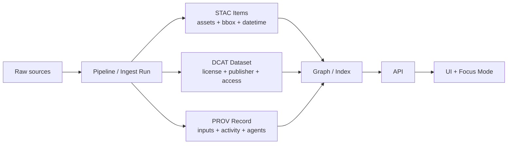

# 🛰️ STAC Items — Evidence Bundle (`01_dataset_evidence_triplet`)


-2b8a3e)


> 🎯 **Purpose:** This folder contains **STAC Item JSON** documents that make up the **“STAC” leg** of the **STAC + DCAT + PROV “evidence triplet”** used by KFM-style, provenance-first ingestion pipelines.

---

## 🧩 Where this fits in the Evidence Triplet

KFM’s stance is **contract-first + provenance-first**: anything that appears in the UI or AI “Focus Mode” must be **traceable to cataloged sources** and **provable processing** (no “mystery layers”).  
That’s why the system uses **three linked standards**:

- **🛰️ STAC (this folder)** → *asset-level* spatiotemporal metadata (what file(s) exist, where/when they apply)
- **🏷️ DCAT** → *dataset-level* discovery metadata (title, publisher/provider, license, access, citation)
- **🧾 PROV** → *lineage & reproducibility* (which inputs + steps produced these assets)



---

## 📦 What belongs in `evidence/stac/items/`

✅ **One JSON file per STAC Item** (granule/asset/observation). Typical “items” represent:

- 🗺️ A geospatial layer output (COG, GeoJSON, MBTiles, vector tiles, etc.)
- 📈 A time-slice (e.g., “landcover_1990”, “landcover_1991”, …)
- ⏱️ A streaming “micro-batch” observation (sensor reading, event point, etc.)
- 🧠 A derived artifact (model output raster, inferred features, extracted mentions-as-points)

> GitHub tip: Items should be portable. Prefer **relative** `href` targets for assets when building a self-contained evidence bundle.

---

## 🗂️ Expected sibling structure (typical)

Even if your example bundle is minimal, this is the common layout pattern:

```text
evidence/
  stac/
    catalog.json              # STAC root (optional but recommended)
    collections/              # STAC Collections (recommended)
      <collection>.json
    items/                    # ✅ YOU ARE HERE
      README.md
      <item>.json
      <item>.json
```

---

## ✅ Item Contract (Core + KFM Profile)

### 1) STAC Core fields (minimum expected)

Every Item should include:

- `stac_version`
- `type: "Feature"`
- `id`
- `geometry` + `bbox`
- `properties`
  - `datetime` **or** `start_datetime` + `end_datetime`
- `assets` (at least one)
- `links`
- `collection` (when using collections)

### 2) KFM-required extensions/properties (profile-driven)

KFM links STAC/DCAT/PROV together and enforces additional governance fields. Common “must-haves” include:

- `properties.kfm:dataset_id` → canonical dataset identifier
- `properties.kfm:classification` → public/internal/restricted/etc (governance + UI behavior)
- `properties.kfm:provenance_ref` **or** `properties.kfm:prov_activity_id` → pointer/ID to the PROV activity that produced this item  
  *(can also be represented as a `link`—see below)*

> ⚖️ Policies are generally **fail-closed**: missing required metadata, missing PROV/DCAT links, missing license in DCAT, or sensitivity/classification violations should block merges/releases.

---

## 🔗 Linking the Triplet (STAC ⇄ DCAT ⇄ PROV)

KFM’s standards are explicitly **cross-linked**, so a consumer can traverse:

**Item → Dataset (DCAT) → Lineage (PROV)** and back.

### Recommended `links` pattern

Use normal STAC link relations where applicable, plus “bridge” links to DCAT/PROV:

- `self`, `root`, `parent`, `collection`
- `describedby` → DCAT dataset record (discovery metadata)
- `via` or a custom rel (project-defined) → PROV record (lineage)

> 🧠 Why this matters: the knowledge graph typically mirrors this as nodes like **Dataset (DCAT)**, **Asset (STAC)**, and **Activity/Run (PROV)** with explicit edges between them.

<details>
<summary><strong>📎 Example: links array (template)</strong></summary>

```json
{
  "links": [
    { "rel": "self", "href": "./item--EXAMPLE.json", "type": "application/geo+json" },
    { "rel": "collection", "href": "../collections/example-collection.json", "type": "application/json" },
    { "rel": "root", "href": "../catalog.json", "type": "application/json" },

    { "rel": "describedby", "href": "../../dcat/datasets/example-dataset.jsonld", "type": "application/ld+json", "title": "DCAT Dataset" },
    { "rel": "via", "href": "../../prov/runs/example-run.prov.jsonld", "type": "application/ld+json", "title": "PROV Run / Lineage" }
  ]
}
```
</details>

---

## 🧾 Assets: Conventions that keep bundles portable

### Asset keys
Pick stable, boring keys:

- `data` (primary)
- `metadata` (aux)
- `thumbnail`
- `tiles` / `mvt` / `mbtiles` (if applicable)
- `doc` (if the “asset” is a source document)

### Asset fields (recommended)
For each asset:

- `href` (prefer relative paths inside the bundle)
- `type` (MIME)
- `roles` (e.g., `["data"]`, `["metadata"]`)
- `title` and `description` (human-friendly UI labels)
- If available: checksums + sizes (helps integrity + provenance)

> 🧷 Provenance-friendly bundles often include a run manifest / checksum strategy so assets can be verified and tied to immutable run IDs.

---

## 🗺️ Geospatial conventions (so everything renders correctly)

- 🌍 **CRS:** STAC GeoJSON geometry is typically **WGS84 / EPSG:4326**.
- 📦 If your pipeline works in projected CRS (common in PostGIS), transform for export:
  - PostGIS patterns like `ST_Transform(..., 4326)` + `ST_AsGeoJSON(...)` are standard for producing GeoJSON geometries.
- 🧱 Large data: store heavy rasters as COGs; store vector layers as GeoJSON/DB tables; serve tiles as MVT where needed.

> UI stacks like MapLibre/Leaflet (2D) and “time slider” layer toggling benefit from clean temporal fields in Items, enabling “space + time” exploration.

---

## ⚖️ Sensitivity, sovereignty & privacy (non-negotiables)

KFM’s governance model typically enforces:

- **FAIR + CARE** alignment (open science + ethical/community-respecting use)
- **Classification propagation**: outputs can’t become “less restrictive” than inputs
- **UI safeguards**: sensitive locations may require generalization/blurring at certain zoom levels
- **Provenance completeness**: no display/usage without provenance artifacts

Optional (future-friendly) privacy patterns that pair well with metadata-rich catalogs:

- **Generalization / suppression** for sensitive coordinates
- **Query auditing** and inference-control strategies for protected datasets
- **Differential privacy** for aggregate views (when appropriate)

---

## 🧪 Validation & CI gates (how to keep Items “mergeable”)

KFM-style pipelines typically run **policy + schema checks** on every PR:

### “Definition of Done” ✅
- [ ] Item JSON validates as STAC Item
- [ ] Item links to **DCAT** and **PROV** artifacts
- [ ] `kfm:dataset_id` and `kfm:classification` present
- [ ] Assets include stable `href` + `type` (+ checksum/size if available)
- [ ] No broken links
- [ ] No secrets / tokens / credentials accidentally committed
- [ ] Gate passes **fail-closed** policy pack rules

<details>
<summary><strong>🧰 Typical toolchain (examples)</strong></summary>

- STAC validation via `pystac` / `stac-validator`
- Schema checks + link checks
- Policy-as-code via **OPA + Conftest** (Rego rules), e.g.:
  - “Every dataset must have a license”
  - “STAC/DCAT/PROV completeness required”
  - “AI outputs must include citations”
  - “No secrets in diffs”
</details>

---

## 🧾 Dev provenance (`dev_prov`) — tie Items to PRs & runs

This example sits under `mcp/dev_prov/…`, so we explicitly encourage “development provenance” links:

- Treat merges/PRs as provenance-relevant **Activities**
- Treat commits/build outputs as provenance-relevant **Entities**
- Treat authors/reviewers/bots as provenance-relevant **Agents**

Practical win: you can answer questions like  
“Which PR produced this STAC Item, and who reviewed it?”  
by traversing Item → PROV → dev activity.

> Bonus pattern: deterministic pipeline runs can generate a **run manifest**, canonicalize it (RFC 8785), hash it, and use that digest as an immutable activity identifier that can be referenced from PROV and/or Item properties.

---

## 🚀 Extensions & future-proofing

As KFM expands (AR/4D digital twins, richer simulations, richer storytelling), Items can grow via STAC extensions and extra properties:

- 🛰️ `proj:*` for projection metadata
- 🟩 `raster:*` for raster bands
- 🛰️ `eo:*` for Earth observation-ish assets
- 🧠 ML/model metadata (and “model cards” stored as linked assets)
- 📖 Story / narrative anchors (link Items to story nodes that cite sources)

---

## 📚 Project docs & reference library (used to shape this folder’s contract)

These are the core project documents that motivated the conventions above:

- 📘 **KFM Data Intake – Technical & Design Guide** (triplet integration, profiles, streaming Items)
- 🧭 **KFM Comprehensive Architecture / Features / Design** (policy gates, FAIR+CARE, governance)
- 🧾 **KFM Comprehensive Technical Documentation** (contract-first + provenance-first, no “mystery layers”)
- 🖥️ **KFM UI System Overview** (user-visible provenance per layer / “map behind map” behavior)
- 🤖 **KFM AI System Overview** (policy pack, dev-provenance, citations & compliance)
- 💡 **Innovative Concepts** (AR/4D trajectory + cultural protocols)
- 🧪 **Scientific Method / Master Coder Protocol** (reproducibility mindset for runs & artifacts)
- 🗺️ **Open-source Geospatial Mapping Hub Design + Geo/Python Cookbook** (COGs, GeoJSON export, PostGIS patterns)
- 📦 **Reference Portfolios** (AI concepts, programming resources, mapping/webgl, data mgmt/Bayesian methods)

> 🧠 Bottom line: **STAC Items here aren’t “just metadata.”** They’re the evidence backbone that makes UI + AI outputs trustworthy, reproducible, and governable.

