# Example 02 — Run Manifest & Hashing 🔏🧾


📍 **Path:** `mcp/dev_prov/examples/02_run_manifest_and_hashing/`

> 🎯 **Goal:** produce a deterministic, tamper-evident **receipt** for a pipeline run:  
> ✅ a self-hashed **Run Manifest** + ✅ **checksums** for inputs/outputs.  
> This is the backbone for KFM’s evidence-first ingestion, processing, and AI auditing.

---

## What this example demonstrates 🧪

- 🧾 **Run Manifest (`run_manifest.json`)**: who/what/when/where of a run (tooling, inputs, outputs, stats)
- 🔐 **File hashing (`checksums.sha256`)**: content hashes for artifacts (raw + processed + model outputs)
- 🧬 **Self-hashing manifest** via **RFC 8785 JSON canonicalization** (JCS) → stable digest
- ♻️ **Idempotency hooks**: detect/avoid duplicate ingests (“exactly-once” patterns)
- 🛡️ **Policy gate input**: manifest + checksums become first-class governance artifacts (license, sensitivity, provenance)

---

<details>
<summary><strong>Table of Contents 🧭</strong></summary>

- [Quickstart](#quickstart-)
- [Mental model](#mental-model-)
- [Artifacts produced](#artifacts-produced-)
- [Run Manifest schema](#run-manifest-schema-)
- [Hashing rules](#hashing-rules-)
- [Walkthrough](#walkthrough-)
- [Reference implementation snippets](#reference-implementation-snippets-)
- [How this plugs into KFM](#how-this-plugs-into-kfm-)
- [Optional: OCI registry + signing](#optional-oci-registry--signing-)
- [Troubleshooting](#troubleshooting-)
- [Glossary](#glossary-)
- [Related project docs](#related-project-docs-)

</details>

---

## Quickstart 🚀

> [!NOTE]
> This README is both:
> - ✅ a runnable guide (if the repo contains a `run.*` entrypoint here), **and**
> - ✅ the **contract** your implementation should satisfy (schema + deterministic outputs).

### 1) Create an audit folder 🗂️

```bash
# Choose a unique run id (ULID/UUID)
export RUN_ID="01J1Z7G0Q7W7T7T7T7T7T7T7T7"

mkdir -p "data/audits/${RUN_ID}"
```

### 2) Hash raw inputs (sha256sum-compatible) 🔐

```bash
# Example: hash everything under a dataset folder (repo-relative paths, sorted)
DATASET_DIR="data/raw/<dataset_id>/<slice_or_date>"
find "$DATASET_DIR" -type f -print0 | sort -z | xargs -0 sha256sum > "$DATASET_DIR/checksums.sha256"
```

### 3) Run the example (if an entrypoint exists here) ⚙️

```bash
# Pick the entrypoint that exists in your checkout:
# - python run.py ...
# - node run.mjs ...
# - bun run.ts ...
# - make run ...

# Example signature your entrypoint SHOULD support:
#   --run-id, --out, and at least one input folder to hash
```

---

## Mental model 🧠

```mermaid
flowchart LR
  A[📥 Inputs - source URLs + raw files] --> B[🔐 Hash files - sha256 streaming]
  B --> C[🧾 Build run_manifest.json - inputs outputs env stats]
  C --> D[🧬 Canonicalize JSON - RFC 8785 JCS]
  D --> E[🔏 Compute digest - SHA-256]
  E --> F[🪪 Set canonical_digest - idempotency_key]
  F --> G[🛡️ Policy gate - license sensitivity provenance]
  G --> H[📚 Publish or index - STAC DCAT PROV]
```



---

## Artifacts produced 📦

At minimum, expect:

- 🧾 `data/audits/<run_id>/run_manifest.json`
- 🔐 `.../checksums.sha256` (either alongside raw inputs or alongside outputs — pick a convention and stick to it)
- 🗒️ (optional) `data/audits/<run_id>/telemetry.ndjson` (append-only run events)
- 🧬 (optional) `data/audits/<run_id>/prov.jsonld` (or PROV-JSON) linking inputs → outputs

> [!IMPORTANT]
> **KFM trust boundary:** treat `data/raw/` as immutable evidence.  
> Store bytes “as received”, hash them, then only transform downstream (`data/work/`, `data/processed/`).

---

## Run Manifest schema 🧾

This example uses a **run-level** manifest (one per pipeline execution). Keep it:

- ✅ machine-readable
- ✅ deterministic (canonicalizable)
- ✅ reproducible (inputs + tool versions + config)
- ✅ safe to publish (respect sensitivity labels)

### Recommended top-level fields (minimum viable)

| Field | Type | Why it exists |
|---|---:|---|
| `run_id` | string | Unique run identifier (UUID/ULID) |
| `run_time` | string | When the run logically occurred (ISO-8601) |
| `tool` | object | Which pipeline/tool executed the run |
| `source_urls` | array | Remote sources used (if any) |
| `inputs[]` | array | Files/objects read + their hashes |
| `outputs[]` | array | Files/objects written + their hashes |
| `tool_versions` | object | Key dependency versions (python/node/gdal/etc.) |
| `summary_counts` | object | Records in/out, warnings, errors |
| `policy` | object | Gate results, policy pack version |
| `canonical_digest` | string | Self-hash of canonicalized manifest |
| `idempotency_key` | string | Stable key for “exactly-once” ingest |

### Example (trimmed)

```json
{
  "run_id": "01J1Z7G0Q7W7T7T7T7T7T7T7T7",
  "run_time": "2026-01-21T00:00:00Z",
  "tool": { "name": "kfm-ingest", "version": "0.2.0" },
  "source_urls": ["https://example.org/datasets/ks_hillshade.tif"],
  "inputs": [
    {
      "path": "data/raw/ks_hillshade/ks_hillshade.tif",
      "sha256": "…",
      "size_bytes": 123,
      "media_type": "image/tiff"
    }
  ],
  "outputs": [
    {
      "path": "data/processed/ks_hillshade/ks_hillshade.cog.tif",
      "sha256": "…",
      "size_bytes": 456,
      "media_type": "image/tiff; profile=cloud-optimized"
    }
  ],
  "tool_versions": { "python": "3.12.0", "gdal": "3.8.0" },
  "summary_counts": { "records_in": 0, "records_out": 0, "errors": 0 },
  "policy": {
    "policy_pack": "kfm-policy@v13",
    "gates": { "license": "pass", "provenance": "pass", "sensitivity": "pass" }
  },
  "canonical_digest": "sha256:…",
  "idempotency_key": "sha256:…"
}
```

---

## Hashing rules 🔐

### File hashing (checksums)

- Hash **raw bytes**, not parsed content.
- Stream files (don’t read multi-GB rasters into RAM).
- Normalize paths in the checksums file to **repo-relative** paths.
- Sort by path for deterministic output.

**Recommended checksums format (sha256sum-compatible):**

```text
<sha256_hex>  data/raw/ks_hillshade/ks_hillshade.tif
<sha256_hex>  data/processed/ks_hillshade/ks_hillshade.cog.tif
```

### Manifest hashing (self-hash)

To make the manifest tamper-evident and deterministic:

1. Set `canonical_digest` to `""` (empty) or `null`
2. Canonicalize the JSON (RFC 8785 / JCS)
3. Compute `sha256(canonical_json_bytes)`
4. Set `canonical_digest = "sha256:<hex>"`
5. If `idempotency_key` is empty, set it to `canonical_digest`

> [!TIP]
> If you want retries to produce the **same** `idempotency_key`, ensure the fields used to compute it are stable (e.g., a data slice identifier, source URL + ETag, or a logical “event id”).  
> Otherwise, use `canonical_digest` as a *uniqueness* fingerprint, and compute `idempotency_key` separately from stable inputs.

---

## Walkthrough 🛠️

### 1) Define the trust boundary 📍
- Put incoming files in `data/raw/…`
- Add a `source.json` (or equivalent) describing source, license, and sensitivity
- Treat `data/raw/` as immutable evidence

### 2) Hash inputs 🔐
- Compute SHA-256 for each raw file
- Write `checksums.sha256`

### 3) Execute your pipeline ⚙️
- Convert/clean/reproject in `data/work/` or `data/processed/`
- Produce outputs (COGs, GeoParquet, PMTiles, indexes, model artifacts, etc.)

### 4) Hash outputs 🔐
- Hash every output artifact that could affect downstream results
- Either:
  - append to a single checksums file, **or**
  - keep separate `checksums.sha256` per stage (raw vs processed)

### 5) Build `run_manifest.json` 🧾
Include:
- inputs + outputs (paths, sizes, hashes)
- tool versions
- summary counts
- policy gate outcomes (pass/fail + reasons)

### 6) Canonicalize + self-hash 🧬
- Canonicalize JSON (RFC 8785)
- Compute digest
- Set `canonical_digest` (and `idempotency_key` if missing)

### 7) Verify (fail closed) ✅
- Recompute file hashes and compare to `checksums.sha256`
- Recompute `canonical_digest` and compare
- If anything mismatches: **stop** (don’t publish artifacts)

---

## Reference implementation snippets 🧩

> These snippets are “shape guidance” for the example. Match them to the actual entrypoint/CLI used in this repo.

### Pseudocode (language-agnostic)

```text
run_id = new_ulid()
manifest = collect_manifest(run_id)

write_checksums("checksums.sha256", hash_files(manifest.inputs + manifest.outputs))

manifest.canonical_digest = ""
canonical_bytes = JCS(manifest)            # RFC 8785 canonicalization
digest_hex = SHA256(canonical_bytes)
manifest.canonical_digest = "sha256:" + digest_hex

if empty(manifest.idempotency_key):
  manifest.idempotency_key = manifest.canonical_digest

write_json("data/audits/<run_id>/run_manifest.json", manifest)
verify_all(manifest)
```

### Minimal file hashing (SHA-256)

```python
import hashlib

def sha256_file(path: str, chunk_size: int = 1024 * 1024) -> str:
    h = hashlib.sha256()
    with open(path, "rb") as f:
        for chunk in iter(lambda: f.read(chunk_size), b""):
            h.update(chunk)
    return h.hexdigest()
```

> [!NOTE]
> JSON canonicalization is deceptively tricky (floats, Unicode normalization, escaping).  
> Use a real RFC 8785/JCS implementation rather than “sort keys + remove whitespace” if you need spec-grade stability.

---

## How this plugs into KFM 🧭

### ✅ Governance & policy gates
KFM treats governance as “first-class”: license, sensitivity classification, provenance completeness, and “fail closed” checks should run at ingestion and publication time.

**Practical integration:**
- `run_manifest.json` becomes the input to policy checks (CI + local)
- `checksums.sha256` becomes tamper-evidence for artifacts
- The manifest digest can be referenced from PROV as a stable activity identifier

### 🗺️ UI provenance surfaces (“the map behind the map”)
A user turning on a map layer should be able to see:
- source + license
- when it was processed
- which pipeline produced it
- the run manifest digest + verification status

### 🤖 AI / Focus Mode auditability
When an AI assistant cites a dataset or layer:
- it can reference the dataset version (hash/digest)
- the system can log which entities (datasets) were used for the answer
- outputs without sources are disallowed by policy

---

## Optional: OCI registry + signing 📦✍️

For large artifacts (tilesets, rasters, models), KFM can treat data like container images:

- Store artifacts in an OCI registry (content-addressed by digest)
- Transfer with `oras`
- Sign with `cosign`
- Attach PROV JSON-LD / attestations as OCI “referrers”

This enables:
- reproducible fetch-by-digest
- verified chain-of-custody
- federation across regions (shared registries)

---

## Troubleshooting 🧯

- **Manifest digest changes between machines**  
  → you’re not canonicalizing per RFC 8785, or you’re including non-deterministic fields (timestamps, random IDs).

- **checksums mismatch after “copying” files**  
  → a tool may have rewritten bytes (newline conversion, recompression, metadata edits). Treat raw files as immutable and re-download if needed.

- **Idempotency doesn’t work**  
  → your idempotency key includes unstable values. Use a stable slice/event identifier.

---

## Glossary 📚

- **Run Manifest**: the audit receipt for a pipeline run (inputs, outputs, env, stats)
- **Canonicalization (JCS / RFC 8785)**: normalize JSON so the same content hashes identically everywhere
- **Digest / hash**: cryptographic fingerprint (here: SHA-256)
- **Idempotency**: running the same logical operation twice doesn’t create duplicates
- **Trust boundary**: where raw evidence becomes governed, reproducible artifacts

---

## Related project docs 📚🗂️

These files define the “why” behind this example (architecture, UI, AI, governance):

- 📘 `Kansas Frontier Matrix (KFM) – Comprehensive Technical Documentation.pdf`
- 📦 `AI Concepts & more.pdf` (reference bundle)
- 🗺️ `Maps-GoogleMaps-VirtualWorlds-Archaeological-Computer Graphics-Geospatial-webgl.pdf` (reference bundle)
- 🧰 `Various programming langurages & resources 1.pdf` (reference bundle)
- 🧠 `Data Managment-Theories-Architures-Data Science-Baysian Methods-Some Programming Ideas.pdf` (reference bundle)
- 🌟 `🌟 Kansas Frontier Matrix – Latest Ideas & Future Proposals.docx.pdf`
- 🏛️ `Kansas Frontier Matrix (KFM) – Comprehensive Architecture, Features, and Design.pdf`
- 🤖 `Kansas Frontier Matrix (KFM) – AI System Overview 🧭🤖.pdf`
- 🧭 `Kansas Frontier Matrix – Comprehensive UI System Overview.pdf`
- 📥 `📚 Kansas Frontier Matrix (KFM) Data Intake – Technical & Design Guide.pdf`
- 💡 `Innovative Concepts to Evolve the Kansas Frontier Matrix (KFM).pdf`
- 🧩 `Additional Project Ideas.pdf`
