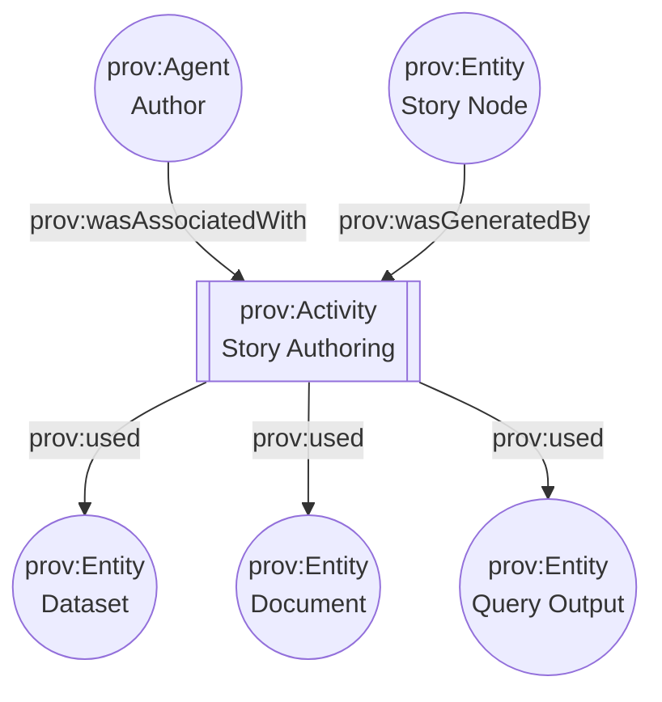

# 03 — Story Node Evidence Manifest 🧷📜⛓️

> 📍 **Path:** `mcp/dev_prov/examples/03_story_node_evidence_manifest/README.md`


**Goal:** show how a **KFM Story Node** (Markdown + JSON map steps) can ship with:  
1) a **human-readable citations block** 📝  
2) a **machine-readable Evidence Manifest** 🧾  
3) a compact **PROV JSON-LD bundle** 🧠⛓️  

So the **UI**, **knowledge graph**, and **Focus Mode AI** can make every claim **auditable, explainable, and reproducible**.

> [!IMPORTANT]
> KFM’s broader architecture is *evidence-first* (STAC + DCAT + PROV for datasets).  
> This example extends that same discipline to **narratives**: no “mystery claims,” no “mystery layers.” ✅

---

<details>
<summary>📚 Table of Contents</summary>

- [What this example demonstrates](#what-this-example-demonstrates)
- [Concept recap](#concept-recap)
- [Expected folder layout](#expected-folder-layout)
- [Step-by-step walkthrough](#step-by-step-walkthrough)
  - [1) Create a Story Node shell](#1-create-a-story-node-shell)
  - [2) Add a tiny citations block](#2-add-a-tiny-citations-block)
  - [3) Build the Evidence Manifest](#3-build-the-evidence-manifest)
  - [4) Emit a compact PROV bundle](#4-emit-a-compact-prov-bundle)
  - [5) Validate + gate it in CI](#5-validate--gate-it-in-ci)
- [Schema: Evidence Manifest (recommended)](#schema-evidence-manifest-recommended)
- [How KFM uses it](#how-kfm-uses-it)
- [Extending the pattern](#extending-the-pattern)
- [Gotchas](#gotchas)
- [Project docs used](#project-docs-used)

</details>

---

## What this example demonstrates

✅ **Story Nodes** are interactive narratives that pair **Markdown** (the narrative) with **JSON** (map/timeline/layer steps).  
✅ This example adds a **manifest** that inventories the evidence behind the story, including: dataset IDs, links to catalogs, query parameters, timestamps, and cryptographic digests.  
✅ A **PROV JSON-LD** snippet ties it all together so the graph can answer questions like:

- “Which stories used this dataset?”  
- “What evidence backs this paragraph?”  
- “Which PR/commit introduced this narrative claim?”

---

## Concept recap

In KFM, users can explore maps, time, and stories while always seeing “**the map behind the map**” (provenance + metadata surfaced everywhere) 🧭🗺️.  
Story Nodes turn the map into a narrated medium: step-by-step layers, camera transitions, timeline changes, and annotated highlights.

An **Evidence Manifest** is the missing bridge between:
- **human storytelling** (Markdown prose + footnotes) and  
- **machine governance** (policy gates, graph queries, reproducibility).

Think: *a scientific paper’s supplementary materials*, but native to the platform 🧪📎

---

## Expected folder layout

> [!NOTE]
> File names here are illustrative—match your repo’s actual conventions.

```text
📦 mcp/dev_prov/examples/03_story_node_evidence_manifest/
├─ 📄 README.md
├─ 📝 story.md
├─ ⚙️ story.config.json
├─ 🧾 EM-84.yaml
├─ ⛓️ story.prov.jsonld
└─ 📁 artifacts/
   ├─ 🖼️ chart_drought_index_1934.png
   └─ 🧪 query_max_gauge_height_1908.sql
```

---

## Step-by-step walkthrough

### 1) Create a Story Node shell

KFM stories typically live under something like `web/story_nodes/` (or a similar content folder), and are contributed via Git like content in a static site. 📁✍️

A common pattern is **Story Markdown + Story Config JSON**.

Example `story.md` (with YAML front-matter):

```markdown
---
id: kfm.story.flood_1908_topeka
title: "1908 Flood in Topeka: What the data + archives show"
authors:
  - name: "Contributor Name"
created: "1908-07-01"
updated: "2026-01-21"
story_config: "./story.config.json"
evidence_manifest: "./EM-84.yaml"
prov_bundle: "./story.prov.jsonld"
tags: [hydrology, kansas_river, topeka, flood]
---

# 1908 Flood in Topeka 🌊

Intro narrative...

## Step 1 — Set the scene
Narrative text for step 1... [^ev-doc-1908-news]

## Step 2 — Compare to gauge record
Narrative text for step 2... [^ev-ds-usgs-nwis] [^ev-q-1908-max-stage]

## Citations (human-readable)
1) USGS NWIS — real-time / historical water data (see **ev-ds-usgs-nwis**)  
2) Local newspaper archive OCR excerpt (see **ev-doc-1908-news**)  
3) Query + parameters used for “max stage in 1908” (see **ev-q-1908-max-stage**)  

---

[^ev-ds-usgs-nwis]: Evidence: `ev-ds-usgs-nwis`
[^ev-doc-1908-news]: Evidence: `ev-doc-1908-news`
[^ev-q-1908-max-stage]: Evidence: `ev-q-1908-max-stage`
```

> [!TIP]
> GitHub will display YAML front-matter as plain text, but KFM tooling can parse it for governance + content pipelines.

---

### 2) Add a tiny citations block

KFM’s “Pulse Ideas” proposes a **small citations block** (3–7 lines) that stays readable in the UI, plus a **full machine manifest** behind the “View Evidence” button.

Keep the citations block:
- short ✅
- stable IDs ✅
- mapped to `ev-*` entries in the manifest ✅

---

### 3) Build the Evidence Manifest

The Evidence Manifest (YAML or JSON) is **the authoritative inventory**.

It should answer:
- **What evidence exists?**
- **Where is it?**
- **What exact slice/version did we use?**
- **How was it transformed?**
- **What is its license + sensitivity classification?**
- **Can we verify integrity (digest / signature)?**

Minimal `EM-84.yaml` sketch:

```yaml
manifest_version: 1
story_node_id: kfm.story.flood_1908_topeka
generated_at: "2026-01-21T00:00:00Z"

# Optional but recommended: stable, content-addressed identifier
# (e.g., canonical JSON digest of this manifest)
canonical_digest: "sha256:__FILL_ME__"

evidence:
  - id: ev-ds-usgs-nwis
    kind: dataset
    title: "USGS NWIS Water Data (Kansas River gauge readings)"
    role: "primary_dataset"
    kfm_dataset_id: "kfm.hydro.usgs_nwis"
    catalogs:
      # Evidence-triplet alignment (dataset must be discoverable + traceable)
      stac: "data/stac/kfm.hydro.usgs_nwis/collection.json"
      dcat: "data/catalogs/kfm.hydro.usgs_nwis.jsonld"
      prov: "data/prov/kfm.hydro.usgs_nwis.prov.jsonld"
    accessed_at: "2026-01-20T20:00:00Z"
    slice:
      station_id: "06889000"   # example
      window: { start: "1908-01-01", end: "1908-12-31" }
    license: "Public Domain"
    sensitivity: "public"

  - id: ev-doc-1908-news
    kind: document
    title: "Topeka newspaper coverage (July 1908 flood) — OCR excerpt"
    role: "historical_context"
    uri: "https://example.org/archive/topeka_1908_flood"
    locator:
      pages: [3, 4]
      excerpt_note: "OCR excerpt stored as artifact for reviewability"
    artifact:
      path: "artifacts/topeka_1908_flood_ocr.txt"
      sha256: "__FILL_ME__"
    license: "CHECK_RIGHTS"
    sensitivity: "public"

  - id: ev-q-1908-max-stage
    kind: analysis
    title: "Query: max gauge height in 1908"
    role: "derived_claim"
    inputs: [ev-ds-usgs-nwis]
    query:
      language: "sql"
      path: "artifacts/query_max_gauge_height_1908.sql"
      parameters:
        station_id: "06889000"
        start: "1908-01-01"
        end: "1908-12-31"
    output:
      kind: "table_row"
      value: { max_stage_ft: 999.9, date: "1908-07-XX" }  # example placeholder
      captured_at: "2026-01-20T20:00:00Z"
    reproducibility:
      notes: "Re-run against the same station/time slice; requires identical pipeline/catalog version."
    license: "N/A"
    sensitivity: "public"

  - id: ev-art-drought-chart
    kind: artifact
    title: "Chart used in story panel (PNG)"
    role: "visualization"
    artifact:
      path: "artifacts/chart_drought_index_1934.png"
      sha256: "__FILL_ME__"
    # Optional: if stored as an OCI artifact for distribution + signing
    oci:
      ref: "ghcr.io/kfm/artifacts/charts:drought_index_1934"
      digest: "sha256:__FILL_ME__"
      signed: true
    license: "CC-BY-4.0"
    sensitivity: "public"
```

> [!WARNING]
> If an evidence item is **sensitive**, avoid embedding raw coordinates or personally-identifying details.  
> Prefer generalized geometry, access controls, or “redacted locator” patterns.

---

### 4) Emit a compact PROV bundle

Once the manifest exists, you can represent Story authoring as provenance:

- **prov:Activity** = “authoring/publishing story node”  
- **prov:Agent** = contributor (or CI bot / AI co-pilot)  
- **prov:Entity** = story markdown, evidence entities, derived artifacts  

A minimal `story.prov.jsonld` (sketch):

```json
{
  "@context": {
    "prov": "http://www.w3.org/ns/prov#",
    "kfm": "https://kansasfrontiermatrix.org/terms#"
  },
  "@id": "kfm:activity/story_authoring/kfm.story.flood_1908_topeka",
  "@type": "prov:Activity",
  "prov:used": [
    { "@id": "kfm:evidence/ev-ds-usgs-nwis" },
    { "@id": "kfm:evidence/ev-doc-1908-news" },
    { "@id": "kfm:evidence/ev-q-1908-max-stage" }
  ],
  "prov:wasAssociatedWith": [
    { "@id": "kfm:agent/contributor_name" }
  ],
  "prov:generated": [
    { "@id": "kfm:entity/story/kfm.story.flood_1908_topeka" }
  ]
}
```

Mermaid mental model:



> [!TIP]
> If you also generate **Dev PROV** (PR/commit provenance), you can link the story authoring activity to:
> - the merge commit entity  
> - the PR activity  
> enabling “Which PR introduced this claim?” queries 🔎

---

### 5) Validate + gate it in CI

KFM’s philosophy treats **metadata like code**:
- validated
- version-controlled
- policy-checked
- fail-closed

Recommended checks for Story Node Evidence Manifests:

#### ✅ Structural validation
- [ ] YAML/JSON parses cleanly  
- [ ] IDs are unique and stable  
- [ ] Required fields exist (`kind`, `title`, `license`, `sensitivity`)  
- [ ] `inputs` references are resolvable

#### ✅ Evidence-triplet alignment (for datasets)
- [ ] Dataset evidence items point to **STAC + DCAT + PROV**  
- [ ] Links resolve (no broken paths / URLs)

#### ✅ Integrity + reproducibility
- [ ] Local artifacts have `sha256`  
- [ ] OCI references (if used) include digests + signature status  
- [ ] Queries include parameters + time slice  
- [ ] Dynamic queries capture timestamps (when evidence is “live” data)

#### ✅ Governance policy pack (OPA / Conftest)
- [ ] License is valid / approved  
- [ ] Sensitivity classification rules pass  
- [ ] No secrets in manifests (tokens, keys, credentials)  
- [ ] Fail closed on missing provenance

---

## Schema: Evidence Manifest (recommended)

> [!NOTE]
> This is a recommended shape for `dev_prov` tooling; tune it to your real schema.

### Top-level fields
- `manifest_version` (int)
- `story_node_id` (string, stable)
- `generated_at` (ISO8601)
- `canonical_digest` (optional but recommended)
- `evidence[]` (list)

### Evidence item fields
| Field | Required | Notes |
|---|---:|---|
| `id` | ✅ | Stable, referenced from Markdown (`ev-*`) |
| `kind` | ✅ | `dataset` / `document` / `analysis` / `artifact` / `web` |
| `title` | ✅ | UI-facing label |
| `role` | ✅ | Why it’s included (primary dataset, context, derived claim…) |
| `license` | ✅ | SPDX or “Public Domain” / “CHECK_RIGHTS” |
| `sensitivity` | ✅ | `public` / `restricted` / `confidential` (your taxonomy) |
| `uri` | ⛔️/✅ | For web/docs |
| `artifact.path` + `sha256` | ✅ for local files | Tamper-evidence + reproducibility |
| `kfm_dataset_id` | ✅ for dataset | Use KFM’s stable dataset identifiers |
| `catalogs.stac/dcat/prov` | ✅ for dataset | The “evidence triplet” for data |
| `query` | ✅ for analysis | Must include parameters and time slice |
| `oci.*` | optional | For artifact registry + signing |

---

## How KFM uses it

### 🖥️ UI (Story Player + “View Evidence”)
- Story JSON drives camera/timeline/layer changes (MapLibre/Cesium steps).  
- Markdown is rendered in a panel, with citations and footnotes.  
- “View Evidence” can open a drawer populated from `EM-84.yaml`.

### 🧠 Focus Mode AI (Answer w/ citations)
- When users ask about a story claim, the AI can retrieve the manifest + underlying catalog metadata and respond with citations.  
- For dynamic data queries, the system can log the exact reading/time slice in provenance.

### 🕸️ Knowledge Graph (Neo4j + PROV)
- Story Nodes become first-class nodes linked to:
  - datasets
  - documents
  - query outputs / derived artifacts  
- Provenance edges allow traversal like: *Dataset → Stories that used it*.

---

## Extending the pattern

### ⚡ Pulse Threads
Pulse Threads are “timely storylets” that are geotagged and can auto-generate narrative updates—**still backed by evidence manifests** (same pattern).

### 📦 Artifact registries (OCI + Cosign)
If you distribute story assets as OCI artifacts, include:
- content digest
- signature presence (cosign)
- attached PROV referrer

This turns story outputs into reproducible, portable, signed packages.

### 🧊 4D / AR / “storyscapes”
As KFM expands into 3D/AR/4D storytelling, the same evidence model works:
- a 3D model becomes an `artifact` evidence item
- simulations become `analysis` evidence items
- time-state datasets remain `dataset` evidence items

---

## Gotchas

- **Footnotes are not enough**: they help humans; the manifest helps tooling + CI + graph.  
- **Don’t leak sensitive locations**: manifest should support generalized geometry + access rules.  
- **Keep dataset references stable**: always prefer `kfm_dataset_id` + STAC/DCAT/PROV links.  
- **Digest everything**: local files and outputs. Trust is earned with hashes 🔐

---

## Project docs used

KFM source docs + background references used to shape this example/spec:

### 🧭 Core KFM Architecture / UI / AI
- Kansas Frontier Matrix – Comprehensive UI System Overview  [oai_citation:0‡Kansas Frontier Matrix – Comprehensive UI System Overview.pdf](file-service://file-KcBQruYcoFVDEixzzRHTwt)  [oai_citation:1‡Kansas Frontier Matrix – Comprehensive UI System Overview.pdf](file-service://file-KcBQruYcoFVDEixzzRHTwt)  
- Kansas Frontier Matrix (KFM) – Comprehensive Architecture, Features, and Design  [oai_citation:2‡Kansas Frontier Matrix (KFM) – Comprehensive Architecture, Features, and Design.pdf](file-service://file-4Umt1yHoGKicdmLWzFJ9sC)  
- Kansas Frontier Matrix (KFM) – AI System Overview 🧭🤖  [oai_citation:3‡Kansas Frontier Matrix (KFM) – AI System Overview 🧭🤖.pdf](file-service://file-Pv8eev6RWvCKrGCXyzY7zg)  
- Kansas Frontier Matrix (KFM) – Comprehensive Technical Documentation  [oai_citation:4‡Kansas Frontier Matrix (KFM) – Comprehensive Technical Documentation.pdf](file-service://file-AkqwUuYPp5zePf7pv5SMxi)  

### 🛰️ Data intake + evidence-first publishing
- 📚 KFM Data Intake – Technical & Design Guide  [oai_citation:5‡📚 Kansas Frontier Matrix (KFM) Data Intake – Technical & Design Guide.pdf](file-service://file-EbUCdsJMbu5KwpoKMrLrgj)  [oai_citation:6‡📚 Kansas Frontier Matrix (KFM) Data Intake – Technical & Design Guide.pdf](file-service://file-EbUCdsJMbu5KwpoKMrLrgj)  

### 💡 Roadmap + governance + provenance extensions
- 🌟 KFM – Latest Ideas & Future Proposals  [oai_citation:7‡Additional Project Ideas.pdf](file-service://file-Pc2GNivcrHBeKjBQksLC3T)  [oai_citation:8‡🌟 Kansas Frontier Matrix – Latest Ideas & Future Proposals.docx.pdf](file-service://file-SQ3f7ve8SGiusT6ThZEuCe)  
- Additional Project Ideas (Evidence Manifests, OCI artifacts, policy gates)  [oai_citation:9‡Additional Project Ideas.pdf](file-service://file-Pc2GNivcrHBeKjBQksLC3T)  

### 🧪 Inspiration + research directions
- Innovative Concepts to Evolve KFM (4D/AR, AI co-pilots, ethical governance)  [oai_citation:10‡Innovative Concepts to Evolve the Kansas Frontier Matrix (KFM).pdf](file-service://file-G71zNoWKxsoSW44iwZaaCC)  [oai_citation:11‡Innovative Concepts to Evolve the Kansas Frontier Matrix (KFM).pdf](file-service://file-G71zNoWKxsoSW44iwZaaCC)  
- Kansas-Frontier-Matrix_ Open-Source Geospatial Historical Mapping Hub Design  [oai_citation:12‡Kansas-Frontier-Matrix_ Open-Source Geospatial Historical Mapping Hub Design.pdf](file-service://file-ShqHKgjxCS9UT9vbcxDNzA)  

### 📦 Reference libraries / portfolios (embedded PDFs)
- AI Concepts & more (PDF portfolio)  [oai_citation:13‡AI Concepts & more.pdf](file-service://file-K6BctJjeUwvyCahLf9qdwr)  
- Maps / Virtual Worlds / Geospatial WebGL (PDF portfolio)  [oai_citation:14‡Maps-GoogleMaps-VirtualWorlds-Archaeological-Computer Graphics-Geospatial-webgl.pdf](file-service://file-RshcX5sNY2wpiNjRfoP6z6)  
- Various programming languages & resources (PDF portfolio)  [oai_citation:15‡Various programming langurages & resources 1.pdf](file-service://file-4wp3wSSZs7gk5qHWaJVudi)  
- Data Management / Architectures / Bayesian / Programming ideas (PDF portfolio)  [oai_citation:16‡Data Managment-Theories-Architures-Data Science-Baysian Methods-Some Programming Ideas.pdf](file-service://file-RrXMFY7cP925exsQYermf2)  

### 🧾 Markdown style reference
- Comprehensive Markdown Guide (syntax + best practices)  [oai_citation:17‡Comprehensive Markdown Guide_ Syntax, Extensions, and Best Practices.docx](file-service://file-J6rFRcp4ExCCeCdTevQjxz)  
