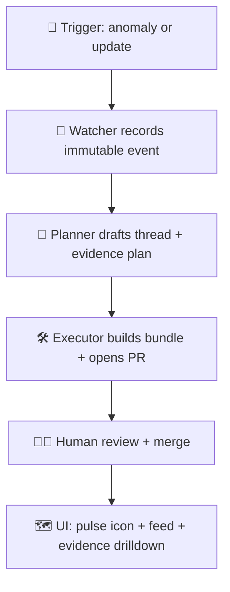
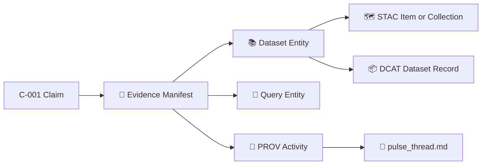

# Pulse Thread Evidence Bundle 🧵🔎


> **Goal:** Treat “Pulse Threads” as *first‑class, evidence‑backed artifacts* — a narrative update that can be **audited claim-by-claim** with a **machine-readable evidence manifest** and **PROV lineage**, consistent with KFM’s evidence-first + provenance-first platform philosophy.  [oai_citation:0‡Additional Project Ideas.pdf](file-service://file-Pc2GNivcrHBeKjBQksLC3T) [oai_citation:1‡Kansas Frontier Matrix (KFM) – Comprehensive Architecture, Features, and Design.pdf](file-service://file-4Umt1yHoGKicdmLWzFJ9sC)

---

## What this example shows ✅

- **Pulse Threads** as a new KFM content type for timely, location-specific narratives, geotagged to places/regions and discoverable in-map or via a feed.  [oai_citation:2‡Additional Project Ideas.pdf](file-service://file-Pc2GNivcrHBeKjBQksLC3T) [oai_citation:3‡Additional Project Ideas.pdf](file-service://file-Pc2GNivcrHBeKjBQksLC3T)
- A **claim → evidence** workflow: every data fact in the thread links back to a source dataset/analysis in the graph, with an **evidence manifest** containing raw references (dataset IDs, query params, timestamps).  [oai_citation:4‡Additional Project Ideas.pdf](file-service://file-Pc2GNivcrHBeKjBQksLC3T)
- A **PROV trace** that records: who/what produced the thread, what inputs were used, what transformations happened, and what was generated — aligned to KFM’s broader provenance model and standards intent.  [oai_citation:5‡Additional Project Ideas.pdf](file-service://file-Pc2GNivcrHBeKjBQksLC3T) [oai_citation:6‡🌟 Kansas Frontier Matrix – Latest Ideas & Future Proposals.docx.pdf](file-service://file-SQ3f7ve8SGiusT6ThZEuCe)
- **Policy gates** you can apply to narrative content the same way KFM applies them to data ingestion and AI outputs: schema validation, STAC/DCAT/PROV completeness, license presence, sensitivity classification, provenance completeness — and “fail closed.”  [oai_citation:7‡Kansas Frontier Matrix (KFM) – Comprehensive Architecture, Features, and Design.pdf](file-service://file-4Umt1yHoGKicdmLWzFJ9sC)
- Optional **publishing + attestation** patterns (OCI artifact store, cosign signing, in-toto provenance, SBOM attachment) that mirror KFM supply chain security ideas.  [oai_citation:8‡Additional Project Ideas.pdf](file-service://file-Pc2GNivcrHBeKjBQksLC3T) [oai_citation:9‡🌟 Kansas Frontier Matrix – Latest Ideas & Future Proposals.docx.pdf](file-service://file-SQ3f7ve8SGiusT6ThZEuCe)

---

## Why this matters in KFM 🌾

KFM’s design repeatedly emphasizes:

- **Evidence-first narratives:** even short updates should let users drill down to the exact data behind the claim.  [oai_citation:10‡Additional Project Ideas.pdf](file-service://file-Pc2GNivcrHBeKjBQksLC3T)
- **No mystery layers / contract-first publishing:** every dataset/layer/story output should ship with explicit metadata (source, license, extent, processing steps), validated and enforced. 
- **Metadata backbone:** pipeline outputs include STAC + DCAT + PROV artifacts, then graph ingestion makes them discoverable and queryable.  [oai_citation:11‡📚 Kansas Frontier Matrix (KFM) Data Intake – Technical & Design Guide.pdf](file-service://file-EbUCdsJMbu5KwpoKMrLrgj)
- **Explainable AI in Focus Mode:** AI responses must be backed by citations, and governance checks can block ungrounded output.  [oai_citation:12‡Additional Project Ideas.pdf](file-service://file-Pc2GNivcrHBeKjBQksLC3T) [oai_citation:13‡Kansas Frontier Matrix (KFM) – Comprehensive Architecture, Features, and Design.pdf](file-service://file-4Umt1yHoGKicdmLWzFJ9sC)
- **Provenance-first UI:** users should be able to inspect “the map behind the map” via provenance panels and metadata tabs.  [oai_citation:14‡Additional Project Ideas.pdf](file-service://file-Pc2GNivcrHBeKjBQksLC3T)

This example applies those same principles to **Pulse Threads**.

---

## Pulse Threads concept 🧭

A Pulse Thread is:

- A **short narrative update** tied to a geospatial context (place/region), optionally auto-generated when new patterns are detected (e.g., statewide sensor anomalies).  [oai_citation:15‡Additional Project Ideas.pdf](file-service://file-Pc2GNivcrHBeKjBQksLC3T) [oai_citation:16‡Additional Project Ideas.pdf](file-service://file-Pc2GNivcrHBeKjBQksLC3T)
- Stored as a **graph node** (e.g., `:PulseThread`) linked to geographic/thematic nodes (`:Watershed`, `:Dataset`, `:Place`, `:Region`).  [oai_citation:17‡Additional Project Ideas.pdf](file-service://file-Pc2GNivcrHBeKjBQksLC3T)
- Published in the UI as **map pop-ups** or a **side-panel feed** with a pulse icon to signal new updates for an area.  [oai_citation:18‡Additional Project Ideas.pdf](file-service://file-Pc2GNivcrHBeKjBQksLC3T)

---

## How the provenance flow fits KFM 🧱

This example mirrors KFM’s **Watcher → Planner → Executor** approach to safe, auditable automation:



- Watcher creates an **immutable event record** (timestamped/signed).  [oai_citation:19‡Kansas Frontier Matrix (KFM) – Comprehensive Architecture, Features, and Design.pdf](file-service://file-4Umt1yHoGKicdmLWzFJ9sC)
- Planner produces a **structured plan** for review; Executor carries out with oversight and policy gates.  [oai_citation:20‡Kansas Frontier Matrix (KFM) – Comprehensive Architecture, Features, and Design.pdf](file-service://file-4Umt1yHoGKicdmLWzFJ9sC)
- The pipeline is designed to be **idempotent and auditable**, with provenance attached to actions.  [oai_citation:21‡Kansas Frontier Matrix (KFM) – Comprehensive Architecture, Features, and Design.pdf](file-service://file-4Umt1yHoGKicdmLWzFJ9sC)

---

## Evidence bundle layout 📦

Think of a Pulse Thread publication as a **Thread Evidence Bundle**:

- 🧵 Narrative content (human-readable)
- 🧾 Evidence manifest (machine-readable)
- 🧬 PROV trace (lineage)
- 🧷 Catalog hooks (STAC/DCAT pointers to datasets used)
- 🔐 Integrity and optional signatures/attestations

### Suggested directory shape 🗂️

> Your folder may differ — the important part is the **relationships** between artifacts.

```text
mcp/dev_prov/examples/04_pulse_thread_evidence/
├─ 📄 README.md                       # 📘 What a Pulse Thread is + how this example meets evidence/traceability rules
├─ 🧵📝 pulse_thread.md                # Pulse narrative (short-form update) with inline citations/refs
├─ 🏷️🧾 pulse_thread.meta.json         # Metadata/contract: id, title, authors, time range, tags, linkage to evidence/prov
├─ 🧾📎 evidence_manifest.json          # Evidence index: claims → citations → artifacts (with paths/URLs/checksums)
├─ 🧬🧾 prov.jsonld                    # PROV bundle linking inputs → transformations → the published pulse output
├─ 🔒🧾 bundle.lock.json               # Lockfile: frozen pointers + digests for reproducibility (tamper detection)
├─ 📐 schemas/                        # Local schemas for validating this example (portable, CI-friendly)
│  ├─ 📐🧾 evidence_manifest.schema.json # Contract for evidence_manifest.json (required fields + link rules)
│  └─ 📐🧾 pulse_thread.schema.json     # Contract for pulse_thread.meta.json (required metadata + constraints)
└─ 🧪 sample/                          # Tiny fixtures used to illustrate the workflow end-to-end
   ├─ 📥🧾 input_snapshot.json          # Minimal “input” snapshot used by the pulse (safe, tiny, deterministic)
   └─ 👀📝 rendered_preview.md          # Rendered preview (what a reader sees) for docs/tests/snapshots
```

### Minimum artifact responsibilities ✅

| Artifact | Purpose |
|---|---|
| `pulse_thread.md` 🧵 | The readable narrative. Contains stable **Claim IDs**. |
| `pulse_thread.meta.json` 🏷️ | Thread “contract”: id, title, places, time window, tags, sensitivity, version. |
| `evidence_manifest.json` 🧾 | Claim-by-claim mapping to **raw references** (dataset IDs, query params, timestamps).  [oai_citation:22‡Additional Project Ideas.pdf](file-service://file-Pc2GNivcrHBeKjBQksLC3T) |
| `prov.jsonld` 🧬 | W3C PROV lineage for generation + review + publication steps. |
| `bundle.lock.json` 🔒 | Hashes for every artifact to prevent tampering & support reproducibility.  [oai_citation:23‡Kansas Frontier Matrix (KFM) – Comprehensive Technical Documentation.pdf](file-service://file-AkqwUuYPp5zePf7pv5SMxi) |

---

## Claim linking pattern 🔗

### In the narrative 🧵

Use explicit, stable Claim IDs:

```md
## Summary
Stream gauges in multiple watersheds show 7‑day flows in the lowest 10th percentile. [C-001]

## Notes
This thread was generated from a watcher event and reviewed by a curator before publication.
```

### In the evidence manifest 🧾

Each claim must have **at least one evidence item**:

```json
{
  "thread_id": "pulse__drought_signals__ks__2026-01-20",
  "claims": [
    {
      "claim_id": "C-001",
      "statement": "Several Kansas stream gauges show 7-day flows in the lowest 10th percentile of historic range.",
      "confidence": 0.9,
      "evidence": [
        {
          "evidence_id": "E-001",
          "type": "dataset",
          "graph_ref": "neo4j://Dataset/usgs_waterwatch",
          "license_ref": "neo4j://License/public_domain_or_source_license",
          "time_window": { "start": "2026-01-13T00:00:00Z", "end": "2026-01-20T23:59:59Z" }
        },
        {
          "evidence_id": "E-002",
          "type": "query",
          "system": "postgis",
          "query_hash": "sha256:...",
          "params": { "percentile_threshold": 10, "window_days": 7 },
          "result_hash": "sha256:..."
        }
      ]
    }
  ]
}
```

This matches the documented intent: evidence manifests contain **raw references** like dataset IDs, query parameters, and timestamps underpinning the narrative.  [oai_citation:24‡Additional Project Ideas.pdf](file-service://file-Pc2GNivcrHBeKjBQksLC3T)

---

## PROV trace model 🧬

KFM describes treating analytical outputs as data with provenance records and traceability across inputs/code/parameters/outputs.  [oai_citation:25‡🌟 Kansas Frontier Matrix – Latest Ideas & Future Proposals.docx.pdf](file-service://file-SQ3f7ve8SGiusT6ThZEuCe)

A practical mapping for Pulse Threads:

- **Entities**: input snapshot, datasets used, query results, thread draft, final thread, evidence manifest, policy reports
- **Activities**: detect anomaly, plan, generate draft, human review, publish bundle
- **Agents**: watcher service, planner service, executor service, human curator, model used (if applicable)



---

## Policy gates and validation 🛡️

KFM’s architecture calls out automated policy gates (schema validation, STAC/DCAT/PROV completeness, license presence, sensitivity classification, provenance completeness) and explicitly requires citations for AI outputs, failing closed otherwise.  [oai_citation:26‡Kansas Frontier Matrix (KFM) – Comprehensive Architecture, Features, and Design.pdf](file-service://file-4Umt1yHoGKicdmLWzFJ9sC)

### Recommended gates for Pulse Thread bundles

1. ✅ **Schema**: `pulse_thread.meta.json` and `evidence_manifest.json` validate against JSON Schema  
2. ✅ **Claim completeness**: every `claim_id` in markdown exists in manifest  
3. ✅ **Evidence completeness**: every claim has `>= 1` evidence item  
4. ✅ **License presence**: every dataset evidence item resolves to a license reference  
5. ✅ **Sensitivity**: thread and evidence are labeled (public / restricted / redacted), and policy enforces handling  
6. ✅ **Provenance**: `prov.jsonld` lists the bundle outputs as generated entities  
7. ✅ **Integrity**: `bundle.lock.json` hashes match actual files  

### Example policy snippet in Rego 🧩

```rego
package kfm.dev_prov.pulse_thread

deny[msg] {
  claim := input.claims[_]
  count(claim.evidence) == 0
  msg := sprintf("Claim %s has no evidence items", [claim.claim_id])
}

deny[msg] {
  ev := input.claims[_].evidence[_]
  ev.type == "dataset"
  not ev.license_ref
  msg := sprintf("Evidence %s missing license_ref", [ev.evidence_id])
}
```

---

## UI integration notes 🗺️

This bundle structure supports the UI behaviors described in KFM docs:

- **Focus Mode** always cites sources; users can click citations to open source pages.  [oai_citation:27‡Additional Project Ideas.pdf](file-service://file-Pc2GNivcrHBeKjBQksLC3T)
- **Provenance-first UI**: “Layer Info” dialogs and planned provenance panels show source/license/how prepared, plus metadata tabs for DCAT/STAC/PROV.  [oai_citation:28‡Additional Project Ideas.pdf](file-service://file-Pc2GNivcrHBeKjBQksLC3T)
- **Pulse Threads** show up as map pop-ups or in a side feed with an icon.  [oai_citation:29‡Additional Project Ideas.pdf](file-service://file-Pc2GNivcrHBeKjBQksLC3T)

---

## Publishing and attestation 🔐

KFM’s proposals include attaching provenance and supply chain attestations (SLSA, SBOMs, Sigstore) to artifacts and automated PRs.  [oai_citation:30‡🌟 Kansas Frontier Matrix – Latest Ideas & Future Proposals.docx.pdf](file-service://file-SQ3f7ve8SGiusT6ThZEuCe)

A Pulse Thread Evidence Bundle can be published like a hardened artifact:

- Store bundle as an **OCI artifact** (container registry used as an artifact store).  [oai_citation:31‡Additional Project Ideas.pdf](file-service://file-Pc2GNivcrHBeKjBQksLC3T)
- Use **cosign signing** so consumers can verify integrity and authorship.  [oai_citation:32‡Additional Project Ideas.pdf](file-service://file-Pc2GNivcrHBeKjBQksLC3T)
- Attach **in-toto provenance attestations** and reference `prov.jsonld` as a referrer.  [oai_citation:33‡Additional Project Ideas.pdf](file-service://file-Pc2GNivcrHBeKjBQksLC3T)
- Attach an **SBOM** (e.g., SPDX) for the “build context” of generation tools.  [oai_citation:34‡Additional Project Ideas.pdf](file-service://file-Pc2GNivcrHBeKjBQksLC3T)

> You can treat the bundle as “data + narrative + proof”.

---

## Governance and sensitive data ⚖️

KFM highlights governance frameworks (FAIR + CARE) and warns about sensitive locations (e.g., sacred sites), including geo-obfuscation and access restrictions.  [oai_citation:35‡🌟 Kansas Frontier Matrix – Latest Ideas & Future Proposals.docx.pdf](file-service://file-SQ3f7ve8SGiusT6ThZEuCe) [oai_citation:36‡Kansas-Frontier-Matrix_ Open-Source Geospatial Historical Mapping Hub Design.pdf](file-service://file-ShqHKgjxCS9UT9vbcxDNzA)

Recommended practices for Pulse Threads:

- 🧭 **Sensitivity tiers**: public / restricted / redacted  
- 🧩 **Geo-obfuscation**: blur or aggregate if location sensitivity applies (e.g., cultural sites)  [oai_citation:37‡Kansas-Frontier-Matrix_ Open-Source Geospatial Historical Mapping Hub Design.pdf](file-service://file-ShqHKgjxCS9UT9vbcxDNzA)  
- 🏷️ **Cultural protocols**: attach TK labels / cultural metadata where required  [oai_citation:38‡Kansas-Frontier-Matrix_ Open-Source Geospatial Historical Mapping Hub Design.pdf](file-service://file-ShqHKgjxCS9UT9vbcxDNzA)  
- 🕵️ **Privacy preservation** for community submissions (k-anonymity/microaggregation concepts appear in the data mining references).  [oai_citation:39‡Data Mining Concepts & applictions.pdf](file-service://file-2uwEbQAFVKpXaTtWgUirAH) [oai_citation:40‡Data Mining Concepts & applictions.pdf](file-service://file-2uwEbQAFVKpXaTtWgUirAH)

---

## Notes for implementers 🧰

### Graph and standards alignment

KFM’s technical documentation references mapping to well-known ontologies (CIDOC-CRM, GeoSPARQL) and aligns provenance with W3C PROV-O.  [oai_citation:41‡Kansas Frontier Matrix (KFM) – Comprehensive Technical Documentation.pdf](file-service://file-AkqwUuYPp5zePf7pv5SMxi) [oai_citation:42‡🌟 Kansas Frontier Matrix – Latest Ideas & Future Proposals.docx.pdf](file-service://file-SQ3f7ve8SGiusT6ThZEuCe)

Pulse Thread evidence is easiest to use when:

- every evidence item points to a graph object (`Dataset`, `Place`, `StoryNode`, `FileAsset`)
- every file referenced is included in metadata and hashed (no orphans)  [oai_citation:43‡Kansas Frontier Matrix (KFM) – Comprehensive Technical Documentation.pdf](file-service://file-AkqwUuYPp5zePf7pv5SMxi)

### Geospatial pipeline reality check 🌍

Many KFM-style pipelines involve standard geospatial tooling patterns like converting Shapefiles into PostGIS (e.g., with `ogr2ogr`) and managing projections.  [oai_citation:44‡KFM- python-geospatial-analysis-cookbook-over-60-recipes-to-work-with-topology-overlays-indoor-routing-and-web-application-analysis-with-python.pdf](file-service://file-2gpiGDZS8iw6EdxGswEdHp)

This example assumes evidence can reference:

- raw inputs (files, feeds)
- processed datasets (PostGIS tables, Parquet, rasters/COGs)
- query result snapshots (hashable)

---

## MCP context 🧠

The repository structure proposes a dedicated `mcp/` area for **Master Coder Protocol** documentation, with experiments, SOPs, glossary, model cards, and onboarding resources to keep a documentation-heavy project organized. 

This example lives under:

- `mcp/dev_prov/…` → “developer provenance” patterns for building auditable, reproducible outputs.

It also matches the scientific-method style documentation emphasis: define the question, methods, data collection, analysis, and make results traceable and reproducible.  [oai_citation:45‡Scientific Method _ Research _ Master Coder Protocol Documentation.pdf](file-service://file-HTpax4QbDgguDwxwwyiS32)

---

## Project files used 📚

> Some files are PDF portfolios; open them in Adobe Acrobat/Reader to see embedded documents.

### KFM core architecture and UX
- 🌐 UI system overview — provenance-first UI + Focus Mode citations  
   [oai_citation:46‡Kansas Frontier Matrix – Comprehensive UI System Overview.pdf](file-service://file-KcBQruYcoFVDEixzzRHTwt)  [oai_citation:47‡Kansas Frontier Matrix (KFM) – AI System Overview 🧭🤖.pdf](file-service://file-Pv8eev6RWvCKrGCXyzY7zg)
- 🧪 Data intake guide — pipelines emit STAC/DCAT/PROV + GitOps/PR workflow  
   [oai_citation:48‡📚 Kansas Frontier Matrix (KFM) Data Intake – Technical & Design Guide.pdf](file-service://file-EbUCdsJMbu5KwpoKMrLrgj)  [oai_citation:49‡📚 Kansas Frontier Matrix (KFM) Data Intake – Technical & Design Guide.pdf](file-service://file-EbUCdsJMbu5KwpoKMrLrgj)
- 🧱 Comprehensive architecture — policy gates + WPE agents  
   [oai_citation:50‡Kansas Frontier Matrix (KFM) – Comprehensive Architecture, Features, and Design.pdf](file-service://file-4Umt1yHoGKicdmLWzFJ9sC)  [oai_citation:51‡Kansas Frontier Matrix (KFM) – Comprehensive Architecture, Features, and Design.pdf](file-service://file-4Umt1yHoGKicdmLWzFJ9sC)
- 🧭 AI system overview — citations, governance checks, auditability  
   [oai_citation:52‡Kansas Frontier Matrix (KFM) – AI System Overview 🧭🤖.pdf](file-service://file-Pv8eev6RWvCKrGCXyzY7zg)
- 🧰 Comprehensive technical documentation — contracts, storage, checksums, ontologies  
   [oai_citation:53‡Kansas Frontier Matrix (KFM) – Comprehensive Technical Documentation.pdf](file-service://file-AkqwUuYPp5zePf7pv5SMxi)

### Pulse Threads and provenance publishing ideas
- 🧵 Pulse Threads spec + evidence manifest concept  
   [oai_citation:54‡Additional Project Ideas.pdf](file-service://file-Pc2GNivcrHBeKjBQksLC3T)  [oai_citation:55‡Additional Project Ideas.pdf](file-service://file-Pc2GNivcrHBeKjBQksLC3T)  [oai_citation:56‡Additional Project Ideas.pdf](file-service://file-Pc2GNivcrHBeKjBQksLC3T)
- 💡 Innovative concepts — cultural protocols, TK labels, geo-obfuscation  
   [oai_citation:57‡Innovative Concepts to Evolve the Kansas Frontier Matrix (KFM).pdf](file-service://file-G71zNoWKxsoSW44iwZaaCC)  [oai_citation:58‡Additional Project Ideas.pdf](file-service://file-Pc2GNivcrHBeKjBQksLC3T)
- 🌟 Latest ideas and proposals — FAIR/CARE governance + SLSA/SBOM direction  
   [oai_citation:59‡🌟 Kansas Frontier Matrix – Latest Ideas & Future Proposals.docx.pdf](file-service://file-SQ3f7ve8SGiusT6ThZEuCe)  [oai_citation:60‡🌟 Kansas Frontier Matrix – Latest Ideas & Future Proposals.docx.pdf](file-service://file-SQ3f7ve8SGiusT6ThZEuCe)
- 🔐 OCI artifact + cosign/in-toto provenance pattern  
   [oai_citation:61‡Kansas Frontier Matrix (KFM) – AI System Overview 🧭🤖.pdf](file-service://file-Pv8eev6RWvCKrGCXyzY7zg)

### Developer knowledge packs and background bundles
- 🧭 Open-source mapping hub design — repo structure + MCP directory context  
   [oai_citation:62‡Kansas Frontier Matrix (KFM) – Comprehensive Technical Documentation.pdf](file-service://file-AkqwUuYPp5zePf7pv5SMxi)
- 🧠 AI concepts portfolio  
   [oai_citation:63‡AI Concepts & more.pdf](file-service://file-K6BctJjeUwvyCahLf9qdwr)
- 🗺️ Geospatial WebGL / mapping portfolio  
   [oai_citation:64‡Maps-GoogleMaps-VirtualWorlds-Archaeological-Computer Graphics-Geospatial-webgl.pdf](file-service://file-RshcX5sNY2wpiNjRfoP6z6)
- 🧱 Data management and Bayesian methods portfolio  
   [oai_citation:65‡Data Managment-Theories-Architures-Data Science-Baysian Methods-Some Programming Ideas.pdf](file-service://file-RrXMFY7cP925exsQYermf2)
- 🧰 Programming languages and resources portfolio  
   [oai_citation:66‡Various programming langurages & resources 1.pdf](file-service://file-4wp3wSSZs7gk5qHWaJVudi)
- 🧪 Geospatial analysis cookbook bundle  
   [oai_citation:67‡KFM- python-geospatial-analysis-cookbook-over-60-recipes-to-work-with-topology-overlays-indoor-routing-and-web-application-analysis-with-python.pdf](file-service://file-2gpiGDZS8iw6EdxGswEdHp)
- 🕵️ Data mining concepts reference bundle  
   [oai_citation:68‡Data Mining Concepts & applictions.pdf](file-service://file-2uwEbQAFVKpXaTtWgUirAH)
- 🧑‍🔬 Scientific method and master coder protocol  
   [oai_citation:69‡Scientific Method _ Research _ Master Coder Protocol Documentation.pdf](file-service://file-HTpax4QbDgguDwxwwyiS32)

---

## Next extensions 🚀

- Add an **evidence drawer** UI component that renders claim IDs, evidence items, and provenance in a friendly view (aligns with provenance-first UI).  [oai_citation:70‡Additional Project Ideas.pdf](file-service://file-Pc2GNivcrHBeKjBQksLC3T)
- Add **OPA policy pack tests** to CI so Pulse Threads “fail closed” if evidence is missing.  [oai_citation:71‡Kansas Frontier Matrix (KFM) – Comprehensive Architecture, Features, and Design.pdf](file-service://file-4Umt1yHoGKicdmLWzFJ9sC)
- Publish bundles to an **OCI registry** and attach cosign signatures + in-toto provenance.  [oai_citation:72‡Additional Project Ideas.pdf](file-service://file-Pc2GNivcrHBeKjBQksLC3T)
- Extend evidence types: raster tiles, vector tiles, model outputs, notebooks, parameter sets (treat model outputs as data with provenance).  [oai_citation:73‡🌟 Kansas Frontier Matrix – Latest Ideas & Future Proposals.docx.pdf](file-service://file-SQ3f7ve8SGiusT6ThZEuCe)
