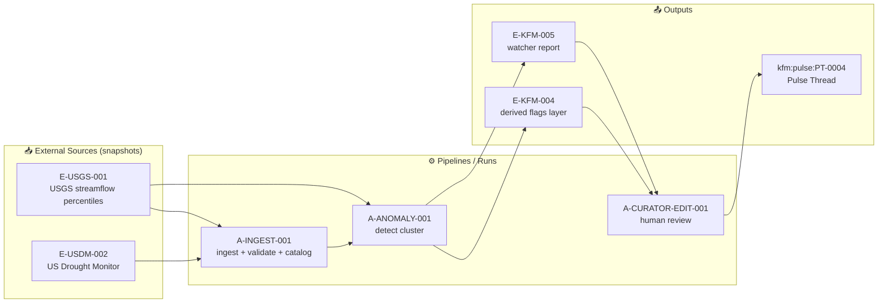

<!--
File: mcp/dev_prov/examples/04_pulse_thread_evidence/sample/rendered_preview.md
Purpose: Human-readable preview of a Pulse Thread + Evidence bundle (Evidence Manifest + PROV).
Generated from (example artifacts): ./pulse_thread.md + ./EM-PT-0004.yaml + ./PROV-PT-0004.jsonld
-->

# Rendered Preview — Pulse Thread Evidence 🫀🧾


> 🧭 A **geotagged micro-story** meant to be skimmed fast — but audited deeply.  
> ✅ Every claim maps to evidence. 🔗 Every output maps to provenance.

---

## 🧪 What this sample demonstrates

- **Pulse Threads** are short, location-tied updates that can show up as a map pin + side-panel feed. 🗺️🫀  
- Every Pulse Thread is backed by an **Evidence Manifest** (machine-readable) and a **PROV bundle** (lineage). 🧾🔗  
- The same evidence bundle can later be reused to promote a thread into a longer **Story Node**. 📚  
- Dev/prov tooling can expose: **what was used**, **what was produced**, **who/what did it**, and **what policies/attestations applied**. 🧰🛡️

---

## 🗂️ Example artifact layout (repo-ish)

```text
sample/
  rendered_preview.md              # 👈 you are here
  pulse_thread.md                  # source narrative (authoring format)
  EM-PT-0004.yaml                  # evidence bundle (machine-readable)
  PROV-PT-0004.jsonld              # provenance bundle (machine-readable)

  # (optional, shown here for context)
  data/
    raw/                           # immutable source snapshots
    processed/                     # cleaned + derived outputs
    catalog/                       # STAC/DCAT records
    provenance/                    # W3C PROV bundles
  attestations/
    sbom/                          # SBOMs for runs/artifacts
    slsa/                          # SLSA/in-toto provenance attestations
```

---

## 🔴 Pulse Thread: Low-flow cluster (Western KS) — *Example*

> ⚠️ This is a **rendering example**. Numeric values, thresholds, and hashes below are illustrative.

| Field | Value |
|---|---|
| **Pulse ID** | `kfm:pulse:PT-0004` |
| **Title** | *Early drought signals: low-flow cluster in Western Kansas (example)* |
| **Status** | `draft` → `curator_reviewed` |
| **Published** | `2026-01-21T15:04:12Z` |
| **Where** | `Region: Western Kansas` · `Counties: Finney, Kearny, Gray (example)` |
| **Theme tags** | `hydrology` · `drought` · `monitoring` |
| **Evidence bundle** | `./EM-PT-0004.yaml` · `./PROV-PT-0004.jsonld` |

### 🧷 Thread timeline

| Time (UTC) | Actor | Update |
|---|---|---|
| 15:02 | 🤖 Watcher | Detected a **cluster of abnormally low streamflow percentiles** across multiple gauges. *(Claim C1)* |
| 15:03 | 🤖 Pulse Generator | Drafted narrative + citations using approved datasets. *(Claims C1–C4)* |
| 15:04 | 🧑‍💼 Curator | Reviewed language + added guardrails (“do-not-overstate”). *(Claim C5)* |

### TL;DR (30 seconds)

- Several gauges in the region show **7‑day streamflow in the lowest decile** relative to historical conditions. ✅ *(C1)*
- This pattern can be **consistent with early drought stress**, but it is **not a drought declaration** by itself. ⚠️ *(C2, C5)*
- Next steps: verify sensors, compare against drought indicators, and watch the next update window. 🧰 *(C3, C4)*

### What we saw 👀

A watcher process flagged a low-flow pattern:

- **Signal:** multiple gauges below a percentile threshold over a rolling 7‑day window. *(C1)*
- **Pattern type:** *cluster* (multi-station) rather than a single-station anomaly. *(C2)*
- **Interpretation:** clusters reduce the chance this is a single sensor failure and increase the chance it’s a regional signal. *(C2)*

### Suggested follow‑ups 🧭

1. **Calibration check** for flagged stations (if applicable). *(C3)*
2. Compare the flagged region against **drought indicator layers** in KFM (e.g., drought categories, soil moisture proxies if present). *(C4)*
3. If the pattern persists, promote this thread into a **Story Node** with deeper charts + historical context. *(C6)*

---

## 🌱 FAIR+CARE alignment (publishing checklist)

- 🔎 **Findable:** indexed by place + theme tags; discoverable via map click / feed search.  
- 🔓 **Accessible:** short narrative with direct evidence links; exportable as a citation-carrying snippet.  
- 🔗 **Interoperable:** evidence references use standard identifiers and can serialize to JSON for federation.  
- ♻️ **Reusable:** evidence bundle enables later compilation into a Story Node / report.  
- 🤝 **CARE-aware:** policy + review gates prevent unsafe disclosures or misleading automation.

---

## 🧯 Caveats & guardrails

- This is a **signal**, not a verdict: hydrology is noisy and local factors can dominate. *(C5)*
- Policy: **no “mystery layers,” no uncited claims** — if evidence can’t be traced, the claim doesn’t ship. *(C7)*

---

## ✅ Claims ledger (what’s being asserted)

> Tip: In the UI, this powers “🧾 View Evidence” behind every sentence/bullet.

| Claim ID | Claim | Evidence IDs | Derived by |
|---|---|---|---|
| **C1** | A multi‑gauge cluster shows 7‑day streamflow percentiles in the lowest decile (example threshold). | `E-USGS-001` `E-KFM-004` | `A-ANOMALY-001` |
| **C2** | Clustered anomalies suggest a regional signal more than a single-sensor error. | `E-KFM-005` | `A-PATTERN-CLUSTER-001` |
| **C3** | Recommended: flag stations for calibration check. | `E-KFM-005` | `A-CURATOR-EDIT-001` |
| **C4** | Recommended: compare flagged area with drought indicator layers. | `E-USDM-002` | `A-CURATOR-EDIT-001` |
| **C5** | Not a drought declaration; interpret carefully. | `E-KFM-006` | `A-CURATOR-EDIT-001` |
| **C6** | Evidence bundle can be reused to promote this thread into a Story Node. | `E-KFM-007` | `A-SYSTEM-DESIGN` |
| **C7** | Official outputs must be traceable to cataloged sources (no “mystery layers”). | `E-KFM-008` | `A-SYSTEM-DESIGN` |

---

## 🧾 Citations block (human-friendly)

> Keep it short (3–7 items). “Receipts, not a bibliography.”

1. **USGS Streamflow Percentiles** — ingested snapshot + query details in `E-USGS-001`  
2. **U.S. Drought Monitor** — ingested snapshot + category details in `E-USDM-002`  
3. **KFM Pipeline Run** — ingestion + anomaly detection provenance in `A-ANOMALY-001`  
4. **Evidence Manifest** — `./EM-PT-0004.yaml`  
5. **PROV Bundle** — `./PROV-PT-0004.jsonld`

---

## 🧩 MCP dev/prov envelope (example)

<details>
<summary><b>Open: tool_result.json</b> 🧰</summary>

```json
{
  "type": "kfm.pulse_thread",
  "id": "kfm:pulse:PT-0004",
  "title": "Early drought signals: low-flow cluster in Western Kansas (example)",
  "published_at": "2026-01-21T15:04:12Z",
  "geo": {
    "type": "Polygon",
    "coordinates": [[[-102.10, 36.99], [-94.60, 36.99], [-94.60, 40.00], [-102.10, 40.00], [-102.10, 36.99]]]
  },
  "rendered_markdown_ref": "./rendered_preview.md",
  "evidence_manifest_ref": "./EM-PT-0004.yaml",
  "prov_bundle_ref": "./PROV-PT-0004.jsonld",
  "claims": ["C1", "C2", "C3", "C4", "C5", "C6", "C7"],
  "governance": {
    "policy_engine": "OPA",
    "result": "pass",
    "notes": ["citations_present", "sensitivity_ok"]
  }
}
```

</details>

---

## 🧰 Reproduce / verify (developer checklist)

- [ ] Open `./EM-PT-0004.yaml`
- [ ] Fetch each evidence item’s `uri` and verify `sha256`
- [ ] Re-run `A-ANOMALY-001` using the pinned code + parameters
- [ ] Confirm all claims (C1–C7) resolve to at least one evidence item
- [ ] Confirm governance checks passed (citations present, sensitivity rules satisfied)
- [ ] Confirm attestations exist where required (SBOM + SLSA/in-toto)

---

## 📦 Evidence Manifest (machine-readable)

<details>
<summary><b>Open: EM-PT-0004.yaml</b> 🧾</summary>

```yaml
schema_version: "kfm.evidence_manifest/v1"
id: "kfm:evidence_manifest:EM-PT-0004"
applies_to:
  type: "kfm:pulse_thread"
  id: "kfm:pulse:PT-0004"

created_at: "2026-01-21T15:04:12Z"
created_by:
  - "kfm:agent:watcher/hydro"
  - "kfm:agent:curator/human"

scope:
  geo:
    type: "Polygon"
    # simplified bbox polygon (example)
    coordinates:
      - [[-102.10, 36.99], [-94.60, 36.99], [-94.60, 40.00], [-102.10, 40.00], [-102.10, 36.99]]
  time:
    start: "2026-01-01"
    end: "2026-01-21"

evidence:
  - id: "E-USGS-001"
    kind: "dataset_snapshot"
    title: "USGS streamflow percentiles (7-day) — Western KS gauges"
    standards:
      stac_item: "data/catalog/hydro/usgs_streamflow_percentile_7d/item.json"
      dcat_dataset: "data/catalog/dcat/usgs_streamflow_percentile_7d.jsonld"
      prov_bundle: "./PROV-PT-0004.jsonld"
    retrieval:
      source: "USGS WaterWatch / NWIS (example)"
      retrieved_at: "2026-01-21T14:58:22Z"
      params:
        region: "Western KS (example polygon)"
        metric: "7_day_avg_streamflow_percentile"
        threshold: "<= 10"
    assets:
      - uri: "kfm://data/raw/usgs/waterwatch/2026-01-21/usgs_streamflow_percentile_7d.csv"
        sha256: "sha256:aaaaaaaaaaaaaaaaaaaaaaaaaaaaaaaaaaaaaaaaaaaaaaaaaaaaaaaaaaaaaaaa"
      - uri: "kfm://data/processed/hydro/usgs_streamflow_percentile_7d.parquet"
        sha256: "sha256:bbbbbbbbbbbbbbbbbbbbbbbbbbbbbbbbbbbbbbbbbbbbbbbbbbbbbbbbbbbbbbbb"
    license: "Public Domain (example)"
    sensitivity: "public"

  - id: "E-USDM-002"
    kind: "dataset_snapshot"
    title: "U.S. Drought Monitor categories — Kansas (weekly)"
    retrieval:
      source: "U.S. Drought Monitor (example)"
      retrieved_at: "2026-01-21T14:59:10Z"
      params:
        week_of: "2026-01-20"
        region: "Kansas"
    assets:
      - uri: "kfm://data/raw/usdm/2026-01-21/usdm_2026-01-20_ks.tif"
        sha256: "sha256:cccccccccccccccccccccccccccccccccccccccccccccccccccccccccccccccc"
    license: "As provided by source (example)"
    sensitivity: "public"

  - id: "E-KFM-004"
    kind: "derived_layer"
    title: "KFM derived layer: streamflow_low_percentile_flags"
    generated_by_activity: "A-ANOMALY-001"
    assets:
      - uri: "kfm://data/processed/alerts/streamflow_low_percentile_flags.geojson"
        sha256: "sha256:dddddddddddddddddddddddddddddddddddddddddddddddddddddddddddddddd"
    sensitivity: "public"

  - id: "E-KFM-005"
    kind: "watcher_report"
    title: "Watcher report: hydrologic anomaly cluster (summary + station list)"
    assets:
      - uri: "kfm://data/processed/reports/watcher/hydro_cluster_PT-0004.md"
        sha256: "sha256:eeeeeeeeeeeeeeeeeeeeeeeeeeeeeeeeeeeeeeeeeeeeeeeeeeeeeeeeeeeeeeee"
    sensitivity: "public"

  - id: "E-KFM-006"
    kind: "policy_rule"
    title: "Policy: do-not-overstate + require caveats for automated narratives"
    uri: "kfm://policy/narratives/guardrails/do_not_overstate.yaml"
    sha256: "sha256:ffffffffffffffffffffffffffffffffffffffffffffffffffffffffffffffff"
    sensitivity: "public"

  - id: "E-KFM-007"
    kind: "system_design_doc"
    title: "Story Nodes + evidence manifests (promotion path)"
    uri: "kfm://docs/design/story_nodes_evidence.md"
    sha256: "sha256:1111111111111111111111111111111111111111111111111111111111111111"
    sensitivity: "public"

  - id: "E-KFM-008"
    kind: "architecture_principle"
    title: "Contract-first + provenance-first (no mystery layers)"
    uri: "kfm://docs/architecture/contract_first.md"
    sha256: "sha256:2222222222222222222222222222222222222222222222222222222222222222"
    sensitivity: "public"

activities:
  - id: "A-INGEST-001"
    kind: "pipeline_run"
    title: "Ingest USGS + USDM snapshots"
    started_at: "2026-01-21T14:58:00Z"
    ended_at: "2026-01-21T15:00:40Z"
    inputs: ["E-USGS-001", "E-USDM-002"]
    outputs: ["E-KFM-004"]
    code:
      repo: "kfm"
      ref: "git:bb86bf1707b50a9d3d43b06896fd387851de92b3"
    attestations:
      sbom: "kfm://attestations/sbom/A-INGEST-001.spdx.json"
      slsa: "kfm://attestations/slsa/A-INGEST-001.intoto.jsonl"

  - id: "A-ANOMALY-001"
    kind: "analysis_run"
    title: "Detect low-flow cluster (rolling percentile + spatial clustering)"
    started_at: "2026-01-21T15:00:41Z"
    ended_at: "2026-01-21T15:02:10Z"
    used: ["E-USGS-001"]
    generated: ["E-KFM-004", "E-KFM-005"]
    parameters:
      window_days: 7
      percentile_threshold: 10
      cluster_min_stations: 3
      cluster_radius_km: 80
    code:
      repo: "kfm"
      ref: "git:bb86bf1707b50a9d3d43b06896fd387851de92b3"

  - id: "A-CURATOR-EDIT-001"
    kind: "human_review"
    title: "Curator review pass (language + caveats)"
    started_at: "2026-01-21T15:03:10Z"
    ended_at: "2026-01-21T15:04:12Z"
    used: ["E-KFM-005", "E-KFM-006"]
    generated: ["kfm:pulse:PT-0004"]

claims:
  C1:
    statement: "Low-flow cluster detected at multiple gauges (7-day percentiles <= 10)."
    evidence: ["E-USGS-001", "E-KFM-004"]
    activity: "A-ANOMALY-001"

  C2:
    statement: "Cluster pattern suggests regional signal more than single-sensor error."
    evidence: ["E-KFM-005"]
    activity: "A-ANOMALY-001"

  C3:
    statement: "Flag stations for calibration check."
    evidence: ["E-KFM-005"]
    activity: "A-CURATOR-EDIT-001"

  C4:
    statement: "Compare flagged region against drought indicators."
    evidence: ["E-USDM-002"]
    activity: "A-CURATOR-EDIT-001"

  C5:
    statement: "Not a drought declaration; interpret carefully."
    evidence: ["E-KFM-006"]
    activity: "A-CURATOR-EDIT-001"

  C6:
    statement: "Evidence bundle can be reused to promote this thread into a Story Node."
    evidence: ["E-KFM-007"]
    activity: "A-SYSTEM-DESIGN"

  C7:
    statement: "No uncited or untraceable layers/claims are allowed in official outputs."
    evidence: ["E-KFM-008"]
    activity: "A-SYSTEM-DESIGN"
```

</details>

---

## 🔗 PROV Bundle (lineage excerpt)

<details>
<summary><b>Open: PROV-PT-0004.jsonld</b> 🔗</summary>

```json
{
  "@context": {
    "prov": "http://www.w3.org/ns/prov#",
    "kfm": "https://kansasfrontiermatrix.org/ns#"
  },
  "@id": "kfm:pulse:PT-0004",
  "@type": "kfm:PulseThread",
  "prov:wasGeneratedBy": { "@id": "kfm:activity:A-CURATOR-EDIT-001" },
  "prov:wasAttributedTo": [
    { "@id": "kfm:agent:watcher/hydro" },
    { "@id": "kfm:agent:curator/human" }
  ],
  "prov:used": [
    { "@id": "kfm:entity:E-USGS-001" },
    { "@id": "kfm:entity:E-USDM-002" },
    { "@id": "kfm:entity:E-KFM-006" }
  ],
  "kfm:claims": [
    { "@id": "kfm:claim:C1" },
    { "@id": "kfm:claim:C2" },
    { "@id": "kfm:claim:C3" },
    { "@id": "kfm:claim:C4" },
    { "@id": "kfm:claim:C5" },
    { "@id": "kfm:claim:C6" },
    { "@id": "kfm:claim:C7" }
  ]
}
```

</details>

---

## 🕸️ Provenance graph (conceptual)



---

## 🖥️ UI render notes (how this appears in KFM)

### 1) Map pin + side feed 🗺️🫀

```text
┌───────────────────────────────┐      ┌───────────────────────────────┐
│  🗺️ Map View                  │      │  🔴 Pulse Feed (Region)       │
│                               │      │  • Early drought signals...   │
│   [🫀]  (click)                │──►   │    (tap to open thread)       │
│                               │      │  • Older pulses…              │
└───────────────────────────────┘      └───────────────────────────────┘
```

### 2) “Layer Info” / provenance panel 🧾

Expected UI affordances:

- Source + license
- How the layer was prepared (short summary)
- Links to STAC/DCAT/PROV artifacts for inspection

### 3) Focus Mode behavior 🤖🔍

If a user asks: “Why do you think drought is starting here?” Focus Mode can:

- Retrieve the Pulse Thread + Evidence Manifest
- Traverse knowledge graph links (place ↔ datasets ↔ events)
- Respond with citations (or refuse if claims can’t be sourced)

### 4) Timeline + 3D/AR context ⏳🌍

- **Timeline slider:** filter the map + evidence by time range.  
- **2D/3D toggle:** 3D terrain context can clarify watershed/topography effects.  
- **AR-ready:** the same standardized APIs/data services can support future AR overlays.

---

## 📚 Appendix: Project reference library used for this sample

> This preview intentionally mirrors KFM’s “evidence-first” + “contract-first” design.

### Core KFM docs 🧭

- 📘 Kansas Frontier Matrix (KFM) – Comprehensive Technical Documentation  
- 🏗️ Kansas Frontier Matrix (KFM) – Comprehensive Architecture, Features, and Design  
- 🧭🤖 Kansas Frontier Matrix (KFM) – AI System Overview  
- 🧩 Kansas Frontier Matrix – Comprehensive UI System Overview  
- 📥 Kansas Frontier Matrix (KFM) Data Intake – Technical & Design Guide  
- 🌟 Kansas Frontier Matrix – Latest Ideas & Future Proposals  
- 💡 Innovative Concepts to Evolve the Kansas Frontier Matrix (KFM)  
- 🧠 Additional Project Ideas  

### Reference packs (portfolios) 📦

- 🧠 AI Concepts & more *(PDF portfolio: reference library)*  
- 🗄️ Data Management + Architectures + Bayesian Methods *(PDF portfolio)*  
- 🗺️ Maps + Virtual Worlds + Geospatial WebGL *(PDF portfolio)*  
- 🧰 Various programming languages & resources *(PDF portfolio)*  

---

## ✅ Done (this is the rendered preview)
