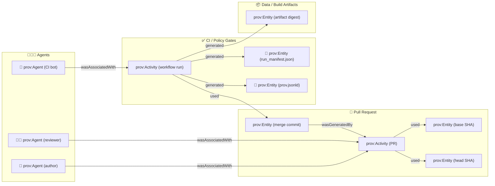

<!-- Path: mcp/dev_prov/examples/05_github_pr_to_prov/out/summary.md -->

> According to a document from **2026-01-21**, KFM treats provenance as a first-class, queryable graph concern — this example turns **GitHub Pull Requests** into **PROV(-O)** so dev history is auditable end-to-end.  [oai_citation:0‡🌟 Kansas Frontier Matrix – Latest Ideas & Future Proposals.docx.pdf](file-service://file-SQ3f7ve8SGiusT6ThZEuCe) [oai_citation:1‡📚 Kansas Frontier Matrix (KFM) Data Intake – Technical & Design Guide.pdf](file-service://file-EbUCdsJMbu5KwpoKMrLrgj)

# Example 05 — GitHub PR ➜ PROV (Dev Provenance) 🧾🔗


> [!TIP]
> If you remember only one idea: **“Nothing goes straight to production — everything funnels into a PR (and therefore into provenance).”**  [oai_citation:2‡Kansas Frontier Matrix (KFM) – AI System Overview 🧭🤖.pdf](file-service://file-Pv8eev6RWvCKrGCXyzY7zg)

---

## 🧭 What this example does

This example **models a GitHub Pull Request as provenance**:

- ✅ **PR = `prov:Activity`** (a concrete “change event” in the dev lifecycle)  [oai_citation:3‡🌟 Kansas Frontier Matrix – Latest Ideas & Future Proposals.docx.pdf](file-service://file-SQ3f7ve8SGiusT6ThZEuCe)
- ✅ **Commits / files / artifacts = `prov:Entity`** (what changed / what was produced)  [oai_citation:4‡🌟 Kansas Frontier Matrix – Latest Ideas & Future Proposals.docx.pdf](file-service://file-SQ3f7ve8SGiusT6ThZEuCe)
- ✅ **Author / reviewers / bots = `prov:Agent`** (who did / approved / executed)  [oai_citation:5‡🌟 Kansas Frontier Matrix – Latest Ideas & Future Proposals.docx.pdf](file-service://file-SQ3f7ve8SGiusT6ThZEuCe)
- ✅ **Merge + CI checks become provenance edges** so we can ask:  
  “Which code version produced this dataset and who reviewed the change?”  [oai_citation:6‡🌟 Kansas Frontier Matrix – Latest Ideas & Future Proposals.docx.pdf](file-service://file-SQ3f7ve8SGiusT6ThZEuCe)

This matches KFM’s “evidence-first” posture: **missing PROV, broken links, or secrets must fail the build**, and policy results are reported in CI.  [oai_citation:7‡📚 Kansas Frontier Matrix (KFM) Data Intake – Technical & Design Guide.pdf](file-service://file-EbUCdsJMbu5KwpoKMrLrgj)

---

## 🧪 Run snapshot (fill-in by generator)

> [!NOTE]
> If this file is generated automatically, these fields should be populated from the PR payload + CI context.

| Field | Value |
|---|---|
| 🧩 Repository | `<owner>/<repo>` |
| 🔢 PR | `#<number>` |
| 🌿 Head SHA | `<sha>` |
| 🧷 Base SHA | `<sha>` |
| 👤 Author | `<login>` |
| 🕵️ Reviewers | `<login>, <login>` |
| 🧰 CI run_id | `<run_id>` |
| 🕒 Captured at | `<ISO-8601 timestamp>` |

---

## 🗂️ Expected `out/` artifacts

KFM’s broader docs emphasize **deterministic, traceable outputs** and treating derived artifacts as governed outputs.  [oai_citation:8‡📚 Kansas Frontier Matrix (KFM) Data Intake – Technical & Design Guide.pdf](file-service://file-EbUCdsJMbu5KwpoKMrLrgj)

```text
📁 mcp/dev_prov/examples/05_github_pr_to_prov/out/
├─ 📝 summary.md                👈 (this file)
├─ 🧾 run_manifest.json         👈 audit trail + policy input (canonical digest)
├─ 🧬 prov.jsonld               👈 PROV JSON-LD bundle for the PR
├─ 🧩 prov.normalized.json      👈 optional canonicalized form (stable hashing)
├─ 🧠 neo4j_import.cypher       👈 optional “MERGE” graph loader
└─ 🔏 attestations/             👈 optional supply-chain proofs (cosign/in-toto)
```

Why `run_manifest.json` matters:

- Each run produces a **structured manifest** (who/what/when, sources/outputs, tool versions, counts/errors).  [oai_citation:9‡Additional Project Ideas.pdf](file-service://file-Pc2GNivcrHBeKjBQksLC3T)
- The manifest is canonicalized (RFC 8785) and hashed (SHA-256) to create an **idempotency key** and immutable run identifier that can be referenced in PROV and Neo4j.  [oai_citation:10‡Additional Project Ideas.pdf](file-service://file-Pc2GNivcrHBeKjBQksLC3T)

---

## 🔁 GitHub ➜ PROV mapping (minimal but sufficient)

> [!IMPORTANT]
> Keep it **boring and consistent**: stable IDs, stable edge semantics, stable normalization. That’s what makes lineage queryable later.  [oai_citation:11‡🌟 Kansas Frontier Matrix – Latest Ideas & Future Proposals.docx.pdf](file-service://file-SQ3f7ve8SGiusT6ThZEuCe)

| GitHub concept | PROV concept | Suggested identifier pattern |
|---|---|---|
| Pull Request | `prov:Activity` | `urn:github:pr:<owner>/<repo>#<num>` |
| PR author | `prov:Agent` | `urn:github:user:<login>` |
| Reviewer | `prov:Agent` | `urn:github:user:<login>` |
| PR branch head | `prov:Entity` | `urn:git:commit:<sha>` |
| Files changed | `prov:Entity` | `urn:git:path:<repo>@<sha>:<path>` |
| CI workflow run | `prov:Activity` | `urn:ci:run:<provider>:<run_id>` |
| Merge commit | `prov:Entity` | `urn:git:commit:<merge_sha>` |
| Produced artifacts (datasets, tiles, etc.) | `prov:Entity` | `urn:kfm:artifact:<type>:<digest>` |

Core edges (typical):

- `prov:wasAssociatedWith(PR_Activity, Author_Agent)`  
- `prov:used(PR_Activity, Base_Commit_Entity)`  
- `prov:used(PR_Activity, Head_Commit_Entity)`  
- `prov:wasGeneratedBy(Merge_Commit_Entity, PR_Activity)`  
- `prov:wasAssociatedWith(CI_Activity, CI_Agent)`  
- `prov:used(CI_Activity, Merge_Commit_Entity)`  
- `prov:wasGeneratedBy(Artifact_Entity, CI_Activity)`

> KFM explicitly calls out **PR → PROV graph integration** and the idea of ingesting “development history” into Neo4j for traceability.  [oai_citation:12‡🌟 Kansas Frontier Matrix – Latest Ideas & Future Proposals.docx.pdf](file-service://file-SQ3f7ve8SGiusT6ThZEuCe)

---

## 🧠 Graph sketch



---

## ✅ Integrity invariants (the point of this example)

KFM’s “PR → PROV” idea is explicitly paired with **invariants** that can fail CI if lineage is broken — e.g., “missing merge commit node” or “incorrect derivation,” so provenance stays trustworthy.  [oai_citation:13‡🌟 Kansas Frontier Matrix – Latest Ideas & Future Proposals.docx.pdf](file-service://file-SQ3f7ve8SGiusT6ThZEuCe)

Recommended invariants to enforce in this example:

1. **Stable identifiers** for PR, commits, agents.
2. **PR Activity must reference** base + head SHA entities.
3. **Merge commit entity must exist** and be linked to PR Activity.
4. **CI/Policy Activity must exist**, must reference run manifest.
5. **Policy gates must be fail-closed** (no “soft allow” by default).  [oai_citation:14‡Additional Project Ideas.pdf](file-service://file-Pc2GNivcrHBeKjBQksLC3T) [oai_citation:15‡📚 Kansas Frontier Matrix (KFM) Data Intake – Technical & Design Guide.pdf](file-service://file-EbUCdsJMbu5KwpoKMrLrgj)
6. **Missing PROV fails build** (treat as required metadata).  [oai_citation:16‡Kansas Frontier Matrix (KFM) – Comprehensive Technical Documentation.pdf](file-service://file-AkqwUuYPp5zePf7pv5SMxi) [oai_citation:17‡📚 Kansas Frontier Matrix (KFM) Data Intake – Technical & Design Guide.pdf](file-service://file-EbUCdsJMbu5KwpoKMrLrgj)

---

## 🛡️ Policy gating (OPA + Conftest)

KFM’s governance model uses a **Policy Pack** with OPA/Rego rules executed via **Conftest**, run automatically on PRs in CI.  [oai_citation:18‡📚 Kansas Frontier Matrix (KFM) Data Intake – Technical & Design Guide.pdf](file-service://file-EbUCdsJMbu5KwpoKMrLrgj)

Patterns we align to in this example:

- Run Conftest against PR payload + changed files + `run_manifest.json`.
- Emit **deny** messages with stable IDs (e.g., `KFM-PROV-001`) and remediation hints.  [oai_citation:19‡📚 Kansas Frontier Matrix (KFM) Data Intake – Technical & Design Guide.pdf](file-service://file-EbUCdsJMbu5KwpoKMrLrgj)
- Example policy intents:
  - Require dataset license/provider fields.
  - Prevent committing obvious secrets (regex scans).
  - Require provenance records when publishing data.  [oai_citation:20‡Additional Project Ideas.pdf](file-service://file-Pc2GNivcrHBeKjBQksLC3T)

> [!WARNING]
> “Failing closed” is not a suggestion — it’s a design stance. If provenance is missing, block the merge.  [oai_citation:21‡📚 Kansas Frontier Matrix (KFM) Data Intake – Technical & Design Guide.pdf](file-service://file-EbUCdsJMbu5KwpoKMrLrgj) [oai_citation:22‡Additional Project Ideas.pdf](file-service://file-Pc2GNivcrHBeKjBQksLC3T)

---

## 🧬 PROV JSON-LD skeleton (PR-focused)

This is intentionally compact; extend as needed.

```json
{
  "@context": "https://www.w3.org/ns/prov.jsonld",
  "agent": {
    "urn:github:user:AUTHOR": { "prov:type": "prov:Agent", "prov:label": "AUTHOR" },
    "urn:github:user:REVIEWER": { "prov:type": "prov:Agent", "prov:label": "REVIEWER" },
    "urn:ci:agent:github-actions": { "prov:type": "prov:Agent", "prov:label": "GitHub Actions" }
  },
  "entity": {
    "urn:git:commit:BASE_SHA": { "prov:type": "prov:Entity", "prov:label": "base commit" },
    "urn:git:commit:HEAD_SHA": { "prov:type": "prov:Entity", "prov:label": "head commit" },
    "urn:git:commit:MERGE_SHA": { "prov:type": "prov:Entity", "prov:label": "merge commit" },
    "urn:kfm:run_manifest:RUN_ID": { "prov:type": "prov:Entity", "prov:label": "run_manifest.json" }
  },
  "activity": {
    "urn:github:pr:OWNER/REPO#PR_NUM": {
      "prov:type": "prov:Activity",
      "prov:label": "GitHub Pull Request",
      "prov:startTime": "START_TIME",
      "prov:endTime": "MERGED_TIME"
    },
    "urn:ci:run:github-actions:RUN_ID": {
      "prov:type": "prov:Activity",
      "prov:label": "CI / Policy Gates",
      "prov:startTime": "CI_START",
      "prov:endTime": "CI_END"
    }
  },
  "used": [
    { "prov:activity": "urn:github:pr:OWNER/REPO#PR_NUM", "prov:entity": "urn:git:commit:BASE_SHA" },
    { "prov:activity": "urn:github:pr:OWNER/REPO#PR_NUM", "prov:entity": "urn:git:commit:HEAD_SHA" },
    { "prov:activity": "urn:ci:run:github-actions:RUN_ID", "prov:entity": "urn:git:commit:MERGE_SHA" },
    { "prov:activity": "urn:ci:run:github-actions:RUN_ID", "prov:entity": "urn:kfm:run_manifest:RUN_ID" }
  ],
  "wasGeneratedBy": [
    { "prov:entity": "urn:git:commit:MERGE_SHA", "prov:activity": "urn:github:pr:OWNER/REPO#PR_NUM" }
  ],
  "wasAssociatedWith": [
    { "prov:activity": "urn:github:pr:OWNER/REPO#PR_NUM", "prov:agent": "urn:github:user:AUTHOR" },
    { "prov:activity": "urn:github:pr:OWNER/REPO#PR_NUM", "prov:agent": "urn:github:user:REVIEWER" },
    { "prov:activity": "urn:ci:run:github-actions:RUN_ID", "prov:agent": "urn:ci:agent:github-actions" }
  ]
}
```

KFM also treats PROV as mandatory for publishing and notes it can be ingested into Neo4j to create lineage links for interactive querying.  [oai_citation:23‡📚 Kansas Frontier Matrix (KFM) Data Intake – Technical & Design Guide.pdf](file-service://file-EbUCdsJMbu5KwpoKMrLrgj)

---

## 🧩 Neo4j usage (why we bother)

Once PR history is in Neo4j, we can query dev lineage the same way we query data lineage — supporting KFM’s “map behind the map” idea and evidence-driven UX.  [oai_citation:24‡Kansas Frontier Matrix – Comprehensive UI System Overview.pdf](file-service://file-KcBQruYcoFVDEixzzRHTwt) [oai_citation:25‡Kansas Frontier Matrix – Comprehensive UI System Overview.pdf](file-service://file-KcBQruYcoFVDEixzzRHTwt)

Example question types KFM explicitly wants to support:

- “Which code version produced this dataset and who reviewed the change?”  [oai_citation:26‡🌟 Kansas Frontier Matrix – Latest Ideas & Future Proposals.docx.pdf](file-service://file-SQ3f7ve8SGiusT6ThZEuCe)

> [!EXAMPLE]
> Cypher-ish query idea (illustrative):
>
> ```cypher
> // given artifact digest, trace back to the PR + reviewers
> MATCH (a:Artifact {digest:$digest})<-[:GENERATED]-(ci:CI_RUN)
> MATCH (ci)-[:USED]->(m:Commit)
> MATCH (m)-[:GENERATED_BY]->(pr:PullRequest)
> MATCH (pr)-[:ASSOCIATED_WITH]->(reviewer:Agent {role:"reviewer"})
> RETURN pr.number, pr.title, collect(reviewer.login) AS reviewers, ci.run_id;
> ```

---

## 🧷 How this plugs into KFM UX (the “so what”)

KFM’s UI and AI features are designed to **surface provenance and citations constantly**, not bury them.  [oai_citation:27‡Kansas Frontier Matrix – Comprehensive UI System Overview.pdf](file-service://file-KcBQruYcoFVDEixzzRHTwt)

This PR→PROV example supports:

- 🔎 **Focus Mode citations + auditability** (every answer links back to sources, and even dynamic queries log PROV inputs).  [oai_citation:28‡📚 Kansas Frontier Matrix (KFM) Data Intake – Technical & Design Guide.pdf](file-service://file-EbUCdsJMbu5KwpoKMrLrgj)
- 🧩 **Story Nodes with evidence manifests**: narratives can ship with a citations block + machine-readable manifest + embedded PROV JSON-LD.  [oai_citation:29‡Additional Project Ideas.pdf](file-service://file-Pc2GNivcrHBeKjBQksLC3T)
- ⚡ **Pulse Threads**: short, timely narratives still attach provenance metadata and evidence manifests.  [oai_citation:30‡Additional Project Ideas.pdf](file-service://file-Pc2GNivcrHBeKjBQksLC3T) [oai_citation:31‡Additional Project Ideas.pdf](file-service://file-Pc2GNivcrHBeKjBQksLC3T)
- 🧠 **Conceptual Attention Nodes**: curated concept hubs that guide retrieval/narrative generation (and can be made transparent in the UI).  [oai_citation:32‡Additional Project Ideas.pdf](file-service://file-Pc2GNivcrHBeKjBQksLC3T) [oai_citation:33‡Additional Project Ideas.pdf](file-service://file-Pc2GNivcrHBeKjBQksLC3T)

And it fits the contribution workflow: new data/stories are expected to flow through Git + PR review/ingestion.  [oai_citation:34‡Kansas Frontier Matrix – Comprehensive UI System Overview.pdf](file-service://file-KcBQruYcoFVDEixzzRHTwt)

---

## 📦 Optional: OCI artifact signing + PROV attachments

KFM proposes treating data artifacts like container artifacts (OCI/ORAS) and using **Cosign** for signing; PROV JSON-LD can be attached as a referrer so artifacts carry provenance “certificates of origin.”  [oai_citation:35‡Additional Project Ideas.pdf](file-service://file-Pc2GNivcrHBeKjBQksLC3T) [oai_citation:36‡Additional Project Ideas.pdf](file-service://file-Pc2GNivcrHBeKjBQksLC3T)

If you implement this here, the minimal pattern is:

1. Build artifact → compute content digest
2. Push to OCI registry
3. Attach `prov.jsonld` as a referrer
4. Sign with Cosign

---

## 🧱 Contract-first reminder (keeps this boring + scalable)

KFM stresses a **contract-first** approach: data/system components defined by explicit interfaces and validated in CI; missing DCAT/PROV should fail.  [oai_citation:37‡Kansas Frontier Matrix (KFM) – Comprehensive Technical Documentation.pdf](file-service://file-AkqwUuYPp5zePf7pv5SMxi)

This example is intentionally aligned to that: treat PR provenance as a strict contract, not a “best effort”.

---

## 📚 Project files used (core)

> [!NOTE]
> These are the primary design sources this summary aligns to.

-  [oai_citation:38‡Kansas Frontier Matrix – Comprehensive UI System Overview.pdf](file-service://file-KcBQruYcoFVDEixzzRHTwt) Kansas Frontier Matrix – Comprehensive UI System Overview  
-  [oai_citation:39‡📚 Kansas Frontier Matrix (KFM) Data Intake – Technical & Design Guide.pdf](file-service://file-EbUCdsJMbu5KwpoKMrLrgj) 📚 Kansas Frontier Matrix (KFM) Data Intake – Technical & Design Guide  
-  [oai_citation:40‡Innovative Concepts to Evolve the Kansas Frontier Matrix (KFM).pdf](file-service://file-G71zNoWKxsoSW44iwZaaCC) Innovative Concepts to Evolve the Kansas Frontier Matrix (KFM)  
-  [oai_citation:41‡Additional Project Ideas.pdf](file-service://file-Pc2GNivcrHBeKjBQksLC3T) Document Refinement Request (Pulse Ideas / Additional Project Ideas)

Additional KFM docs referenced:

-  [oai_citation:42‡Kansas Frontier Matrix (KFM) – Comprehensive Technical Documentation.pdf](file-service://file-AkqwUuYPp5zePf7pv5SMxi) Kansas Frontier Matrix (KFM) – Comprehensive Technical Documentation  
-  [oai_citation:43‡Kansas Frontier Matrix (KFM) – Comprehensive Architecture, Features, and Design.pdf](file-service://file-4Umt1yHoGKicdmLWzFJ9sC) Kansas Frontier Matrix (KFM) – Comprehensive Architecture, Features, and Design  
-  [oai_citation:44‡Kansas Frontier Matrix (KFM) – AI System Overview 🧭🤖.pdf](file-service://file-Pv8eev6RWvCKrGCXyzY7zg) Kansas Frontier Matrix (KFM) – AI System Overview 🧭🤖  
-  [oai_citation:45‡🌟 Kansas Frontier Matrix – Latest Ideas & Future Proposals.docx.pdf](file-service://file-SQ3f7ve8SGiusT6ThZEuCe) 🌟 Kansas Frontier Matrix – Latest Ideas & Future Proposals  
-  [oai_citation:46‡Innovative Concepts to Evolve the Kansas Frontier Matrix (KFM).pdf](file-service://file-G71zNoWKxsoSW44iwZaaCC) Innovative Concepts to Evolve the Kansas Frontier Matrix (KFM)  
-  [oai_citation:47‡Additional Project Ideas.pdf](file-service://file-Pc2GNivcrHBeKjBQksLC3T) Additional Project Ideas

---

## 📚 Project files used (reference libraries / PDF portfolios)

These portfolios are part of the project’s “toolbox” for implementation depth:

-  [oai_citation:48‡AI Concepts & more.pdf](file-service://file-K6BctJjeUwvyCahLf9qdwr) AI Concepts & more (PDF portfolio)
-  [oai_citation:49‡Data Managment-Theories-Architures-Data Science-Baysian Methods-Some Programming Ideas.pdf](file-service://file-RrXMFY7cP925exsQYermf2) Data Management / Data Science / Bayesian Methods (PDF portfolio)
-  [oai_citation:50‡Maps-GoogleMaps-VirtualWorlds-Archaeological-Computer Graphics-Geospatial-webgl.pdf](file-service://file-RshcX5sNY2wpiNjRfoP6z6) Maps / Google Maps / Virtual Worlds / WebGL (PDF portfolio)
-  [oai_citation:51‡Various programming langurages & resources 1.pdf](file-service://file-4wp3wSSZs7gk5qHWaJVudi) Various programming languages & resources (PDF portfolio)

---

## 🧩 Closing note

This example isn’t “just logging” — it’s the foundation for **queryable trust** across KFM:
PR history + CI gates + run manifests + PROV graphs → the UI can always answer **why something exists**, **who approved it**, and **what evidence supports it**.  [oai_citation:52‡Kansas Frontier Matrix – Comprehensive UI System Overview.pdf](file-service://file-KcBQruYcoFVDEixzzRHTwt) [oai_citation:53‡🌟 Kansas Frontier Matrix – Latest Ideas & Future Proposals.docx.pdf](file-service://file-SQ3f7ve8SGiusT6ThZEuCe)
