# 🧠🧾 Example 06 — Focus Mode Answer Log (dev_prov)

**Path:** `mcp/dev_prov/examples/06_focus_mode_answer_log/README.md`  
**Goal:** Make every Focus Mode answer **auditable, reproducible, and provenance-linked** — not just “helpful.” ✅

> [!IMPORTANT]
> In KFM, **Focus Mode is a hard-gated experience**: no unsourced narrative, no uncataloged content, and AI contributions must be **opt‑in + explicitly labeled**. This example shows how to **log** those guarantees as a first‑class artifact.

---

## 🧭 What this example demonstrates

This example defines a **Focus Mode Answer Log** record shape and workflow that captures:

- 🗣️ **The user’s question** (and minimal safe context)
- 🗺️ **UI context** (map + timeline + active layers) — enough to reproduce the retrieval intent
- 🔎 **Evidence bundle** (IDs/URIs into STAC/DCAT/PROV + graph entity IDs)
- ✍️ **The answer** as Markdown **with footnote citations**
- 🛡️ **Governance decisions** (policy checks, sensitivity/classification handling)
- ⛓️ **Tamper-evidence** (canonical JSON digest + chaining hooks for an append-only ledger)
- 🧬 **PROV linkage** (answer entity ← generatedBy activity ← used evidence entities)

Think of it as “**run_manifest.json for answers**,” but aligned to Focus Mode’s trust rules.

---

## 🎯 Why an “answer log” exists (KFM mindset)

KFM treats AI output like **data**, not vibes:

- 📌 If it’s shown in UI, it should be traceable to **cataloged evidence** (STAC/DCAT/PROV).
- 🧾 If it’s traceable, it can be **audited** later (by a person or machine).
- 🧪 If it’s audited, we can detect **drift**, **bias**, missing citations, or policy regressions.
- 🧠 If it’s AI-assisted, it must be **transparent** (opt-in, labeled, confidence shown).

---

## 🗺️ Where this fits in the KFM pipeline

```mermaid
flowchart LR
  A[⚙️ ETL + Normalization] --> B[📚 STAC DCAT PROV Catalogs]
  B --> C[🕸️ Knowledge Graph + 🔎 Index]
  C --> D[🔌 Governed API Layer]
  D --> E[🗺️ UI - Map + Timeline]
  E --> F[📖 Story Nodes]
  F --> G[🤖 Focus Mode Q and A]
  G --> H[🧾 Answer Log - this example]
  H --> I[⛓️ Governance Ledger - audit store]
  H --> J[🧬 PROV Bundle - answer lineage]
```



---

## ✅ Definition of Done for a valid log entry

A Focus Mode answer log entry is **valid** only if all are true:

- ✅ Answer contains **citations** for factual claims (footnotes or inline reference keys)
- ✅ Every citation resolves to **cataloged** sources (or explicitly marked “external + cataloged”)
- ✅ A **governance check** ran (and its decision is recorded)
- ✅ Any AI-generated content is clearly labeled as such (or the entry is rejected)
- ✅ Sensitive info handling is enforced (no “side-channel” leakage)
- ✅ Entry is **deterministically hashable** (canonicalization + digest)
- ✅ Entry is appended to an **append-only** store (file/DB/ledger), not overwritten

---

## 🧾 Answer Log record (high-level contract)

> [!NOTE]
> This is intentionally language-agnostic. Implement in TS/JS, Python, Go, etc. The contract is the invariant 🧱

### Core fields (recommended)

| Field | Type | Purpose |
|---|---:|---|
| `event_type` | string | `"focus_mode.answer"` |
| `schema_version` | string | e.g. `"1.0.0"` |
| `event_id` | string | ULID/UUID |
| `ts` | string | ISO 8601 timestamp |
| `actor` | object | user hash + role + agent identity |
| `question` | string | user question text |
| `ui_context` | object | map/timeline/layers context (bounded + safe) |
| `evidence` | array | evidence items (STAC/DCAT/PROV + graph IDs) |
| `answer_md` | string | Markdown answer with citations |
| `citations` | array | structured citation list (IDs + targets) |
| `policy` | object | OPA/Policy Pack decision summary |
| `prov` | object | PROV bundle ref (or inline JSON-LD) |
| `hashes` | object | canonical digest + chaining fields |
| `telemetry` | object | trace/span IDs + perf/energy (if available) |

---

## 🧩 Recommended data shapes

### 1) `ui_context` (minimal but reproducible)

Capture enough to re-run retrieval, **not** enough to leak sensitive coordinates.

```json
{
  "map": {
    "center": [-96.5, 38.5],
    "zoom": 7,
    "bbox": [-102.1, 36.9, -94.6, 40.1]
  },
  "timeline": {
    "cursor_year": 1935,
    "range": [1930, 1940]
  },
  "active_layers": [
    "layer:drought_index_v1",
    "layer:county_boundaries_v3"
  ],
  "selected_graph_entities": [
    "graph:Place:ScottCountyKS"
  ]
}
```

### 2) `evidence[]` (the “evidence triplet” friendly form)

Each evidence item should carry cross-links (where available):

- 🛰️ STAC (asset-level)
- 🧾 DCAT (dataset discovery/distribution)
- 🧬 PROV (lineage/activity)
- 🕸️ Graph entity IDs (relationships + context)

```json
{
  "evidence_id": "E1",
  "title": "USGS Real-time Water Data — Kansas River (Topeka gauge)",
  "dcat_dataset_id": "dcat:usgs-nwis-realtime-water",
  "stac_item_id": "stac:river_gauge_topeka_latest",
  "prov_entity_id": "prov:Entity:reading_2026-01-21T20:00:00Z",
  "graph_entity_ids": ["graph:SensorStation:TopekaGauge"],
  "retrieved_via": {
    "method": "api_query",
    "endpoint_ref": "api:/stations/topeka/latest"
  }
}
```

### 3) `citations[]` (UI-ready citation block)

These drive:

- footnotes in the answer
- “View Evidence” panels
- export bundles

```json
{
  "cite_key": "C1",
  "evidence_id": "E1",
  "locator": {
    "type": "api_snapshot",
    "at": "2026-01-21T20:00:00Z"
  },
  "checksum": "sha256:__OPTIONAL__"
}
```

---

## ✍️ Example answer format (Markdown + footnotes)

```md
As of **8:00 PM (local station time)** on **2026‑01‑21**, the Kansas River level at **Topeka** was **X feet**.[^C1]

**How this was computed:** This value was retrieved from the latest gauge reading available via the governed API snapshot at that timestamp.[^C1]

[^C1]: USGS Real‑time Water Data (DCAT: `dcat:usgs-nwis-realtime-water`) + station snapshot (STAC: `stac:river_gauge_topeka_latest`).
```

> [!TIP]
> Keep the human-readable footnote, but always keep the structured `citations[]` too.

---

## 🧬 PROV: recording “Answer ← used Evidence ← generatedBy Activity”

Minimum viable PROV pattern:

- `Answer` is a `prov:Entity`
- `FocusModeInvocation` is a `prov:Activity`
- Evidence items are `prov:Entity` (or point to them)
- Associate with an `prov:Agent` (FocusMode version, and optionally a hashed user agent)

```json
{
  "@context": {
    "prov": "http://www.w3.org/ns/prov#",
    "kfm": "urn:kfm:"
  },
  "@id": "kfm:prov_bundle:focus_mode_answer:01J2...",
  "@type": "prov:Bundle",
  "prov:entity": {
    "kfm:answer:01J2...": {
      "prov:type": "kfm:FocusModeAnswer",
      "prov:value": "sha256:__answer_md_digest__"
    },
    "kfm:evidence:E1": {
      "prov:type": "kfm:EvidenceEntity",
      "prov:value": "prov:Entity:reading_2026-01-21T20:00:00Z"
    }
  },
  "prov:activity": {
    "kfm:activity:focus_mode_invocation:01J2...": {
      "prov:type": "kfm:FocusModeInvocation",
      "prov:used": ["kfm:evidence:E1"],
      "prov:generated": ["kfm:answer:01J2..."]
    }
  },
  "prov:agent": {
    "kfm:agent:focus_mode:v1": {
      "prov:type": "kfm:SoftwareAgent"
    }
  }
}
```

---

## 🛡️ Governance + Policy Pack integration (OPA / Conftest style)

A log entry should record **what was checked** and **what happened**:

- ✅ passed/failed
- 🧾 rule identifiers
- 🧯 sensitivity flags / redactions applied
- 🚫 refusal reasons (if denied)

```json
{
  "policy": {
    "engine": "OPA",
    "bundle_version": "policy_pack@2026-01-21",
    "decision": "allow",
    "rules_checked": [
      "focus_mode.requires_citations",
      "focus_mode.no_sensitive_location_leaks",
      "focus_mode.ai_opt_in_required"
    ],
    "flags": []
  }
}
```

If denied:

```json
{
  "policy": {
    "decision": "deny",
    "flags": ["missing_citations"],
    "user_message": "I can’t answer that without a source from the KFM catalogs."
  }
}
```

---

## 🔒 Prompt security + “safe logging” rules

**Never** treat logs as harmless. Logs can become a leakage vector.

Recommended guardrails:

- 🧼 store **hashed user refs** (not raw identifiers)
- 🧯 redact or generalize sensitive coordinates
- 🧷 store query plans as **hashes** if they contain secrets or internal structure
- 🧱 keep “prompt” fields behind higher classification or omit entirely

```json
{
  "actor": {
    "user_ref": "user_sha256:__hash__",
    "role": "public",
    "agent": "focus_mode",
    "agent_version": "v1"
  },
  "prompt_security": {
    "prompt_gate": "enabled",
    "input_sanitized": true,
    "suspected_injection": false,
    "redactions": []
  }
}
```

---

## ⛓️ Tamper-evidence: canonical JSON + digest (ledger-friendly)

To make entries verifiable:

1) Canonicalize the JSON (RFC 8785 style normalization)  
2) Compute `sha256` over canonical bytes  
3) Store the digest in the entry  
4) (Optional) chain with `prev_hash` for append-only integrity

```json
{
  "hashes": {
    "canonical_digest": "sha256:__digest__",
    "prev_hash": "sha256:__previous_entry_digest__"
  }
}
```

> [!NOTE]
> This mirrors KFM’s “run manifest” philosophy: deterministic, idempotent, and self-fingerprinting.

---

## 🧪 Validation checklist (CI + runtime)

Suggested automated checks:

- 🧾 **Citation coverage:** every claim has a cite marker OR is explicitly labeled as inference
- 🔗 **Resolution:** each `dcat_dataset_id` / `stac_item_id` / `prov_entity_id` exists (or is explicitly external + cataloged)
- 🛡️ **Policy pass:** deny if missing citations, or if sensitivity rules trigger a block
- 🧬 **PROV completeness:** answer entity exists, activity exists, `used` contains evidence IDs
- 🔐 **No secrets:** scan for key-like patterns (tokens, API keys) in logs
- ⛓️ **Digest correctness:** recompute and verify `canonical_digest`
- 📈 **Telemetry presence (optional):** trace IDs exist when instrumentation is enabled

---

## 🖥️ UI integration hooks (what the UI can do with this)

Once you have this log format, the UI can:

- 🧾 render a tiny **citation block** under the answer
- 🔍 “View Evidence” drawer: list each `citations[]` item → open dataset card
- 🧬 show “Why this answer?” in an **audit panel** (top evidence + governance flags)
- 📦 export a **shareable bundle** (answer + evidence manifest + PROV bundle)
- 🧯 show sensitivity behavior (“coordinates generalized”) as a transparent UX affordance

---

## 🚀 Extensions (future-friendly)

These align with “Latest Ideas / Future Proposals” direction:

- 📦 Store answer logs as **OCI artifacts** (ORAS) and sign them (Cosign)
- 🧾 Attach PROV JSON-LD as an artifact referrer
- 🧪 Emit **OpenTelemetry** spans (trace_id/span_id) + energy metrics
- 🧠 Convert repeated Q&A patterns into:
  - 🧵 “Pulse Threads”
  - 🪢 “Conceptual Attention Nodes”
  - 🔎 narrative pattern detection signals
- 🔄 Map to OpenLineage-style run events (optional interoperability)

---

## 📚 Project file map (how “all project files” feed this example)

| 📄 Project file | 🧩 How it informs this Answer Log |
|---|---|
| `Kansas Frontier Matrix (KFM) – AI System Overview 🧭🤖.pdf` | Focus Mode flow: retrieval → LLM → governance check → cited answer; audit panel concept |
| `📚 Kansas Frontier Matrix (KFM) Data Intake – Technical & Design Guide.pdf` | Evidence-backed answers, logging to governance ledger, PROV pattern for answers (including real-time snapshots) |
| `Kansas Frontier Matrix (KFM) – Comprehensive Architecture, Features, and Design.pdf` | Policy Pack direction, prompt security (“Prompt Gate”), supply chain/security posture |
| `Kansas Frontier Matrix – Comprehensive UI System Overview.pdf` | Story/Focus UI layout, citations UX, narrative playback expectations |
| `Kansas Frontier Matrix (KFM) – Comprehensive Technical Documentation.pdf` | Advisory-only AI, required citations, AI labeling, refusal + sensitive info handling |
| `Innovative Concepts to Evolve the Kansas Frontier Matrix (KFM).pdf` | Trust/innovation themes that motivate explainability + accountability |
| `🌟 Kansas Frontier Matrix – Latest Ideas & Future Proposals.docx.pdf` | Policy Pack packaging, telemetry + sustainability checks, CI governance patterns |
| `Additional Project Ideas.pdf` | Run manifest schema, RFC8785 canonical hashing, policy-as-code + fail-closed gates, evidence manifests |
| `AI Concepts & more.pdf` | General AI background to support guardrails + evaluation thinking |
| `Data Managment-Theories-Architures-Data Science-Baysian Methods-Some Programming Ideas.pdf` | Broader data/lineage architecture framing (design backdrop) |
| `Maps-GoogleMaps-VirtualWorlds-Archaeological-Computer Graphics-Geospatial-webgl.pdf` | Geospatial visualization + mapping context (design backdrop) |
| `Various programming langurages & resources 1.pdf` | Multi-language implementation support (engineering backdrop) |
| `KFM- python-geospatial-analysis-cookbook-...pdf` | Practical GeoJSON + API patterns and server-side logging practices |
| `Data Mining Concepts and Techniques.pdf` | General data auditing/traceability mindset (engineering backdrop) |
| `MARKDOWN_GUIDE_v13.md.gdoc` | Contract-first + evidence-first invariants; Focus Mode hard gate rules |

---

## 🤝 Contributing notes (keep it governed)

- 🧱 If you change the log shape, treat it like a **contract**: version it (`schema_version`) and add compatibility notes.
- 🛡️ If you add new logged fields, run the **policy gates** and consider sovereignty/sensitivity implications.
- 🧬 Always ensure new answer artifacts remain **catalog + PROV compatible**.

---

**Done right, this turns “AI answers” into auditable, evidence-linked data artifacts — the core KFM promise.** ✅🧾⛓️
