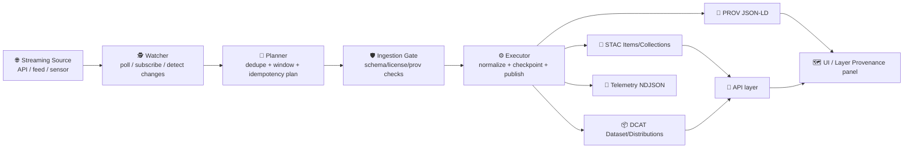

# 07️⃣ Streaming Ingest Stub + Provenance (dev_prov) 🛰️🧾


> [!IMPORTANT]  
> This is an **example scaffold / stub**. It’s meant to demonstrate **shape + contracts**: streaming ingest treated as many small datasets over time, **append-only** windowing, **PROV per fetch**, and **provenance-first publishing** (even “real-time” layers need a stub provenance record before UI/graph use). [oai_citation:0‡📚 Kansas Frontier Matrix (KFM) Data Intake – Technical & Design Guide.pdf](file-service://file-EbUCdsJMbu5KwpoKMrLrgj) [oai_citation:1‡📚 Kansas Frontier Matrix (KFM) Data Intake – Technical & Design Guide.pdf](file-service://file-EbUCdsJMbu5KwpoKMrLrgj)

---

## 🔎 What this example is for

KFM’s north star is: **no mystery layers** — anything that appears in the UI (or informs Focus Mode) must be **cataloged, contract-first, and provenance-first**. [oai_citation:2‡Kansas Frontier Matrix (KFM) – Comprehensive Technical Documentation.pdf](file-service://file-AkqwUuYPp5zePf7pv5SMxi)

This example shows how to implement that rule for *streaming* sources:

- **Streaming ≈ “many small datasets over time”** (not a special case that bypasses governance). [oai_citation:3‡📚 Kansas Frontier Matrix (KFM) Data Intake – Technical & Design Guide.pdf](file-service://file-EbUCdsJMbu5KwpoKMrLrgj)
- **Append-only + windowing** (checkpoint observations into day/hour/year buckets; never silently rewrite history). [oai_citation:4‡📚 Kansas Frontier Matrix (KFM) Data Intake – Technical & Design Guide.pdf](file-service://file-EbUCdsJMbu5KwpoKMrLrgj)
- **PROV captured continuously** (each fetch can be a PROV Activity with a pipeline Agent; each observation is an Entity). [oai_citation:5‡📚 Kansas Frontier Matrix (KFM) Data Intake – Technical & Design Guide.pdf](file-service://file-EbUCdsJMbu5KwpoKMrLrgj)
- **Telemetry** recorded as an **append-only NDJSON ledger** for auditing + dashboards. [oai_citation:6‡📚 Kansas Frontier Matrix (KFM) Data Intake – Technical & Design Guide.pdf](file-service://file-EbUCdsJMbu5KwpoKMrLrgj)

---

## 🧭 Quick navigation

- 🧱 [Architecture](#-architecture-at-a-glance)
- 🗂️ [Directory layout](#️-directory-layout)
- 🚀 [Quickstart](#-quickstart)
- 🧾 [Provenance model](#-provenance-model)
- 🧪 [Run manifest](#-run-manifest-audit-trail)
- 🛡️ [Policy gates](#️-policy-gates-fail-closed)
- 📦 [Optional: OCI artifact publishing](#-optional-oci-artifact-publishing)
- 🗺️ [KFM integration notes](#️-kfm-integration-notes)
- 🔗 [References](#-references--project-files)

---

## 🧱 Architecture at a glance

KFM promotes safe automation using a **Watcher → Planner → Executor** agent architecture:
- Watcher **observes** and records immutable events
- Planner **proposes** a deterministic plan (no direct changes)
- Executor **applies** the plan with oversight / gates / reviewability [oai_citation:7‡Kansas Frontier Matrix (KFM) – Comprehensive Architecture, Features, and Design.pdf](file-service://file-4Umt1yHoGKicdmLWzFJ9sC)

In streaming ingest terms, the roles map cleanly:



**Why this matters:** The design is meant to be **idempotent and auditable**, with every automated action tied back to an event and governed by gates. [oai_citation:8‡Kansas Frontier Matrix (KFM) – Comprehensive Architecture, Features, and Design.pdf](file-service://file-4Umt1yHoGKicdmLWzFJ9sC)

---

## 🗂️ Directory layout

> [!NOTE]  
> This shows the **recommended scaffold** for the example. If the implementation differs, keep the *interfaces and outputs* consistent (that’s the point of the example).

```text
📁 07_streaming_ingest_stub_prov/
├─ 📄 README.md
├─ 📁 config/
│  ├─ ⚙️ source.stub.yaml              # stub feed config (poll interval, seed, windows)
│  ├─ 🛡️ policy.stub.yaml              # minimal “fail-closed” checks for this example
│  └─ 🧾 prov.profile.yaml             # PROV profile / required fields for stub provenance
├─ 📁 src/
│  ├─ 🕵️ watcher_stub.*                # emits “ticks” of synthetic feed updates
│  ├─ 🧠 planner_windowing.*           # assigns obs → window buckets, dedupe/idempotency
│  ├─ ⚙️ executor_publish.*            # builds STAC/DCAT/PROV + writes artifacts
│  ├─ 🧾 prov_emitter.*                # helper library wrapper (“dev_prov” interface)
│  ├─ 📦 stac_builder.*                # minimal STAC item builder (stable IDs)
│  ├─ 🧱 dcat_builder.*                # minimal DCAT dataset builder (license required)
│  └─ 📜 telemetry_ndjson.*            # append-only event logging
└─ 📁 out/                             # local outputs (gitignored)
   ├─ 📁 telemetry/ingest.ndjson
   ├─ 📁 audits/<run_id>/run_manifest.json
   ├─ 📁 prov/<run_id>.prov.jsonld
   ├─ 📁 catalog/stac/items/*.json
   └─ 📁 catalog/dcat/datasets/*.json
```

**Design intention:** keep the example self-contained, while mirroring KFM’s broader “provenance-first” intake philosophy and immutable evidence boundaries. [oai_citation:9‡📚 Kansas Frontier Matrix (KFM) Data Intake – Technical & Design Guide.pdf](file-service://file-EbUCdsJMbu5KwpoKMrLrgj)

---

## 🚀 Quickstart

> [!TIP]  
> This example is intentionally **service-light**. You should be able to run it locally, generate artifacts, and inspect outputs without PostGIS/Neo4j.

### 1) Run a short simulated stream

Pick one runner pattern (your repo may prefer one over the other):

- **Python-ish**
  ```bash
  cd mcp/dev_prov/examples/07_streaming_ingest_stub_prov
  python -m src.run --config config/source.stub.yaml --ticks 20
  ```

- **Node/TS-ish**
  ```bash
  cd mcp/dev_prov/examples/07_streaming_ingest_stub_prov
  node ./src/run.js --config ./config/source.stub.yaml --ticks 20
  ```

### 2) Inspect outputs

- `out/telemetry/ingest.ndjson` (append-only event log) [oai_citation:10‡📚 Kansas Frontier Matrix (KFM) Data Intake – Technical & Design Guide.pdf](file-service://file-EbUCdsJMbu5KwpoKMrLrgj)
- `out/audits/<run_id>/run_manifest.json` (audit trail) [oai_citation:11‡Additional Project Ideas.pdf](file-service://file-Pc2GNivcrHBeKjBQksLC3T)
- `out/prov/<run_id>.prov.jsonld` (PROV JSON-LD)
- `out/catalog/…` (STAC/DCAT stub artifacts)

---

## 🧠 Core rules this example enforces

### ✅ Rule A — Streaming is not an exception

KFM’s policies still apply:
- no bypassing catalogs
- provenance required
- classification respected  
…and **Policy Pack rule 3** (“provenance-first publishing”) applies to streaming, implying at least stub provenance before display. [oai_citation:12‡📚 Kansas Frontier Matrix (KFM) Data Intake – Technical & Design Guide.pdf](file-service://file-EbUCdsJMbu5KwpoKMrLrgj)

### ✅ Rule B — Append-only, windowed checkpoints

Streaming data is unbounded; KFM partitions it into “checkpoint datasets” (hour/day/year) and remains append-only: new records are appended with timestamps, no silent rewrites. [oai_citation:13‡📚 Kansas Frontier Matrix (KFM) Data Intake – Technical & Design Guide.pdf](file-service://file-EbUCdsJMbu5KwpoKMrLrgj)

### ✅ Rule C — Deterministic, config-driven, reproducible

Intake is deterministic: same inputs + config ⇒ same outputs/IDs (idempotent). Manual tweaking is disallowed by policy; changes flow through pipelines/config only. [oai_citation:14‡📚 Kansas Frontier Matrix (KFM) Data Intake – Technical & Design Guide.pdf](file-service://file-EbUCdsJMbu5KwpoKMrLrgj)

---

## 🧾 Provenance model

### Entities (what exists)
A practical minimum set:

- **`kfm:Observation`** — a single reading / event (time + location + values)
- **`kfm:CheckpointDataset`** — e.g., “sensor S — 2026-01-21 hour 13”
- **`kfm:StacItem`** — the STAC item generated for an observation (or for a window)
- **`kfm:DcatDataset`** — dataset-level metadata record
- **`kfm:TelemetryEvent`** — append-only ingest log entry

### Activities (what happened)
A practical minimum set:

- **`kfm:PollFetch`** — watcher fetch cycle (or webhook receipt)
- **`kfm:Normalize`** — parsing/cleaning/reprojection (if any)
- **`kfm:Checkpoint`** — append obs to window bucket
- **`kfm:PublishCatalog`** — write STAC/DCAT/prov outputs

> PROV for streaming is explicitly supported: each fetch can be an Activity with an Agent linked to the Observation entity. [oai_citation:15‡📚 Kansas Frontier Matrix (KFM) Data Intake – Technical & Design Guide.pdf](file-service://file-EbUCdsJMbu5KwpoKMrLrgj)

### Agents (who did it)
- `kfm:PipelineAgent` — the pipeline identity (and version)
- (optional) `kfm:ServiceAgent` — the upstream API/feed identity

> [!NOTE]  
> KFM’s AI and automation strategy expects **auditable logs** and **user-visible provenance** (e.g., a Layer Provenance panel and citations). [oai_citation:16‡Kansas Frontier Matrix (KFM) – AI System Overview 🧭🤖.pdf](file-service://file-Pv8eev6RWvCKrGCXyzY7zg)

---

## 🧪 Run manifest (audit trail)

Each run should emit a **Run Manifest** JSON capturing:
- run_id, run_time
- input sources + outputs
- tool versions
- summary counts / errors  
…and it should be hash-stable for idempotency. [oai_citation:17‡Additional Project Ideas.pdf](file-service://file-Pc2GNivcrHBeKjBQksLC3T)

### Canonical hashing (why your IDs stay stable)

Recommended pattern:

1) Serialize `run_manifest.json` deterministically  
2) Canonicalize JSON using **RFC 8785**  
3) Compute SHA-256 digest with `canonical_digest` blank  
4) Insert digest back into the manifest  
5) Use digest as `idempotency_key` [oai_citation:18‡Additional Project Ideas.pdf](file-service://file-Pc2GNivcrHBeKjBQksLC3T)

This gives you a self-fingerprinting run artifact that you can reference from PROV (`prov:Activity` id), catalog metadata, and CI gates. [oai_citation:19‡Additional Project Ideas.pdf](file-service://file-Pc2GNivcrHBeKjBQksLC3T)

---

## 🛡️ Policy gates (fail closed)

KFM enforces policy gates at ingestion, inference, and publication. Minimum checks include:

- schema validation
- STAC/DCAT/PROV completeness
- license presence
- sensitivity classification correctness
- provenance completeness  
…and the philosophy is **fail closed**: if a gate fails, it’s not allowed into the system or shown to users. [oai_citation:20‡Kansas Frontier Matrix (KFM) – Comprehensive Architecture, Features, and Design.pdf](file-service://file-4Umt1yHoGKicdmLWzFJ9sC)

### Suggested gate checklist for this example ✅

- [ ] Every output STAC item has a stable ID + timestamp + bbox/geom
- [ ] Every DCAT dataset has a license and source attribution
- [ ] PROV exists **before** “publish” completes (stub is acceptable for streaming) [oai_citation:21‡📚 Kansas Frontier Matrix (KFM) Data Intake – Technical & Design Guide.pdf](file-service://file-EbUCdsJMbu5KwpoKMrLrgj)
- [ ] Telemetry NDJSON append-only event written for every stage [oai_citation:22‡📚 Kansas Frontier Matrix (KFM) Data Intake – Technical & Design Guide.pdf](file-service://file-EbUCdsJMbu5KwpoKMrLrgj)
- [ ] Run manifest emitted, canonical_digest computed [oai_citation:23‡Additional Project Ideas.pdf](file-service://file-Pc2GNivcrHBeKjBQksLC3T)

> Optional but recommended: implement gates as **policy-as-code** (OPA/Rego via Conftest) and keep them fail-closed by default. [oai_citation:24‡Additional Project Ideas.pdf](file-service://file-Pc2GNivcrHBeKjBQksLC3T)

---

## 📦 Optional: OCI artifact publishing

KFM proposes treating data artifacts like container artifacts:
- store in an **OCI registry**
- transfer with **ORAS**
- sign with **Cosign**
- attach provenance/SBOM as **referrers** [oai_citation:25‡Additional Project Ideas.pdf](file-service://file-Pc2GNivcrHBeKjBQksLC3T) [oai_citation:26‡Additional Project Ideas.pdf](file-service://file-Pc2GNivcrHBeKjBQksLC3T)

### What the metadata should contain

A STAC/DCAT record can include a `distribution.oci` entry with:
- registry / repo / tag / digest
- file list + media types
- `provenance_ref` pointing to referrers (signatures / provenance) [oai_citation:27‡Additional Project Ideas.pdf](file-service://file-Pc2GNivcrHBeKjBQksLC3T)

Example (illustrative) YAML:

```yaml
distribution:
  oci:
    registry: ghcr.io
    repository: myorg/kfm/streaming-sensor
    tag: "2026-01-21T13"
    digest: "sha256:…"
    files:
      - path: "data.parquet"
        media_type: "application/vnd.apache.parquet"
    provenance_ref:
      referrers: true
      hint: "cosign + in-toto + prov.jsonld"
```

---

## 🗺️ KFM integration notes

### Real-time UI integration

KFM’s model is: as soon as observations are ingested + stored, the UI can fetch them via the API on a rolling window. Example pattern: UI requests `since=<timestamp>` and API translates to a fast PostGIS query (or pushes via websockets as an optional extension). [oai_citation:28‡📚 Kansas Frontier Matrix (KFM) Data Intake – Technical & Design Guide.pdf](file-service://file-EbUCdsJMbu5KwpoKMrLrgj)

### Focus Mode integration

If Focus Mode answers from a live reading, KFM still logs PROV that the answer used that particular reading (timestamped) as an input entity. [oai_citation:29‡📚 Kansas Frontier Matrix (KFM) Data Intake – Technical & Design Guide.pdf](file-service://file-EbUCdsJMbu5KwpoKMrLrgj)

### Front-end transparency

KFM UI emphasizes “the map behind the map”: every layer should show provenance + context; users can inspect sources and lineage. [oai_citation:30‡Kansas Frontier Matrix – Comprehensive UI System Overview.pdf](file-service://file-KcBQruYcoFVDEixzzRHTwt) [oai_citation:31‡Kansas Frontier Matrix – Comprehensive UI System Overview.pdf](file-service://file-KcBQruYcoFVDEixzzRHTwt)

### Formats that play well with KFM

For geospatial outputs, KFM commonly uses:
- vector: **GeoJSON** or **GeoParquet**
- raster: **COGs (Cloud Optimized GeoTIFF)** [oai_citation:32‡Kansas-Frontier-Matrix_ Open-Source Geospatial Historical Mapping Hub Design.pdf](file-service://file-BJN3xmP44EHc9NRCccCn4H)

Future proposals also discuss packaging for fast map serving (e.g., PMTiles) and Parquet-based storage for large datasets. [oai_citation:33‡Data Mining Concepts & applictions.pdf](file-service://file-2uwEbQAFVKpXaTtWgUirAH)

---

## 🧩 Implementation notes for `dev_prov` (recommended interface)

To keep examples consistent, treat `dev_prov` as a tiny library that:

- builds PROV bundles (JSON-LD)
- links Run Manifest digests to Activities
- emits “stub provenance” early, then enriches it later

Suggested minimal interface (language-agnostic pseudo-code):

```text
dev_prov.start_run(config) -> run_ctx { run_id, idempotency_key, started_at }
dev_prov.activity(run_ctx, kind, attrs) -> activity_id
dev_prov.entity(run_ctx, kind, attrs) -> entity_id
dev_prov.used(activity_id, entity_id)
dev_prov.generated(activity_id, entity_id)
dev_prov.finish_run(run_ctx, outputs) -> { prov_jsonld, run_manifest }
```

---

## 🧠 Example scenario ideas (swap in real sources later)

This pattern matches the “real-time” concepts in KFM planning, such as:

- transit GTFS-RT ingestion (poll + ETag/Last-Modified to reduce load; create STAC items quickly; UI updates map) [oai_citation:34‡🌟 Kansas Frontier Matrix – Latest Ideas & Future Proposals.docx.pdf](file-service://file-SQ3f7ve8SGiusT6ThZEuCe)
- river gauge readings (latest value query, charting, provenance-backed attribution) [oai_citation:35‡📚 Kansas Frontier Matrix (KFM) Data Intake – Technical & Design Guide.pdf](file-service://file-EbUCdsJMbu5KwpoKMrLrgj)

---

## 🧑‍⚖️ Governance / ethics hook (optional but powerful)

KFM’s evolution explicitly calls out **cultural protocols**, including differential access, Traditional Knowledge labels, and respecting community governance in how data is presented and used. [oai_citation:36‡Innovative Concepts to Evolve the Kansas Frontier Matrix (KFM).pdf](file-service://file-G71zNoWKxsoSW44iwZaaCC)

Even in streaming, this implies:
- classification + access rules must travel with the dataset
- provenance should include governance metadata (who can view, under what terms)

---

## 📚 References & project files

### Primary KFM docs (clickable in chat)

- 📥 Data Intake guide (streaming, gates, telemetry, PROV)  
   [oai_citation:37‡📚 Kansas Frontier Matrix (KFM) Data Intake – Technical & Design Guide.pdf](file-service://file-EbUCdsJMbu5KwpoKMrLrgj)  [oai_citation:38‡Kansas-Frontier-Matrix_ Open-Source Geospatial Historical Mapping Hub Design.pdf](file-service://file-64djFYQUCmxN1h6L6X7KUw)  [oai_citation:39‡📚 Kansas Frontier Matrix (KFM) Data Intake – Technical & Design Guide.pdf](file-service://file-EbUCdsJMbu5KwpoKMrLrgj)

- 🧱 Architecture / W-P-E / policy gates  
   [oai_citation:40‡🌟 Kansas Frontier Matrix – Latest Ideas & Future Proposals.docx.pdf](file-service://file-SQ3f7ve8SGiusT6ThZEuCe)  [oai_citation:41‡Kansas Frontier Matrix (KFM) – Comprehensive Architecture, Features, and Design.pdf](file-service://file-4Umt1yHoGKicdmLWzFJ9sC)

- 🧭 AI System Overview (governance ledger, user-visible provenance)  
   [oai_citation:42‡Kansas Frontier Matrix (KFM) – Comprehensive Technical Documentation.pdf](file-service://file-AkqwUuYPp5zePf7pv5SMxi)  [oai_citation:43‡Kansas Frontier Matrix (KFM) – AI System Overview 🧭🤖.pdf](file-service://file-Pv8eev6RWvCKrGCXyzY7zg)

- 🗺️ UI System Overview (provenance in UX)  
   [oai_citation:44‡Kansas-Frontier-Matrix_ Open-Source Geospatial Historical Mapping Hub Design.pdf](file-service://file-64djFYQUCmxN1h6L6X7KUw)  [oai_citation:45‡Kansas Frontier Matrix – Comprehensive UI System Overview.pdf](file-service://file-KcBQruYcoFVDEixzzRHTwt)

- 📌 Comprehensive Technical Documentation (contract-first, no mystery layers)  
   [oai_citation:46‡Kansas Frontier Matrix – Comprehensive UI System Overview.pdf](file-service://file-KcBQruYcoFVDEixzzRHTwt)  [oai_citation:47‡Kansas Frontier Matrix (KFM) – Comprehensive Technical Documentation.pdf](file-service://file-AkqwUuYPp5zePf7pv5SMxi)  [oai_citation:48‡Kansas Frontier Matrix (KFM) – Comprehensive Technical Documentation.pdf](file-service://file-AkqwUuYPp5zePf7pv5SMxi)

- 💡 Latest Ideas & Future Proposals (real-time feeds, packaging)  
   [oai_citation:49‡🌟 Kansas Frontier Matrix – Latest Ideas & Future Proposals.docx.pdf](file-service://file-SQ3f7ve8SGiusT6ThZEuCe)

- 🧠 Innovative Concepts (governance, digital twins)  
   [oai_citation:50‡Innovative Concepts to Evolve the Kansas Frontier Matrix (KFM).pdf](file-service://file-G71zNoWKxsoSW44iwZaaCC)  [oai_citation:51‡Kansas-Frontier-Matrix_ Open-Source Geospatial Historical Mapping Hub Design.pdf](file-service://file-ShqHKgjxCS9UT9vbcxDNzA)  [oai_citation:52‡Innovative Concepts to Evolve the Kansas Frontier Matrix (KFM).pdf](file-service://file-G71zNoWKxsoSW44iwZaaCC)

- 🧪 Additional Project Ideas (OCI artifacts, run manifests, policy-as-code)  
   [oai_citation:53‡Additional Project Ideas.pdf](file-service://file-Pc2GNivcrHBeKjBQksLC3T)  [oai_citation:54‡Additional Project Ideas.pdf](file-service://file-Pc2GNivcrHBeKjBQksLC3T)  [oai_citation:55‡Additional Project Ideas.pdf](file-service://file-Pc2GNivcrHBeKjBQksLC3T)

### Reference libraries (PDF portfolios)

> [!NOTE]  
> These are included as background libraries; some are PDF portfolios that may require Adobe Reader to browse fully. [oai_citation:56‡🌟 Kansas Frontier Matrix – Latest Ideas & Future Proposals.docx.pdf](file-service://file-SQ3f7ve8SGiusT6ThZEuCe) [oai_citation:57‡Kansas Frontier Matrix (KFM) – Comprehensive Technical Documentation.pdf](file-service://file-AkqwUuYPp5zePf7pv5SMxi)

- 🧠 AI Concepts & more (portfolio) —  [oai_citation:58‡AI Concepts & more.pdf](file-service://file-K6BctJjeUwvyCahLf9qdwr)
- 🗺️ Maps / GoogleMaps / Virtual Worlds / WebGL (portfolio) —  [oai_citation:59‡Maps-GoogleMaps-VirtualWorlds-Archaeological-Computer Graphics-Geospatial-webgl.pdf](file-service://file-RshcX5sNY2wpiNjRfoP6z6)
- 💻 Various programming languages & resources (portfolio) —  [oai_citation:60‡Various programming langurages & resources 1.pdf](file-service://file-4wp3wSSZs7gk5qHWaJVudi)
- 🧮 Data Management / Bayesian / architectures (portfolio) —  [oai_citation:61‡Data Managment-Theories-Architures-Data Science-Baysian Methods-Some Programming Ideas.pdf](file-service://file-RrXMFY7cP925exsQYermf2)

---

## ✅ Done criteria (for this example)

When you consider this example “complete”, you should have:

- [ ] deterministic “tick” simulation generating observations
- [ ] append-only windowing/checkpointing
- [ ] STAC + DCAT stub outputs
- [ ] PROV JSON-LD output where each fetch is an Activity and each observation is an Entity [oai_citation:62‡📚 Kansas Frontier Matrix (KFM) Data Intake – Technical & Design Guide.pdf](file-service://file-EbUCdsJMbu5KwpoKMrLrgj)
- [ ] run_manifest.json with RFC 8785 canonical_digest + idempotency_key [oai_citation:63‡Additional Project Ideas.pdf](file-service://file-Pc2GNivcrHBeKjBQksLC3T)
- [ ] policy gate that fails closed if license/prov missing [oai_citation:64‡Kansas Frontier Matrix (KFM) – Comprehensive Architecture, Features, and Design.pdf](file-service://file-4Umt1yHoGKicdmLWzFJ9sC)

---

## 🧯 Troubleshooting

- **I’m getting duplicate observations**
  - Check your idempotency key logic (should be stable across reruns). [oai_citation:65‡Additional Project Ideas.pdf](file-service://file-Pc2GNivcrHBeKjBQksLC3T)
  - Ensure windowing assignment is deterministic (same timestamp ⇒ same bucket). [oai_citation:66‡📚 Kansas Frontier Matrix (KFM) Data Intake – Technical & Design Guide.pdf](file-service://file-EbUCdsJMbu5KwpoKMrLrgj)

- **Policy gate blocks publish**
  - That’s expected: “fail closed” prevents unsourced or unlicensed data from reaching UI/graph. [oai_citation:67‡Kansas Frontier Matrix (KFM) – Comprehensive Architecture, Features, and Design.pdf](file-service://file-4Umt1yHoGKicdmLWzFJ9sC)

- **UI layer has no provenance**
  - Stub provenance must be generated *before* display for streaming sources (Policy Pack rule 3 implication). [oai_citation:68‡📚 Kansas Frontier Matrix (KFM) Data Intake – Technical & Design Guide.pdf](file-service://file-EbUCdsJMbu5KwpoKMrLrgj)

---

## 🔭 Next steps

- Swap the stub watcher for a real poller:
  - GTFS-RT / transit
  - river gauge sensors
  - “near-real-time” satellite updates
- Add OCI publishing (ORAS + Cosign) and wire `distribution.oci` + `provenance_ref`. [oai_citation:69‡Additional Project Ideas.pdf](file-service://file-Pc2GNivcrHBeKjBQksLC3T)
- Add drift/anomaly monitors as Watchers and emit signed events into telemetry/prov (W-P-E pattern). [oai_citation:70‡Kansas Frontier Matrix (KFM) – Comprehensive Architecture, Features, and Design.pdf](file-service://file-4Umt1yHoGKicdmLWzFJ9sC)
