> According to a document from **2026-01-22**, KFM treats streaming data as “many small datasets over time” and still enforces **provenance-first publishing** — even “real-time” layers need at least a **stub PROV** record before they can be used in the graph/UI. ⚡⛓️✅

# 07 — Streaming Ingest (Stub PROV) ⚡⛓️ — Config


This folder contains the **configuration contract** for Example **07_streaming_ingest_stub_prov** inside `mcp/dev_prov/`.

It’s designed to prove (pun intended 😄) a single idea:

✅ **Streaming ingestion can be “real-time” *and still auditable*.**  
Every poll/fetch window yields **STAC + DCAT + PROV**, even if the PROV is a minimal “stub” at first.

---

## 🧭 What this example is (and isn’t)

**✅ This example is:**
- A **Watcher-style** polling ingest (HTTP poll / feed poll) with **idempotence** and state tracking.
- A **schema-first** mapping layer that normalizes source payloads into KFM-ready records.
- A **catalog-first** publisher: it emits the KFM “evidence triplet” 📦  
  **STAC (spatiotemporal assets)** + **DCAT (dataset metadata)** + **PROV (lineage)**.
- A **stub PROV** emitter (lightweight but valid lineage that can be expanded later).

**🚫 This example is not:**
- A production-grade stream processor (Kafka/Flink/etc). This is intentionally a “small, boring, correct” stub.
- A UI layer. (But the outputs are meant to flow into the API/graph/UI stack cleanly.)

---

## 🧱 Mental model

```mermaid
flowchart LR
  W[🕵️ Watcher - poll + state] --> F[🌐 Fetch - conditional GET]
  F --> D[🔧 Decode + Normalize]
  D --> V[✅ Validate + QA]
  V --> S[🗄️ PostGIS store]
  V --> C1[🛰️ STAC Item or Collection]
  V --> C2[🧾 DCAT Dataset]
  V --> P[⛓️ PROV Stub JSON-LD]
  V --> T[📈 Telemetry NDJSON]
  S --> API[🔌 API / GraphQL]
  API --> UI[🗺️ UI - MapLibre / Cesium]
  API --> AI[🧠 Focus Mode - citations]
```



---

## 📁 Expected files in `config/`

> If your example runner uses slightly different filenames, map them 1:1 — the **roles** are what matter.

```text
📁 config/
├─ 🧩 pipeline.yaml              # main orchestrator config (source → ingest → publish)
├─ 🗺️ mapping.yaml               # field mapping + geometry + timestamp rules
├─ 🛰️ stac.collection.json       # STAC Collection shell (stream collection)
├─ 🧾 dcat.dataset.jsonld         # DCAT Dataset shell (catalog identity)
├─ ⛓️ prov.stub.jsonld            # PROV template (per fetch/window)
├─ 🛡️ policy.labels.yaml         # license/classification/sensitivity labels
├─ 📈 telemetry.yaml              # logging + metrics knobs
└─ 🔐 .env.example               # secrets + DSNs (never commit real secrets)
```

---

## ⚡ Quickstart checklist

1) **Copy secrets template**
```bash
cp .env.example .env
```

2) **Edit `pipeline.yaml`**
- set `source.url`
- set `poll.interval_seconds`
- set output dirs / dataset ids
- set storage DSNs via env vars

3) **Run the example**
> The exact command depends on how your repo wires example runners, but the shape is typically:
```bash
# from repo root (example)
python -m mcp.dev_prov.examples.07_streaming_ingest_stub_prov.run \
  --config mcp/dev_prov/examples/07_streaming_ingest_stub_prov/config/pipeline.yaml
```

---

## 🧩 `pipeline.yaml` (reference contract)

Below is a **config blueprint** you can copy/paste and adapt.

```yaml
# 🧩 pipeline.yaml
pipeline:
  id: "kfm.example.07.streaming_ingest_stub_prov"
  pipeline_version: "0.1.0"
  mode: "stream"               # stream | once
  run_context:
    # 🔁 Determinism + replayability
    # Use a stable seed & idempotency key so replays produce identical outputs.
    seed: 42
    idempotency_key: "${IDEMPOTENCY_KEY:-example07-dev}"
    # Useful for provenance + debugging
    run_id: "${RUN_ID:-auto}"

source:
  kind: "http_poll"
  url: "https://example.gov/api/realtime"   # <-- your feed endpoint
  headers:
    User-Agent: "KFM-StreamingIngestStub/0.1"
  auth:
    type: "bearer"
    token_env: "SOURCE_TOKEN"              # set in .env
  poll:
    interval_seconds: 60
    # ✅ Don’t overload sources:
    # Use conditional requests whenever possible (ETag / Last-Modified).
    conditional_requests:
      use_etag: true
      use_last_modified: true
  state:
    # Where we persist last seen ETag / timestamp / cursor.
    # (Local file, sqlite, or db — keep it simple for the stub.)
    backend: "file"
    path: "../.state/source_state.json"

ingest:
  decode:
    # json | ndjson | csv | protobuf (GTFS-RT) etc
    format: "json"
    records_path: "$.features[*]"          # JSONPath-like selector (example)
  normalize:
    mapping_file: "./mapping.yaml"
  windowing:
    # Streaming is “unbounded”, so we group into windows for clean provenance.
    # For a stub, align window == poll interval (or a small multiple).
    window_seconds: 60
  qa:
    # “fail closed”: bad data never becomes a visible layer.
    strict: true
    required_fields: ["id", "timestamp", "geometry"]

storage:
  postgis:
    enabled: true
    dsn_env: "POSTGIS_DSN"
    schema: "realtime"
    table: "stream_observations"
    mode: "append"                        # append | upsert (choose per feed)
    # If upsert, define primary key(s) for idempotent writes:
    primary_key: ["id"]

catalog:
  stac:
    enabled: true
    collection_file: "./stac.collection.json"
    # Where STAC Items get written (repo-local or artifact dir)
    output_dir: "../../../data/catalog/stac/realtime/example07"
    item_id_strategy: "snapshot"          # snapshot | per_entity
  dcat:
    enabled: true
    dataset_file: "./dcat.dataset.jsonld"
    output_dir: "../../../data/catalog/dcat/realtime/example07"

provenance:
  enabled: true
  mode: "stub"                            # stub | full
  template_file: "./prov.stub.jsonld"
  output_dir: "../../../data/provenance/realtime/example07"
  # Optional: keep a rolling “provenance accumulator” per feed/day
  accumulator:
    enabled: true
    rollover: "daily"

telemetry:
  enabled: true
  config_file: "./telemetry.yaml"
  output_dir: "../../../logs/streaming/example07"

policy:
  enabled: true
  labels_file: "./policy.labels.yaml"
  fail_closed: true
  # Optional: connect to a repo policy pack / OPA ruleset if wired
  # policy_pack_dir: "../../../policy/packs"

artifacts:
  # Optional: publish outputs as OCI artifacts (ORAS) + signatures (cosign)
  oci:
    enabled: false
    registry: "ghcr.io/ORG/kfm-artifacts"
    repository: "example07/stream"
    tag: "${OCI_TAG:-dev}"
    sign:
      enabled: false
      key_env: "COSIGN_KEY"
```

---

## 🗺️ `mapping.yaml` (normalize source → KFM record)

The goal is a **stable normalized shape** so downstream components (catalog, graph, API, UI, AI) can rely on predictable fields.

```yaml
# 🗺️ mapping.yaml
record:
  id:
    from: "$.properties.station_id"     # example
    required: true

  timestamp:
    from: "$.properties.timestamp"      # ISO 8601 preferred
    required: true

  geometry:
    type: "geojson"
    from: "$.geometry"
    required: true

  properties:
    # keep raw fields, but optionally rename/normalize
    value:
      from: "$.properties.value"
      cast: "float"
    units:
      const: "ft"
    source_name:
      const: "Example Feed"
```

> [!TIP]
> If you’re ingesting GTFS-RT, your “decode” step becomes protobuf → normalized records (vehicle_id, route_id, lat/lon, timestamp), but the mapping intent stays identical.

---

## 🛰️ `stac.collection.json` (collection shell)

Keep the collection **stable**. Streaming snapshots become **Items** under this Collection.

```json
{
  "type": "Collection",
  "id": "kfm-example07-realtime",
  "stac_version": "1.0.0",
  "description": "Example 07 streaming ingest (stub PROV) — realtime observations.",
  "license": "proprietary",
  "extent": {
    "spatial": { "bbox": [[-102.05, 36.99, -94.59, 40.00]] },
    "temporal": { "interval": [[null, null]] }
  },
  "links": []
}
```

---

## 🧾 `dcat.dataset.jsonld` (dataset identity)

DCAT is the “front door” for discovery, licensing, and governance metadata.

```json
{
  "@context": {
    "dcat": "http://www.w3.org/ns/dcat#",
    "dct": "http://purl.org/dc/terms/"
  },
  "@type": "dcat:Dataset",
  "@id": "kfm:dataset:example07:realtime",
  "dct:title": "Example07 Real-time Feed",
  "dct:description": "Streaming feed ingested via Example 07 (stub PROV).",
  "dct:license": "https://example.org/license",
  "dcat:keyword": ["realtime", "streaming", "kfm", "example07"]
}
```

---

## ⛓️ `prov.stub.jsonld` (minimal but valid provenance)

This is the star ⭐: every window/poll creates a PROV Activity and links it to:
- the **Agent** (this pipeline)
- the **input entity** (the fetched snapshot / payload hash)
- the **generated entity** (the normalized window output / STAC Item ids)

```json
{
  "@context": {
    "prov": "http://www.w3.org/ns/prov#",
    "xsd": "http://www.w3.org/2001/XMLSchema#"
  },
  "@graph": [
    {
      "@id": "urn:kfm:agent:streaming_ingest_stub",
      "@type": "prov:SoftwareAgent",
      "prov:label": "KFM Example07 Streaming Ingest Stub"
    },
    {
      "@id": "urn:kfm:activity:${RUN_ID}",
      "@type": "prov:Activity",
      "prov:label": "stream.fetch.window",
      "prov:startedAtTime": "${WINDOW_START}",
      "prov:endedAtTime": "${WINDOW_END}",
      "prov:wasAssociatedWith": { "@id": "urn:kfm:agent:streaming_ingest_stub" }
    },
    {
      "@id": "urn:kfm:entity:input:${INPUT_DIGEST}",
      "@type": "prov:Entity",
      "prov:label": "source.snapshot",
      "prov:value": {
        "url": "${SOURCE_URL}",
        "etag": "${ETAG}",
        "last_modified": "${LAST_MODIFIED}"
      }
    },
    {
      "@id": "urn:kfm:entity:output:${OUTPUT_DIGEST}",
      "@type": "prov:Entity",
      "prov:label": "normalized.window.output",
      "prov:value": {
        "record_count": "${RECORD_COUNT}",
        "stac_items": "${STAC_ITEM_IDS}"
      },
      "prov:wasGeneratedBy": { "@id": "urn:kfm:activity:${RUN_ID}" }
    },
    {
      "@id": "urn:kfm:usage:${RUN_ID}:${INPUT_DIGEST}",
      "@type": "prov:Usage",
      "prov:entity": { "@id": "urn:kfm:entity:input:${INPUT_DIGEST}" },
      "prov:activity": { "@id": "urn:kfm:activity:${RUN_ID}" }
    }
  ]
}
```

> [!NOTE]
> This is intentionally “stubby” — but it preserves the chain of custody: **what was fetched, when, by what agent, and what it produced**.

---

## 🛡️ `policy.labels.yaml` (license + sensitivity + trust boundaries)

KFM policy gates commonly expect:
- a declared **license**
- a **sensitivity/classification**
- no “mystery layers” (everything must be attributable)

```yaml
# 🛡️ policy.labels.yaml
dataset:
  id: "kfm:dataset:example07:realtime"
  license: "https://example.org/license"
  classification: "public"     # public | internal | restricted | sensitive
  contains_pii: false

fields:
  # Mark anything that should be redacted or access-controlled.
  # (e.g., private land sensor IDs, user identifiers, etc.)
  sensitive:
    - "owner_name"
    - "phone"
```

---

## 📈 `telemetry.yaml` (observability knobs)

Streaming is only trustworthy if it’s observable.

```yaml
# 📈 telemetry.yaml
logging:
  format: "ndjson"
  level: "INFO"

metrics:
  enabled: true
  counters:
    - "records_ingested"
    - "windows_completed"
    - "windows_failed"

alerts:
  enabled: false
```

---

## 🧾 Outputs you should expect

Per poll/window, the runner should produce:

- ✅ normalized records (DB inserts / file outputs)
- 🛰️ STAC Item(s) for the snapshot/window
- 🧾 DCAT Dataset record (stable identity + distributions)
- ⛓️ PROV JSON-LD stub (Activity + Entities + Agent)
- 📈 telemetry logs (NDJSON)

```text
📁 outputs/ (example shape)
├─ 🛰️ stac/
│  ├─ collection.json
│  └─ items/
│     └─ 2026-01-22T12-00-00Z.json
├─ 🧾 dcat/
│  └─ dataset.jsonld
├─ ⛓️ prov/
│  └─ run_2026-01-22T12-00-00Z.jsonld
└─ 📈 logs/
   └─ ingest.ndjson
```

---

## 🔁 Reliability rules (streaming done the KFM way)

### ✅ Idempotence
If the source repeats data, you must not duplicate it. Use:
- ETag / Last-Modified conditional fetches
- last-seen cursor in a state store
- DB constraints / upserts where appropriate

### ✅ Append-only philosophy
Streaming observations are best treated as append-only time series. If you need corrections, publish a new version/window with provenance (no silent rewrites).

### ✅ Telemetry + rate control
Log record counts, errors, timing, and consider backpressure (batch windows, drop strategy, or slower polling) to avoid ingestion floods.

---

## 🗺️ How this connects to UI + Focus Mode

Once stored and cataloged:
- The **UI** can render a “Real-time” layer by requesting the latest timestamp per entity from the API and rendering GeoJSON points.
- **Focus Mode** can answer questions like “What’s the current water level at X?” by:
  - resolving the entity via the knowledge graph
  - pulling the latest reading from PostGIS
  - returning an answer **with citations**
  - logging PROV for the specific reading used

This example’s job is to ensure the provenance chain exists early so the UI/AI never become “black boxes.”

---

## 🚀 Optional extensions (where this config is heading)

> These are forward-looking hooks that align with the broader Kansas Frontier Matrix roadmap.

- 📦 **OCI artifact publishing** (ORAS) + 🔏 **signing** (cosign) for distributing processed outputs with verifiable origin.
- 🧭 **Pulse Threads**: auto-generated, geotagged narrative updates that cite the exact data window that triggered them.
- 🧠 **Drift + anomaly detectors**: EWMA / CUSUM / threshold triggers on streaming metrics to flag changes and kick off review workflows.
- 🧊 **Offline packs**: bundle a region + layers into portable tile/data packs for field use.
- 🕶️ **AR / 4D “time travel”**: streaming + time-indexed layers are foundational building blocks for digital twin-style experiences.

---

## 📚 Design context (project docs this config aligns with)

Core:
- 📥 Data intake philosophy (provenance-first, deterministic pipelines)  
- 🛰️ STAC / 🧾 DCAT / ⛓️ PROV as the evidence triplet  
- 🛡️ Policy gates: schema + metadata completeness + license + classification + provenance

UI + AI:
- 🗺️ UI transparency (Layer Info / provenance surfacing)
- 🧠 Focus Mode: retrieval + citations + governance checks

Future-facing:
- ⚡ Real-time feeds (GTFS-RT watcher patterns)
- 🔏 Signed artifacts + auditability
- 🕶️ AR / 4D digital twin storytelling concepts

---

## 🧷 Glossary (tiny but useful)

- **Watcher**: a small process that polls/monitors and emits “facts” (new data available, anomaly detected).
- **Window**: a time slice of streaming data treated as a mini-batch for stable provenance.
- **Stub PROV**: minimal provenance that preserves the chain of custody even before deeper enrichment.
- **Fail closed**: if metadata/provenance/policy fails → do not publish.

