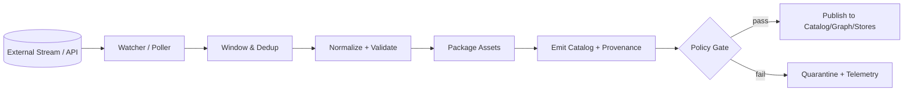
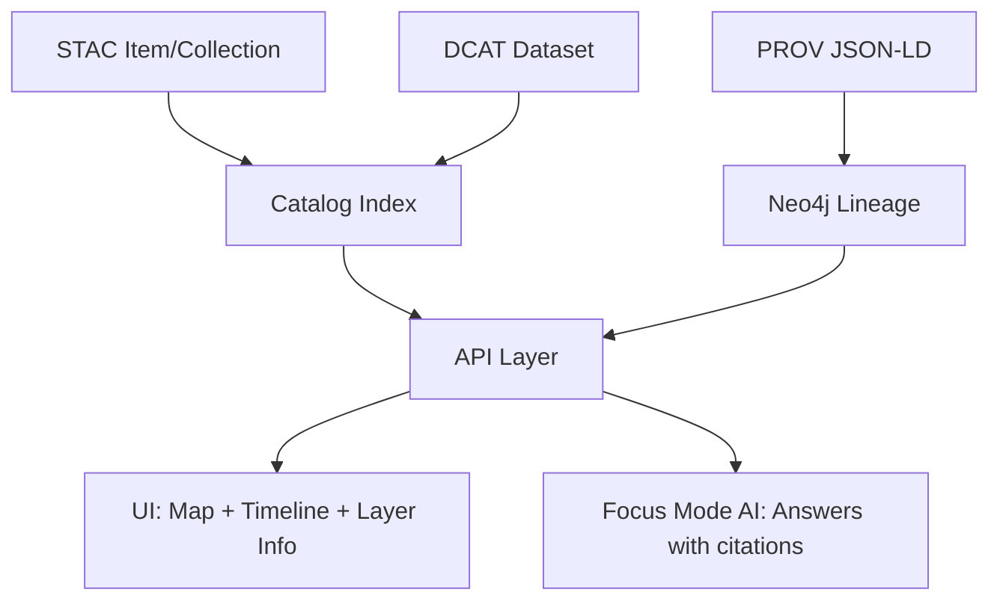

# 📡 07 — Streaming Ingest Stub (PROV) • `out/`


> ⚠️ **Generated artifacts**: this folder is produced by `mcp/dev_prov/examples/07_streaming_ingest_stub_prov/`.  
> If any JSON looks wrong, **regenerate** outputs rather than hand-editing them (treat outputs like build artifacts).

---

## 🧭 What this folder demonstrates

This `out/` directory holds the **sample outputs** from the **streaming ingest stub** that emits **provenance-first** artifacts.

The goal is to prove a minimal but strict contract:

- ✅ **Streaming data = many tiny datasets over time** (windowed micro-batches)
- ✅ Every micro-batch emits the **metadata backbone**:
  - **STAC** → spatiotemporal index + assets
  - **DCAT** → catalog/discovery + licensing + distributions
  - **PROV** → lineage + accountability
- ✅ Ingestion is **append-only** (no silent rewrites)
- ✅ **Policy gates** can enforce: *no license, no publish* • *no provenance, no map* • *no sensitivity label, no graph/UI*

---

## 🧱 High-level flow



---

## 📁 What you should see in this folder

Typical run artifacts (filenames can vary slightly depending on the stub’s configuration, but the **contracts** are stable):

```text
📁 out/
├─ 📄 README.md
├─ 📄 run_manifest.json
├─ 📄 telemetry.ndjson
├─ 📄 prov.jsonld
├─ 📄 stac_item.json
├─ 📄 dcat_dataset.json
└─ 📄 checksums.sha256
```

> 🧠 Tip: If your stub emits **multiple runs**, prefer a layout like `out/<run_id>/...` to keep runs immutable + comparable.

---

## 📦 Artifact contract cheat-sheet

| Artifact | What it represents | Downstream consumers |
|---|---|---|
| `run_manifest.json` 🧾 | A deterministic “receipt” for the run (who/what/when/inputs/outputs) | QA, audits, CI, rollbacks, reproducibility |
| `telemetry.ndjson` 📈 | Append-only event log (one JSON object per line) | Observability, W-P-E agent triggers, dashboards |
| `prov.jsonld` 🧬 | W3C PROV-O JSON-LD lineage for the micro-batch | Neo4j lineage ingestion, “why/where from?” UI panels, AI citations |
| `stac_item.json` 🗺️ | STAC Item (spatiotemporal index + assets for this micro-batch) | Map layer serving, time slider filters, asset resolvers |
| `dcat_dataset.json` 🏷️ | DCAT Dataset entry (discovery + license + distribution(s)) | Search, catalog browsing, compliance checks |
| `checksums.sha256` 🔐 | Integrity checks for every artifact in the run | Verify content-addressability & tamper-evidence |

---

## 🧬 Provenance model (what “stub PROV” means)

A **stub** provenance record is still **valid provenance**—it’s just the *minimum usable* chain that allows:

- tracing each output back to a **source fetch**
- identifying the **pipeline agent** responsible
- recording the **window** (time range) and run identifiers
- linking outputs to checksums / digests

A good minimal PROV graph for streaming usually includes:

- **Entities** 🧩  
  - `observation` (raw event or fetched payload)  
  - `normalized_record` (validated + canonicalized form)  
  - `artifact` (file(s) generated for catalog/serving)
- **Activities** ⚙️  
  - `fetch_window`, `normalize_validate`, `package_emit`
- **Agents** 🧑‍💻🤖  
  - `pipeline`, `ci`, `maintainer`, and optionally the `source_system`

<details>
<summary>📄 Example PROV JSON-LD shape (illustrative)</summary>

```json
{
  "@context": "https://www.w3.org/ns/prov.jsonld",
  "@graph": [
    {
      "@id": "urn:kfm:run:2026-01-21T12:00Z:feedX",
      "@type": "prov:Activity",
      "prov:startedAtTime": "2026-01-21T12:00:00Z",
      "prov:endedAtTime": "2026-01-21T12:00:10Z",
      "prov:wasAssociatedWith": { "@id": "urn:kfm:agent:pipeline:streaming_stub" }
    },
    {
      "@id": "urn:kfm:entity:observation:feedX:window:2026-01-21T12:00Z",
      "@type": "prov:Entity",
      "prov:wasGeneratedBy": { "@id": "urn:kfm:run:2026-01-21T12:00Z:feedX" }
    }
  ]
}
```
</details>

---

## 🔍 Validation quick-start

Run these from inside `out/` (or adjust paths if your run lives in a subfolder):

```bash
# 1) JSON sanity checks (requires jq)
jq . run_manifest.json >/dev/null
jq . stac_item.json >/dev/null
jq . dcat_dataset.json >/dev/null
jq . prov.jsonld >/dev/null

# 2) Integrity (requires sha256sum)
sha256sum -c checksums.sha256

# 3) Telemetry “is NDJSON”
python - <<'PY'
import json
from pathlib import Path
p = Path("telemetry.ndjson")
for i,line in enumerate(p.read_text().splitlines(), 1):
    json.loads(line)
print(f"OK: {i} lines of valid JSON")
PY
```

✅ **Policy mindset**: treat these as *gates*, not warnings. If validation fails, the run is not publishable.

---

## 🗺️ How KFM consumes these artifacts

This output format is designed to plug into KFM’s broader system, where:

- **STAC/DCAT** power discovery + time/space filtering
- **PROV** powers lineage + trust + explainability
- **Telemetry** powers automation (Watcher–Planner–Executor), dashboards, and audits

A common end-to-end path looks like:



---

## 🧩 Extending this stub into a “real” streaming provider

If you want to graduate from the stub to a real provider, these are the recommended upgrades:

### 1) Add **idempotency** for “exactly-once-ish” windows ♻️
- Use an **idempotency key** derived from `(source, sensor_id, window_start)`  
- Store window completion state in a durable store (e.g., Redis, Postgres)

### 2) Emit **dual-format artifacts** for analytics + rendering 📦
- Analytics-friendly: `GeoParquet`
- Rendering-friendly: `PMTiles` (vector tiles) or `COG` (rasters)

### 3) Treat artifacts like packages (content-addressed + signed) 🔐
- Push artifacts to an OCI registry (ORAS)
- Sign with Cosign (keyless/OIDC in CI)
- Reference immutable digests from DCAT/STAC

### 4) Upgrade provenance from “stub” to “full chain” 🧬
- Include:
  - input source URLs + fetch headers (ETag / Last-Modified)
  - tool versions + container digests
  - validation outcomes (schema + geometry + license)
  - sensitivity classification decisions

### 5) Feed the UI live (without breaking trust) 🛰️
- Keep streaming layers lightweight (only fetch what’s in view)
- Ensure every UI “live point” still maps back to catalog + provenance

---

## 📚 Project docs this output aligns with

Use these to understand the “why” behind the contracts:

### Core KFM architecture + governance
- **Kansas Frontier Matrix (KFM) – Comprehensive Technical Documentation.pdf**
- **Kansas Frontier Matrix (KFM) – Comprehensive Architecture, Features, and Design.pdf**
- **📚 Kansas Frontier Matrix (KFM) Data Intake – Technical & Design Guide.pdf**

### UI + explainability
- **Kansas Frontier Matrix – Comprehensive UI System Overview.pdf**
- **Kansas Frontier Matrix (KFM) – AI System Overview 🧭🤖.pdf**

### Forward proposals / future patterns
- **🌟 Kansas Frontier Matrix – Latest Ideas & Future Proposals.docx.pdf**
- **Innovative Concepts to Evolve the Kansas Frontier Matrix (KFM).pdf**
- **Additional Project Ideas.pdf**

### Reference portfolios (background material)
- **AI Concepts & more.pdf**
- **Data Managment-Theories-Architures-Data Science-Baysian Methods-Some Programming Ideas.pdf**
- **Various programming langurages & resources 1.pdf**
- **Maps-GoogleMaps-VirtualWorlds-Archaeological-Computer Graphics-Geospatial-webgl.pdf**
