<!-- According to a document snapshot from 2026-01-21 (Kansas Frontier Matrix + MCP internal docs). -->

# Example 08 — OCI Artifact Distribution 📦🐳🔐


**Path:** `mcp/dev_prov/examples/08_oci_artifact_distribution/`

This example shows how to distribute **KFM “data units”** (🗺️ PMTiles, 🧱 GeoParquet, 🛰️ COGs, 📦 offline packs, etc.) through an **OCI registry** (GHCR/ACR/ECR/Quay/etc.) using **ORAS**, then secure them with **Cosign** signatures + attestations, and finally connect everything back to **KFM’s evidence triplet** (**STAC + DCAT + PROV**) so the graph/UI/AI layers can consume artifacts by **immutable digest** 🔒.

> [!IMPORTANT]
> **Always reference artifacts by digest** (`@sha256:...`) for trust + reproducibility. Tags (`:latest`, `:20260111`) are for humans, **digests are for machines**.

---

## 🧪 MCP Protocol Card

| Field | Value |
|---|---|
| **Objective** | Publish a KFM data unit as an OCI artifact (multi-file), sign + attest it, and record `distribution.oci` + `provenance_ref` back into STAC/DCAT/PROV. |
| **Hypothesis** | If we treat an OCI registry as **content-addressable storage** and attach **verifiable provenance**, then KFM can safely distribute large binaries across environments while preserving evidence + traceability. |
| **Inputs** | Processed files (e.g., `surficial_geology.pmtiles`, `surficial_geology.geo.parquet`) + run/config metadata. |
| **Outputs** | OCI artifact manifest + digest, signatures, provenance/SBOM attestations, and catalog records that pin everything by digest. |
| **Success** | `oras pull` reproduces exact bytes, `cosign verify` passes, and catalog entries point to digest + provenance. ✅ |

---

## 🧭 Where this fits in KFM

KFM’s pipeline is **provenance-first**: processed artifacts must be cataloged (STAC/DCAT) and lineage must exist (PROV) before higher layers (graph/API/UI/story/AI) rely on them.

This example adds a **distribution step** that plays nicely with that philosophy:

- **Binary blobs** → OCI Registry 📦
- **Metadata + lineage** → STAC/DCAT/PROV 🧾
- **Integrity + attestations** → OCI Referrers (Cosign/ORAS attachments) 🔐

```mermaid
flowchart LR
  A[🧪 ETL outputs<br/>PMTiles / GeoParquet / COG] --> B[🧾 Build run_manifest + dataset config]
  B --> C[📦 ORAS push -> OCI registry]
  C --> D[🔐 Resolve digest + pin]
  D --> E[✍️ cosign sign + attest]
  E --> F[🧭 Update STAC/DCAT/PROV<br/>distribution.oci + provenance_ref]
  F --> G[🕸️ Graph ingestion]
  G --> H[🧰 API layer]
  H --> I[🖥️ UI / Story Nodes / Focus Mode]
```



---

## 📁 Suggested example layout

> You can implement these as scripts, Make targets, or task runners—whatever fits the repo patterns.

```text
mcp/dev_prov/examples/08_oci_artifact_distribution/
├─ 📄 README.md
├─ 📁 artifacts/                 # demo output files (or symlinks)
│  ├─ 🗺️ surficial_geology.pmtiles
│  └─ 🧱 surficial_geology.geo.parquet
├─ 📁 manifests/
│  ├─ 🧾 dataset_config.json      # “what is this dataset?”
│  ├─ 🧪 run_manifest.json        # “how was it built?”
│  ├─ 🔐 sbom.spdx.json           # optional
│  └─ 🧬 prov.jsonld              # optional PROV JSON-LD
├─ 📁 catalog_snippets/
│  ├─ 🧾 stac_item.asset.json     # sample asset block
│  └─ 🧾 dcat_distribution.json   # sample distribution block
└─ 📁 scripts/
   ├─ 🚀 push_oras.sh
   ├─ ✍️ sign_attest.sh
   ├─ ✅ verify_pull.sh
   └─ 🧾 update_catalog.sh
```

---

## ✅ Prerequisites

### Required
- **ORAS CLI** (`oras`)
- **Cosign** (`cosign`)
- Access to an OCI registry (public or private)

### Nice to have
- `jq` (for JSON plumbing)
- SBOM generator (e.g., `syft`, `trivy`)  
- Policy tooling (e.g., `conftest` / OPA) for “fail-closed” gates

---

## 🚀 Quickstart

### 0) Choose a registry + reference

Pick a repository path that matches how you want KFM to address the artifact.

```bash
# Example for GHCR:
export REGISTRY="ghcr.io"
export ORG="<your-org>"
export REPO="kfm/surficial"
export TAG="20260111"

export REF="${REGISTRY}/${ORG}/${REPO}:${TAG}"
echo "REF=$REF"
```

> [!TIP]
> For local testing, run a local registry (e.g., `registry:2`) and set `REGISTRY=localhost:5000`.

---

### 1) Prepare artifacts + config

**Artifacts** (examples):
- `surficial_geology.pmtiles` (vector tiles)
- `surficial_geology.geo.parquet` (analysis-grade table)

**Dataset config** (kept as the OCI *config object*):
`manifests/dataset_config.json`
```json
{
  "kfm_dataset_id": "kansas.surficial_geology",
  "version": "20260111",
  "title": "Surficial Geology (Kansas) — Processed Data Unit",
  "license": "SEE_SOURCE",
  "build": {
    "git": {
      "repo": "<repo-url>",
      "sha": "<commit-sha>"
    }
  }
}
```

Optional but recommended for KFM:
- `manifests/run_manifest.json` (inputs/tools/outputs + hashes)
- `manifests/prov.jsonld` (PROV-O / JSON-LD lineage)
- `manifests/sbom.spdx.json` (SBOM of the toolchain/container, if applicable)

---

### 2) Push as a multi-file OCI artifact (ORAS)

Push the artifact with a **custom artifact type**, attach a **config object**, and upload **multiple layers** (files).

```bash
oras push "$REF" \
  --artifact-type application/vnd.kfm.dataset.v1 \
  --config manifests/dataset_config.json:application/vnd.kfm.dataset.config.v1+json \
  artifacts/surficial_geology.pmtiles:application/vnd.pmtiles \
  artifacts/surficial_geology.geo.parquet:application/vnd.apache.parquet
```

---

### 3) Resolve + pin the digest 🔒

```bash
# Full reference (includes digest)
FULL_REF="$(oras resolve --full-reference "$REF")"
echo "$FULL_REF"

# Digest only (sha256:...)
DIGEST="$(echo "$FULL_REF" | sed 's/.*@//')"
echo "$DIGEST"
```

---

### 4) Sign the artifact (Cosign) ✍️

```bash
# Keyless signing (OIDC prompt in interactive mode)
cosign sign --yes "$FULL_REF"
```

> [!NOTE]
> In CI (GitHub Actions), this becomes **keyless OIDC**, which is ideal for developer provenance.

---

### 5) Attach provenance / run manifests / SBOMs 🧬📎

You have two good patterns:

#### Pattern A — Attach “sidecar artifacts” as OCI referrers (ORAS attach)
```bash
oras attach --artifact-type application/vnd.kfm.runmanifest.v1+json \
  "$FULL_REF" manifests/run_manifest.json:application/json

oras attach --artifact-type application/vnd.kfm.prov.v1+jsonld \
  "$FULL_REF" manifests/prov.jsonld:application/ld+json

oras attach --artifact-type application/vnd.kfm.sbom.v1+spdxjson \
  "$FULL_REF" manifests/sbom.spdx.json:application/spdx+json
```

#### Pattern B — Store attestations (Cosign attest)
```bash
# Depending on cosign version, this may be required for keyless attestations
export COSIGN_EXPERIMENTAL=1

cosign attest --yes \
  --type https://spdx.dev/Document \
  --predicate manifests/sbom.spdx.json \
  "$FULL_REF"

cosign attest --yes \
  --type https://kfm.dev/attestations/run-manifest/v1 \
  --predicate manifests/run_manifest.json \
  "$FULL_REF"
```

---

### 6) Discover what’s attached (referrers graph) 🌿

```bash
# Tree view is great for humans
oras discover -o tree "$FULL_REF"

# Filter by artifact type if needed
oras discover --artifact-type application/vnd.kfm.runmanifest.v1+json "$FULL_REF"
```

---

## 🧾 Catalog integration: `distribution.oci` + `provenance_ref`

KFM catalogs remain the **source of truth for meaning** (metadata + lineage), while OCI remains the **source of truth for bytes** (immutable blobs).

### 🔹 STAC asset snippet (illustrative)

`catalog_snippets/stac_item.asset.json`
```json
{
  "assets": {
    "pmtiles": {
      "href": "oci://ghcr.io/<org>/kfm/surficial@sha256:<digest>",
      "type": "application/vnd.pmtiles",
      "roles": ["data"]
    },
    "geoparquet": {
      "href": "oci://ghcr.io/<org>/kfm/surficial@sha256:<digest>",
      "type": "application/vnd.apache.parquet",
      "roles": ["data"]
    }
  },
  "properties": {
    "kfm:distribution": {
      "oci": {
        "registry": "ghcr.io",
        "repository": "<org>/kfm/surficial",
        "tag": "20260111",
        "digest": "sha256:<digest>",
        "artifacts": [
          {"path": "surficial_geology.pmtiles", "mediaType": "application/vnd.pmtiles"},
          {"path": "surficial_geology.geo.parquet", "mediaType": "application/vnd.apache.parquet"}
        ]
      }
    },
    "kfm:provenance_ref": "oci://ghcr.io/<org>/kfm/surficial@sha256:<digest>#referrers"
  }
}
```

### 🔹 DCAT distribution snippet (illustrative)

`catalog_snippets/dcat_distribution.json`
```json
{
  "dcat:distribution": [{
    "dct:title": "Surficial Geology Data Unit (OCI)",
    "dcat:mediaType": "application/vnd.kfm.dataset.v1",
    "dcat:downloadURL": "oci://ghcr.io/<org>/kfm/surficial@sha256:<digest>",
    "kfm:provenance_ref": "oci://ghcr.io/<org>/kfm/surficial@sha256:<digest>#referrers"
  }]
}
```

> [!IMPORTANT]
> The **catalog should pin digests**, not tags. Tags can still exist for humans.

---

## ✅ Verification & Consumption

### Verify signatures (Cosign)
```bash
# If you’re enforcing CI identity, include issuer + identity constraints
cosign verify "$FULL_REF" | jq
```

### Verify attestations (Cosign)
```bash
cosign verify-attestation --type https://spdx.dev/Document "$FULL_REF"
```

### Pull the artifact (ORAS)
```bash
mkdir -p out
cd out
oras pull "$FULL_REF"
ls -la
```

---

## 🧱 CI/CD pattern (PR-based, provenance-first)

A practical “promotion” pattern:

1. Build artifacts (ETL output)
2. Push to registry (ORAS)
3. Resolve digest and pin
4. Sign + attest (Cosign)
5. Update STAC/DCAT/PROV with digest + provenance_ref
6. Open PR (no auto-merge) ✅

<details>
<summary>📦 Example GitHub Actions skeleton (illustrative)</summary>

```yaml
name: Publish OCI Data Unit (KFM)

on:
  workflow_dispatch:
  push:
    branches: [ main ]
    paths:
      - "data/processed/**"
      - "pipelines/**"
      - "mcp/dev_prov/examples/08_oci_artifact_distribution/**"

permissions:
  id-token: write   # required for keyless cosign
  contents: read
  packages: write   # for GHCR

jobs:
  publish:
    runs-on: ubuntu-latest
    steps:
      - uses: actions/checkout@v4

      - name: Install tooling
        run: |
          # install oras + cosign + jq (choose your preferred installers)

      - name: Build artifacts
        run: |
          # run ETL -> create artifacts/*.pmtiles, artifacts/*.parquet, manifests/*.json

      - name: Push OCI artifact
        env:
          REF: ghcr.io/${{ github.repository_owner }}/kfm/surficial:20260111
        run: |
          oras push "$REF" \
            --artifact-type application/vnd.kfm.dataset.v1 \
            --config manifests/dataset_config.json:application/vnd.kfm.dataset.config.v1+json \
            artifacts/surficial_geology.pmtiles:application/vnd.pmtiles \
            artifacts/surficial_geology.geo.parquet:application/vnd.apache.parquet

      - name: Resolve digest + sign
        env:
          REF: ghcr.io/${{ github.repository_owner }}/kfm/surficial:20260111
        run: |
          FULL_REF="$(oras resolve --full-reference "$REF")"
          echo "FULL_REF=$FULL_REF" >> $GITHUB_ENV
          cosign sign --yes "$FULL_REF"

      - name: Attach run manifest (ORAS)
        run: |
          oras attach --artifact-type application/vnd.kfm.runmanifest.v1+json \
            "$FULL_REF" manifests/run_manifest.json:application/json

      - name: Update catalogs (pin digest)
        run: |
          # rewrite STAC/DCAT/PROV records to embed distribution.oci.digest + provenance_ref
          # open PR / commit changes in a separate workflow if desired
```

</details>

---

## 🛡️ Security & governance notes

- Use **private registries** for restricted data.
- Treat sensitivity as **sticky**: outputs must not become “less restricted” than inputs.
- Use **policy-as-code** (OPA/Conftest) to enforce:
  - `distribution.oci.digest` is present (pinned)
  - signatures/attestations exist
  - license + sensitivity labels exist
  - provenance is complete enough for KFM ingestion

> [!NOTE]
> For sensitive data units, consider privacy-preserving transformations (masking/anonymization) before publishing.

---

## 🧩 Extensions (nice wins)

- **Offline packs**: publish a PMTiles + mini web app bundle as a single OCI artifact for field/offline use.
- **Data “BOM”**: attach a file listing every blob + digest (data inventory attestation).
- **Promotion rings**: `:dev` → `:staging` → `:prod` where only digests move forward after passing gates.
- **Mirrors**: replicate OCI repositories close to compute (cheap, fast, deterministic).

---

## 🧯 Troubleshooting

### “I can push but can’t resolve digest”
- Check registry auth (`oras login`)
- Verify repository exists and you have `packages: write` (GHCR) / equivalent in your registry

### “cosign verify fails”
- Verify you’re using the **digest reference**
- If enforcing identity, confirm you’re passing the right issuer + identity constraints
- Make sure your registry supports storing referrers/signatures

### “oras discover shows nothing”
- Some registries require referrers API support or fallback tag scheme
- Try `oras attach --distribution-spec v1.1-referrers-tag ...` if your registry needs it

---

## 📚 References inside the KFM project

Core KFM docs (📌 provenance-first):
- 📚 Data Intake Guide (STAC/DCAT/PROV + policy gates)
- 🧭 AI System Overview (citations & “Focus Mode”)
- 🖥️ UI System Overview (layer provenance UX)
- 🧱 Architecture & Technical Documentation (pipeline, storage, governance)
- 💡 Latest Ideas & Future Proposals (data units, traceable digests, PR-driven provenance)
- 🧩 Additional Project Ideas (OCI distribution concept, ORAS + Cosign workflow)

Supporting resource bundles (📦 reference libraries):
- 🤖 AI Concepts & more (portfolio)
- 🗺️ Maps/Virtual Worlds/WebGL/Geospatial graphics (portfolio)
- 🧠 Data management & architectures (portfolio)
- 💻 Programming languages & resources (portfolio)
- ⛏️ Data mining concepts & privacy foundations

---

## ✅ Next steps

- Implement `scripts/` helpers for repeatability (push, sign, attach, verify).
- Standardize a `kfm:distribution.oci` schema (versioned).
- Add policy pack rules for `distribution.oci` + required attestations.
- Wire registry pulls into KFM ingestion + caching layer.
