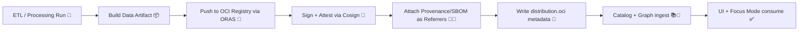

# 📦 OCI Artifact Distribution — Artifacts

[⬅️ Back to Example 08](../README.md)


> [!NOTE]
> This folder is the **artifact-facing** part of `mcp/dev_prov/examples/08_oci_artifact_distribution`.
> It shows how we publish **KFM outputs** (datasets + metadata + provenance + SBOM) as **OCI artifacts** and validate them with **policy gates**.

---

## 🎯 What this example is proving

✅ You can distribute **geospatial & AI artifacts** using an OCI registry (GHCR/ACR/ECR/Harbor/Quay/etc).  
✅ You can attach **referrers** (signatures, attestations, provenance, SBOM) to a *subject* artifact.  
✅ You can wire those immutable references into KFM metadata (`STAC/DCAT/PROV`) so UI + Focus Mode only consume **verifiable** outputs.

---

## 🧠 What counts as an “artifact” in KFM?

Artifacts aren’t just “files” — they’re **versioned, content-addressed deliverables** with traceability:

- 🗺️ **Data layers**: `*.pmtiles`, `*.tif` (COG), `*.parquet` (GeoParquet), `*.fgb`, `*.geojson`
- 🧾 **Metadata**: STAC Item/Collection JSON, DCAT Dataset JSON-LD, layer manifests
- 🧬 **Provenance**: PROV JSON-LD + pipeline run manifest (inputs, params, toolchain)
- 🧾 **Supply-chain**: SBOM (SPDX / CycloneDX), signatures, attestations
- 🧭 **Experience packs**: Story Node bundles, offline “field packs”
- 🤖 **AI outputs**: notebooks, models, eval sets, prompt packs (still governed + cited)

---

## 📁 Suggested folder layout (local working copy)

This repo folder is intentionally small; **large binaries should not live in Git**.

```text
📁 artifacts/
├─ 📄 README.md
├─ 📁 demo/                     🧪 tiny files for quick testing
│  ├─ 📄 hello.txt
│  ├─ 📄 provenance.json
│  └─ 📄 sbom.spdx.json
├─ 📁 layer_examples/           🗺️ optional small sample layers (keep tiny)
│  ├─ 📄 example.pmtiles
│  └─ 📄 example.stac-item.json
└─ 📁 manifests/                🧾 metadata + run manifests (safe to commit)
   ├─ 📄 run.manifest.json
   ├─ 📄 prov.jsonld
   └─ 📄 distribution.oci.json
```

> [!TIP]
> In “real” KFM pipelines, the *data artifact* is built in ETL/processing, pushed to OCI, then the **catalog + graph** ingest the metadata pointers (not the bytes).

---

## ✅ Minimal Artifact Contract (KFM-friendly)

| Layer | Required | What it is | Why it exists |
|---|---:|---|---|
| 📦 Data artifact | ✅ | The dataset/layer bytes | What gets rendered/queried |
| 🧾 Distribution pointer | ✅ | `oci://…@sha256:…` + metadata | Immutable reference |
| 🧬 Provenance | ✅ | PROV JSON-LD + run manifest | Traceability + reproducibility |
| 🧾 SBOM | ✅ (if built) | SPDX/CycloneDX | Supply-chain transparency |
| 🔏 Signature | ✅ | cosign signature referrer | Integrity + publisher identity |
| 🧑‍⚖️ Governance fields | ✅ | license, sensitivity, CARE | Ethical + legal constraints |

---

## 🧭 End-to-end flow (how it’s supposed to work)



---

## 🚀 Quickstart: publish a tiny artifact (works anywhere)

### 0) Prereqs

- ✅ An OCI registry you can push to (or run a local one)
- ✅ `oras` installed
- ✅ `cosign` installed

### 1) Pick a registry + reference

```bash
# Example: GitHub Container Registry (GHCR)
export REGISTRY="ghcr.io/YOUR_ORG"
export REPO="kfm/example-08"
export TAG="demo-$(date +%Y%m%d)"
export REF="$REGISTRY/$REPO:$TAG"
```

### 2) Create a tiny artifact

```bash
mkdir -p demo
echo "hello from KFM OCI artifacts 👋" > demo/hello.txt
```

### 3) Push as an OCI artifact (ORAS)

```bash
oras push "$REF" \
  --artifact-type "application/vnd.kfm.example.v1" \
  demo/hello.txt:text/plain
```

### 4) Resolve to a digest (pin immutability)

```bash
oras resolve "$REF"
# outputs something like: sha256:....
# We'll refer to this as:
#   SUBJECT="$REGISTRY/$REPO@sha256:...."
```

### 5) Sign the artifact (Cosign)

> [!IMPORTANT]
> Prefer signing the **digest reference** (`repo@sha256:...`) to avoid tag mutability.

```bash
export SUBJECT="$REGISTRY/$REPO@$(oras resolve "$REF")"

# Keyless (recommended in CI with OIDC):
cosign sign "$SUBJECT"

# OR key-based (local/dev):
# cosign sign --key cosign.key "$SUBJECT"
```

### 6) Attach provenance / SBOM as referrers (ORAS)

```bash
echo '{"run_id":"demo","note":"minimal provenance stub"}' > demo/provenance.json
echo '{"spdxVersion":"SPDX-2.3","name":"demo"}' > demo/sbom.spdx.json

# Attach provenance
oras attach "$SUBJECT" \
  --artifact-type "application/vnd.kfm.provenance.v1" \
  demo/provenance.json:application/json

# Attach SBOM
oras attach "$SUBJECT" \
  --artifact-type "application/vnd.kfm.sbom.spdx.v1" \
  demo/sbom.spdx.json:application/spdx+json
```

### 7) Discover what’s attached (referrers graph)

```bash
oras discover -o tree "$SUBJECT"
```

### 8) Pull it back (consumer behavior)

```bash
mkdir -p /tmp/kfm-pull && cd /tmp/kfm-pull
oras pull "$SUBJECT"
ls -la
```

---

## 🗺️ Pattern for real KFM layers (PMTiles / COG / GeoParquet)

### Recommended approach (subject = data, attachments = everything else)

1) Push the **data bytes** as the subject:

```bash
export LAYER_REF="$REGISTRY/kfm-layers/kansas/roads:2026-01-22"

oras push "$LAYER_REF" \
  --artifact-type "application/vnd.kfm.layer.data.v1" \
  ks_roads.pmtiles:application/vnd.kfm.pmtiles
```

2) Resolve to digest and treat that as immutable:

```bash
export LAYER_SUBJECT="$REGISTRY/kfm-layers/kansas/roads@$(oras resolve "$LAYER_REF")"
```

3) Attach metadata + provenance + SBOM:

```bash
oras attach "$LAYER_SUBJECT" --artifact-type "application/vnd.kfm.metadata.stac.v1" \
  ks_roads.stac-item.json:application/json

oras attach "$LAYER_SUBJECT" --artifact-type "application/vnd.kfm.provenance.provjsonld.v1" \
  ks_roads.prov.jsonld:application/ld+json

oras attach "$LAYER_SUBJECT" --artifact-type "application/vnd.kfm.sbom.spdx.v1" \
  ks_roads.sbom.spdx.json:application/spdx+json
```

4) Sign it:

```bash
cosign sign "$LAYER_SUBJECT"
```

> [!TIP]
> If a “standard” media type doesn’t exist (common in geospatial), use a stable vendor type:
> `application/vnd.kfm.<thing>.v1` — your policy + tooling can enforce it consistently.

---

## 🔗 Wiring KFM metadata: `distribution.oci.json`

KFM needs a **machine-readable pointer** to the exact bytes + their referrers.  
A minimal `distribution.oci.json` can look like:

```json
{
  "distribution": {
    "oci": {
      "subject": "oci://ghcr.io/ORG/kfm-layers/kansas/roads@sha256:REPLACE_ME",
      "artifact_type": "application/vnd.kfm.layer.data.v1",
      "files": [
        {
          "path": "ks_roads.pmtiles",
          "media_type": "application/vnd.kfm.pmtiles"
        }
      ],
      "referrers": {
        "signature": "oci://ghcr.io/ORG/kfm-layers/kansas/roads@sha256:SIGNATURE_DIGEST",
        "provenance": "oci://ghcr.io/ORG/kfm-layers/kansas/roads@sha256:PROV_DIGEST",
        "sbom": "oci://ghcr.io/ORG/kfm-layers/kansas/roads@sha256:SBOM_DIGEST"
      }
    }
  }
}
```

### Where this gets used

- 🧾 STAC assets can point to `oci://...@sha256:...`
- 📚 DCAT distributions can point to the same immutable subject
- 🔗 PROV links the run manifest inputs → outputs → published digest(s)
- 🧭 UI can show: ✅ signature verified, ✅ provenance present, ✅ policy passed

---

## 🛡️ Policy-as-code gate (OPA/Conftest mindset)

A KFM-ready OCI artifact should pass checks like:

- ✅ subject is **digest pinned** (no “latest” consumption in production)
- ✅ cosign signature exists and verifies
- ✅ provenance referrer exists (PROV JSON-LD + run manifest)
- ✅ license + sensitivity tags exist
- ✅ CARE/ethical constraints are present for sensitive or community-governed content

> [!IMPORTANT]
> If an artifact can’t pass policy checks, it **should not** be eligible for UI rendering or Focus Mode retrieval.

---

## 🔒 Sensitive data & access tiers (don’t publish harm)

When a layer contains sensitive coordinates / community-restricted material:

- 🔐 push the “full-fidelity” artifact to a **restricted** registry/repo namespace
- 🟦 publish a **generalized/redacted derivative** to the public namespace
- 🏷️ enforce access using **tags + policy**, not vibes

> [!NOTE]
> KFM’s stance is: “open when safe, restricted when required,” with explicit labels and rules.

---

## 🧩 Troubleshooting cheatsheet

<details>
<summary><strong>Common issues & fixes 🧰</strong></summary>

- **Auth failures (401/403)**  
  Make sure you’re logged into the registry (e.g., `gh auth login` + `docker login ghcr.io`).

- **Registry doesn’t show referrers**  
  Some registries require OCI 1.1 “referrers API” support. ORAS can also use a tag-scheme fallback via `--distribution-spec`.

- **Cosign keyless fails locally**  
  Keyless signing depends on OIDC identity. Use `cosign sign --key cosign.key …` for local testing.

- **Tag changed, digest not stable**  
  Always resolve tags to digests and store the digest in `distribution.oci.json`.

</details>

---

## 📚 Further reading (KFM project docs)

These documents define the broader “why” behind this example:

- 🧭 KFM end-to-end pipeline ordering (ETL → Catalogs → Graph → API → UI → Story Nodes → Focus Mode)
- 🧾 STAC/DCAT/PROV “evidence triangle” and provenance-first design
- 🛡️ Governance: policy gates, CARE/FAIR constraints, sensitive data handling
- 🗺️ UI + MapLibre/WebGL layers and offline packs
- 🤖 AI Focus Mode: evidence citations, drift/bias monitoring, policy enforcement

---

## ✅ Definition of Done (for this example)

- [ ] I can `oras push` a subject artifact to my registry ✅  
- [ ] I can `cosign sign` the **digest** reference ✅  
- [ ] I can `oras attach` provenance + SBOM ✅  
- [ ] I can `oras discover -o tree` and see all referrers ✅  
- [ ] I can write/update `distribution.oci.json` with digest-pinned refs ✅  
- [ ] (Optional) CI policy gate rejects missing provenance/signature ✅  

---

### 🧠 One-liner to remember

> **If it isn’t digest-pinned, signed, and provenance-attached — it isn’t real in KFM.** ✅

