# 📦 OCI Artifact Distribution — Catalog Snippets (Example 08)


> [!IMPORTANT]
> This folder contains **copy/paste catalog fragments** (“snippets”) — not a full dataset publish.  
> In KFM, data is **not considered “officially published”** until the **evidence triplet** is present: **STAC + DCAT + PROV**. :contentReference[oaicite:0]{index=0}

---

## 🎯 What this example demonstrates

KFM’s guiding rule is **contract-first + provenance-first**: anything shown in the UI (or used by Focus Mode) must trace back to cataloged sources — no “mystery layers.” :contentReference[oaicite:1]{index=1}

This example shows how to:

- 📦 Store “heavy” assets (tilesets, GeoParquet, models, etc.) in an **OCI registry** (content-addressable by digest) via **ORAS**
- 🔐 Attach **Cosign** signatures (and optionally SBOM + provenance attestations) as OCI referrers
- 🗂️ Reference those immutable digests from **STAC/DCAT/PROV** via a `distribution.oci`-style block
- 🧾 Generate a self-fingerprinting `run_manifest.json` to power **exactly-once ingestion**, audits, and policy gates

KFM treats OCI artifact distribution as a first-class mechanism for versioned, verifiable data delivery. :contentReference[oaicite:2]{index=2}:contentReference[oaicite:3]{index=3}

---

## 🔄 End-to-end flow (how snippets fit the pipeline)

KFM enforces a linear, auditable pipeline: **each stage only consumes outputs from the previous stage** (no skipping ahead). :contentReference[oaicite:4]{index=4}

```mermaid
sequenceDiagram
  participant P as 🧰 Pipeline/ETL
  participant O as 📦 OCI Registry
  participant C as 🗂️ Catalogs (STAC/DCAT/PROV)
  participant G as 🕸️ Neo4j Graph
  participant A as 🛡️ Governed API
  participant U as 🗺️ UI + 🧭 Focus Mode

  P->>O: oras push (PMTiles, GeoParquet, COG, model files…)
  P->>O: cosign sign (+ optional attestations as referrers)
  P->>C: write STAC/DCAT/PROV (+ run_manifest)
  C->>G: ingest catalog metadata → nodes/edges
  U->>A: request layer/data (REST/GraphQL)
  A->>O: pull by digest + verify cosign before use
  A-->>U: serve data + citations + provenance links
```



The UI is designed so **every visualization links back to its source data + metadata** (“the map behind the map”). :contentReference[oaicite:5]{index=5}

---

## 📁 Folder intent (what belongs here)

Think of this directory as **“metadata building blocks”** 🧱

```text
📁 catalog_snippets/
  ├─ 🧩 distribution_oci.yaml              # OCI reference block (KFM extension)
  ├─ 🧩 stac_asset.snippet.json            # STAC asset fragment + kfm:oci pointer
  ├─ 🧩 dcat_distribution.snippet.jsonld   # DCAT distribution fragment + kfm:oci pointer
  ├─ 🧩 prov_activity.snippet.jsonld       # PROV activity/lineage fragment
  └─ 🧾 run_manifest.snippet.json          # self-hashing audit manifest
```

> [!NOTE]
> Filenames above are illustrative. The key is the **fields + semantics**, not the exact file naming.

---

## ✅ KFM “non-negotiables” this example must satisfy

### 1) Evidence triplet required 🗂️
STAC/DCAT/PROV must exist and be version-controlled. :contentReference[oaicite:6]{index=6}

### 2) Automated policy gates (fail closed) 🛡️
KFM runs automated checks at ingestion, publication, and AI inference. Gates include:
- schema validation
- STAC/DCAT/PROV completeness
- license presence
- sensitivity classification
- provenance completeness  
…and it’s **fail-closed** by design. :contentReference[oaicite:7]{index=7}

### 3) AI outputs must cite sources 🧭
Focus Mode requires citations and will refuse or express uncertainty if it can’t ground an answer. :contentReference[oaicite:8]{index=8}:contentReference[oaicite:9]{index=9}

---

## 🧩 Snippet 1 — `distribution.oci` (KFM extension)

KFM proposes an OCI distribution block in catalog metadata so catalogs can point to **immutable digests**. :contentReference[oaicite:10]{index=10}

```yaml
# 🧩 distribution_oci.yaml
distribution:
  oci:
    registry: ghcr.io
    repository: kfm-data/ks-example-layer
    tag: "v2026.01.22"          # optional (human-friendly)
    digest: "sha256:__PIN_ME__" # required (immutable)
    artifact_type: "application/vnd.kfm.bundle.v1"
    files:
      - name: "layer.pmtiles"
        media_type: "application/vnd.pmtiles"
        role: "tiles"
      - name: "layer.geoparquet"
        media_type: "application/vnd.geo+parquet"
        role: "table"
    security:
      requires_cosign: true
      expected_signer: "kfm-ci@sigstore"  # example policy field (org-specific)
```

**Design rules:**
- ✅ Always record the **digest** (pin-by-hash).
- 🏷️ Tags are allowed for convenience, but must never be the only identifier. :contentReference[oaicite:11]{index=11}

---

## 🧩 Snippet 2 — STAC asset fragment (serving via API, backed by OCI)

KFM’s UI is decoupled from the backend via APIs (REST/GraphQL), and the governed API can enforce redaction + policy checks before serving content. :contentReference[oaicite:12]{index=12}:contentReference[oaicite:13]{index=13}

Use a STAC Asset that points to the **API URL**, and include the OCI info as a provenance pointer:

```json
{
  "assets": {
    "tiles_pmtiles": {
      "title": "Vector tiles (PMTiles)",
      "type": "application/vnd.pmtiles",
      "roles": ["data"],
      "href": "https://__KFM_API__/api/v1/assets/kfm.ks.example.layer.v1/tiles.pmtiles",
      "kfm:oci": {
        "registry": "ghcr.io",
        "repository": "kfm-data/ks-example-layer",
        "digest": "sha256:__PIN_ME__",
        "file": "layer.pmtiles"
      }
    }
  }
}
```

> [!TIP]
> This keeps the UI simple (call the API), while the API can:  
> ✅ verify Cosign, ✅ enforce policy gates, ✅ attach citations, ✅ log access.

---

## 🧩 Snippet 3 — DCAT distribution fragment (discoverability + access patterns)

DCAT is the “discovery” face of a dataset; KFM’s pipelines can update DCAT with access methods (including API access URLs). :contentReference[oaicite:14]{index=14}

```jsonld
{
  "@context": {
    "dcat": "http://www.w3.org/ns/dcat#",
    "dct": "http://purl.org/dc/terms/",
    "prov": "http://www.w3.org/ns/prov#",
    "kfm": "https://kansasfrontiermatrix.org/ns#"
  },
  "@type": "dcat:Distribution",
  "dct:title": "KFM Example Layer (PMTiles + GeoParquet)",
  "dct:format": "application/vnd.kfm.bundle.v1",
  "dcat:accessURL": "https://__KFM_API__/datasets/kfm.ks.example.layer.v1",
  "kfm:oci": {
    "registry": "ghcr.io",
    "repository": "kfm-data/ks-example-layer",
    "digest": "sha256:__PIN_ME__",
    "files": [
      { "name": "layer.pmtiles", "mediaType": "application/vnd.pmtiles" },
      { "name": "layer.geoparquet", "mediaType": "application/vnd.geo+parquet" }
    ]
  }
}
```

---

## 🧩 Snippet 4 — PROV activity fragment (lineage + reproducibility)

PROV makes the pipeline auditable by describing **what produced what**, with what inputs, and when. KFM’s graph ingestion stage can turn these records into `Activity` nodes linking datasets to inputs. :contentReference[oaicite:15]{index=15}

```jsonld
{
  "@context": {
    "prov": "http://www.w3.org/ns/prov#",
    "dct": "http://purl.org/dc/terms/",
    "kfm": "https://kansasfrontiermatrix.org/ns#"
  },
  "@id": "kfm:prov/activity/run/__RUN_ID__",
  "@type": "prov:Activity",
  "dct:description": "Generated PMTiles + GeoParquet bundle and published to OCI.",
  "prov:used": [
    { "@id": "kfm:prov/entity/source/__INPUT_1__" },
    { "@id": "kfm:prov/entity/source/__INPUT_2__" }
  ],
  "prov:generated": [
    { "@id": "kfm:prov/entity/artifact/oci/sha256:__PIN_ME__" }
  ],
  "kfm:run_manifest_digest": "sha256:__RUN_MANIFEST_DIGEST__"
}
```

---

## 🧾 Snippet 5 — `run_manifest.json` (self-hashing audit + idempotency)

KFM’s run manifest is designed to be:
- a detailed ledger of each operation
- stored under `data/audits/<run_id>/run_manifest.json`
- used for policy checks and reproducibility :contentReference[oaicite:16]{index=16}

KFM also proposes canonicalizing the JSON using **RFC 8785** and computing a **SHA-256** digest inserted into the manifest, so the object contains its own fingerprint. :contentReference[oaicite:17]{index=17}

```json
{
  "run_id": "__RUN_ID__",
  "pipeline_id": "pipelines/ks_example_layer/v1",
  "started_at": "2026-01-22T00:00:00Z",
  "source_urls": [
    "https://__SOURCE__/input_1",
    "https://__SOURCE__/input_2"
  ],
  "tool_versions": {
    "gdal": "__GDAL__",
    "tippecanoe": "__TIPPECANOE__",
    "oras": "__ORAS__",
    "cosign": "__COSIGN__"
  },
  "inputs": [
    { "uri": "https://__SOURCE__/input_1", "sha256": "__SHA256__" }
  ],
  "outputs": [
    {
      "oci_registry": "ghcr.io",
      "oci_repository": "kfm-data/ks-example-layer",
      "oci_digest": "sha256:__PIN_ME__",
      "files": [
        { "name": "layer.pmtiles", "sha256": "__SHA256__" },
        { "name": "layer.geoparquet", "sha256": "__SHA256__" }
      ]
    }
  ],
  "summary_counts": { "records_in": 0, "records_out": 0, "errors": 0 },
  "canonical_digest": "sha256:__RUN_MANIFEST_DIGEST__"
}
```

> [!TIP]
> At ingestion time, KFM also computes SHA-256 checksums and can store a `checksums.sha256` file as tamper-evidence for raw downloads. :contentReference[oaicite:18]{index=18}

---

## 🔐 OCI signing + verification (Cosign)

KFM’s OCI approach relies on cryptographic verification: Cosign signatures are stored as OCI referrers and checked before use. :contentReference[oaicite:19]{index=19}

```bash
# 📦 push artifact bundle (example; registry/repo/tag are placeholders)
oras push ghcr.io/kfm-data/ks-example-layer:v2026.01.22 \
  layer.pmtiles:application/vnd.pmtiles \
  layer.geoparquet:application/vnd.geo+parquet

# 🔐 sign by digest (preferred)
cosign sign ghcr.io/kfm-data/ks-example-layer@sha256:__PIN_ME__

# ✅ verify (policy gates can require this)
cosign verify ghcr.io/kfm-data/ks-example-layer@sha256:__PIN_ME__
```

---

## 🛡️ Policy gates you should expect (and design for)

KFM’s governance model uses **policy-as-code** (OPA/Rego via Conftest) and fails closed. :contentReference[oaicite:20]{index=20}:contentReference[oaicite:21]{index=21}

Common gates to include in this example:

- ✅ **STAC/DCAT/PROV completeness** (no publish without the evidence triplet) :contentReference[oaicite:22]{index=22}
- ✅ **License required** (no data without known license) :contentReference[oaicite:23]{index=23}
- ✅ **Provenance completeness** (inputs + steps declared) :contentReference[oaicite:24]{index=24}
- ✅ **Secret scanning** (prevent committing obvious keys) :contentReference[oaicite:25]{index=25}
- ✅ **Cosign verification required** before use (supply-chain) :contentReference[oaicite:26]{index=26}

---

## 🗺️ How the UI + Focus Mode benefits from this

### UI: “map behind the map” 🧭
KFM’s UI is designed so provenance is always surfaced: layers have source attributions and exported views carry credits. :contentReference[oaicite:27]{index=27}

### Focus Mode: citations always 🧠
The assistant must cite the exact datasets/documents/graph entities used; it refuses or flags uncertainty rather than fabricate. :contentReference[oaicite:28]{index=28}

### Retrieval: graph + search (RAG) 🕸️
Focus Mode combines Neo4j graph queries with retrieval-augmented generation to produce grounded answers, with traceable sources. :contentReference[oaicite:29]{index=29}

---

## 🧱 Artifact types KFM expects (and why OCI is handy)

KFM’s stack commonly produces (or serves) artifacts like:
- PMTiles (vector tiles for MapLibre/WebGL)
- GeoParquet (analytics-friendly tables)
- COGs (large raster data stored outside the DB)
- 3D Tiles / CZML for Cesium 3D content :contentReference[oaicite:30]{index=30}:contentReference[oaicite:31]{index=31}

KFM explicitly avoids stuffing very large rasters into PostGIS; instead it keeps rasters as COGs for efficiency (with metadata in the DB). :contentReference[oaicite:32]{index=32}

---

## 🧳 Offline packs (field mode) + OCI bundles

KFM includes offline/field support and “offline data packs.” :contentReference[oaicite:33]{index=33}

Latest proposals describe bundling **GeoParquet + PMTiles**, **STAC collection + DCAT record**, with **traceable hashes** for portable, offline-safe distribution. 

OCI registries make a great distribution channel for these offline packs:
- 📦 bundle many files into one addressable unit
- 🔐 verify signatures before use
- 🧾 preserve provenance and run manifests alongside the pack

---

## 🧠 “Use all the project files” — how this README connects back to KFM docs

Below are the core project references this example aligns with (✅) and builds upon (🧩).

### KFM core docs (architecture + pipelines + UI + AI)
- 🧭 AI citations + RAG + graph integration — :contentReference[oaicite:35]{index=35} :contentReference[oaicite:36]{index=36}  
- 🧱 Architecture + policy gates (fail closed) — :contentReference[oaicite:37]{index=37} :contentReference[oaicite:38]{index=38}  
- 🧬 Data intake pipeline (STAC/DCAT/PROV evidence triplet) — :contentReference[oaicite:39]{index=39} :contentReference[oaicite:40]{index=40}  
- 🗺️ UI provenance (“map behind the map”) — :contentReference[oaicite:41]{index=41}  
- 📘 Comprehensive technical documentation — :contentReference[oaicite:42]{index=42}  
- 💡 Innovative concepts (data transformation + standardized outputs) — :contentReference[oaicite:43]{index=43}  
- 🌟 Latest ideas & proposals (offline packs, tiling, traceable hashes) — :contentReference[oaicite:44]{index=44}  

### Provenance + governance concepts used directly in this example
- 📎 OCI artifact distribution + Cosign + policy-as-code + run manifests — :contentReference[oaicite:45]{index=45}  

### Supporting libraries (reference portfolios 📚)
These portfolios include embedded resources/books supporting implementation details (containers, CI/CD, geospatial WebGL, data governance, AI concepts):
- 🤖 AI Concepts & more (portfolio) — :contentReference[oaicite:46]{index=46}  
- 🗺️ Maps / GoogleMaps / VirtualWorlds / WebGL (portfolio) — :contentReference[oaicite:47]{index=47}  
- 🧰 Various programming languages & resources (portfolio) — :contentReference[oaicite:48]{index=48}  
- 🧪 Data Management / Architectures / Data Science / Bayesian Methods (portfolio) — :contentReference[oaicite:49]{index=49}  

---

## ✅ Mini checklist (for PR reviews)

- [ ] `distribution.oci.digest` is present (pinned)  
- [ ] Cosign verification is required by policy and passes  
- [ ] STAC/DCAT/PROV are present and cross-linked (IDs align)  
- [ ] `run_manifest.json` exists, canonicalized + hashed  
- [ ] Licenses + sensitivity labels are present (no “unknown license”)  
- [ ] UI/API paths serve the data; UI doesn’t bypass governance layers  
- [ ] Focus Mode can cite the dataset + provenance chain

---

### ✨ Done right, this enables:
- reproducible, verifiable artifact delivery (digest + signature)
- auditable lineage (PROV + run manifest)
- discoverability (DCAT) + spatial indexing (STAC)
- trustable UI + AI experiences (always traceable)


