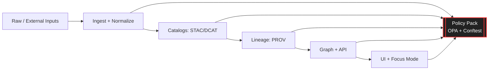

# 🚫 Policy Pack Smoke Tests — **FAIL** Fixtures

> [!WARNING]
> Everything inside `fixtures/fail/` is **intentionally non-compliant**.  
> ✅ The smoke test **passes** when these fixtures **fail policy evaluation**.  
> ❌ If these fixtures start passing, your policy pack is broken (or has been loosened unintentionally).

---

## 🧭 What this folder is (and why it exists)

This directory contains **deliberately broken artifacts** used by the *policy pack smoke tests* to verify that governance, provenance, and safety rules are **enforced** across:

- 📦 **Data intake** (STAC/DCAT/PROV requirements, license, sensitivity labels)
- 🧠 **AI outputs** (citations + safety + “refuse when unsupported” behavior)
- 🧾 **Developer provenance** (PR/commit/build → PROV nodes/edges)
- 🧰 **Supply chain** (signed/pinned artifacts, deterministic run manifests)
- 🧪 **Engineering hygiene** (tests/linting, predictable CI quality gates)

These fixtures are the “tripwires” that prevent the platform from becoming a black box.

---

## ✅ Contract for the smoke test harness

The smoke test runner **should**:

- Discover all cases under:
  - `fixtures/pass/` → **must succeed**
  - `fixtures/fail/` → **must fail**
- Treat each `fail` case as successful **only if**:
  - policy evaluation returns **non-zero / denied**
  - the failure reason matches the expected error category (snapshot, substring, or structured error match)

> [!TIP]
> Keep each fail fixture **small**, **single-purpose**, and **deterministic** so failures remain stable across refactors.

---

## 🧨 Common failure categories this folder is meant to cover

Below are the core “KFM-style” invariants this folder is expected to violate (in different fixtures), so the policy pack proves it can catch them.

| 🔒 Policy / Invariant | 💥 What a FAIL fixture looks like | 🧠 Why it matters |
|---|---|---|
| **Provenance-first publishing** | Data or narrative appears without required provenance artifacts | Prevents untraceable layers & “mystery sources” from entering map/graph/UI |
| **STAC/DCAT/PROV required** | Missing STAC item/collection, missing DCAT dataset, missing PROV chain | Makes every layer queryable, auditable, and reproducible |
| **License required** | Dataset contract omits `license` or contains invalid/empty license | No “unknown licensing” content entering the system |
| **No bypassing catalogs** | Direct use of raw files / ad-hoc endpoints without catalog records | Ensures ingestion remains standardized & reviewable |
| **No output less restricted than inputs** | Derived output is “public” but upstream inputs are “restricted/sensitive” | Stops leakage through transformations |
| **Sensitive areas require review** | Sensitive dataset missing review flag / sensitivity tag | Human-in-the-loop guardrail for high-risk layers |
| **AI answers require citations** | AI output lacks source nodes / citations | Enforces evidence-first narratives and refusal when unsupported |
| **Dev provenance required** | PR/build artifact exists without PROV record for the action | Turns engineering into auditable lineage (who/what/when/why) |
| **Deterministic runs** | Run manifest missing, schema invalid, non-reproducible metadata | Prevents “it worked on my machine” pipelines |
| **Signed/pinned artifacts** | OCI ref missing digest/signature, provenance referrer absent | Supply-chain integrity: what we ran is what we say we ran |
| **CI quality gates** | Code/data changes that skip tests/lint | Keeps platform stable and maintainable |

---

## 🧩 Where the policy pack sits (mental model)

---

## 🧠 Focus Mode policy expectations (why “fail” fixtures matter here too)

Focus Mode isn’t “just a chatbot.” It’s part of the platform, so its outputs must be governed like data:

- If a response can’t be grounded in evidence, **it should refuse**
- If a claim is made, it must carry at least one **citation / source link**
- Sensitive/unsafe queries must be blocked or redirected per the policy gate

This folder typically includes fixtures like:

- “AI answer without citations”
- “AI answer cites a non-existent source node”
- “AI answer leaks restricted/sensitive location info”

---

## 🧱 How to add a new FAIL fixture (fast checklist)

1. **Pick exactly one invariant** to violate (avoid multi-failure bundles).
2. Create a minimal artifact that triggers the violation:
   - missing `license`
   - missing STAC/DCAT/PROV
   - bad classification downgrade
   - unsigned artifact reference
   - missing dev_prov activity node
3. Add/Update expected failure assertions:
   - snapshots / golden JSON
   - error substring match
   - structured error code match
4. Ensure the fixture is **deterministic**:
   - no timestamps unless pinned
   - no randomized IDs unless seeded
5. Document the intent inside the fixture folder:
   - what should fail
   - which policy rule should catch it
   - what the expected denial message category is

---

## 📚 Project doc pack this example is aligned with

These smoke tests are based on the project’s “provenance-first + governance-as-code” direction, including:

- 🧭 **KFM AI System Overview** (Focus Mode pipeline, governance checks, citations)
- 🧩 **KFM Comprehensive Architecture** (policy pack rules, CI quality gates, modularity)
- 🗺️ **KFM UI System Overview** (“map behind the map”, provenance surfaced in UI)
- 📥 **KFM Data Intake Guide** (STAC/DCAT/PROV, pipeline contract, security & privacy)
- 🌟 **Latest Ideas & Future Proposals** (dev provenance mapped to PROV; W–P–E agents)
- 💡 **Innovative Concepts** (AR/4D/digital twins, evidence-first narratives, CARE/ethics)
- 📘 **Comprehensive Technical Documentation** (contract-first metadata & validation tools)

And the included reference portfolios (used as design inputs / engineering context):

- 🧠 `AI Concepts & more.pdf` (portfolio)
- 🗃️ `Data Managment-...pdf` (portfolio)
- 🌍 `Maps-GoogleMaps-VirtualWorlds-...pdf` (portfolio)
- 🧰 `Various programming languages & resources 1.pdf` (portfolio)

> [!NOTE]
> The portfolios are reference collections. The policy pack exists partly to ensure anything derived from external materials is still governed (license + provenance + review + reproducibility).

---

## 🧾 “Fail means success” reminder

If you are debugging the smoke tests:

- ✅ **Expected behavior:** `fixtures/fail/*` → policy engine returns **DENY**
- ❌ **Unexpected behavior:** `fixtures/fail/*` → policy engine returns **ALLOW**
- 🔥 **Also bad:** `fixtures/fail/*` → policy engine crashes (must fail gracefully with a reason)

---

## 🔚 TL;DR

This folder is the **safety net**: it proves the policy pack can stop bad data, bad AI outputs, and bad dev provenance from ever making it into the KFM graph/UI pipeline. 🛡️

