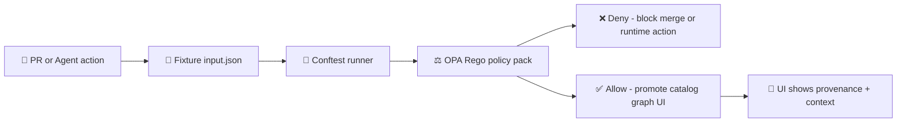

# 🧪⚖️ Policy Pack Smoke Test Inputs (`mcp/dev_prov/examples/09_policy_pack_smoke_tests/inputs`)


> **Golden fixtures** for Example 09. These tiny, deterministic inputs verify our **Policy Pack** wiring end-to-end (CI + runtime-style checks) without needing the full KFM stack.

---

<details>
<summary><strong>📌 Table of Contents</strong></summary>

- [✅ What lives in this folder?](#-what-lives-in-this-folder)
- [🧠 Why a “smoke test” suite?](#-why-a-smoke-test-suite)
- [🧭 Policy-pack invariants we cover here](#-policy-pack-invariants-we-cover-here)
- [🗂️ Expected folder layout (fixture-friendly)](#️-expected-folder-layout-fixture-friendly)
- [🧪 Running the smoke tests](#-running-the-smoke-tests)
- [🧾 Input contract (recommended minimal shape)](#-input-contract-recommended-minimal-shape)
- [🧩 Case catalog (baseline smoke coverage)](#-case-catalog-baseline-smoke-coverage)
- [🧱 Fixture rules (keep this suite fast--reliable)](#-fixture-rules-keep-this-suite-fast--reliable)
- [🧠 Why these particular invariants?](#-why-these-particular-invariants)
- [🔮 Nice-to-have future smoke cases (optional)](#-nice-to-have-future-smoke-cases-optional)
- [📚 Project docs that informed these fixtures](#-project-docs-that-informed-these-fixtures)

</details>

---

## ✅ What lives in this folder?

This `inputs/` directory contains the **fixtures only**. The runner (in `../`) loads these files and executes the Policy Pack against them.

Typical contents:

- 📁 `cases/` — one folder per smoke test case (✅ allow / ❌ deny)
- 📁 `schemas/` — optional JSON Schemas to keep fixture shape stable
- 📄 `README.md` — you are here

---

## 🧠 Why a “smoke test” suite?

KFM governance leans on **policy-as-code** (OPA/Rego + Conftest) so rules are **explicit, versioned, and enforceable**. Smoke tests ensure:

- 🧩 policies compile (no syntax/import regressions)
- 🚦 at least one **ALLOW** path stays valid (prevents accidental lockout)
- 🛑 critical **DENY** rules still trigger (license/provenance/guardrails)
- 🧾 deny reasons remain human-readable (for Governance Cards / audit logs)
- 🤖 policies apply consistently to **humans + agents** (same constraints)

These are not exhaustive “every edge case” tests — they’re the **first alarm bell**.

---

## 🧭 Policy-pack invariants we cover here

Each invariant is represented by at least one minimal fixture.

- 🧾 **Metadata completeness** (FAIR fields, license/contact, etc.)
- 🪶 **CARE & sovereignty awareness** (sensitive data requires review/flags)
- 🔗 **Provenance-first publishing** (no graph/UI promotion without provenance)
- 🧱 **API boundary** (UI must not bypass vetted API paths)
- 🧠 **AI output governance** (Focus Mode outputs must include citations)
- 🔁 **Detect → Validate → Promote** (CI gates before “promotion”)
- 🧬 **Dev provenance context** (`dev_prov`) (actors + PR context that can map to PROV)

---

## 🗂️ Expected folder layout (fixture-friendly)

```text
inputs/
├── 📄 README.md                        # 📘 What these cases test, how to run them, and how expected.yml is interpreted
├── 🧪 cases/                           # 🧪 Test case library (each folder = one scenario)
│   ├── ✅ 00_happy_path/               # ✅ Baseline compliant input (should PASS all relevant gates)
│   │   ├── 🧾 input.json               # Gate input payload for the scenario
│   │   └── ✅🧾 expected.yml            # Expected outcome (pass) + expected findings/IDs/messages (if asserted)
│   ├── ❌ 01_missing_license/          # ❌ License missing/invalid (should FAIL with license-related finding)
│   │   ├── 🧾 input.json               # Input crafted to omit/violate license policy
│   │   └── ❌🧾 expected.yml            # Expected deny + specific finding(s) and error codes
│   ├── ❌ 02_missing_provenance/       # ❌ Provenance missing for a change (should FAIL provenance/receipt rules)
│   │   ├── 🧾 input.json
│   │   └── ❌🧾 expected.yml
│   ├── ❌ 03_sensitive_no_review/      # ❌ Sensitive classification without review/waiver (should FAIL governance rules)
│   │   ├── 🧾 input.json
│   │   └── ❌🧾 expected.yml
│   ├── ❌ 04_ai_answer_no_citations/   # ❌ AI answer without citations (should FAIL evidence-first requirements)
│   │   ├── 🧾 input.json
│   │   └── ❌🧾 expected.yml
│   └── ❌ 05_ui_bypasses_api/          # ❌ UI tries to bypass API boundary (should FAIL architecture/security policy)
│       ├── 🧾 input.json
│       └── ❌🧾 expected.yml
└── 📐 schemas/
    └── 📐🧾 input.schema.json          # (optional) Input contract for validation before policy evaluation
```

> If the runner uses different filenames (e.g., `context.json`, `request.json`, `golden.json`), keep the same *shape* and update this README to match.

---

## 🧪 Running the smoke tests

### Option A — run Conftest directly (policy author workflow)

```bash
# from repo root (adjust paths to your repo layout)
conftest test mcp/dev_prov/examples/09_policy_pack_smoke_tests/inputs/cases \
  -p <path-to-policy-pack> \
  --all-namespaces
```

Common policy-pack locations in this project family:

- `api/scripts/policy/` (CI + runtime policy checks)
- `tools/validation/policy/` (Rego policies + Conftest harness)

### Option B — run through the Example 09 runner (integration workflow)

Look one directory up (`../`) for the runner script/command that:

1) loads each `cases/*/input.*`  
2) evaluates the policy pack  
3) asserts it matches `expected.*`

---

## 🧾 Input contract (recommended minimal shape)

These fixtures model the same governance ideas used across KFM. For smoke tests, one **single JSON object** keeps things deterministic and easy to reason about.

### `input.json` (recommended keys)

- `kind` — what’s being evaluated (`"pull_request" | "data_publish" | "focus_mode_answer" | ...`)
- `actor` — who/what produced the change (human or agent)
- `change` — what changed (files, artifacts, metadata, outputs)
- `context` — runtime/CI context (branch, environment, action)
- `artifacts` — embedded/linked STAC/DCAT/PROV, run manifests, digests, etc.
- `dev_prov` — optional PR/commit context (for dev provenance mapping & audit)

Example (trimmed):

```json
{
  "kind": "data_publish",
  "actor": { "type": "human", "id": "dev@example", "roles": ["contributor"] },
  "dev_prov": {
    "pr": { "number": 123, "labels": ["data-change"], "approvals": 1 },
    "commit": { "sha": "deadbeef...", "signed": true }
  },
  "change": {
    "changed_files": [
      "data/processed/layer.parquet",
      "data/catalog/stac.json",
      "data/prov/run.prov.jsonld"
    ],
    "metadata": {
      "license": "CC-BY-4.0",
      "sensitivity": "public",
      "citations": [{ "type": "dcat", "id": "dcat:usgs-nwis" }]
    }
  },
  "context": { "stage": "validate", "ci": true }
}
```

### `expected.yml` (recommended keys)

```yaml
decision: deny   # allow|deny
must_match:
  - policy_id: "metadata.license_required"
  - policy_id: "provenance.required_before_publish"
```

> ✅ For smoke tests, prefer **“must include”** checks over asserting the entire deny list.  
> This prevents brittle fixtures as policy packs expand.

---

## 🧩 Case catalog (baseline smoke coverage)

| Case folder | Expected | Primary invariant | Typical failure message |
|---|---:|---|---|
| ✅ `00_happy_path/` | ALLOW | A “golden” publish path stays valid | — |
| ❌ `01_missing_license/` | DENY | No dataset without license | “license field required” |
| ❌ `02_missing_provenance/` | DENY | Provenance-first publishing | “PROV required before graph/UI use” |
| ❌ `03_sensitive_no_review/` | DENY | CARE / sensitive review gate | “sensitive data needs review flag” |
| ❌ `04_ai_answer_no_citations/` | DENY | AI output must include citations | “at least one citation required” |
| ❌ `05_ui_bypasses_api/` | DENY | UI cannot bypass API boundary | “UI direct DB/graph access is forbidden” |

---

## 🧱 Fixture rules (keep this suite fast + reliable)

- 🧪 **Synthetic by default**: never commit real secrets, credentials, or sensitive coordinates.
- 🧊 **Deterministic**: no timestamps that change, no network calls, no “latest” data.
- 🪶 **Tiny artifacts**: represent large PMTiles/COG/GeoParquet via **digest + stub metadata**.
- 🧾 **Include provenance pointers**: even stubs should show linkage (e.g., `prov.jsonld` ID/hash).
- 🧰 **Fail-closed mindset**: fixtures should prove both sides:
  - ✅ at least one safe allow path
  - ❌ critical denies still fire
- 🤖 **Agent safety**: include at least one `actor.type: "agent"` case when adding/adjusting agent tooling.

---

## 🧠 Why these particular invariants?

KFM is intentionally **layered + contract-first**:

- UI should only talk to vetted APIs (no direct DB/graph access)  
- everything promoted to the graph/UI should be traceable (STAC/DCAT + PROV lineage)  
- governance is explicit and enforceable via policy-as-code (CI + runtime checks)



---

## 🔮 Nice-to-have future smoke cases (optional)

As KFM grows, consider adding fixtures for:

- 📦 **Deterministic data packages** (GeoParquet + PMTiles + STAC/DCAT + traceable hashes)
- 🔏 **OCI artifact distribution** (ORAS/Cosign signature checks on bundles)
- 🌊 **Streaming data** (provenance stub required even for “real-time” layers)
- 🗺️ **Geospatial QA** (CRS checks, bounds sanity, Kansas-only layer claims)
- 📇 **Model cards / AI metadata** (transparent model + dataset provenance)

---

## 📚 Project docs that informed these fixtures

> Keep this list updated when we add governance invariants or expand the smoke suite.

### Core KFM docs 📘
- 📘 Kansas Frontier Matrix (KFM) – Comprehensive Technical Documentation
- 🧱 Kansas Frontier Matrix (KFM) – Comprehensive Architecture, Features, and Design
- 🧭🤖 Kansas Frontier Matrix (KFM) – AI System Overview
- 🖥️ Kansas Frontier Matrix – Comprehensive UI System Overview
- 📥📚 Kansas Frontier Matrix (KFM) Data Intake – Technical & Design Guide
- 🌟 Kansas Frontier Matrix – Latest Ideas & Future Proposals
- 💡 Innovative Concepts to Evolve the Kansas Frontier Matrix (KFM)
- 🧠 Additional Project Ideas
- 🧾 Document Refinement Request

### Geospatial + MCP planning 🗺️
- 🗺️ Kansas-Frontier-Matrix — Open-Source Geospatial Historical Mapping Hub Design
- 🧰 KFM Python Geospatial Analysis Cookbook (QA patterns & CRS sanity checks)

### Engineering & documentation rigor 🧑‍🔬
- 🧑‍🔬 Scientific Method / Research / Master Coder Protocol Documentation
- 📝 Comprehensive Markdown Guide (formatting & documentation patterns)

### Reference libraries (PDF portfolios) 📚
- 🤖 AI Concepts & more
- 🌍 Maps / GoogleMaps / VirtualWorlds / Archaeological / Computer Graphics / Geospatial / WebGL
- 🧩 Various programming languages & resources
- 🗄️ Data Management / Architectures / Data Science / Bayesian Methods / Programming Ideas

