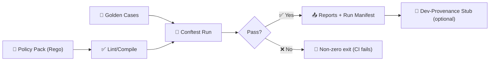

# 🧪 Policy Pack Smoke Test Scripts

> 📍 **You are here:** `mcp/dev_prov/examples/09_policy_pack_smoke_tests/scripts/`  
> 🎯 **Purpose:** Fast, repeatable “fail-closed” smoke tests for **Policy Packs** (OPA/Rego + Conftest) before anything reaches ingestion, API, UI, or Focus Mode.

These scripts are the **thin runnable layer** for Example `09_policy_pack_smoke_tests`. They’re designed to be:
- ✅ **Deterministic** (same inputs ⇒ same decisions)
- 🔒 **Fail-closed** (if a gate can’t be evaluated, treat it as a failure)
- 🧾 **Audit-friendly** (machine-readable outputs + minimal provenance stub)
- 🧩 **Portable** (local dev + CI/CD)

---

## 🧭 Why these scripts exist

KFM’s governance model is built around **automated policy gates** (schema/metadata/provenance/license/sensitivity/citations). Smoke tests give you a fast “does the policy pack still behave?” check **before** deeper integration runs.

This example focuses on the smallest useful slice:
- compile / sanity-check the policy pack
- run “golden” allow/deny cases
- emit reports that CI can read (and humans can skim)

---

## 🗂️ Expected layout (relative to this folder)

```text
📦 09_policy_pack_smoke_tests/
├─ 🧾 policy_pack/              # Rego policies (and/or OPA bundle inputs)
├─ 🧪 cases/                    # fixtures + expected outcomes
├─ 📤 out/                      # generated artifacts (typically gitignored)
└─ 🛠️ scripts/                  # this README + runnable helpers
```

> 💡 Keep `scripts/` focused: orchestration + reporting.  
> Heavy logic should live elsewhere (libraries/modules), then be invoked here.

---

## ✅ Prerequisites

Minimum tools (in `PATH`):
- `bash` (recommended: `bash` 5+)
- `opa`
- `conftest`

Nice-to-have:
- `jq` (pretty JSON + stable sorting)
- `git` (for run metadata: commit SHA, branch, etc.)

---

## 📜 Script contract (non-negotiable)

All scripts in this folder **should** follow the same “small CLI tool” contract:

- 🧪 **Idempotent**: running twice doesn’t create divergent results
- 🧷 **Self-documenting**: `--help` works
- 📥 **Explicit inputs**: accepts `--policy-pack`, `--cases`, `--out` (or env vars)
- 📤 **Writes only to OUT_DIR**: never mutates fixtures/policies
- 🚫 **No partial success**: any policy failure returns non-zero exit
- 🧯 **Safe shell**: `set -euo pipefail` (or strict equivalent)

### Environment variables (recommended)

| Variable | Meaning | Default (recommended) |
|---|---|---|
| `POLICY_PACK_DIR` | Where Rego / bundle sources live | `../policy_pack` |
| `CASES_DIR` | Where fixtures + expected outcomes live | `../cases` |
| `OUT_DIR` | Where reports/artifacts are written | `../out` |
| `OPA_BIN` | OPA executable | `opa` |
| `CONFTEST_BIN` | Conftest executable | `conftest` |

---

## 🛠️ Suggested script lineup (update to match reality)

> ⚠️ If your folder already has scripts with different names, **keep the contract** and just update the table.

| Script (suggested) | Job | Inputs | Outputs |
|---|---|---|---|
| `00_check_deps.sh` | Verify required tooling + versions | N/A | prints versions; exit≠0 on missing |
| `10_lint_rego.sh` | Basic policy lint/compile sanity | `POLICY_PACK_DIR` | `out/rego_lint.txt` (optional) |
| `20_smoke_conftest.sh` | Run golden allow/deny cases | `POLICY_PACK_DIR`, `CASES_DIR` | `out/conftest_report.json` |
| `30_emit_run_manifest.sh` | Emit run metadata (who/what/when) | git + env | `out/run_manifest.json` |
| `40_emit_dev_prov_stub.sh` | Minimal dev provenance stub (JSON-LD) | manifest + results | `out/dev_prov.jsonld` |
| `90_run_all.sh` | Orchestrate full smoke run | all of the above | `out/` populated |

---

## ▶️ Quickstart (local)

```bash
# From repo root
cd mcp/dev_prov/examples/09_policy_pack_smoke_tests

# 1) Run the full smoke suite
./scripts/90_run_all.sh

# 2) Inspect outputs
ls -la ./out
```

### Targeted runs (developer loop)

```bash
# Just check tools
./scripts/00_check_deps.sh

# Just compile/lint policies
./scripts/10_lint_rego.sh

# Just run golden cases
./scripts/20_smoke_conftest.sh
```

---

## 🔁 What “smoke tests” cover in KFM terms

These smoke tests should be a **minimal reflection** of the larger KFM governance surface:

### 🧾 Data governance (FAIR/CARE + provenance)
Examples of policy intent (adapt to your actual rules):
- 📄 “Every dataset must have a license”
- 🧬 “STAC/DCAT/PROV required before publish”
- 🧷 “Provenance-first publishing (no UI/graph exposure without lineage)”
- 🧯 “Sensitive data must be labeled + handled correctly”

### 🤖 AI governance (Focus Mode)
- 🧾 “AI outputs must include citations” (or refuse)
- 🛡️ “No disallowed content / prompt injection controls”
- 🧠 “Claims must be attributable to catalog/graph sources”

### 🗺️ UI / API boundary discipline
- 🧱 “Contract-first inputs/outputs”
- 🧭 “No ‘mystery layers’ in the catalog”
- 🔐 “API is the enforcement boundary (no bypassing)”

---

## 🧩 Flow (high-level)



---

## 📦 Outputs (recommended artifacts)

| File | Why it exists | Used by |
|---|---|---|
| `out/conftest_report.json` | Machine-readable results | CI + tooling |
| `out/run_manifest.json` | Who/what/when inputs for audits | provenance + debugging |
| `out/dev_prov.jsonld` | Minimal dev provenance record | future ingestion / graph linkage |
| `out/summary.txt` | Human-friendly summary | PR reviews |

> 🧠 Keep outputs **stable**: avoid timestamps inside “golden” outputs unless required.  
> If you must include timestamps, put them in the manifest (not the decision report).

---

## 🤝 CI/CD integration (example snippet)

> 🧩 Drop this into your CI job as a single, clear “gate” step.

```yaml
- name: Policy Pack Smoke Tests
  run: |
    set -euo pipefail
    cd mcp/dev_prov/examples/09_policy_pack_smoke_tests
    ./scripts/90_run_all.sh
```

### CI expectations
- ✅ Exit code 0 = “gate open”
- ❌ Exit code ≠ 0 = “gate closed” (block merge)

---

## 🧪 Adding a new smoke case (repeatable protocol)

Use a **scientific-method style** mini-template so cases don’t become random one-offs:

- [ ] **Problem / regression you’re preventing**
- [ ] **Hypothesis** (expected allow/deny + why)
- [ ] **Fixture** (minimal input)
- [ ] **Expected decision** (allow/deny + key reasons)
- [ ] **Run** `./scripts/20_smoke_conftest.sh`
- [ ] **Review** outputs for stability + clarity
- [ ] **Document** what changed (PR description + short note in cases README if present)

### Case design rules
- 🧪 Keep fixtures small (one concept per file)
- 🧱 Prefer “boundary” tests (missing license, missing provenance link, etc.)
- 🧷 Always include at least one **deny** for every new rule
- ✅ Include at least one **allow** showing compliant structure

---

## 🧯 Troubleshooting (common)

<details>
  <summary>🧩 OPA / Conftest not found</summary>

```bash
command -v opa
command -v conftest
opa version
conftest --version
```

If CI has the tools but local does not, align your dev environment with CI (containerize if needed).

</details>

<details>
  <summary>🧾 Rego compile errors</summary>

```bash
# Typical patterns:
# - syntax error
# - undefined rule reference
# - package/name mismatch

./scripts/10_lint_rego.sh
```

Keep lint output in `out/` so it’s easy to attach to PRs.

</details>

<details>
  <summary>🧪 “Golden” cases fail unexpectedly</summary>

Checklist:
- Did the policy decision schema change?
- Did input fixture include extra fields that your rules interpret?
- Are you depending on file ordering or non-canonical JSON?

Tip: canonicalize fixtures (sorted keys) and keep policy output formats stable.

</details>

---

## 🔒 Security & governance notes

- 🔐 Treat policies as **production-grade**: they encode licensing, sensitivity, provenance, and AI safety gates.
- 🚫 Never “temporarily” bypass smoke tests. If a rule is wrong, fix the rule (or document the exception with a governed mechanism).
- 🧾 Prefer **machine-readable outputs** so audits and dashboards can consume them.

---

## ✅ Definition of Done (for this scripts folder)

- [ ] Every script has `--help`
- [ ] `90_run_all.sh` exits non-zero on *any* gate failure
- [ ] Outputs are written only to `out/`
- [ ] Case fixtures are minimal + stable
- [ ] A change to policy pack includes at least one new/updated case
- [ ] CI runs the smoke gate on every PR touching policies or fixtures

---

## 🧠 Maintainer tip

If you’re tempted to add complexity here:
- 🧩 Move shared logic into a reusable module
- 🛠️ Keep scripts as thin wrappers
- 🧾 Preserve the invariant: **fast, deterministic, auditable**

