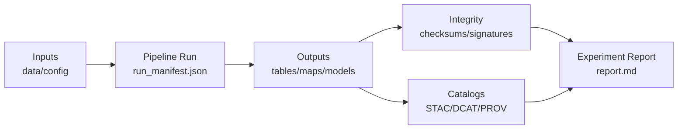

# 🧾 Artifacts (Evidence Vault) — `example_report_tree/artifacts/` 🔐🧭


> **Rule of thumb:** if it’s referenced in the experiment report, it should live here (or be referenced here with a stable, verifiable pointer). ✅  
> **Second rule:** don’t put “results” in prose without the underlying evidence artifacts. “No artifact, no claim.” 🧠🧾

---

## 🎯 What belongs in `artifacts/`?

This folder holds the **auditable evidence** behind the experiment report:
- raw-ish inputs (or immutable references to them)
- configs + seeds + environment locks
- intermediate outputs
- final outputs (tables, maps, models, figures)
- provenance + catalogs + manifests
- QA/policy results + logs

Think of `report.md` as the **narrative** and `artifacts/` as the **court exhibits**. ⚖️

---

## 🗂️ Suggested structure (template)

Use what you need; keep it tidy and predictable.

```text
artifacts/
├─ 📄 README.md                         # 👈 you are here 📌 What this bundle is, how to navigate it, and how to verify it
├─ 📦 manifest/                         # 📦 “What is here + why” (bundle index + reproducibility ledger)
│  ├─ 🧾 artifact_index.yaml             # Inventory: paths → roles → descriptions → primary/secondary designation
│  ├─ 🧾🔐 run_manifest.json             # Deterministic run ledger: commands, params, tool versions, IO pointers, hashes
│  └─ 🧱 environment/                   # 🧱 Reproducible environment capture (pin deps / record build context)
│     ├─ 📦 requirements.txt             # Python deps (or use poetry.lock / uv.lock / etc.)
│     ├─ 🧊 conda-lock.yml               # Optional: locked conda env for reproducibility
│     └─ 🐳 docker_image.txt             # Container image tag/digest used (if applicable)
├─ 🧭 catalogs/                          # 🧭 Evidence triplet metadata (publish/discovery + lineage), when applicable
│  ├─ 🛰️ stac/                           # STAC Collection/Item(s) referencing produced assets
│  ├─ 🗂️ dcat/                           # DCAT Dataset/Distribution records (license, access, links)
│  └─ 🧬 prov/                           # PROV lineage (entities/activities/agents) tying inputs → outputs
├─ 📊 data/                              # 📊 Inputs/outputs (small-to-medium payloads; avoid huge binaries if possible)
│  ├─ 📥 inputs/                         # Raw inputs used by the run (or pointers/receipts if large)
│  ├─ 🧪 intermediates/                  # Intermediate artifacts (kept only if they aid debugging/repro)
│  └─ ✅ outputs/                         # Final outputs intended for review/promotion/publish
├─ 🗺️ geospatial/                        # 🗺️ Map-heavy assets (optional; only if the run produces geo deliverables)
│  ├─ 🗺️ geojson/                        # GeoJSON outputs or samples (keep small)
│  ├─ 🧱 cog/                             # Cloud-Optimized GeoTIFFs (COGs) (or small samples/pointers)
│  ├─ 🧱 pmtiles/                         # PMTiles archives for fast vector tile serving (or sample tiles)
│  └─ 👀 tiles_preview/                   # Small preview tiles/snapshots (quicklook for review)
├─ 📈 figures/                           # 📈 Figures used in reports (charts, screenshots, diagrams)
│  ├─ 🖼️ png/                             # Raster figures
│  ├─ 🧷 svg/                             # Vector figures (preferred for diagrams)
│  └─ 🧾 pdf/                             # Print-ready figures (when needed)
├─ 📓 notebooks/                          # 📓 Optional notebooks (keep runnable + reference locked env)
│  ├─ 📓 analysis.ipynb                   # Notebook capturing exploration/analysis (deterministic where possible)
│  └─ 📄 README.md                        # How to run notebooks + required env/data pointers
├─ 🧾 logs/                               # 🧾 Runtime logs/telemetry/timings (sanitize secrets/PII)
│  ├─ 🪵 pipeline.log                     # Main pipeline log (high-level)
│  ├─ 📊 metrics.json                     # Machine-readable metrics (timings, counts, quality scores)
│  └─ 🪵 stdout_stderr.txt                # Captured console output (useful for debugging)
├─ 🛡️ governance/                         # 🛡️ Policy checks, redaction notes, approvals (audit trail)
│  ├─ 🚦🧾 policy_report.json              # Gate results: pass/fail, findings, severities, pointers
│  ├─ 🔒📝 redaction_notes.md              # What was redacted/withheld and why (sensitivity policy)
│  └─ ✅📝 approvals.md                    # Review sign-offs (who/when/what) for this bundle
├─ 🔒 integrity/                          # 🔒 Integrity + supply-chain proofs (checksums, SBOM, signatures)
│  ├─ 🔐📄 checksums.sha256                # sha256 digest list for bundle files (tamper detection)
│  ├─ 🧾🔐 sbom.spdx.json                  # Optional SBOM for build/toolchain/artifacts
│  └─ 🔏 signatures/                      # Optional cosign signatures/attestations references/exports
└─ 📚 narrative/                           # 📚 Narrative artifacts (optional): Story/Pulse outputs + evidence
   ├─ 📝 story_node.md                     # Story markdown narrative (citations inline)
   ├─ 🧭🧾 story_node.json                  # Story step/config JSON (map/time/layers/actions)
   └─ 📎🧾 evidence_manifest.yaml           # Evidence manifest tying claims → citations → artifacts (plus checksums)
```

---

## ✅ Minimum required files (for most experiments)

### 1) `manifest/run_manifest.json` (required)
A structured description of **exactly what ran**:
- inputs (file paths or stable URIs)
- parameters + hyperparameters
- random seeds
- tool versions
- outputs produced
- runtime summary (counts, sizes, errors)

### 2) `integrity/checksums.sha256` (required)
Hashes for everything in `artifacts/` that is a *material dependency* for reproduction (and optionally everything, if small enough).

### 3) `manifest/artifact_index.yaml` (recommended, near-required)
A human-friendly index of **what’s here**, **why it exists**, and **where it’s referenced** in the report.

---

## 🧾 Artifact index format (recommended)

Create a tiny “table of contents” for machines *and* humans:

```yaml
# artifacts/manifest/artifact_index.yaml
run:
  run_id: EXP-YYYYMMDD-HHMM__short-slug
  report_ref: ../report.md#results
  owner: your-name-or-handle
  created_utc: "2026-01-22T00:00:00Z"

artifacts:
  - id: results_table
    kind: table
    path: ../data/outputs/results.csv
    described_in: ../report.md#results
    notes: "Primary quantitative outcome table."

  - id: model_weights
    kind: model
    path: ../models/model.onnx
    described_in: ../report.md#model
    notes: "Exported model used for evaluation."

  - id: map_layer_cog
    kind: geospatial-raster
    path: ../geospatial/cog/landcover_2020.tif
    described_in: ../report.md#maps
    notes: "Rendered in UI + used for stats."
```

---

## 🧭 If your experiment produces publishable datasets: include the “Evidence Triplet” 🧬

When the experiment outputs a dataset intended to be **discoverable + reusable**, add:

- **STAC** (`catalogs/stac/`) — spatiotemporal indexing + asset links  
- **DCAT** (`catalogs/dcat/`) — catalog/discovery metadata  
- **PROV** (`catalogs/prov/`) — lineage: inputs → process → outputs  

If you don’t need full publishing, keep it lightweight—**but still keep a run manifest + hashes**. 🧠

---

## 🧠 AI/LLM-related outputs (Focus Mode, copilots, summarizers) 🤖

If an artifact was produced by an AI system:
- label it clearly (e.g., `*_ai_draft.md`)
- include the retrieval set / evidence pointers (IDs, URIs, queries)
- include a provenance record of the generation (prompt template ID, model ID, policy outcome)

**No citations / no provenance = not shippable.** ✅

---

## 📚 Narrative artifacts (Story Nodes & Pulse Threads) 🧵✨

If your experiment includes **interactive narrative content** (like a story walkthrough, UI tour, or pulse update), store it here so it’s versioned and reviewable:

- `narrative/story_node.md` — the narrative text
- `narrative/story_node.json` — the “script” (map states, steps, timeline)
- `narrative/evidence_manifest.yaml` — references + raw evidence behind claims

This pattern makes narrative experiments testable: your report can point at exact story steps and their underlying evidence. 🎬🗺️

---

## 🧱 Large binary artifacts (PMTiles / GeoParquet / COG / big models)

If artifacts are too large for Git:
- store them in an artifact registry (OCI-style) or LFS
- **still keep the pointer + digest in `artifacts/`**

Recommended: keep a pointer file like:

```yaml
# artifacts/manifest/oci_distribution.yaml
oci:
  registry: ghcr.io
  repository: myorg/kfm/surficial_geology
  tag: "20260111"
  digest: "sha256:...immutable..."
  files:
    - name: surficial_geology.pmtiles
      mediaType: application/vnd.pmtiles
    - name: surficial_geology.parquet
      mediaType: application/vnd.geo+parquet
  provenance_ref: "oci://.../referrers"
```

---

## 🕵️ Sensitive data & redactions (must be explicit)

If an experiment touches sensitive locations, protected sites, personal info, etc.:
- include a `governance/redaction_notes.md`
- document **what was generalized/removed** and why
- ensure derived assets don’t leak raw coordinates (including in EXIF, GeoJSON properties, logs)

---

## 🛡️ Quality gates checklist (copy into PR or report)

- [ ] `run_manifest.json` present + complete  
- [ ] checksums generated (and updated)  
- [ ] environment pinned (dependencies / container digest)  
- [ ] policy report included (if governance applies)  
- [ ] AI outputs labeled + evidence attached  
- [ ] sensitive data handled (generalized / access-controlled)  
- [ ] report links resolve to artifacts (no broken paths)  

---

## 🔗 Linking from `report.md` (recommended pattern)

In the report, link directly to artifacts using relative paths:

```markdown
See: [results.csv](./artifacts/data/outputs/results.csv)  
See: [run manifest](./artifacts/manifest/run_manifest.json)  
See: [policy report](./artifacts/governance/policy_report.json)
```

If you need citations in prose, use footnotes that point to artifact IDs or catalog entries (stable + reviewable). 🧷

---

## 🧬 (Optional) Visual provenance map



---

## 📚 “Project Library” reference pack (optional, but handy)

If the experiment is based on a reading packet, include it in:
- `artifacts/references/` (small docs), or
- a pointer file in `manifest/` (for large PDFs)

Example pointer:

```text
artifacts/manifest/reference_pack.txt
- AI Concepts & more.pdf
- Data Managment-Theories-Architures-Data Science-Baysian Methods-Some Programming Ideas.pdf
- Maps-GoogleMaps-VirtualWorlds-Archaeological-Computer Graphics-Geospatial-webgl.pdf
- Various programming languages & resources 1.pdf
```

---

## 🧯 Common mistakes (avoid these)

- ❌ “final_v2_REAL_final.csv” with no manifest, no seed, no code ref  
- ❌ screenshots with no underlying data  
- ❌ AI-generated narrative with no citations/evidence  
- ❌ overwriting files in-place instead of versioning  
- ❌ missing license/sensitivity fields for publishable datasets  

---

## 🙌 Good citizen norms

- Prefer **append-only** changes (new run directory, new run_id)  
- If you must revise, create a new `run_id` and note supersession  
- Keep artifacts boring, structured, and verifiable ✨
