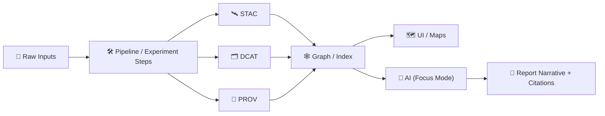

# 📚 Artifact Catalogs — *Experiment Report Spine* (STAC · DCAT · PROV)


> ✅ This folder contains the **machine-readable catalogs** that make an experiment report **reproducible, auditable, and linkable** (from raw sources → processing → datasets → narratives/claims).

---

## 🧭 What lives in `artifacts/catalogs/`?

This directory is the **catalog snapshot** for an experiment report run. Think of it as:

- 🧾 **Metadata catalogs** for inputs & outputs (STAC / DCAT / PROV)
- 🧷 **Indexes/manifests** that glue everything together (what files exist, where they are, and how to resolve IDs)
- 🛡️ **Validation + policy evidence** (optional but recommended) to prove gates passed
- 🔐 **Attestations** (optional) to prove integrity and provenance of large/binary artifacts stored elsewhere

> 💡 **Rule of thumb:** store **metadata** here, not large data. Big files belong in `artifacts/data/` (or an OCI registry) and are referenced *from* these catalogs.

---

## 🗺️ Quick map

- **Humans** read the report narrative elsewhere (`report.md`, `sections/`, etc.)
- **Machines** read this folder to:
  - rebuild a run 🧪
  - verify sources 🔍
  - trace lineage 🧬
  - enforce policy 🔒
  - power UI + AI citations 🧠🗺️

---

## 📦 Recommended layout (template-friendly)

> This template supports flexible layouts, but the structure below is the “happy path” for KFM-style provenance-first reporting.

```text
📦 artifacts/catalogs/
├─ 📄 README.md                      ← you are here
├─ 📄 index.json                     ← one-file entrypoint (recommended)
│
├─ 📂 stac/                          ← spatial/temporal asset catalog
│  ├─ 📄 collection.json
│  └─ 📂 items/
│     ├─ 📄 <item-id>.json
│     └─ 📄 ...
│
├─ 📂 dcat/                          ← dataset discovery catalog (JSON-LD)
│  ├─ 📄 dataset.jsonld
│  └─ 📄 distributions.jsonld        ← optional split-out
│
├─ 📂 prov/                          ← provenance bundles (JSON-LD)
│  ├─ 📄 run.prov.jsonld
│  └─ 📄 activities/                 ← optional per-step provenance
│     ├─ 📄 <activity-id>.prov.jsonld
│     └─ 📄 ...
│
├─ 📂 manifests/                     ← “what happened” & “what changed”
│  ├─ 📄 run_manifest.json           ← inputs/outputs/tooling counts + hashes
│  ├─ 📄 params.json                 ← the experiment config snapshot
│  └─ 📄 environment.json            ← runtime env / container image / versions
│
├─ 📂 evidence/                      ← narrative evidence inventories
│  ├─ 📄 EM-<id>.yaml                 ← evidence manifest(s) for claims/plots
│  └─ 📄 ...
│
├─ 📂 checks/                        ← proof gates passed (optional but 🔥)
│  ├─ 📄 schema_validation.json
│  ├─ 📄 policy_gate.conftest.json
│  ├─ 📄 graph_health.json
│  └─ 📄 qa_summary.md
│
└─ 📂 security/                      ← supply-chain & artifact integrity
   ├─ 📄 sbom.spdx.json
   └─ 📂 attestations/
      ├─ 📄 provenance.intoto.json
      └─ 📄 cosign.bundle.json
```

---

## 🧩 Core catalogs (required)

These are the **boundary artifacts** that connect the pipeline to downstream systems (graph/API/UI/AI).

| Catalog | What it answers | Typical format | Minimum expectation |
|---|---|---:|---|
| 🛰️ **STAC** | “What is this geospatial asset? Where/when? What files?” | JSON | Has spatial/temporal extents + assets + links |
| 🗂️ **DCAT** | “How do I discover this dataset? What is the license? How do I access it?” | JSON-LD | Has title/desc/license/keywords + distributions |
| 🧬 **PROV** | “How was this produced? From what sources? By who/what?” | JSON-LD | Lists inputs, activities, agents, outputs |

> 📌 In KFM-style systems, **nothing becomes “published”** unless these catalogs exist and cross-link correctly.

---

## 🔗 Cross-link rules (don’t break the chain)

Your report will be more than pretty text if the catalogs link *both directions*:

### ✅ Minimum cross-links (recommended)
- **DCAT → STAC**: each dataset distribution points to the STAC collection and/or item(s)
- **DCAT → PROV**: dataset record links to `prov/run.prov.jsonld` (or per-step provenance)
- **STAC → DCAT**: collection/item includes a link/reference back to the dataset record
- **STAC → PROV**: item/collection includes a link/reference to provenance
- **PROV → STAC/DCAT**: provenance bundle references the IDs used by STAC/DCAT (so lineage is resolvable)

### 🧠 Why this matters
- The **graph loader** can ingest STAC/DCAT/PROV consistently
- The **UI** can show “Source: …” and “How was this made?” at click-time
- The **AI** can produce answers with **tight citations** (and log provenance for dynamic queries)

---

## 🧾 `index.json` (highly recommended)

To keep the report template automation simple, provide a single entrypoint:

```jsonc
{
  "report_run_id": "RUN-2026-01-22T00-00-00Z-acde123",
  "catalogs": {
    "stac_collection": "stac/collection.json",
    "stac_items_dir": "stac/items/",
    "dcat_dataset": "dcat/dataset.jsonld",
    "prov_run": "prov/run.prov.jsonld",
    "run_manifest": "manifests/run_manifest.json"
  },
  "checks": {
    "schema_validation": "checks/schema_validation.json",
    "policy_gate": "checks/policy_gate.conftest.json"
  }
}
```

> 🔥 If you only have time for **one** extra file beyond STAC/DCAT/PROV, make it `index.json`.

---

## 🧪 Experiment report integration (dev_prov template)

This folder enables the experiment report template to be:

- 🧷 **Self-contained**: the exact metadata used at run-time is preserved
- ♻️ **Reproducible**: you can re-run with the same catalogs + params
- 🧱 **Composable**: charts, tables, narratives, and map layers can all point to stable IDs

### 🧠 Suggested mental model


---

## 🧷 Evidence manifests (recommended for claims, charts, narratives)

When the report includes **claims** (especially AI-assisted text), attach a structured evidence inventory:

- 📄 `evidence/EM-*.yaml` lists **each evidence item**, how it was used, and how to fetch it
- 🧬 PROV then ties the narrative activity to those evidence entities

This enables:
- “Show me all evidence behind Figure 3”
- “Which reports used dataset X?”
- Automated review workflows (missing citations → fail closed)

---

## 🔐 Policy gates & validation outputs (optional, but strong default)

Place gate results under `checks/` so reviewers can validate trust **without rerunning** the pipeline:

- ✅ schema validation (STAC/DCAT/PROV)
- ✅ license + metadata completeness checks
- ✅ sensitivity/classification checks (public vs restricted)
- ✅ AI citation presence checks
- ✅ graph integrity checks (no orphan entities / broken references)

> 🛡️ If your CI enforces “fail closed,” store the output here so the report has an *audit trail*.

---

## 📦 OCI artifact distribution (optional, for large/binary artifacts)

If your pipeline outputs large artifacts (PMTiles, COGs, GeoParquet, models):

- Store artifacts in an **OCI registry** (content-addressable digests)
- Sign with **Cosign**
- Attach **PROV JSON-LD** and **SBOM** as referrers/attestations
- Keep the *references* here in STAC/DCAT (e.g., `distribution.oci`)

This turns your report into a verifiable “receipt” for exactly what bytes were produced.

---

## 🏷️ Naming & versioning conventions

**Stable IDs** are your friend:

- `report_run_id`: include timestamp + short commit SHA
- Dataset IDs: consistent `domain:name:version` (or your project’s URI scheme)
- Evidence manifests: `EM-<id>.yaml` (where `<id>` can be a short hash or sequential id)

> ✅ Bonus: include canonical hashes in run manifests to enable idempotency + replay.

---

## ✅ Completion checklist

- [ ] `stac/collection.json` exists
- [ ] `dcat/dataset.jsonld` exists
- [ ] `prov/run.prov.jsonld` exists
- [ ] Cross-links resolve (STAC ↔ DCAT ↔ PROV)
- [ ] `manifests/run_manifest.json` present (or equivalent)
- [ ] `index.json` present
- [ ] If the report contains claims/figures: `evidence/EM-*.yaml` present
- [ ] If gating is enabled: `checks/*` captured
- [ ] If OCI used: attestation references captured

---

## 📚 Glossary (fast)

- **STAC**: geospatial item/collection catalog (assets + where/when)
- **DCAT**: discovery catalog for datasets (license, keywords, distributions)
- **PROV**: lineage graph (inputs → activity → outputs + agents)
- **Evidence Manifest**: structured “bibliography” for claims/figures/narratives
- **Run Manifest**: pipeline run ledger (params, tools, inputs/outputs, hashes)

---

## 🔭 Future-ready extensions (safe to add later)

- 🧠 **Conceptual Attention Nodes** (catalog-level thematic pivots)
- 📍 **Pulse Threads** (time-sensitive geotagged narrative updates)
- 🧪 **Weekly Graph Health Check outputs** (metadata about metadata)
- 🧾 **Report-to-dataset “impact tracking”** (stories affected by dataset changes)

---

## 🔗 Related KFM-inspired references (for maintainers)

- 📥 Data Intake philosophy (provenance-first, determinism, policy)  
- 🗺️ UI + AI usage patterns (citations, map layers, focus mode)  
- 🛡️ Security / supply chain / attestation patterns (SBOM, signing, governance)  
- 🧠 Evidence-first narrative patterns (Story Nodes, manifests, PROV edges)

> Keep this README concise for contributors—put deep details in the project docs (profiles, schemas, policy packs).
