# 🗂️ DCAT Catalog (Artifact Discovery) — *Experiment Report Template*


> [!IMPORTANT]
> This folder contains **metadata catalogs**, not the artifacts themselves.  
> The goal is: **every artifact produced by the experiment is discoverable, citable, and policy-checkable** ✅

---

## 🌟 What lives here?

This directory is the **DCAT (Data Catalog Vocabulary)** view of the experiment’s outputs.

- **DCAT** answers: *“What is this dataset/model/report, who published it, what is the license, and where can I get it?”*
- It complements:
  - 🛰️ **STAC** (spatiotemporal geospatial assets: items/collections)
  - 🧬 **PROV** (lineage: what inputs + processes generated the outputs)

> [!TIP]
> Think of this as the **index card** for each artifact (DCAT), pointing to the **inventory** (STAC) and **lab notebook** (PROV).

---

## 🧭 Quick Navigation

- 📁 `../stac/` — STAC catalog for geospatial assets (items/collections)  
- 📁 `../prov/` — PROV bundles for full lineage (runs/activities/entities)  
- 📄 Experiment report root — should link to DCAT datasets as citations

---

## 🧱 Recommended folder layout

```text
📦 artifacts/
└─ 📚 catalogs/
   ├─ 🛰️ stac/
   ├─ 🧬 prov/
   └─ 🗂️ dcat/
      ├─ README.md
      ├─ catalog.jsonld               # (recommended) DCAT Catalog root
      └─ datasets/
         ├─ exp-001.results.jsonld
         ├─ exp-001.figures.jsonld
         └─ exp-001.model.jsonld
```

> [!NOTE]
> `catalog.jsonld` is **recommended** for portability (harvesting + aggregation), but you can also ship standalone dataset files if your workflow prefers it.

---

## 🧪 How this fits the “evidence bundle” pattern

```mermaid
flowchart LR
  A[📥 Inputs / Evidence] --> B[🧪 Processing / Experiment]
  B --> C[📦 Artifacts]
  C --> D[🗂️ DCAT: what/where/license]
  C --> E[🛰️ STAC: geospatial inventory]
  C --> F[🧬 PROV: lineage]
  D --> G[🧠 Graph / Indexing]
  E --> G
  F --> G
  G --> H[🔌 APIs]
  H --> I[🗺️ UI / Focus Mode / Reports]
```



---

## ✅ DCAT Dataset minimum requirements (KFM-style)

Every dataset JSON-LD **must** be useful for:
- discovery (search + filters),
- attribution (source/license),
- governance (classification/sensitivity),
- reproducibility (links to provenance + processing context).

### Required fields (baseline)

| Field | JSON-LD Key (typical) | Why it matters |
|---|---|---|
| Identifier | `@id` + `dcterms:identifier` | Stable reference + dedup across catalogs |
| Title | `dcterms:title` | Human-readable name |
| Description | `dcterms:description` | What it is, what it isn’t |
| Publisher | `dcterms:publisher` | Accountability + trust |
| License | `dcterms:license` | Reuse rules (must be explicit) |
| Contact | `dcat:contactPoint` | “Who do I ask?” |
| Keywords | `dcat:keyword` | Discovery + faceted search |
| Temporal coverage | `dcterms:temporal` | Time filtering + report integrity |
| Distributions | `dcat:distribution[]` | Where/how to access artifacts |
| Provenance link | `dcterms:provenance` and/or `dcterms:relation` | Reproducibility + auditability |

### Strongly recommended fields

| Field | Key | Notes |
|---|---|---|
| Spatial coverage | `dcterms:spatial` | Use bbox/GeoJSON/WKT via `locn:geometry` if relevant |
| Theme | `dcat:theme` | Helps catalog grouping (hydrology, landcover, history, etc.) |
| Version | `owl:versionInfo` or `dcterms:hasVersion` | Tie to experiment run/versioning |
| Checksums | `spdx:checksum` | Tamper detection + reproducibility |
| Sensitivity / classification | `kfm:classification`, `kfm:sensitivity` | Required if governance is enabled |

---

## 🔗 Linking DCAT ↔ STAC ↔ PROV (best practice)

### 1) DCAT Dataset ↔ STAC Collection
Use `dcterms:relation` (or a distribution entry) to point at the STAC Collection file or API endpoint.

### 2) DCAT Dataset ↔ PROV Bundle
Use `dcterms:provenance` to reference the PROV JSON-LD bundle that explains:
- inputs used,
- activities performed,
- parameters/config,
- responsible agents.

> [!IMPORTANT]
> If the experiment report makes a claim using an artifact, that artifact **must** be traceable via DCAT → PROV.

---

## 📤 Distribution patterns (choose what matches your artifact)

A `dcat:distribution` is how you expose access paths.

Common patterns:

- 📎 **Downloadable file** (CSV/GeoJSON/COG/Parquet/PNG/PDF)
- 🔌 **API endpoint** (REST/GraphQL/OGC API Features)
- 🛰️ **STAC endpoint** (catalog or collection URL)
- 🧊 **Tiles** (PMTiles / vector tiles / XYZ / WMTS)
- 📓 **Notebook** (Jupyter `.ipynb` / Binder link)
- 📦 **OCI Artifact** (content-addressed bundle in a registry, signed)

> [!TIP]
> You can include multiple distributions per dataset (e.g., raw file + API + STAC link).

---

## 🧩 KFM-flavored extensions (namespaced)

This template supports optional **KFM extensions** to make governance + federation easier:

- `kfm:classification`: e.g. `public | internal | restricted`
- `kfm:sensitivity`: e.g. `none | pii | cultural | endangered_site | private_land`
- `kfm:sovereignty`: e.g. community authority metadata (when applicable)
- `kfm:run_id`: experiment/pipeline run identifier
- `kfm:lineage_bundle`: pointer to PROV bundle

> [!NOTE]
> Keep extensions **namespaced** (e.g., `kfm:`) to stay DCAT-compatible.

---

## 🧾 Template: `catalog.jsonld` (recommended root)

```json
{
  "@context": [
    "https://www.w3.org/ns/dcat2.jsonld",
    {
      "dcat": "http://www.w3.org/ns/dcat#",
      "dcterms": "http://purl.org/dc/terms/",
      "foaf": "http://xmlns.com/foaf/0.1/",
      "prov": "http://www.w3.org/ns/prov#",
      "spdx": "http://spdx.org/rdf/terms#",
      "kfm": "https://kansasfrontiermatrix.org/ns#"
    }
  ],
  "@id": "urn:uuid:00000000-0000-0000-0000-000000000000",
  "@type": "dcat:Catalog",
  "dcterms:title": "🧪 Experiment Report Artifact Catalog",
  "dcterms:description": "DCAT catalog for artifacts produced by this experiment report bundle.",
  "dcterms:publisher": {
    "@type": "foaf:Organization",
    "foaf:name": "Kansas Frontier Matrix (KFM)"
  },
  "dcat:dataset": [
    { "@id": "datasets/exp-001.results.jsonld" },
    { "@id": "datasets/exp-001.figures.jsonld" }
  ]
}
```

---

## 🧾 Template: DCAT Dataset (`datasets/<id>.jsonld`)

```json
{
  "@context": [
    "https://www.w3.org/ns/dcat2.jsonld",
    {
      "dcat": "http://www.w3.org/ns/dcat#",
      "dcterms": "http://purl.org/dc/terms/",
      "foaf": "http://xmlns.com/foaf/0.1/",
      "prov": "http://www.w3.org/ns/prov#",
      "spdx": "http://spdx.org/rdf/terms#",
      "owl": "http://www.w3.org/2002/07/owl#",
      "kfm": "https://kansasfrontiermatrix.org/ns#"
    }
  ],
  "@id": "urn:kfm:dataset:exp-001:results",
  "@type": "dcat:Dataset",
  "dcterms:identifier": "exp-001.results",
  "dcterms:title": "EXP-001 — Results Table",
  "dcterms:description": "Primary results table for EXP-001. Includes aggregated metrics and uncertainty bounds.",
  "dcterms:publisher": {
    "@type": "foaf:Organization",
    "foaf:name": "Kansas Frontier Matrix (KFM)"
  },
  "dcterms:license": {
    "@id": "https://creativecommons.org/licenses/by/4.0/"
  },
  "dcat:contactPoint": {
    "@type": "vcard:Kind",
    "vcard:fn": "KFM Maintainers",
    "vcard:hasEmail": "mailto:maintainers@example.org"
  },
  "dcat:keyword": ["experiment", "results", "reproducibility"],
  "dcterms:temporal": {
    "@type": "dcterms:PeriodOfTime",
    "dcat:startDate": "2026-01-01",
    "dcat:endDate": "2026-01-22"
  },

  "kfm:run_id": "run-2026-01-22T00-00-00Z",
  "kfm:classification": "public",
  "kfm:sensitivity": "none",

  "dcterms:provenance": [
    { "@id": "../prov/run-2026-01-22.jsonld" }
  ],
  "dcterms:relation": [
    { "@id": "../stac/collections/exp-001.collection.json" }
  ],

  "dcat:distribution": [
    {
      "@type": "dcat:Distribution",
      "dcterms:title": "CSV download",
      "dcat:downloadURL": "../../data/results/exp-001/results.csv",
      "dcat:mediaType": "text/csv"
    },
    {
      "@type": "dcat:Distribution",
      "dcterms:title": "Notebook",
      "dcat:accessURL": "../../notebooks/exp-001-analysis.ipynb",
      "dcat:mediaType": "application/x-ipynb+json"
    },
    {
      "@type": "dcat:Distribution",
      "dcterms:title": "API endpoint",
      "dcat:accessURL": "https://api.example.org/experiments/exp-001/results",
      "dcat:mediaType": "application/json"
    }
  ]
}
```

> [!WARNING]
> If you include a restricted dataset: set `kfm:classification` / `kfm:sensitivity` accordingly **and** ensure your distributions don’t leak access (e.g., private URLs, auth-only endpoints).

---

## 🧪 Workflow: adding a new artifact (the “no mystery artifacts” rule)

1. **Generate** artifact files (tables, tiles, models, figures, notebooks, etc.) 📦  
2. **Record lineage** in `../prov/` (what inputs + code produced it) 🧬  
3. **Catalog assets** in `../stac/` if geospatial/spatiotemporal 🛰️  
4. **Create/update DCAT dataset** in `datasets/` with:
   - publisher/license/contact,
   - keywords/temporal/spatial coverage,
   - distributions that point to the artifact(s),
   - links to STAC + PROV 🔗  
5. **Reference the dataset** from the experiment report narrative (citation-style) 📝 
6. **Run validation / policy gates** ✅

---

## 🛡️ Validation & Policy Gates (what should fail CI)

This template expects automated checks to block merges when:

- ❌ schema is invalid (JSON-LD parse errors)
- ❌ required DCAT fields are missing
- ❌ license is missing/unknown
- ❌ sensitivity/classification is missing (when governance enabled)
- ❌ provenance link is missing for derived artifacts
- ❌ distributions point to non-existent files (for portable bundles)

> [!TIP]
> Treat metadata like code: reviewable, diffable, testable.

---

## 🗺️ Why the UI/AI care about DCAT

DCAT is how UI/AI can reliably show:

- 📌 **Source attribution** (“Source: …”)
- 📜 **License + reuse terms**
- 🧾 **Dataset summary** in “Layer Info”
- 🔎 **Faceted search** (keywords, theme, time)
- 🧠 **Citations** in Focus Mode / report exports

---

## 🧰 Troubleshooting

<details>
<summary><strong>Common issues (click to expand)</strong></summary>

- **Relative paths break when moved**
  - Prefer paths relative to the report bundle root, and keep the bundle structure stable.
- **Too many datasets**
  - Consider grouping: one DCAT dataset per “logical product” (e.g., “EXP-001 Results”) with multiple distributions.
- **Geospatial assets not discoverable**
  - Add STAC collection/item and link it from DCAT via `dcterms:relation`.
- **Need to catalog a model**
  - Use `dcat:Dataset` for model outputs too, and add:
    - a distribution for the model binary,
    - a distribution for the model card (markdown/pdf),
    - provenance link(s) back to training data and run.
</details>

---

## ✅ Contributor checklist

- [ ] Dataset has **title + description** (clear, not vague)
- [ ] **Publisher + contact** present
- [ ] **License** is explicit
- [ ] **Keywords** are meaningful
- [ ] **Temporal coverage** added (and spatial if relevant)
- [ ] **Distributions** are usable
- [ ] **PROV** link exists for derived outputs
- [ ] **STAC** link exists if geospatial
- [ ] Classification/sensitivity set when applicable

---

## 🧾 See also

- `../prov/README.md` — lineage and run bundles 🧬  
- `../stac/README.md` — geospatial inventory 🛰️  
- Experiment report narrative — should cite DCAT datasets 📝
