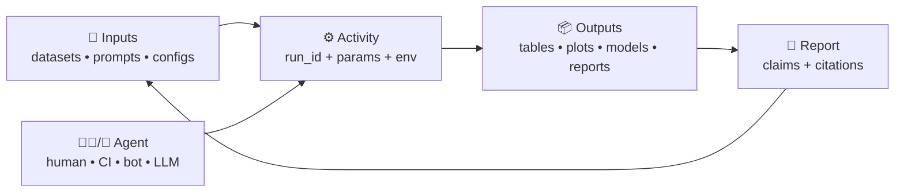

# 🧾 PROV Catalog (W3C PROV-O) — Experiment Report Template


Welcome to the **PROV catalog** 📦 — the place where we store **lineage + “receipts”** for every experiment artifact in this example report tree.

If it’s in the report, it must be traceable. No mystery outputs. No vibes-only science. 😄

---

## 🧭 What lives here?

This folder contains **W3C PROV-O / PROV-JSON (JSON-LD)** bundles that describe:

- **Entities** 🧱: inputs & outputs (datasets, prompts, configs, models, figures, tables, PDFs, etc.)
- **Activities** ⚙️: the runs/steps that produced outputs (ETL, training, evaluation, export, rendering)
- **Agents** 🧑‍💻🤖: who/what did it (human, CI runner, “planner” agent, LLM, pipeline service)

> [!IMPORTANT]
> **A report artifact is not “publishable” until it has a PROV record** (and is cross-linked from the other catalogs like STAC/DCAT, when applicable).

---

## 🧠 Why PROV?

Because experiments are only as trustworthy as their **reproducibility story**:

- ✅ *What exactly did we run?*
- ✅ *On which exact inputs?*
- ✅ *With what params, code, environment, and governance constraints?*
- ✅ *Which outputs were generated, and which claims rely on them?*

PROV turns those answers into **machine-readable graph edges**, not just prose.

---

## 🗂️ Expected folder structure (template-friendly)

You can keep it simple, but stay consistent. A recommended layout:

```text
📁 artifacts/
  📁 catalogs/
    📁 prov/                 # 👈 you are here
      📄 README.md
      📄 index.json          # optional: quick lookup of run_id -> prov file(s)
      📁 runs/
        📁 <run_id>/         # one folder per run (training/eval/export/etc.)
          📄 prov.jsonld
          📄 run_context.json        # params + seeds + CLI args + config hashes
          📄 environment.json        # python, OS, container image, deps (SBOM ok)
          📁 receipts/              # download headers, query receipts, etc.
          📁 logs/                  # structured logs (ndjson preferred)
      📁 artifacts/
        📄 <artifact_id>.prov.jsonld # optional: per-asset provenance (figures, tables)
```

> [!TIP]
> If you’re unsure, start with **one `prov.jsonld` per run** under `runs/<run_id>/`, then add per-asset PROV only when it provides extra clarity.

---

## 🔗 Cross-catalog linking (STAC/DCAT/PROV “triplet”)

This experiment template assumes a **catalog-driven** workflow:

- **DCAT** = discovery / citation / licensing 🏷️
- **STAC** = spatial/temporal asset indexing 🗺️
- **PROV** = lineage / chain-of-custody ⛓️

**Rules of thumb:**
- STAC Items/Collections should link to the PROV record that produced them.
- DCAT Datasets/Distributions should link to STAC (if relevant) and PROV.
- PROV should point back to entity identifiers used in STAC/DCAT (IDs/URIs).

> [!IMPORTANT]
> Cross-links are how we prevent “metadata drift” (where catalogs disagree about what something is).

---

## ✅ Minimum PROV requirements (the “definition of done”)

For each run-level PROV bundle:

### 1) Entities (inputs & outputs)
Include at least:
- input dataset(s) (or their catalog IDs)
- config/spec files
- code version reference (git SHA, tag, or content hash)
- output artifacts (files + hashes)

### 2) Activity (the run itself)
Include:
- start/end timestamps
- run_id
- a readable label (e.g., `train_model`, `evaluate_baseline`, `render_report`)
- key params (or a pointer to `run_context.json`)

### 3) Agent (who/what)
Include:
- human contributor OR CI identity
- pipeline/bot identity (if applicable)
- LLM identity (if used) and the *role* it played (drafting vs deciding vs executing)

---

## 🧪 A tiny PROV JSON-LD example (copy/paste starter)

```json
{
  "@context": "https://www.w3.org/ns/prov.jsonld",
  "entity": {
    "ex:input_dataset": {
      "prov:label": "Input dataset (catalog ref)",
      "prov:type": "prov:Entity",
      "ex:catalog_ref": "dcat:dataset/kfm.example.inputs.v1"
    },
    "ex:output_metric_table": {
      "prov:label": "Metrics table (CSV)",
      "prov:type": "prov:Entity",
      "ex:path": "artifacts/results/metrics.csv",
      "ex:sha256": "<sha256-here>"
    }
  },
  "activity": {
    "ex:run_eval_001": {
      "prov:label": "Evaluate baseline model",
      "prov:type": "prov:Activity",
      "prov:startTime": "2026-01-22T12:00:00Z",
      "prov:endTime": "2026-01-22T12:05:00Z",
      "ex:run_id": "eval_001",
      "ex:run_context": "runs/eval_001/run_context.json"
    }
  },
  "agent": {
    "ex:ci_runner": {
      "prov:label": "CI Runner",
      "prov:type": "prov:Agent",
      "ex:provider": "github-actions"
    }
  },
  "used": {
    "_:use1": {
      "prov:activity": "ex:run_eval_001",
      "prov:entity": "ex:input_dataset",
      "prov:role": "evaluation_data"
    }
  },
  "wasGeneratedBy": {
    "_:gen1": {
      "prov:entity": "ex:output_metric_table",
      "prov:activity": "ex:run_eval_001"
    }
  },
  "wasAssociatedWith": {
    "_:assoc1": {
      "prov:activity": "ex:run_eval_001",
      "prov:agent": "ex:ci_runner"
    }
  }
}
```

---

## 🧰 Provenance “extras” we strongly recommend

### 🔐 Integrity & reproducibility
- hashes for every output (sha256)
- hashes for key inputs (or immutable IDs)
- container image digest (if used)
- dependency snapshot / SBOM

### 🧾 Receipts (the “show your work” folder)
Put request metadata here when applicable:
- download headers (ETag / Last-Modified)
- API query params
- SQL query receipts (sanitized)
- model card / evaluation card snippets

### 🧠 LLM involvement (if used)
If an LLM was used in the experiment/report pipeline:
- record the **LLM as an Agent**
- record prompts/templates as Entities (avoid secrets)
- record generated text as Entities (and link to its evidence entities)
- record the governance/policy decision path (if any)

> [!NOTE]
> If the assistant can’t back a claim with cataloged evidence, the right behavior is to **refuse or mark uncertainty** — and PROV should make that auditable.

---

## 🧭 “Golden Path” checklist (what to do when adding a new artifact)

1. **Create the artifact** (data/model/plot/table/report chunk)
2. **Attach identity**: stable path + checksum
3. **Write/update PROV** (run-level first; per-asset if needed)
4. **Cross-link** from other catalogs (DCAT/STAC) as appropriate
5. **Validate** the JSON-LD is well-formed (and conforms to any local profile)
6. **Commit via review** (GitOps style) ✅

---

## 🧩 Optional: OCI registry packaging (big artifacts)

For heavy artifacts (tilesets, large binaries, model bundles), you *can* store them in an OCI registry (ORAS)
and cryptographically sign them (Cosign). If you do:

- reference the OCI **digest** in catalogs and PROV
- treat the digest as the immutable identity (tags are convenience)
- attach provenance attestations as “referrers” where possible

---

## 🧭 Visual mental model (lineage at a glance)



---

## 🛡️ Safety & hygiene rules

- 🚫 **No secrets** in PROV (API keys, tokens, private URLs)
- 🧽 Sanitize receipts/logs (especially if they include identifiers)
- 🏷️ Add classification/visibility tags if your project uses them
- 🧠 If an AI generated content, **label it** and keep it evidence-linked

---

## 🔚 Done is better than perfect ✅

Start with run-level PROV and grow detail as the project matures. The goal is simple:

> **Anyone** should be able to answer: “How did we get here?” — with receipts.

Happy tracing. ⛓️✨
