# 🗺️ STAC Catalog (Experiment Artifacts)

    

> [!IMPORTANT]
> This folder is the **geospatial inventory 🧾➡️🗺️** for the experiment report.  
> If a map layer, tileset, or spatial dataset is referenced by the report, it should be described here **as STAC** (and cross-linked to **DCAT + PROV**).

## 🔗 Quick Links
- 📦 **DCAT catalog (dataset-level metadata):** `../dcat/`
- 🧾 **PROV records (lineage & processing):** `../prov/`
- ⬆️ **Back to catalogs root:** `../`

---

## 🎯 What this folder is for
This folder holds a **portable STAC snapshot** for the experiment report. It describes:
- **What** spatial artifacts exist (rasters, vectors, tiles, 3D assets, etc.)
- **Where** they apply (geometry / bbox)
- **When** they apply (datetime or interval)
- **How to fetch** them (assets → `href`s with MIME types)
- **How they were made** (cross-links to **PROV**)  
- **How they should be discovered/credited** (cross-links to **DCAT**)

This mirrors KFM’s “evidence-first” pattern where catalogs are a **trust boundary** between “files on disk” and “things we show users / load into graph / answer with.” ✅

---

## 🧩 Where STAC fits (the “Evidence Triplet”)

```mermaid
flowchart LR
  A["Inputs (raw evidence) 📥"] --> B["Processing / Modeling 🛠️"]
  B --> C["Artifacts (files) 🗂️"]
  B --> D["DCAT 📦 (discovery)"]
  B --> E["STAC 🗺️ (spatiotemporal + assets)"]
  B --> F["PROV 🧾 (lineage)"]
  D --> G["Graph/API/UI 🧠🔌🧭"]
  E --> G
  F --> G
```


> [!NOTE]
> In the experiment report template, the catalogs live under `artifacts/catalogs/*` so the report stays **self-contained** and can later be promoted into the “official” catalogs.

---

## 🗂️ Recommended Layout
A minimal, practical layout that stays friendly to static hosting and CI validation:

```text
artifacts/
  catalogs/
    stac/
      README.md
      collection.json              # ✅ recommended single collection for the experiment
      items/
        <item_id>.json             # ✅ one per geospatial artifact (or per time slice/granule)
```

> [!TIP]
> If you truly need multiple collections (e.g., multiple unrelated AOIs or domains), create `collections/<collection_id>/collection.json` and keep items grouped underneath—just stay consistent.

---

## ✅ Minimum Requirements (KFM-friendly STAC)
### 1) A **Collection** for the experiment
- `collection.json` should represent “this experiment run” (or “this experiment dataset family”).

### 2) An **Item** per spatial artifact
- Each `items/<item_id>.json` is a STAC Item (GeoJSON Feature).

### 3) Two required KFM fields (policy + governance)
These are treated as “non-negotiables” in KFM-style gates:

| Field | Where | Why it matters |
|---|---|---|
| `kfm:dataset_id` | `properties` | Stable identifier that ties STAC ↔ DCAT ↔ PROV ↔ graph |
| `kfm:classification` | `properties` | Sensitivity / governance label (access + handling rules) |

> [!CAUTION]
> If the dataset is sensitive, consider **generalizing geometry / bounding boxes**, limiting asset access, and/or publishing a “public derivative” item with redacted spatial precision.

---

## 🔁 Required Cross-Links to DCAT + PROV
To keep the report bundle navigable (and to support auditability), every STAC Item **should link** to:
- A **DCAT dataset record** in `../dcat/`
- A **PROV record** in `../prov/`

### Recommended convention (simple + tooling-friendly)
Use **STAC assets** to link the metadata siblings:

- `assets.dcat` → `../dcat/<dataset>.jsonld`
- `assets.provenance` → `../prov/<item_or_run>.jsonld`

This keeps the linkage colocated with the artifact’s assets and avoids “mystery layer” issues.

---

## 🧾 Example: `collection.json` (single-collection pattern)
```json
{
  "type": "Collection",
  "stac_version": "1.0.0",
  "id": "exp-<experiment_id>",
  "title": "Experiment: <short title>",
  "description": "STAC Collection for experiment artifacts captured in this report bundle.",
  "license": "varies",
  "extent": {
    "spatial": { "bbox": [[-102.05, 36.99, -94.59, 40.00]] },
    "temporal": { "interval": [["2025-01-01T00:00:00Z", null]] }
  },
  "summaries": {
    "kfm:classification": ["public", "internal", "restricted"]
  },
  "links": [
    { "rel": "self", "href": "./collection.json", "type": "application/json" }
  ]
}
```

---

## 🗺️ Example: `items/<item_id>.json` (artifact item)
```json
{
  "type": "Feature",
  "stac_version": "1.0.0",
  "id": "<item_id>",
  "collection": "exp-<experiment_id>",
  "geometry": {
    "type": "Polygon",
    "coordinates": [[[ -100.0, 38.0 ], [ -99.0, 38.0 ], [ -99.0, 39.0 ], [ -100.0, 39.0 ], [ -100.0, 38.0 ]]]
  },
  "bbox": [-100.0, 38.0, -99.0, 39.0],
  "properties": {
    "datetime": "2025-06-01T00:00:00Z",
    "title": "<Human-friendly layer title>",
    "kfm:dataset_id": "<stable_dataset_id>",
    "kfm:classification": "public",
    "devprov:experiment_id": "<experiment_id>",
    "kfm:run_id": "<run_id_or_commit_sha>"
  },
  "assets": {
    "data": {
      "href": "../../data/<path-to-artifact>",
      "type": "application/octet-stream",
      "roles": ["data"],
      "title": "Primary artifact"
    },
    "thumbnail": {
      "href": "../../figures/<thumb>.png",
      "type": "image/png",
      "roles": ["thumbnail"]
    },
    "dcat": {
      "href": "../dcat/<stable_dataset_id>.dataset.jsonld",
      "type": "application/ld+json",
      "roles": ["metadata"],
      "title": "DCAT dataset record"
    },
    "provenance": {
      "href": "../prov/<item_id>.prov.jsonld",
      "type": "application/ld+json",
      "roles": ["metadata", "provenance"],
      "title": "PROV lineage record"
    }
  },
  "links": [
    { "rel": "self", "href": "./items/<item_id>.json", "type": "application/geo+json" },
    { "rel": "collection", "href": "../stac/collection.json", "type": "application/json" }
  ]
}
```

> [!TIP]
> Add more assets as needed (`tiles`, `legend`, `rendered`, `metadata`, etc.).  
> If publishing **PMTiles/MBTiles** for offline or fast web rendering, give them a clear `roles: ["tiles"]`.

---

## 🧪 How to add a new STAC artifact (repeatable workflow)
1. **Pick an ID**
   - ✅ stable, sluggy, and deterministic (avoid “random names” unless you truly need a UUID)
2. **Create / update `collection.json`**
   - ensure extent covers your items (spatial + temporal)
3. **Add `items/<item_id>.json`**
   - include geometry, bbox, datetime/interval
   - include `kfm:dataset_id` and `kfm:classification`
4. **Point assets to real files**
   - prefer **relative** `href`s inside the report bundle
5. **Cross-link DCAT + PROV**
   - make sure sibling records exist and are referenced from the item

---

## ✅ Validation Checklist (CI-friendly)
Use this as a “definition of done”:

- [ ] Every `items/*.json` parses as valid JSON
- [ ] `stac_version` present everywhere
- [ ] `geometry` + `bbox` present and WGS84-ish (or intentionally redacted)
- [ ] `properties.datetime` OR `start_datetime`+`end_datetime`
- [ ] `kfm:dataset_id` present
- [ ] `kfm:classification` present
- [ ] Every `assets.*.href` resolves to an existing file (or a deliberate external URI)
- [ ] `assets.dcat` and `assets.provenance` exist and resolve
- [ ] License and attribution are represented (typically in DCAT, but don’t omit it)

> [!WARNING]
> If your experiment output is meant to become “official,” don’t bypass catalogs—promote by updating **DCAT/STAC/PROV** first, then update downstream consumers.

---

## 🧰 Advanced Patterns (optional, but powerful)

<details>
<summary><strong>📡 Real-time / streaming experiments</strong></summary>

If your experiment produces time-stamped observations (minute-by-minute sensor points, GTFS-RT, nowcasts, etc.), prefer:
- one STAC Item per observation **or** per micro-batch window  
- append-only updates (idempotent runs should not create duplicates)

Pro tip: keep `devprov:experiment_id` stable and let `kfm:run_id` track each ingest/model run.

</details>

<details>
<summary><strong>📦 Offline packs (field mode)</strong></summary>

If you generate offline bundles for mobile/field use, include:
- a tiles asset (e.g., `pmtiles`/`mbtiles`)
- a lightweight thumbnail
- cross-links to DCAT + PROV

This helps the UI load “the right thing” offline while still carrying attribution + provenance.

</details>

<details>
<summary><strong>🧾 Supply-chain friendly assets (OCI / digests)</strong></summary>

If artifacts are stored in an OCI registry, you can use a digest-pinned reference:

- `href: "oci://<registry>/<repo>/<artifact>@sha256:<digest>"`

This plays well with signed artifacts and reproducible builds—especially when combined with PROV that records the producing run context.

</details>

---

## 🚀 Promotion Path (from experiment → official catalogs)
When an experiment becomes canonical:
1. Copy (or regenerate) STAC records into the project’s main STAC locations (e.g., `data/stac/...`)
2. Ensure DCAT + PROV records land alongside (and validate)
3. Run policy/validation gates
4. Only then wire up graph ingestion / API / UI

---

## 📚 Project Docs & Reference Packs (used when designing this template)
These documents informed the conventions and “why” behind this folder:

### Core KFM docs 🧭
- **📚 KFM Data Intake – Technical & Design Guide** (pipelines, catalogs, triplet design)
- **Kansas Frontier Matrix – Comprehensive UI System Overview** (why provenance must be user-visible)
- **Kansas Frontier Matrix – AI System Overview 🧭🤖** (evidence-backed answers + provenance enforcement)
- **Kansas Frontier Matrix – Comprehensive Architecture, Features, and Design** (policy gates, offline mode patterns)
- **Kansas Frontier Matrix – Comprehensive Technical Documentation** (contract-first + governance)

### Futures + governance + inspiration 💡
- **🌟 KFM – Latest Ideas & Future Proposals**
- **Innovative Concepts to Evolve KFM**
- **Additional Project Ideas**

### Reference libraries (PDF portfolios) 🧰📦
These are bundled “bookshelf” PDFs containing embedded references (geospatial/WebGL/programming/data mgmt/AI).
- **AI Concepts & more**
- **Maps / Google Maps / Virtual Worlds / Archaeological CG / Geospatial WebGL**
- **Various programming languages & resources**
- **Data Management / Architectures / Data Science / Bayesian Methods / Programming ideas**
