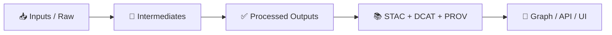

# 🧪 `artifacts/data/intermediates/` — Experiment “In‑Between” Artifacts


Welcome to the **intermediates** zone: the place for **temporary, reproducible, auditable “work-in-progress” outputs** produced *between* raw inputs and final published artifacts.

This folder mirrors KFM’s staged data lifecycle (**raw → work → processed**) where “work” is explicitly for intermediate results. <!--  [oai_citation:0‡MARKDOWN_GUIDE_v13.md.gdoc](file-service://file-UYVruFXfueR8veHMUKeugU) -->

---

## 🎯 What belongs here?

Intermediates are artifacts that are:

- ✅ **Derived** from inputs (raw + configs + code) but **not yet “publishable”**
- ✅ Useful for **debugging**, **validation**, **profiling**, and **inspection**
- ✅ Often **step outputs**: normalization, joins, feature generation, tiling pre-steps, embeddings caches, etc.
- ✅ Safe to delete and regenerate (given the same inputs + config)

> **Rule of thumb:** If it’s *needed to explain, verify, or reproduce* the pipeline *before* you promote to “final”, it probably belongs here.

KFM emphasizes **deterministic pipelines** and **no hidden/manual edits**—intermediates should be reproducible from code/config and logged for auditability. <!--  [oai_citation:1‡📚 Kansas Frontier Matrix (KFM) Data Intake – Technical & Design Guide.pdf](file-service://file-EbUCdsJMbu5KwpoKMrLrgj) -->

---

## 🚫 What does *not* belong here?

- ❌ Final “served” outputs (those belong in `processed/` and/or artifact registries)
- ❌ Anything that bypasses provenance/catalog requirements (no “mystery data”)
- ❌ Secrets / tokens / private keys
- ❌ Unreviewed human hand-edits that aren’t captured as pipeline/config changes

KFM’s policy gates are designed to “fail closed” and enforce metadata + provenance completeness before publication. <!--  [oai_citation:2‡Kansas Frontier Matrix (KFM) – Comprehensive Architecture, Features, and Design.pdf](file-service://file-4Umt1yHoGKicdmLWzFJ9sC) -->

---

## 🗂️ Recommended layout (run-scoped)

Keep intermediates **organized by run**, so you can diff runs, re-run safely, and purge cleanly.

```text
📁 artifacts/data/intermediates/
├─ 📁 runs/
│  └─ 📁 2026-01-22__exp-010__abcdef12/
│     ├─ 🧾 run_manifest.json
│     ├─ 🔐 checksums.sha256
│     ├─ 📁 00_inputs/
│     ├─ 📁 10_extract/
│     ├─ 📁 20_normalize/
│     ├─ 📁 30_features/
│     ├─ 📁 40_models/
│     ├─ 📁 50_eval/
│     ├─ 📁 90_debug/
│     └─ 📁 logs/
└─ 🧹 .gitkeep
```

### 🧾 `run_manifest.json` (required)
A structured **Run Manifest** records what ran, with what inputs, and what it produced—supporting audit + reproducibility. <!--  [oai_citation:3‡Additional Project Ideas.pdf](file-service://file-Pc2GNivcrHBeKjBQksLC3T) -->

Minimum suggested fields:

```json
{
  "run_id": "2026-01-22__exp-010__abcdef12",
  "timestamp_utc": "2026-01-22T00:00:00Z",
  "git": { "commit": "abcdef1234", "dirty": false },
  "inputs": [{ "name": "raw_source", "uri": "data/raw/...", "sha256": "..." }],
  "config": [{ "path": "configs/exp010.yaml", "sha256": "..." }],
  "environment": { "python": "3.x", "docker_image": "sha256:..." },
  "outputs": [{ "path": "30_features/features.parquet", "sha256": "...", "rows": 12345 }]
}
```

> 💡 Consider hashing the manifest itself for integrity, as described in KFM’s “Run Manifest” concept. <!--  [oai_citation:4‡Additional Project Ideas.pdf](file-service://file-Pc2GNivcrHBeKjBQksLC3T) -->

### 🔐 `checksums.sha256` (strongly recommended)
Store checksums for key intermediates to detect drift and confirm deterministic outputs.

### 🪵 `logs/` (recommended)
For reproducibility and troubleshooting, capture:
- command lines
- timings
- warnings/errors
- seed values (for ML/simulations)

Determinism (including **recorded seeds**) is a cornerstone of reproducible experiments. <!--  [oai_citation:5‡Scientific Method _ Research _ Master Coder Protocol Documentation.pdf](file-service://file-HTpax4QbDgguDwxwwyiS32) -->

---

## 🧬 Provenance & “promotion” (intermediates → published)

Intermediates are **not** considered “published”. KFM’s “boundary artifacts” for publication are the **evidence triplet**:
- **STAC** (assets + spatiotemporal)
- **DCAT** (discovery)
- **PROV** (lineage)  
…and data is *not* “official” until these exist. <!--  [oai_citation:6‡📚 Kansas Frontier Matrix (KFM) Data Intake – Technical & Design Guide.pdf](file-service://file-EbUCdsJMbu5KwpoKMrLrgj) -->

KFM also expects PROV to cover the full chain **raw → intermediate → processed**. <!--  [oai_citation:7‡MARKDOWN_GUIDE_v13.md.gdoc](file-service://file-UYVruFXfueR8veHMUKeugU) -->

> ✅ **Promotion checklist:**  
> Intermediate outputs are “promotable” only when you can generate the corresponding STAC/DCAT/PROV and pass policy gates. <!--  [oai_citation:8‡Kansas Frontier Matrix (KFM) – Comprehensive Architecture, Features, and Design.pdf](file-service://file-4Umt1yHoGKicdmLWzFJ9sC) -->

---

## 📦 Large intermediates: don’t commit blobs—use artifact storage

For big files (tilesets, models, large parquet/cogs), prefer:
- store by **immutable digest** in an **OCI registry**
- sign with **Cosign**
- keep a **pointer + digest** here (and in catalogs when publishing)

KFM explicitly describes OCI artifact distribution + Cosign verification for provenance/integrity. <!--  [oai_citation:9‡Additional Project Ideas.pdf](file-service://file-Pc2GNivcrHBeKjBQksLC3T) -->
It also notes OCI’s alignment with FAIR+CARE and attaching provenance attestations. <!--  [oai_citation:10‡Additional Project Ideas.pdf](file-service://file-Pc2GNivcrHBeKjBQksLC3T) -->

Example pointer file:

```yaml
# 📄 40_models/model.pointer.yaml
artifact: "oci://registry.example/kfm/exp-010/model"
digest: "sha256:deadbeef..."
signed: true
provenance_referrer: "prov.jsonld"
```

---

## 🗺️ Common KFM-shaped intermediate types (examples)

### 🌍 Geospatial processing
- `*.geojson` exports for inspection (quick visual QA)
- `*.parquet` / `*.geoparquet` feature tables
- `*.tif` staging before COG conversion
- `tiles/` staging before final vector tiles/PMTiles packaging

KFM favors open formats like GeoJSON, Parquet/GeoParquet, and COG for rasters. <!--  [oai_citation:11‡Kansas Frontier Matrix (KFM) – Comprehensive Technical Documentation.pdf](file-service://file-AkqwUuYPp5zePf7pv5SMxi) -->
A geospatial “hub” design also calls out rasters as COGs and generating tiles for interactive use. <!--  [oai_citation:12‡Kansas-Frontier-Matrix_ Open-Source Geospatial Historical Mapping Hub Design.pdf](file-service://file-64djFYQUCmxN1h6L6X7KUw) -->

### 🧠 AI / Retrieval / Indexing
- embedding caches
- cached query results
- intermediate retrieval bundles for audits

KFM explicitly discusses caching and precomputed embeddings for responsiveness. <!--  [oai_citation:13‡Kansas Frontier Matrix (KFM) – AI System Overview 🧭🤖.pdf](file-service://file-Pv8eev6RWvCKrGCXyzY7zg) -->

### 🧵 Evidence-first narratives (Story Nodes / reports)
- extracted citations tables
- “evidence manifests” mapping claims → sources
- intermediate render outputs (markdown→html previews)

KFM story workflows emphasize Markdown/JSON with citations, and clickable provenance in UI. <!--  [oai_citation:14‡Kansas Frontier Matrix – Comprehensive UI System Overview.pdf](file-service://file-KcBQruYcoFVDEixzzRHTwt) -->

---

## 🔒 Safety & privacy (treat intermediates as “potentially sensitive”)

Even derived outputs can leak sensitive information. Data mining literature notes that **outputs** themselves can disclose information and recommends controls like query auditing/inference control. <!--  [oai_citation:15‡Data Mining Concepts & applictions.pdf](file-service://file-2uwEbQAFVKpXaTtWgUirAH) -->

**Do:**
- label intermediate runs with a sensitivity level if needed
- keep restricted intermediates out of git history
- redact/aggregate early when required

**Don’t:**
- publish intermediate extracts that contain raw identifiers
- assume “processed == safe” without governance checks

---

## 🤖 Automation note (W‑P‑E and experiment artifacts)

If automation (Watcher–Planner–Executor) generates fixes or pipeline changes, keep its **proposed patches, plans, and logs** in intermediates until a human-reviewed PR lands. KFM’s W‑P‑E design emphasizes PR-based audit trails and accountability. <!--  [oai_citation:16‡Kansas Frontier Matrix (KFM) – AI System Overview 🧭🤖.pdf](file-service://file-Pv8eev6RWvCKrGCXyzY7zg) -->

---

## 🧰 Handy patterns (GitHub-friendly)

<details>
<summary>📉 Mermaid: “raw → intermediates → published” mental model</summary>



</details>

<details>
<summary>🧽 Cleaning guidance</summary>

- Safe to purge: `artifacts/data/intermediates/runs/*` (as long as manifests are retained elsewhere)
- Prefer cleanup scripts in CI/dev tooling to avoid accidental deletes

</details>

---

## ✅ Quick “definition of done” for an intermediate run

- [ ] Run folder is **run-scoped** and named consistently
- [ ] `run_manifest.json` exists and lists inputs/configs/outputs
- [ ] Checksums recorded for key artifacts
- [ ] Logs captured (including seeds, if any)
- [ ] No secrets / sensitive leakage
- [ ] Artifacts are reproducible from code/config (no manual-only steps)

---

## 🔗 Related (KFM-aligned) concepts

- **Evidence triplet** (STAC/DCAT/PROV) is required before publication. <!--  [oai_citation:17‡📚 Kansas Frontier Matrix (KFM) Data Intake – Technical & Design Guide.pdf](file-service://file-EbUCdsJMbu5KwpoKMrLrgj) -->
- **Focus Mode outputs** must be citation-backed and refuse if unsupported. <!--  [oai_citation:18‡Kansas Frontier Matrix (KFM) – AI System Overview 🧭🤖.pdf](file-service://file-Pv8eev6RWvCKrGCXyzY7zg) -->
- **UI trust principle:** expose “the map behind the map” via provenance/metadata. <!--  [oai_citation:19‡Kansas Frontier Matrix – Comprehensive UI System Overview.pdf](file-service://file-KcBQruYcoFVDEixzzRHTwt) -->
- **Temporal simulation ideas** imply lots of intermediate states—keep them run-scoped and provenance-linked. <!--  [oai_citation:20‡Innovative Concepts to Evolve the Kansas Frontier Matrix (KFM).pdf](file-service://file-G71zNoWKxsoSW44iwZaaCC) -->

---

> 🧭 If you’re ever unsure: store it here **first**, prove it’s reproducible, then promote it (with catalogs + provenance) when it’s ready.
