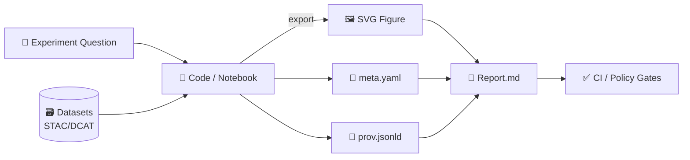

# 🧩 SVG Figures (Vector) — Experiment Report Artifacts

✅ **Evidence-first** · 🔐 **Provenance-ready** · ♻️ **Reproducible** · 🧭 **MCP/dev_prov-friendly**

> **Folder:** `artifacts/figures/svg/`  
> **Role in the template:** Store **publication-grade SVGs** used in the experiment report so results stay **portable, reviewable, and traceable** (the “KFM way” — provenance + citations + governance baked in).  [oai_citation:0‡Kansas Frontier Matrix (KFM) – Comprehensive Architecture, Features, and Design.pdf](file-service://file-4Umt1yHoGKicdmLWzFJ9sC)

---

## ⚡ Quickstart

1) Drop your `fig_XX_slug.svg` in this folder  
2) Add `fig_XX_slug.meta.yaml` + `fig_XX_slug.prov.jsonld` sidecars  
3) Reference the SVG from the report with a stable relative path  
4) Pass the “policy gate” checklist ✅ (below)

---

## 🧠 Why SVG here?

SVGs are ideal for:
- **Architecture diagrams** (dataflow, policy gates, system topology)
- **Provenance flows** (inputs → activities → outputs)
- **UI/UX diagrams** (Focus Mode citation flow, Story Node states)
- **Evaluation plots** when vector export is appropriate (clean diffs + crisp rendering)

This aligns with KFM’s emphasis on **trust via traceability** (citations/provenance for outputs, “fail closed” gates, sensitivity-aware publishing).  [oai_citation:1‡Kansas Frontier Matrix (KFM) – Comprehensive Architecture, Features, and Design.pdf](file-service://file-4Umt1yHoGKicdmLWzFJ9sC)  [oai_citation:2‡📚 Kansas Frontier Matrix (KFM) Data Intake – Technical & Design Guide.pdf](file-service://file-EbUCdsJMbu5KwpoKMrLrgj)

---

## 📦 Folder contract (what belongs here)

| ✅ Put here (SVG) | 🚫 Don’t put here |
|---|---|
| System/pipeline diagrams, provenance graphs, schemas | Photos / screenshots (use PNG/JPG in sibling folders) |
| Vector plots (ROC/PR/confusion matrices, ablations) | Interactive demos (store elsewhere, link from report) |
| UI component/state diagrams (panels, flows) | Source design project files (store in `design/` or `src/` + reference in PROV) |

---

## 🧭 Provenance flow (what “good” looks like)



KFM patterns to mirror:
- **Metadata completeness** (STAC/DCAT/PROV mindset)  
- **Citations required** for AI outputs and published artifacts  
- **Sensitivity classification** + controlled disclosure  
- **Append-only** (no silent rewrites)  [oai_citation:3‡📚 Kansas Frontier Matrix (KFM) Data Intake – Technical & Design Guide.pdf](file-service://file-EbUCdsJMbu5KwpoKMrLrgj)  [oai_citation:4‡Kansas Frontier Matrix (KFM) – Comprehensive Architecture, Features, and Design.pdf](file-service://file-4Umt1yHoGKicdmLWzFJ9sC)

---

## 🏷️ Naming + versioning conventions

### ✅ Filename pattern
**`fig_<NN>_<short_slug>.svg`**

Examples:
- `fig_01_system_architecture.svg`
- `fig_07_focus_mode_citation_flow.svg`
- `fig_12_policy_gates_fail_closed.svg`

### 🔒 Versioning rule (append-only)
If the figure’s *meaning* changes, create a new file:
- `fig_07_focus_mode_citation_flow_v2.svg` **or**
- `fig_07_focus_mode_citation_flow_2026-01-22.svg`

Avoid silent replacement—KFM leans **append-only + traceable evolution** (especially important when figures support conclusions).  [oai_citation:5‡📚 Kansas Frontier Matrix (KFM) Data Intake – Technical & Design Guide.pdf](file-service://file-EbUCdsJMbu5KwpoKMrLrgj)

---

## 🧾 Required sidecars (metadata + provenance)

For each `*.svg`, add:

```text
fig_07_focus_mode_citation_flow.svg
fig_07_focus_mode_citation_flow.meta.yaml
fig_07_focus_mode_citation_flow.prov.jsonld
```

### 1) `*.meta.yaml` (human-friendly contract)
Minimum recommended fields (expand as needed):

```yaml
id: fig_07_focus_mode_citation_flow
title: "Focus Mode: evidence + citation flow"
caption: "How a user query is grounded in cataloged sources and returned with citations."
created_at: "2026-01-22"
authors:
  - name: "YOUR_NAME_OR_TEAM"
license: "CC-BY-4.0-or-project-default"
sensitivity: "public" # public | internal | restricted | redacted
sources:
  datasets:
    - dcat_dataset_id: "..."
    - stac_item_id: "..."
  code:
    - path: "analysis/make_fig_07.py"
      git_commit: "..."
quality:
  has_title_desc: true
  optimized: true
```

### 2) `*.prov.jsonld` (machine-readable provenance)
Keep it **small but meaningful**: entity (SVG), activity (export), agents (human/tool), and what was used.

```json
{
  "@context": ["https://www.w3.org/ns/prov.jsonld"],
  "entity": {
    "fig:fig_07_focus_mode_citation_flow": {
      "prov:label": "Focus Mode: evidence + citation flow",
      "prov:type": "svg"
    }
  },
  "activity": {
    "act:export_svg": {
      "prov:used": ["code:analysis/make_fig_07.py", "data:dcat/usgs_nwis_dataset"],
      "prov:generated": "fig:fig_07_focus_mode_citation_flow"
    }
  }
}
```

Why we’re strict: KFM’s governance expects **provenance completeness** + **citations**; missing sources is treated as a policy failure (“fail closed”).  [oai_citation:6‡Kansas Frontier Matrix (KFM) – Comprehensive Architecture, Features, and Design.pdf](file-service://file-4Umt1yHoGKicdmLWzFJ9sC)

---

## ✅ Policy-gate checklist for “report-ready” SVGs

Before a figure is considered *mergeable*:

- [ ] **Readable at 100% zoom** (no micro-text)
- [ ] **SVG contains `<title>` + `<desc>`** (accessibility + discoverability)
- [ ] **No sensitive coordinates / PII** unless explicitly allowed  
  - If location/sensitive content is involved: **generalize/blur/aggregate** (differential access mindset).  [oai_citation:7‡Innovative Concepts to Evolve the Kansas Frontier Matrix (KFM).pdf](file-service://file-G71zNoWKxsoSW44iwZaaCC)  [oai_citation:8‡Kansas Frontier Matrix (KFM) – Comprehensive Architecture, Features, and Design.pdf](file-service://file-4Umt1yHoGKicdmLWzFJ9sC)
- [ ] `*.meta.yaml` present with **license + sensitivity**
- [ ] `*.prov.jsonld` present linking **code + datasets**
- [ ] Repro path exists (script/notebook) and is referenced
- [ ] If it supports an AI claim: the figure’s provenance ties back to **evidence-backed sources** (mirrors Focus Mode citation requirements).  [oai_citation:9‡📚 Kansas Frontier Matrix (KFM) Data Intake – Technical & Design Guide.pdf](file-service://file-EbUCdsJMbu5KwpoKMrLrgj)  [oai_citation:10‡Kansas Frontier Matrix (KFM) – AI System Overview 🧭🤖.pdf](file-service://file-Pv8eev6RWvCKrGCXyzY7zg)

---

## 🎨 Authoring tips (clean, diffable, reusable)

### Preferred workflows
- 🧪 **Generated first** (best): export SVG from code (Python/R/JS) and store the generator.  
- 🧰 **Manual diagrams** (okay): keep the editable source in `design/` (e.g., `.drawio`, `.fig`, `.ai`) and export SVG here—record the export in PROV.

### SVG hygiene (GitHub + security friendly)
- Keep text as text (avoid outlining everything unless necessary)
- Avoid embedding large raster images inside SVG
- Avoid scripts inside SVG (sanitization/security)
- Reduce diff noise (optimize/format consistently)

### Visual clarity = human-centered design
KFM’s UI/AR work emphasizes **filtering and avoiding clutter**—apply the same rule to diagrams: prefer multiple simpler figures over one impossible “kitchen sink” diagram.  [oai_citation:11‡Kansas Frontier Matrix – Comprehensive UI System Overview.pdf](file-service://file-KcBQruYcoFVDEixzzRHTwt)

---

## 🗺️ Recommended figure families (KFM-flavored experiment reports)

<details>
<summary><strong>🏗️ 1) Architecture & dataflow</strong></summary>

- Ingest → validate → catalog (**STAC/DCAT**) → provenance (**PROV**) → storage → API → UI  
- Automated policy gates + failure modes (“fail closed”)  [oai_citation:12‡Kansas Frontier Matrix (KFM) – Comprehensive Architecture, Features, and Design.pdf](file-service://file-4Umt1yHoGKicdmLWzFJ9sC)  
- Optional: Watcher–Planner–Executor automation loops (where relevant)  [oai_citation:13‡Kansas Frontier Matrix (KFM) – Comprehensive Architecture, Features, and Design.pdf](file-service://file-4Umt1yHoGKicdmLWzFJ9sC)

</details>

<details>
<summary><strong>🧭🤖 2) Focus Mode evidence + citations</strong></summary>

- Query → retrieval → grounding → response + citations  
- Dynamic queries still log provenance (e.g., real-time readings)  [oai_citation:14‡📚 Kansas Frontier Matrix (KFM) Data Intake – Technical & Design Guide.pdf](file-service://file-EbUCdsJMbu5KwpoKMrLrgj)  
- Human-in-the-loop review points & “augmenting humans, not replacing them”  [oai_citation:15‡Kansas Frontier Matrix (KFM) – AI System Overview 🧭🤖.pdf](file-service://file-Pv8eev6RWvCKrGCXyzY7zg)

</details>

<details>
<summary><strong>🗺️✨ 3) Story Nodes / UI states / AR concepts</strong></summary>

- Story Node narrative flows + UI panels  
- AR mode filtering + overlay strategy (avoid clutter)  [oai_citation:16‡Kansas Frontier Matrix – Comprehensive UI System Overview.pdf](file-service://file-KcBQruYcoFVDEixzzRHTwt)  
- Temporal simulation / 4D “time travel” concept slices (when experimenting with time-aware UX)  [oai_citation:17‡Innovative Concepts to Evolve the Kansas Frontier Matrix (KFM).pdf](file-service://file-G71zNoWKxsoSW44iwZaaCC)

</details>

<details>
<summary><strong>✅ 4) Evaluation & QA</strong></summary>

- Model metrics plots (vector exports where it helps readability)
- QA gates overview (unit/integration/performance/validation)  [oai_citation:18‡Kansas Frontier Matrix (KFM) – Comprehensive Technical Documentation.pdf](file-service://file-AkqwUuYPp5zePf7pv5SMxi)  
- Data quality checks + catalog completeness visuals (STAC/DCAT/PROV)  [oai_citation:19‡Kansas Frontier Matrix (KFM) – Comprehensive Architecture, Features, and Design.pdf](file-service://file-4Umt1yHoGKicdmLWzFJ9sC)

</details>

---

## 🧷 How to reference SVGs in the report

Markdown example:

```md

```

🔁 Keep the figure number in sync with the `fig_<NN>_` prefix for easy review and stable cross-references.

---

## 🔎 Sources & design anchors (traceability)

### Core templates + writing conventions
-  [oai_citation:20‡Kansas Frontier Matrix (KFM) – AI System Overview 🧭🤖.pdf](file-service://file-Pv8eev6RWvCKrGCXyzY7zg) (Scientific Method / Research / Master Coder Protocol docs)
-  [oai_citation:21‡Kansas Frontier Matrix (KFM) – AI System Overview 🧭🤖.pdf](file-service://file-Pv8eev6RWvCKrGCXyzY7zg) (Markdown guide)

### KFM system design (provenance, governance, UI, AI)
-  [oai_citation:22‡Kansas Frontier Matrix (KFM) – Comprehensive Architecture, Features, and Design.pdf](file-service://file-4Umt1yHoGKicdmLWzFJ9sC) (Policy gates: STAC/DCAT/PROV, licensing, sensitivity, provenance, citations)
-  [oai_citation:23‡📚 Kansas Frontier Matrix (KFM) Data Intake – Technical & Design Guide.pdf](file-service://file-EbUCdsJMbu5KwpoKMrLrgj) (Append-only + PROV patterns)
-  [oai_citation:24‡Kansas Frontier Matrix (KFM) – Comprehensive Technical Documentation.pdf](file-service://file-AkqwUuYPp5zePf7pv5SMxi) (Comprehensive technical foundations + ethical collaboration)
-  [oai_citation:25‡Kansas Frontier Matrix (KFM) – Comprehensive Architecture, Features, and Design.pdf](file-service://file-4Umt1yHoGKicdmLWzFJ9sC) (Architecture roadmap + evidence-first philosophy)
-  [oai_citation:26‡Kansas Frontier Matrix (KFM) – AI System Overview 🧭🤖.pdf](file-service://file-Pv8eev6RWvCKrGCXyzY7zg) (AI system: human-in-the-loop + evidence-backed outputs)
-  [oai_citation:27‡Kansas Frontier Matrix – Comprehensive UI System Overview.pdf](file-service://file-KcBQruYcoFVDEixzzRHTwt) (UI: clarity/AR filtering mindset)
-  [oai_citation:28‡Innovative Concepts to Evolve the Kansas Frontier Matrix (KFM).pdf](file-service://file-G71zNoWKxsoSW44iwZaaCC) (Innovations: 4D digital twins, storytelling, governance ideas)
-  [oai_citation:29‡🌟 Kansas Frontier Matrix – Latest Ideas & Future Proposals.docx.pdf](file-service://file-SQ3f7ve8SGiusT6ThZEuCe) (Latest ideas: Story Nodes, real-time feeds, bulk ingestion direction)
-  [oai_citation:30‡Additional Project Ideas.pdf](file-service://file-Pc2GNivcrHBeKjBQksLC3T) (Additional project ideas: modular “packs”, standards-first expansion)

### Reference bundles (PDF portfolios with embedded resources)
> These are “library packs” of AI, data, mapping, and programming references that can inform figure design (evaluation plots, GIS diagrams, pipelines, etc.). Open them in a portfolio-capable viewer to access embedded docs.

-  [oai_citation:31‡AI Concepts & more.pdf](file-service://file-K6BctJjeUwvyCahLf9qdwr) (AI Concepts & more — embedded AI/ML references)
-  [oai_citation:32‡Data Managment-Theories-Architures-Data Science-Baysian Methods-Some Programming Ideas.pdf](file-service://file-RrXMFY7cP925exsQYermf2) (Data Management / Data Science / Bayesian methods bundle)
-  [oai_citation:33‡Various programming langurages & resources 1.pdf](file-service://file-4wp3wSSZs7gk5qHWaJVudi) (Various programming languages & resources bundle)
-  [oai_citation:34‡Maps-GoogleMaps-VirtualWorlds-Archaeological-Computer Graphics-Geospatial-webgl.pdf](file-service://file-RshcX5sNY2wpiNjRfoP6z6) (Maps/Google Maps/Virtual Worlds/Geospatial/WebGL bundle)

### Legacy traceability markers (required)
-  [oai_citation:35‡Kansas Frontier Matrix – Comprehensive UI System Overview.pdf](file-service://file-KcBQruYcoFVDEixzzRHTwt)
-  [oai_citation:36‡📚 Kansas Frontier Matrix (KFM) Data Intake – Technical & Design Guide.pdf](file-service://file-EbUCdsJMbu5KwpoKMrLrgj)
-  [oai_citation:37‡Innovative Concepts to Evolve the Kansas Frontier Matrix (KFM).pdf](file-service://file-G71zNoWKxsoSW44iwZaaCC)
-  [oai_citation:38‡Additional Project Ideas.pdf](file-service://file-Pc2GNivcrHBeKjBQksLC3T)
