> According to a document from **2026-01-22**, KFM standardizes **rasters** as **COG (Cloud‑Optimized GeoTIFF)** and treats **STAC + DCAT + PROV** as required “boundary artifacts” before data is considered fully published.  [oai_citation:0‡Kansas Frontier Matrix (KFM) – Comprehensive Technical Documentation.pdf](file-service://file-AkqwUuYPp5zePf7pv5SMxi) [oai_citation:1‡MARKDOWN_GUIDE_v13.md.gdoc](file-service://file-UYVruFXfueR8veHMUKeugU) [oai_citation:2‡📚 Kansas Frontier Matrix (KFM) Data Intake – Technical & Design Guide.pdf](file-service://file-EbUCdsJMbu5KwpoKMrLrgj)

# 🗺️ COG (Cloud‑Optimized GeoTIFF) Artifacts


This folder is the **COG landing zone** inside the **Experiment Report Template** tree:

- ✅ Put **final raster deliverables** here (maps, DEM derivatives, model outputs, classified rasters, etc.)
- ✅ Include **portable evidence** (checksums + metadata + provenance) so the report is reproducible
- ✅ Keep everything **browser-friendly**: COGs support efficient access via internal tiling + overviews (great for web UX + tile serving) [oai_citation:3‡Kansas Frontier Matrix (KFM) – Comprehensive Technical Documentation.pdf](file-service://file-AkqwUuYPp5zePf7pv5SMxi)

> [!NOTE]
> In the full KFM system, “published” datasets are expected to flow through a standard lifecycle (raw → work → processed) and then emit catalog + provenance artifacts (STAC/DCAT/PROV). This template mirrors that pattern locally so experiments are audit-ready.  [oai_citation:4‡MARKDOWN_GUIDE_v13.md.gdoc](file-service://file-UYVruFXfueR8veHMUKeugU)

---

## 🎯 Why COGs here?

KFM explicitly uses **COGs for raster/imagery/gridded data** as a core data standard [oai_citation:5‡Kansas Frontier Matrix (KFM) – Comprehensive Technical Documentation.pdf](file-service://file-AkqwUuYPp5zePf7pv5SMxi) and highlights the performance benefit: **clients can fetch only the needed byte ranges** when zooming into a small region (instead of downloading the whole TIFF). [oai_citation:6‡Kansas Frontier Matrix (KFM) – Comprehensive Technical Documentation.pdf](file-service://file-AkqwUuYPp5zePf7pv5SMxi)

COGs also align with KFM’s “serve it on the map” approach: large rasters are stored as files and can be exposed via tile endpoints (or signed object-store URLs) and referenced by metadata so nothing becomes orphaned. [oai_citation:7‡Kansas Frontier Matrix (KFM) – Comprehensive Technical Documentation.pdf](file-service://file-AkqwUuYPp5zePf7pv5SMxi) [oai_citation:8‡Kansas Frontier Matrix (KFM) – Comprehensive Technical Documentation.pdf](file-service://file-AkqwUuYPp5zePf7pv5SMxi)

---

## 🧭 When to use COG vs other artifact formats

| Need | Best artifact | Why |
|---|---|---|
| Raster imagery / grids (e.g., landcover, DEM, heatmaps, predictions) | **COG (.tif)** 🧱 | Fast partial reads + overview pyramid for zooming [oai_citation:9‡Kansas Frontier Matrix (KFM) – Comprehensive Technical Documentation.pdf](file-service://file-AkqwUuYPp5zePf7pv5SMxi) |
| Vector tiles for web mapping | PMTiles 🧩 | Client-friendly tile archive; often paired with GeoParquet for analytics [oai_citation:10‡🌟 Kansas Frontier Matrix – Latest Ideas & Future Proposals.docx.pdf](file-service://file-SQ3f7ve8SGiusT6ThZEuCe) |
| Analytics-friendly vector tables | GeoParquet 📦 | Columnar, efficient queries |
| Narrative / evidence bundles | Markdown/YAML/JSON 📜 | Works with Story Nodes + provenance patterns [oai_citation:11‡MARKDOWN_GUIDE_v13.md.gdoc](file-service://file-UYVruFXfueR8veHMUKeugU) |

---

## 📁 Expected folder layout

```text
📦 mcp/dev_prov/examples/10_experiment_report_template/
└─ 🌳 (example_report_tree)/
   └─ 🧪 artifacts/
      └─ 🗺️ geospatial/
         └─ 🧱 cog/
            ├─ README.md ✅ (you are here)
            ├─ <artifact_id>.cog.tif
            ├─ <artifact_id>.cog.tif.sha256
            ├─ <artifact_id>.stac-item.json
            ├─ <artifact_id>.dcat.jsonld
            ├─ <artifact_id>.prov.jsonld
            ├─ <artifact_id>.gdalinfo.json   (recommended)
            └─ 🖼️ thumbnails/
               └─ <artifact_id>.png          (recommended)
```

> [!TIP]
> If the raster is huge, prefer **object storage or an OCI registry** and store only **metadata + immutable digest references** here (see “📦 Optional: OCI Artifact Distribution”). [oai_citation:12‡Additional Project Ideas.pdf](file-service://file-Pc2GNivcrHBeKjBQksLC3T) [oai_citation:13‡Additional Project Ideas.pdf](file-service://file-Pc2GNivcrHBeKjBQksLC3T)

---

## 🏷️ Naming convention (recommended)

Use deterministic IDs so your experiment report can refer to the artifact unambiguously:

**`<artifact_id> := <project>__<domain>__<layer>__<time>__epsg<code>__v<###>`**

Example:
- `kfm__hydrology__flood_risk__2020__epsg4326__v001.cog.tif`

Also generate:
- `kfm__hydrology__flood_risk__2020__epsg4326__v001.cog.tif.sha256`
- `...stac-item.json`
- `...dcat.jsonld`
- `...prov.jsonld`

> [!WHY]
> KFM emphasizes **traceability + reproducibility** across artifacts and metadata (STAC/DCAT/PROV), and strongly benefits from stable identifiers for linking into the graph + UI.  [oai_citation:14‡📚 Kansas Frontier Matrix (KFM) Data Intake – Technical & Design Guide.pdf](file-service://file-EbUCdsJMbu5KwpoKMrLrgj) [oai_citation:15‡MARKDOWN_GUIDE_v13.md.gdoc](file-service://file-UYVruFXfueR8veHMUKeugU)

---

## ✅ Minimum required companion files

### 1) SHA-256 checksum
Create a checksum file next to the COG:

```bash
sha256sum <artifact_id>.cog.tif > <artifact_id>.cog.tif.sha256
```

### 2) STAC Item (local, portable)
KFM uses STAC to describe geospatial assets and link to files/services, then cross-links to DCAT + PROV for discovery + audit. [oai_citation:16‡📚 Kansas Frontier Matrix (KFM) Data Intake – Technical & Design Guide.pdf](file-service://file-EbUCdsJMbu5KwpoKMrLrgj) [oai_citation:17‡📚 Kansas Frontier Matrix (KFM) Data Intake – Technical & Design Guide.pdf](file-service://file-EbUCdsJMbu5KwpoKMrLrgj)

**Minimal STAC Item sketch** (adjust fields to your real bbox/geometry/time):

```json
{
  "type": "Feature",
  "stac_version": "1.0.0",
  "id": "kfm__hydrology__flood_risk__2020__epsg4326__v001",
  "bbox": [-102.05, 36.99, -94.59, 40.00],
  "geometry": {
    "type": "Polygon",
    "coordinates": [[[-102.05,36.99],[-94.59,36.99],[-94.59,40.00],[-102.05,40.00],[-102.05,36.99]]]
  },
  "properties": {
    "datetime": "2020-06-01T00:00:00Z",
    "proj:epsg": 4326
  },
  "assets": {
    "cog": {
      "href": "./kfm__hydrology__flood_risk__2020__epsg4326__v001.cog.tif",
      "type": "image/tiff; application=geotiff; profile=cloud-optimized",
      "roles": ["data"],
      "title": "Flood risk (COG)"
    },
    "checksum": {
      "href": "./kfm__hydrology__flood_risk__2020__epsg4326__v001.cog.tif.sha256",
      "type": "text/plain",
      "roles": ["metadata"]
    }
  },
  "links": [
    { "rel": "self", "href": "./kfm__hydrology__flood_risk__2020__epsg4326__v001.stac-item.json" },
    { "rel": "describedby", "href": "./kfm__hydrology__flood_risk__2020__epsg4326__v001.dcat.jsonld", "type": "application/ld+json" },
    { "rel": "provenance", "href": "./kfm__hydrology__flood_risk__2020__epsg4326__v001.prov.jsonld", "type": "application/ld+json" }
  ]
}
```

### 3) DCAT Dataset (discovery layer)
DCAT carries the dataset “portal view” (publisher, license, distribution links). KFM uses DCAT for discovery and connects it to STAC + PROV. [oai_citation:18‡📚 Kansas Frontier Matrix (KFM) Data Intake – Technical & Design Guide.pdf](file-service://file-EbUCdsJMbu5KwpoKMrLrgj) [oai_citation:19‡📚 Kansas Frontier Matrix (KFM) Data Intake – Technical & Design Guide.pdf](file-service://file-EbUCdsJMbu5KwpoKMrLrgj)

### 4) PROV bundle (lineage)
PROV ties the artifact to:
- inputs (raw source identifiers),
- the processing activity (script + parameters),
- the agent (pipeline/maintainer/CI).

KFM treats provenance as a first-class requirement for reproducibility. [oai_citation:20‡📚 Kansas Frontier Matrix (KFM) Data Intake – Technical & Design Guide.pdf](file-service://file-EbUCdsJMbu5KwpoKMrLrgj) [oai_citation:21‡MARKDOWN_GUIDE_v13.md.gdoc](file-service://file-UYVruFXfueR8veHMUKeugU)

---

## 🏗️ Creating a COG (recommended GDAL workflow)

KFM’s geospatial pipeline design explicitly includes steps to **convert a source TIFF to COG** as part of processing automation. [oai_citation:22‡Kansas-Frontier-Matrix_ Open-Source Geospatial Historical Mapping Hub Design.pdf](file-service://file-ShqHKgjxCS9UT9vbcxDNzA)

### Option A — GDAL COG driver (preferred)
```bash
gdal_translate input.tif output.cog.tif \
  -of COG \
  -co COMPRESS=DEFLATE \
  -co BIGTIFF=IF_SAFER
```

Then build overviews (if not automatically created by your chosen settings):
```bash
gdaladdo -r average output.cog.tif 2 4 8 16 32
```

### Option B — Two-step “classic GeoTIFF → overviews → final”
Use this if you need explicit control, or your environment constraints require it:
1) Create tiled/compressed GTiff  
2) Build internal overviews  
3) Copy overviews into final output (as needed)

> [!TIP]
> If your experiment includes raster derivations (slope/aspect/hillshade), GDAL utilities are commonly used in KFM-like pipelines for repeatable raster production workflows.  [oai_citation:23‡KFM- python-geospatial-analysis-cookbook-over-60-recipes-to-work-with-topology-overlays-indoor-routing-and-web-application-analysis-with-python.pdf](file-service://file-2gpiGDZS8iw6EdxGswEdHp)

---

## 🔍 Validation & QA checklist

### Quick checks (required)
- [ ] `gdalinfo <artifact>.cog.tif` reports expected CRS/extent/bands
- [ ] Overviews exist (for smooth zooming)
- [ ] File is readable as a GeoTIFF and behaves well for partial reads (COG)
- [ ] `sha256` checksum computed and committed

### Recommended “evidence outputs”
Store machine-readable QA outputs:
```bash
gdalinfo -json <artifact_id>.cog.tif > <artifact_id>.gdalinfo.json
```

### Governance sanity (strongly recommended)
KFM governance emphasizes metadata completeness (license/sensitivity, etc.) enforced via policy gates (OPA/Conftest patterns). [oai_citation:24‡Additional Project Ideas.pdf](file-service://file-Pc2GNivcrHBeKjBQksLC3T) [oai_citation:25‡Kansas Frontier Matrix (KFM) – Comprehensive Architecture, Features, and Design.pdf](file-service://file-4Umt1yHoGKicdmLWzFJ9sC)

- [ ] License present in DCAT
- [ ] Sensitivity classification present if relevant (and access controls respected)

> [!CAUTION]
> If the raster contains sensitive locations (e.g., protected habitats or culturally sensitive sites), KFM patterns suggest **masking/aggregation** and enforcing sensitivity policy gates.  [oai_citation:26‡Kansas Frontier Matrix (KFM) – Comprehensive Architecture, Features, and Design.pdf](file-service://file-4Umt1yHoGKicdmLWzFJ9sC)

---

## 🧩 How COGs plug into KFM runtime (mental model)

```mermaid
flowchart LR
  A["🧾 Raw sources (scans, sensors, imagery)"] --> B["🛠️ ETL + georef + normalize"]
  B --> C["🧱 COG output (+ overviews)"]
  C --> D["🔐 Checksums + QA evidence"]
  D --> E["🗂️ STAC Item + Collection"]
  E --> F["🏷️ DCAT discovery record"]
  E --> G["🧾 PROV lineage bundle"]
  E --> H["🧠 Graph + API + Map UI"]
```



This matches KFM’s documented pipeline: **STAC/DCAT/PROV** act as publishable boundary artifacts, feeding downstream systems (graph/API/UI). [oai_citation:27‡MARKDOWN_GUIDE_v13.md.gdoc](file-service://file-UYVruFXfueR8veHMUKeugU) [oai_citation:28‡MARKDOWN_GUIDE_v13.md.gdoc](file-service://file-UYVruFXfueR8veHMUKeugU)

KFM’s UI stack explicitly includes Map UI components like **React + MapLibre (+ optional Cesium)**, which can render raster layers delivered via tiles or referenced assets. [oai_citation:29‡MARKDOWN_GUIDE_v13.md.gdoc](file-service://file-UYVruFXfueR8veHMUKeugU)

---

## 🔗 Linking from the Experiment Report

In your experiment report markdown (outside this folder), reference:
- the STAC Item as the primary “artifact descriptor”
- the COG as the primary binary output
- PROV/DCAT as supporting evidence

Example snippet:
```md
### Raster Output (COG)
- STAC Item: `artifacts/geospatial/cog/<artifact_id>.stac-item.json`
- COG: `artifacts/geospatial/cog/<artifact_id>.cog.tif`
- Provenance: `artifacts/geospatial/cog/<artifact_id>.prov.jsonld`
- Discovery (DCAT): `artifacts/geospatial/cog/<artifact_id>.dcat.jsonld`
```

---

## 📦 Optional: OCI Artifact Distribution (for big COGs)

KFM proposes storing large binaries (PMTiles, GeoParquet, **COGs**) as **OCI artifacts** using **ORAS**, and signing them with **Cosign** for integrity + provenance. [oai_citation:30‡Additional Project Ideas.pdf](file-service://file-Pc2GNivcrHBeKjBQksLC3T) [oai_citation:31‡Additional Project Ideas.pdf](file-service://file-Pc2GNivcrHBeKjBQksLC3T)

### Why it matters
- Content-addressable immutability via digest (rollback-friendly) [oai_citation:32‡Additional Project Ideas.pdf](file-service://file-Pc2GNivcrHBeKjBQksLC3T)
- Registry-native distribution + signing (supply chain hardening) [oai_citation:33‡Additional Project Ideas.pdf](file-service://file-Pc2GNivcrHBeKjBQksLC3T)
- Catalog integration via a `distribution.oci` entry (STAC/DCAT can point to OCI refs) [oai_citation:34‡Additional Project Ideas.pdf](file-service://file-Pc2GNivcrHBeKjBQksLC3T)

### Minimal example (conceptual)
```bash
# Push the COG as an OCI artifact
oras push ghcr.io/<org>/<repo>:<tag> \
  <artifact_id>.cog.tif:application/vnd.cloud-optimized-geotiff

# Sign the artifact
cosign sign --yes ghcr.io/<org>/<repo>:<tag>
```

> [!NOTE]
> The same OCI pattern can attach provenance/signature metadata as registry “referrers”, aligning with evidence-first and reproducibility goals. [oai_citation:35‡Additional Project Ideas.pdf](file-service://file-Pc2GNivcrHBeKjBQksLC3T)

---

## 🧯 Troubleshooting

<details>
<summary><strong>🧩 “My COG is huge / slow to render”</strong></summary>

- Ensure internal overviews exist (no overviews → painful zooming)
- Prefer compressed output (e.g., DEFLATE) and sensible block sizes
- If the file is too large for Git workflows, move the binary to OCI/object storage and keep STAC/DCAT/PROV here with digest references [oai_citation:36‡Additional Project Ideas.pdf](file-service://file-Pc2GNivcrHBeKjBQksLC3T)

</details>

<details>
<summary><strong>🛰️ “Raster contains sensitive data”</strong></summary>

- Mask/aggregate before publishing  
- Include sensitivity classification in metadata (DCAT + governance tags)
- Restrict distribution channels (private registry / signed URLs / access policies) [oai_citation:37‡Kansas Frontier Matrix (KFM) – Comprehensive Architecture, Features, and Design.pdf](file-service://file-4Umt1yHoGKicdmLWzFJ9sC)

</details>

---

## 📚 Source bundle (project docs used)

These are the key KFM design sources that informed this README:

- KFM technical doc (COG + raster performance + storage patterns)  [oai_citation:38‡Kansas Frontier Matrix – Comprehensive UI System Overview.pdf](file-service://file-KcBQruYcoFVDEixzzRHTwt)  
- Document refinement request (evidence-first / provenance patterns)  [oai_citation:39‡📚 Kansas Frontier Matrix (KFM) Data Intake – Technical & Design Guide.pdf](file-service://file-EbUCdsJMbu5KwpoKMrLrgj)  
- Additional project ideas (OCI artifact distribution, ORAS + Cosign, policy gates)  [oai_citation:40‡Innovative Concepts to Evolve the Kansas Frontier Matrix (KFM).pdf](file-service://file-G71zNoWKxsoSW44iwZaaCC)  
- Pulse ideas (provenance-first narratives + governance patterns)  [oai_citation:41‡Additional Project Ideas.pdf](file-service://file-Pc2GNivcrHBeKjBQksLC3T)  

---

## ✅ “Ready to merge” checklist

- [ ] COG present and opens in GIS tools  
- [ ] Overviews exist (or justified)  
- [ ] `.sha256` present  
- [ ] STAC Item present + links to DCAT + PROV  
- [ ] License & sensitivity reviewed  
- [ ] Experiment report references the artifact set  

💡 If you’re adding a new domain/layer type, mirror KFM’s pattern: document the data + ETL + outputs clearly and keep the metadata chain unbroken.  [oai_citation:42‡MARKDOWN_GUIDE_v13.md.gdoc](file-service://file-UYVruFXfueR8veHMUKeugU)
