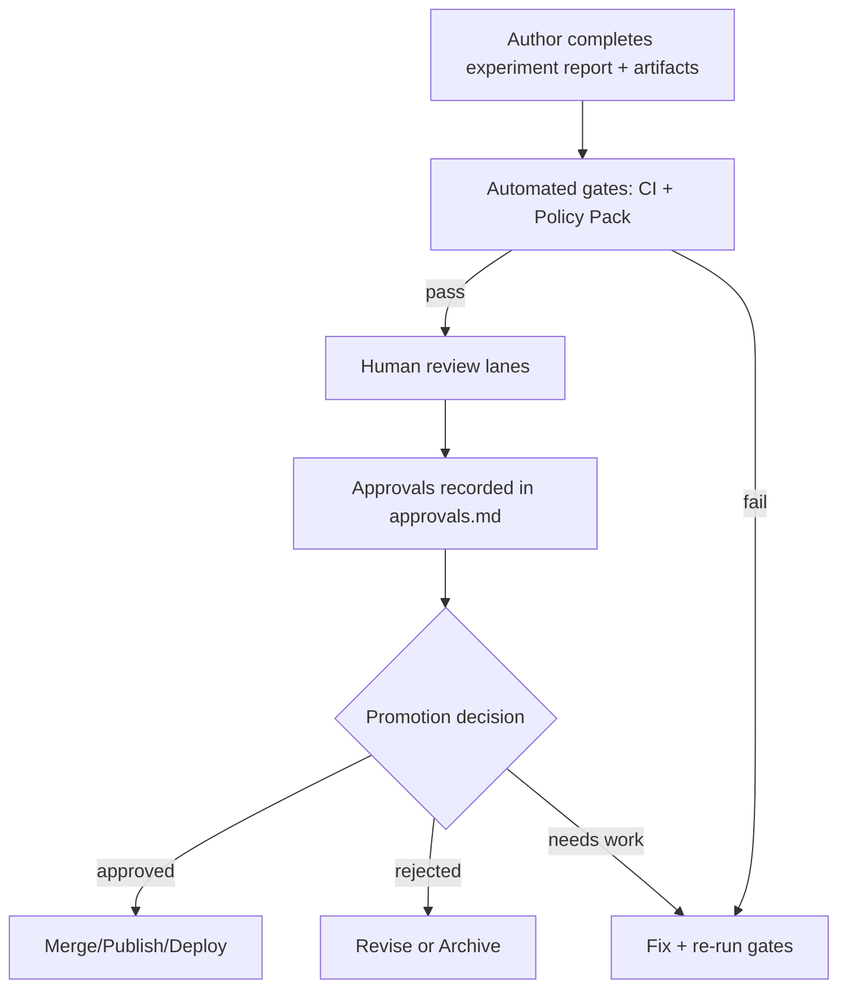

# ✅ Governance Approvals (Experiment Report Artifact)


> [!IMPORTANT]
> This file is **the approval ledger for _this_ experiment report**.  
> It is meant to be completed **before** anything moves from “draft findings” → “merge/publish/deploy”.

---

## 📁 Where this lives (context)

```text
mcp/dev_prov/examples/10_experiment_report_template/
└─ (example_report_tree)/
   └─ artifacts/
      └─ governance/
         └─ approvals.md   ✅ (this file)
```

---

## 🎯 Purpose

KFM is **evidence-first** and **provenance-first**: if we can’t explain *what changed*, *why it changed*, *who approved it*, and *how to reproduce it*, it doesn’t ship. 🧾🔍

This `approvals.md` captures:

- ✅ **Which approvals are required**
- ✅ **Which policy gates were satisfied**
- ✅ **Who signed off** (and when)
- ✅ **Any waivers** (time-bounded, explicit, justified)
- ✅ Links to supporting artifacts (manifests, provenance bundles, policy outputs, test logs)

---

## 🧭 Approval workflow (high-level)



---

## 🧱 Approval tiers (choose highest that applies)

| Tier | Name | Typical impact | Minimum expectation |
|---:|---|---|---|
| 0 | 📄 Documentation-only | report text / diagrams | 1 reviewer + sanity checks |
| 1 | 🧪 Research artifact | runs + outputs in `artifacts/` | reproducible run + provenance bundle |
| 2 | 🧩 Repo-integrated change | code/data/catalog merged | policy gates + code owners |
| 3 | 🚀 Production-facing | UI/API/runtime behavior | full review lanes + rollback plan |
| 4 | 🛡️ Sensitive/high-stakes | sovereignty / sensitive data / major model | council + security + domain authority |

> [!TIP]
> If anything touches **sensitive classifications, sovereignty constraints, public narratives, or automation**, treat it as **Tier 3–4** by default.

---

## 🧑‍🤝‍🧑 Roles (review lanes)

| Lane | Role | What they protect | Typical scope |
|---|---|---|---|
| 🧭 Maintainer | Merge Captain / Release Owner | repo integrity | required for Tier 2+ |
| 🗂️ Data | Data Steward | datasets, licenses, classifications | intake, transforms, exports |
| 🧠 AI/ML | Model Steward | model quality, drift, evals | training, prompts, inference |
| ⚖️ Ethics | FAIR+CARE Council Rep | sovereignty + harm prevention | sensitive data, narratives |
| 🔐 Security | Security Reviewer | secrets, supply chain, abuse | auth, signing, runtime |
| 🗺️ Geo/UI | Mapping + UX Lead | user trust, map semantics | layers, legends, story UX |
| 🧪 QA | QA / Test Lead | correctness + regressions | CI, test evidence, reproducibility |
| 🧑‍🔬 Domain | Domain Expert | scientific validity | hydrology/history/etc. |

---

## ✅ Approval matrix (what requires what)

| Change type | Examples | Required lanes | Must attach evidence |
|---|---|---|---|
| 📄 Report-only | narrative, charts, interpretation | Maintainer (1) | report + references |
| 🗂️ New dataset / source | new DCAT/STAC, new feed | Data + Maintainer | license, provenance, classification |
| 🧬 Pipeline / transform | ingest script, ETL config | Data + QA + Maintainer | run manifest, tests, diffs |
| 🧠 Model change | weights, metrics, prompt plans | Model + QA + Maintainer | evals, drift notes, provenance |
| 🧵 Narrative content (Story/Pulse) | auto-generated text, story nodes | Domain + Ethics + Maintainer | evidence manifest + citations |
| 🗺️ Map/UI behavior | new layer type, timeline behavior | Geo/UI + QA + Maintainer | screenshots/video, UX notes |
| 🔐 Policy pack / access control | new Rego rule, waivers | Security + Ethics + Maintainer | policy diff + rationale |
| 📦 Artifact publishing | PMTiles/COG/GeoParquet release | Data + Security + Maintainer | digest, signature, registry ref |
| 🚀 Runtime deploy | API/worker changes | Security + QA + Maintainer | rollout + rollback plan |
| 🛡️ Sensitive/sovereign data | sacred sites, endangered species | Ethics + Data + Security + Domain | authority proof + safeguards |

---

## 🤖 Automated gates (must be green)

> [!NOTE]
> These gates are “fail closed” by design. If a check can’t be performed, treat it as a failure.

### Required gate evidence links (fill these in)

- `artifacts/provenance/` → provenance bundle(s): `prov.jsonld`, `dcat.json`, `stac.json`, etc.
- `artifacts/runs/` → run manifests: `run_manifest.json` (or equivalent)
- `artifacts/policy/` → policy evaluation output (Conftest/OPA)
- `artifacts/tests/` → unit/integration/regression test logs
- `artifacts/security/` → secret scan + SBOM / signing logs (if applicable)
- `artifacts/qa/` → data QA reports (schema, completeness, checksums)
- `artifacts/ux/` → screenshots or recordings for UI changes (if applicable)

### Gate checklist ✅

- [ ] Schema validation (STAC/DCAT/PROV + project contracts)
- [ ] License present + compatible
- [ ] Sensitivity classification present + correctly propagated
- [ ] Provenance completeness (inputs → activity → outputs)
- [ ] “Evidence-first narrative” compliance for any human-facing text
- [ ] Secrets scanning / credential hygiene
- [ ] Artifact integrity (hashes / digests)
- [ ] Signing verification (Cosign) for published artifacts (Tier 2+ publishing)
- [ ] Graph integrity checks (if graph/schema touched)
- [ ] Reproducibility check (re-run matches expected outputs or deltas explained)

---

## 🧾 Approval record (fill-in template)

> [!IMPORTANT]
> Do **not** merge/publish/deploy unless the “Decision” is **APPROVED** and all required signatures are recorded.

### 1) Metadata (machine-readable) 🧷

```yaml
report:
  report_id: "EXP-###"
  title: "..."
  owner: "@..."
  created_utc: "YYYY-MM-DDTHH:MM:SSZ"
  status: "draft | in_review | approved | rejected"
  tier: 0
  scope:
    - "..."
  risk_level: "low | medium | high | critical"
  touches:
    data: false
    models: false
    narratives: false
    ui: false
    runtime: false
    policy: false
  classifications_involved:
    - "public"
  links:
    pr: "https://..."
    run_dashboard: "https://..."
    issue: "https://..."
```

### 2) Required approvals (sign-off table) ✍️

| Lane | Approver | Decision | Date (UTC) | Notes / Conditions |
|---|---|---:|---|---|
| 🧭 Maintainer |  | ⬜ approve / ⬜ reject |  |  |
| 🗂️ Data Steward |  | ⬜ approve / ⬜ reject / ⬜ n/a |  |  |
| 🧠 Model Steward |  | ⬜ approve / ⬜ reject / ⬜ n/a |  |  |
| ⚖️ FAIR+CARE Council |  | ⬜ approve / ⬜ reject / ⬜ n/a |  |  |
| 🔐 Security Reviewer |  | ⬜ approve / ⬜ reject / ⬜ n/a |  |  |
| 🗺️ Geo/UI Lead |  | ⬜ approve / ⬜ reject / ⬜ n/a |  |  |
| 🧪 QA Lead |  | ⬜ approve / ⬜ reject / ⬜ n/a |  |  |
| 🧑‍🔬 Domain Expert |  | ⬜ approve / ⬜ reject / ⬜ n/a |  |  |

### 3) Final promotion decision 🟢🟡🔴

```text
Decision:  APPROVED / NEEDS-WORK / REJECTED
Decision date (UTC): YYYY-MM-DDTHH:MM:SSZ
Decision owner: @merge-captain
Promotion target: (merge / publish / deploy / archive)
```

---

## 🧩 Lane checklists (what each approver verifies)

<details>
<summary><b>🗂️ Data Steward Checklist</b> (datasets, pipelines, exports)</summary>

- [ ] Dataset license is explicit and compatible
- [ ] Sensitivity classification is present and correct
- [ ] Any sensitive coordinates/attributes are generalized/controlled as required
- [ ] Provenance links inputs → processing → outputs
- [ ] Metadata completeness (DCAT/STAC required fields)
- [ ] Data QA results reviewed (nulls, ranges, duplicates, schema drift)
- [ ] Rollback plan exists (revert PR / pin digest / disable layer)

</details>

<details>
<summary><b>🧠 Model Steward Checklist</b> (AI/ML changes)</summary>

- [ ] Model is **advisory-only** (no autonomous action)
- [ ] Evaluation artifacts included (metrics, baselines, error analysis)
- [ ] Drift/monitoring plan updated (if model is long-lived)
- [ ] Any AI-produced text is labeled + evidence-cited
- [ ] Prompts/plans constrained (structured plans; no free-form execution)
- [ ] Reproducible training/inference environment captured (versions, seeds)

</details>

<details>
<summary><b>⚖️ FAIR+CARE Council Checklist</b> (ethics + sovereignty)</summary>

- [ ] CARE impacts considered (collective benefit + authority to control)
- [ ] Any culturally sensitive or community data has explicit authority/consent
- [ ] Public narratives avoid harm/misinformation; uncertainty noted when needed
- [ ] “Fail closed” posture upheld (no policy bypass)
- [ ] Any waivers are time-bounded + justified + approved

</details>

<details>
<summary><b>🔐 Security Checklist</b> (supply chain + access)</summary>

- [ ] Secret scanning results reviewed (no credentials committed)
- [ ] Policy Pack changes reviewed (Rego rules / waivers)
- [ ] Published artifacts: digest pinned and signature verified
- [ ] Access controls respected for restricted layers / endpoints
- [ ] Abuse considerations addressed (rate limits, export restrictions, etc.)

</details>

<details>
<summary><b>🗺️ Geo/UI Checklist</b> (map UX + trust)</summary>

- [ ] UI surfaces provenance + source attribution where users see outputs
- [ ] Sensitive layers have warnings/controls and safe default visibility
- [ ] Timeline/time-filter behaviors match data semantics
- [ ] Story / Pulse content is consistent with map state + citations visible
- [ ] Screenshots/video evidence included for changes

</details>

<details>
<summary><b>🧪 QA Checklist</b> (reproducibility + regression)</summary>

- [ ] CI green + policy gates green
- [ ] Reproduction steps verified (fresh environment if possible)
- [ ] Diffs are expected and explained (no “mystery deltas”)
- [ ] Graph/schema health checks passed (if applicable)
- [ ] Rollback tested (or at least simulated)

</details>

---

## 🧯 Waivers (exceptions that must expire)

> [!WARNING]
> Waivers are last resort. They must be **explicit**, **time-bounded**, and **auditable**.

| Waiver ID | Policy / Gate | Scope | Expires (UTC) | Approver | Rationale |
|---|---|---|---|---|---|
|  |  |  |  |  |  |

---

## 🧬 Regulated research add-ons (only if applicable)

If this experiment involves regulated constraints (e.g., IRB-like oversight, biosafety, restricted human data, etc.), record those approvals here:

- Approval body:  
- Approval number:  
- Approval date (UTC):  
- Stored approval letter: `artifacts/governance/attachments/...`  

---

## 🔗 Evidence index (links to artifacts)

> Paste relative links that reviewers can click in GitHub.

- 📄 Experiment report: `../report.md`
- 🧾 Run manifest(s): `../runs/run_manifest.json`
- 🧬 Provenance bundle: `../provenance/`
- 🧰 Policy output: `../policy/conftest_report.json`
- 🧪 Test logs: `../tests/`
- 🔐 Security artifacts: `../security/`
- 🗺️ UX evidence: `../ux/`
- 📦 Artifact registry refs (if any): `../artifacts_registry/`

---

## 🧠 Glossary (micro)

- **Policy Pack**: versioned policy-as-code rules (OPA/Rego) enforced in CI/runtime
- **Evidence manifest**: an inventory of sources supporting any narrative claim
- **Provenance bundle**: PROV/DCAT/STAC + run metadata enabling reproduction
- **W-P-E**: Watcher–Planner–Executor automation pattern (PR-first, review required)

---
✅ **End of approvals ledger**
