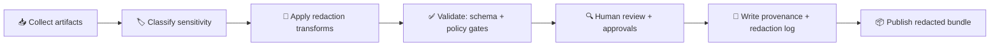

# 🛡️ Redaction Notes (Governance Artifact)
> **Path:** `mcp/dev_prov/examples/10_experiment_report_template/(example_report_tree)/artifacts/governance/redaction_notes.md`  
> **Purpose:** Document *exactly* what was redacted, *why*, *how*, and *who approved it* — without breaking provenance ⛓️

---

## ✅ Document Control
| Field | Value |
|---|---|
| **Report / Experiment ID** | `{{experiment_id}}` |
| **Artifact Bundle** | `{{artifact_bundle_id_or_path}}` |
| **Redaction Owner** | `{{name_or_handle}}` |
| **Reviewers** | `{{security_reviewer}}`, `{{data_steward}}`, `{{faircare_representative}}` |
| **Status** | ⬜ Draft / 🟨 In Review / 🟩 Approved |
| **Last Updated (UTC)** | `{{yyyy-mm-dd}}` |
| **Policy Pack Version** | `{{policy_pack_version_or_commit}}` |
| **Release Target** | 🌐 Public / 🔐 Internal / 🧪 Private Sandbox |

---

## 🎯 Why this file exists
KFM is **provenance-first** and **governance-by-default**. Redaction is not a “cleanup step” — it’s a governed transformation that must be:
- **Traceable** (what changed, where, when)
- **Reproducible** (how to regenerate the same redacted package)
- **Policy-aligned** (FAIR + CARE, security/privacy constraints)
- **Auditable** (human approvals + machine checks)

---

## 🧭 Redaction Scope (What this covers)
This document applies to **all artifacts shipped with this experiment report**, including:

### 📦 Artifact Types
- 🗺️ Map exports (images, tiles, layer snapshots)
- 🧾 Data extracts (CSV/GeoJSON/Parquet/GeoTIFF subsets)
- 🧠 AI artifacts (prompts, model outputs, citations, “Focus Mode” transcripts)
- 🧬 Provenance & catalogs (STAC/DCAT/PROV, run manifests, receipts)
- 🧰 Logs (pipeline logs, governance checks, CI reports)
- 🧩 Config (pipeline YAML, env templates, deployment manifests)
- 🧑‍🤝‍🧑 Narrative artifacts (Story Nodes / Pulse Threads / summaries)

### 🚫 Out of Scope
- Anything **not included** in the shared artifact bundle
- Original raw inputs stored under restricted storage (these are referenced, not embedded)

---

## 🏷️ Sensitivity Labels (Classification)
Use the strictest applicable label for each redacted element:

| Label | Meaning | Typical Handling |
|---|---|---|
| 🟢 **Public** | Safe to publish | No redaction required |
| 🟡 **Sensitive** | Could cause harm/misuse if fully exposed | Generalize, aggregate, or partial suppress |
| 🟠 **Confidential** | Restricted access (agreements, internal-only, high-risk) | Remove from bundle or gate behind auth |
| 🔴 **Restricted / Sovereign** | Community-controlled / permissioned | Do not publish unless explicit approval + constraints |

> 🔐 Rule of thumb: **Outputs must never be “less restricted” than inputs.**

---

## ✂️ Redaction Methods (Approved Techniques)

### 🧊 1) Suppression (Remove)
- Remove entire fields, rows, assets, or attachments
- Replace with `REDACTED` tokens or tombstones referencing a restricted pointer

### 🧩 2) Generalization (Reduce precision)
- **Coordinates:** snap/fuzz, bounding boxes, hex bins, grid cells
- **Time:** day → month, timestamp → date range
- **Identity:** replace with roles (`Contributor A`, `Reviewer B`)

### 📉 3) Aggregation (Reduce identifiability)
- Replace raw points with counts / percentiles / choropleths
- Replace per-record data with summaries (p50/p95, min/max, histograms)

### 🧬 4) Pseudonymization / Hashing
- Stable hashing for joinability *within the package* (avoid reversibility)
- Never ship salt/keys in public bundles

### 🧠 5) AI Output Sanitization
- Strip prompt-injection content, secrets, private identifiers
- Ensure all statements retain **evidence citations** after redaction

### 🧯 6) Inference & Query Risk Controls (when sharing derived results)
- k-anonymity/l-diversity/t-closeness style safeguards (when relevant)
- Deny or coarsen queries/results that enable reconstruction

---

## 🧪 Redaction Workflow (Deterministic)


### 🔍 Required Gates (Must Pass)
- ✅ No secrets in bundle
- ✅ No disallowed PII exposure
- ✅ No precise sensitive geolocations (unless explicitly approved)
- ✅ Licensing constraints respected
- ✅ Evidence/provenance links remain intact (or are replaced with governed pointers)

---

## 📒 Redaction Log (Fill this in)
> Add one row per redaction decision. If you did “bulk rules”, still log them as grouped entries.

| # | Artifact | Location (path/section) | Field / Content | Classification | Action | Method | Rationale | Approved By | Date |
|---:|---|---|---|---|---|---|---|---|---|
| 1 | `{{artifact_name}}` | `{{path_or_anchor}}` | `{{field}}` | 🟡/🟠/🔴 | Remove / Generalize / Aggregate | `{{method}}` | `{{why}}` | `{{approver}}` | `{{yyyy-mm-dd}}` |
| 2 |  |  |  |  |  |  |  |  |  |

### 📌 Common “Must-Redact” Targets
- 🔑 API keys, tokens, passwords, connection strings
- 👤 PII (living persons): names + direct identifiers (email/phone/address), or combinations that re-identify
- 🗺️ Exact coordinates of:
  - endangered species habitats
  - archaeological sites (looting risk)
  - culturally sensitive/sacred locations
- 🧾 Restricted-license assets or excerpts not cleared for redistribution
- 🧨 Security-sensitive internals (system hardening details, exploit paths, unpatched vuln info)

---

## 🧾 Provenance & Audit Trail (Don’t break the chain ⛓️)

### Required artifacts to include *with the redacted bundle*
- `artifacts/governance/redaction_notes.md` ✅ (this file)
- `artifacts/governance/policy_check_report.md` (or equivalent)
- `artifacts/provenance/` (PROV or run-manifest summary)
- Checksums for the **published bundle** (hash list)

### Required linkbacks (when originals are excluded)
When content is removed (e.g., confidential dataset), add:
- a **stable identifier**
- a **pointer** to where it exists in restricted storage
- access notes (who can request it, under what approval)

Example tombstone:
```yaml
redacted_asset:
  id: "{{stable_id}}"
  reason: "confidential / restricted"
  pointer: "{{internal_pointer_or_registry_ref}}"
  access: "Requires approval: {{role_or_council}}"
```

---

## ✅ Verification Checklist (Before Approval)
- [ ] Secrets scan passed (no keys/tokens/credentials)
- [ ] PII scan passed (manual + automated)
- [ ] Sensitive geodata checks passed (no precise protected points)
- [ ] OPA / policy gates passed (CI + runtime policy report attached)
- [ ] Provenance intact (citations still resolve or are properly tombstoned)
- [ ] “No output less restricted than inputs” verified for derivatives
- [ ] Human review completed for all 🟠/🔴 entries
- [ ] Bundle checksums generated and stored
- [ ] Release label applied (Public/Internal/Private) and matches content

---

## 👥 Approvals (Sign-off)
| Role | Name/Handle | Decision | Notes |
|---|---|---|---|
| 🔐 Security Reviewer | `{{name}}` | ✅ / ❌ | `{{notes}}` |
| 🧭 Data Steward | `{{name}}` | ✅ / ❌ | `{{notes}}` |
| 🤝 FAIR+CARE Oversight | `{{name}}` | ✅ / ❌ | `{{notes}}` |
| 🧪 Experiment Owner | `{{name}}` | ✅ / ❌ | `{{notes}}` |

---

## 📎 Appendix A — Redaction Rules (Optional, but recommended)
Define reusable rules so redaction is repeatable:

```yaml
rules:
  - id: redact.secrets
    match:
      - "(?i)api[_-]?key"
      - "(?i)bearer\\s+[a-z0-9\\-\\._~\\+\\/]+=*"
    action: "suppress"

  - id: redact.sensitive_geolocations
    match:
      - "archaeological_site"
      - "endangered_species_habitat"
      - "sacred_site"
    action: "generalize_coordinates"
    params:
      method: "hexbin"
      cell_km: 10
```

---

## 📎 Appendix B — Notes for Editors 📝
- If you redact **numbers**, note whether they were *removed* or *coarsened* (and to what resolution).
- If you redact **text**, preserve meaning where possible (e.g., keep summary + citations).
- If you redact **citations**, replace with a governed pointer (don’t leave “citation holes”).
- If anything is uncertain, treat it as **more sensitive**, not less.

---
