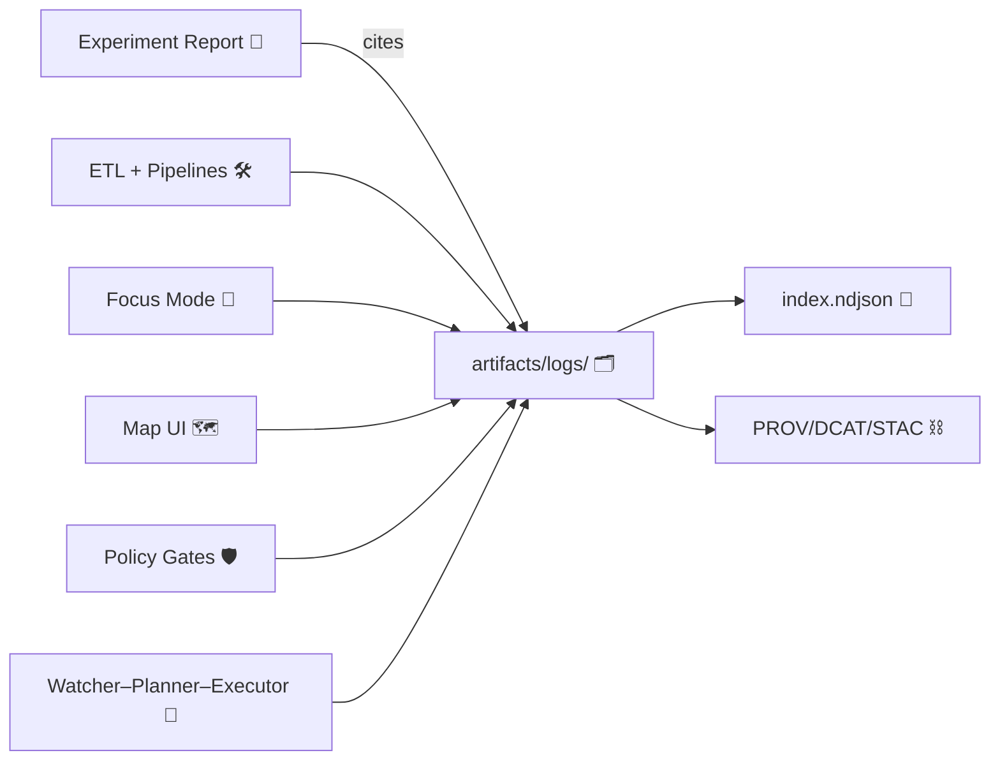

<!--
📍 Path: mcp/dev_prov/examples/10_experiment_report_template/(example_report_tree)/artifacts/logs/README.md
-->

# 🧾 Logs (Experiment Evidence Trail)


> [!IMPORTANT]
> This folder is your **audit-friendly, reproducible evidence trail**. Treat it as **append-only** (no silent overwrites), and make every claim in the experiment report traceable back to a log entry + source.  
> KFM’s core stance is “no black boxes” — every output should be explainable and traceable end-to-end.  [oai_citation:0‡📚 Kansas Frontier Matrix (KFM) Data Intake – Technical & Design Guide.pdf](file-service://file-EbUCdsJMbu5KwpoKMrLrgj) [oai_citation:1‡MARKDOWN_GUIDE_v13.md.gdoc](file-service://file-UYVruFXfueR8veHMUKeugU)

---

## 🎯 What belongs here

This directory stores **runtime logs + machine-readable ledgers** produced during an experiment/run:

- 🛠️ **Pipeline**: ingest → validate → transform → publish logs
- 🧪 **Experiment**: evaluation runs, metrics snapshots, deterministic seeds
- 🤖 **AI / Focus Mode**: prompt context, retrieval/citations, policy checks, governance flags
- 🗺️ **UI**: session “state trail” (layers on/off, filters, time slider, map viewport), *redacted*
- 🛡️ **Policy + governance**: OPA/Conftest results, waivers, blocked publishes, redactions
- 🤝 **Agents** (Watcher–Planner–Executor): event records, plans, tool calls, PR/merge actions
- 🔐 **Integrity / supply chain**: checksums, OCI/ORAS transfers, cosign verify logs

The broader KFM experiment workflow expects outputs/logs to live under a `logs/` area so reports can cite them and reviewers can reproduce runs.  [oai_citation:2‡Kansas-Frontier-Matrix_ Open-Source Geospatial Historical Mapping Hub Design.pdf](file-service://file-64djFYQUCmxN1h6L6X7KUw)



---

## 🧭 Golden rules (dev_prov mindset)

### 1) Append-only by default ✅
- Prefer **NDJSON** for event logs (one JSON object per line).
- If something must be “changed,” create a **new file** and record a **tombstone** entry in `index.ndjson` (don’t rewrite history).  
KFM explicitly leans on provenance and traceability to support rollback and verification.  [oai_citation:3‡📚 Kansas Frontier Matrix (KFM) Data Intake – Technical & Design Guide.pdf](file-service://file-EbUCdsJMbu5KwpoKMrLrgj) [oai_citation:4‡Innovative Concepts to Evolve the Kansas Frontier Matrix (KFM).pdf](file-service://file-G71zNoWKxsoSW44iwZaaCC)

### 2) Every event is linkable 🔗
Each event should carry a **run_id** + **correlation_id** so you can jump from report → log → provenance graph. KFM emphasizes unique run identifiers, config hashes, and correlation IDs for observability and traceability.  [oai_citation:5‡Kansas Frontier Matrix (KFM) – Comprehensive Architecture, Features, and Design.pdf](file-service://file-4Umt1yHoGKicdmLWzFJ9sC)

### 3) Policy outcomes are first-class 🛡️
Policy gates aren’t “side effects” — they are part of the evidence. KFM’s policy pack and CI gates are intended to **block** releases that violate provenance, sensitivity, or AI citation rules.  [oai_citation:6‡📚 Kansas Frontier Matrix (KFM) Data Intake – Technical & Design Guide.pdf](file-service://file-EbUCdsJMbu5KwpoKMrLrgj) [oai_citation:7‡Kansas Frontier Matrix (KFM) – Comprehensive Architecture, Features, and Design.pdf](file-service://file-4Umt1yHoGKicdmLWzFJ9sC)

### 4) No mystery layers / nodes 🧩
If a dataset, layer, claim, or answer exists, logs should prove **where it came from** and **why it’s valid**.  [oai_citation:8‡📚 Kansas Frontier Matrix (KFM) Data Intake – Technical & Design Guide.pdf](file-service://file-EbUCdsJMbu5KwpoKMrLrgj) [oai_citation:9‡Kansas Frontier Matrix (KFM) – Comprehensive Technical Documentation.pdf](file-service://file-AkqwUuYPp5zePf7pv5SMxi)

---

## 🗂️ Recommended folder layout (template)

> [!NOTE]
> Use this as a **baseline**. You can rename folders, but keep the **index + checksums** conventions stable.

```text
📦 artifacts/
└─ 📂 logs/
   ├─ 🧾 README.md
   ├─ 🧭 index.ndjson                 # “directory of logs” (one JSON per file)
   ├─ 🔐 checksums.sha256             # sha256 for every file here
   │
   ├─ 📂 pipeline/
   │  └─ 📂 run_<run_id>/
   │     ├─ 🧷 run_context.json        # config, versions, seeds, dataset IDs
   │     ├─ 📜 telemetry.ndjson        # append-only event stream
   │     ├─ ✅ validate.json           # schema checks, QA, row counts
   │     ├─ 🔄 transform.ndjson        # step-level transforms (optional)
   │     └─ 🚀 publish.log             # publish steps + destination refs
   │
   ├─ 📂 ai/
   │  └─ 📂 focus_<session_id>/
   │     ├─ 💬 focus_session.ndjson    # prompts, retrieval, citations, answers
   │     ├─ 🛡️ policy_eval.json        # OPA checks on outputs
   │     └─ 📈 focus_metrics.json      # latency, tokens, drift checks (optional)
   │
   ├─ 📂 ui/
   │  └─ 📂 session_<session_id>/
   │     ├─ 🧭 ui_state.ndjson         # layer toggles, filters, viewport (redacted)
   │     └─ ♿ a11y_audit.json          # optional accessibility checks
   │
   ├─ 📂 agents/
   │  └─ 📂 watcher_<id>/
   │     ├─ 👀 event_record.json       # immutable trigger record
   │     ├─ 🧠 plan.md                 # planner output
   │     └─ 🤖 executor.ndjson         # tool calls, PR actions
   │
   ├─ 📂 policy/
   │  ├─ 🧪 conftest_results.json
   │  ├─ 🧾 waivers.yml                # only if explicitly approved
   │  └─ 🚫 blocked_actions.ndjson     # “fail closed” evidence
   │
   ├─ 📂 supply_chain/
   │  ├─ 📦 oras_push.log              # OCI artifact transfers
   │  ├─ 🖊️ cosign_verify.json         # signature verification evidence
   │  └─ 🧬 sbom.json                  # optional
   │
   └─ 📂 qa/
      ├─ 🧠 graph_healthcheck.json     # node/edge counts, anomalies
      └─ 🧩 pulse_threads.ndjson       # narrative anomaly detections
```

This structure matches KFM’s emphasis on (a) deterministic pipelines with run logs and validation reports, (b) UI auditability, and (c) story/focus outputs never introducing unsourced material.  [oai_citation:10‡📚 Kansas Frontier Matrix (KFM) Data Intake – Technical & Design Guide.pdf](file-service://file-EbUCdsJMbu5KwpoKMrLrgj) [oai_citation:11‡MARKDOWN_GUIDE_v13.md.gdoc](file-service://file-UYVruFXfueR8veHMUKeugU)

---

## 🏷️ Naming + IDs

### ✅ Recommended IDs
| ID | Where | Why |
|---|---|---|
| `run_id` | pipeline + policy + agent logs | Joins all evidence for a run |
| `correlation_id` | every event line | Traces a single “thread” through systems |
| `dataset_id` / `layer_id` | ingest/transform/publish | Ties logs to STAC/DCAT/PROV entities |
| `prov_activity_id` | pipeline + AI + PR events | Enables graph linkage |
| `session_id` | UI + Focus Mode | Replays interaction context |
| `config_digest` | run_context + events | Proves what settings were used |
| `git_sha` | run_context + events | Proves code version |

KFM’s run context concept includes pipeline version, dataset IDs, and tool versions, and encourages idempotent fetches (e.g., by ETag) — capture those details so runs are reproducible.  [oai_citation:12‡📚 Kansas Frontier Matrix (KFM) Data Intake – Technical & Design Guide.pdf](file-service://file-EbUCdsJMbu5KwpoKMrLrgj)

---

## ✅ Minimum expected files

### Always (baseline)
- `index.ndjson` — log inventory ✅
- `checksums.sha256` — tamper-evidence ✅
- `pipeline/run_<run_id>/telemetry.ndjson` — run event ledger ✅  
Telemetry logging is intended to be **append-only NDJSON** for each pipeline run, covering validation + transformation events.  [oai_citation:13‡📚 Kansas Frontier Matrix (KFM) Data Intake – Technical & Design Guide.pdf](file-service://file-EbUCdsJMbu5KwpoKMrLrgj)

### When used
- `ai/focus_<session_id>/focus_session.ndjson` — when Focus Mode contributes to results  
Focus Mode is expected to cite sources and expose context, and results should be auditable.  [oai_citation:14‡Kansas Frontier Matrix (KFM) – AI System Overview 🧭🤖.pdf](file-service://file-Pv8eev6RWvCKrGCXyzY7zg)
- `policy/*` — when a policy gate ran (especially if it blocked or redacted)  
AI outputs may be checked by OPA, and blocked outputs should be logged.  [oai_citation:15‡Kansas Frontier Matrix (KFM) – AI System Overview 🧭🤖.pdf](file-service://file-Pv8eev6RWvCKrGCXyzY7zg)
- `agents/*` — when Watcher–Planner–Executor agents acted  
Watcher emits an immutable event record; planner/executor actions are logged.  [oai_citation:16‡📚 Kansas Frontier Matrix (KFM) Data Intake – Technical & Design Guide.pdf](file-service://file-EbUCdsJMbu5KwpoKMrLrgj)

---

## 🧱 Structured logging standard (NDJSON)

### Event record (recommended shape)
```json
{
  "ts": "2026-01-22T19:01:02.345Z",
  "level": "INFO",
  "component": "pipeline.validate",
  "run_id": "run_20260122T1900Z_3b7c1a",
  "correlation_id": "c_01J0X5Y7H4...",
  "event": "schema_validation_pass",
  "dataset_id": "kfm.dataset.county_boundaries.v1",
  "prov_activity_id": "prov:activity:validate_3b7c1a",
  "git_sha": "9f2c3c1",
  "config_digest": "sha256:2f8b...d91",
  "metrics": { "rows": 105, "warnings": 0 },
  "artifacts": [
    { "path": "pipeline/run_run_.../validate.json", "sha256": "..." }
  ],
  "classification": "public"
}
```

### Why NDJSON?
NDJSON supports streaming and append-only semantics — exactly what KFM calls for in telemetry logging.  [oai_citation:17‡📚 Kansas Frontier Matrix (KFM) Data Intake – Technical & Design Guide.pdf](file-service://file-EbUCdsJMbu5KwpoKMrLrgj)

---

## 🧭 `index.ndjson` (log inventory)

**Goal:** make it trivial to answer “what evidence exists for this report?” without scanning every file.

Each line represents one log file:

```json
{
  "path": "pipeline/run_run_20260122T1900Z_3b7c1a/telemetry.ndjson",
  "sha256": "2b1c...f9",
  "bytes": 184293,
  "content_type": "application/x-ndjson",
  "run_id": "run_20260122T1900Z_3b7c1a",
  "produced_by": "kfm-etl@1.4.2",
  "prov_activity_id": "prov:bundle:run_3b7c1a",
  "classification": "public",
  "notes": "append-only pipeline ledger"
}
```

> [!TIP]
> If you store large logs outside Git, still include an `index.ndjson` entry with an external reference (e.g., OCI digest), so the report remains reproducible.

---

## 🧩 Log type matrix

| Category | Folder | Must capture | Why it matters |
|---|---|---|---|
| 🛠️ Pipeline telemetry | `pipeline/` | fetch/validate/transform/publish events, row counts, warnings | proves the data path and QA happened [oai_citation:18‡📚 Kansas Frontier Matrix (KFM) Data Intake – Technical & Design Guide.pdf](file-service://file-EbUCdsJMbu5KwpoKMrLrgj) |
| 🧷 Run context | `pipeline/.../run_context.json` | config, versions, seeds, dataset IDs | reproducibility + deterministic replay [oai_citation:19‡📚 Kansas Frontier Matrix (KFM) Data Intake – Technical & Design Guide.pdf](file-service://file-EbUCdsJMbu5KwpoKMrLrgj) |
| 🧪 Experiment metrics | `qa/` or `pipeline/...` | evaluation numbers, thresholds, drift checks | evidence for “it worked” claims [oai_citation:20‡Kansas-Frontier-Matrix_ Open-Source Geospatial Historical Mapping Hub Design.pdf](file-service://file-64djFYQUCmxN1h6L6X7KUw) |
| 🤖 Focus Mode sessions | `ai/` | prompt context bundle, retrieval set, citations, output, governance flags | KFM expects citations + auditability [oai_citation:21‡Kansas Frontier Matrix (KFM) – AI System Overview 🧭🤖.pdf](file-service://file-Pv8eev6RWvCKrGCXyzY7zg) |
| 🗺️ UI sessions | `ui/` | layer/time/filter state changes (redacted), feature clicks (coarsened) | supports “map behind the map” transparency [oai_citation:22‡Kansas Frontier Matrix – Comprehensive UI System Overview.pdf](file-service://file-KcBQruYcoFVDEixzzRHTwt) |
| 🛡️ Policy gates | `policy/` | OPA/Conftest decisions, violations, waivers | proves safety + governance decisions [oai_citation:23‡📚 Kansas Frontier Matrix (KFM) Data Intake – Technical & Design Guide.pdf](file-service://file-EbUCdsJMbu5KwpoKMrLrgj) |
| 🤝 Agent automation | `agents/` | event_record → plan → executor tool calls | audit trail for auto-changes [oai_citation:24‡📚 Kansas Frontier Matrix (KFM) Data Intake – Technical & Design Guide.pdf](file-service://file-EbUCdsJMbu5KwpoKMrLrgj) |
| 🔐 Supply chain | `supply_chain/` | digests, signatures, verify results | tamper resistance + provenance attestations [oai_citation:25‡Maps-GoogleMaps-VirtualWorlds-Archaeological-Computer Graphics-Geospatial-webgl.pdf](file-service://file-RshcX5sNY2wpiNjRfoP6z6) |

---

## 🔐 Integrity: `checksums.sha256`

A simple checksum file makes your evidence harder to “quietly” tamper with.

KFM’s intake guidance explicitly calls out maintaining `checksums.sha256` for raw artifacts so integrity can be verified.  [oai_citation:26‡📚 Kansas Frontier Matrix (KFM) Data Intake – Technical & Design Guide.pdf](file-service://file-EbUCdsJMbu5KwpoKMrLrgj)

Example format:
```text
2b1c...f9  pipeline/run_run_20260122T1900Z_3b7c1a/telemetry.ndjson
aa0e...12  ai/focus_s_91a2/focus_session.ndjson
```

---

## 🛡️ Privacy, sensitivity, and “don’t log the thing you’re protecting”

> [!WARNING]
> Logs can become the **leakiest dataset** in your whole repo if you’re not careful.

### Practical rules
- 🚫 **Never** commit secrets, tokens, keys, or raw credentials.  
- 🧭 Avoid logging precise sensitive coordinates; store generalized areas (hex bins, bounding boxes) where needed.
- 🏷️ Tag each log entry/file with a **classification** label (e.g., `public`, `restricted`, `confidential`).
- 🧽 If an event required redaction, log the *fact* of redaction + reason, not the original value.

KFM explicitly highlights sensitive-data protections (location generalization, access control, and sensitivity tagging) and expects governance and usage monitoring around sensitive access.  [oai_citation:27‡Maps-GoogleMaps-VirtualWorlds-Archaeological-Computer Graphics-Geospatial-webgl.pdf](file-service://file-RshcX5sNY2wpiNjRfoP6z6)

### Query auditing (when logs involve “questions”)
If your experiment or Focus Mode runs could leak private information through queries/outputs, consider logging **audit decisions** rather than raw sensitive values. Privacy literature describes “query auditing” as auditing queries and denying those that enable disclosure, and notes differential privacy approaches for output protection.  [oai_citation:28‡Maps-GoogleMaps-VirtualWorlds-Archaeological-Computer Graphics-Geospatial-webgl.pdf](file-service://file-RshcX5sNY2wpiNjRfoP6z6)

---

## ⚙️ Policy logs (OPA/Conftest)

KFM’s policy pack concept includes **schema completeness, provenance-first rules, AI citation rules, and classification propagation**, and is designed to fail builds/exports when violated.  [oai_citation:29‡📚 Kansas Frontier Matrix (KFM) Data Intake – Technical & Design Guide.pdf](file-service://file-EbUCdsJMbu5KwpoKMrLrgj) [oai_citation:30‡Kansas Frontier Matrix (KFM) – Comprehensive Architecture, Features, and Design.pdf](file-service://file-4Umt1yHoGKicdmLWzFJ9sC)

**Store:**
- the policy decision
- the evaluated target (file/hash)
- the rule IDs triggered
- any waiver approvals (with who/when/why)

---

## 🤖 Focus Mode logs: what to capture (minimum)

Focus Mode is designed to:
- cite sources,
- use user context (active layers/timeframe),
- and remain auditable via governance mechanisms.  [oai_citation:31‡Kansas Frontier Matrix (KFM) – AI System Overview 🧭🤖.pdf](file-service://file-Pv8eev6RWvCKrGCXyzY7zg)

Minimum fields (per response):
- input question (or redacted/hardened version)
- context bundle (layers/time range)
- retrieval results (document IDs + provenance IDs)
- final answer + citations
- policy evaluation result (pass/fail + reason)  
AI outputs can be checked by OPA and should log outcomes.  [oai_citation:32‡Kansas Frontier Matrix (KFM) – AI System Overview 🧭🤖.pdf](file-service://file-Pv8eev6RWvCKrGCXyzY7zg)

---

## 🗺️ UI logs: “map behind the map” replay (redacted)

KFM’s UI principles emphasize “the map behind the map” — users can inspect provenance and assumptions. UI logs help you reproduce what was on screen when a claim was made.  [oai_citation:33‡Kansas Frontier Matrix – Comprehensive UI System Overview.pdf](file-service://file-KcBQruYcoFVDEixzzRHTwt)

Capture (coarsened/redacted):
- layer toggles (layer IDs)
- time slider changes (time ranges)
- filter settings (IDs, not raw text if sensitive)
- viewport changes (rounded coords / tile IDs)
- provenance panel opens + entity IDs viewed (not personal data)

---

## 🤝 Agent logs: Watcher–Planner–Executor

When automation is used, KFM describes a pattern where:
- the **Watcher** emits an immutable event record,
- the **Planner** creates a structured plan,
- the **Executor** performs changes and logs actions.  [oai_citation:34‡📚 Kansas Frontier Matrix (KFM) Data Intake – Technical & Design Guide.pdf](file-service://file-EbUCdsJMbu5KwpoKMrLrgj)

Agent action logging should include tool args/results so actions remain auditable.  [oai_citation:35‡📚 Kansas Frontier Matrix (KFM) Data Intake – Technical & Design Guide.pdf](file-service://file-EbUCdsJMbu5KwpoKMrLrgj)

---

## 📦 Supply-chain / OCI logs (optional but powerful)

KFM proposes using OCI artifact registries with ORAS + cosign so datasets, models, and reports can be transferred and verified like container images, including provenance attachments.  [oai_citation:36‡Maps-GoogleMaps-VirtualWorlds-Archaeological-Computer Graphics-Geospatial-webgl.pdf](file-service://file-RshcX5sNY2wpiNjRfoP6z6)

If used, log:
- artifact refs + digests
- ORAS push/pull transcript (or summaries)
- cosign verification results
- attached PROV JSON-LD refs/digests

---

## 🧠 QA logs: graph health checks + Pulse Threads

### Graph health checks
KFM “Pulse Ideas” includes a weekly graph health check (node/edge counts, orphan detection, etc.) with artifacts saved and summarized. Store those outputs here.  [oai_citation:37‡Additional Project Ideas.pdf](file-service://file-Pc2GNivcrHBeKjBQksLC3T)

### Pulse Threads
Pulse Threads are described as anomaly/event detections with evidence manifests and governance controls — log the pulse record, evidence IDs, and any review/approval.  [oai_citation:38‡Additional Project Ideas.pdf](file-service://file-Pc2GNivcrHBeKjBQksLC3T)

---

## 🔗 How to cite logs from your experiment report

In your experiment report, cite logs with:
- ✅ the **relative path**
- ✅ the **sha256**
- ✅ the **run_id**
- ✅ the **exact event** (e.g., correlation_id or line offset)

The experiment-report structure expects an evidence-backed workflow with logged outputs and versioned experiment history.  [oai_citation:39‡Kansas-Frontier-Matrix_ Open-Source Geospatial Historical Mapping Hub Design.pdf](file-service://file-64djFYQUCmxN1h6L6X7KUw)

Example snippet (put in the report, not necessarily here):
```md
**Evidence:** Pipeline validation succeeded (0 warnings).  
See `artifacts/logs/pipeline/run_run_20260122T1900Z_3b7c1a/telemetry.ndjson`
(sha256: `2b1c...f9`, correlation_id: `c_01J0X5Y7H4...`).
```

---

## ✅ Quick run checklist (copy/paste)

- [ ] Create/choose a `run_id`
- [ ] Write `pipeline/.../run_context.json` (config, versions, seeds) [oai_citation:40‡📚 Kansas Frontier Matrix (KFM) Data Intake – Technical & Design Guide.pdf](file-service://file-EbUCdsJMbu5KwpoKMrLrgj)
- [ ] Append events to `telemetry.ndjson` (don’t rewrite) [oai_citation:41‡📚 Kansas Frontier Matrix (KFM) Data Intake – Technical & Design Guide.pdf](file-service://file-EbUCdsJMbu5KwpoKMrLrgj)
- [ ] Store policy results if any gate was run/failed [oai_citation:42‡📚 Kansas Frontier Matrix (KFM) Data Intake – Technical & Design Guide.pdf](file-service://file-EbUCdsJMbu5KwpoKMrLrgj)
- [ ] If Focus Mode contributed, store `ai/focus_*/focus_session.ndjson` + policy eval [oai_citation:43‡Kansas Frontier Matrix (KFM) – AI System Overview 🧭🤖.pdf](file-service://file-Pv8eev6RWvCKrGCXyzY7zg)
- [ ] Update `index.ndjson`
- [ ] Regenerate `checksums.sha256` [oai_citation:44‡📚 Kansas Frontier Matrix (KFM) Data Intake – Technical & Design Guide.pdf](file-service://file-EbUCdsJMbu5KwpoKMrLrgj)
- [ ] Ensure logs contain no secrets/PII (redact + classify) [oai_citation:45‡Maps-GoogleMaps-VirtualWorlds-Archaeological-Computer Graphics-Geospatial-webgl.pdf](file-service://file-RshcX5sNY2wpiNjRfoP6z6)

---

## 📚 Project “design anchors” (why this README is written this way)

- Evidence-first intake + append-only telemetry logs [oai_citation:46‡📚 Kansas Frontier Matrix (KFM) Data Intake – Technical & Design Guide.pdf](file-service://file-EbUCdsJMbu5KwpoKMrLrgj)
- Subsystem contracts require deterministic ETL, UI auditability, and unsourced-material prevention [oai_citation:47‡📚 Kansas Frontier Matrix (KFM) Data Intake – Technical & Design Guide.pdf](file-service://file-EbUCdsJMbu5KwpoKMrLrgj) [oai_citation:48‡MARKDOWN_GUIDE_v13.md.gdoc](file-service://file-UYVruFXfueR8veHMUKeugU)
- UI “map behind the map” transparency (provenance surfaced) [oai_citation:49‡Kansas Frontier Matrix – Comprehensive UI System Overview.pdf](file-service://file-KcBQruYcoFVDEixzzRHTwt)
- Focus Mode cites sources and uses auditable context bundles [oai_citation:50‡Kansas Frontier Matrix (KFM) – AI System Overview 🧭🤖.pdf](file-service://file-Pv8eev6RWvCKrGCXyzY7zg)
- Policy pack + CI gating for provenance/sensitivity/AI citations [oai_citation:51‡📚 Kansas Frontier Matrix (KFM) Data Intake – Technical & Design Guide.pdf](file-service://file-EbUCdsJMbu5KwpoKMrLrgj) [oai_citation:52‡Kansas Frontier Matrix (KFM) – Comprehensive Architecture, Features, and Design.pdf](file-service://file-4Umt1yHoGKicdmLWzFJ9sC)
- Sensitive-data protection and governance expectations [oai_citation:53‡Maps-GoogleMaps-VirtualWorlds-Archaeological-Computer Graphics-Geospatial-webgl.pdf](file-service://file-RshcX5sNY2wpiNjRfoP6z6)
- Pulse Threads / graph health checks / supply-chain ideas via ORAS+cosign [oai_citation:54‡Additional Project Ideas.pdf](file-service://file-Pc2GNivcrHBeKjBQksLC3T) [oai_citation:55‡Maps-GoogleMaps-VirtualWorlds-Archaeological-Computer Graphics-Geospatial-webgl.pdf](file-service://file-RshcX5sNY2wpiNjRfoP6z6)

---

<details>
<summary>📎 Quick links to the source library (project files)</summary>

> These are the design documents this template is aligned to (click to open in this workspace).

- 📚 Data Intake – Technical & Design Guide  [oai_citation:56‡📚 Kansas Frontier Matrix (KFM) Data Intake – Technical & Design Guide.pdf](file-service://file-EbUCdsJMbu5KwpoKMrLrgj)  
- 🧭 AI System Overview (Focus Mode)  [oai_citation:57‡Kansas Frontier Matrix (KFM) – AI System Overview 🧭🤖.pdf](file-service://file-Pv8eev6RWvCKrGCXyzY7zg)  
- 🗺️ UI System Overview  [oai_citation:58‡Kansas Frontier Matrix – Comprehensive UI System Overview.pdf](file-service://file-KcBQruYcoFVDEixzzRHTwt)  
- 🧱 Architecture, Features, and Design  [oai_citation:59‡Kansas Frontier Matrix (KFM) – Comprehensive Architecture, Features, and Design.pdf](file-service://file-4Umt1yHoGKicdmLWzFJ9sC)  
- 📘 Comprehensive Technical Documentation  [oai_citation:60‡Kansas Frontier Matrix (KFM) – Comprehensive Technical Documentation.pdf](file-service://file-AkqwUuYPp5zePf7pv5SMxi)  
- 💡 Innovative Concepts (evolution ideas)  [oai_citation:61‡Innovative Concepts to Evolve the Kansas Frontier Matrix (KFM).pdf](file-service://file-G71zNoWKxsoSW44iwZaaCC)  
- 🧠 Additional Project Ideas (Pulse Threads, OCI artifacts, health checks)  [oai_citation:62‡Additional Project Ideas.pdf](file-service://file-Pc2GNivcrHBeKjBQksLC3T)  
- 🌟 Latest Ideas & Future Proposals  [oai_citation:63‡🌟 Kansas Frontier Matrix – Latest Ideas & Future Proposals.docx.pdf](file-service://file-SQ3f7ve8SGiusT6ThZEuCe)  
- 🧾 MARKDOWN_GUIDE v13 (contracts + structure)  [oai_citation:64‡MARKDOWN_GUIDE_v13.md.gdoc](file-service://file-UYVruFXfueR8veHMUKeugU)  
- 🧪 Scientific Method / Master Coder Protocol  [oai_citation:65‡Scientific Method _ Research _ Master Coder Protocol Documentation.pdf](file-service://file-HTpax4QbDgguDwxwwyiS32)  
- 🗺️ Open-Source Geospatial Mapping Hub Design  [oai_citation:66‡Kansas-Frontier-Matrix_ Open-Source Geospatial Historical Mapping Hub Design.pdf](file-service://file-64djFYQUCmxN1h6L6X7KUw)  
- 🔐 Data Mining (privacy + query auditing concepts)  [oai_citation:67‡Data Mining Concepts & applictions.pdf](file-service://file-2uwEbQAFVKpXaTtWgUirAH)  

**Reference portfolios (PDF portfolios; may require export/extraction for full text):**
- 🤖 AI Concepts & more (portfolio)  [oai_citation:68‡AI Concepts & more.pdf](file-service://file-K6BctJjeUwvyCahLf9qdwr)  
- 🧭 Maps / WebGL / Virtual Worlds (portfolio)  [oai_citation:69‡Maps-GoogleMaps-VirtualWorlds-Archaeological-Computer Graphics-Geospatial-webgl.pdf](file-service://file-RshcX5sNY2wpiNjRfoP6z6)  
- 🧰 Programming Languages & Resources (portfolio)  [oai_citation:70‡Various programming langurages & resources 1.pdf](file-service://file-4wp3wSSZs7gk5qHWaJVudi)  
- 🗃️ Data Management / Bayesian Methods / Ideas (portfolio)  [oai_citation:71‡Data Managment-Theories-Architures-Data Science-Baysian Methods-Some Programming Ideas.pdf](file-service://file-RrXMFY7cP925exsQYermf2)  

</details>
